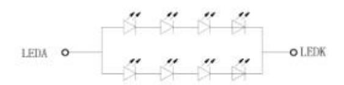
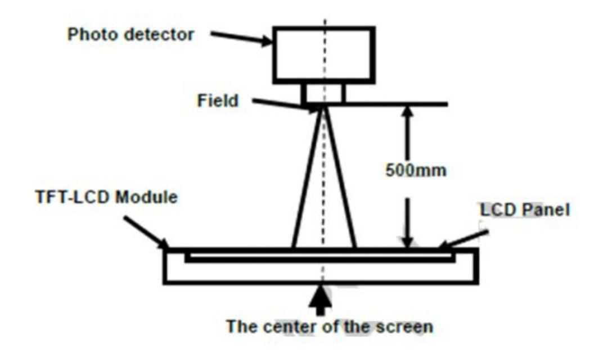
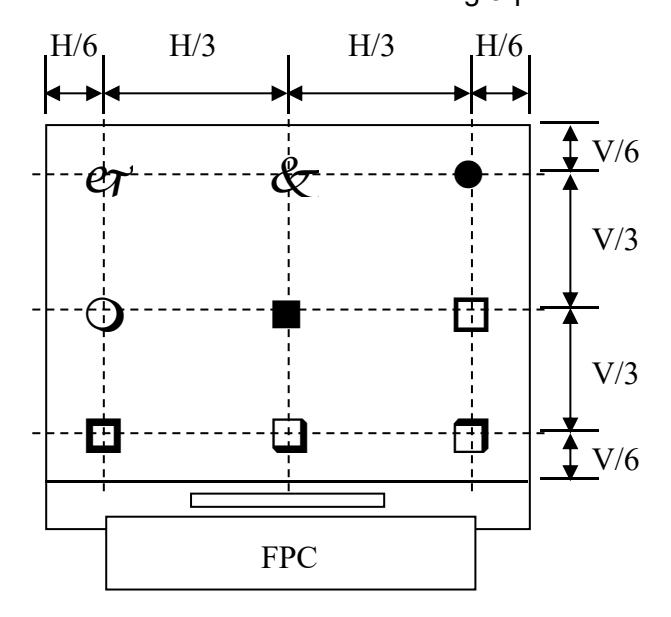
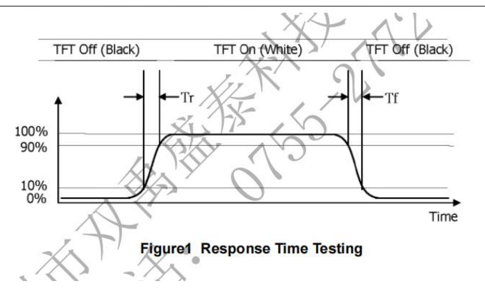
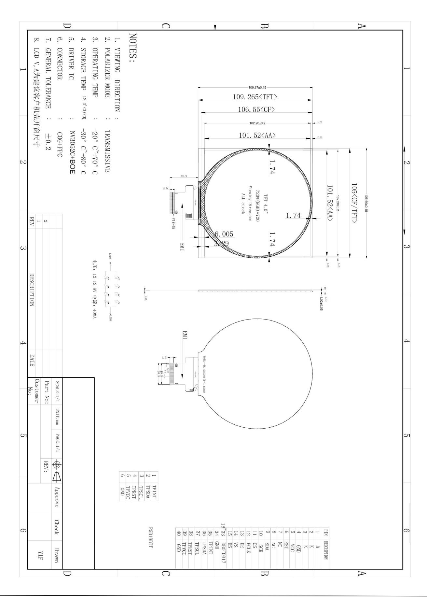
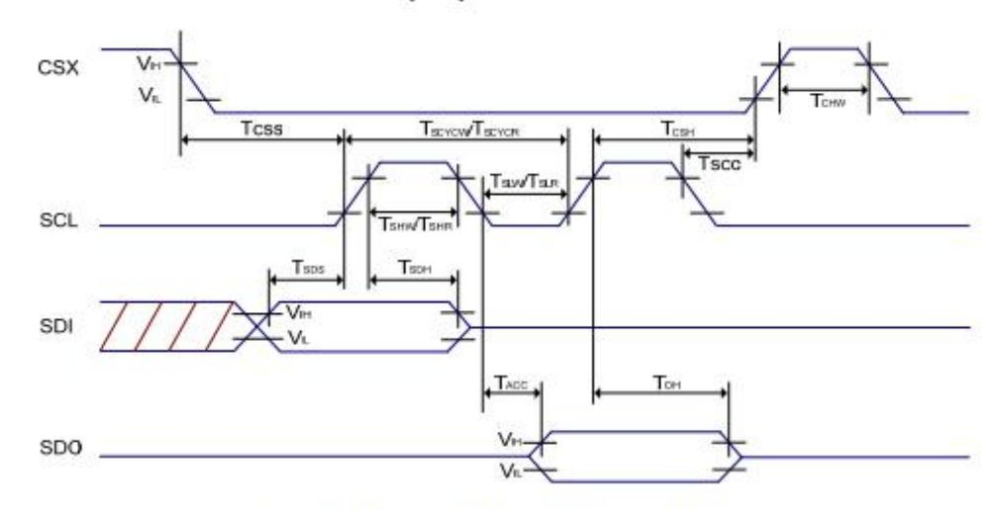
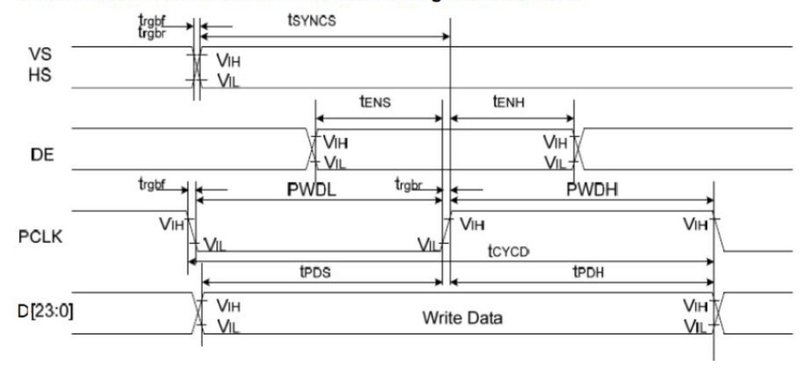

# 深圳华迪创显科技有限公司

**Shenzhen** Huadi Chuangxian TECHNOLOGY CO.,LTD

产品生产商:深圳华迪创显技术有限公司

产品名称 :4.0寸720\*720点阵彩屏模组

规格型号 : HD40015C40-Y

部门确认:

|  | 研发 | 工程 | 品管 | 审核 |
|--|----|----|----|----|
|  |    |    |    |    |

印 章:

日 期:

客户回签:

| 采购 | 工程 | 品管 | 确认 |  |
|----|----|----|----|--|
|    |    |    |    |  |

印 章:

日期:

# **Table of Contents**

|     | REVISION HISTORY                          | 3 |
|-----|-------------------------------------------|---|
| 1.  | GENERAL DESCRIPTION······                 | 4 |
|     | 1.1 DESCRIPTION·····                      | 4 |
|     | 1.2 GENERAL INFORMATION                   | 4 |
| 2.  | ABSOLUTE MAXIMUM RATING······             | 5 |
| 3.  | ELECTRICAL CHARACTERISTICS······          | 6 |
|     | 3.1 LCM DC CHARACTERISTICS                |   |
|     | 3.2 BACK-LIGHT UNIT CHARACTERISTICS······ | 6 |
| 4.  | OPTICAL CHARACTERISTICS······             | 7 |
| 5.  | MODULE OUTLINE DIMENSION 1                | 0 |
| 6.  | MODULE INTERFACE DESCRIPTION1             | 1 |
| 7.  | REFERENCE APPLICATION CIRCUIT·······1     | 2 |
| 8.  | AC Charateristics1                        | 2 |
| 9.  | RELIABILITY TEST CONDITIONS1              | 4 |
| 10. | PACKING 1                                 | 4 |
| 11. | INSPECTION CRITERION1                     | 5 |
| 10  | CENERAL PRECAUTIONS                       | 0 |

### **REVISION HISTORY**

| Rev | Description     | Page | Date       |
|-----|-----------------|------|------------|
| 1.0 | Initial Release | All  | 2022-08-29 |
|     |                 |      |            |
|     |                 |      |            |
|     |                 |      |            |
|     |                 |      |            |
|     |                 |      |            |
|     |                 |      |            |
|     |                 |      |            |
|     |                 |      |            |
|     |                 |      |            |
|     |                 |      |            |
|     |                 |      |            |
|     |                 |      |            |
|     |                 |      |            |
|     |                 |      |            |
|     |                 |      |            |
|     |                 |      |            |
|     |                 |      |            |
|     |                 |      |            |
|     |                 |      |            |
|     |                 |      |            |
|     |                 |      |            |
|     |                 |      |            |
|     |                 |      |            |
|     |                 |      |            |
|     |                 |      |            |

### 1. GENERAL DESCRIPTION

### 1.1 DESCRIPTION

HD40015C40-Y is a transmissive type color active matrix TFT (Thin Film Transistor) liquid crystal display (LCD) that uses amorphous silicon TFT as a switching device. This model is composed of a TFT-LCD module (TFT-LCD panel, driver IC and FPC), a back-light unit and. The resolution of 4.0" contains 720 RGB X720 pixels and can display up to 16.7m colors.

### 1.2 GENERAL INFORMATION

| Items               | Specification                   | Unit   | Note |
|---------------------|---------------------------------|--------|------|
| Drive element       | a-Si TFT                        | -      | -    |
| LCM outline size    | ine size 109.87 (H) x 105.6 (V) |        |      |
| Active area         | 101.52 (H) x 101.52 (V)         | mm     | -    |
| Number of pixels    | 720(H)X720(V)                   | pixels | -    |
| Pixel arrangement   | el arrangement RGB stripe       |        | -    |
| Pixel Pitch         | 0.047 (H) x 0.141 (V)           | um     | -    |
| Display color       | 16.7m color                     | color  | -    |
| Viewing direction   | ALL                             | -      | -    |
| Controller / Driver | NV3052C-GRB                     | -      | -    |
| Data interface      | 3WSPI+RGB18BIT                  | -      |      |
| Backlight           | 6 White LEDs In Parallels       | -      |      |
| Weight              | TBD                             | g      |      |

### 2. ABSOLUTE MAXIMUM RATING

(Ta=25±2°C, Vss=GND=0V)

| Characteristics           | Symbol           | Min. | Тур | Max. | Uni t | Notes      |
|---------------------------|------------------|------|-----|------|----------|------------|
| Cumply Voltage            | IOVCC            | -0.3 | 1   | 4.5  | V        |            |
| Supply Voltage            | VCI              | -0.3 | 1   | 6.6  | V        |            |
| TFT Gate On voltage       | VGH              | -0.3 | 1   | 32   | V        |            |
| TFT Gate Off voltage      | VGL              | -0.3 | 1   | 32   | V        |            |
| Backlight Forward Current | l F   | -    |     | 40   | mA       |            |
| Operating Temperature     | T OPR | -20  |     | +70  | °C       | (1), (3)   |
| Storage Temperature       | T STG | -30  |     | +80  | °C       | (2), (3)   |
| Humidity                  | RH               | -    |     | 90   | %        | Max. 60 °C |

#### Notes:

- (1) In case of below 0°C, the response time of liquid crystal (LC) becomes slower and the color of panel becomes darker than normal one. Level of retardation depends on temperature, because of the LC characteristics.
- (2) If product is exposed to high temperatures for extended time, there is a possibility of the polarizer film damage which could degrade the optical characteristics.
- (3) Permanent damage to the device may occur if maximum values are exceeded or reverse voltage is loaded.
  - Functional operation should be restricted to the conditions described under normal operating conditions.

### 3. ELECTRICAL CHARACTERISTICS

### 3.1 LCM DC CHARACTERISTICS

(Ta=25±2°C)

| Characteristics          | Symbol                | Min.     | Тур. | Max.     | Unit | Note                  |
|--------------------------|-----------------------|----------|------|----------|------|-----------------------|
| Power Supply Voltage 1   | IOVCC                 | 1.65     | 1.8  | 3.6      | V    |                       |
| Power Supply Voltage 2   | VCI                   | 2.5      | 2.8  | 6.0      | V    |                       |
| Power Supply Voltage 3   | -                     | -        | -    | -        | V    |                       |
| Power Supply for MTP     | VPP                   | -        | -    | -        | V    |                       |
| Current Consumntion      | I DD       | -        | TBD  | -        | mA   | Normal mode           |
| Current Consumption      | I DD-SLEEP |          | TBD  |          | uA   | Sleep mode            |
| Input voltage "L" Level  | V IL       | GND      | -    | 0.3IOVCC | V    | IOVCC=1.65~           |
| Input voltage "H" Level  | V IH       | 0.7IOVCC | -    | IOVCC    | V    | 3.3                   |
| Output voltage "L" Level | V oL       | GND      | -    | 0.2IOVCC | V    | I OL =1mA  |
| Output voltage "H" Level | $V_{\text{oH}}$       | 0.8IOVCC | -    | IOVCC    | V    | I OH =-1mA |

### 3.2 BACK-LIGHT UNIT CHARACTERISTICS

The back-light system is an edge-lighting type with 4 white LEDs. The characteristics of the back-light are shown in the following tables.

(Ta=25±2°C)

|                 |        |                      |        |        |      | ,                 |        |
|-----------------|--------|----------------------|--------|--------|------|-------------------|--------|
| Characteristics | Symbol | Condition            | Min.   | Туре   | Max. | Unit              | Notes  |
| Forward Voltage | Vf     | I L =40mA |        | 12     | 12.8 | V                 | -      |
| Forward current | lι     |                      | -      | 40     | -    | mA                | -      |
| Luminance       | Lv     | I L =40mA |        | 300    | -    | cd/m 2 | -      |
| LED life time   | -      | I L =40mA | 20,000 | 25,000 |      | Hr                | Note 1 |

#### Note:

(1) The "LED life time" is defined as the module brightness decrease to 50% of original brightness at  $I_L$ =20mA. The LED life time could be decreased if operating  $I_L$  is larger than 20mA.

Bcklight circuit diagram shown in below:

电压: 12-12.8V 电流: 40MA

### 4. OPTICAL CHARACTERISTICS

The following items are measured under stable conditions. The optical characteristics should be measured in a dark room.

Measuring equipment: BM-5AS, BM-7, EZ-Contrast.

(Ta=25±2°C)

| Parame                   | ter                               | Symbol         | Condition                            | Min.  | Тур.  | Max.  | Unit              | Note              |
|--------------------------|-----------------------------------|----------------|--------------------------------------|-------|-------|-------|-------------------|-------------------|
| Contrast F (Center po |                                   | C/R            | -                                    | -     | 300   | 320   | -                 | BM-7 Note(2)   |
|                          | Luminance of white (Center point) |                | B/L on                               | 15%   | TBD   | 15%   | cd/m 2 | CA-210            |
| Luminance uniformity     |                                   | Uw             |                                      | 80    | -     | -     | %                 | BM-7 Note(3)   |
| Response                 | Time                              | Tr + Tf        |                                      | -     | 30    | 35    | ms                | BM-5AS Note(4) |
|                          | White                             | W X | $\theta = 0$ .                       | 0.262 | 0.292 | 0.322 |                   |                   |
|                          | vviile                            | Wx             | Normal viewing angle B/L On  Note(1) | 0.307 | 0.337 | 0.367 | _                 |                   |
|                          | Red                               | R X |                                      | 0.620 | 0.650 | 0.680 |                   |                   |
| Color                    |                                   | R Y |                                      | 0.292 | 0.322 | 0.352 |                   | CA-210            |
| Chromaticity (CIE 1931)  | Green                             | G X |                                      | 0.250 | 0.280 | 0.310 |                   | Note(5)           |
|                          |                                   | Gy             |                                      | 0.533 | 0.563 | 0.593 |                   |                   |
|                          | Dluc                              | B X |                                      | 0.105 | 0.135 | 0.165 |                   |                   |
|                          | Blue                              | B Y |                                      | 0.111 | 0.141 | 0.171 |                   |                   |
|                          | Han                               | $\theta_{T}$   |                                      | 80    | 85    | -     |                   |                   |
| Viewing                  | Hor.                              | $\theta_{B}$   | C/D> 10                              | 80    | 85    | -     | D                 | EZ Contrast       |
| Angle                    | Vor                               | θι             | C/R≥10                               | 80    | 85    | -     | Deg               | Note(6)           |
|                          | Ver.                              | $\theta_{R}$   |                                      | 80    | 85    | -     |                   |                   |
| Optima \                 | /iew Dire                         | ction          |                                      |       | ALL   |       |                   | Note(7)           |

\* This condition will be changed by the evaluation circumstance. If product is exposed to high temperatures for extended time, there is a possibility of the polarizer film damage which could degrade the optical characteristics.

#### Notes:

(1) Test Equipment Setup: After stabilizing and leaving the panel alone at a given temperature for 30min, the measurement should be executed. Measurement should be executed in a stable, windless, and dark room 30min after lighting the back-light. This should be measured in the center of screen.

(2) Definition of Contrast Ratio (CR):

(3) Definition of Luminance Uniformity: Active area is divided into 9 measuring areas (Shown in below), every measuring point is placed at the center of each measuring area.

Luminance Uniformity = Min Luminance of white among 9-points

Max Luminance of white among 9-points x100%

The spot locations for luminance measurement

- (4) Definition of Color Chromaticity (CIE 1931)Color coordinate of white & red, green, blue at center point.
- (5) The different Rubbing Direction will cause the different optima view direction.

### **5.MODULE OUTLINE DIMENSION**

## **6.MODULE INTERFACE DESCRIPTION**

| Pin No. | Symbol   | Description                                             |  |  |  |  |
|---------|----------|---------------------------------------------------------|--|--|--|--|
| 1       | LEDA     | Back-light Anode                                        |  |  |  |  |
| 2       | LEDK     | Back-light Cathode                                      |  |  |  |  |
| 3       | LEDK     | Back-light Cathode                                      |  |  |  |  |
| 4       | GND      | Power Ground                                            |  |  |  |  |
| 5       | VCC      | Power supply for interface logic circuits(2.8V-3.3V)    |  |  |  |  |
| 6       | RST      | Reset input pin                                         |  |  |  |  |
| 7       | NC       | NC                                                      |  |  |  |  |
| 8       | NC       | NC                                                      |  |  |  |  |
| 9       | SDA      | Serial data input / output bid irectional pin for SPI . |  |  |  |  |
| 10      | SCK      | Serial clock input for SPI interface .                  |  |  |  |  |
| 11      | CS       | A chip select signal                                    |  |  |  |  |
| 12      | PCLK     | Dot clock signal for RGB interface operation            |  |  |  |  |
| 13      | DE       | Data enable signal for RGB interface operation          |  |  |  |  |
| 14      | VS       | Frame synchronizing signal for RGB interface operation  |  |  |  |  |
| 15      | HS       | Line synchronizing signal for RGB interface operation   |  |  |  |  |
| 16~33   | DB0-DB17 | A 18 - bit parallel data bus for RGB Interface .        |  |  |  |  |
| 34      | GND      | Power Ground                                            |  |  |  |  |
| 35      | TP-INT   | TP-INT                                                  |  |  |  |  |
| 36      | TP-SDA   | TP-SDA                                                  |  |  |  |  |
| 37      | TP-SCL   | TP-SCL                                                  |  |  |  |  |
| 38      | TP-RST   | TP-RST                                                  |  |  |  |  |
| 39      | TP-VCL   | TP-VCL                                                  |  |  |  |  |
| 40      | GND      | Power Ground                                            |  |  |  |  |

### **7.REFERENCE APPLICATION CIRCUIT**

Please consult our technical department for detail information.

### 8. AC Charateristics

### 7.3.3. Serial interface characteristics (SPI)

Figure: 3-pin Serial Interface Characteristics

Table: SPI Interface Characteristics

| Signal | Symbol | Parameter                   | MIN | MAX | Unit | Description                                                |  |
|--------|--------|-----------------------------|-----|-----|------|------------------------------------------------------------|--|
|        | Tess   | Chip select setup time      | 15  | -   | ns   |                                                            |  |
| 102223 | Тсян   | Chip select hold time       | 15  | E.  | ns   | 1                                                          |  |
| CSX    | Tscc   | Chip select setup time      | 20  |     | ns   | 1 -                                                        |  |
|        | Тснw   | Chip "H" pulse width        | 40  | *   | ns   | 1                                                          |  |
|        | Tscycw | Serial clock cycle (Write)  | 66  | -   | ns   |                                                            |  |
|        | Tshw   | SCL "H" pulse width (Write) | 10  | Ē.  | ns   | - W                                                        |  |
| 0.01   | Tslw   | SCL "L" pulse width (Write) | 10  | ě   | ns   |                                                            |  |
| SCL    | Tscycr | Serial clock cycle (Read)   | 150 |     | ns   |                                                            |  |
|        | Tshr   | SCL"H" pulse width (Read)   | 60  | *   | ns   | -                                                          |  |
|        | TSLR   | SCL"L" pulse width (Read)   | 60  | -   | ns   |                                                            |  |
|        | TSDS   | Data setup time             | 10  | ¥   | ns   |                                                            |  |
|        | TSDH   | Data hold time              | 10  | -   | ns   | 3.53                                                       |  |
| SDI    | Tacc   | Access time                 | 10  | 50  | ns   | For maximum                                                |  |
|        | Тон    | Output disable time         | 15  | 50  | ns   | C L =30pF For minimum C L =8pF |  |

### 7.3.2. Parallel 24/18/16-bit RGB Interface Timing Characteristics

| Signal  | Symbol       | Parameter                 | min | max | Unit | Description  |
|---------|--------------|---------------------------|-----|-----|------|--------------|
| VC/HC   | tsyncs       | VS/HS setup time          | 5   | -   | ns   |              |
| VS/HS   | tsynch       | VS/HS hold time           | 5   | -   | ns   |              |
| DE      | tens         | DE setup time             | 5   | -   | ns   |              |
| DE      | tenh         | DE hold time              | 5   | -   | ns   | 24/18/16-bit |
| D[22.0] | tpos         | Data setup time           | 5   | -   | ns   | bus RGB      |
| D[23:0] | <b>t</b> PDH | Data hold time            | 5   | -   | ns   | interface    |
|         | PWDH         | PCLK high-level period    | 13  | -   | ns   | mode         |
| PCLK    | PWDL         | PCLK low-level period     | 13  | -   | ns   |              |
|         | tcycd        | PCLK cycle time           | 28  | -   | ns   |              |
|         | trgbr, trgbf | PCLK,HS,VS rise/fall time | -   | 15  | ns   |              |

### **9.RELIABILITY TEST CONDITIONS**

| No. | Test Item                          | Test Condition                          | Notes                                                                                                                                 |
|-----|------------------------------------|-----------------------------------------|---------------------------------------------------------------------------------------------------------------------------------------|
| 1   | High Temperature Storage           | +80°C / 240H                            | Inspection after                                                                                                                      |
| 2   | Low Temperature Storage            | -30°C / 240H                            | 2~4h storage at room temperature,                                                                                                     |
| 3   | High Temperature Operating         | +70°C / 240H                            | the sample shall be                                                                                                                   |
| 4   | Low Temperature Operating          | -20°C / 240H                            | free from defects:                                                                                                                    |
| 5   | Temperature Cycle                  | Ta=-10°C~+25~+50°C,10 Cycle,per30min | 1. Air bubble in the LCD; 2. Seal leak;                                                                                               |
| 6   | High Temperature /Humidity storage | 60°C ,90%RH / 240H                      | 3. Non-display; 4. Missing                                                                                                            |
| 7   | ESD test                           | Open Cell , Air mode , + 2 KV           | segments; 5.Glass crack; 6. The surface shall be free from damage. 7. The electrical characteristics requirements shall be satisfied. |

### Remarks:

- (1) The test samples should be applied to only one test item.
- (2) Sample size for each test item is 5~10pcs.
- (3) For High Temperature/Humidity storage test, pure water (resistance>10M $\Omega$ ) should be used.
- (4) In case of malfunction defect caused by ESD damage, if it would be recovered to normal state after resetting, it would be judge as a good part.
- (5) Failure judgment criterion: basic specification, electrical characteristic, mechanical characteristic, optical characteristic.

### 10.PACKING SPECIFICATION

**TBD** 

## 11.INSPECTION CRITERION

|   |                                                                                                                                        |                                                                                                                                                                          |                            | Judgement stan                                                                                                                          | ıdard                  |          |
|---|----------------------------------------------------------------------------------------------------------------------------------------|--------------------------------------------------------------------------------------------------------------------------------------------------------------------------|----------------------------|-----------------------------------------------------------------------------------------------------------------------------------------|------------------------|----------|
|   | Inspe                                                                                                                                  | ction item                                                                                                                                                               |                            |                                                                                                                                         | Acceptabl              | e number |
|   | ·                                                                                                                                      |                                                                                                                                                                          |                            | Category                                                                                                                                | A zone                 | B zone   |
|   | Black spot, White s Bright Spot, Pinhold Foreign Particle, Bubble and Particle Between polarizer a glass, scratch on po | be and $\Phi = (a+b)/2(mm)$                                                                                                                                              | A B C                | $\begin{array}{c} \Phi \! \leq \! 0.10 \\ 0.10 \! < \! \Phi \! \leq \! 0.20 \\ \Phi \! > \! 0.2 \end{array}$ Total defective point(B,C) | Ignored 2 0            | Ignored  |
|   | у                                                                                                                                      | Bright spot                                                                                                                                                              |                            | 0.15<Φ≦0.20                                                                                                                             | N≤2                    | Ignored  |
|   |                                                                                                                                        | Dark spot/ Black spot                                                                                                                                                    |                            | 0.15<Φ≦0.20                                                                                                                             | N≤2                    |          |
| 1 | Direct makes                                                                                                                           | Attached to the two pixels a bright spots                                                                                                                                | are                        | 0.15<Φ≦0.20                                                                                                                             | N≤2                    |          |
|   | Pixel point defect                                                                                                                     | Even a two pixel is dark                                                                                                                                                 |                            | 0.15<Φ≦0.20                                                                                                                             | N≤2                    |          |
|   |                                                                                                                                        | Pixel total number                                                                                                                                                       |                            | 0.15<Φ≦0.20                                                                                                                             | N≤2                    |          |
|   |                                                                                                                                        | Note1: the spot defect caused by foreign matter is judged according to the defect of the foreign body.  Note 2: when the light is not wired to show the type of defects. |                            |                                                                                                                                         |                        |          |
| 2 | Black line, White line, Bubble and Particle Between Polarizer and                                                             | W                                                                                                                                                                        | A B C                | W≤0.03 L≤3.0 0.03 <w≤0.05 l≤3.0<br="">0.05<w< td=""><td>Ignored 2 0</td><td>Ignored</td></w<></w≤0.05>                       | Ignored 2 0      | Ignored  |
|   | glass, Scratch on polarizer                                                                                                         | L W:Width, L:Length(mm)                                                                                                                                               |                            | Total defective point(B,C)                                                                                                              | 2                      |          |
| 3 | Contrast variation                                                                                                                  | b                                                                                                                                                                        | A B C                | Φ≦0.1 0.1<Φ≦0.3 Φ>0.3                                                                                                             | Ignored 2 0      | Ignored  |
|   |                                                                                                                                        | $ \leftarrow \xrightarrow{a} $ $\Phi = (a+b)/2(mm)$                                                                                                                      | Total defective point(B,C) |                                                                                                                                         | 2                      |          |
| 4 | Bubble inside cell                                                                                                                     |                                                                                                                                                                          |                            | any size                                                                                                                                | none                   | none     |
|   | Polarizer defect                                                                                                                       | Scratch and damage on polarizer, particle on polarizer or between polarizer and glass.                                                                                   | Refe                       | er to item 1 and item 2.                                                                                                                |                        |          |
| 5 | (if Polarizer is used)                                                                                                                 | Bubble, dent and convex                                                                                                                                                  | A B C                |                                                                                                                                         | Ignored 2 0 2 | Ignored  |

|   |                 |                              |        | Judgement standard                                                                                                                                                                                                                                                                                                                                                                                                                                                                              |        |  |
|---|-----------------|------------------------------|--------|-------------------------------------------------------------------------------------------------------------------------------------------------------------------------------------------------------------------------------------------------------------------------------------------------------------------------------------------------------------------------------------------------------------------------------------------------------------------------------------------------|--------|--|
|   | Inspection item | Catamani                     |        | Acceptable number                                                                                                                                                                                                                                                                                                                                                                                                                                                                               |        |  |
|   |                 | Category                     |        | A zone                                                                                                                                                                                                                                                                                                                                                                                                                                                                                          | B zone |  |
|   | Surplus glass   | ①Stage surplus glass         |        | b≦0.3mm                                                                                                                                                                                                                                                                                                                                                                                                                                                                                         |        |  |
| 6 |                 | glass                        | urplus | Should not influence outline dimension and assembling.                                                                                                                                                                                                                                                                                                                                                                                                                                          |        |  |
| 7 | MURA            | ①MURA                        |        | Naked eye examination: red, green, blue screen does not allow the appearance, black screen requires visual is not obvious, the specific reference limit samples.  Note: the principle of closing the sample is to be installed on the whole machine and the end user will not find it in the normal usage scenario.  Inspection basis: 6%ND  (MURA mainly in the black screen and indoor light is relatively dark will be found, it is recommended to turn off the indoor lighting inspection.) |        |  |
|   |                 | ②Point Black / WIpoint(MURA) | hite / | 1, under the black / gray screen check: D≤0. 10mm   Ignored; 0. 10mm \ D≤0. 3mm, N≤2; D>0. 3mm: Unqualified。 2, switch to the red, green, blue in which any one of the screen appears black or white or point to point white or point of failure.                                                                                                                                                                                                                                               |        |  |

|                            |                                                                                                                                                                                                                                                                                               |     | Judgment standard                                                                                                      |  |  |
|----------------------------|-----------------------------------------------------------------------------------------------------------------------------------------------------------------------------------------------------------------------------------------------------------------------------------------------|-----|------------------------------------------------------------------------------------------------------------------------|--|--|
| Inspection item            |                                                                                                                                                                                                                                                                                               |     | Category(application: B zone)                                                                                          |  |  |
|                            | ①The front of lead terminals                                                                                                                                                                                                                                                                  | Α   | If a ≦ t and b ≦ 1.0, c is not limited                                                                                 |  |  |
|                            |                                                                                                                                                                                                                                                                                               | В   | a≦t, 1≦b≦2mm, c≦3mm                                                                                                    |  |  |
|                            | b                                                                                                                                                                                                                                                                                             | С   | If glass crack cover alignment mark, b ≦ 0.5mm.                                                                        |  |  |
|                            | w t                                                                                                                                                                                                                                                                                           | D   | Crack at two sids of lead terminals should not cover patterns and alignment mark                                       |  |  |
| Glass 8 defect crack | ②Surrounding crack—non-contact side  seal  Outer border line of the seal Outer border line of the seal  Inner border line of the seal  Outer border line of the seal Outer border line of the seal  Outer border line of the seal Outer border line of the seal Outer border line of the seal | b < | Inner borderline of the seal Solution of the seal $a \leq t, b \leq 3.0, c \leq 3.0$ Solutions cover patterns used for |  |  |

|   |               | Inspection item                                                                                                                                                                                                                                                                                          | Judgement standard                                                                                     |
|---|---------------|----------------------------------------------------------------------------------------------------------------------------------------------------------------------------------------------------------------------------------------------------------------------------------------------------------|--------------------------------------------------------------------------------------------------------|
| 9 | FPC defect | Component soldering: No cold soldering, short/open circuit, burr, tin ball.  The flat encapsulation component position deviation must be less than 1/2 width of the pin (Pic.1);  The sheet component deviation: pin deviates from the pad and contact with the near components is not permitted (Pic.2) | Component  L  W/2                                                                                      |
|   |               | lead defect: The lead lack must be less than 1/2of its width; The lead burr must be less than 1/2 of the seam; Impurities connect with the near leads is not permitted                                                                                                                                   | Soldering pad Lead  L1>0                                                                               |
|   |               | Connector soldering: Soldering tin is at contact position of the plug and socket is not permitted No foundation is scald Serious cave distortion on plug and socket contact pin is not permitted                                                                                                         | Soldering tin is not permit in this area  Soldering tin is not permit in this area  Socket  Base Board |

### **12.GENERAL PRECAUTIONS**

### 1.1 HANDING

- (1) When the module is assembled, it should be attached to the system firmly. Be careful not to twist and bent the module.
- (2) Refrain from strong mechanical shock and / or any force to the module. In addition to damage, this may cause improper operation or damage to the module and back-light unit.
- (3) Note that display modules are very fragile and could be easily damaged. Do not press or scratch the surface harder than a HB pencil lead.
- (4) Wipe off water droplets or oil immediately. If you leave the droplets for a long time, straining and discoloration may occur.
- (5) If the display module surface becomes contaminated, breathe on the surface and gently wipe it with a soft dry cloth. If it is heavily contaminated, should be wiped by moisten cloth with isopropyl alcohol or ethyl alcohol solvents, DO NOT with water, ketone type materials (e.g. acetone), aromatic, toluene, ethyl acid or methyl chloride, and so on.
- (6) If the liquid crystal material leaks from the panel, it should be kept away from the eyes or mouth. In case of contact with hands, legs or clothes, it must be washed away thoroughly with soap.
- (7) Use finger-stalls with sort gloves in order to keep display clean during the incoming inspection and assembly process.
- (8) Protection film for polarizer on the module shall be slowly peeled off just before use so that the electrostatic charge can be minimized.
- (9) Do not touch directly conductive parts such as the CMOS LSI pad and the interface terminals with bare hands, therefore operations should be grounded whenever he/she comes into contact with the modules.
- (10) Do not exceed the absolute maximum rating value. (The supply voltage variation, input voltage variation, variation in part contents and environmental temperature, and so on), otherwise the module may be damaged.

### 1.2 SOLDERING

- (1) Use soldering irons with proper grounding and no leakage.
- (2) For No RoHS Product: soldering temperature is 290~350°C, soldering time is 3~5s; for RoHS Product: soldering temperature is 340~370°C, soldering time is 3~5s.
- (3) If soldering flux is used, be sure to remove any remaining flux after soldering (This does not apply in the case of a non-halogen type of flux).

#### 1.3 STORAGE

- (1) DO NOT leave the module in high temperature and high humidity for a long times, keep the temperature from 0°C to 35°C and relative humidity of less than 60%.
- (2) It is highly recommended to store the module in a dark place. The Liquid crystal is deteriorated by ultraviolet, DO NOT leave it in direct sunlight and strong ultraviolet ray for many hours.