# DATA SHEET NV3052CGRB

2160-channel 8-bit Source Driver and GOA/GIP Gate Driver with System-on chip for Color Amorphous TFT-LCDs

> Version 0.2 Sep. 2021

# Contents

| 1.lı | ntroduction                                                  | 4  | 4 |
|------|--------------------------------------------------------------|----|---|
|      | eatures                                                      |    | _ |
| 3. l | Block Diagram                                                | '  | 7 |
| 3    | 3.1 Block Function:                                          | 7  | 1 |
|      | 3.1.1 System interface                                       |    |   |
|      | 3.1.2 Grayscale voltage generating circuit                   | 8  | ; |
|      | 3.1.3 Timing controller                                      |    |   |
|      | 3.1.4 Oscillator (OSC)                                       | 8  | ; |
|      | 3.1.5 Source driver circuit                                  | 8  | ) |
|      | 3.1.6 Gate driver circuit                                    |    |   |
|      | 3.1.7 LCD driving power supply circuit                       | 8  | ) |
| 4.   | PIN DESCRIPTIONS                                             |    |   |
| 2    | 1.1 Pin Definition                                           | 9  | ) |
| 4    | 2. Power Block Diagram                                       | 13 | j |
|      | 1.3. Power Supply Configuration                              |    |   |
|      | 4.3.1. One Coil + Two MOS (Mode-1, BOOSTM=2'b11)             |    |   |
|      | 4.3.2. Mode 2: One Coil + One MOS (Mode-2 BOOSTM=2'b11)      |    |   |
|      | 4.3.3. Mode 3: Power IC mode (Mode-3 BOOSTM=2'b10)           | 17 | , |
|      | 4.3.4. Mode 4: Two Coil + Two MOS (Mode-4 BOOSTM=2'b11)      |    |   |
|      | 4.3.5. Mode 6: External VSP + VSN Coil (Mode-6 BOOSTM=2'b11) |    |   |
|      | 4.3.6. Mode 8: External VSP and VSN (Mode-8 BOOSTM=2'b01)    |    |   |
| 4    | 1.4 BOM List                                                 |    |   |
|      | 4.4.1. Mode-1: One Coil + Two MOS.                           |    |   |
|      | 4.4.2. Mode-2: One Coil + One MOS.                           |    |   |
|      | 4.4.3. Mode-3: Power IC mode                                 |    |   |
|      | 4.4.4. Mode-4: Two Coil + Two MOS                            |    |   |
|      | 4.4.5. Mode-6: External VSP + VSN Coil                       |    |   |
|      | 4.4.6. Mode-8: External VSP and VSN                          |    |   |
| 5.1  | NSTRUCTIONS                                                  |    |   |
|      | 5.1. Outline                                                 |    |   |
| 5    | 5.2. SYSTEM COMMAND DESCRIPTION                              | 28 | , |
|      | 5.2.1. NOP (00h)                                             |    |   |
|      | 5.2.2. Software Reset(01h)                                   |    |   |
|      | 5.2.3 Read Display ID(04h)                                   |    |   |
|      | 5.2.4. Read Display Power Mode(0Ah)                          |    |   |
|      | 5.2.5. Read Display MADCTL(0BH)                              |    |   |
|      | 5.2.6. Read Display Pixel Format(0CH)                        |    |   |
|      | 5.2.7. Read Display Image Mode(0DH)                          |    |   |
|      | 5.2.8. Read Display Signal Mode(0EH)                         |    |   |
|      | 5.2.9. Read Display Self-Diagnostic Result(0FH)              |    |   |
|      | 5.2.10. Sleep In(10h)                                        |    |   |
|      | 5.2.11. Sleep Out(11H)                                       |    |   |
|      | 5.2.12. Normal Display Mode On(13H)                          | 40 | ) |
|      | ± ♥ × × × ×                                                  |    |   |

| 5.2.13. Display Inversion Off(20H)                  | 41 |
|-----------------------------------------------------|----|
| 5.2.14. Display Inversion On(21H)                   |    |
| 5.2.15. All Pixel Off(22H)                          |    |
| 5.2.16. All Pixels On(23H)                          | 44 |
| 5.2.17. Display Off(28H)                            | 45 |
| 5.2.18. Display On(29H)                             |    |
| 5.2.19. Tearing Effect Line OFF(34H)                | 47 |
| 5.2.20. Tearing Effect Line ON(35H)                 |    |
| 5.2.21. Display Access Control(36H)                 | 49 |
| 5.2.22. Idle Mode Off(38H)                          | 50 |
| 5.2.23. Idle mode on and other mode off (39H)       | 51 |
| 5.2.24. Interface Pixel Format(3AH)                 | 52 |
| 5.2.25. Write Tear Scan Line(44H)                   | 53 |
| 5.2.26. Read Scan Line(45H)                         | 54 |
| 5.2.27. Write Tear Scan Line Width(46H)             | 55 |
| 5.2.28. Read Tear Scan Line Width(47H)              | 56 |
| 5.2.29. Write Display Brightness Value(51H)         | 57 |
| 5.2.30. Read Display Brightness Value(52h)          | 58 |
| 5.2.31. Write CTRL Display Value(53H)               | 59 |
| 5.2.32. Read CTRL Display Value(54H)                | 60 |
| 5.2.33. Read Display ID1(DAH)                       | 61 |
| 5.2.34. Read Display ID2(DBH)                       | 62 |
| 5.2.35. Read Display ID3(DCH)                       | 63 |
| 5.2.36. Read EXTC Command In SPI Mode(F8H)          | 64 |
| 5.2.37. EXTC Command Set enable register (FFH)      | 65 |
| 5.3. Customer Command List and Description          | 68 |
| 5.3.1. WRMADC_EN:0Ah                                |    |
| 5.3.2. RGB interface control:23h                    | 68 |
| 5.3.3. vcom_adj:38H~3Ah                             | 69 |
| 5.3.4. PADCTRL1: 48H                                | 74 |
| 5.3.5. BOOST_CTRL1~4: 80h~83h                       | 74 |
| 5.3.6. EXTPW CTRL1~3:90H~92H                        |    |
| 5.3.7. PUMP CTRL1~4:98H~9BH                         |    |
| 5.3.8. RDEXTCSPI:F8H                                |    |
| 5.3.9. ENEXTC:FFH                                   |    |
| 5.3.10. PGAMVR0~5;PGAMPR0~1;PGAMPK0~9;GAMP0:B0H~C2H |    |
| 5.3.11. NGAMVR0~5;NGAMPR0~1;NGAMPK0~9;GAMN0:D0H~E2H |    |
| 5.3.12. ENEXTC:FFH                                  |    |
| 5.3.13 GIP_VST_1~12:00H~0BH                         |    |
| 5.3.14. GIP_VEND_1~14:20H~2DH                       |    |
| 5.3.15. GIP_CLK_1~8:30H~37H                         |    |
| 5.3.16. GIP_CLKA_1~10:40H~49H                       |    |
| 5.3.17. GIP_CLKB_1~10:50H~59H                       |    |
| 5.3.18. GIP_CLKC_1~10:60H~69H                       |    |
| 5.3.19. GIP_ECLK1~2:70H~71H                         |    |

| 5.3.20. PANELU2D1~44:80H~ABH                                               | 106 |
|----------------------------------------------------------------------------|-----|
| 5.3.21. PANELD2U1~44:B0H~DBH                                               | 108 |
| 5.3.22. GIP_OUT:E0H                                                        | 109 |
| 5.3.23. ENEXTC:FFH                                                         | 110 |
| 6. FUNCTIONS                                                               | 111 |
| 6.1.1 RGB Interface Selection                                              | 111 |
| 6.1.2 RGB Interface Mode Selection                                         | 113 |
| 6.1.3 RGB Interface Timing                                                 | 113 |
| 6.2. Serial Interface (SPI)                                                | 115 |
| 6.2.1. SPI write mode                                                      | 115 |
| 6.2.2. SPI read mode                                                       | 115 |
| 6.3. Sleep Out-Command And Self-Diagnostic Functions Of The Display Module | 116 |
| 6.3.1. Register loading detection                                          | 116 |
| 6.3.2. Functionality detection                                             | 117 |
| 6.4. Power On/Off Sequence                                                 | 118 |
| 6.4.1. Case 1 – RESX line is held high or unstable by host at power on     |     |
| 6.4.2. Case 2 – RESX line is held low or unstable by host at power on      |     |
| 6.4.3. Uncontrolled power off                                              |     |
| 7. ELECTRICAL SPECIFICATION                                                |     |
| 7.1. Absolute Maximum Ratings                                              | 121 |
| 7.2. DC characteristic                                                     |     |
| 7.2.1. Basic DC characteristic                                             |     |
| 7.3. AC characteristic                                                     | 124 |
| 7.3.1. Reset timing characteristics                                        |     |
| 7.3.2. Parallel 24/18/16-bit RGB Interface Timing Characteristics          |     |
| 7.3.3. Serial interface characteristics (SPI)                              |     |
| 8. CHIP INFORMATION                                                        | 128 |
| 8.1. PAD Assignment                                                        | 128 |
| 8.2. PAD Location                                                          | 130 |
| 8.3. Alignment Mark                                                        |     |
| 9. DISCLAIMER                                                              |     |
| Revision history                                                           | 157 |

# **1.Introduction**

The NV3052CGRB, a 16,777,216-color System-on-Chip (SoC) RAMless driver LSI designed for small and medium size TFT LCD display, is capable of supporting up to 720xRGBx1280 pixels in resolution. The 2160-channel source driver can provide true 8-bit resolution and generate 256 Gamma-corrected values with an internal D/A converter.

The NV3052CGRB is able to operate with low IO interface power supply. Incorporating with several charge pumps, the NV3052CGRB can generate various voltage levels by an on-chip power management system for gate and source driver.

The built-in timing controller in the NV3052CGRB can support several functions to meet a wide variety of requirements about portable display applications. It provides SPI system interfaces which can be used to configure the system. It can also achieve high speed display data transmission by using the RGB video mode.

The NV3052CGRB also provides standby mode for power control considerations. For further power control requirements, the dynamic backlight control function, which is based on the image content, is also supported.

# **2. Features**

- ◎ **One-chip solution for color amorphous TFT-LCD**
- ◎ **Display Resolution**
- 720 x RGB x (1280, others), (Source output from S1 to S1080, S1321 to S2400)
- 640 x RGB x (1280, others), (Source output from S1 to S960, S1441 to S2400)
- 600 x RGB x (1280,1024, others), (Source output from S1 to S900, S1501 to S2400)
- 540 x RGB x (1280,960, others), (Source output from S1 to S810, S1591 to S2400)
- ◎ **Display Data Memory: None (RAMless)**
- ◎ **System Interfaces**
- SPI/RGB interface
- ◎ **Dis**p**lay Features**
- Outputs 256γ-corrected values and using an internal true 8-bit resolution D/A converter to achieve 16,777,216 colors
- Built-in digital separate RGB gamma
- ◎ **Display Modes**
- Power saving mode (standby)
- Low power consumption structure for source driver

## ◎ **On Chip Function**

- Support DC-VCOM driving scheme
- RAMless driver with RGB video mode
- Built-in internal oscillator and hardware reset
- On-chip OTP program voltage generator
- Built–in OTP (3 Times) to store ID1~ID3
- Built–in OTP (2 Times) to store gamma curve
- Built–in OTP (1 Time) to store VGMP, VGMN, VCOM calibration
- Built-in 3 power structure modes for application
- Source output voltage level VGMP-AGND: 2.64 ~ 5.85V , VGMN-AGND: -2.51 ~ 5.70V

## ◎ **Power Supply Range**

- External power IC and PFM:
- I/O pads supply voltage (IOVCC): 1.65 ~ 3.6V
- Analog power supply voltage (VCI): 2.5 ~ 3.6V
  - Three-Power Mode:
- I/O pads supply voltage (IOVCC): 1.65 ~ 3.6V

- Analog power supply (VSP):4.5V to 6V
- Analog power supply (VSN):-4.5V to -6V

# 3. Block Diagram

#### 3.1 Block Function:

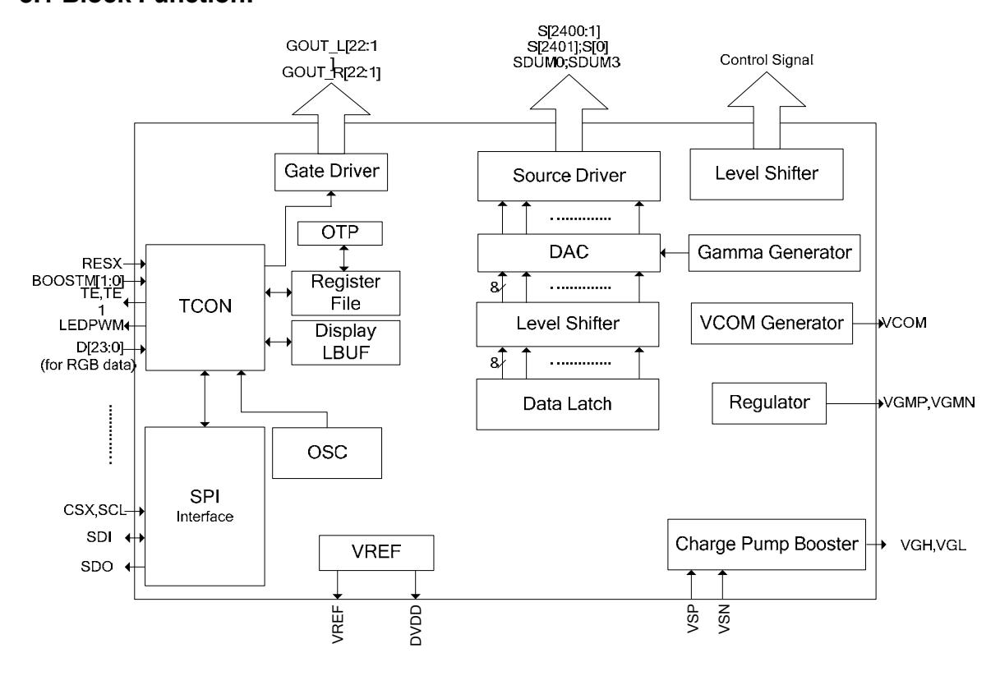

Figure 3.1

#### **3.1.1 System interface**

The NV3052CGRB supports the video data transmitted through the SPI/RGB system interface.

#### **3.1.2 Grayscale voltage generating circuit**

NV3052CGRB has true 8-bit resolution D/A converter, which generates 256 Gammacorrected values and cooperates with OP-AMP structure to enhance display quality. The grayscale voltage can be adjusted by grayscale data set in the γ-correction register and RGB can be adjusted separately.

#### **3.1.3 Timing controller**

NV3052CGRB has a timing controller, which can generate a timing signal for internal circuit operation such as gate output timing, image data accessing timing, etc.

#### **3.1.4 Oscillator (OSC)**

The NV3052CGRB also features an internal oscillator. In standby mode, the oscillator is halted to reduce power consumption.

## **3.1.5 Source driver circuit**

NV3052CGRB consists of a 2160-output source driver circuit (S1 to S1080, S1321 to S2400) and several source dummy outputs (SDUM3;SDUM0;S[2401];S[0]). Data transmitted through RGB video mode are latched when a single line data has been accumulated. And then the latched data controls the source driver and generates a drive waveform.

#### **3.1.6 Gate driver circuit**

NV3052CGRB consists of output gate driver control circuit. The gate driver circuit outputs gate driver signals at either VGH or VGL level.

#### **3.1.7 LCD driving power supply circuit**

The LCD driving power supply circuit generates the voltage levels VGH, VGL and VCOM for driving an LCD. All this voltages can be adjusted by register setting.

# **4. PIN DESCRIPTIONS**

#### **4.1 Pin Definition**

| Signal                | I/O | PAD Type (Voltage Level)    | Function                                                                                                                                                                      |                                                                                  |            |                                 |     |                                                     |                                                                                                  |  |               |   |   |     |                               |
|-----------------------|-----|--------------------------------|-------------------------------------------------------------------------------------------------------------------------------------------------------------------------------|----------------------------------------------------------------------------------|------------|---------------------------------|-----|-----------------------------------------------------|--------------------------------------------------------------------------------------------------|--|---------------|---|---|-----|-------------------------------|
| Global Control Signal |     |                                |                                                                                                                                                                               |                                                                                  |            |                                 |     |                                                     |                                                                                                  |  |               |   |   |     |                               |
| RS[1]                 | I   | Digital Input (IOVCC-VSSI)  | Control chip work state.                                                                                                                                                      | RS[1]="1",chip works at display on mode. RS[1]="0",chip off at sleep in mode. |            |                                 |     |                                                     |                                                                                                  |  |               |   |   |     |                               |
|                       |     |                                | Boost mode selection pins.                                                                                                                                                    |                                                                                  |            |                                 |     |                                                     |                                                                                                  |  |               |   |   |     |                               |
|                       |     |                                | BOOSTM1                                                                                                                                                                       | BOOSTM0                                                                          | REG Option | Mode                            |     |                                                     |                                                                                                  |  |               |   |   |     |                               |
|                       |     |                                | 0                                                                                                                                                                             | 1                                                                                | X          | Mode-8, External VSP and VSN |     |                                                     |                                                                                                  |  |               |   |   |     |                               |
|                       |     |                                | 1                                                                                                                                                                             | 0                                                                                | X          | Mode-3, Power IC                |     |                                                     |                                                                                                  |  |               |   |   |     |                               |
| BOOSTM                | I   |                                |                                                                                                                                                                               |                                                                                  |            |                                 |     |                                                     |                                                                                                  |  | Digital Input | 1 | 1 | 000 | Mode-1, One Coil + Two MOS |
| [1:0]                 |     |                                |                                                                                                                                                                               | (IOVCC-VSSI)                                                                     |            | 1                               | 1   | 001                                                 | Mode-2, One Coil + One MOS                                                                    |  |               |   |   |     |                               |
|                       |     |                                |                                                                                                                                                                               |                                                                                  |            | 1                               | 1   | 011                                                 | Mode-4, Two Coil + Two MOS                                                                    |  |               |   |   |     |                               |
|                       |     |                                |                                                                                                                                                                               |                                                                                  | 1          | 1                               | 100 | Mode-6, External VSP and One Coil + One MOS(VSN) |                                                                                                  |  |               |   |   |     |                               |
|                       |     |                                |                                                                                                                                                                               |                                                                                  |            |                                 |     |                                                     | "REG Option" set by register BOOSTM_OPT[2:0]. These pins must connect to VSSI or IOVCC level. |  |               |   |   |     |                               |
| RESX                  | I   | Digital Input (IOVCC-VSSI)  |                                                                                                                                                                               | Global Reset Signal. Active Low.                                                 |            |                                 |     |                                                     |                                                                                                  |  |               |   |   |     |                               |
| TE                    | O   | Digital Output (IOVCC-VSSI) | Tearing effect output pin is used to synchronize MCU frame writing, activated by S/W command. When this pin is not activated (TE function OFF), this pin is VSSI level. |                                                                                  |            |                                 |     |                                                     |                                                                                                  |  |               |   |   |     |                               |
| TE1                   | O   | Digital Output (IOVCC-VSSI) | Output pin for scan line signal, activated by S/W command. When this pin is not activated, this pin is VSSI level.                                                         |                                                                                  |            |                                 |     |                                                     |                                                                                                  |  |               |   |   |     |                               |
| LEDPWM                | O   | Digital Output (IOVCC-VSSI) |                                                                                                                                                                               | LCD backlight control PWM output pin.                                            |            |                                 |     |                                                     |                                                                                                  |  |               |   |   |     |                               |

| RGB interface         |         |                                |                                                                                                                                                                       |                   |                                                               |                   |  |
|-----------------------|---------|--------------------------------|-----------------------------------------------------------------------------------------------------------------------------------------------------------------------|-------------------|---------------------------------------------------------------|-------------------|--|
| HS                    | I       | Digital Input (IOVCC-VSSI)  | Horizontal synchronic please fix to IOV                                                                                                                               |                   | nal for RGB interface operation.                              | If not used,      |  |
| VS                    | I       | Digital Input                  | •                                                                                                                                                                     | 0 1 0             | l for RGB interface operation. If                             | not used,         |  |
| <b>V</b> 5            | 1       | (IOVCC-VSSI)                   | please fix to the I                                                                                                                                                   |                   |                                                               |                   |  |
| PCLK                  | I       | Digital Input (IOVCC-VSSI)  | Dot clock signal for IOVCC or VSSI.                                                                                                                                   | for RGB interface | e operation. If not used, please fix                          | x this pin at     |  |
|                       |         | Digital Input                  |                                                                                                                                                                       | or RGB interface  | operation. If not used, please fix                            | this pin at       |  |
| DE                    | I       | (IOVCC-VSSI)                   | IOVCC or VSSI level.                                                                                                                                                  |                   |                                                               |                   |  |
| D[23:0]               | I       | Digital Input (IOVCC-VSSI)  | 24-bits data bus for RGB. Please let them float or connect to VSSI.                                                                                                   |                   |                                                               |                   |  |
| SPI Interface         |         |                                |                                                                                                                                                                       |                   |                                                               |                   |  |
| CSX                   | I       | Digital Input (IOVCC-VSSI)  | Chip select signal for SPI interface operation. "0": the NV3052CGRB is accessible "1": the NV3052CGRB is not accessible If not used, please fix to the IOVCC or VSSI. |                   |                                                               |                   |  |
| SCL                   | I       | Digital Input (IOVCC-VSSI)  | SCL: Serial inter If not used, plea                                                                                                                                | -                 |                                                               |                   |  |
| SDI                   | I/O     | Digital I/O (IOVCC-VSSI)    | SDI: Serial inter If not used, plea                                                                                                                                | -                 | *                                                             |                   |  |
| SDO                   | О       | Digital Output (IOVCC-VSSI) | Serial interface I                                                                                                                                                    | OATA output. If   | not used, please let it open.                                 |                   |  |
| <b>Source Control</b> | Signals |                                |                                                                                                                                                                       |                   |                                                               |                   |  |
|                       |         |                                |                                                                                                                                                                       |                   | e D/A converted 256-gray-scal g with different resolution. | le analog voltage |  |
|                       |         |                                |                                                                                                                                                                       | Resolution        | Source channel                                                | •                 |  |
| S[2400:1321]          |         | Analog Output                  |                                                                                                                                                                       | 720RGB            | S[2400:1321], S[1080:1]                                       |                   |  |
| S[1080:1]             | О       | (VSP-VSN)                      |                                                                                                                                                                       | 640RGB            | S[2400:1441], S[960:1]                                        |                   |  |
|                       |         |                                |                                                                                                                                                                       | 600RGB            | S[2400:1501], S[900:1]                                        |                   |  |
|                       |         |                                |                                                                                                                                                                       | 540RGB            | S[2400:1591], S[810:1]                                        |                   |  |
| SDUM[3] S[2401]    | О       | Analog Output (VSP-VSN)     | Source dummy output.                                                                                                                                                  |                   |                                                               |                   |  |
| S[0] SDUM[0]       | О       | Analog Output (VSP-VSN)     | Source dummy output.                                                                                                                                                  |                   |                                                               |                   |  |

| Panel Control and VCOM Pins |                     |               |                                                                               |  |  |
|-----------------------------|---------------------|---------------|-------------------------------------------------------------------------------|--|--|
| GOUT_L [22:1]            | O                   | Analog Output | Gate control signals for panel in left side of IC.                            |  |  |
| GOUT_R [22:1]            | O                   | Analog Output | Gate control signals for panel in right side of IC.                           |  |  |
| VCOM_L                      | O                   | DUMMY Pin     | VCOM DUMMY Pin.                                                               |  |  |
| VCOM_R                      | O                   | Analog Output | VCOM signal output.                                                           |  |  |
|                             | Charge Pump / Boost |               |                                                                               |  |  |
| VSP                         | I                   | Analog Input  | Input voltage from the set-up circuit (4.5V to 6V).                           |  |  |
| VSN                         | I                   | Analog Input  | Input voltage from the set-up circuit (-4.5V to -6V).                         |  |  |
| CSP                         | I                   | Analog Input  | Coil Booster sensing input to generate VSP. Connect to VSP.                   |  |  |
| CSN                         | I                   | Analog Input  | Coil Booster sensing input to generate VSN. Connect to VSN.                   |  |  |
| VGL                         | O                   | Analog Output | Negative Power Supply for Gate Driver. VGL=2xVSN, 3xVSN, 4xVSN, 4xVSN.     |  |  |
| EXTP                        | O                   | Analog Output | Booster/charge pump power IC output to generate VSP.                          |  |  |
| EXTN                        | O                   | Analog Output | Booster/charge pump power IC output to generate VSN.                          |  |  |
| Regulator Relative Pins     |                     |               |                                                                               |  |  |
| VGMP                        | O                   | Analog Output | Output voltage generated from VSP. It's used for positive gray scale voltage. |  |  |
| VGMN                        | O                   | Analog Output | Output voltage generated from VSN. It's used for negative gray scale voltage. |  |  |
| VREF                        | O                   | Analog Output | Reference Voltage for internal voltage generating circuits.                   |  |  |

|        |   | Power Supply and Regulator pins |                                                                                                                                                                  |  |  |
|--------|---|---------------------------------|------------------------------------------------------------------------------------------------------------------------------------------------------------------|--|--|
| VCI    | I | Power Supply                    | Power supply for analog circuits. (VCI=2.5V to 6V)                                                                                                               |  |  |
| IOVCC  | I | Power Supply                    | External Power Supply for IO pads and other logic circuits. (IOVCC=1.65 to 3.6V)                                                                              |  |  |
| PPRECH | I | Power Supply                    | Pre-charge power for source (can be connected to IOVCC or VCI).                                                                                                  |  |  |
| VPP    | I | Power Supply                    | Input power for NV memory programming. Input power range: 8.0V ~ 8.5V (Typical=8.25V). When not under programming, VPP pin can be float or tied to ground. |  |  |
| AGND   | I | Ground                          | Analog Ground for analog circuits.                                                                                                                               |  |  |
| VSSI   | I | Ground                          | I/O Ground for I/O logic circuits.                                                                                                                               |  |  |
| DGND   | I | Ground                          | Digital Ground for digital circuits.                                                                                                                             |  |  |
| RGND   | I | Ground                          | Analog Ground for regulators.                                                                                                                                    |  |  |
| CGND1  | I | Ground                          | Analog Ground for PUMPs.                                                                                                                                         |  |  |
| DVDD   | O | Analog Output                   | Internal Power Supply for Digital Logic Circuits.                                                                                                                |  |  |

| Test/Dummy Signal                                                   |   |                                   |                                                                                                                        |  |  |  |  |
|---------------------------------------------------------------------|---|-----------------------------------|------------------------------------------------------------------------------------------------------------------------|--|--|--|--|
| TEST_EN                                                             | I | Digital Input (IOVCC-VSSI)     | Internal pull low, digital test enable, active high. If not used, please let it open or connect to VSSI.            |  |  |  |  |
| BIST_EN                                                             | I | Digital Input (IOVCC-VSSI)     | Internal pull low, CP test enable, active high. If not used, please let it open or connect to VSSI.                 |  |  |  |  |
| SPI_EN                                                              | I | Digital Input (IOVCC-VSSI)     | Internal pull low, SPI interface operation enable, active high. If not used, please let it open or connect to VSSI. |  |  |  |  |
| CLK_SEL                                                             | I | Digital Input (IOVCC-VSSI)     | Test pin, internal pull low. If not used, please let it open or connect to VSSI.                                    |  |  |  |  |
| EXT_CLK                                                             | I | Digital Input (IOVCC-VSSI)     | Test pin, If not used, please let it open or connect to VSSI.                                                          |  |  |  |  |
| TEST[3:0]                                                           | I | Digital Input (IOVCC-VSSI)     | Test pins. Please let them float or connect to VSSI.                                                                   |  |  |  |  |
| ATEST[1]                                                            | O | Analog test pin out (VSP-RGND) | Analog test pin out, positive output.                                                                                  |  |  |  |  |
| ATEST[2]                                                            | O | Analog test pin out (RGND-VSN) | Analog test pin out, negative output.                                                                                  |  |  |  |  |
| TOUT[3:0]                                                           | O | Digital Output (IOVCC-VSSI)    | Test output pins. Please let them float.                                                                               |  |  |  |  |
| VCOM_DUM                                                            | - | -                                 | Dummy pin. Left it open.                                                                                               |  |  |  |  |
| DUMMYR1                                                             | - | -                                 | Dummy pins. For bonding resistance measurement. There are two pads here, propose to connect them separately.        |  |  |  |  |
| DUMMY/DUMMY1/ DUMMY2                                             | - | -                                 | Bottom of the chip. Dummy pins. They are not used, left it open.                                                       |  |  |  |  |
| DUMMY3- DUMMY30/DUMMY103 - DUMMY222/ DUMMY295- DUMMY322 | - | -                                 | Top of the chip. Dummy pins. They are not used, left it open.                                                          |  |  |  |  |

#### **4.2. Power Block Diagram**

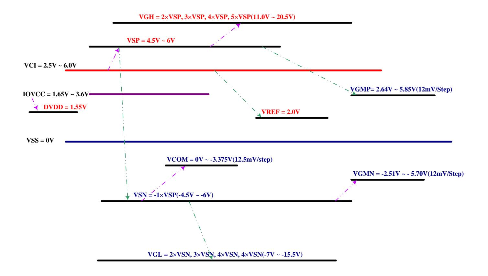

# **4.3. Power Supply Configuration**

Six power structures for different applications controlled by BOOSTM[1:0] pins and REG option, like the following table.

| BOOSTM1 | BOOSTM0 | REG Option Mode    |                                                     |
|---------|---------|-----------------------|-----------------------------------------------------|
| 0       | 1       | X                     | Mode-8, External VSP and VSN                        |
| 1       | 0       | X Mode-3, Power IC |                                                     |
| 1       | 1       | 000                   | Mode-1, One Coil + Two MOS                          |
| 1       | 1       | 001                   | Mode-2, One Coil + One MOS                          |
| 1       | 1       | 011                   | Mode-4, Two Coil + Two MOS                          |
| 1       | 1       | 100                   | Mode-6, External VSP and One Coil + One MOS(VSN) |

&quot;REG Option" locates at page1 R80h D[2:0].

These pins must connect to VSSI or IOVCC level.

#### **4.3.1. One Coil + Two MOS (Mode-1, BOOSTM=2'b11)**

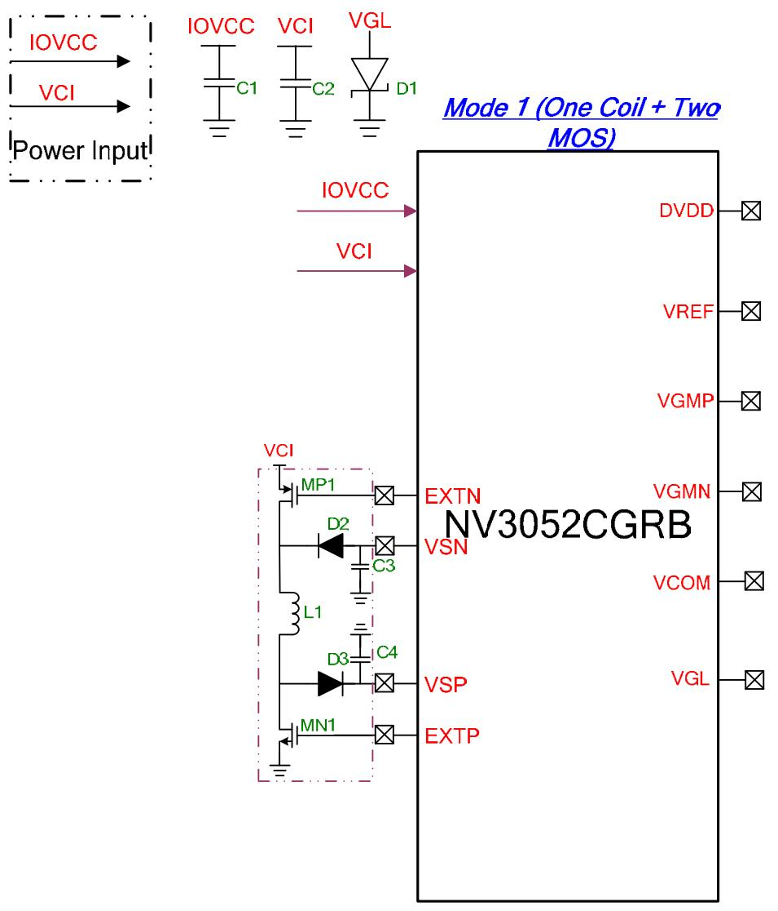

Fig 4.1

#### **4.3.2. Mode 2: One Coil + One MOS (Mode-2 BOOSTM=2'b11)**

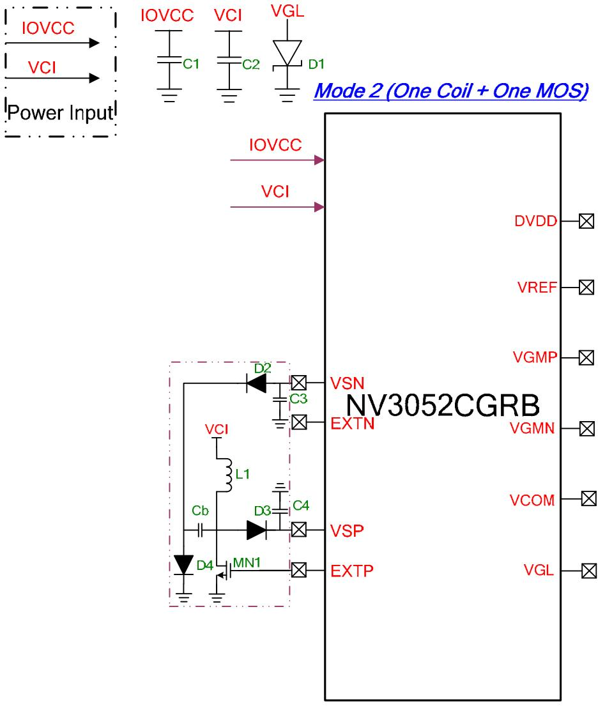

Fig 4.2

#### **4.3.3. Mode 3: Power IC mode (Mode-3 BOOSTM=2'b10)**

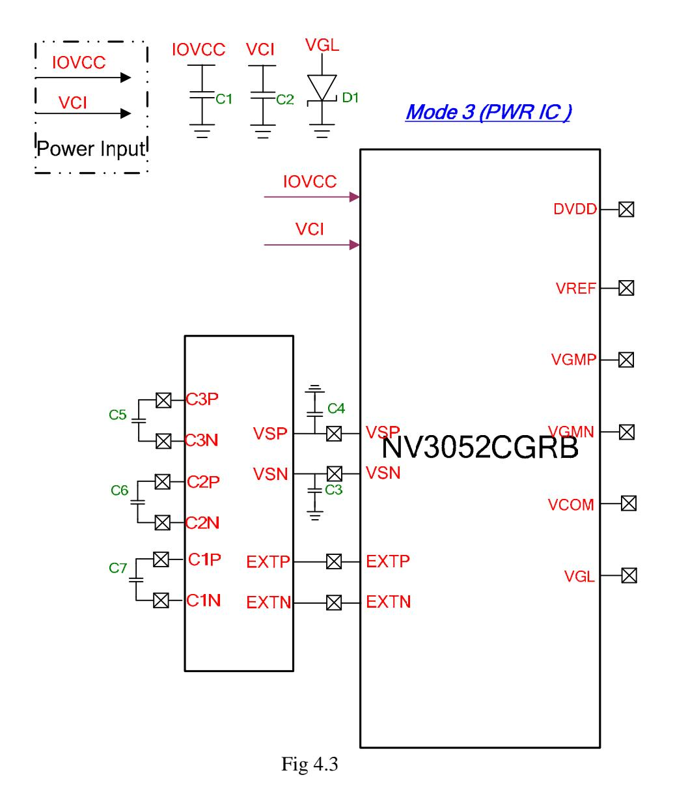

#### **4.3.4. Mode 4: Two Coil + Two MOS (Mode-4 BOOSTM=2'b11)**

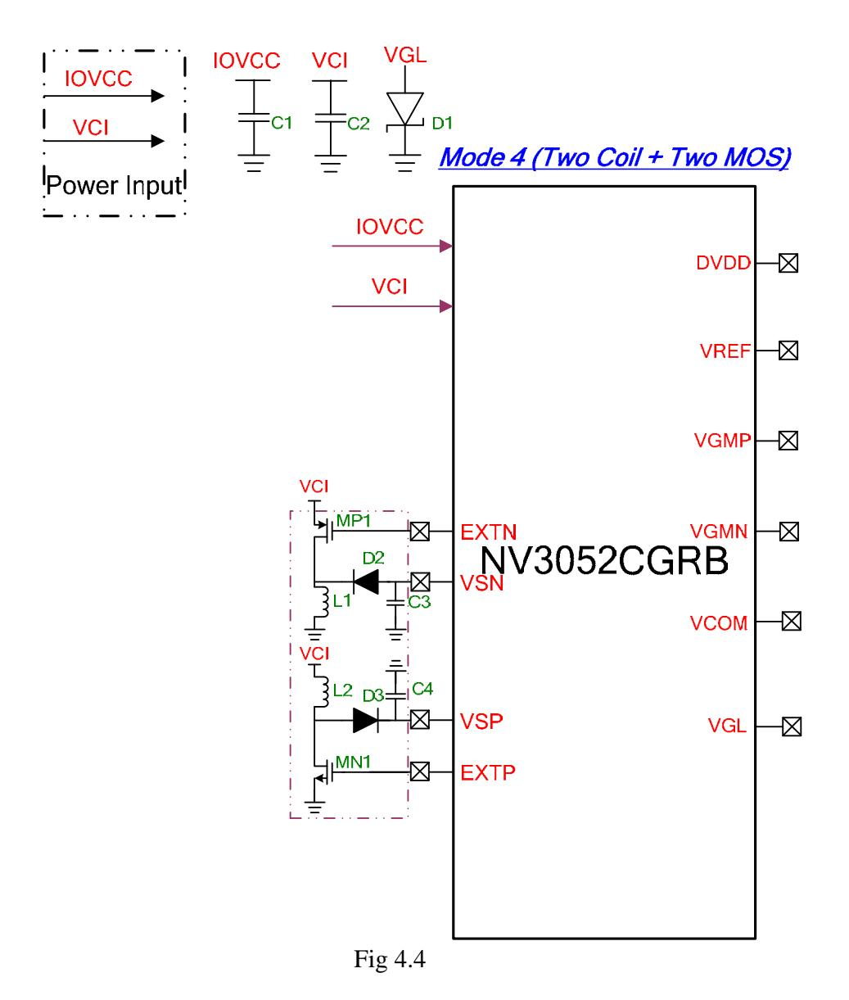

# 4.3.5. Mode 6: External VSP + VSN Coil (Mode-6 BOOSTM=2'b11)

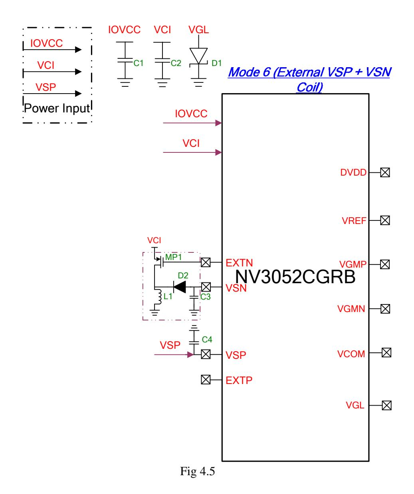

#### **4.3.6. Mode 8: External VSP and VSN (Mode-8 BOOSTM=2'b01)**

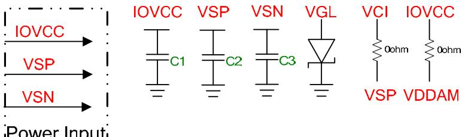

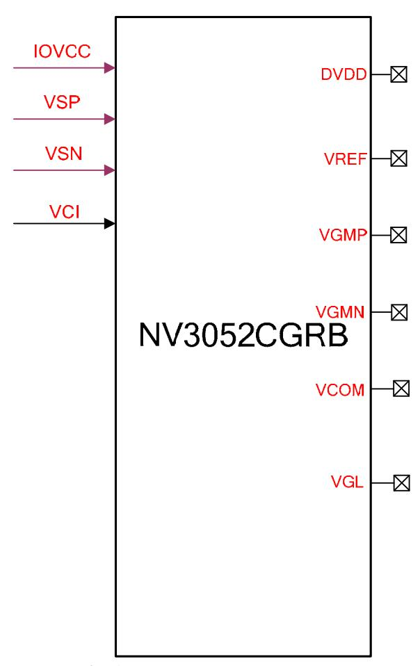

Fig 4.6

#### **4.4 BOM List**

**4.4.1. Mode-1: One Coil + Two MOS** 

|     | NV3052CGRB BOM Lists for WXGA (VSP and VSN use one Coil-Booster) |                |             |                       |  |  |  |  |  |  |
|-----|------------------------------------------------------------------|----------------|-------------|-----------------------|--|--|--|--|--|--|
| No. | Signal name                                                      | Values         | Max ability | Note                  |  |  |  |  |  |  |
| 1   | IOVCC(C1)                                                        | 1.0uF          | 4V          | I/O and Digital Power |  |  |  |  |  |  |
| 2   | VCI(C2)                                                          | 2.2uF          | 6.3V        | Analog Power          |  |  |  |  |  |  |
| 3   | L1                                                               | 10uH           |             |                       |  |  |  |  |  |  |
| 4   | Power PMOS(MP1) +Diode(D2)                                    |                |             |                       |  |  |  |  |  |  |
| 5   | Power NMOS(MN1) +Diode(D3)                                    |                |             | VSP/VSN Booster       |  |  |  |  |  |  |
| 6   | VSN(C3)                                                          | 2.2uF          | 6.3V        |                       |  |  |  |  |  |  |
| 7   | VSP(C4)                                                          | 2.2uF          | 6.3V        |                       |  |  |  |  |  |  |
| 8   | VGL(D1)                                                          | schottky diode |             | GND-VGL diode         |  |  |  |  |  |  |

Note: Larger L1/VSP/VSN component values are proposed to get better power efficiency and stability.

**4.4.2. Mode-2: One Coil + One MOS** 

|     | NV3052CGRB BOM Lists for WXGA (VSP and VSN use one Coil-Booster & one Cap) |                |             |                       |  |  |  |  |  |  |
|-----|----------------------------------------------------------------------------|----------------|-------------|-----------------------|--|--|--|--|--|--|
| No. | Signal name                                                                | Values         | Max ability | Note                  |  |  |  |  |  |  |
| 1   | IOVCC(C1)                                                                  | 1.0uF          | 4V          | I/O and Digital Power |  |  |  |  |  |  |
| 2   | VCI(C2)                                                                    | 2.2uF          | 6.3V        | Analog Power          |  |  |  |  |  |  |
| 3   | L1                                                                         | 10uH           |             |                       |  |  |  |  |  |  |
| 4   | Power NMOS(MN1) +3Diode(D2, D3, D4)                                     |                |             |                       |  |  |  |  |  |  |
| 5   | Cb                                                                         | 1.0uF          | 10V         | VSP/VSN Booster       |  |  |  |  |  |  |
| 6   | VSN(C3)                                                                    | 2.2uF          | 6.3V        |                       |  |  |  |  |  |  |
| 7   | VSP(C4)                                                                    | 2.2uF          | 6.3V        |                       |  |  |  |  |  |  |
| 8   | VGL(D1)                                                                    | schottky diode |             | GND-VGL diode         |  |  |  |  |  |  |

Note: Larger L1/VSP/VSN component values are proposed to get better power efficiency and stability.

**4.4.3. Mode-3: Power IC mode** 

|     | NV3052CGRB BOM Lists for WXGA |                |             |                       |  |  |  |  |  |
|-----|-------------------------------|----------------|-------------|-----------------------|--|--|--|--|--|
| No. | Signal name                   | Values         | Max ability | Note                  |  |  |  |  |  |
| 1   | IOVCC(C1)                     | 1.0uF          | 4V          | I/O and Digital Power |  |  |  |  |  |
| 2   | VCI(C2)                       | 2.2uF          | 6.3V        | Analog Power          |  |  |  |  |  |
| 3   | C5(C3P/C3N)                   | 1.0uF          | 6.3V        |                       |  |  |  |  |  |
| 4   | C6(C2P/C2N)                   | 1.0uF          | 6.3V        |                       |  |  |  |  |  |
| 5   | C7(C1P/C1N)                   | 1.0uF          | 6.3V        | NV7052 related        |  |  |  |  |  |
| 6   | VSN(C3)                       | 2.2uF          | 6.3V        |                       |  |  |  |  |  |
| 7   | VSP(C4)                       | 2.2uF          | 6.3V        |                       |  |  |  |  |  |
| 8   | VGL(D1)                       | schottky diode |             | GND-VGL diode         |  |  |  |  |  |

Note: Larger VSP/VSN component values are proposed to get better power efficiency and stability.

**4.4.4. Mode-4: Two Coil + Two MOS** 

|     | NV3052CGRB BOM Lists for WXGA (VSP Coil-Booster and VSN Coil-Booster) |                |             |                       |  |  |  |  |  |  |  |
|-----|-----------------------------------------------------------------------|----------------|-------------|-----------------------|--|--|--|--|--|--|--|
| No. | Signal name                                                           | Values         | Max ability | Note                  |  |  |  |  |  |  |  |
| 1   | IOVCC(C1)                                                             | 1.0uF          | 4V          | I/O and Digital Power |  |  |  |  |  |  |  |
| 2   | VCI(C2)                                                               | 2.2uF          | 6.3V        | Analog Power          |  |  |  |  |  |  |  |
| 3   | L1                                                                    | 10uH           |             |                       |  |  |  |  |  |  |  |
| 4   | Power PMOS(MP1) +Diode(D2)                                         |                |             | VSN Booster           |  |  |  |  |  |  |  |
| 5   | VSN(C3)                                                               | 2.2uF          | 6.3V        |                       |  |  |  |  |  |  |  |
| 6   | L2                                                                    | 10uH           |             |                       |  |  |  |  |  |  |  |
| 7   | Power NMOS(MN1) +Diode(D3)                                         |                |             | VSP Booster           |  |  |  |  |  |  |  |
| 8   | VSP(C4)                                                               | 2.2uF          | 6.3V        |                       |  |  |  |  |  |  |  |
| 9   | VGL(D1)                                                               | schottky diode |             | GND-VGL diode         |  |  |  |  |  |  |  |

Note: Larger L1/L2/VSP/VSN component values are proposed to get better power efficiency and stability.

**4.4.5. Mode-6: External VSP + VSN Coil** 

|     | NV3052CGRB BOM Lists for WXGA (External VSP and VSN Coil-Booster) |                |             |                       |  |  |  |  |  |  |
|-----|-------------------------------------------------------------------|----------------|-------------|-----------------------|--|--|--|--|--|--|
| No. | Signal name                                                       | Values         | Max ability | Note                  |  |  |  |  |  |  |
| 1   | IOVCC(C1)                                                         | 1.0uF          | 4V          | I/O and Digital Power |  |  |  |  |  |  |
| 2   | VCI(C2)                                                           | 2.2uF          | 6.3V        | Analog Power          |  |  |  |  |  |  |
| 3   | L1                                                                | 10uH           |             |                       |  |  |  |  |  |  |
| 4   | Power PMOS(MP1) +Diode(D2)                                     |                |             | VSN Booster           |  |  |  |  |  |  |
| 5   | VSN(C3)                                                           | 2.2uF          | 6.3V        |                       |  |  |  |  |  |  |
| 6   | VSP(C4)                                                           | 2.2uF          | 6.3V        |                       |  |  |  |  |  |  |
| 7   | VGL(D1)                                                           | schottky diode |             | GND-VGL diode         |  |  |  |  |  |  |

Note: Larger L1/VSP/VSN component values are proposed to get better power efficiency and stability.

**4.4.6. Mode-8: External VSP and VSN** 

|     |             | NV3052CGRB BOM Lists for WXGA (External VSP and VSN) |             |                       |
|-----|-------------|------------------------------------------------------|-------------|-----------------------|
| No. | Signal name | Values                                               | Max ability | Note                  |
| 1   | IOVCC(C1)   | 1.0uF                                                | 4V          | I/O and Digital Power |
| 2   | VSP(C2)     | 2.2uF                                                | 6.3V        | Analog Power          |
| 3   | VSN(C3)     | 2.2uF                                                | 6.3V        | Analog Power          |
| 4   | VGL(D1)     | schottky diode                                       |             | GND-VGL diode         |

Note: Larger VSP/VSN component values are proposed to get better power efficiency and stability.

# **5.INSTRUCTIONS**

## **5.1. Outline**

The NV3052CGRB supports SPI system interface to configure the system via accessing command registers. While accessing the command registers, the information that indicates which register would be accessed should be sent first. After that, the new value can be updated via system interface. Updating command instructions can also be accomplished by using SPI system interface .

The NV3052CGRB has the following major categories of

#### instructions:

- (1). System function instructions (User Command Set).
- (2). Customer Command List and Description (Manufacturer Command Set / Command 2).

Since updating these instructions are asynchronous to the internal clock of the NV3052CGRB, the updating procedure will require no waiting cycles. Furthermore, the updating procedure will not interfere with the processing of the host controller, this makes instructions can be handled smoothly and efficiently.

The following contents of this chapter will describe the supported instructions in detail.

System function commands

After the H/W reset by RESX pin or S/W reset by SWRESET command, each internal register will return to the default state (Please refer to "RESET TABLE" section). The commands 10h, 11h, 20h, 21h, 22h, 23h, 28h, 29h, 36h will be updated only during V-sync periods while module is in the "Sleep Out" mode to avoid abnormal visual effects, and will be updated immediately in the "Sleep In" mode. The Read Display Power Mode (0Ah), Read Display MADCTR (0Bh), Read Display Pixel Format (0Ch), Read Display Image Mode (0Dh),Read Display Signal Mode (0Eh), and Read Display Self Diagnostic Result (0Fh) will be updated immediately in both "Sleep In" and "Sleep Out" mode.

System function command accessing flow is described as the following example.

Example 1: Sleep Out CMDWR 0x11

Example 2: Display On CMDWR 0x29

Example 3: TE ON CMDWR 0x35 DATWR 0x00

#### **System Function Command List**

|             |     |     |     |             |                  |              | Page 0 Command |               |         |          |    |     |                                           |
|-------------|-----|-----|-----|-------------|------------------|--------------|----------------|---------------|---------|----------|----|-----|-------------------------------------------|
| Instruction | DCX | WRX | RDX | D7          | D6               | D5           | D4             | D3            | D2      | D1       | D0 | Hex | Function                                  |
| NOP         | 0   | ↑   | 1   | 0           | 0                | 0            | 0              | 0             | 0       | 0        | 0  | 00h | No operation                              |
| SWRESET     | 0   | ↑   | 1   | 0           | 0                | 0            | 0              | 0             | 0       | 0        | 1  | 01h | Software reset                            |
|             | 0   | ↑   | 1   | 0           | 0                | 0            | 0              | 0             | 1       | 0        | 0  | 04h | Read display ID                           |
|             | 1   | 1   | ↑   |             |                  |              |                | ID1           |         |          |    | 30h | ID1 read                                  |
| RDDIDIF     | 1   | 1   | ↑   |             |                  |              |                | ID2           |         |          |    | 52h | ID2 read                                  |
|             | 1   | 1   | ↑   |             |                  |              |                | ID3           |         |          |    | 01h | ID3 read                                  |
|             | 0   | ↑   | 1   | 0           | 0                | 0            | 0              | 1             | 0       | 1        | 0  | 0Ah | read display power mode                |
| RDDPM       | 1   | 1   | ↑   | Slpo ut  | idle_m ode_on | 0            | slpout         | normal        | disp_on | 0        | 0  | 08h | -                                         |
| RDD MADCTL  | 0   | ↑   | 1   | 0           | 0                | 0            | 0              | 1             | 0       | 1        | 1  | 0Bh | read display MADCTL                    |
|             | 1   | 1   | ↑   | 0           | 0                | 0            | 0              | bgr           | 0       | ss       | gs | 00h | -                                         |
| RDDCOLMOD   | 0   | ↑   | 1   | 0           | 0                | 0            | 0              | 1             | 1       | 0        | 0  | 0Ch | read display pixel format              |
|             | 1   | 1   | ↑   | 0           |                  | dpi[2:0]     |                | 0             | 0       | 0        | 0  | 70h | -                                         |
|             | 0   | ↑   | 1   | 0           | 0                | 0            | 0              | 1             | 1       | 0        | 1  | 0Dh | Read display image                     |
| RDDIM       | 1   | 1   | ↑   | 0           | 0                | inver _on | pixel_ on   | pixel_o ff |         | gcs[2:0] |    | 00h | -                                         |
|             | 0   | ↑   | 1   | 0           | 0                | 0            | 0              | 1             | 1       | 1        | 0  | 0Eh | Read display signal mode               |
| RDDSM       | 1   | 1   | ↑   | tear_ on | tear_m ode    | 0            | 0              | 0             | 0       | 0        | 0  | 00h | -                                         |
| RDDSDR      | 0   | ↑   | 1   | 0           | 0                | 0            | 0              | 1             | 1       | 1        | 1  | 0Fh | Read display self-diagnostic result |
|             | 1   | 1   | ↑   | regld       | fundt            | 0            | 0              | 0             | 0       | 0        | 0  | 00h | -                                         |
| SLPIN       | 0   | ↑   | 1   | 0           | 0                | 0            | 1              | 0             | 0       | 0        | 0  | 10h | Sleep in                                  |
| SLPOUT      | 0   | ↑   | 1   | 0           | 0                | 0            | 1              | 0             | 0       | 0        | 1  | 11h | Sleep out                                 |
| NORON       | 0   | ↑   | 1   | 0           | 0                | 0            | 1              | 0             | 0       | 1        | 1  | 13h | normal mode on and partial mode off |
| INVOFF      | 0   | ↑   | 1   | 0           | 0                | 1            | 0              | 0             | 0       | 0        | 0  | 20h | Display inversion off                  |
| INVON       | 0   | ↑   | 1   | 0           | 0                | 1            | 0              | 0             | 0       | 0        | 1  | 21h | Display inversion on                   |
| ALLPOFF     | 0   | ↑   | 1   | 0           | 0                | 1            | 0              | 0             | 0       | 1        | 0  | 22h | All Pixel off                             |
| ALLPON      | 0   | ↑   | 1   | 0           | 0                | 1            | 0              | 0             | 0       | 1        | 1  | 23h | All Pixel on                              |
| DISPOFF     | 0   | ↑   | 1   | 0           | 0                | 1            | 0              | 1             | 0       | 0        | 0  | 28h | Display off                               |
| DISPON      | 0   | ↑   | 1   | 0           | 0                | 1            | 0              | 1             | 0       | 0        | 1  | 29h | Display on                                |
| TEOFF       | 0   | ↑   | 1   | 0           | 0                | 1            | 1              | 0             | 1       | 0        | 0  | 34h | Tearing Effect Line off                |

|             |     |     |     |    |    | Page 0 Command |    |                  |                  |    |               |     |                                       |
|-------------|-----|-----|-----|----|----|----------------|----|------------------|------------------|----|---------------|-----|---------------------------------------|
| Instruction | DCX | WRX | RDX | D7 | D6 | D5             | D4 | D3               | D2               | D1 | D0            | Hex | Function                              |
| TEON        | 0   | ↑   | 1   | 0  | 0  | 1              | 1  | 0                | 1                | 0  | 1             | 35h | Tearing Effect Line on             |
|             | 1   | ↑   | 1   | 0  | 0  | 0              | 0  | 0                | 0                | 0  | tear_m ode | 00h | -                                     |
| MADCTL      | 0   | ↑   | 1   | 0  | 0  | 1              | 1  | 0                | 1                | 1  | 0             | 36h | Memory data access control         |
|             | 1   | ↑   | 1   | 0  | 0  | 0              | 0  | bgr              | 0                | ss | gs            | 00h | -                                     |
| IDMODEOFF   | 0   | ↑   | 1   | 0  | 0  | 1              | 1  | 1                | 0                | 0  | 0             | 38h | Idle mode off                         |
| IDMODEON    | 0   | ↑   | 1   | 0  | 0  | 1              | 1  | 1                | 0                | 0  | 1             | 39h | Idle mode on and other mode off |
| COLMOD      | 0   | ↑   | 1   | 0  | 0  | 1              | 1  | 1                | 0                | 1  | 0             | 3Ah | Interface pixel format             |
|             | 1   | ↑   | 1   | 0  |    | dpi[2:0]       |    | 0                | 0                | 0  | 0             | 70h | -                                     |
| WRTESCN     | 0   | ↑   | 1   | 0  | 1  | 0              | 0  | 0                | 1                | 0  | 0             | 44h | Write tear scanline                |
|             | 1   | ↑   | 1   |    |    |                |    | te_on_lines[7:0] |                  |    |               | 00h | -                                     |
| RDSCNL      | 0   | ↑   | 1   | 0  | 1  | 0              | 0  | 0                | 1                | 0  | 1             | 45h | Read scanline                         |
|             | 1   | 1   | ↑   |    |    |                |    | te_on_lines[7:0] |                  |    |               | 00h | -                                     |
| WRTEWIDTH   | 0   | ↑   | 1   | 0  | 1  | 0              | 0  | 0                | 1                | 1  | 0             | 46h | Write Tear Scan Line Width         |
|             | 1   | ↑   | 1   |    |    |                |    | te_width[7:0]    |                  |    |               | 00h | -                                     |
| RDTEWIDTH   | 0   | ↑   | 1   | 0  | 1  | 0              | 0  | 0                | 1                | 1  | 1             | 47h | Read Tear Scan Line Width          |
|             | 1   | 1   | ↑   |    |    |                |    | te_width[7:0]    |                  |    |               | 00h | -                                     |
| WRDISBV     | 0   | ↑   | 1   | 0  | 1  | 0              | 1  | 0                | 0                | 0  | 1             | 51h | Write Display Brightness Value  |
|             | 1   | ↑   | 1   |    |    |                |    | dbv[7:0]         |                  |    |               | 00h | -                                     |
| RDDISBV     | 0   | ↑   | 1   | 0  | 1  | 0              | 1  | 0                | 0                | 1  | 0             | 52h | Read Display Brightness            |
|             | 1   | 1   | ↑   |    |    |                |    | dbv[7:0]         |                  |    |               | 00h | -                                     |
|             | 0   | ↑   | 1   | 0  | 1  | 0              | 1  | 0                | 0                | 1  | 1             | 53h | Write CTRL Display                 |
| WRCTRLD     | 1   | ↑   | 1   | 0  | 0  | bctrl          | 0  | disp_di m     | backligh t_on | 0  | 0             | 00h | -                                     |
| RDCTRLD     | 0   | ↑   | 1   | 0  | 1  | 0              | 1  | 0                | 1                | 0  | 0             | 54h | Read CTRL Display Value            |
|             | 1   | 1   | ↑   | 0  | 0  | bctrl          | 0  | disp_di m     | backligh t_on | 0  | 0             | 00h | -                                     |

|             |     |     |     |                |    |    | Page 0 Command |     |    |           |    |     |                                     |
|-------------|-----|-----|-----|----------------|----|----|----------------|-----|----|-----------|----|-----|-------------------------------------|
| Instruction | DCX | WRX | RDX | D7             | D6 | D5 | D4             | D3  | D2 | D1        | D0 | Hex | Function                            |
|             | 0   | ↑   | 1   | 1              | 1  | 0  | 1              | 1   | 0  | 1         | 0  | DAh | read display id 1                   |
| RDID1       | 1   | 1   | ↑   |                |    |    |                | id1 |    |           |    | 30h | -                                   |
|             | 0   | ↑   | 1   | 1              | 1  | 0  | 1              | 1   | 0  | 1         | 1  | DBh | read display id 2                   |
| RDID2       | 1   | 1   | ↑   |                |    |    |                | id2 |    |           |    | 52h | -                                   |
|             | 0   | ↑   | 1   | 1              | 1  | 0  | 1              | 1   | 1  | 0         | 0  | DCh | read display id 3                   |
| RDID3       | 1   | 1   | ↑   |                |    |    |                | id3 |    |           |    | 01h | -                                   |
|             | 0   | ↑   | 1   | 1              | 1  | 1  | 1              | 1   | 0  | 0         | 0  | F8h | Read EXTC Command In SPI         |
| RDEXTCSPI   | 1   | ↑   | 1   | ext_s pi_re | 0  | 0  | 0              | 0   | 0  | 0         | 0  | 00h | -                                   |
| ENEXTC      | 0   | ↑   | 1   | 1              | 1  | 1  | 1              | 1   | 1  | 1         | 1  | FFh | EXTC Command Set Enable Register |
|             | 1   | ↑   | 1   | 0              | 0  | 0  | 0              | 0   | 0  | page[1:0] |    | 00h | -                                   |

## **5.2. SYSTEM COMMAND DESCRIPTION**

#### **5.2.1. NOP (00h)**

| 00H        |    |    |    |                                                                     |                                               |              |                                    |                                                                                                   |         |
|------------|----|----|----|---------------------------------------------------------------------|-----------------------------------------------|--------------|------------------------------------|---------------------------------------------------------------------------------------------------|---------|
| Write/Read | D7 | D6 | D5 | D4                                                                  | D3                                            | D2           | D1                                 | D0                                                                                                | Default |
| Write      | 0  | 0  | 0  | 0                                                                   | 0                                             | 0            | 0                                  | 0                                                                                                 | 00H     |
| -          |    |    |    |                                                                     |                                               |              |                                    |                                                                                                   | -       |
|            |    |    |    |                                                                     |                                               |              |                                    |                                                                                                   |         |
| -          |    |    |    |                                                                     |                                               |              |                                    |                                                                                                   |         |
|            |    |    |    |                                                                     |                                               |              |                                    |                                                                                                   |         |
|            |    |    |    |                                                                     |                                               | Yes          |                                    |                                                                                                   |         |
|            |    |    |    |                                                                     |                                               | Yes          |                                    |                                                                                                   |         |
|            |    |    |    |                                                                     |                                               | Yes          |                                    |                                                                                                   |         |
|            |    |    |    |                                                                     |                                               |              |                                    |                                                                                                   |         |
|            |    |    |    |                                                                     |                                               |              |                                    |                                                                                                   |         |
|            |    |    |    |                                                                     |                                               | N/A          |                                    |                                                                                                   |         |
|            |    |    |    |                                                                     |                                               | N/A          |                                    |                                                                                                   |         |
|            |    |    |    |                                                                     |                                               | N/A          |                                    |                                                                                                   |         |
|            |    |    |    | Status Sleep Out Sleep In Status S/W Reset H/W Reset | Normal Mode On,Sleep Out Power On Sequence | No Parameter | NOP (No Operation) Availability | This command is an empty command. It does not have any effect on the NV3052CGRB. Default Value |         |

#### **5.2.2. Software Reset(01h)**

|                          | 01H                                                                                                                                                                                                                                                                                                                                                                                              |    |    |                                    | SWRESET (Software Reset) |              |                     |    |    |         |
|--------------------------|--------------------------------------------------------------------------------------------------------------------------------------------------------------------------------------------------------------------------------------------------------------------------------------------------------------------------------------------------------------------------------------------------|----|----|------------------------------------|--------------------------|--------------|---------------------|----|----|---------|
|                          | Write/Read                                                                                                                                                                                                                                                                                                                                                                                       | D7 | D6 | D5                                 | D4                       | D3           | D2                  | D1 | D0 | Default |
| Command                  | Write                                                                                                                                                                                                                                                                                                                                                                                            | 0  | 0  | 0                                  | 0                        | 0            | 0                   | 0  | 1  | 01H     |
| Parameter                | -                                                                                                                                                                                                                                                                                                                                                                                                |    |    |                                    |                          | No Parameter |                     |    |    | -       |
| Description              | When the Software Reset command is written, it causes a software reset. It resets the commands and parameters to their S/W Reset default values.                                                                                                                                                                                                                                              |    |    |                                    |                          |              |                     |    |    |         |
| Restriction              | It is necessary to wait 5msec before sending a new command following software reset.The display module loads all display suppliers' factory default values to the registers during 5msec.If Software Reset is applied during Sleep Out mode, it will be necessary to wait 120msec before sending Sleep Out command.The Software Reset command cannot be sent during Sleep Out sequence. |    |    |                                    |                          |              |                     |    |    |         |
|                          |                                                                                                                                                                                                                                                                                                                                                                                                  |    |    | Status Normal Mode On,Sleep Out |                          |              | Availability Yes |    |    |         |
| Register Availability |                                                                                                                                                                                                                                                                                                                                                                                                  |    |    | Sleep Out                          |                          |              | Yes                 |    |    |         |
|                          |                                                                                                                                                                                                                                                                                                                                                                                                  |    |    | Sleep In                           |                          |              | Yes                 |    |    |         |
|                          |                                                                                                                                                                                                                                                                                                                                                                                                  |    |    |                                    |                          |              |                     |    |    |         |
|                          |                                                                                                                                                                                                                                                                                                                                                                                                  |    |    | Status                             |                          |              | Default Value       |    |    |         |
| Default                  |                                                                                                                                                                                                                                                                                                                                                                                                  |    |    | Power On Sequence                  |                          |              | N/A                 |    |    |         |
|                          |                                                                                                                                                                                                                                                                                                                                                                                                  |    |    | S/W Reset                          |                          |              | N/A                 |    |    |         |
|                          |                                                                                                                                                                                                                                                                                                                                                                                                  |    |    | H/W Reset                          |                          |              | N/A                 |    |    |         |

#### **5.2.3 Read Display ID(04h)**

| 04H                      |                                                                                                                                                                                                                                                                                          |                   |                                          |    | RDDIDIF (Read Display ID)                                                                                                                              |               |    |                                                 |    |         |
|--------------------------|------------------------------------------------------------------------------------------------------------------------------------------------------------------------------------------------------------------------------------------------------------------------------------------|-------------------|------------------------------------------|----|--------------------------------------------------------------------------------------------------------------------------------------------------------|---------------|----|-------------------------------------------------|----|---------|
|                          | Write/Read                                                                                                                                                                                                                                                                               | D7                | D6                                       | D5 | D4                                                                                                                                                     | D3            | D2 | D1                                              | D0 | Default |
| Command                  | Write                                                                                                                                                                                                                                                                                    | 0                 | 0                                        | 0  | 0                                                                                                                                                      | 0             | 1  | 0                                               | 0  | 04H     |
| 1stparameter             | Read                                                                                                                                                                                                                                                                                     |                   |                                          |    |                                                                                                                                                        | ID1           |    |                                                 |    | 30h     |
| 2nd parameter            | Read                                                                                                                                                                                                                                                                                     |                   |                                          |    |                                                                                                                                                        | ID2           |    |                                                 |    | 52h     |
| 3rdparameter             | Read                                                                                                                                                                                                                                                                                     |                   |                                          |    |                                                                                                                                                        | ID3           |    |                                                 |    | 01h     |
| Description              | The 1st parameter (ID1): LCD module's manufacturer ID. The 2nd parameter (ID2): LCD module/driver version ID. The 3rd parameter (ID3): LCD module/driver ID. Commands RDID1/2/3(Dah, DBh, DCh) read data correspond to the parameters 1,2,3 of the command 04h,respectively. |                   |                                          |    |                                                                                                                                                        |               |    |                                                 |    |         |
| Restriction              |                                                                                                                                                                                                                                                                                          |                   |                                          |    |                                                                                                                                                        |               |    |                                                 |    |         |
| Register Availability |                                                                                                                                                                                                                                                                                          |                   | Normal Mode On, Idle Mode Off, Sleep Out |    | Status Normal Mode On, Idle Mode On, Sleep Out Partial Mode On, Idle Mode Off, Sleep Out Partial Mode On, Idle Mode On, Sleep Out Sleep In |               |    | Availability Yes Yes Yes Yes Yes |    |         |
|                          |                                                                                                                                                                                                                                                                                          |                   | Status                                   |    |                                                                                                                                                        | Default Value |    |                                                 |    |         |
|                          |                                                                                                                                                                                                                                                                                          | Power On Sequence |                                          |    | ID1 30h                                                                                                                                             | ID2 52h    |    | ID3 01h                                      |    |         |
| Default                  |                                                                                                                                                                                                                                                                                          | S/W Reset         |                                          |    | 30h                                                                                                                                                    | 52h           |    | 01h                                             |    |         |
|                          |                                                                                                                                                                                                                                                                                          | H/W Reset         |                                          |    | 30h                                                                                                                                                    | 52h           |    | 01h                                             |    |         |

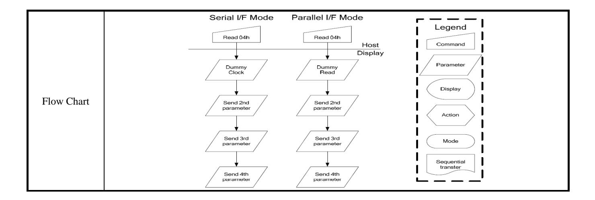

#### **5.2.4. Read Display Power Mode(0Ah)**

|              | 0AH                                                                                                                                                                                                                                                            |        |                   |           |                          | RDDPM (Read Display Power Mode) |               |    |    |         |
|--------------|----------------------------------------------------------------------------------------------------------------------------------------------------------------------------------------------------------------------------------------------------------------|--------|-------------------|-----------|--------------------------|---------------------------------|---------------|----|----|---------|
|              | Write/Read                                                                                                                                                                                                                                                     | D7     | D6                | D5        | D4                       | D3                              | D2            | D1 | D0 | Default |
| Command      | Write                                                                                                                                                                                                                                                          | 0      | 0                 | 0         | 0                        | 1                               | 0             | 1  | 0  | 0Ah     |
| parameter    | Read                                                                                                                                                                                                                                                           | slpout | idle_m ode_on  | 0         | slpout                   | normal                          | disp_on       | 0  | 0  | 08h     |
| Description  | slpout =0,Sleep In Mode. slpout =1,Sleep Out Mode. normal =0,Display Normal Mode Off. normal =1,Display Normal Mode On. disp_on=0,Display is Off. disp_on =1, Display is On. idle_mode_on=0: idel mode off. idle_mode_on=1: idel mode on. |        |                   |           |                          |                                 |               |    |    |         |
| Restriction  | -                                                                                                                                                                                                                                                              |        |                   |           |                          |                                 |               |    |    |         |
|              |                                                                                                                                                                                                                                                                |        |                   | Status    |                          |                                 | Availability  |    |    |         |
| Register     |                                                                                                                                                                                                                                                                |        |                   |           | Normal Mode On,Sleep Out |                                 | Yes           |    |    |         |
| Availability |                                                                                                                                                                                                                                                                |        |                   | Sleep Out |                          |                                 | Yes           |    |    |         |
|              |                                                                                                                                                                                                                                                                |        |                   | Sleep In  |                          |                                 | Yes           |    |    |         |
|              |                                                                                                                                                                                                                                                                |        |                   | Status    |                          |                                 | Default Value |    |    |         |
|              |                                                                                                                                                                                                                                                                |        | Power On Sequence |           |                          |                                 | 8'h08         |    |    |         |
| Default      |                                                                                                                                                                                                                                                                |        |                   | S/W Reset |                          |                                 | 8'h08         |    |    |         |
|              |                                                                                                                                                                                                                                                                |        |                   | H/W Reset |                          |                                 | 8'h08         |    |    |         |
|              |                                                                                                                                                                                                                                                                |        |                   |           |                          |                                 |               |    |    |         |

#### **5.2.5. Read Display MADCTL(0BH)**

|              | 0BH                                                                                                                                                                                                                                                           |    |                   |                          |    | RDDMADCTL(Read Display MADCTL) |    |    |    |         |
|--------------|---------------------------------------------------------------------------------------------------------------------------------------------------------------------------------------------------------------------------------------------------------------|----|-------------------|--------------------------|----|--------------------------------|----|----|----|---------|
|              | Write/Read                                                                                                                                                                                                                                                    | D7 | D6                | D5                       | D4 | D3                             | D2 | D1 | D0 | Default |
| Command      | Write                                                                                                                                                                                                                                                         | 0  | 0                 | 0                        | 0  | 1                              | 0  | 1  | 1  | 0BH     |
| Parameter    | Read                                                                                                                                                                                                                                                          | 0  | 0                 | 0                        | 0  | BGR                            | 0  | SS | GS | 00H     |
| Description  | This command indicates the current status of the display: BGR=0,RGB format. BGR=1,BGR format. SS=0,Source output Left to Right. SS=1,Source output Right to Left. GS=0,Gate output from top to bottom. GS=1,Gate output from bottom to top. |    |                   |                          |    |                                |    |    |    |         |
| Restriction  | -                                                                                                                                                                                                                                                             |    |                   |                          |    |                                |    |    |    |         |
|              |                                                                                                                                                                                                                                                               |    | Status            |                          |    | Availability                   |    |    |    |         |
| Register     |                                                                                                                                                                                                                                                               |    |                   | Normal Mode On,Sleep Out |    | Yes                            |    |    |    |         |
| Availability |                                                                                                                                                                                                                                                               |    | Sleep Out         |                          |    | Yes                            |    |    |    |         |
|              |                                                                                                                                                                                                                                                               |    | Sleep In          |                          |    | Yes                            |    |    |    |         |
|              |                                                                                                                                                                                                                                                               |    | Status            |                          |    | Default Value                  |    |    |    |         |
|              |                                                                                                                                                                                                                                                               |    | Power On Sequence |                          |    | 8'h00                          |    |    |    |         |
| Default      |                                                                                                                                                                                                                                                               |    | S/W Reset         |                          |    | 8'h00                          |    |    |    |         |
|              |                                                                                                                                                                                                                                                               |    | H/W Reset         |                          |    | 8'h00                          |    |    |    |         |

#### **5.2.6. Read Display Pixel Format(0CH)**

| 0CH          |                                                                                           |    |                    |                          |    | RDDCOLMOD (Read Display COLMOD) |                                  |       |    |         |
|--------------|-------------------------------------------------------------------------------------------|----|--------------------|--------------------------|----|---------------------------------|----------------------------------|-------|----|---------|
|              | Write/Read                                                                                | D7 | D6                 | D5                       | D4 | D3                              | D2                               | D1    | D0 | Default |
| Command      | Write                                                                                     | 0  | 0                  | 0                        | 0  | 1                               | 1                                | 0     | 0  | 0CH     |
| Parameter    | Read                                                                                      | 0  |                    | dpi[2:0]                 |    | 0                               | 0                                | 0     | 0  | 70H     |
|              | This command indicates the current status of the display as described in the table below: |    | dpi[2:0] 1 0 | 1                        |    |                                 | Interface Format 16-bit/pixel |       |    |         |
| Description  |                                                                                           |    | 1 1 1 1   | 0 1                   |    |                                 | 18-bit/pixel 24-bit/pixel     |       |    |         |
|              |                                                                                           |    | Others             |                          |    |                                 | Reserved                         |       |    |         |
| Restriction  | -                                                                                         |    |                    |                          |    |                                 |                                  |       |    |         |
|              |                                                                                           |    |                    | Status                   |    |                                 | Availability                     |       |    |         |
| Register     |                                                                                           |    |                    | Normal Mode On,Sleep Out |    |                                 | Yes                              |       |    |         |
| Availability |                                                                                           |    |                    | Sleep Out                |    |                                 | Yes                              |       |    |         |
|              |                                                                                           |    |                    | Sleep In                 |    |                                 | Yes                              |       |    |         |
|              |                                                                                           |    |                    | Status                   |    |                                 | Default Value                    |       |    |         |
|              |                                                                                           |    |                    | Power On Sequence        |    |                                 |                                  | 8'h70 |    |         |
| Default      |                                                                                           |    |                    | S/W Reset                |    |                                 | 8'h70                            |       |    |         |
|              |                                                                                           |    |                    | H/W Reset                |    |                                 | 8'h70                            |       |    |         |

#### **5.2.7. Read Display Image Mode(0DH)**

| 0DH          |                                                                                                                                                                                                                                                 |    |    |                          | RDDIM (Read Display Image Mode) |               |    |          |    |         |
|--------------|-------------------------------------------------------------------------------------------------------------------------------------------------------------------------------------------------------------------------------------------------|----|----|--------------------------|---------------------------------|---------------|----|----------|----|---------|
|              | Write/Read                                                                                                                                                                                                                                      | D7 | D6 | D5                       | D4                              | D3            | D2 | D1       | D0 | Default |
| Command      | Write                                                                                                                                                                                                                                           | 0  | 0  | 0                        | 0                               | 1             | 1  | 0        | 1  | 0DH     |
| parameter    | Read                                                                                                                                                                                                                                            | 0  | 0  | inver_on                 | pixel_on                        | pixel_off     |    | gcs[2:0] |    | 00H     |
| Description  | inver_on =0,Inversion is Off. inver_on =1,Inversion is On. pixel_on =0,Normal Display. pixel_on =1,White Display. pixel_off =0,Normal Display. pixel_off =1,Black Display. GCS=3'b000,GC0 is selected,others are not defined. |    |    |                          |                                 |               |    |          |    |         |
| Restriction  | -                                                                                                                                                                                                                                               |    |    |                          |                                 |               |    |          |    |         |
|              |                                                                                                                                                                                                                                                 |    |    | Status                   |                                 | Availability  |    |          |    |         |
| Register     |                                                                                                                                                                                                                                                 |    |    | Normal Mode On,Sleep Out |                                 | Yes           |    |          |    |         |
| Availability |                                                                                                                                                                                                                                                 |    |    | Sleep Out                |                                 | Yes           |    |          |    |         |
|              |                                                                                                                                                                                                                                                 |    |    | Sleep In                 |                                 | Yes           |    |          |    |         |
|              |                                                                                                                                                                                                                                                 |    |    |                          |                                 |               |    |          |    |         |
|              |                                                                                                                                                                                                                                                 |    |    | Status                   |                                 | Default Value |    |          |    |         |
|              |                                                                                                                                                                                                                                                 |    |    | Power On Sequence        |                                 | 8'h00         |    |          |    |         |
| Default      |                                                                                                                                                                                                                                                 |    |    | S/W Reset                |                                 | 8'h00         |    |          |    |         |
|              |                                                                                                                                                                                                                                                 |    |    | H/W Reset                |                                 | 8'h00         |    |          |    |         |

#### **5.2.8. Read Display Signal Mode(0EH)**

|              | 0EH                                                                |         |                                                                                                                                                  | RDDSM (Read Display Signal Mode) |    |               |    |    |    |         |
|--------------|--------------------------------------------------------------------|---------|--------------------------------------------------------------------------------------------------------------------------------------------------|----------------------------------|----|---------------|----|----|----|---------|
|              | Write/Read                                                         | D7      | D6                                                                                                                                               | D5                               | D4 | D3            | D2 | D1 | D0 | Default |
| Command      | Write                                                              | 0       | 0                                                                                                                                                | 0                                | 0  | 1             | 1  | 1  | 0  | 0Eh     |
| Parameter    | Read                                                               | tear_on | tear_mode                                                                                                                                        | 0                                | 0  | 0             | 0  | 0  | 0  | 00h     |
| Description  | TEON=0,Tearing Effect Line Off. TEON=1, Tearing Effect Line On. |         | This command indicates the current status of the display. TEAR_MODE=0,The Tearing Effect Output line consists of V-Blanking information only. |                                  |    |               |    |    |    |         |
| Restriction  | -                                                                  |         |                                                                                                                                                  |                                  |    |               |    |    |    |         |
|              |                                                                    |         | Status                                                                                                                                           |                                  |    | Availability  |    |    |    |         |
| Register     |                                                                    |         | Normal Mode On,Sleep Out                                                                                                                         |                                  |    | Yes           |    |    |    |         |
| Availability |                                                                    |         | Sleep Out                                                                                                                                        |                                  |    | Yes           |    |    |    |         |
|              |                                                                    |         | Sleep In                                                                                                                                         |                                  |    | Yes           |    |    |    |         |
|              |                                                                    |         | Status                                                                                                                                           |                                  |    | Default Value |    |    |    |         |
|              |                                                                    |         | Power On Sequence                                                                                                                                |                                  |    | 8'h00         |    |    |    |         |
| Default      |                                                                    |         | S/W Reset                                                                                                                                        |                                  |    | 8'h00         |    |    |    |         |
|              |                                                                    |         | H/W Reset                                                                                                                                        |                                  |    | 8'h00         |    |    |    |         |

#### **5.2.9. Read Display Self-Diagnostic Result(0FH)**

| 0FH          |                                                                                                                          |       |                          | RDDSDR(Read Display Self-Diagnostic Result) |    |               |    |    |    |         |
|--------------|--------------------------------------------------------------------------------------------------------------------------|-------|--------------------------|---------------------------------------------|----|---------------|----|----|----|---------|
|              | Write/Read                                                                                                               | D7    | D6                       | D5                                          | D4 | D3            | D2 | D1 | D0 | Default |
| Command      | Write                                                                                                                    | 0     | 0                        | 0                                           | 0  | 1             | 1  | 1  | 1  | 0FH     |
| Parameter    | Read                                                                                                                     | regld | fundt                    | 0                                           | 0  | 0             | 0  | 0  | 0  | 00h     |
| Description  | regld =1,when the OTP and register values are the same. fundt =1,when the chip met User's functionality requirements. |       |                          |                                             |    |               |    |    |    |         |
| Restriction  | -                                                                                                                        |       |                          |                                             |    |               |    |    |    |         |
|              |                                                                                                                          |       | Status                   |                                             |    | Availability  |    |    |    |         |
| Register     |                                                                                                                          |       | Normal Mode On,Sleep Out |                                             |    | Yes           |    |    |    |         |
| Availability |                                                                                                                          |       | Sleep Out                |                                             |    | Yes           |    |    |    |         |
|              |                                                                                                                          |       | Sleep In                 |                                             |    | Yes           |    |    |    |         |
|              |                                                                                                                          |       |                          |                                             |    |               |    |    |    |         |
|              |                                                                                                                          |       | Status                   |                                             |    | Default Value |    |    |    |         |
| Default      |                                                                                                                          |       | Power On Sequence        |                                             |    | 8'h00         |    |    |    |         |
|              |                                                                                                                          |       | S/W Reset                |                                             |    | 8'h00         |    |    |    |         |
|              |                                                                                                                          |       | H/W Reset                |                                             |    | 8'h00         |    |    |    |         |

#### **5.2.10. Sleep In(10h)**

| 10H          |                                                                                                                                                                                                                                                                                                                                                                                                                    |    |                          |                   |              | SLPIN (Sleep In) |    |    |    |         |
|--------------|--------------------------------------------------------------------------------------------------------------------------------------------------------------------------------------------------------------------------------------------------------------------------------------------------------------------------------------------------------------------------------------------------------------------|----|--------------------------|-------------------|--------------|------------------|----|----|----|---------|
|              | Write/Read                                                                                                                                                                                                                                                                                                                                                                                                         | D7 | D6                       | D5                | D4           | D3               | D2 | D1 | D0 | Default |
| Command      | Write                                                                                                                                                                                                                                                                                                                                                                                                              | 0  | 0                        | 0                 | 1            | 0                | 0  | 0  | 0  | 10H     |
| Parameter    | -                                                                                                                                                                                                                                                                                                                                                                                                                  |    |                          |                   | No Parameter |                  |    |    |    | -       |
| Description  | This command cause the NV3052CGRB to enter the minimum power consumption mode. In this mode the NV3052CGRB control signals,Internal oscillator and panel scanning are stopped.                                                                                                                                                                                                                                  |    |                          |                   |              |                  |    |    |    |         |
| Restriction  | This command has no effect when module is already in Sleep In mode. Sleep In Mode can only be left by the Sleep Out command. It is necessary to wait 5msec before sending the next command; this is to allow time for the supply voltages and clock circuits to stabilize. It is necessary to wait 120msec after sending Sleep Out command(when in Sleep In Mode)before the Sleep In command can be sent. |    |                          |                   |              |                  |    |    |    |         |
|              |                                                                                                                                                                                                                                                                                                                                                                                                                    |    | Status                   |                   |              | Availability     |    |    |    |         |
| Register     |                                                                                                                                                                                                                                                                                                                                                                                                                    |    | Normal Mode On,Sleep Out |                   |              | Yes              |    |    |    |         |
| Availability |                                                                                                                                                                                                                                                                                                                                                                                                                    |    |                          | Sleep Out         |              | Yes              |    |    |    |         |
|              |                                                                                                                                                                                                                                                                                                                                                                                                                    |    |                          | Sleep In          |              | Yes              |    |    |    |         |
|              |                                                                                                                                                                                                                                                                                                                                                                                                                    |    |                          |                   |              |                  |    |    |    |         |
|              |                                                                                                                                                                                                                                                                                                                                                                                                                    |    | Status                   |                   |              | Default Value    |    |    |    |         |
| Default      |                                                                                                                                                                                                                                                                                                                                                                                                                    |    |                          | Power On Sequence |              | Sleep In Mode    |    |    |    |         |
|              |                                                                                                                                                                                                                                                                                                                                                                                                                    |    |                          | S/W Reset         |              | Sleep In Mode    |    |    |    |         |
|              |                                                                                                                                                                                                                                                                                                                                                                                                                    |    |                          | H/W Reset         |              | Sleep In Mode    |    |    |    |         |

#### **5.2.11. Sleep Out(11H)**

| 11H          |                                                                                                                                                                                                                                                                                                                                                                                                                              |                                                                                                                                                                                                                                                                                                                                                                                                                 |    |           |                          |              | SLPOUT (Sleep Out) |    |    |         |  |  |  |
|--------------|------------------------------------------------------------------------------------------------------------------------------------------------------------------------------------------------------------------------------------------------------------------------------------------------------------------------------------------------------------------------------------------------------------------------------|-----------------------------------------------------------------------------------------------------------------------------------------------------------------------------------------------------------------------------------------------------------------------------------------------------------------------------------------------------------------------------------------------------------------|----|-----------|--------------------------|--------------|--------------------|----|----|---------|--|--|--|
|              | Write/Read                                                                                                                                                                                                                                                                                                                                                                                                                   | D7                                                                                                                                                                                                                                                                                                                                                                                                              | D6 | D5        | D4                       | D3           | D2                 | D1 | D0 | Default |  |  |  |
| Command      | Write                                                                                                                                                                                                                                                                                                                                                                                                                        | 0                                                                                                                                                                                                                                                                                                                                                                                                               | 0  | 0         | 1                        | 0            | 0                  | 0  | 1  | 11H     |  |  |  |
| Parameter    | -                                                                                                                                                                                                                                                                                                                                                                                                                            |                                                                                                                                                                                                                                                                                                                                                                                                                 |    |           |                          | No Parameter |                    |    |    | -       |  |  |  |
| Description  | This command turns off sleep mode. In this mode ,the NV3052CGRB control signals,Internal oscillator and panel scanning are started.                                                                                                                                                                                                                                                                                       |                                                                                                                                                                                                                                                                                                                                                                                                                 |    |           |                          |              |                    |    |    |         |  |  |  |
| Restriction  | This command has no effect when module is already in Sleep Out mode. Sleep Out mode can be left by the Sleep In command(10h), S/W reset command (01h) or H/W reset. It is necessary to wait 5msec before sending next command; this is to allow time for the supply voltages and clock circuits to stabilize. The NV3052CGRB loads all display supplier's factory default values to the registers during this 5msec |                                                                                                                                                                                                                                                                                                                                                                                                                 |    |           |                          |              |                    |    |    |         |  |  |  |
|              |                                                                                                                                                                                                                                                                                                                                                                                                                              | and there cannot be any abnormal visual effect on the display image if factory default and register values are same when this load is done and when the NV3052CGRB is already Sleep Out mode.During this 5msec, NV3052CGRB is running self-diagnostic functions. It is necessary to wait 120msec after sending the Sleep In command (when in Sleep Out mode) before the Sleep Out command can be sent. |    |           |                          |              |                    |    |    |         |  |  |  |
|              |                                                                                                                                                                                                                                                                                                                                                                                                                              |                                                                                                                                                                                                                                                                                                                                                                                                                 |    | Status    |                          |              | Availability       |    |    |         |  |  |  |
| Register     |                                                                                                                                                                                                                                                                                                                                                                                                                              |                                                                                                                                                                                                                                                                                                                                                                                                                 |    |           | Normal Mode On,Sleep Out |              | Yes                |    |    |         |  |  |  |
| Availability |                                                                                                                                                                                                                                                                                                                                                                                                                              |                                                                                                                                                                                                                                                                                                                                                                                                                 |    | Sleep Out |                          |              | Yes                |    |    |         |  |  |  |
|              |                                                                                                                                                                                                                                                                                                                                                                                                                              |                                                                                                                                                                                                                                                                                                                                                                                                                 |    | Sleep In  |                          |              | Yes                |    |    |         |  |  |  |
|              |                                                                                                                                                                                                                                                                                                                                                                                                                              |                                                                                                                                                                                                                                                                                                                                                                                                                 |    |           |                          |              |                    |    |    |         |  |  |  |
|              |                                                                                                                                                                                                                                                                                                                                                                                                                              |                                                                                                                                                                                                                                                                                                                                                                                                                 |    | Status    |                          |              | Default Value      |    |    |         |  |  |  |
| Default      |                                                                                                                                                                                                                                                                                                                                                                                                                              | Power On Sequence Sleep In Mode                                                                                                                                                                                                                                                                                                                                                                              |    |           |                          |              |                    |    |    |         |  |  |  |
|              |                                                                                                                                                                                                                                                                                                                                                                                                                              | S/W Reset Sleep In Mode                                                                                                                                                                                                                                                                                                                                                                                      |    |           |                          |              |                    |    |    |         |  |  |  |
|              |                                                                                                                                                                                                                                                                                                                                                                                                                              |                                                                                                                                                                                                                                                                                                                                                                                                                 |    | H/W Reset |                          |              | Sleep In Mode      |    |    |         |  |  |  |
|              |                                                                                                                                                                                                                                                                                                                                                                                                                              |                                                                                                                                                                                                                                                                                                                                                                                                                 |    |           |                          |              |                    |    |    |         |  |  |  |

#### **5.2.12. Normal Display Mode On(13H)**

|                          | 13H                                                      |                                                                                                                                                         |                                                                                                  |    | NORON (Normal Display Mode On) |              |    |    |    |         |  |  |  |
|--------------------------|----------------------------------------------------------|---------------------------------------------------------------------------------------------------------------------------------------------------------|--------------------------------------------------------------------------------------------------|----|--------------------------------|--------------|----|----|----|---------|--|--|--|
|                          | Write/Read                                               | D7                                                                                                                                                      | D6                                                                                               | D5 | D4                             | D3           | D2 | D1 | D0 | Default |  |  |  |
| Command                  | Write                                                    | 0                                                                                                                                                       | 0                                                                                                | 0  | 1                              | 0            | 0  | 1  | 1  | 13H     |  |  |  |
| Parameter                | -                                                        |                                                                                                                                                         |                                                                                                  |    |                                | No Parameter |    |    |    | -       |  |  |  |
| Description              | This command returns the display to Normal Display Mode. |                                                                                                                                                         |                                                                                                  |    |                                |              |    |    |    |         |  |  |  |
| Restriction              |                                                          |                                                                                                                                                         | This command has no effect when Normal Display Mode is active.                                   |    |                                |              |    |    |    |         |  |  |  |
| Register Availability |                                                          |                                                                                                                                                         | Status Availability Normal Mode On,Sleep Out Yes Sleep Out Yes Sleep In Yes |    |                                |              |    |    |    |         |  |  |  |
| Default                  |                                                          | Status Default Value Power On Sequence Normal Display Mode On. S/W Reset Normal Display Mode On. H/W Reset Normal Display Mode On. |                                                                                                  |    |                                |              |    |    |    |         |  |  |  |

#### **5.2.13. Display Inversion Off(20H)**

| 20H          |                                                                                                                   |                                                                                  |                   |    |    | INVOFF (Display Inversion Off ) |    |    |    |         |  |  |  |
|--------------|-------------------------------------------------------------------------------------------------------------------|----------------------------------------------------------------------------------|-------------------|----|----|---------------------------------|----|----|----|---------|--|--|--|
|              | Write/Read                                                                                                        | D7                                                                               | D6                | D5 | D4 | D3                              | D2 | D1 | D0 | Default |  |  |  |
| Command      | Write                                                                                                             | 0                                                                                | 0                 | 1  | 0  | 0                               | 0  | 0  | 0  | 20H     |  |  |  |
| Parameter    | -                                                                                                                 |                                                                                  |                   |    |    | No Parameter                    |    |    |    | -       |  |  |  |
|              | This command is used to recover from display inversion On mode. This command does not change any other status. |                                                                                  |                   |    |    |                                 |    |    |    |         |  |  |  |
| Description  |                                                                                                                   | This command has no effect when module is already in Display Inversion Off mode. |                   |    |    |                                 |    |    |    |         |  |  |  |
| Restriction  |                                                                                                                   |                                                                                  |                   |    |    |                                 |    |    |    |         |  |  |  |
|              |                                                                                                                   |                                                                                  | Status            |    |    | Availability                    |    |    |    |         |  |  |  |
| Register     |                                                                                                                   | Normal Mode On,Sleep Out                                                         |                   |    |    | Yes                             |    |    |    |         |  |  |  |
| Availability |                                                                                                                   |                                                                                  | Sleep Out         |    |    | Yes                             |    |    |    |         |  |  |  |
|              |                                                                                                                   |                                                                                  | Sleep In          |    |    | Yes                             |    |    |    |         |  |  |  |
|              |                                                                                                                   |                                                                                  | Status            |    |    | Default Value                   |    |    |    |         |  |  |  |
| Default      |                                                                                                                   |                                                                                  | Power On Sequence |    |    | Display Inversion Off           |    |    |    |         |  |  |  |
|              |                                                                                                                   |                                                                                  | S/W Reset         |    |    | Display Inversion Off           |    |    |    |         |  |  |  |
|              |                                                                                                                   |                                                                                  | H/W Reset         |    |    | Display Inversion Off           |    |    |    |         |  |  |  |

#### **5.2.14. Display Inversion On(21H)**

| 21H                     |                                                               |                                                                                                                                                                                                                                 |    |                             |    |              | INVON (Display Inversion On )                  |    |    |         |  |  |  |  |
|-------------------------|---------------------------------------------------------------|---------------------------------------------------------------------------------------------------------------------------------------------------------------------------------------------------------------------------------|----|-----------------------------|----|--------------|------------------------------------------------|----|----|---------|--|--|--|--|
|                         | Write/Read                                                    | D7                                                                                                                                                                                                                              | D6 | D5                          | D4 | D3           | D2                                             | D1 | D0 | Default |  |  |  |  |
| Command                 | Write                                                         | 0                                                                                                                                                                                                                               | 0  | 1                           | 0  | 0            | 0                                              | 0  | 1  | 21H     |  |  |  |  |
| Parameter               | -                                                             |                                                                                                                                                                                                                                 |    |                             |    | No Parameter |                                                |    |    | -       |  |  |  |  |
| Description             | This command is used to enter into Display Inversion On mode. | This command does not change any other status. To exit Display Inversion On mode,the Display Inversion Off command(20h)should be written. This command has no effect when the NV3052CGRB is already in Inversion On mode. |    |                             |    |              |                                                |    |    |         |  |  |  |  |
| Restriction             |                                                               |                                                                                                                                                                                                                                 |    |                             |    |              |                                                |    |    |         |  |  |  |  |
|                         |                                                               |                                                                                                                                                                                                                                 |    | Status                      |    |              | Availability                                   |    |    |         |  |  |  |  |
| Register Availabilit |                                                               |                                                                                                                                                                                                                                 |    | Normal Mode On,Sleep Out    |    |              | Yes                                            |    |    |         |  |  |  |  |
| y                       |                                                               |                                                                                                                                                                                                                                 |    | Sleep Out                   |    |              | Yes                                            |    |    |         |  |  |  |  |
|                         |                                                               |                                                                                                                                                                                                                                 |    | Sleep In                    |    |              | Yes                                            |    |    |         |  |  |  |  |
| Default                 |                                                               |                                                                                                                                                                                                                                 |    | Status Power On Sequence |    |              | Default Value Display Inversion Off         |    |    |         |  |  |  |  |
|                         |                                                               |                                                                                                                                                                                                                                 |    | S/W Reset H/W Reset      |    |              | Display Inversion Off Display Inversion Off |    |    |         |  |  |  |  |

#### **5.2.15. All Pixel Off(22H)**

|                          | 22H                                                                                                                                                                                                                                                                                                                                                                 |                         |                   |           | ALLPOFF (All Pixels Off) |              |              |    |    |         |  |  |  |
|--------------------------|---------------------------------------------------------------------------------------------------------------------------------------------------------------------------------------------------------------------------------------------------------------------------------------------------------------------------------------------------------------------|-------------------------|-------------------|-----------|--------------------------|--------------|--------------|----|----|---------|--|--|--|
|                          | Write/Read                                                                                                                                                                                                                                                                                                                                                          | D7                      | D6                | D5        | D4                       | D3           | D2           | D1 | D0 | Default |  |  |  |
| Command                  | Write                                                                                                                                                                                                                                                                                                                                                               | 0                       | 0                 | 1         | 0                        | 0            | 0            | 1  | 0  | 22H     |  |  |  |
| Parameter                | -                                                                                                                                                                                                                                                                                                                                                                   |                         |                   |           |                          | No Parameter |              |    |    | -       |  |  |  |
| Description              | This command turns the display panel black in 'Sleep Out' mode and a status of the 'Display On/Off' register can be 'on' or 'off'. This command does not change any other status. 'All Pixels On','Normal Display Mode On'commands are used to leave this mode. 0:normal display 1:NB screen:nom_black = 0,black display;nom_black = 1,white display |                         |                   |           |                          |              |              |    |    |         |  |  |  |
| Restriction              | NW screen:nom_black = 0,white display;nom_black = 1,black display This command has no effect when the NV3052CGRB is already in All Pixels Off mode.                                                                                                                                                                                                              |                         |                   |           |                          |              |              |    |    |         |  |  |  |
|                          |                                                                                                                                                                                                                                                                                                                                                                     |                         |                   |           |                          |              |              |    |    |         |  |  |  |
|                          |                                                                                                                                                                                                                                                                                                                                                                     |                         |                   | Status    |                          |              | Availability |    |    |         |  |  |  |
| Register Availability |                                                                                                                                                                                                                                                                                                                                                                     |                         |                   |           | Normal Mode On,Sleep Out |              | Yes          |    |    |         |  |  |  |
|                          |                                                                                                                                                                                                                                                                                                                                                                     |                         |                   | Sleep Out |                          |              | Yes          |    |    |         |  |  |  |
|                          |                                                                                                                                                                                                                                                                                                                                                                     |                         |                   | Sleep In  |                          |              | Yes          |    |    |         |  |  |  |
|                          |                                                                                                                                                                                                                                                                                                                                                                     | Status Default Value |                   |           |                          |              |              |    |    |         |  |  |  |
| Default                  |                                                                                                                                                                                                                                                                                                                                                                     |                         | Power On Sequence |           |                          |              | Off          |    |    |         |  |  |  |
|                          |                                                                                                                                                                                                                                                                                                                                                                     |                         | S/W Reset         |           |                          |              | Off          |    |    |         |  |  |  |
|                          |                                                                                                                                                                                                                                                                                                                                                                     |                         | H/W Reset         |           |                          |              | Off          |    |    |         |  |  |  |

#### **5.2.16. All Pixels On(23H)**

|                            | 23H                                                                                                                                                                                  |                                                                                                                                                                                                                                                                                                                   |                          |                        | ALLPON (All Pixels On) |              |               |    |    |         |  |  |
|----------------------------|--------------------------------------------------------------------------------------------------------------------------------------------------------------------------------------|-------------------------------------------------------------------------------------------------------------------------------------------------------------------------------------------------------------------------------------------------------------------------------------------------------------------|--------------------------|------------------------|------------------------|--------------|---------------|----|----|---------|--|--|
|                            | Write/Read                                                                                                                                                                           | D7                                                                                                                                                                                                                                                                                                                | D6                       | D5                     | D4                     | D3           | D2            | D1 | D0 | Default |  |  |
| Command                    | Write                                                                                                                                                                                | 0                                                                                                                                                                                                                                                                                                                 | 0                        | 1                      | 0                      | 0            | 0             | 1  | 1  | 23H     |  |  |
| Parameter                  | -                                                                                                                                                                                    |                                                                                                                                                                                                                                                                                                                   |                          |                        |                        | No Parameter |               |    |    | -       |  |  |
|                            | This command turns the display panel white in 'Sleep out ' mode and a status of the 'Display On/Off' register can be 'on' or 'off'.This command does not change any other status. |                                                                                                                                                                                                                                                                                                                   |                          |                        |                        |              |               |    |    |         |  |  |
|                            |                                                                                                                                                                                      |                                                                                                                                                                                                                                                                                                                   |                          |                        |                        |              |               |    |    |         |  |  |
| Description Restriction | 0:normal display.                                                                                                                                                                    | 'All Pixels Off', 'Normal Display Mode On'commands are used to leave this mode. 1:NB screen:nom_black = 0,white display;nom_black = 1,black display. NW screen:nom_black = 0,black display;nom_black = 1,white display. This command has no effect when the NV3052CGRB is already in All Pixels On mode. |                          |                        |                        |              |               |    |    |         |  |  |
|                            |                                                                                                                                                                                      |                                                                                                                                                                                                                                                                                                                   |                          | Status                 |                        |              | Availability  |    |    |         |  |  |
| Register                   |                                                                                                                                                                                      |                                                                                                                                                                                                                                                                                                                   | Normal Mode On,Sleep Out |                        |                        |              | Yes           |    |    |         |  |  |
| Availability               |                                                                                                                                                                                      |                                                                                                                                                                                                                                                                                                                   |                          | Sleep Out              |                        |              | Yes           |    |    |         |  |  |
|                            |                                                                                                                                                                                      |                                                                                                                                                                                                                                                                                                                   |                          | Sleep In               |                        |              | Yes           |    |    |         |  |  |
|                            |                                                                                                                                                                                      |                                                                                                                                                                                                                                                                                                                   |                          |                        |                        |              |               |    |    |         |  |  |
|                            |                                                                                                                                                                                      |                                                                                                                                                                                                                                                                                                                   |                          | Status                 |                        |              | Default Value |    |    |         |  |  |
| Default                    |                                                                                                                                                                                      |                                                                                                                                                                                                                                                                                                                   |                          | Power On Sequence      |                        |              | Off           |    |    |         |  |  |
|                            |                                                                                                                                                                                      |                                                                                                                                                                                                                                                                                                                   |                          | S/W Reset H/W Reset |                        |              | Off Off    |    |    |         |  |  |

#### **5.2.17. Display Off(28H)**

|              | 28H                                                                                                                                                                             |        |    |                                    |    |              | DISOFF (Display Off) |    |    |         |
|--------------|---------------------------------------------------------------------------------------------------------------------------------------------------------------------------------|--------|----|------------------------------------|----|--------------|----------------------|----|----|---------|
|              | Write/Read                                                                                                                                                                      | D7     | D6 | D5                                 | D4 | D3           | D2                   | D1 | D0 | Default |
| Command      | Write                                                                                                                                                                           | 0      | 0  | 1                                  | 0  | 1            | 0                    | 0  | 0  | 28H     |
| Parameter    | -                                                                                                                                                                               |        |    |                                    |    | No Parameter |                      |    |    | -       |
|              | This command is used to enter into Display Off mode. In this mode, the output data is disabled and blank page is inserted. This command makes no change any other status. |        |    |                                    |    |              |                      |    |    |         |
|              | There will be no abnormal visible effect on the display.                                                                                                                        | Before |    |                                    |    |              | After                |    |    |         |
| Description  |                                                                                                                                                                                 |        |    |                                    |    |              |                      |    |    |         |
| Restriction  | This command has no effect when module is already in Display Off mode.                                                                                                          |        |    |                                    |    |              |                      |    |    |         |
| Register     |                                                                                                                                                                                 |        |    | Status Normal Mode On,Sleep Out |    |              | Availability Yes  |    |    |         |
| Availability |                                                                                                                                                                                 |        |    | Sleep Out                          |    |              | Yes                  |    |    |         |
|              |                                                                                                                                                                                 |        |    | Sleep In                           |    |              | Yes                  |    |    |         |
|              |                                                                                                                                                                                 |        |    | Status                             |    |              | Default Value        |    |    |         |
| Default      |                                                                                                                                                                                 |        |    | Power On Sequence                  |    |              | Display off          |    |    |         |
|              |                                                                                                                                                                                 |        |    | S/W Reset                          |    |              | Display off          |    |    |         |
|              |                                                                                                                                                                                 |        |    | H/W Reset                          |    |              | Display off          |    |    |         |

#### **5.2.18. Display On(29H)**

|              | 29H                                                                                                                              |    |           |                          |    |              | DISON (Display On) |    |    |         |
|--------------|----------------------------------------------------------------------------------------------------------------------------------|----|-----------|--------------------------|----|--------------|--------------------|----|----|---------|
|              | Write/Read                                                                                                                       | D7 | D6        | D5                       | D4 | D3           | D2                 | D1 | D0 | Default |
| Command      | Write                                                                                                                            | 0  | 0         | 1                        | 0  | 1            | 0                  | 0  | 1  | 29H     |
| Parameter    | -                                                                                                                                |    |           |                          |    | No Parameter |                    |    |    | -       |
| Description  | This command is used to recover from Display Off mode. Output data is enabled. This command does not change any other status. |    |           |                          |    |              |                    |    |    |         |
| Restriction  | This command has no effect when the NV3052CGRB is already in Display on mode.                                                    |    |           |                          |    |              |                    |    |    |         |
|              |                                                                                                                                  |    |           | Status                   |    |              | Availability       |    |    |         |
| Register     |                                                                                                                                  |    |           | Normal Mode On,Sleep Out |    |              | Yes                |    |    |         |
| Availability |                                                                                                                                  |    |           | Sleep Out                |    |              | Yes                |    |    |         |
|              |                                                                                                                                  |    |           | Sleep In                 |    |              | Yes                |    |    |         |
|              |                                                                                                                                  |    | Status    |                          |    |              | Default Value      |    |    |         |
| Default      |                                                                                                                                  |    |           | Power On Sequence        |    |              | Display off        |    |    |         |
|              |                                                                                                                                  |    | S/W Reset |                          |    |              | Display off        |    |    |         |
|              |                                                                                                                                  |    | H/W Reset |                          |    |              | Display off        |    |    |         |

#### **5.2.19. Tearing Effect Line OFF(34H)**

|              | 34H                                                                                                                        |                                              |                                                                           |                          | TEOFF (Tearing Effect Line OFF) |              |                         |    |    |         |  |  |  |
|--------------|----------------------------------------------------------------------------------------------------------------------------|----------------------------------------------|---------------------------------------------------------------------------|--------------------------|---------------------------------|--------------|-------------------------|----|----|---------|--|--|--|
|              | Write/Read                                                                                                                 | D7                                           | D6                                                                        | D5                       | D4                              | D3           | D2                      | D1 | D0 | Default |  |  |  |
| Command      | Write                                                                                                                      | 0                                            | 0                                                                         | 1                        | 1                               | 0            | 1                       | 0  | 0  | 34H     |  |  |  |
| Parameter    | -                                                                                                                          |                                              |                                                                           |                          |                                 | No Parameter |                         |    |    | -       |  |  |  |
| Description  | This command is used to turn off the Display module's Tearing Effect output signal(Active Low) from the TE signal line. |                                              |                                                                           |                          |                                 |              |                         |    |    |         |  |  |  |
| Restriction  |                                                                                                                            |                                              | This command has no effect when the Tearing Effect output is already off. |                          |                                 |              |                         |    |    |         |  |  |  |
|              |                                                                                                                            |                                              |                                                                           |                          |                                 |              |                         |    |    |         |  |  |  |
| Register     |                                                                                                                            |                                              |                                                                           | Normal Mode On,Sleep Out |                                 |              | Yes                     |    |    |         |  |  |  |
| Availability |                                                                                                                            |                                              |                                                                           | Sleep Out                |                                 |              | Yes                     |    |    |         |  |  |  |
|              |                                                                                                                            |                                              |                                                                           | Sleep In                 |                                 |              | Yes                     |    |    |         |  |  |  |
|              |                                                                                                                            |                                              |                                                                           |                          |                                 |              |                         |    |    |         |  |  |  |
|              |                                                                                                                            | Status Default Value                      |                                                                           |                          |                                 |              |                         |    |    |         |  |  |  |
|              |                                                                                                                            | Power On Sequence Tearing Effect Line Off |                                                                           |                          |                                 |              |                         |    |    |         |  |  |  |
| Default      |                                                                                                                            |                                              |                                                                           | S/W Reset                |                                 |              | Tearing Effect Line Off |    |    |         |  |  |  |
|              |                                                                                                                            |                                              |                                                                           | H/W Reset                |                                 |              | Tearing Effect Line Off |    |    |         |  |  |  |

#### **5.2.20. Tearing Effect Line ON(35H)**

|                          | 35H                                                                                                                                                                                                                                                                    |                                                                                                                                                                              |                                                                                          |           |              | TEON (Tearing Effect Line On) |                         |    |           |         |  |  |  |
|--------------------------|------------------------------------------------------------------------------------------------------------------------------------------------------------------------------------------------------------------------------------------------------------------------|------------------------------------------------------------------------------------------------------------------------------------------------------------------------------|------------------------------------------------------------------------------------------|-----------|--------------|-------------------------------|-------------------------|----|-----------|---------|--|--|--|
|                          | Write/Read                                                                                                                                                                                                                                                             | D7                                                                                                                                                                           | D6                                                                                       | D5        | D4           | D3                            | D2                      | D1 | D0        | Default |  |  |  |
| Command                  | Write                                                                                                                                                                                                                                                                  | 0                                                                                                                                                                            | 0                                                                                        | 1         | 1            | 0                             | 1                       | 0  | 1         | 35H     |  |  |  |
| Parameter                | -                                                                                                                                                                                                                                                                      |                                                                                                                                                                              |                                                                                          |           | No Parameter |                               |                         |    | tear_mode | 00H     |  |  |  |
| Description              | This command is used to turn on the Tearing Effect output signal from the TE signal line. tear_mode:describes the mode of the Tearing Effect Output Line. Tearing Effect Line mode. 0:The Tearing Effect Output line consists of V-Blanking information only. |                                                                                                                                                                              |                                                                                          |           |              |                               |                         |    |           |         |  |  |  |
| Restriction              |                                                                                                                                                                                                                                                                        |                                                                                                                                                                              | 1:The Tearing Effect Output line consists of both V-Blanking and H-Blanking information. |           |              |                               |                         |    |           |         |  |  |  |
| Register Availability |                                                                                                                                                                                                                                                                        | This command has no effect when the Tearing Effect output is already on. Status Availability Normal Mode On,Sleep Out Yes Sleep Out Yes Sleep In Yes |                                                                                          |           |              |                               |                         |    |           |         |  |  |  |
|                          |                                                                                                                                                                                                                                                                        |                                                                                                                                                                              |                                                                                          |           |              |                               |                         |    |           |         |  |  |  |
|                          |                                                                                                                                                                                                                                                                        |                                                                                                                                                                              |                                                                                          | Status    |              |                               | Default Value           |    |           |         |  |  |  |
| Default                  |                                                                                                                                                                                                                                                                        |                                                                                                                                                                              | Power On Sequence Tearing Effect Line Off                                             |           |              |                               |                         |    |           |         |  |  |  |
|                          |                                                                                                                                                                                                                                                                        |                                                                                                                                                                              | S/W Reset Tearing Effect Line Off                                                     |           |              |                               |                         |    |           |         |  |  |  |
|                          |                                                                                                                                                                                                                                                                        |                                                                                                                                                                              |                                                                                          | H/W Reset |              |                               | Tearing Effect Line Off |    |           |         |  |  |  |

#### **5.2.21. Display Access Control(36H)**

| 36H          |                                                                                                   |    |                          | MADCTR (Display Access Control) |         |     |                                |                                                                                           |    |                                                                                                        |  |
|--------------|---------------------------------------------------------------------------------------------------|----|--------------------------|---------------------------------|---------|-----|--------------------------------|-------------------------------------------------------------------------------------------|----|--------------------------------------------------------------------------------------------------------|--|
|              | Write/Read                                                                                        | D7 | D6                       | D5                              | D4      | D3  | D2                             | D1                                                                                        | D0 | Default                                                                                                |  |
| Command      | Write                                                                                             | 0  | 0                        | 1                               | 1       | 0   | 1                              | 1                                                                                         | 0  | 36H                                                                                                    |  |
| Parameter    | Write                                                                                             | 0  | 0                        | 0                               | 0       | bgr | 0                              | ss                                                                                        | gs | 00H                                                                                                    |  |
|              | This command defines the panel operation mode.                                                    |    |                          |                                 |         |     |                                |                                                                                           |    |                                                                                                        |  |
|              | SYMBOL                                                                                            |    | NAME                     |                                 |         |     |                                | DESCRIPTION                                                                               |    |                                                                                                        |  |
|              | bgr                                                                                               |    | Pannel RGB-BGR Order.    |                                 | panel)  |     | Color selector switch control. | (0' =RGB color filter panel, '1' =BGR color filter                                        |    |                                                                                                        |  |
| Description  | ss                                                                                                |    | Panel Flip Horizontal.   |                                 | right)  |     |                                | to left, '0' = Source Scan sequence from left to                                          |    | Select the source driver scan direction on the panel module.(SS="1" Source Scan sequence from right |  |
|              | gs                                                                                                |    | Panel Flip Vertical.     |                                 | bottom) |     |                                | Select the gate driver scan direction on panel module. (GS="1" Gate Scan sequence from |    | bottom to top, '0' = Gate Scan sequence from top to                                                    |  |
|              | Note:gs scan direction depend on panel's design. Top-Left(0,0) means the physical panel location. |    |                          |                                 |         |     |                                |                                                                                           |    |                                                                                                        |  |
| Restriction  | -                                                                                                 |    |                          |                                 |         |     |                                |                                                                                           |    |                                                                                                        |  |
|              |                                                                                                   |    |                          | Status                          |         |     | Availability                   |                                                                                           |    |                                                                                                        |  |
| Register     |                                                                                                   |    | Normal Mode On,Sleep Out |                                 |         |     | Yes                            |                                                                                           |    |                                                                                                        |  |
| Availability |                                                                                                   |    |                          | Sleep Out                       |         |     | Yes                            |                                                                                           |    |                                                                                                        |  |
|              |                                                                                                   |    |                          | Sleep In                        |         |     | Yes                            |                                                                                           |    |                                                                                                        |  |
|              |                                                                                                   |    |                          |                                 |         |     |                                |                                                                                           |    |                                                                                                        |  |
|              |                                                                                                   |    |                          | Status                          |         |     | Default Value                  |                                                                                           |    |                                                                                                        |  |
| Default      |                                                                                                   |    |                          | Power On Sequence               |         |     | 8'h00                          |                                                                                           |    |                                                                                                        |  |
|              |                                                                                                   |    |                          | S/W Reset                       |         |     | 8'h00                          |                                                                                           |    |                                                                                                        |  |
|              |                                                                                                   |    |                          | H/W Reset                       |         |     | 8'h00                          |                                                                                           |    |                                                                                                        |  |

#### **5.2.22. Idle Mode Off(38H)**

|              | 38H                                                                                                                                             |                                    |                                                                                                                  |           | IDMODEOFF (Idle Mode Off) |              |               |    |    |         |  |  |  |
|--------------|-------------------------------------------------------------------------------------------------------------------------------------------------|------------------------------------|------------------------------------------------------------------------------------------------------------------|-----------|---------------------------|--------------|---------------|----|----|---------|--|--|--|
|              | Write/Read                                                                                                                                      | D7                                 | D6                                                                                                               | D5        | D4                        | D3           | D2            | D1 | D0 | Default |  |  |  |
| Command      | Write                                                                                                                                           | 0                                  | 0                                                                                                                | 1         | 1                         | 1            | 0             | 0  | 0  | 38H     |  |  |  |
| Parameter    | -                                                                                                                                               |                                    |                                                                                                                  |           |                           | No Parameter |               |    |    | -       |  |  |  |
| Description  | This command causes the Display module to exit the Idle mode. In the Idle Mode Off, the display panel can display a maximum of 16.7M colors. |                                    |                                                                                                                  |           |                           |              |               |    |    |         |  |  |  |
| Restriction  |                                                                                                                                                 |                                    | This command has no effect when the module is already in the Idle Mode Off.                                      |           |                           |              |               |    |    |         |  |  |  |
| Register     |                                                                                                                                                 | Status Availability             |                                                                                                                  |           |                           |              |               |    |    |         |  |  |  |
| Availability |                                                                                                                                                 |                                    | Normal Mode On,Idle Mode Off,Sleep Out Yes Normal Mode On,Idle Mode On,Sleep Out Yes Sleep In Yes |           |                           |              |               |    |    |         |  |  |  |
|              |                                                                                                                                                 |                                    |                                                                                                                  |           |                           |              |               |    |    |         |  |  |  |
|              |                                                                                                                                                 |                                    |                                                                                                                  | Status    |                           |              | Default Value |    |    |         |  |  |  |
| Default      |                                                                                                                                                 | Power On Sequence Idle Mode Off |                                                                                                                  |           |                           |              |               |    |    |         |  |  |  |
|              |                                                                                                                                                 | Idle Mode Off S/W Reset         |                                                                                                                  |           |                           |              |               |    |    |         |  |  |  |
|              |                                                                                                                                                 |                                    |                                                                                                                  | H/W Reset |                           |              | Idle Mode Off |    |    |         |  |  |  |

#### **5.2.23. Idle mode on and other mode off (39H)**

|              | 39H         |                            |                                                                                            |           | IDMODEON (Idle mode on and other mode off) |              |               |     |    |         |  |  |  |
|--------------|-------------|----------------------------|--------------------------------------------------------------------------------------------|-----------|--------------------------------------------|--------------|---------------|-----|----|---------|--|--|--|
|              | Write/Read  | D7                         | D6                                                                                         | D5        | D4                                         | D3           | D2            | D1  | D0 | Default |  |  |  |
| Command      | Write       | 0                          | 0                                                                                          | 1         | 1                                          | 1            | 0             | 0   | 1  | 39H     |  |  |  |
| Parameter    | -           |                            |                                                                                            |           |                                            | No Parameter |               |     |    | -       |  |  |  |
| Description  | is reduced. |                            | This command is used to enter into the Idle Mode On. In the Idle Mode On, color expression |           |                                            |              |               |     |    |         |  |  |  |
| Restriction  |             |                            | This command has no effect when the module is already in the Idle Mode On.                 |           |                                            |              |               |     |    |         |  |  |  |
|              |             |                            | Status Availability                                                                     |           |                                            |              |               |     |    |         |  |  |  |
| Register     |             |                            |                                                                                            |           | Normal Mode On, Idle Mode Off, Sleep Out   |              |               | Yes |    |         |  |  |  |
| Availability |             |                            |                                                                                            |           | Normal Mode On, Idle Mode On, Sleep Out    |              |               | Yes |    |         |  |  |  |
|              |             |                            |                                                                                            | Sleep In  |                                            |              |               | Yes |    |         |  |  |  |
|              |             |                            |                                                                                            |           |                                            |              |               |     |    |         |  |  |  |
|              |             |                            | Status Default Value                                                                    |           |                                            |              |               |     |    |         |  |  |  |
| Default      |             |                            | Power On Sequence Idle Mode Off                                                         |           |                                            |              |               |     |    |         |  |  |  |
|              |             | Idle Mode Off S/W Reset |                                                                                            |           |                                            |              |               |     |    |         |  |  |  |
|              |             |                            |                                                                                            | H/W Reset |                                            |              | Idle Mode Off |     |    |         |  |  |  |

#### **5.2.24. Interface Pixel Format(3AH)**

|              | 3AH                                                                                |                             |          |                          |    |              |              | COLMOD (Interface Pixel Format) |    |         |  |  |
|--------------|------------------------------------------------------------------------------------|-----------------------------|----------|--------------------------|----|--------------|--------------|---------------------------------|----|---------|--|--|
|              | Write/Read                                                                         | D7                          | D6       | D5                       | D4 | D3           | D2           | D1                              | D0 | Default |  |  |
| Command      | Write                                                                              | 0                           | 0        | 1                        | 1  | 1            | 0            | 1                               | 0  | 3AH     |  |  |
| Parameter    | Write                                                                              | 0                           |          | dpi[2:0]                 |    | 0            | 0            | 0                               | 0  | 70H     |  |  |
|              | This command sets the pixel format. dpi[2:0] selects the pixel format of RGB data. |                             |          |                          |    |              |              |                                 |    |         |  |  |
|              |                                                                                    |                             | dpi[2:0] |                          |    |              |              |                                 |    |         |  |  |
| Description  |                                                                                    | 1 0 1 16-bit pixel |          |                          |    |              |              |                                 |    |         |  |  |
|              |                                                                                    | 1                           | 1        | 0                        |    | 18-bit pixel |              |                                 |    |         |  |  |
|              |                                                                                    | 1                           | 1        | 1                        |    | 24-bit pixel |              |                                 |    |         |  |  |
| Restriction  | -                                                                                  |                             |          |                          |    |              |              |                                 |    |         |  |  |
|              |                                                                                    |                             |          | Status                   |    |              | Availability |                                 |    |         |  |  |
| Register     |                                                                                    |                             |          | Normal Mode On,Sleep Out |    |              | Yes          |                                 |    |         |  |  |
| Availability |                                                                                    |                             |          | Sleep Out                |    |              | Yes          |                                 |    |         |  |  |
|              |                                                                                    |                             |          | Sleep In                 |    |              | Yes          |                                 |    |         |  |  |
|              |                                                                                    |                             |          |                          |    |              |              |                                 |    |         |  |  |
|              |                                                                                    | Status Default Value     |          |                          |    |              |              |                                 |    |         |  |  |
|              |                                                                                    | Power On Sequence 8'h70  |          |                          |    |              |              |                                 |    |         |  |  |
| Default      |                                                                                    |                             |          | S/W Reset                |    |              | 8'h70        |                                 |    |         |  |  |
|              |                                                                                    |                             |          | H/W Reset                |    |              | 8'h70        |                                 |    |         |  |  |

#### **5.2.25. Write Tear Scan Line(44H)**

|              | 44H                                                                                                            |                                                     |                          |           | WRTESCN (Write Tear Scan Line) |                  |               |    |    |         |
|--------------|----------------------------------------------------------------------------------------------------------------|-----------------------------------------------------|--------------------------|-----------|--------------------------------|------------------|---------------|----|----|---------|
|              | Write/Read                                                                                                     | D7                                                  | D6                       | D5        | D4                             | D3               | D2            | D1 | D0 | Default |
| Command      | Write                                                                                                          | 0                                                   | 1                        | 0         | 0                              | 0                | 1             | 0  | 0  | 44H     |
| Parameter    | Write                                                                                                          |                                                     |                          |           |                                | te_on_lines[7:0] |               |    |    | 00H     |
| Description  | This command turns on the display module's TE signal when the display module reaches line te_on_lines[7:0]. |                                                     |                          |           |                                |                  |               |    |    |         |
| Restriction  |                                                                                                                | The command takes affect with the end of one frame. |                          |           |                                |                  |               |    |    |         |
|              |                                                                                                                |                                                     |                          | Status    |                                |                  | Availability  |    |    |         |
| Register     |                                                                                                                |                                                     | Normal Mode On,Sleep Out |           |                                |                  | Yes           |    |    |         |
| Availability |                                                                                                                |                                                     |                          | Sleep Out |                                |                  | Yes           |    |    |         |
|              |                                                                                                                |                                                     |                          | Sleep In  |                                |                  | Yes           |    |    |         |
|              |                                                                                                                |                                                     |                          |           |                                |                  |               |    |    |         |
|              |                                                                                                                |                                                     |                          | Status    |                                |                  | Default Value |    |    |         |
|              |                                                                                                                | Power On Sequence 8'h00                          |                          |           |                                |                  |               |    |    |         |
| Default      |                                                                                                                |                                                     |                          | S/W Reset |                                |                  | 8'h00         |    |    |         |
|              |                                                                                                                | H/W Reset 8'h00                                  |                          |           |                                |                  |               |    |    |         |
|              |                                                                                                                |                                                     |                          |           |                                |                  |               |    |    |         |

#### **5.2.26. Read Scan Line(45H)**

| 45H                      |                                               |    |                          |                       | RDSCNL(Read Scan Line) |                  |                   |       |    |         |
|--------------------------|-----------------------------------------------|----|--------------------------|-----------------------|------------------------|------------------|-------------------|-------|----|---------|
|                          | Write/Read                                    | D7 | D6                       | D5                    | D4                     | D3               | D2                | D1    | D0 | Default |
| Command                  | Write                                         | 0  | 1                        | 0                     | 0                      | 0                | 1                 | 0     | 1  | 45H     |
| Parameter                | Read                                          |    |                          |                       |                        | te_on_lines[7:0] |                   |       |    | 00H     |
| Description              | This read byte returns the current scan line. |    |                          |                       |                        |                  |                   |       |    |         |
| Restriction              | -                                             |    |                          |                       |                        |                  |                   |       |    |         |
|                          |                                               |    |                          | Status                |                        |                  | Availability      |       |    |         |
| Register Availability |                                               |    | Normal Mode On,Sleep Out | Sleep Out Sleep In |                        |                  | Yes Yes Yes |       |    |         |
|                          |                                               |    |                          |                       |                        |                  |                   |       |    |         |
|                          |                                               |    |                          | Status                |                        |                  | Default Value     |       |    |         |
|                          |                                               |    | Power On Sequence        |                       |                        |                  |                   | 8'h00 |    |         |
| Default                  |                                               |    |                          | S/W Reset             |                        |                  | 8'h00             |       |    |         |
|                          |                                               |    |                          | H/W Reset             |                        |                  | 8'h00             |       |    |         |

#### **5.2.27. Write Tear Scan Line Width(46H)**

|              | 46H                            |                            |                          |           | WRTEWIDTH(Write Tear Scan Line Width) |               |       |    |    |         |
|--------------|--------------------------------|----------------------------|--------------------------|-----------|---------------------------------------|---------------|-------|----|----|---------|
|              | Write/Read                     | D7                         | D6                       | D5        | D4                                    | D3            | D2    | D1 | D0 | Default |
| Command      | Write                          | 0                          | 1                        | 0         | 0                                     | 0             | 1     | 1  | 0  | 46H     |
| Parameter    | Write                          |                            |                          |           |                                       | te_width[7:0] |       |    |    | 00H     |
| Description  | Set the width of TE scan line. |                            |                          |           |                                       |               |       |    |    |         |
| Restriction  | -                              |                            |                          |           |                                       |               |       |    |    |         |
|              |                                |                            | Status Availability   |           |                                       |               |       |    |    |         |
| Register     |                                |                            | Normal Mode On,Sleep Out |           |                                       |               | Yes   |    |    |         |
| Availability |                                |                            |                          | Sleep Out |                                       |               | Yes   |    |    |         |
|              |                                |                            |                          | Sleep In  |                                       |               | Yes   |    |    |         |
|              |                                |                            |                          |           |                                       |               |       |    |    |         |
|              |                                | Status Default Value    |                          |           |                                       |               |       |    |    |         |
| Default      |                                | Power On Sequence 8'h00 |                          |           |                                       |               |       |    |    |         |
|              |                                | S/W Reset 8'h00         |                          |           |                                       |               |       |    |    |         |
|              |                                |                            | H/W Reset                |           |                                       |               | 8'h00 |    |    |         |

#### **5.2.28. Read Tear Scan Line Width(47H)**

|                          | 47H                             |                                                                                                   |    |                                                             |    | RDTEWIDTH(Read Tear Scan Line Width) |                                   |    |    |         |
|--------------------------|---------------------------------|---------------------------------------------------------------------------------------------------|----|-------------------------------------------------------------|----|--------------------------------------|-----------------------------------|----|----|---------|
|                          | Write/Read                      | D7                                                                                                | D6 | D5                                                          | D4 | D3                                   | D2                                | D1 | D0 | Default |
| Command                  | Write                           | 0                                                                                                 | 1  | 0                                                           | 0  | 0                                    | 1                                 | 1  | 1  | 47H     |
| Parameter                | Read                            |                                                                                                   |    |                                                             |    | te_width[7:0]                        |                                   |    |    | 00H     |
| Description              | Read the width of TE scan line. |                                                                                                   |    |                                                             |    |                                      |                                   |    |    |         |
| Restriction              | -                               |                                                                                                   |    |                                                             |    |                                      |                                   |    |    |         |
| Register Availability |                                 |                                                                                                   |    | Status Normal Mode On,Sleep Out Sleep Out Sleep In |    |                                      | Availability Yes Yes Yes |    |    |         |
| Default                  |                                 | Status Default Value Power On Sequence 8'h00 S/W Reset 8'h00 H/W Reset 8'h00 |    |                                                             |    |                                      |                                   |    |    |         |

#### **5.2.29. Write Display Brightness Value(51H)**

|              | 51H                                                                                                                                                                                                                                                                       |    |                         |    |                          |          | WRDISBV(Write Display Brightness) |    |    |         |
|--------------|---------------------------------------------------------------------------------------------------------------------------------------------------------------------------------------------------------------------------------------------------------------------------|----|-------------------------|----|--------------------------|----------|-----------------------------------|----|----|---------|
|              | Write/Read                                                                                                                                                                                                                                                                | D7 | D6                      | D5 | D4                       | D3       | D2                                | D1 | D0 | Default |
| Command      | Write                                                                                                                                                                                                                                                                     | 0  | 1                       | 0  | 1                        | 0        | 0                                 | 0  | 1  | 51H     |
| Parameter    | Write                                                                                                                                                                                                                                                                     |    |                         |    |                          | dbv[7:0] |                                   |    |    | 00H     |
| Description  | This command is used to adjust the brightness value of the display. dbv[7:0]:8-bit,for display brightness of manual brightness setting in the NV3052CGRB.PWM output signal sends to LEDPWM pin to control the LED driver IC in order to control display brightness. |    |                         |    |                          |          |                                   |    |    |         |
| Restriction  | -                                                                                                                                                                                                                                                                         |    |                         |    |                          |          |                                   |    |    |         |
|              |                                                                                                                                                                                                                                                                           |    | Status Availability  |    |                          |          |                                   |    |    |         |
| Register     |                                                                                                                                                                                                                                                                           |    |                         |    | Normal Mode On,Sleep Out |          | Yes                               |    |    |         |
| Availability |                                                                                                                                                                                                                                                                           |    |                         |    | Sleep Out                |          | Yes                               |    |    |         |
|              |                                                                                                                                                                                                                                                                           |    |                         |    | Sleep In                 |          | Yes                               |    |    |         |
|              |                                                                                                                                                                                                                                                                           |    |                         |    |                          |          |                                   |    |    |         |
|              |                                                                                                                                                                                                                                                                           |    | Status Default Value |    |                          |          |                                   |    |    |         |
| Default      |                                                                                                                                                                                                                                                                           |    |                         |    | Power On Sequence        |          | 8'h00                             |    |    |         |
|              |                                                                                                                                                                                                                                                                           |    |                         |    | S/W Reset                |          | 8'h00                             |    |    |         |
|              |                                                                                                                                                                                                                                                                           |    |                         |    | H/W Reset                |          | 8'h00                             |    |    |         |

#### **5.2.30. Read Display Brightness Value(52h)**

| 52H          |                                                                                                                                                                                                                                                                                                                                                                                                                 |                                                                                                |    |                   |                          |          | RDDISBV(Read Display Brightness Value) |    |    |         |
|--------------|-----------------------------------------------------------------------------------------------------------------------------------------------------------------------------------------------------------------------------------------------------------------------------------------------------------------------------------------------------------------------------------------------------------------|------------------------------------------------------------------------------------------------|----|-------------------|--------------------------|----------|----------------------------------------|----|----|---------|
|              | Write/Read                                                                                                                                                                                                                                                                                                                                                                                                      | D7                                                                                             | D6 | D5                | D4                       | D3       | D2                                     | D1 | D0 | Default |
| Command      | Write                                                                                                                                                                                                                                                                                                                                                                                                           | 0                                                                                              | 1  | 0                 | 1                        | 0        | 0                                      | 1  | 0  | 52H     |
| Parameter    | Read                                                                                                                                                                                                                                                                                                                                                                                                            |                                                                                                |    |                   |                          | dbv[7:0] |                                        |    |    | 00H     |
| Description  | This command is used to return the brightness value of the display. dbv[7:0] is reset when display is in Sleep in mode. dbv[7:0] is '0'when bit bctrl of "Write CTRL Display(53h)"command is "0". dbv[7:0] is manual set brightness specified with "Write CTRL Display(53h)"command when bctrl bit is '1'. When bit bctrl of "Write CTRL Display(53h)"command is '1'or write SLPIN(10h) command, |                                                                                                |    |                   |                          |          |                                        |    |    |         |
| Restriction  | -                                                                                                                                                                                                                                                                                                                                                                                                               | dbv[7:0] output is the brightness value specified with "Write Display Brightness(51h)"command. |    |                   |                          |          |                                        |    |    |         |
|              |                                                                                                                                                                                                                                                                                                                                                                                                                 |                                                                                                |    | Status            |                          |          | Availability                           |    |    |         |
| Register     |                                                                                                                                                                                                                                                                                                                                                                                                                 |                                                                                                |    |                   | Normal Mode On,Sleep Out |          | Yes                                    |    |    |         |
| Availability |                                                                                                                                                                                                                                                                                                                                                                                                                 |                                                                                                |    | Sleep Out         |                          |          | Yes                                    |    |    |         |
|              |                                                                                                                                                                                                                                                                                                                                                                                                                 |                                                                                                |    | Sleep In          |                          |          | Yes                                    |    |    |         |
|              |                                                                                                                                                                                                                                                                                                                                                                                                                 | Status Default Value                                                                        |    |                   |                          |          |                                        |    |    |         |
|              |                                                                                                                                                                                                                                                                                                                                                                                                                 |                                                                                                |    | Power On Sequence |                          |          | 8'h00                                  |    |    |         |
| Default      |                                                                                                                                                                                                                                                                                                                                                                                                                 |                                                                                                |    | S/W Reset         |                          |          | 8'h00                                  |    |    |         |
|              |                                                                                                                                                                                                                                                                                                                                                                                                                 |                                                                                                |    | H/W Reset         |                          |          | 8'h00                                  |    |    |         |

#### **5.2.31. Write CTRL Display Value(53H)**

|              |                                        | 5.2.31. Write CTRL Display Value(53H) WRCTRLD(Write CTRL Display)                   |                                                                                                                                                                                                                                                                      |                                                                                                                                                         |           |                        |                                                 |    |    |         |  |
|--------------|----------------------------------------|----------------------------------------------------------------------------------------|----------------------------------------------------------------------------------------------------------------------------------------------------------------------------------------------------------------------------------------------------------------------|---------------------------------------------------------------------------------------------------------------------------------------------------------|-----------|------------------------|-------------------------------------------------|----|----|---------|--|
|              | 53H                                    |                                                                                        |                                                                                                                                                                                                                                                                      |                                                                                                                                                         |           |                        |                                                 |    |    |         |  |
|              | Write/Read                             | D7                                                                                     | D6                                                                                                                                                                                                                                                                   | D5                                                                                                                                                      | D4        | D3                     | D2                                              | D1 | D0 | Default |  |
| Command      | Write                                  | 0                                                                                      | 1                                                                                                                                                                                                                                                                    | 0                                                                                                                                                       | 1         | 0                      | 0                                               | 1  | 1  | 53H     |  |
| Parameter    | Write                                  | 0                                                                                      | 0                                                                                                                                                                                                                                                                    | bctrl                                                                                                                                                   | 0         | disp_dim               | backlight _on                                | 0  | 0  | 00H     |  |
|              |                                        |                                                                                        |                                                                                                                                                                                                                                                                      | This command is used to control display brightness. bctrl:Brightness Control Black On/Off. This bit is always used to switch brightness for display. |           |                        |                                                 |    |    |         |  |
|              |                                        |                                                                                        | bctrl                                                                                                                                                                                                                                                                |                                                                                                                                                         |           | Description            |                                                 |    |    |         |  |
|              |                                        |                                                                                        | 0                                                                                                                                                                                                                                                                    |                                                                                                                                                         |           |                        | Brightness Control Black Off(dbv[7:0]=00h)      |    |    |         |  |
|              |                                        |                                                                                        | 1                                                                                                                                                                                                                                                                    |                                                                                                                                                         |           |                        | Brightness Control Black On(dbv[7:0] is active) |    |    |         |  |
|              |                                        | disp_dim:Display Dimming Control. This function is only for manual brightness setting. |                                                                                                                                                                                                                                                                      |                                                                                                                                                         |           |                        |                                                 |    |    |         |  |
|              |                                        | disp_dim                                                                               |                                                                                                                                                                                                                                                                      |                                                                                                                                                         |           | Description            |                                                 |    |    |         |  |
|              |                                        |                                                                                        |                                                                                                                                                                                                                                                                      | 0                                                                                                                                                       |           | Display Dimming Off.   |                                                 |    |    |         |  |
| Description  |                                        |                                                                                        |                                                                                                                                                                                                                                                                      | 1                                                                                                                                                       |           | Display Dimming On.    |                                                 |    |    |         |  |
|              | backlight_on:Backlight Control On/Off. |                                                                                        |                                                                                                                                                                                                                                                                      |                                                                                                                                                         |           |                        |                                                 |    |    |         |  |
|              |                                        |                                                                                        |                                                                                                                                                                                                                                                                      | backlight_on                                                                                                                                            |           | Description            |                                                 |    |    |         |  |
|              |                                        |                                                                                        |                                                                                                                                                                                                                                                                      | 0                                                                                                                                                       |           | Backlight Control Off. |                                                 |    |    |         |  |
|              |                                        |                                                                                        |                                                                                                                                                                                                                                                                      | 1                                                                                                                                                       |           | Backlight Control On.  |                                                 |    |    |         |  |
|              | =1,e.g.bctrl:0→1 or 1 → 0.             |                                                                                        | Dimming function is adapted to the brightness registers for display when bit bctrl is changed at disp_dim When backlight_on bit change from "On" to "Off",backlight is turned off without gradual dimming,even if Display Dimming On(disp_dim=1) are selected. |                                                                                                                                                         |           |                        |                                                 |    |    |         |  |
| Restriction  | -                                      |                                                                                        |                                                                                                                                                                                                                                                                      |                                                                                                                                                         |           |                        |                                                 |    |    |         |  |
|              |                                        |                                                                                        |                                                                                                                                                                                                                                                                      |                                                                                                                                                         | Status    |                        | Availability                                    |    |    |         |  |
| Register     |                                        |                                                                                        |                                                                                                                                                                                                                                                                      | Normal Mode On,Sleep Out                                                                                                                                |           |                        | Yes                                             |    |    |         |  |
| Availability |                                        |                                                                                        |                                                                                                                                                                                                                                                                      |                                                                                                                                                         | Sleep Out |                        | Yes                                             |    |    |         |  |
|              |                                        |                                                                                        |                                                                                                                                                                                                                                                                      |                                                                                                                                                         |           |                        |                                                 |    |    |         |  |

Sleep In Yes

|         | Status            | Default Value |
|---------|-------------------|---------------|
|         |                   |               |
| Default | Power On Sequence | 8'h00         |
|         | S/W Reset         | 8'h00         |
|         | H/W Reset         | 8'h00         |
|         |                   |               |

#### **5.2.32. Read CTRL Display Value(54H)**

| 54H                      |                                                                                                                                                                                        |                                                       |                                                           |       |                       |              | RDCTRLD(Read CTRL Display Value) |    |    |         |
|--------------------------|----------------------------------------------------------------------------------------------------------------------------------------------------------------------------------------|-------------------------------------------------------|-----------------------------------------------------------|-------|-----------------------|--------------|----------------------------------|----|----|---------|
|                          | Write/Read                                                                                                                                                                             | D7                                                    | D6                                                        | D5    | D4                    | D3           | D2                               | D1 | D0 | Default |
| Command                  | Write                                                                                                                                                                                  | 0                                                     | 1                                                         | 0     | 1                     | 0            | 1                                | 0  | 0  | 54H     |
| Parameter                | Read                                                                                                                                                                                   | 0                                                     | 0                                                         | bctrl | 0                     | disp_di m | backlig ht_on                 | 0  | 0  | 00H     |
| Description              | This command is used to read the control status of display brightness. bctrl: display brightness control. backlight_on: backlight control. disp_dim: display dimming control. |                                                       |                                                           |       |                       |              |                                  |    |    |         |
| Restriction              | -                                                                                                                                                                                      |                                                       |                                                           |       |                       |              |                                  |    |    |         |
| Register Availability |                                                                                                                                                                                        |                                                       | Status Availability Normal Mode On,Sleep Out Yes |       |                       |              |                                  |    |    |         |
|                          |                                                                                                                                                                                        |                                                       |                                                           |       | Sleep Out Sleep In |              | Yes Yes                       |    |    |         |
|                          |                                                                                                                                                                                        | Status Default Value Power On Sequence 8'h00 |                                                           |       |                       |              |                                  |    |    |         |
| Default                  |                                                                                                                                                                                        |                                                       |                                                           |       | S/W Reset             |              | 8'h00                            |    |    |         |
|                          |                                                                                                                                                                                        | 8'h00 H/W Reset                                    |                                                           |       |                       |              |                                  |    |    |         |

#### **5.2.33. Read Display ID1(DAH)**

| DAH                      |                                                                                                                                                                                                                                                                                                                                  |    |    |                                                             | RDID1(Read Display ID1) |     |                                   |    |    |         |
|--------------------------|----------------------------------------------------------------------------------------------------------------------------------------------------------------------------------------------------------------------------------------------------------------------------------------------------------------------------------|----|----|-------------------------------------------------------------|-------------------------|-----|-----------------------------------|----|----|---------|
|                          | Write/Read                                                                                                                                                                                                                                                                                                                       | D7 | D6 | D5                                                          | D4                      | D3  | D2                                | D1 | D0 | Default |
| Command                  | Write                                                                                                                                                                                                                                                                                                                            | 1  | 1  | 0                                                           | 1                       | 1   | 0                                 | 1  | 0  | DAH     |
| Parameter                | Read                                                                                                                                                                                                                                                                                                                             |    |    |                                                             |                         | id1 |                                   |    |    | 30h     |
| Description              | This read byte is used to track the LCD module/driver version. It is defined by the display supplier (with User's agreement) and changes each time a revision is made to the display, material or construction specifications. The parameter is LCD module's manufacturer ID. The id1 is programmed by OTP function. |    |    |                                                             |                         |     |                                   |    |    |         |
| Restriction              | -                                                                                                                                                                                                                                                                                                                                |    |    |                                                             |                         |     |                                   |    |    |         |
| Register Availability |                                                                                                                                                                                                                                                                                                                                  |    |    | Status Normal Mode On,Sleep Out Sleep Out Sleep In |                         |     | Availability Yes Yes Yes |    |    |         |

#### **5.2.34. Read Display ID2(DBH)**

| DBH                      |                                                                                                                                                                                                                                                                                                                                  |                                                                                                                                                                        |    |    | RDID2(Read Display ID2)                                     |     |                                   |    |    |         |
|--------------------------|----------------------------------------------------------------------------------------------------------------------------------------------------------------------------------------------------------------------------------------------------------------------------------------------------------------------------------|------------------------------------------------------------------------------------------------------------------------------------------------------------------------|----|----|-------------------------------------------------------------|-----|-----------------------------------|----|----|---------|
|                          | Write/Read                                                                                                                                                                                                                                                                                                                       | D7                                                                                                                                                                     | D6 | D5 | D4                                                          | D3  | D2                                | D1 | D0 | Default |
| Command                  | Write                                                                                                                                                                                                                                                                                                                            | 1                                                                                                                                                                      | 1  | 0  | 1                                                           | 1   | 0                                 | 1  | 1  | DBH     |
| Parameter                | Read                                                                                                                                                                                                                                                                                                                             |                                                                                                                                                                        |    |    |                                                             | id2 |                                   |    |    | 52h     |
| Description              | This read byte is used to track the LCD module/driver version. It is defined by the display supplier (with User's agreement) and changes each time a revision is made to the display, material or construction specifications. The parameter is LCD module/driver version ID. The id2 is programmed by OTP function. |                                                                                                                                                                        |    |    |                                                             |     |                                   |    |    |         |
| Restriction              | -                                                                                                                                                                                                                                                                                                                                |                                                                                                                                                                        |    |    |                                                             |     |                                   |    |    |         |
| Register Availability |                                                                                                                                                                                                                                                                                                                                  |                                                                                                                                                                        |    |    | Status Normal Mode On,Sleep Out Sleep Out Sleep In |     | Availability Yes Yes Yes |    |    |         |
| Default                  |                                                                                                                                                                                                                                                                                                                                  | Default Value Default Value Status (Before OTP program) (Before OTP program) Power On Sequence 8'h52 OTP value H/W Reset 8'h52 OTP value |    |    |                                                             |     |                                   |    |    |         |

#### **5.2.35. Read Display ID3(DCH)**

| DCH                      |                                                                                                                          |                             |    |    |                                                             | RDID3(Read ID3)      |    |                                   |                                                    |                                                                                                                                                                                                      |
|--------------------------|--------------------------------------------------------------------------------------------------------------------------|-----------------------------|----|----|-------------------------------------------------------------|----------------------|----|-----------------------------------|----------------------------------------------------|------------------------------------------------------------------------------------------------------------------------------------------------------------------------------------------------------|
|                          | Write/Read                                                                                                               | D7                          | D6 | D5 | D4                                                          | D3                   | D2 | D1                                | D0                                                 | Default                                                                                                                                                                                              |
| Command                  | Write                                                                                                                    | 1                           | 1  | 0  | 1                                                           | 1                    | 1  | 0                                 | 0                                                  | DCH                                                                                                                                                                                                  |
| Parameter                | Read                                                                                                                     |                             |    |    |                                                             | id3                  |    |                                   |                                                    | 01H                                                                                                                                                                                                  |
| Description              | construction specifications. The parameter is LCD module/driver version ID. The id3 is programmed by OTP function. |                             |    |    |                                                             |                      |    |                                   |                                                    | This read byte is used to track the LCD module/driver version. It is defined by the display supplier (with User's agreement) and changes each time a revision is made to the display, material or |
| Restriction              | -                                                                                                                        |                             |    |    |                                                             |                      |    |                                   |                                                    |                                                                                                                                                                                                      |
| Register Availability |                                                                                                                          |                             |    |    | Status Normal Mode On,Sleep Out Sleep Out Sleep In |                      |    | Availability Yes Yes Yes |                                                    |                                                                                                                                                                                                      |
| Default                  |                                                                                                                          | Status Power On Sequence |    |    | Default Value 8'h01                                      | (Before OTP program) |    |                                   | Default Value (Before OTP program) OTP value |                                                                                                                                                                                                      |
|                          |                                                                                                                          | H/W Reset                   |    |    | 8'h01                                                       |                      |    |                                   | OTP value                                          |                                                                                                                                                                                                      |

#### **5.2.36. Read EXTC Command In SPI Mode(F8H)**

|                          | F8H        |                                                                               |           |    | RDEXTCSPI(Read EXTC Command In SPI) |              |    |    |    |         |
|--------------------------|------------|-------------------------------------------------------------------------------|-----------|----|-------------------------------------|--------------|----|----|----|---------|
|                          | Write/Read | D7                                                                            | D6        | D5 | D4                                  | D3           | D2 | D1 | D0 | Default |
| Command                  | Write      | 1                                                                             | 1         | 1  | 1                                   | 1            | 0  | 0  | 0  | F8H     |
| Parameter                | Write      | ext_spi_re                                                                    | 0         | 0  | 0                                   | 0            | 0  | 0  | 0  | 00H     |
| Description              |            | ext_spi_re: enable the read function of Custom Command in SPI operation mode. |           |    |                                     |              |    |    |    |         |
| Restriction              | -          |                                                                               |           |    |                                     |              |    |    |    |         |
|                          |            |                                                                               | Status    |    |                                     | Availability |    |    |    |         |
| Register Availability |            | Normal Mode On,Sleep Out                                                      |           |    |                                     | Yes          |    |    |    |         |
|                          |            |                                                                               | Sleep Out |    |                                     | Yes          |    |    |    |         |
|                          |            |                                                                               | Sleep In  |    |                                     | Yes          |    |    |    |         |

|         | Status            | Default Value |
|---------|-------------------|---------------|
|         | Power On Sequence | 8'h00         |
| Default | S/W Reset         | 8'h00         |
|         | H/W Reset         | 8'h00         |
|         |                   |               |

#### **5.2.37. EXTC Command Set enable register (FFH)**

| FFh               |    |    |                      |      |                                                                                          |                          |                                                                              |                                                                               |                                                                                                                                                                 |
|-------------------|----|----|----------------------|------|------------------------------------------------------------------------------------------|--------------------------|------------------------------------------------------------------------------|-------------------------------------------------------------------------------|-----------------------------------------------------------------------------------------------------------------------------------------------------------------|
| Write/Read        | D7 | D6 | D5                   | D4   | D3                                                                                       | D2                       | D1                                                                           | D0                                                                            | Default                                                                                                                                                         |
| Write             | 1  | 1  | 1                    | 1    | 1                                                                                        | 1                        | 1                                                                            | 1                                                                             | FFH                                                                                                                                                             |
| Write             | 0  | 0  | 0                    | 0    | 0                                                                                        | 0                        |                                                                              |                                                                               | 00H                                                                                                                                                             |
| Config page. - |    |    | 00 01 10 11 |      |                                                                                          |                          |                                                                              |                                                                               |                                                                                                                                                                 |
|                   |    |    |                      |      |                                                                                          |                          |                                                                              |                                                                               |                                                                                                                                                                 |
|                   |    |    |                      |      |                                                                                          |                          |                                                                              |                                                                               |                                                                                                                                                                 |
|                   |    |    |                      |      |                                                                                          |                          |                                                                              |                                                                               |                                                                                                                                                                 |
|                   |    |    |                      |      |                                                                                          |                          |                                                                              |                                                                               |                                                                                                                                                                 |
|                   |    |    |                      |      |                                                                                          |                          |                                                                              |                                                                               |                                                                                                                                                                 |
|                   |    |    |                      |      |                                                                                          |                          |                                                                              |                                                                               |                                                                                                                                                                 |
|                   |    |    |                      |      |                                                                                          |                          |                                                                              |                                                                               |                                                                                                                                                                 |
|                   |    |    |                      |      |                                                                                          |                          |                                                                              |                                                                               |                                                                                                                                                                 |
|                   |    |    |                      | page | Status Sleep Out Sleep In Status Power On Sequence S/W Reset H/W Reset | Normal Mode On,Sleep Out | Descriptions select page0 select page1 select page2 select page3 | Availability Yes Yes Yes Default Value 8'h00 8'h00 8'h00 | ENEXTC (EXTC Command Set Enable Register) page[1:0] Write three times. The first time write 30h, the second time write 52h, the last time write page[1:0] |

#### **Customer Command List**

| Custo         | Page 1 command  Instruction DCX WRX RDX D7 D6 D5 D4 D3 D2 D1 D0 Hex Function |     |     |                   |                   |              |         |                 |                    |                      |            |     |                |  |
|---------------|------------------------------------------------------------------------------|-----|-----|-------------------|-------------------|--------------|---------|-----------------|--------------------|----------------------|------------|-----|----------------|--|
| Instruction   | DCX                                                                          | WRX | RDX | D7                | D6                | D5           | D4      | D3              | D2                 | D1                   | D0         | Hex | Function       |  |
|               | 0                                                                            | 1   | 1   | 0                 | 0                 | 0            | 0       | 1               | 0                  | 1                    | 0          | 0Ah | wrmadc_en      |  |
| WRMADC_EN     | 1                                                                            | 1   | 1   | 0                 | 0                 | 1            | 1       | 1               | 1                  | r36_ en           | 1          | ffh | -              |  |
| RGB interface | 0                                                                            | 1   | 1   | 0                 | 0                 | 1            | 0       | 0               | 0                  | 1                    | 1          | 23h | interface_ctrl |  |
| control       | 1                                                                            | 1   | 1   | 0                 | 0                 | sync_mo      | de[1:0] | vspl            | hspl               | dpl                  | epl        | 00h | -              |  |
| VCOM ADII     | 0                                                                            | 1   | 1   | 0                 | 0                 | 1            | 1       | 1               | 0                  | 0                    | 0          | 38h | vcom_adj       |  |
| VCOM_ADJ1     | 1                                                                            | 1   | 1   |                   |                   |              | va      | p               |                    |                      |            | dch | -              |  |
| WOOM ADM      | 0                                                                            | 1   | 1   | 0                 | 0                 | 1            | 1       | 1               | 0                  | 0                    | 1          | 39h | vcom_adj       |  |
| VCOM_ADJ2     | 1                                                                            | 1   | 1   |                   |                   |              | va      | n               |                    |                      |            | 57h | -              |  |
| VCOM ADIS     | 0                                                                            | 1   | 1   | 0                 | 0                 | 1            | 1       | 1               | 0                  | 1                    | 0          | 3Ah | vcom_adj       |  |
| VCOM_ADJ3     | 1                                                                            | 1   | 1   |                   |                   |              | vcom    | _adj            |                    |                      |            | 41h | -              |  |
|               | 0                                                                            | 1   | 1   | 0                 | 1                 | 0            | 0       | 1               | 0                  | 0                    | 0          | 48h | pad_ctrl       |  |
| PADCTRL1      | 1                                                                            | 1   | 1   | 0                 | 0                 | vcom_ hiz | 0       | sdo_oe          | ledp wm_ oe  | te_oe                | te1_oe     | Ofh | -              |  |
|               | 0                                                                            | 1   | 1   | 1                 | 0                 | 0            | 0       | 0               | 0                  | 0                    | 0          | 80h | pump_ctrl      |  |
| BOOST_CTRL1   | 1                                                                            | 1   | 1   | 0                 | boostm_s el    | boostm       | [1:0]   | clp_opt         | b                  | oostm_o l | ot[2:0]    | 18h | -              |  |
|               | 0                                                                            | 1   | 1   | 1                 | 0                 | 0            | 0       | 0               | 0                  | 0                    | 1          | 81h | pump_ctrl      |  |
| BOOST_CTRL2   | 1                                                                            | 1   | 1   | 0                 | fix_duty_ n    | drvn[        | 1:0]    | 0               | fix_d uty_ p | dr                   | vp[1:0]    | 11h | -              |  |
| DOOST CTDI 2  | 0                                                                            | 1   | 1   | 1                 | 0                 | 0            | 0       | 0               | 0                  | 1                    | 0          | 82h | pump_ctrl      |  |
| BOOST_CTRL3   | 1                                                                            | 1   | 1   | 0                 | 0                 | 0            |         | V               | sp_sel[4:          | 0]                   |            | 1ah | -              |  |
|               | 0                                                                            | 1   | 1   | 1                 | 0                 | 0            | 0       | 0               | 0                  | 1                    | 1          | 83h | pump_ctrl      |  |
| BOOST_CTRL4   | 1                                                                            | 1   | 1   | 0                 | 0                 | 0            |         | V               | sn_sel[4:          | 0]                   |            | 1ah | -              |  |
|               | 1                                                                            | 1   | 1   | 0                 | vsn_c             | clp_nor[2:0  | ]       | smp_n           | v                  | sn_clp_b             | lk[2:0]    | 44h | -              |  |
|               | 0                                                                            | 1   | 1   | 1                 | 0                 | 0            | 1       | 0               | 0                  | 0                    | 0          | 90h | pump_ctrl      |  |
| EXTPW_CTRL1   | 1                                                                            | 1   | 1   | ext_clkp _mode | ext_clkn_ mode | 1            | 0       | ext_dm_no       | or[1:0]            | ext_dr               | m_pwr[1:0] | E5h | 1              |  |
| EVTDW CTDL2   | 0                                                                            | 1   | 1   | 1                 | 0                 | 0            | 1       | 0               | 0                  | 0                    | 1          | 91h | pump_ctrl      |  |
| EXTPW_CTRL2   | 1                                                                            | 1   | 1   | 0                 | ext_clkp          | _nor_width   | [2:0]   | 0               | ext_cl             | kp_pwr_              | width[2:0] | 44h | -              |  |
| EVTDW CTD12   | 0                                                                            | 1   | 1   | 1                 | 0                 | 0            | 1       | 0               | 0                  | 1                    | 0          | 92h | pump_ctrl      |  |
| EXTPW_CTRL3   | 1                                                                            | 1   | 1   | 0                 | ext_clkn          | _nor_width   | [2:0]   | 0               | ext_cl             | kn_pwr_              | width[2:0] | 44h | -              |  |
|               | 0                                                                            | 1   | 1   | 1                 | 0                 | 0            | 1       | 1               | 0                  | 0                    | 0          | 98h | pump_ctrl      |  |
| PUMP_CTRL1    | 1                                                                            | 1   | 1   | vgh_cm p_en    | vgh_amp _en    | vgh_sy nc | 0       | pump_ss_w 0] | vidth[1:           | vgh                  | _sel[1:0]  | 4ah | -              |  |

|                | Page 1 command |     |     |                |                  |              |    |    |                |              |    |     |                                           |  |  |
|----------------|----------------|-----|-----|----------------|------------------|--------------|----|----|----------------|--------------|----|-----|-------------------------------------------|--|--|
| Instruction    | DCX            | WRX | RDX | D7             | D6               | D5           | D4 | D3 | D2             | D1           | D0 | Hex | Function                                  |  |  |
| PUMP_CTR       | 0              | ↑   | 1   | 1              | 0                | 0            | 1  | 1  | 0              | 0            | 1  | 99h | pump_ctrl                                 |  |  |
| L2             | 1              | ↑   | 1   |                | vgh_clk_sel[3:0] |              |    |    | vgh_clamp[3:0] |              |    | 54h | -                                         |  |  |
|                | 0              | ↑   | 1   | 1              | 0                | 0            | 1  | 1  | 0              | 1            | 0  | 9Ah | pump_ctrl                                 |  |  |
| PUMP_CTR L3 | 1              | ↑   | 1   | vgl_cmp _en | vgl_am p_en   | vgl_sy nc | 0  | 0  | 0              | vgl_sel[1:0] |    | 41h | -                                         |  |  |
| PUMP_CTR       | 0              | ↑   | 1   | 1              | 0                | 0            | 1  | 1  | 0              | 1            | 1  | 9Bh | pump_ctrl                                 |  |  |
| L4             | 1              | ↑   | 1   |                | vgl_clk_sel[3:0] |              |    |    | vgl_clamp[3:0] |              |    | 56h | -                                         |  |  |
|                | 0              | ↑   | 1   | 1              | 1                | 1            | 1  | 1  | 0              | 0            | 0  | F8h | page_ctrl                                 |  |  |
| RDEXTCSP I  | 1              | ↑   | 1   | ext_spi_r e | 0                | 0            | 0  | 0  | 0              | 0            | 0  | 00h | -                                         |  |  |
| ENEXTC         | 0              | ↑   | 1   | 1              | 1                | 1            | 1  | 1  | 1              | 1            | 1  | FFh | EXTC Command Set Enable Register |  |  |
|                | 1              | ↑   | 1   | 0              | 0                | 0            | 0  | 0  | 0              | page[1:0]    |    | 00h | -                                         |  |  |

# **5.3. Customer Command List and Description**

#### **5.3.1. WRMADC\_EN:0Ah**

| Address              |    | WRMADC_EN                                                                   |    |    |    |    |        |    |         |  |  |  |  |  |
|----------------------|----|-----------------------------------------------------------------------------|----|----|----|----|--------|----|---------|--|--|--|--|--|
| Parameter Address | D7 | D6                                                                          | D5 | D4 | D3 | D2 | D1     | D0 | Default |  |  |  |  |  |
| 0aH                  | 0  | 0                                                                           | 1  | 1  | 1  | 1  | r36_en | 1  | ffH     |  |  |  |  |  |
| Description          |    | r36_en:write MADCTL(36h) command enable signal. "0":enable. "1":disable. |    |    |    |    |        |    |         |  |  |  |  |  |

#### **5.3.2. RGB interface control:23h**

|                      | 5.3.2. RGB interface control:23h |                                                                                                               |     |     |             |       |    |         |    |         |  |  |  |  |  |
|----------------------|----------------------------------|---------------------------------------------------------------------------------------------------------------|-----|-----|-------------|-------|----|---------|----|---------|--|--|--|--|--|
| Address              |                                  | RGB interface control                                                                                         |     |     |             |       |    |         |    |         |  |  |  |  |  |
| Parameter Address | D7                               | D6                                                                                                            |     | D5  | D4          | D3    | D2 | D1      | D0 | Default |  |  |  |  |  |
| 23H                  | 0                                | 0                                                                                                             |     | dpl | epl         | 00H   |    |         |    |         |  |  |  |  |  |
|                      |                                  | Set the operation status of display interface.The setting becomes effective as soon as the command is setted. |     |     |             |       |    |         |    |         |  |  |  |  |  |
|                      |                                  |                                                                                                               | Bit |     | Description | Value |    | Comment |    |         |  |  |  |  |  |
|                      |                                  | 0 Low level sync clock                                                                                     |     |     |             |       |    |         |    |         |  |  |  |  |  |
|                      |                                  | VS polarity vspl 1 High level sync clock                                                             |     |     |             |       |    |         |    |         |  |  |  |  |  |
|                      |                                  | 0 Low level sync clock                                                                                     |     |     |             |       |    |         |    |         |  |  |  |  |  |

Description

sync\_mode[1:0]:RGB interface enable mode selection.

hspl HS polarity

dpl PCLK polarity

epl DE polarity

| sync_mode[1:0] | RGB Mode     |
|----------------|--------------|
| 00             | SYNC+DE mode |
| 01             | SYNC mode    |
| 10             | DE mode      |
| 11             | SYNC+DE mode |

1 High level sync clock

0 Data fetched at the rising time 1 Data fetched at the falling time

0 High enable for RGB interface 1 Low enable for RGB interface

#### **5.3.3. vcom\_adj:38H**~**3Ah**

|                      | vcom_adj |                                              |       |              |          |              |       |                                                                                                      |         |  |  |  |  |  |
|----------------------|----------|----------------------------------------------|-------|--------------|----------|--------------|-------|------------------------------------------------------------------------------------------------------|---------|--|--|--|--|--|
| Address              |          | D7 D6 D5 D4 D3 D2 D1 D0 |       |              |          |              |       |                                                                                                      |         |  |  |  |  |  |
| Parameter Address |          |                                              |       |              |          |              |       |                                                                                                      | Default |  |  |  |  |  |
| 38h                  |          |                                              |       |              | vap_adj  |              |       |                                                                                                      | dcH     |  |  |  |  |  |
| 39h                  |          |                                              |       |              | van_adj  |              |       |                                                                                                      | 57H     |  |  |  |  |  |
| 3ah                  |          |                                              |       |              | vcom_adj |              |       |                                                                                                      | 41H     |  |  |  |  |  |
|                      |          |                                              |       |              |          |              |       | vap_adj: Set the output voltage for VGMP. The real value which send to VGMP is vap_adj + vap_offset. |         |  |  |  |  |  |
|                      |          | vap_adj[7:0]                                 | VGMP  | vap_adj[7:0] | VGMP     | vap_adj[7:0] | VGMP  | vap_adj[7:0]                                                                                         | VGMP    |  |  |  |  |  |
|                      |          | (Hex)                                        | (V)   | (Hex)        | (V)      | (Hex)        | (V)   | (Hex)                                                                                                | (V)     |  |  |  |  |  |
|                      |          | 00H                                          | 2.64  | 10H          | 2.842    | 20H          | 3.043 | 30H                                                                                                  | 3.244   |  |  |  |  |  |
|                      |          | 01H                                          | 2.653 | 11H          | 2.854    | 21H          | 3.055 | 31H                                                                                                  | 3.257   |  |  |  |  |  |
|                      |          | 02H                                          | 2.666 | 12H          | 2.867    | 22H          | 3.068 | 32H                                                                                                  | 3.269   |  |  |  |  |  |
|                      |          | 03H                                          | 2.678 | 13H          | 2.879    | 23H          | 3.08  | 33H                                                                                                  | 3.282   |  |  |  |  |  |
|                      |          | 04H                                          | 2.691 | 14H          | 2.892    | 24H          | 3.093 | 34H                                                                                                  | 3.294   |  |  |  |  |  |
|                      |          | 05H                                          | 2.703 | 15H          | 2.904    | 25H          | 3.106 | 35H                                                                                                  | 3.307   |  |  |  |  |  |
|                      |          | 06H                                          | 2.716 | 16H          | 2.917    | 26H          | 3.118 | 36H                                                                                                  | 3.319   |  |  |  |  |  |
|                      |          | 07H                                          | 2.728 | 17H          | 2.93     | 27H          | 3.131 | 37H                                                                                                  | 3.332   |  |  |  |  |  |
|                      |          | 08H                                          | 2.741 | 18H          | 2.942    | 28H          | 3.143 | 38H                                                                                                  | 3.345   |  |  |  |  |  |
|                      |          | 09H                                          | 2.754 | 19H          | 2.955    | 29H          | 3.156 | 39H                                                                                                  | 3.357   |  |  |  |  |  |
|                      |          | 0AH                                          | 2.766 | 1AH          | 2.967    | 2AH          | 3.168 | 3AH                                                                                                  | 3.37    |  |  |  |  |  |
|                      |          | 0BH                                          | 2.779 | 1BH          | 2.98     | 2BH          | 3.181 | 3BH                                                                                                  | 3.382   |  |  |  |  |  |
|                      |          | 0CH                                          | 2.791 | 1CH          | 2.992    | 2CH          | 3.194 | 3CH                                                                                                  | 3.395   |  |  |  |  |  |
|                      |          | 0DH                                          | 2.804 | 1DH          | 3.005    | 2DH          | 3.206 | 3DH                                                                                                  | 3.407   |  |  |  |  |  |
|                      |          | 0EH                                          | 2.816 | 1EH          | 3.018    | 2EH          | 3.219 | 3EH                                                                                                  | 3.42    |  |  |  |  |  |
|                      |          | 0FH                                          | 2.829 | 1FH          | 3.03     | 2FH          | 3.231 | 3FH                                                                                                  | 3.433   |  |  |  |  |  |
|                      |          |                                              |       |              |          |              |       |                                                                                                      |         |  |  |  |  |  |
| Description          |          | vap_adj[7:0]                                 | VGMP  | vap_adj[7:0] | VGMP     | vap_adj[7:0] | VGMP  | vap_adj[7:0]                                                                                         | VGMP    |  |  |  |  |  |
|                      |          | (Hex)                                        | (V)   | (Hex)        | (V)      | (Hex)        | (V)   | (Hex)                                                                                                | (V)     |  |  |  |  |  |
|                      |          | 40H                                          | 3.445 | 50H          | 3.646    | 60H          | 3.848 | 70H                                                                                                  | 4.049   |  |  |  |  |  |
|                      |          | 41H                                          | 3.458 | 51H          | 3.659    | 61H          | 3.86  | 71H                                                                                                  | 4.062   |  |  |  |  |  |
|                      |          | 42H                                          | 3.47  | 52H          | 3.672    | 62H          | 3.873 | 72H                                                                                                  | 4.075   |  |  |  |  |  |
|                      |          | 43H                                          | 3.483 | 53H          | 3.684    | 63H          | 3.886 | 73H                                                                                                  | 4.087   |  |  |  |  |  |
|                      |          | 44H                                          | 3.495 | 54H          | 3.697    | 64H          | 3.898 | 74H                                                                                                  | 4.1     |  |  |  |  |  |
|                      |          | 45H                                          | 3.508 | 55H          | 3.709    | 65H          | 3.911 | 75H                                                                                                  | 4.112   |  |  |  |  |  |
|                      |          | 46H                                          | 3.521 | 56H          | 3.722    | 66H          | 3.923 | 76H                                                                                                  | 4.125   |  |  |  |  |  |
|                      |          | 47H                                          | 3.533 | 57H          | 3.735    | 67H          | 3.936 | 77H                                                                                                  | 4.138   |  |  |  |  |  |
|                      |          | 48H                                          | 3.546 | 58H          | 3.747    | 68H          | 3.949 | 78H                                                                                                  | 4.15    |  |  |  |  |  |
|                      |          | 49H                                          | 3.558 | 59H          | 3.76     | 69H          | 3.961 | 79H                                                                                                  | 4.163   |  |  |  |  |  |
|                      |          | 4AH                                          | 3.571 | 5AH          | 3.772    | 6AH          | 3.974 | 7AH                                                                                                  | 4.176   |  |  |  |  |  |
|                      |          | 4BH                                          | 3.584 | 5BH          | 3.785    | 6BH          | 3.986 | 7BH                                                                                                  | 4.188   |  |  |  |  |  |
|                      |          | 4CH                                          | 3.596 | 5CH          | 3.797    | 6CH          | 3.999 | 7CH                                                                                                  | 4.201   |  |  |  |  |  |
|                      |          | 4DH                                          | 3.609 | 5DH          | 3.81     | 6DH          | 4.012 | 7DH                                                                                                  | 4.213   |  |  |  |  |  |
|                      |          | 4EH                                          | 3.621 | 5EH          | 3.823    | 6EH          | 4.024 | 7EH                                                                                                  | 4.226   |  |  |  |  |  |
|                      |          |                                              |       |              |          |              |       |                                                                                                      |         |  |  |  |  |  |

| vap_adj[7:0] | VGMP  | vap_adj[7:0] | VGMP  | vap_adj[7:0] | VGMP  | vap_adj[7:0] | VGMP  |
|--------------|-------|--------------|-------|--------------|-------|--------------|-------|
| (Hex)        | (V)   | (Hex)        | (V)   | (Hex)        | (V)   | (Hex)        | (V)   |
| 80H          | 4.251 | 90H          | 4.454 | A0H          | 4.655 | B0H          | 4.856 |
| 81H          | 4.264 | 91H          | 4.466 | A1H          | 4.668 | B1H          | 4.868 |
| 82H          | 4.277 | 92H          | 4.479 | A2H          | 4.68  | B2H          | 4.881 |
| 83H          | 4.289 | 93H          | 4.492 | A3H          | 4.693 | B3H          | 4.894 |
| 84H          | 4.302 | 94H          | 4.504 | A4H          | 4.705 | B4H          | 4.906 |
| 85H          | 4.314 | 95H          | 4.517 | A5H          | 4.718 | B5H          | 4.919 |
| 86H          | 4.327 | 96H          | 4.529 | A6H          | 4.73  | B6H          | 4.931 |
| 87H          | 4.34  | 97H          | 4.542 | A7H          | 4.743 | B7H          | 4.944 |
| 88H          | 4.352 | 98H          | 4.555 | A8H          | 4.756 | B8H          | 4.956 |
| 89H          | 4.365 | 99H          | 4.567 | A9H          | 4.768 | B9H          | 4.969 |
| 8AH          | 4.378 | 9AH          | 4.58  | AAH          | 4.781 | BAH          | 4.981 |
| 8BH          | 4.39  | 9BH          | 4.592 | ABH          | 4.793 | BBH          | 4.994 |
| 8CH          | 4.403 | 9CH          | 4.605 | ACH          | 4.806 | BCH          | 5.006 |
| 8DH          | 4.416 | 9DH          | 4.618 | ADH          | 4.818 | BDH          | 5.019 |
| 8EH          | 4.428 | 9EH          | 4.63  | AEH          | 4.831 | BEH          | 5.031 |
| 8FH          | 4.441 | 9FH          | 4.643 | AFH          | 4.843 | BFH          | 5.044 |

| vap_adj[7:0] | VGMP  | vap_adj[7:0] | VGMP  | vap_adj[7:0] | VGMP  | vap_adj[7:0] | VGMP  |
|--------------|-------|--------------|-------|--------------|-------|--------------|-------|
| (Hex)        | (V)   | (Hex)        | (V)   | (Hex)        | (V)   | (Hex)        | (V)   |
| C0H          | 5.057 | D0H          | 5.257 | E0H          | 5.458 | F0H          | 5.659 |
| C1H          | 5.069 | D1H          | 5.27  | E1H          | 5.471 | F1H          | 5.671 |
| C2H          | 5.082 | D2H          | 5.282 | E2H          | 5.483 | F2H          | 5.684 |
| C3H          | 5.094 | D3H          | 5.295 | E3H          | 5.496 | F3H          | 5.696 |
| C4H          | 5.107 | D4H          | 5.307 | E4H          | 5.508 | F4H          | 5.709 |
| C5H          | 5.119 | D5H          | 5.32  | E5H          | 5.521 | F5H          | 5.721 |
| C6H          | 5.132 | D6H          | 5.333 | E6H          | 5.533 | F6H          | 5.734 |
| C7H          | 5.144 | D7H          | 5.345 | E7H          | 5.546 | F7H          | 5.746 |
| C8H          | 5.157 | D8H          | 5.358 | E8H          | 5.558 | F8H          | 5.759 |
| C9H          | 5.169 | D9H          | 5.37  | E9H          | 5.571 | F9H          | 5.771 |
| CAH          | 5.182 | DAH          | 5.383 | EAH          | 5.583 | FAH          | 5.784 |
| CBH          | 5.195 | DBH          | 5.395 | EBH          | 5.596 | FBH          | 5.796 |
| CCH          | 5.207 | DCH          | 5.408 | ECH          | 5.609 | FCH          | 5.809 |
| CDH          | 5.22  | DDH          | 5.42  | EDH          | 5.621 | FDH          | 5.821 |
| CEH          | 5.232 | DEH          | 5.433 | EEH          | 5.634 | FEH          | 5.834 |
| CFH          | 5.245 | DFH          | 5.445 | EFH          | 5.646 | FFH          | 5.846 |

van\_adj: Set the output voltage for VGMN. The real value which send to VGMN is van\_adj + van\_offset.

| van_adj[7:0] | VGMN   | van_adj[7:0] | VGMN   | van_adj[7:0] | VGMN   | van_adj[7:0] | VGMN   |  |  |  |  |  |  |
|--------------|--------|--------------|--------|--------------|--------|--------------|--------|--|--|--|--|--|--|
| (Hex)        | (V)    | (Hex)        | (V)    | (Hex)        | (V)    | (Hex)        | (V)    |  |  |  |  |  |  |
| 00H          | -2.509 | 10H          | -2.709 | 20H          | -2.91  | 30H          | -3.11  |  |  |  |  |  |  |
| 01H          | -2.522 | 11H          | -2.722 | 21H          | -2.922 | 31H          | -3.122 |  |  |  |  |  |  |
| 02H          | -2.534 | 12H          | -2.734 | 22H          | -2.935 | 32H          | -3.135 |  |  |  |  |  |  |
| 03H          | -2.547 | 13H          | -2.747 | 23H          | -2.947 | 33H          | -3.147 |  |  |  |  |  |  |
| 04H          | -2.559 | 14H          | -2.759 | 24H          | -2.96  | 34H          | -3.16  |  |  |  |  |  |  |
| 05H          | -2.572 | 15H          | -2.772 | 25H          | -2.972 | 35H          | -3.173 |  |  |  |  |  |  |
| 06H          | -2.584 | 16H          | -2.784 | 26H          | -2.985 | 36H          | -3.185 |  |  |  |  |  |  |
| 07H          | -2.597 | 17H          | -2.797 | 27H          | -2.997 | 37H          | -3.198 |  |  |  |  |  |  |
| 08H          | -2.609 | 18H          | -2.81  | 28H          | -3.01  | 38H          | -3.21  |  |  |  |  |  |  |
| 09H          | -2.622 | 19H          | -2.822 | 29H          | -3.022 | 39H          | -3.223 |  |  |  |  |  |  |
| 0AH          | -2.634 | 1AH          | -2.835 | 2AH          | -3.035 | 3AH          | -3.235 |  |  |  |  |  |  |

|  | 0BH          | -2.647 | 1BH          | -2.847 | 2BH          | -3.047 | 3BH          | -3.248 |
|--|--------------|--------|--------------|--------|--------------|--------|--------------|--------|
|  | 0CH          | -2.659 | 1CH          | -2.86  | 2CH          | -3.06  | 3CH          | -3.26  |
|  | 0DH          | -2.672 | 1DH          | -2.872 | 2DH          | -3.072 | 3DH          | -3.273 |
|  | 0EH          | -2.684 | 1EH          | -2.885 | 2EH          | -3.085 | 3EH          | -3.285 |
|  | 0FH          | -2.697 | 1FH          | -2.897 | 2FH          | -3.097 | 3FH          | -3.298 |
|  |              |        |              |        |              |        |              |        |
|  |              |        |              |        |              |        |              |        |
|  | van_adj[7:0] | VGMN   | van_adj[7:0] | VGMN   | van_adj[7:0] | VGMN   | van_adj[7:0] | VGMN   |
|  |              |        |              |        |              |        |              |        |

| van_adj[7:0] | VGMN   | van_adj[7:0] | VGMN   | van_adj[7:0] | VGMN   | van_adj[7:0] | VGMN   |
|--------------|--------|--------------|--------|--------------|--------|--------------|--------|
| (Hex)        | (V)    | (Hex)        | (V)    | (Hex)        | (V)    | (Hex)        | (V)    |
| 40H          | -3.31  | 50H          | -3.511 | 60H          | -3.711 | 70H          | -3.911 |
| 41H          | -3.323 | 51H          | -3.523 | 61H          | -3.724 | 71H          | -3.924 |
| 42H          | -3.335 | 52H          | -3.536 | 62H          | -3.736 | 72H          | -3.936 |
| 43H          | -3.348 | 53H          | -3.548 | 63H          | -3.749 | 73H          | -3.949 |
| 44H          | -3.36  | 54H          | -3.561 | 64H          | -3.761 | 74H          | -3.962 |
| 45H          | -3.373 | 55H          | -3.573 | 65H          | -3.774 | 75H          | -3.974 |
| 46H          | -3.385 | 56H          | -3.586 | 66H          | -3.786 | 76H          | -3.987 |
| 47H          | -3.398 | 57H          | -3.598 | 67H          | -3.799 | 77H          | -3.999 |
| 48H          | -3.41  | 58H          | -3.611 | 68H          | -3.811 | 78H          | -4.012 |
| 49H          | -3.423 | 59H          | -3.623 | 69H          | -3.824 | 79H          | -4.024 |
| 4AH          | -3.435 | 5AH          | -3.636 | 6AH          | -3.836 | 7AH          | -4.037 |
| 4BH          | -3.448 | 5BH          | -3.648 | 6BH          | -3.849 | 7BH          | -4.049 |
| 4CH          | -3.461 | 5CH          | -3.661 | 6CH          | -3.861 | 7CH          | -4.062 |
| 4DH          | -3.473 | 5DH          | -3.673 | 6DH          | -3.874 | 7DH          | -4.074 |
| 4EH          | -3.486 | 5EH          | -3.686 | 6EH          | -3.886 | 7EH          | -4.087 |
| 4FH          | -3.498 | 5FH          | -3.698 | 6FH          | -3.899 | 7FH          | -4.099 |

| van_adj[7:0] | VGMN   | van_adj[7:0] | VGMN   | van_adj[7:0] | VGMN   | van_adj[7:0] | VGMN   |
|--------------|--------|--------------|--------|--------------|--------|--------------|--------|
| (Hex)        | (V)    | (Hex)        | (V)    | (Hex)        | (V)    | (Hex)        | (V)    |
| 80H          | -4.112 | 90H          | -4.312 | A0H          | -4.513 | B0H          | -4.713 |
| 81H          | -4.124 | 91H          | -4.325 | A1H          | -4.525 | B1H          | -4.726 |
| 82H          | -4.137 | 92H          | -4.337 | A2H          | -4.538 | B2H          | -4.738 |
| 83H          | -4.149 | 93H          | -4.35  | A3H          | -4.55  | B3H          | -4.751 |
| 84H          | -4.162 | 94H          | -4.362 | A4H          | -4.563 | B4H          | -4.763 |
| 85H          | -4.174 | 95H          | -4.375 | A5H          | -4.575 | B5H          | -4.776 |
| 86H          | -4.187 | 96H          | -4.387 | A6H          | -4.588 | B6H          | -4.788 |
| 87H          | -4.2   | 97H          | -4.4   | A7H          | -4.6   | B7H          | -4.801 |
| 88H          | -4.212 | 98H          | -4.412 | A8H          | -4.613 | B8H          | -4.813 |
| 89H          | -4.225 | 99H          | -4.425 | A9H          | -4.625 | B9H          | -4.826 |
| 8AH          | -4.237 | 9AH          | -4.438 | AAH          | -4.638 | BAH          | -4.838 |
| 8BH          | -4.25  | 9BH          | -4.45  | ABH          | -4.65  | BBH          | -4.851 |
| 8CH          | -4.262 | 9CH          | -4.463 | ACH          | -4.663 | BCH          | -4.863 |
| 8DH          | -4.275 | 9DH          | -4.475 | ADH          | -4.676 | BDH          | -4.876 |
| 8EH          | -4.287 | 9EH          | -4.488 | AEH          | -4.688 | BEH          | -4.888 |
| 8FH          | -4.3   | 9FH          | -4.5   | AFH          | -4.701 | BFH          | -4.901 |

| van_adj[7:0] | VGMN   | van_adj[7:0] | VGMN   | van_adj[7:0] | VGMN   | van_adj[7:0] | VGMN   |
|--------------|--------|--------------|--------|--------------|--------|--------------|--------|
| (Hex)        | (V)    | (Hex)        | (V)    | (Hex)        | (V)    | (Hex)        | (V)    |
| C0H          | -4.913 | D0H          | -5.114 | E0H          | -5.314 | F0H          | -5.515 |
| C1H          | -4.926 | D1H          | -5.126 | E1H          | -5.327 | F1H          | -5.527 |
| C2H          | -4.939 | D2H          | -5.139 | E2H          | -5.339 | F2H          | -5.54  |

| C3H | -4.951 | D3H | -5.151 | E3H | -5.352 | F3H | -5.552 |
|-----|--------|-----|--------|-----|--------|-----|--------|
| C4H | -4.964 | D4H | -5.164 | E4H | -5.364 | F4H | -5.565 |
| C5H | -4.976 | D5H | -5.177 | E5H | -5.377 | F5H | -5.577 |
| C6H | -4.989 | D6H | -5.189 | E6H | -5.389 | F6H | -5.59  |
| C7H | -5.001 | D7H | -5.202 | E7H | -5.402 | F7H | -5.602 |
| C8H | -5.014 | D8H | -5.214 | E8H | -5.414 | F8H | -5.615 |
| C9H | -5.026 | D9H | -5.227 | E9H | -5.427 | F9H | -5.627 |
| CAH | -5.039 | DAH | -5.239 | EAH | -5.44  | FAH | -5.64  |
| CBH | -5.051 | DBH | -5.252 | EBH | -5.452 | FBH | -5.652 |
| CCH | -5.064 | DCH | -5.264 | ECH | -5.465 | FCH | -5.665 |
| CDH | -5.076 | DDH | -5.277 | EDH | -5.477 | FDH | -5.677 |
| CEH | -5.089 | DEH | -5.289 | EEH | -5.49  | FEH | -5.69  |
| CFH | -5.101 | DFH | -5.302 | EFH | -5.502 | FFH | -5.702 |

vcom\_adj: Set the output voltage for VCOM. The real value which send to VCOM is vcom\_adj + vcom\_offset.

| vcom_adj[7:0] | VCOM    | vcom_adj[7:0] | VCOM    | vcom_adj[7:0] | VCOM    | vcom_adj[7:0] | VCOM    |
|---------------|---------|---------------|---------|---------------|---------|---------------|---------|
| (Hex)         | (V)     | (Hex)         | (V)     | (Hex)         | (V)     | (Hex)         | (V)     |
| 00H           | 0.0000  | 10H           | -0.3875 | 20H           | -0.5875 | 30H           | -0.7875 |
| 01H           | -0.2000 | 11H           | -0.4000 | 21H           | -0.6000 | 31H           | -0.8000 |
| 02H           | -0.2125 | 12H           | -0.4125 | 22H           | -0.6125 | 32H           | -0.8125 |
| 03H           | -0.2250 | 13H           | -0.4250 | 23H           | -0.6250 | 33H           | -0.8250 |
| 04H           | -0.2375 | 14H           | -0.4375 | 24H           | -0.6375 | 34H           | -0.8375 |
| 05H           | -0.2500 | 15H           | -0.4500 | 25H           | -0.6500 | 35H           | -0.8500 |
| 06H           | -0.2625 | 16H           | -0.4625 | 26H           | -0.6625 | 36H           | -0.8625 |
| 07H           | -0.2750 | 17H           | -0.4750 | 27H           | -0.6750 | 37H           | -0.8750 |
| 08H           | -0.2875 | 18H           | -0.4875 | 28H           | -0.6875 | 38H           | -0.8875 |
| 09H           | -0.3000 | 19H           | -0.5000 | 29H           | -0.7000 | 39H           | -0.9000 |
| 0AH           | -0.3125 | 1AH           | -0.5125 | 2AH           | -0.7125 | 3AH           | -0.9125 |
| 0BH           | -0.3250 | 1BH           | -0.5250 | 2BH           | -0.7250 | 3BH           | -0.9250 |
| 0CH           | -0.3375 | 1CH           | -0.5375 | 2CH           | -0.7375 | 3CH           | -0.9375 |
| 0DH           | -0.3500 | 1DH           | -0.5500 | 2DH           | -0.7500 | 3DH           | -0.9500 |
| 0EH           | -0.3625 | 1EH           | -0.5625 | 2EH           | -0.7625 | 3EH           | -0.9625 |
| 0FH           | -0.3750 | 1FH           | -0.5750 | 2FH           | -0.7750 | 3FH           | -0.9750 |

| vcom_adj[7:0] | VCOM    | vcom_adj[7:0] | VCOM    | vcom_adj[7:0] | VCOM    | vcom_adj[7:0] | VCOM    |
|---------------|---------|---------------|---------|---------------|---------|---------------|---------|
| (Hex)         | (V)     | (Hex)         | (V)     | (Hex)         | (V)     | (Hex)         | (V)     |
| 40H           | -0.9875 | 50H           | -1.1875 | 60H           | -1.3875 | 70H           | -1.5875 |
| 41H           | -1.0000 | 51H           | -1.2000 | 61H           | -1.4000 | 71H           | -1.6000 |
| 42H           | -1.0125 | 52H           | -1.2125 | 62H           | -1.4125 | 72H           | -1.6125 |
| 43H           | -1.0250 | 53H           | -1.2250 | 63H           | -1.4250 | 73H           | -1.6250 |
| 44H           | -1.0375 | 54H           | -1.2375 | 64H           | -1.4375 | 74H           | -1.6375 |
| 45H           | -1.0500 | 55H           | -1.2500 | 65H           | -1.4500 | 75H           | -1.6500 |
| 46H           | -1.0625 | 56H           | -1.2625 | 66H           | -1.4625 | 76H           | -1.6625 |
| 47H           | -1.0750 | 57H           | -1.2750 | 67H           | -1.4750 | 77H           | -1.6750 |
| 48H           | -1.0875 | 58H           | -1.2875 | 68H           | -1.4875 | 78H           | -1.6875 |
| 49H           | -1.1000 | 59H           | -1.3000 | 69H           | -1.5000 | 79H           | -1.7000 |
| 4AH           | -1.1125 | 5AH           | -1.3125 | 6AH           | -1.5125 | 7AH           | -1.7125 |
| 4BH           | -1.1250 | 5BH           | -1.3250 | 6BH           | -1.5250 | 7BH           | -1.7250 |
| 4CH           | -1.1375 | 5CH           | -1.3375 | 6CH           | -1.5375 | 7CH           | -1.7375 |
| 4DH           | -1.1500 | 5DH           | -1.3500 | 6DH           | -1.5500 | 7DH           | -1.7500 |

| 4EH           | -1.1625 | 5EH           | -1.3625 | 6EH           | -1.5625 | 7EH           | -1.7625 |
|---------------|---------|---------------|---------|---------------|---------|---------------|---------|
| 4FH           | -1.1750 | 5FH           | -1.3750 | 6FH           | -1.5750 | 7FH           | -1.7750 |
|               |         |               |         |               |         |               |         |
| vcom_adj[7:0] | VCOM    | vcom_adj[7:0] | VCOM    | vcom_adj[7:0] | VCOM    | vcom_adj[7:0] | VCOM    |
| (Hex)         | (V)     | (Hex)         | (V)     | (Hex)         | (V)     | (Hex)         | (V)     |
| 80H           | -1.7875 | 90H           | -1.9875 | A0H           | -2.1875 | B0H           | -2.3875 |
| 81H           | -1.8000 | 91H           | -2.0000 | A1H           | -2.2000 | B1H           | -2.4000 |
| 82H           | -1.8125 | 92H           | -2.0125 | A2H           | -2.2125 | B2H           | -2.4125 |
| 83H           | -1.8250 | 93H           | -2.0250 | A3H           | -2.2250 | B3H           | -2.4250 |
| 84H           | -1.8375 | 94H           | -2.0375 | A4H           | -2.2375 | B4H           | -2.4375 |
| 85H           | -1.8500 | 95H           | -2.0500 | A5H           | -2.2500 | B5H           | -2.4500 |
| 86H           | -1.8625 | 96H           | -2.0625 | A6H           | -2.2625 | B6H           | -2.4625 |
| 87H           | -1.8750 | 97H           | -2.0750 | A7H           | -2.2750 | B7H           | -2.4750 |
| 88H           | -1.8875 | 98H           | -2.0875 | A8H           | -2.2875 | B8H           | -2.4875 |
| 89H           | -1.9000 | 99H           | -2.1000 | A9H           | -2.3000 | B9H           | -2.5000 |
| 8AH           | -1.9125 | 9AH           | -2.1125 | AAH           | -2.3125 | BAH           | -2.5125 |
| 8BH           | -1.9250 | 9BH           | -2.1250 | ABH           | -2.3250 | BBH           | -2.5250 |
| 8CH           | -1.9375 | 9CH           | -2.1375 | ACH           | -2.3375 | BCH           | -2.5375 |
| 8DH           | -1.9500 | 9DH           | -2.1500 | ADH           | -2.3500 | BDH           | -2.5500 |
| 8EH           | -1.9625 | 9EH           | -2.1625 | AEH           | -2.3625 | BEH           | -2.5625 |
| 8FH           | -1.9750 | 9FH           | -2.1750 | AFH           | -2.3750 | BFH           | -2.5750 |
|               |         |               |         |               |         |               |         |
| vcom_adj[7:0] | VCOM    | vcom_adj[7:0] | VCOM    | vcom_adj[7:0] | VCOM    | vcom_adj[7:0] | VCOM    |
| (Hex)         | (V)     | (Hex)         | (V)     | (Hex)         | (V)     | (Hex)         | (V)     |
| C0H           | -2.5875 | D0H           | -2.7875 | E0H           | -2.9875 | F0H           | -3.1875 |
| C1H           | -2.6000 | D1H           | -2.8000 | E1H           | -3.0000 | F1H           | -3.2000 |
| C2H           | -2.6125 | D2H           | -2.8125 | E2H           | -3.0125 | F2H           | -3.2125 |
| C3H           | -2.6250 | D3H           | -2.8250 | E3H           | -3.0250 | F3H           | -3.2250 |
| C4H           | -2.6375 | D4H           | -2.8375 | E4H           | -3.0375 | F4H           | -3.2375 |
| C5H           | -2.6500 | D5H           | -2.8500 | E5H           | -3.0500 | F5H           | -3.2500 |
| C6H           | -2.6625 | D6H           | -2.8625 | E6H           | -3.0625 | F6H           | -3.2625 |
| C7H           | -2.6750 | D7H           | -2.8750 | E7H           | -3.0750 | F7H           | -3.2750 |
| C8H           | -2.6875 | D8H           | -2.8875 | E8H           | -3.0875 | F8H           | -3.2875 |
| C9H           | -2.7000 | D9H           | -2.9000 | E9H           | -3.1000 | F9H           | -3.3000 |
| CAH           | -2.7125 | DAH           | -2.9125 | EAH           | -3.1125 | FAH           | -3.3125 |
| CBH           | -2.7250 | DBH           | -2.9250 | EBH           | -3.1250 | FBH           | -3.3250 |
| CCH           | -2.7375 | DCH           | -2.9375 | ECH           | -3.1375 | FCH           | -3.3375 |
| CDH           | -2.7500 | DDH           | -2.9500 | EDH           | -3.1500 | FDH           | -3.3500 |
| CEH           | -2.7625 | DEH           | -2.9625 | EEH           | -3.1625 | FEH           | -3.3625 |
| CFH           | -2.7750 | DFH           | -2.9750 | EFH           | -3.1750 | FFH           | -3.3750 |
|               |         |               |         |               |         |               |         |

#### **5.3.4. PADCTRL1: 48H**

| Address              | PADCTRL1 |                                                   |          |   |        |               |       |        |     |
|----------------------|----------|---------------------------------------------------|----------|---|--------|---------------|-------|--------|-----|
| Parameter Address | D7       | D6 D5 D4 D3 D2 D1 D0 Default |          |   |        |               |       |        |     |
| 48H                  | 0        | 0                                                 | vcom_hiz | 0 | sdo_oe | ledpw m_oe | te_oe | te1_oe | 0fH |

vcom\_hiz:Set VCOM Hi-Z state when disable.H: enable;L: disable.

sdo\_oe:sdo output enable.0: Hi-Z;1:output. te1\_oe:te1 pad outout enable.0: Hi-Z;1: output. te\_oe:te pad outout enable.0:Hi-Z;1: output.

ledpwm\_oe:ledpwm pad outout enable.0: Hi-Z;1:output.

#### **5.3.5. BOOST\_CTRL1~4**:**80h~83h**

| Address              |    | BOOST_CTRL1~4 |    |                                           |    |              |    |       |         |
|----------------------|----|---------------|----|-------------------------------------------|----|--------------|----|-------|---------|
| Parameter Address | D7 | D6            | D5 | D4                                        | D3 | D2           | D1 | D0    | Default |
| 80h                  | 0  | boostm_sel    |    | boostm[1:0] clp_opt boostm_opt[2:0] |    |              |    | 8'h18 |         |
| 81h                  | 0  | fix_duty_n    |    | drvn[1:0]                                 | 0  | fix_duty_p   |    | drvp  | 8'h11   |
| 82h                  | 0  | 0             | 0  | vsp_sel[4:0]                              |    |              |    | 8'h1a |         |
| 83h                  | 0  | 0             | 0  |                                           |    | vsn_sel[4:0] |    |       | 8'h1a   |

boostm\_sel:boostm output select."1":select boostm register."0":select PAD boostm. boostm\_opt[2:0]: select power mode with the boostm[1:0].

boostm[1:0]: It is used to select power mode with boostm\_opt[2:0].

|             | BOOSTM[1]                          | BOOSTM[0] | BOOSTM_OPT[2:0] | Mode                                                |  |  |  |  |
|-------------|------------------------------------|-----------|-----------------|-----------------------------------------------------|--|--|--|--|
|             | 0                                  | 1         | X               | Mode-8, External VSP and VSN                     |  |  |  |  |
|             | 1                                  | 0         | X               | Mode-3, Power IC                                    |  |  |  |  |
| Description | 1                                  | 1         | 000             | Mode-1, One Coil + Two MOS                       |  |  |  |  |
|             | 1                                  | 1         | 001             | Mode-2, One Coil + One MOS                       |  |  |  |  |
|             | 1                                  | 1         | 011             | Mode-4, Two Coil + Two MOS                       |  |  |  |  |
|             | 1                                  | 1         | 100             | Mode-6, External VSP and One Coil + One MOS(VSN) |  |  |  |  |
|             | clp_opt: DC2DC Booster Clamp mode. |           |                 |                                                     |  |  |  |  |

| CLP_OPT | Descriptions                         |
|---------|--------------------------------------|
| 0       | Enable the (VSP/VSN) clamp function  |
| 1       | Disable the (VSP/VSN) clamp function |

fix\_duty\_n: Enable Duty Clock Auto Adjusting Function.

| FIX_DUTY_N | Description              |
|------------|--------------------------|
| 0(default) | Auto Adjust Duty         |
| 1          | Not Auto Adjust PFM Duty |

drvn[1:0] : Driving capacity of DC2DCN driver.

| DRVN[1:0] | Driving Capability of DC2DCN Driver |
|-----------|-------------------------------------|
| 00        | Level 1 (weak)                      |
| 01        | Level 2 (default)                   |
| 10        | Level 3                             |
| 11        | Level 4 (strong)                    |

fix\_duty\_p: Enable Duty Clock Auto Adjusting Function.

| FIX_DUTY_P | Description              |
|------------|--------------------------|
| 0(default) | Auto Adjust Duty         |
| 1          | Not Auto Adjust PFM Duty |

drvp: Driving capacity of D2DCP driver.

| DRVP[1:0] | Driving Capability of DC2DCP Driver |
|-----------|-------------------------------------|
| 00        | Level 1 (weak)                      |
| 01        | Level 2 (default)                   |
| 10        | Level 3                             |
| 11        | Level 4 (strong)                    |

vsp\_sel[4:0]: DC2DC Voltage setting of VSP.

| VSP_SEL[4:0] | VSP(V) | VSP_SEL[4:0] | VSP(V) |
|--------------|--------|--------------|--------|
| 00000        | 3.4    | 10000        | 5.0    |
| 00001        | 3.5    | 10001        | 5.1    |
| 00010        | 3.6    | 10010        | 5.2    |
| 00011        | 3.7    | 10011        | 5.3    |
| 00100        | 3.8    | 10100        | 5.4    |
| 00101        | 3.9    | 10101        | 5.5    |

| 00110 | 4.0 | 10110 | 5.6 |
|-------|-----|-------|-----|
| 00111 | 4.1 | 10111 | 5.7 |
| 01000 | 4.2 | 11000 | 5.8 |
| 01001 | 4.3 | 11001 | 5.9 |
| 01010 | 4.4 | 11010 | 6.0 |
| 01011 | 4.5 | 11011 | 6.1 |
| 01100 | 4.6 | 11100 | 6.2 |
| 01101 | 4.7 | 11101 | 6.3 |
| 01110 | 4.8 | 11110 | 6.4 |
| 01111 | 4.9 | 11111 | 6.5 |

vsn\_sel[4:0]: DC2DC Voltage setting of VSN.

| VSN_SEL[4:0] | VSN(V) | VSN_SEL[4:0] | VSN(V) |
|--------------|--------|--------------|--------|
| 00000        | -3.4   | 10000        | -5.0   |
| 00001        | -3.5   | 10001        | -5.1   |
| 00010        | -3.6   | 10010        | -5.2   |
| 00011        | -3.7   | 10011        | -5.3   |
| 00100        | -3.8   | 10100        | -5.4   |
| 00101        | -3.9   | 10101        | -5.5   |
| 00110        | -4.0   | 10110        | -5.6   |
| 00111        | -4.1   | 10111        | -5.7   |
| 01000        | -4.2   | 11000        | -5.8   |
| 01001        | -4.3   | 11001        | -5.9   |
| 01010        | -4.4   | 11010        | -6.0   |
| 01011        | -4.5   | 11011        | -6.1   |
| 01100        | -4.6   | 11100        | -6.2   |
| 01101        | -4.7   | 11101        | -6.3   |
| 01110        | -4.8   | 11110        | -6.4   |
| 01111        | -4.9   | 11111        | -6.5   |

#### **5.3.6. EXTPW\_CTRL1~3:90H~92H**

| Address              |                   | EXTPW_CTRL1~3               |                         |    |    |                 |                         |                 |         |
|----------------------|-------------------|-----------------------------|-------------------------|----|----|-----------------|-------------------------|-----------------|---------|
| Parameter Address | D7                | D6                          | D5                      | D4 | D3 | D2              | D1                      | D0              | Default |
| 90H                  | ext_clkp_ mode | ext_clkn_ 1 0 mode |                         |    |    | ext_dm_nor[1:0] |                         | ext_dm_pwr[1:0] | e5H     |
| 91H                  | 0                 | ext_clkp_nor_width[2:0]     |                         |    | 0  |                 | ext_clkp_pwr_width[2:0] |                 | 44H     |
| 92H                  | 0                 |                             | ext_clkn_nor_width[2:0] |    |    |                 | ext_clkn_pwr_width[2:0] |                 | 44H     |

ext\_clkp\_mode: DC2DC Booster external power IC mode.

| ext_clkp_mode | Description                                                                 |
|---------------|-----------------------------------------------------------------------------|
| 0             | The pump clk clkp ratio can't change at power on region.                    |
| 1             | The pump clk clkp ratio can be set by EXT_CLKP_WIDTH at power on region. |

ext\_clkn\_mode: DC2DC Booster external power IC mode

| ext_clkn_mode | Description                                                                |
|---------------|----------------------------------------------------------------------------|
| 0             | The pump clk clkn ratio can't change at power on region                    |
| 1             | The pump clk clkn ratio can be set by EXT_CLKN_WIDTH at power on region |

ext\_dm\_nor[1:0]: External power IC mode Pump ratio setting at normal display.

Description

| ext_dm_nor[1:0] | VSP pump ratio |
|-----------------|----------------|
| 00              | 1.5xVCI        |
| 01              | 2.0xVCI        |
| 10              | 3.0 xVCI       |
| 11              | 3.0 xVCI       |

ext\_dm\_pwr[1:0]: External power IC mode Pump ratio setting at power on region.

| ext_dm_pwr[1:0] | VSP pump ratio |
|-----------------|----------------|
| 00              | 1.5xVCI        |
| 01              | 2.0xVCI        |
| 10              | 3.0 xVCI       |
| 11              | 3.0 xVCI       |

ext\_clkp\_nor\_width[2:0]: External Power IC clkp ratio setting when normal display.

| ext_clkp_nor_width[2:0] | CLK Frequency | ext_clkp_nor_width[2:0] |         |
|-------------------------|---------------|-------------------------|---------|
| 000                     | 1/16 times    | 100                     | 1 times |
| 001                     | 1/8 times     | 101                     | 2 times |
| 010                     | 1/4 times     | 110                     | 4 times |
| 011                     | 1/2 times     | 111                     | 8 times |

ext\_clkp\_pwr\_width[2:0]: External Power IC clkp ratio setting when power on region.

| ext_clkp_pwr_width[2:0] | CLK Frequency     | ext_clkp_pwr_width[2:0] | CLK Frequency |
|-------------------------|-------------------|-------------------------|---------------|
| 000                     | 1/16 times 100 |                         | 1 times       |
| 001                     | 1/8 times         | 101                     | 2 times       |
| 010                     | 1/4 times         | 110                     | 4 times       |
| 011                     | 1/2 times         | 111                     | 8 times       |

ext\_clkn\_nor\_width[2:0]: External Power IC clkn ratio setting when normal display.

| ext_clkn_nor_width[2:0] | CLK Frequency | ext_clkn_nor_width[2:0] | CLK Frequency |
|-------------------------|---------------|-------------------------|---------------|
| 000                     | 1/16 times    | 100                     | 1 times       |
| 001                     | 1/8 times     | 101                     | 2 times       |
| 010                     | 1/4 times     | 110                     | 4 times       |
| 011                     | 1/2 times     | 111                     | 8 times       |

ext\_clkn\_pwr\_width[2:0]: External Power IC clkn ratio setting when power on region.

| ext_clkn_pwr_width[2:0] | CLK Frequency | ext_clkn_pwr_width[2:0] | CLK Frequency |
|-------------------------|---------------|-------------------------|---------------|
| 000                     | 1/16 times    | 100                     | 1 times       |
| 001                     | 1/8 times     | 101                     | 2 times       |
| 010                     | 1/4 times     | 110                     | 4 times       |
| 011                     | 1/2 times     | 111                     | 8 times       |

#### **5.3.7. PUMP\_CTRL1~4:98H~9BH**

| Address              |                                           | PUMP_CTRL1~4     |          |    |                                    |                |    |              |         |
|----------------------|-------------------------------------------|------------------|----------|----|------------------------------------|----------------|----|--------------|---------|
| Parameter Address | D7                                        | D6               | D5       | D4 | D3                                 | D2             | D1 | D0           | Default |
| 98H                  | vgh_cmp_en vgh_amp_en vgh_sync 0 |                  |          |    | pump_ss_width[1:0] vgh_sel[1:0] |                |    |              | 4aH     |
| 99H                  |                                           | vgh_clk_sel[3:0] |          |    |                                    | vgh_clamp[3:0] |    |              | 54H     |
| 9AH                  | vgl_cmp_en                                | vgl_amp_en       | vgl_sync | 0  | 0                                  | 0              |    | vgl_sel[1:0] | 41H     |
| 9BH                  | vgl_clk_sel[3:0]                          |                  |          |    | vgl_clamp[3:0]                     |                |    | 56H          |         |

vgh\_cmp\_en: VGH pump output clamp using digital mode.

| vgh_cmp_en | VGH clamp digital mode |
|------------|------------------------|
| 0          | Disable                |
| 1          | Enable                 |

vgh\_amp\_en:VGH pump output clamp using linear mode.

| vgh_amp_en | VGH clamp linear mode |
|------------|-----------------------|
| 0          | Disable               |
| 1          | Enable                |

Note: when vgh\_amp\_en and vgh\_cmp\_en are both 1, the VGH pump output clamp will use linear mode as the ouput clamp working mode.

vgh\_sync: VGH pump output clamp synchronizes with clock when using digital mode.

# Description

| vgh_sync | VGH clamp synchronize function |
|----------|--------------------------------|
| 0        | Disable                        |
| 1        | Enable                         |

pump\_ss\_width[1:0]: Set the soft start time for HV pumps. The longer soft start time, the smaller peak current when pumps pump up, but the longer time to pump to the work voltage. Adjust the soft start time take into account the trade-off between the peak current when pump and pump time.

| pump_ss_width[1:0] | Multiple of soft start time to refresh one line time |
|--------------------|------------------------------------------------------|
| 00                 | 128 lines                                            |
| 01                 | 256 lines                                            |
| 10                 | 512 lines                                            |
| 11                 | 1024 lines                                           |

vgh\_sel[1:0]: set the factor used in the set-up circuits for VGH.

Select the optimal step-up factor for the operating voltage. To reduce power consumption, set a smaller factor.

| vgh_sel[1:0] | VGH OUTPUT |
|--------------|------------|
| 00           | 2xVSP      |
| 01           | 3xVSP      |
| 10           | 4xVSP      |

11 5xVSP Note: When vpp\_src\_selr=1, then the factor will change as follows.

| vgh_sel[1:0] | VGH OUTPUT |
|--------------|------------|
| 00           | 2xVSP      |
| 01           | 3xVSP      |
| 10           | 2xVSP      |
| 11           | 3xVSP      |

vgh\_clk\_sel[3:0]: Set the VGH pump's working frequency which is the ratio of the main clock.

|   | vgh_clk_sel[3:0] |   |   | VGH pump frequency |  |  |  |  |
|---|------------------|---|---|--------------------|--|--|--|--|
| 0 | 0                | 0 | 0 | 1/2 times          |  |  |  |  |
| 0 | 0                | 0 | 1 | 1/4 times          |  |  |  |  |
| 0 | 0                | 1 | 0 | 1/6 times          |  |  |  |  |
| 0 | 0                | 1 | 1 | 1/8 times          |  |  |  |  |
| 0 | 1                | 0 | 0 | 1/10 times         |  |  |  |  |
| 0 | 1                | 0 | 1 | 1/12 times         |  |  |  |  |
| 0 | 1                | 1 | 0 | 1/14 times         |  |  |  |  |
| 0 | 1                | 1 | 1 | 1/16 times         |  |  |  |  |
| 1 | 0                | 0 | 0 | 1/18 times         |  |  |  |  |
| 1 | 0                | 0 | 1 | 1/20 times         |  |  |  |  |
| 1 | 0                | 1 | 0 | 1/22 times         |  |  |  |  |
| 1 | 0                | 1 | 1 | 1/24 times         |  |  |  |  |
| 1 | 1                | 0 | 0 | 1/26 times         |  |  |  |  |
| 1 | 1                | 0 | 1 | 1/28 times         |  |  |  |  |
| 1 | 1                | 1 | 0 | 1/30 times         |  |  |  |  |
| 1 | 1                | 1 | 1 | 1/32 times         |  |  |  |  |

vgh\_clamp[3:0]: Set the VGH pump's clamp level.

|   | vgh_clamp[3:0] |   |   | VGH clamp level(V) |  |  |  |
|---|----------------|---|---|--------------------|--|--|--|
| 0 | 0              | 0 | 0 | 11.0               |  |  |  |
| 0 | 0              | 0 | 1 | 12.0               |  |  |  |
| 0 | 0              | 1 | 0 | 13.0               |  |  |  |
| 0 | 0              | 1 | 1 | 14.0               |  |  |  |
| 0 | 1              | 0 | 0 | 15.0               |  |  |  |
| 0 | 1              | 0 | 1 | 15.5               |  |  |  |
| 0 | 1              | 1 | 0 | 16.0               |  |  |  |
| 0 | 1              | 1 | 1 | 16.5               |  |  |  |
| 1 | 0              | 0 | 0 | 17.0               |  |  |  |
| 1 | 0              | 0 | 1 | 17.5               |  |  |  |
| 1 | 0              | 1 | 0 | 18.0               |  |  |  |
| 1 | 0              | 1 | 1 | 18.5               |  |  |  |
| 1 | 1              | 0 | 0 | 19.0               |  |  |  |
| 1 | 1              | 0 | 1 | 19.5               |  |  |  |
| 1 | 1              | 1 | 0 | 20.0               |  |  |  |
| 1 | 1              | 1 | 1 | 20.5               |  |  |  |

Note: When vpp\_src\_selr=1, then the factor will change as follows.

|   | vgh_clamp_sel[3:0] |   | VGH clamp level(V) |     |
|---|--------------------|---|--------------------|-----|
| x | 0                  | 0 | 0                  | 7.5 |
| x | 0                  | 0 | 1                  | 8.0 |
| x | 0                  | 1 | 0                  | 8.5 |
| x | 0                  | 1 | 1                  | 9.0 |
| x | 1                  | 0 | 0                  | 9.5 |

| x | 1 | 0 | 1 | 10.0 |
|---|---|---|---|------|
| x | 1 | 1 | 0 | 10.5 |
| x | 1 | 1 | 1 | 11.0 |

vgl\_cmp\_en: VGL pump output clamp using digital mode.

| vgl_cmp_en | VGL clamp digital mode |
|------------|------------------------|
| 0          | Disable                |
| 1          | Enable                 |

vgl\_amp\_en: VGL pump output clamp using linear mode.

| vgl_amp_en | VGL clamp linear mode |
|------------|-----------------------|
| 0          | Disable               |
| 1          | Enable                |

Note: when vgl\_amp\_en and vgl\_cmp\_en are both 1, the VGL pump output clamp will use linear mode as the ouput clamp working mode.

vgl\_sync: VGL pump output clamp synchronizes with clock when using digital mode.

| vgl_sync | VGL clamp synchronize function |
|----------|--------------------------------|
| 0        | Disable                        |
| 1        | Enable                         |

vgl\_sel[1:0]: set the factor used in the set-up circuits for VGL.

Select the optimal step-up factor for the operating voltage. To reduce power consumption, set a smaller factor.

| vgl_sel[1:0] | VGL OUTPUT |
|--------------|------------|
| 00           | 2xVSN      |
| 01           | 3xVSN      |
| 10           | 4xVSN      |
| 11           | 4xVSN      |

vgl\_clk\_sel[3:0]: Set the VGL pump's working frequency which is the ratio of main clock.

| vgl_clk_sel[3:0] |   |   | VGL pump frequency |            |  |  |  |
|------------------|---|---|--------------------|------------|--|--|--|
| 0                | 0 | 0 | 0                  | 1/2 times  |  |  |  |
| 0                | 0 | 0 | 1                  | 1/4 times  |  |  |  |
| 0                | 0 | 1 | 0                  | 1/6 times  |  |  |  |
| 0                | 0 | 1 | 1                  | 1/8 times  |  |  |  |
| 0                | 1 | 0 | 0                  | 1/10 times |  |  |  |
| 0                | 1 | 0 | 1                  | 1/12 times |  |  |  |
| 0                | 1 | 1 | 0                  | 1/14 times |  |  |  |
| 0                | 1 | 1 | 1                  | 1/16 times |  |  |  |
| 1                | 0 | 0 | 0                  | 1/18 times |  |  |  |
| 1                | 0 | 0 | 1                  | 1/20 times |  |  |  |
| 1                | 0 | 1 | 0                  | 1/22 times |  |  |  |
| 1                | 0 | 1 | 1                  | 1/24 times |  |  |  |
| 1                | 1 | 0 | 0                  | 1/26 times |  |  |  |
| 1                | 1 | 0 | 1                  | 1/28 times |  |  |  |
| 1                | 1 | 1 | 0                  | 1/30 times |  |  |  |
| 1                | 1 | 1 | 1                  | 1/32 times |  |  |  |

| vgl_clamp[3:0]: Set the VGL pump's clamp level. |   |                |   |   |                    |  |
|-------------------------------------------------|---|----------------|---|---|--------------------|--|
|                                                 |   | vgl_clamp[3:0] |   |   | VGL clamp level(V) |  |
|                                                 | 0 | 0              | 0 | 0 | -7.0               |  |
|                                                 | 0 | 0              | 0 | 1 | -7.5               |  |
|                                                 | 0 | 0              | 1 | 0 | -8.0               |  |
|                                                 | 0 | 0              | 1 | 1 | -8.5               |  |
|                                                 | 0 | 1              | 0 | 0 | -9.0               |  |
|                                                 | 0 | 1              | 0 | 1 | -9.5               |  |
|                                                 | 0 | 1              | 1 | 0 | -10.0              |  |
|                                                 | 0 | 1              | 1 | 1 | -11.0              |  |
|                                                 | 1 | 0              | 0 | 0 | -11.5              |  |
|                                                 | 1 | 0              | 0 | 1 | -12.0              |  |
|                                                 | 1 | 0              | 1 | 0 | -12.5              |  |
|                                                 | 1 | 0              | 1 | 1 | -13.0              |  |
|                                                 | 1 | 1              | 0 | 0 | -14.0              |  |
|                                                 | 1 | 1              | 0 | 1 | -14.5              |  |
|                                                 | 1 | 1              | 1 | 0 | -15.0              |  |
|                                                 | 1 | 1              | 1 | 1 | -15.5              |  |

#### **5.3.8. RDEXTCSPI:F8H**

| F8H         |                                                                               | RDEXTCSPI |    |    |    |    |    |    |         |  |  |  |
|-------------|-------------------------------------------------------------------------------|-----------|----|----|----|----|----|----|---------|--|--|--|
|             | D7                                                                            | D6        | D5 | D4 | D3 | D2 | D1 | D0 | Default |  |  |  |
| Command     | 1                                                                             | 1         | 1  | 1  | 1  | 0  | 0  | 0  | F8H     |  |  |  |
| Parameter   | ext_spi_re                                                                    | 0         | 0  | 0  | 0  | 0  | 0  | 0  | 00H     |  |  |  |
| Description | ext_spi_re: enable the read function of Custom Command in SPI operation mode. |           |    |    |    |    |    |    |         |  |  |  |

#### **5.3.9. ENEXTC:FFH**

| FFh         |           |                                                           |    |      | ENEXTC                                                                                      |              |    |    |         |  |  |  |  |  |
|-------------|-----------|-----------------------------------------------------------|----|------|---------------------------------------------------------------------------------------------|--------------|----|----|---------|--|--|--|--|--|
|             | D7        | D6                                                        | D5 | D4   | D3                                                                                          | D2           | D1 | D0 | Default |  |  |  |  |  |
| Command     | 1         | 1                                                         | 1  | 1    | 1                                                                                           | 1            | 1  | 1  | FFH     |  |  |  |  |  |
| Parameter   | 0         | 0 0 0 0 0 page[1:0] 00H Config page. |    |      |                                                                                             |              |    |    |         |  |  |  |  |  |
| Description | page[1:0] |                                                           |    |      | Write three times. The first time write 30h, the second time write 52h, the last time write |              |    |    |         |  |  |  |  |  |
|             |           |                                                           |    | page |                                                                                             | Descriptions |    |    |         |  |  |  |  |  |
|             |           |                                                           |    | 00   |                                                                                             | select page0 |    |    |         |  |  |  |  |  |
|             |           |                                                           |    | 01   |                                                                                             | select page1 |    |    |         |  |  |  |  |  |
|             |           |                                                           |    | 10   |                                                                                             | select page2 |    |    |         |  |  |  |  |  |
|             |           |                                                           |    | 11   |                                                                                             | select page3 |    |    |         |  |  |  |  |  |

|             |     |     |     |    |    |    | Page2 command                           |    |           |            |    |     |            |
|-------------|-----|-----|-----|----|----|----|-----------------------------------------|----|-----------|------------|----|-----|------------|
| Instruction | DCX | WRX | RDX | D7 | D6 | D5 | D4                                      | D3 | D2        | D1         | D0 | Hex | Function   |
|             | 0   | ↑   | 1   | 1  | 0  | 1  | 1                                       | 1  | 0         | 1          | 0  | BAh | gam_config |
| PGAMPK2     | 1   | ↑   | 1   | 0  | 0  | 0  |                                         |    |           | pkp2[4:0]  |    | 18h | -          |
|             | 0   | ↑   | 1   | 1  | 0  | 1  | 1                                       | 1  | 0         | 1          | 1  | BBh | gam_config |
| PGAMPK3     | 1   | ↑   | 1   | 0  | 0  | 0  |                                         |    |           | pkp3[4:0]  |    | 18h | -          |
|             | 0   | ↑   | 1   | 1  | 0  | 1  | 1                                       | 1  | 1         | 0          | 0  | BCh | gam_config |
| PGAMPK4     | 1   | ↑   | 1   | 0  | 0  | 0  |                                         |    |           | pkp4[4:0]  |    | 18h | -          |
|             | 0   | ↑   | 1   | 1  | 0  | 1  | 1                                       | 1  | 1         | 0          | 1  | BDh | gam_config |
| PGAMPK5     | 1   | ↑   | 1   | 0  | 0  | 0  |                                         |    |           | pkp5[4:0]  |    | 18h | -          |
| PGAMPK6     | 0   | ↑   | 1   | 1  | 0  | 1  | 1                                       | 1  | 1         | 1          | 0  | BEh | gam_config |
|             | 1   | ↑   | 1   | 0  | 0  | 0  |                                         |    |           | pkp6[4:0]  |    | 1ah | -          |
| PGAMPK7     | 0   | ↑   | 1   | 1  | 0  | 1  | 1                                       | 1  | 1         | 1          | 1  | BFh | gam_config |
|             | 1   | ↑   | 1   | 0  | 0  | 0  | pkp7[4:0] 0 0 0 0 0 0 |    |           |            |    | 0fh | -          |
| PGAMPK8     | 0   | ↑   | 1   | 1  | 1  |    |                                         |    |           |            |    | C0h | gam_config |
|             | 1   | ↑   | 1   | 0  | 0  | 0  | pkp8[4:0]                               |    |           |            |    | 18h | -          |
| PGAMPK9     | 0   | ↑   | 1   | 1  | 1  | 0  | 0                                       | 0  | 0         | 0          | 1  | C1h | gam_config |
|             | 1   | ↑   | 1   | 0  | 0  | 0  |                                         |    |           | pkp9[4:0]  |    | 09h | -          |
| GAMP0       | 0   | ↑   | 1   | 1  | 1  | 0  | 0                                       | 0  | 0         | 1          | 0  | C2h | gam_config |
|             | 1   | ↑   | 1   | 0  | 0  | 0  |                                         |    |           | gamp0[4:0] |    | 00h | -          |
| NGAMVR0     | 0   | ↑   | 1   | 1  | 1  | 0  | 1                                       | 0  | 0         | 0          | 0  | D0h | gam_config |
|             | 1   | ↑   | 1   | 0  | 0  |    |                                         |    | vrn0[5:0] |            |    | 02h | -          |
| NGAMVR1     | 0   | ↑   | 1   | 1  | 1  | 0  | 1                                       | 0  | 0         | 0          | 1  | D1h | gam_config |
|             | 1   | ↑   | 1   | 0  | 0  |    |                                         |    | vrn1[5:0] |            |    | 02h | -          |
| NGAMVR2     | 0   | ↑   | 1   | 1  | 1  | 0  | 1                                       | 0  | 0         | 1          | 0  | D2h | gam_config |
|             | 1   | ↑   | 1   | 0  | 0  |    |                                         |    | vrn2[5:0] |            |    | 02h | -          |
| NGAMVR3     | 0   | ↑   | 1   | 1  | 1  | 0  | 1                                       | 0  | 0         | 1          | 1  | D3h | gam_config |
|             | 1   | ↑   | 1   | 0  | 0  |    |                                         |    | vrn3[5:0] |            |    | 11h | -          |
| NGAMVR4     | 0   | ↑   | 1   | 1  | 1  | 0  | 1                                       | 0  | 1         | 0          | 0  | D4h | gam_config |
|             | 1   | ↑   | 1   | 0  | 0  |    |                                         |    | vrn4[5:0] |            |    | 16h | -          |
| NGAMVR5     | 0   | ↑   | 1   | 1  | 1  | 0  | 1                                       | 0  | 1         | 0          | 1  | D5h | gam_config |
|             | 1   | ↑   | 1   | 0  | 0  |    |                                         |    | vrn5[5:0] |            |    | 34h | -          |

|             |     |     |     |    |    |    | Page2 command                           |           |            |    |           |     |            |
|-------------|-----|-----|-----|----|----|----|-----------------------------------------|-----------|------------|----|-----------|-----|------------|
| Instruction | DCX | WRX | RDX | D7 | D6 | D5 | D4                                      | D3        | D2         | D1 | D0        | Hex | Function   |
|             | 0   | ↑   | 1   | 1  | 1  | 0  | 1                                       | 0         | 1          | 1  | 0         | D6h | gam_config |
| NGAMPR0     | 1   | ↑   | 1   | 0  |    |    |                                         | prn0[6:0] |            |    |           | 15h | -          |
|             | 0   | ↑   | 1   | 1  | 1  | 0  | 1                                       | 0         | 1          | 1  | 1         | D7h | gam_config |
| NGAMPR1     | 1   | ↑   | 1   | 0  |    |    |                                         | prn1[6:0] |            |    |           | 32h | -          |
| NGAMPK0     | 0   | ↑   | 1   | 1  | 1  | 0  | 1                                       | 1         | 0          | 0  | 0         | D8h | gam_config |
|             | 1   | ↑   | 1   | 0  | 0  | 0  |                                         |           | pkn0[4:0]  |    |           | 11h | -          |
| NGAMPK1     | 0   | ↑   | 1   | 1  | 1  | 0  | 1                                       | 1         | 0          | 0  | 1         | D9h | gam_config |
|             | 1   | ↑   | 1   | 0  | 0  | 0  |                                         |           | pkn1[4:0]  |    |           | 05h | -          |
| NGAMPK2     | 0   | ↑   | 1   | 1  | 1  | 0  | 1                                       | 1         | 0          | 1  | 0         | DAh | gam_config |
|             | 1   | ↑   | 1   | 0  | 0  | 0  | pkn2[4:0] 0 1 1 0 1 1 |           |            |    |           | 18h | -          |
| NGAMPK3     | 0   | ↑   | 1   | 1  | 1  |    |                                         |           |            |    |           | DBh | gam_config |
|             | 1   | ↑   | 1   | 0  | 0  | 0  | pkn3[4:0]                               |           |            |    |           | 18h | -          |
| NGAMPK4     | 0   | ↑   | 1   | 1  | 1  | 0  | 1                                       | 1         | 1          | 0  | 0         | DCh | gam_config |
|             | 1   | ↑   | 1   | 0  | 0  | 0  |                                         |           | pkn4[4:0]  |    |           | 18h | -          |
| NGAMPK5     | 0   | ↑   | 1   | 1  | 1  | 0  | 1                                       | 1         | 1          | 0  | 1         | DDh | gam_config |
|             | 1   | ↑   | 1   | 0  | 0  | 0  |                                         |           | pkn5[4:0]  |    |           | 18h | -          |
| NGAMPK6     | 0   | ↑   | 1   | 1  | 1  | 0  | 1                                       | 1         | 1          | 1  | 0         | DEh | gam_config |
|             | 1   | ↑   | 1   | 0  | 0  | 0  |                                         |           | pkn6[4:0]  |    |           | 1ah | -          |
| NGAMPK7     | 0   | ↑   | 1   | 1  | 1  | 0  | 1                                       | 1         | 1          | 1  | 1         | DFh | gam_config |
|             | 1   | ↑   | 1   | 0  | 0  | 0  |                                         |           | pkn7[4:0]  |    |           | 0fh | -          |
|             | 0   | ↑   | 1   | 1  | 1  | 1  | 0                                       | 0         | 0          | 0  | 0         | E0h | gam_config |
| NGAMPK8     | 1   | ↑   | 1   | 0  | 0  | 0  |                                         |           | pkn8[4:0]  |    |           | 18h | -          |
|             | 0   | ↑   | 1   | 1  | 1  | 1  | 0                                       | 0         | 0          | 0  | 1         | E1h | gam_config |
| NGAMPK9     | 1   | ↑   | 1   | 0  | 0  | 0  |                                         |           | pkn9[4:0]  |    |           | 09h | -          |
|             | 0   | ↑   | 1   | 1  | 1  | 1  | 0                                       | 0         | 0          | 1  | 0         | E2h | gam_config |
| GAMN0       | 1   | ↑   | 1   | 0  | 0  | 0  |                                         |           | gamn0[4:0] |    |           | 00h | -          |
| ENEXTC      | 0   | ↑   | 1   | 1  | 1  | 1  | 1                                       | 1         | 1          | 1  | 1         | FFh | page_ctrl  |
|             | 1   | ↑   | 1   | 0  | 0  | 0  | 0                                       | 0         | 0          |    | page[1:0] | 00h | -          |

#### **5.3.10. PGAMVR0~5;PGAMPR0~1;PGAMPK0~9;GAMP0:B0H~C2H**

| Address           |    |    |           |                        | PGAMVR0~5;PGAMPR0~1;PGAMPK0~9;GAMP0                                              |            |    |    |         |  |  |
|-------------------|----|----|-----------|------------------------|----------------------------------------------------------------------------------|------------|----|----|---------|--|--|
| Parameter Address | D7 | D6 | D5        | D4                     | D3                                                                               | D2         | D1 | D0 | Default |  |  |
| B0H               | 0  | 0  |           |                        |                                                                                  | vrp0[5:0]  |    |    | 02H     |  |  |
| B1H               | 0  | 0  |           |                        |                                                                                  | vrp1[5:0]  |    |    | 02H     |  |  |
| B2H               | 0  | 0  |           |                        |                                                                                  | vrp2[5:0]  |    |    | 02H     |  |  |
| B3H               | 0  | 0  |           |                        |                                                                                  | vrp3[5:0]  |    |    | 11H     |  |  |
| B4H               | 0  | 0  |           |                        |                                                                                  | vrp4[5:0]  |    |    | 16H     |  |  |
| B5H               | 0  | 0  | vrp5[5:0] |                        |                                                                                  |            |    |    |         |  |  |
| B6H               | 0  |    |           | prp0[6:0] prp1[6:0] |                                                                                  |            |    |    |         |  |  |
| B7H               | 0  |    |           |                        |                                                                                  | 32H        |    |    |         |  |  |
| B8H               | 0  | 0  | 0         |                        |                                                                                  | pkp0[4:0]  |    |    | 11H     |  |  |
| B9H               | 0  | 0  | 0         |                        |                                                                                  | pkp1[4:0]  |    |    | 05H     |  |  |
| BAH               | 0  | 0  | 0         |                        |                                                                                  | pkp2[4:0]  |    |    | 18H     |  |  |
| BBH               | 0  | 0  | 0         |                        |                                                                                  | pkp3[4:0]  |    |    | 18H     |  |  |
| BCH               | 0  | 0  | 0         |                        |                                                                                  | pkp4[4:0]  |    |    | 18H     |  |  |
| BDH               | 0  | 0  | 0         |                        |                                                                                  | pkp5[4:0]  |    |    | 18H     |  |  |
| BEH               | 0  | 0  | 0         |                        |                                                                                  | pkp6[4:0]  |    |    | 1aH     |  |  |
| BFH               | 0  | 0  | 0         |                        |                                                                                  | pkp7[4:0]  |    |    | 0fH     |  |  |
| C0H               | 0  | 0  | 0         |                        |                                                                                  | pkp8[4:0]  |    |    | 18H     |  |  |
| C1H               | 0  | 0  | 0         |                        |                                                                                  | pkp9[4:0]  |    |    | 09H     |  |  |
| C2H               | 0  | 0  | 0         |                        |                                                                                  | gamp0[4:0] |    |    | 00H     |  |  |
| Description       |    |    |           |                        | Set the gray scale voltage to adjust the gamma characteristics of the TFT panel. |            |    |    |         |  |  |

#### **5.3.11. NGAMVR0~5;NGAMPR0~1;NGAMPK0~9;GAMN0:D0H~E2H**

| Address           |    |    |    |     |                                                                                  |            |    | NGAMVR0~5;NGAMPR0~1;NGAMPK0~9;GAMN0 |         |
|-------------------|----|----|----|-----|----------------------------------------------------------------------------------|------------|----|-------------------------------------|---------|
| Parameter Address | D7 | D6 | D5 | D4  | D3                                                                               | D2         | D1 | D0                                  | Default |
| D0H               | 0  | 0  |    |     |                                                                                  | vrn0[5:0]  |    |                                     | 02H     |
| D1H               | 0  | 0  |    |     |                                                                                  | vrn1[5:0]  |    |                                     | 02H     |
| D2H               | 0  | 0  |    |     |                                                                                  | vrn2[5:0]  |    |                                     | 02H     |
| D3H               | 0  | 0  |    |     |                                                                                  | vrn3[5:0]  |    |                                     | 11H     |
| D4H               | 0  | 0  |    |     |                                                                                  | vrn4[5:0]  |    |                                     | 16H     |
| D5H               | 0  | 0  |    | 34H |                                                                                  |            |    |                                     |         |
| D6H               | 0  |    |    | 15H |                                                                                  |            |    |                                     |         |
| D7H               | 0  |    |    |     | prn1[6:0]                                                                        |            |    |                                     | 32H     |
| D8H               | 0  | 0  | 0  |     |                                                                                  | pkn0[4:0]  |    |                                     | 11H     |
| D9H               | 0  | 0  | 0  |     |                                                                                  | pkn1[4:0]  |    |                                     | 05H     |
| DAH               | 0  | 0  | 0  |     |                                                                                  | pkn2[4:0]  |    |                                     | 18H     |
| DBH               | 0  | 0  | 0  |     |                                                                                  | pkn3[4:0]  |    |                                     | 18H     |
| DCH               | 0  | 0  | 0  |     |                                                                                  | pkn4[4:0]  |    |                                     | 18H     |
| DDH               | 0  | 0  | 0  |     |                                                                                  | pkn5[4:0]  |    |                                     | 18H     |
| DEH               | 0  | 0  | 0  |     |                                                                                  | pkn6[4:0]  |    |                                     | 1aH     |
| DFH               | 0  | 0  | 0  |     |                                                                                  | pkn7[4:0]  |    |                                     | 0fH     |
| E0H               | 0  | 0  | 0  |     |                                                                                  | pkn8[4:0]  |    |                                     | 18H     |
| E1H               | 0  | 0  | 0  |     |                                                                                  | pkn9[4:0]  |    |                                     | 09H     |
| E2H               | 0  | 0  | 0  |     |                                                                                  | gamn0[4:0] |    |                                     | 00H     |
| Description       |    |    |    |     | Set the gray scale voltage to adjust the gamma characteristics of the TFT panel. |            |    |                                     |         |

#### **5.3.12. ENEXTC:FFH**

| FFh         |                                                                                                                                                                                                                             |    |    |      | ENEXTC |              |    |           |         |
|-------------|-----------------------------------------------------------------------------------------------------------------------------------------------------------------------------------------------------------------------------|----|----|------|--------|--------------|----|-----------|---------|
|             | D7                                                                                                                                                                                                                          | D6 | D5 | D4   | D3     | D2           | D1 | D0        | Default |
| Command     | 1                                                                                                                                                                                                                           | 1  | 1  | 1    | 1      | 1            | 1  | 1         | FFH     |
| Parameter   | 0                                                                                                                                                                                                                           | 0  | 0  | 0    | 0      | 0            |    | page[1:0] | 00H     |
| Description | Config page. Write three times. The first time write 30h, the second time write 52h, the last time write page[1:0]. Write three times.The frist time write 30h, the second time write 52h, the last time write the |    |    |      |        |              |    |           |         |
|             |                                                                                                                                                                                                                             |    |    | page |        | Descriptions |    |           |         |
|             |                                                                                                                                                                                                                             |    |    | 00   |        | select page0 |    |           |         |
|             |                                                                                                                                                                                                                             |    |    | 01   |        | select page1 |    |           |         |
|             |                                                                                                                                                                                                                             |    |    | 10   |        | select page2 |    |           |         |
|             |                                                                                                                                                                                                                             |    |    | 11   |        | select page3 |    |           |         |

|             |     |     |     |                    |    | Page 3 command       |                       |     |    |                    |    |     |           |
|-------------|-----|-----|-----|--------------------|----|----------------------|-----------------------|-----|----|--------------------|----|-----|-----------|
| Instruction | DCX | WRX | RDX | D7                 | D6 | D5                   | D4                    | D3  | D2 | D1                 | D0 | Hex | Function  |
|             | 0   | ↑   | 1   | 0                  | 0  | 0                    | 0                     | 0   | 0  | 0                  | 0  | 00h | vst_ctrl  |
| GIP_VST_1   | 1   | ↑   | 1   |                    |    |                      | vst_gnd1_period[7:0]  |     |    |                    |    | 80h | -         |
|             | 0   | ↑   | 1   | 0                  | 0  | 0                    | 0                     | 0   | 0  | 0                  | 1  | 01h | vst_ctrl  |
| GIP_VST_2   | 1   | ↑   | 1   |                    |    |                      | vst_gnd2_period[7:0]  |     |    |                    |    | 80h | -         |
|             | 0   | ↑   | 1   | 0                  | 0  | 0                    | 0                     | 0   | 0  | 1                  | 0  | 02h | vst_ctrl  |
| GIP_VST_3   | 1   | ↑   | 1   |                    |    |                      | vst_vsp_period[7:0]   |     |    |                    |    | 80h | -         |
|             | 0   | ↑   | 1   | 0                  | 0  | 0                    | 0                     | 0   | 0  | 1                  | 1  | 03h | vst_ctrl  |
| GIP_VST_4   | 1   | ↑   | 1   |                    |    |                      | vst_vsn_period[7:0]   |     |    |                    |    | 80h | -         |
|             | 0   | ↑   | 1   | 0                  | 0  | 0                    | 0                     | 0   | 1  | 0                  | 0  | 04h | vst_ctrl  |
| GIP_VST_5   | 1   | ↑   | 1   | gip_vst_tglue[9:8] |    | vst_noverlap[1:0]    | 01h                   | -   |    |                    |    |     |           |
|             | 0   | ↑   | 1   | 0                  | 0  | 0                    | 0                     | 0   | 1  | 0                  | 1  | 05h | vst_ctrl  |
| GIP_VST_6   | 1   | ↑   | 1   |                    |    |                      | 00h                   | -   |    |                    |    |     |           |
| GIP_VST_7   | 0   | ↑   | 1   | 0                  | 0  | 0                    | 0                     | 0   | 1  | 1                  | 0  | 06h | vst_ctrl  |
|             | 1   | ↑   | 1   |                    |    |                      | gip_vst_tglue[7:0]    |     |    |                    |    | 00h | -         |
| GIP_VST_8   | 0   | ↑   | 1   | 0                  | 0  | 0                    | 0                     | 0   | 1  | 1                  | 1  | 07h | vst_ctrl  |
|             | 1   | ↑   | 1   | 0                  | 0  | 0                    | 0                     |     |    | gip_vst_width[3:0] |    | 03h | -         |
| GIP_VST_9   | 0   | ↑   | 1   | 0                  | 0  | 0                    | 0                     | 1   | 0  | 0                  | 0  | 08h | vst_ctrl  |
|             | 1   | ↑   | 1   |                    |    |                      | gip_vst1_shift[7:0]   |     |    |                    |    | 0ch | -         |
| GIP_VST_10  | 0   | ↑   | 1   | 0                  | 0  | 0                    | 0                     | 1   | 0  | 0                  | 1  | 09h | vst_ctrl  |
|             | 1   | ↑   | 1   |                    |    |                      | gip_vst2_shift[7:0]   |     |    |                    |    | 0dh | -         |
| GIP_VST_11  | 0   | ↑   | 1   | 0                  | 0  | 0                    | 0                     | 1   | 0  | 1                  | 0  | 0Ah | vst_ctrl  |
|             | 1   | ↑   | 1   |                    |    |                      | gip_vst3_shift[7:0]   |     |    |                    |    | 0eh | -         |
| GIP_VST_12  | 0   | ↑   | 1   | 0                  | 0  | 0                    | 0                     | 1   | 0  | 1                  | 1  | 0Bh | vst_ctrl  |
|             | 1   | ↑   | 1   |                    |    |                      | gip_vst4_shift[7:0]   |     |    |                    |    | 0fh | -         |
| GIP_VEND_1  | 0   | ↑   | 1   | 0                  | 0  | 1                    | 0                     | 0   | 0  | 0                  | 0  | 20h | vend_ctrl |
|             | 1   | ↑   | 1   |                    |    |                      | vend_gnd1_period[7:0] |     |    |                    |    | 80h | -         |
| GIP_VEND_2  | 0   | ↑   | 1   | 0                  | 0  | 1                    | 0                     | 0   | 0  | 0                  | 1  | 21h | vend_ctrl |
|             | 1   | ↑   | 1   |                    |    |                      | vend_gnd2_period[7:0] |     |    |                    |    | 80h |           |
| GIP_VEND_3  | 0   | ↑   | 1   | 0                  | 0  | 1                    | 0                     | 0   | 0  | 1                  | 0  | 22h | vend_ctrl |
|             | 1   | ↑   | 1   |                    |    |                      | vend_vsp_period[7:0]  |     |    |                    |    | 80h | -         |
| GIP_VEND_4  | 0   | ↑   | 1   | 0                  | 0  | 1                    | 0                     | 0   | 0  | 1                  | 1  | 23h | vend_ctrl |
|             | 1   | ↑   | 1   |                    |    | vend_vsn_period[7:0] |                       | 80h | -  |                    |    |     |           |

|             |     |     |     |                                                             | I                                               | Page 3 co | mmand           |             |           |           |                 |           |                  |
|-------------|-----|-----|-----|-------------------------------------------------------------|-------------------------------------------------|-----------|-----------------|-------------|-----------|-----------|-----------------|-----------|------------------|
| Instruction | DCX | WRX | RDX | D7                                                          | D6                                              | D5        | D4              | D3          | D2        | D1        | D0              | Hex       | Function         |
|             | 0   | 1   | 1   | 0                                                           | 0                                               | 1         | 0               | 0           | 1         | 0         | 0               | 24h       | vend_ctrl        |
| GIP_VEND_5  | 1   | 1   | 1   |                                                             | nd_tglue[ 9:8]                               |           | l_tchop[9 8] | 0           | 0         |           | noverla 1:0] | 01h       | -                |
| GIP_VEND_6  | 0   | 1   | 1   | 0                                                           | 0                                               | 1         | 0               | 0           | 1         | 0         | 1               | 25h       | vend_ctrl        |
| GII_VEND_0  | 1   | 1   | 1   |                                                             |                                                 |           | gip_vend_t      | chop[7:0]   |           |           |                 | 00h       | -                |
| GIP_VEND_7  | 0   | 1   | 1   | 0                                                           | 0                                               | 1         | 0               | 0           | 1         | 1         | 0               | 26h       | vend_ctrl        |
| OII_VEND_/  | 1   | 1   | 1   |                                                             |                                                 |           | gip_vend_t      | tglue[7:0]  |           |           |                 | 00h       | -                |
| GIP_VEND_8  | 0   | 1   | 1   | 0                                                           | 0                                               | 1         | 0               | 0           | 1         | 1         | 1               | 27h       | vend_ctrl        |
| GIF_VEND_6  | 1   | 1   | 1   | 0                                                           | 0                                               | 0         | 0               | gi          | ip_vend_w | idth[3:0] |                 | 03h       | -                |
| CID VIEND 0 | 0   | 1   | 1   | 0                                                           | 0                                               | 1         | 0               | 1           | 0         | 0         | 0               | 28h       | vend_ctrl        |
| GIP_VEND_9  | 1   | 1   | 1   | 0                                                           |                                                 |           |                 |             |           |           |                 |           | -                |
|             | 0   | 1   | 1   | 0                                                           | 0                                               | 1         | 0               | 1           | 0         | 0         | 1               | 29h       | vend_ctrl        |
| GIP_VEND_10 | 1   | 1   | 1   | 0                                                           | 0 gip_vend4_shift[10:8] 0 gip_vend3_shift[10:8] |           |                 |             |           |           |                 |           | -                |
| CID VEND 11 | 0   | 1   | 1   | 0 gip_vend4_shift[10:8] 0 gip_vend3_shift[10:8] 0 0 1 0 1 0 |                                                 |           |                 |             |           |           | 2Ah             | vend_ctrl |                  |
| GIP_VEND_11 | 1   | 1   | 1   |                                                             |                                                 | 1         | gip_vend1_      | _shift[7:0] |           |           |                 | 10h       | -                |
|             | 0   | 1   | 1   | 0                                                           | 0                                               | 1         | 0               | 1           | 0         | 1         | 1               | 2Bh       | vend_ctrl        |
| GIP_VEND_12 | 1   | 1   | 1   |                                                             |                                                 | ;         | gip_vend2_      | _shift[7:0] |           |           |                 | 11h       | -                |
| GIP_VEND_13 | 0   | 1   | 1   | 0                                                           | 0                                               | 1         | 0               | 1           | 1         | 0         | 0               | 2Ch       | vend_ctrl        |
| GIF_VEND_13 | 1   | 1   | 1   |                                                             |                                                 | 1         | gip_vend3_      | _shift[7:0] |           |           | ÷.              | 12h       | -                |
| GIP_VEND_14 | 0   | 1   | 1   | 0                                                           | 0                                               | 1         | 0               | 1           | 1         | 0         | 1               | 2Dh       | vend_ctrl        |
| OII_VEND_14 | 1   | 1   | 1   |                                                             |                                                 |           | gip_vend4_      | _shift[7:0] |           |           |                 | 13h       | -                |
| GIP_CLK_1   | 0   | 1   | 1   | 0                                                           | 0                                               | 1         | 1               | 0           | 0         | 0         | 0               | 30h       | gclk_global_ctrl |
| OII_CLK_I   | 1   | 1   | 1   |                                                             |                                                 | g         | clk_gnd1_j      | period[7:0] |           |           |                 | 80h       | -                |
| GIP_CLK_2   | 0   | 1   | 1   | 0                                                           | 0                                               | 1         | 1               | 0           | 0         | 0         | 1               | 31h       | gclk_global_ctrl |
| Oll_CLK_2   | 1   | 1   | 1   |                                                             |                                                 | g         | clk_gnd2_j      | period[7:0] |           |           |                 | 80h       | -                |
| GIP_CLK_3   | 0   | 1   | 1   | 0                                                           | 0                                               | 1         | 1               | 0           | 0         | 1         | 0               | 32h       | gclk_global_ctrl |
| GIF_CLK_3   | 1   | 1   | 1   |                                                             |                                                 | ٤         | gclk_vsp_p      | eriod[7:0]  |           |           |                 | 80h       | -                |
| GIP_CLK_4   | 0   | 1   | 1   | 0                                                           | 0                                               | 1         | 1               | 0           | 0         | 1         | 1               | 33h       | gclk_global_ctrl |
| OII_CLK_4   | 1   | 1   | 1   |                                                             |                                                 | ٤         | gclk_vsn_p      | eriod[7:0]  |           |           |                 | 80h       | -                |
| CID CLV 5   | 0   | 1   | 1   | 0                                                           | 0                                               | 1         | 1               | 0           | 1         | 0         | 0               | 34h       | gclk_global_ctrl |
| GIP_CLK_5   | 1   | 1   | 1   |                                                             | x_tglue[9: 8]                                | gip_clk_t | chop[9:8]       | 0           | 0         |           | overlap :0]  | 01h       | -                |
| GIP_CLK_6   | 0   | 1   | 1   | 0                                                           | 0                                               | 1         | 1               | 0           | 1         | 0         | 1               | 35h       | gclk_global_ctrl |
| OH_CLK_0    | 1   | 1   | 1   |                                                             |                                                 |           | gip_clk_tg      | glue[7:0]   |           |           |                 | 00h       | -                |

|             |     |     |     |                                                                                                      |    |                        | Page 3 command |                       |                    |                        |     |           |                  |
|-------------|-----|-----|-----|------------------------------------------------------------------------------------------------------|----|------------------------|----------------|-----------------------|--------------------|------------------------|-----|-----------|------------------|
| Instruction | DCX | WRX | RDX | D7                                                                                                   | D6 | D5                     | D4             | D3                    | D2                 | D1                     | D0  | Hex       | Function         |
| GIP_CLK_7   | 0   | ↑   | 1   | 0                                                                                                    | 0  | 1                      | 1              | 0                     | 1                  | 1                      | 0   | 36h       | gclk_global_ctrl |
|             | 1   | ↑   | 1   |                                                                                                      |    |                        |                | gip_clk_tchop[7:0]    |                    |                        |     | 00h       | -                |
|             | 0   | ↑   | 1   | 0                                                                                                    | 0  | 1                      | 1              | 0                     | 1                  | 1                      | 1   | 37h       | gclk_global_ctrl |
| GIP_CLK_8   | 1   | ↑   | 1   |                                                                                                      |    | duty_block[3:0]        |                |                       | gip_clk_width[3:0] |                        |     | 03h       | -                |
|             | 0   | ↑   | 1   | 0                                                                                                    | 1  | 0                      | 0              | 0                     | 0                  | 0                      | 0   | 40h       | clka_ctrl        |
| GIP_CLKA_1  | 1   | ↑   | 1   |                                                                                                      |    |                        |                | gip_clka1_shift[7:0]  |                    |                        |     | 10h       | -                |
|             | 0   | ↑   | 1   | 0                                                                                                    | 1  | 0                      | 0              | 0                     | 0                  | 0                      | 1   | 41h       | clka_ctrl        |
| GIP_CLKA_2  | 1   | ↑   | 1   |                                                                                                      |    |                        |                | gip_clka2_shift[7:0]  |                    |                        |     | 11h       | -                |
|             | 0   | ↑   | 1   | 0                                                                                                    | 1  | 0                      | 0              | 0                     | 0                  | 1                      | 0   | 42h       | clka_ctrl        |
| GIP_CLKA_3  | 1   | ↑   | 1   |                                                                                                      |    |                        |                | gip_clka3_shift[7:0]  |                    |                        |     | 12h       | -                |
| GIP_CLKA_4  | 0   | ↑   | 1   | 0 1 0 0 0 0 1 1 gip_clka4_shift[7:0] 0 1 0 0 0 1 0 0 |    |                        |                |                       |                    |                        | 43h | clka_ctrl |                  |
|             | 1   | ↑   | 1   |                                                                                                      |    |                        |                |                       |                    |                        | 13h | -         |                  |
|             | 0   | ↑   | 1   | 0 gip_clka1_switch[10:8] 0 gip_clka2_switch[10:8]                                           |    |                        |                |                       |                    |                        | 44h | clka_ctrl |                  |
| GIP_CLKA_5  | 1   | ↑   | 1   |                                                                                                      |    |                        |                |                       |                    |                        |     | 55h       | -                |
|             | 0   | ↑   | 1   | 0 1 0 0 0 1 0 1                                                                 |    |                        |                |                       |                    |                        |     | 45h       | clka_ctrl        |
| GIP_CLKA_6  | 1   | ↑   | 1   |                                                                                                      |    |                        |                | gip_clka1_switch[7:0] |                    |                        |     | 10h       | -                |
|             | 0   | ↑   | 1   | 0                                                                                                    | 1  | 0                      | 0              | 0                     | 1                  | 1                      | 0   | 46h       | clka_ctrl        |
| GIP_CLKA_7  | 1   | ↑   | 1   |                                                                                                      |    |                        |                | gip_clka2_switch[7:0] |                    |                        |     | 11h       | -                |
|             | 0   | ↑   | 1   | 0                                                                                                    | 1  | 0                      | 0              | 0                     | 1                  | 1                      | 1   | 47h       | clka_ctrl        |
| GIP_CLKA_8  | 1   | ↑   | 1   | 0                                                                                                    |    | gip_clka4_switch[10:8] |                | 0                     |                    | gip_clka3_switch[10:8] |     | 55h       | -                |
|             | 0   | ↑   | 1   | 0                                                                                                    | 1  | 0                      | 0              | 1                     | 0                  | 0                      | 0   | 48h       | clka_ctrl        |
| GIP_CLKA_9  | 1   | ↑   | 1   |                                                                                                      |    |                        |                | gip_clka3_switch[7:0] |                    |                        |     | 12h       | -                |
|             | 0   | ↑   | 1   | 0                                                                                                    | 1  | 0                      | 0              | 1                     | 0                  | 0                      | 1   | 49h       | clka_ctrl        |
| GIP_CLKA_10 | 1   | ↑   | 1   |                                                                                                      |    |                        |                | gip_clka4_switch[7:0] |                    |                        |     | 13h       | -                |
|             | 0   | ↑   | 1   | 0                                                                                                    | 1  | 0                      | 1              | 0                     | 0                  | 0                      | 0   | 50h       | clkb_ctrl        |
| GIP_CLKB_1  | 1   | ↑   | 1   |                                                                                                      |    |                        |                | gip_clkb1_shift[7:0]  |                    |                        |     | 14h       | -                |
|             | 0   | ↑   | 1   | 0                                                                                                    | 1  | 0                      | 1              | 0                     | 0                  | 0                      | 1   | 51h       | clkb_ctrl        |
| GIP_CLKB_2  | 1   | ↑   | 1   |                                                                                                      |    |                        |                | gip_clkb2_shift[7:0]  |                    |                        |     | 15h       | -                |
|             | 0   | ↑   | 1   | 0                                                                                                    | 1  | 0                      | 1              | 0                     | 0                  | 1                      | 0   | 52h       | clkb_ctrl        |
| GIP_CLKB_3  | 1   | ↑   | 1   |                                                                                                      |    |                        |                | gip_clkb3_shift[7:0]  |                    |                        |     | 16h       | -                |
|             | 0   | ↑   | 1   | 0                                                                                                    | 1  | 0                      | 1              | 0                     | 0                  | 1                      | 1   | 53h       | clkb_ctrl        |
| GIP_CLKB_4  | 1   | ↑   | 1   |                                                                                                      |    |                        |                | gip_clkb4_shift[7:0]  |                    |                        |     | 17h       | -                |
|             | 0   | ↑   | 1   | 0                                                                                                    | 1  | 0                      | 1              | 0                     | 1                  | 0                      | 0   | 54h       | clkb_ctrl        |
| GIP_CLKB_5  | 1   | ↑   | 1   | 0                                                                                                    |    | gip_clkb1_switch[10:8] |                | 0                     |                    | gip_clkb2_switch[10:8] |     | 55h       | -                |

|             |     |     |     |                                                                                                                                                                                                                                                                                                                                                                                                                                                                                                                 |    |    | Page 3 command |                       |    |    |     |           |           |
|-------------|-----|-----|-----|-----------------------------------------------------------------------------------------------------------------------------------------------------------------------------------------------------------------------------------------------------------------------------------------------------------------------------------------------------------------------------------------------------------------------------------------------------------------------------------------------------------------|----|----|----------------|-----------------------|----|----|-----|-----------|-----------|
| Instruction | DCX | WRX | RDX | D7                                                                                                                                                                                                                                                                                                                                                                                                                                                                                                              | D6 | D5 | D4             | D3                    | D2 | D1 | D0  | Hex       | Function  |
|             | 0   | ↑   | 1   | 0                                                                                                                                                                                                                                                                                                                                                                                                                                                                                                               | 1  | 0  | 1              | 0                     | 1  | 0  | 1   | 55h       | clkb_ctrl |
| GIP_CLKB_6  | 1   | ↑   | 1   |                                                                                                                                                                                                                                                                                                                                                                                                                                                                                                                 |    |    |                | gip_clkb1_switch[7:0] |    |    |     | 14h       | -         |
|             | 0   | ↑   | 1   | 0                                                                                                                                                                                                                                                                                                                                                                                                                                                                                                               | 1  | 0  | 1              | 0                     | 1  | 1  | 0   | 56h       | clkb_ctrl |
| GIP_CLKB_7  | 1   | ↑   | 1   |                                                                                                                                                                                                                                                                                                                                                                                                                                                                                                                 |    |    |                | gip_clkb2_switch[7:0] |    |    |     | 15h       | -         |
|             | 0   | ↑   | 1   | 0                                                                                                                                                                                                                                                                                                                                                                                                                                                                                                               | 1  | 0  | 1              | 0                     | 1  | 1  | 1   | 57h       | clkb_ctrl |
| GIP_CLKB_8  | 1   | ↑   | 1   | 0                                                                                                                                                                                                                                                                                                                                                                                                                                                                                                               |    |    |                | 0                     |    |    |     | 55h       | -         |
|             | 0   | ↑   | 1   | 0                                                                                                                                                                                                                                                                                                                                                                                                                                                                                                               | 1  | 0  | 1              | 1                     | 0  | 0  | 0   | 58h       | clkb_ctrl |
| GIP_CLKB_9  | 1   | ↑   | 1   |                                                                                                                                                                                                                                                                                                                                                                                                                                                                                                                 |    |    |                |                       |    |    |     | 16h       | -         |
|             | 0   | ↑   | 1   | 0                                                                                                                                                                                                                                                                                                                                                                                                                                                                                                               | 1  | 0  | 1              | 1                     | 0  | 0  | 1   | 59h       | clkb_ctrl |
| GIP_CLKB_10 | 1   | ↑   | 1   |                                                                                                                                                                                                                                                                                                                                                                                                                                                                                                                 |    |    |                |                       |    |    |     | 17h       | -         |
|             | 0   | ↑   | 1   | 0                                                                                                                                                                                                                                                                                                                                                                                                                                                                                                               | 1  | 1  | 0              | 0                     | 0  | 0  | 0   | 60h       | clkc_ctrl |
| GIP_CLKC_1  | 1   | ↑   | 1   |                                                                                                                                                                                                                                                                                                                                                                                                                                                                                                                 |    |    |                |                       |    |    |     | 00h       | -         |
|             | 0   | ↑   | 1   | 0                                                                                                                                                                                                                                                                                                                                                                                                                                                                                                               | 1  | 1  | 0              | 0                     | 0  | 0  | 1   | 61h       | clkc_ctrl |
| GIP_CLKC_2  | 1   | ↑   | 1   |                                                                                                                                                                                                                                                                                                                                                                                                                                                                                                                 |    |    |                |                       |    |    |     | 00h       | -         |
|             | 0   | ↑   | 1   | 0                                                                                                                                                                                                                                                                                                                                                                                                                                                                                                               | 1  | 1  | 0              | 0                     | 0  | 1  | 0   | 62h       | clkc_ctrl |
| GIP_CLKC_3  | 1   | ↑   | 1   |                                                                                                                                                                                                                                                                                                                                                                                                                                                                                                                 |    |    |                |                       |    |    |     | 00h       | -         |
|             | 0   | ↑   | 1   | 0                                                                                                                                                                                                                                                                                                                                                                                                                                                                                                               | 1  | 1  | 0              | 0                     | 0  | 1  | 1   | 63h       | clkc_ctrl |
| GIP_CLKC_4  | 1   | ↑   | 1   |                                                                                                                                                                                                                                                                                                                                                                                                                                                                                                                 |    |    |                |                       |    |    |     | 00h       | -         |
|             | 0   | ↑   | 1   | 0                                                                                                                                                                                                                                                                                                                                                                                                                                                                                                               | 1  | 1  | 0              | 0                     | 1  | 0  | 0   | 64h       | clkc_ctrl |
| GIP_CLKC_5  | 1   | ↑   | 1   | 0                                                                                                                                                                                                                                                                                                                                                                                                                                                                                                               |    |    |                | 0                     |    |    |     | 00h       | -         |
|             | 0   | ↑   | 1   | 0                                                                                                                                                                                                                                                                                                                                                                                                                                                                                                               | 1  | 1  | 0              | 0                     | 1  | 0  | 1   | 65h       | clkc_ctrl |
| GIP_CLKC_6  | 1   | ↑   | 1   |                                                                                                                                                                                                                                                                                                                                                                                                                                                                                                                 |    |    |                |                       |    |    |     | 00h       | -         |
| GIP_CLKC_7  | 0   | ↑   | 1   | 0                                                                                                                                                                                                                                                                                                                                                                                                                                                                                                               | 1  | 1  | 0              | 0                     | 1  | 1  | 0   | 66h       | clkc_ctrl |
|             | 1   | ↑   | 1   |                                                                                                                                                                                                                                                                                                                                                                                                                                                                                                                 |    |    |                |                       |    |    |     | 00h       | -         |
| GIP_CLKC_8  | 0   | ↑   | 1   | 0                                                                                                                                                                                                                                                                                                                                                                                                                                                                                                               | 1  | 1  | 0              | 0                     | 1  | 1  | 1   | 67h       | clkc_ctrl |
|             | 1   | ↑   | 1   | 0                                                                                                                                                                                                                                                                                                                                                                                                                                                                                                               |    |    |                | 0                     |    |    |     | 00h       | -         |
| GIP_CLKC_9  | 0   | ↑   | 1   | 0                                                                                                                                                                                                                                                                                                                                                                                                                                                                                                               | 1  | 1  | 0              | 1                     | 0  | 0  | 0   | 68h       | clkc_ctrl |
|             | 1   | ↑   | 1   |                                                                                                                                                                                                                                                                                                                                                                                                                                                                                                                 |    |    |                |                       |    |    |     | 00h       | -         |
| GIP_CLKC_10 | 0   | ↑   | 1   | 0                                                                                                                                                                                                                                                                                                                                                                                                                                                                                                               | 1  | 1  | 0              | 1                     | 0  | 0  | 1   | 69h       | clkc_ctrl |
|             | 1   | ↑   | 1   |                                                                                                                                                                                                                                                                                                                                                                                                                                                                                                                 |    |    |                |                       |    |    |     | 00h       | -         |
| GIP_ECLK1   | 0   | ↑   | 1   | 0                                                                                                                                                                                                                                                                                                                                                                                                                                                                                                               | 1  | 1  | 1              | 0                     | 0  | 0  | 0   | 70h       | eclk_ctrl |
|             | 1   | ↑   | 1   | 0                                                                                                                                                                                                                                                                                                                                                                                                                                                                                                               | 0  |    |                |                       |    |    |     | 02h       | -         |
| GIP_ECLK2   | 0   | ↑   | 1   | gip_clkb4_switch[10:8] gip_clkb3_switch[10:8] gip_clkb3_switch[7:0] gip_clkb4_switch[7:0] gip_clkc1_shift[7:0] gip_clkc2_shift[7:0] gip_clkc3_shift[7:0] gip_clkc4_shift[7:0] gip_clkc1_switch[10:8] gip_clkc2_switch[10:8] gip_clkc1_switch[7:0] gip_clkc2_switch[7:0] gip_clkc4_switch[10:8] gip_clkc3_switch[10:8] gip_clkc3_switch[7:0] gip_clkc4_switch[7:0] eclk_tchop[9:8] eclk_width[3:0] 0 1 1 1 0 0 0 1 eclk_tchop[7:0] |    |    |                |                       |    |    | 71h | eclk_ctrl |           |
|             | 1   | ↑   | 1   |                                                                                                                                                                                                                                                                                                                                                                                                                                                                                                                 |    |    |                |                       |    |    |     | 00h       | -         |

|             |     |     |     |    |    |    | Page 3 command                         |    |                |    |    |     |              |
|-------------|-----|-----|-----|----|----|----|----------------------------------------|----|----------------|----|----|-----|--------------|
| Instruction | DCX | WRX | RDX | D7 | D6 | D5 | D4                                     | D3 | D2             | D1 | D0 | Hex | Function     |
|             | 0   | ↑   | 1   | 1  | 0  | 0  | 0                                      | 0  | 0              | 0  | 0  | 80h | map_u2d_ctrl |
| PANELU2D1   | 1   | ↑   | 1   | 0  | 0  | 0  |                                        |    | u2d_sel1[4:0]  |    |    | 1eh | -            |
|             | 0   | ↑   | 1   | 1  | 0  | 0  | 0                                      | 0  | 0              | 0  | 1  | 81h | map_u2d_ctrl |
| PANELU2D2   | 1   | ↑   | 1   | 0  | 0  | 0  |                                        |    | u2d_sel2[4:0]  |    |    | 1eh | -            |
|             | 0   | ↑   | 1   | 1  | 0  | 0  | 0                                      | 0  | 0              | 1  | 0  | 82h | map_u2d_ctrl |
| PANELU2D3   | 1   | ↑   | 1   | 0  | 0  | 0  |                                        |    | u2d_sel3[4:0]  |    |    | 1eh | -            |
|             | 0   | ↑   | 1   | 1  | 0  | 0  | 0                                      | 0  | 0              | 1  | 1  | 83h | map_u2d_ctrl |
| PANELU2D4   | 1   | ↑   | 1   | 0  | 0  | 0  |                                        |    | u2d_sel4[4:0]  |    |    | 1eh | -            |
|             | 0   | ↑   | 1   | 1  | 0  | 0  | 0                                      | 0  | 1              | 0  | 0  | 84h | map_u2d_ctrl |
| PANELU2D5   | 1   | ↑   | 1   | 0  | 0  | 0  | u2d_sel5[4:0] 0 0 0 1 0 |    |                |    |    | 1eh | -            |
| PANELU2D6   | 0   | ↑   | 1   | 1  | 0  |    |                                        |    |                |    | 1  | 85h | map_u2d_ctrl |
|             | 1   | ↑   | 1   | 0  | 0  | 0  | u2d_sel6[4:0]                          |    |                |    |    | 1eh | -            |
| PANELU2D7   | 0   | ↑   | 1   | 1  | 0  | 0  | 0                                      | 0  | 1              | 1  | 0  | 86h | map_u2d_ctrl |
|             | 1   | ↑   | 1   | 0  | 0  | 0  | u2d_sel7[4:0]                          |    |                |    |    | 1eh | -            |
|             | 0   | ↑   | 1   | 1  | 0  | 0  | 0                                      | 0  | 1              | 1  | 1  | 87h | map_u2d_ctrl |
| PANELU2D8   | 1   | ↑   | 1   | 0  | 0  | 0  |                                        |    | u2d_sel8[4:0]  |    |    | 1eh | -            |
|             | 0   | ↑   | 1   | 1  | 0  | 0  | 0                                      | 1  | 0              | 0  | 0  | 88h | map_u2d_ctrl |
| PANELU2D9   | 1   | ↑   | 1   | 0  | 0  | 0  |                                        |    | u2d_sel9[4:0]  |    |    | 1eh | -            |
|             | 0   | ↑   | 1   | 1  | 0  | 0  | 0                                      | 1  | 0              | 0  | 1  | 89h | map_u2d_ctrl |
| PANELU2D10  | 1   | ↑   | 1   | 0  | 0  | 0  |                                        |    | u2d_sel10[4:0] |    |    | 1eh | -            |
|             | 0   | ↑   | 1   | 1  | 0  | 0  | 0                                      | 1  | 0              | 1  | 0  | 8Ah | map_u2d_ctrl |
| PANELU2D11  | 1   | ↑   | 1   | 0  | 0  | 0  |                                        |    | u2d_sel11[4:0] |    |    | 1eh | -            |
|             | 0   | ↑   | 1   | 1  | 0  | 0  | 0                                      | 1  | 0              | 1  | 1  | 8Bh | map_u2d_ctrl |
| PANELU2D12  | 1   | ↑   | 1   | 0  | 0  | 0  |                                        |    | u2d_sel12[4:0] |    |    | 1eh | -            |
|             | 0   | ↑   | 1   | 1  | 0  | 0  | 0                                      | 1  | 1              | 0  | 0  | 8Ch | map_u2d_ctrl |
| PANELU2D13  | 1   | ↑   | 1   | 0  | 0  | 0  |                                        |    | u2d_sel13[4:0] |    |    | 1eh | -            |
| PANELU2D14  | 0   | ↑   | 1   | 1  | 0  | 0  | 0                                      | 1  | 1              | 0  | 1  | 8Dh | map_u2d_ctrl |
|             | 1   | ↑   | 1   | 0  | 0  | 0  | u2d_sel14[4:0]                         |    |                |    |    | 1eh | -            |
| PANELU2D15  | 0   | ↑   | 1   | 1  | 0  | 0  | 0                                      | 1  | 1              | 1  | 0  | 8Eh | map_u2d_ctrl |
|             | 1   | ↑   | 1   | 0  | 0  | 0  |                                        |    | u2d_sel15[4:0] |    |    | 1eh | -            |
| PANELU2D16  | 0   | ↑   | 1   | 1  | 0  | 0  | 0                                      | 1  | 1              | 1  | 1  | 8Fh | map_u2d_ctrl |
|             | 1   | ↑   | 1   | 0  | 0  | 0  |                                        |    | u2d_sel16[4:0] |    |    | 1eh | -            |

|             |      |     |     |    |    | Page 3 command |                                    |    |                |    |    |     |              |
|-------------|------|-----|-----|----|----|----------------|------------------------------------|----|----------------|----|----|-----|--------------|
| Instruction | D/CX | WRX | RDX | D7 | D6 | D5             | D4                                 | D3 | D2             | D1 | D0 | Hex | Function     |
|             | 0    | ↑   | 1   | 1  | 0  | 0              | 1                                  | 0  | 0              | 0  | 0  | 90h | map_u2d_ctrl |
| PANELU2D17  | 1    | ↑   | 1   | 0  | 0  | 0              |                                    |    | u2d_sel17[4:0] |    |    | 1eh | -            |
| PANELU2D18  | 0    | ↑   | 1   | 1  | 0  | 0              | 1                                  | 0  | 0              | 0  | 1  | 91h | map_u2d_ctrl |
|             | 1    | ↑   | 1   | 0  | 0  | 0              |                                    |    | u2d_sel18[4:0] |    |    | 1eh | -            |
| PANELU2D19  | 0    | ↑   | 1   | 1  | 0  | 0              | 1                                  | 0  | 0              | 1  | 0  | 92h | map_u2d_ctrl |
|             | 1    | ↑   | 1   | 0  | 0  | 0              |                                    |    | u2d_sel19[4:0] |    |    | 1eh | -            |
| PANELU2D20  | 0    | ↑   | 1   | 1  | 0  | 0              | 1                                  | 0  | 0              | 1  | 1  | 93h | map_u2d_ctrl |
|             | 1    | ↑   | 1   | 0  | 0  | 0              |                                    |    | u2d_sel20[4:0] |    |    | 1eh | -            |
| PANELU2D21  | 0    | ↑   | 1   | 1  | 0  | 0              | 1                                  | 0  | 1              | 0  | 0  | 94h | map_u2d_ctrl |
|             | 1    | ↑   | 1   | 0  | 0  | 0              |                                    |    | u2d_sel21[4:0] |    |    | 1eh | -            |
| PANELU2D22  | 0    | ↑   | 1   | 1  | 0  | 0              | 1                                  | 0  | 1              | 0  | 1  | 95h | map_u2d_ctrl |
|             | 1    | ↑   | 1   | 0  | 0  | 0              | u2d_sel22[4:0] 1 0 1 1 |    |                |    |    | 1eh | -            |
| PANELU2D23  | 0    | ↑   | 1   | 1  | 0  | 0              |                                    |    |                |    | 0  | 96h | map_u2d_ctrl |
|             | 1    | ↑   | 1   | 0  | 0  | 0              | u2d_sel23[4:0]                     |    |                |    |    | 1eh | -            |
| PANELU2D24  | 0    | ↑   | 1   | 1  | 0  | 0              | 1                                  | 0  | 1              | 1  | 1  | 97h | map_u2d_ctrl |
|             | 1    | ↑   | 1   | 0  | 0  | 0              |                                    |    | u2d_sel24[4:0] |    |    | 1eh | -            |
| PANELU2D25  | 0    | ↑   | 1   | 1  | 0  | 0              | 1                                  | 1  | 0              | 0  | 0  | 98h | map_u2d_ctrl |
|             | 1    | ↑   | 1   | 0  | 0  | 0              |                                    |    | u2d_sel25[4:0] |    |    | 1eh | -            |
| PANELU2D26  | 0    | ↑   | 1   | 1  | 0  | 0              | 1                                  | 1  | 0              | 0  | 1  | 99h | map_u2d_ctrl |
|             | 1    | ↑   | 1   | 0  | 0  | 0              |                                    |    | u2d_sel26[4:0] |    |    | 1eh | -            |
|             | 0    | ↑   | 1   | 1  | 0  | 0              | 1                                  | 1  | 0              | 1  | 0  | 9Ah | map_u2d_ctrl |
| PANELU2D27  | 1    | ↑   | 1   | 0  | 0  | 0              |                                    |    | u2d_sel27[4:0] |    |    | 1eh | -            |
|             | 0    | ↑   | 1   | 1  | 0  | 0              | 1                                  | 1  | 0              | 1  | 1  | 9Bh | map_u2d_ctrl |
| PANELU2D28  | 1    | ↑   | 1   | 0  | 0  | 0              | u2d_sel28[4:0]                     |    |                |    |    | 1eh | -            |
|             | 0    | ↑   | 1   | 1  | 0  | 0              | 1                                  | 1  | 1              | 0  | 0  | 9Ch | map_u2d_ctrl |
| PANELU2D29  | 1    | ↑   | 1   | 0  | 0  | 0              |                                    |    | u2d_sel29[4:0] |    |    | 1eh | -            |
|             | 0    | ↑   | 1   | 1  | 0  | 0              | 1                                  | 1  | 1              | 0  | 1  | 9Dh | map_u2d_ctrl |
| PANELU2D30  | 1    | ↑   | 1   | 0  | 0  | 0              |                                    |    | u2d_sel30[4:0] |    |    | 1eh | -            |

|             |     |     |     |    |    | Page 3 command |    |    |                |    |    |     |              |
|-------------|-----|-----|-----|----|----|----------------|----|----|----------------|----|----|-----|--------------|
| Instruction | DCX | WRX | RDX | D7 | D6 | D5             | D4 | D3 | D2             | D1 | D0 | Hex | Function     |
|             | 0   | ↑   | 1   | 1  | 0  | 0              | 1  | 1  | 1              | 1  | 0  | 9Eh | map_u2d_ctrl |
| PANELU2D31  | 1   | ↑   | 1   | 0  | 0  | 0              |    |    | u2d_sel31[4:0] |    |    | 1eh | -            |
|             | 0   | ↑   | 1   | 1  | 0  | 0              | 1  | 1  | 1              | 1  | 1  | 9Fh | map_u2d_ctrl |
| PANELU2D32  | 1   | ↑   | 1   | 0  | 0  | 0              |    |    | u2d_sel32[4:0] |    |    | 1eh | -            |
|             | 0   | ↑   | 1   | 1  | 0  | 1              | 0  | 0  | 0              | 0  | 0  | A0h | map_u2d_ctrl |
| PANELU2D33  | 1   | ↑   | 1   | 0  | 0  | 0              |    |    | u2d_sel33[4:0] |    |    | 1eh | -            |
|             | 0   | ↑   | 1   | 1  | 0  | 1              | 0  | 0  | 0              | 0  | 1  | A1h | map_u2d_ctrl |
| PANELU2D34  | 1   | ↑   | 1   | 0  | 0  | 0              |    |    | u2d_sel34[4:0] |    |    | 1eh | -            |
| PANELU2D35  | 0   | ↑   | 1   | 1  | 0  | 1              | 0  | 0  | 0              | 1  | 0  | A2h | map_u2d_ctrl |
|             | 1   | ↑   | 1   | 0  | 0  | 0              |    |    | u2d_sel35[4:0] |    |    | 1eh | -            |
| PANELU2D36  | 0   | ↑   | 1   | 1  | 0  | 1              | 0  | 0  | 0              | 1  | 1  | A3h | map_u2d_ctrl |
|             | 1   | ↑   | 1   | 0  | 0  | 0              |    |    | u2d_sel36[4:0] |    |    | 1eh | -            |
| PANELU2D37  | 0   | ↑   | 1   | 1  | 0  | 1              | 0  | 0  | 1              | 0  | 0  | A4h | map_u2d_ctrl |
|             | 1   | ↑   | 1   | 0  | 0  | 0              |    |    | u2d_sel37[4:0] |    |    | 1eh | -            |
| PANELU2D38  | 0   | ↑   | 1   | 1  | 0  | 1              | 0  | 0  | 1              | 0  | 1  | A5h | map_u2d_ctrl |
|             | 1   | ↑   | 1   | 0  | 0  | 0              |    |    | u2d_sel38[4:0] |    |    | 1eh | -            |
|             | 0   | ↑   | 1   | 1  | 0  | 1              | 0  | 0  | 1              | 1  | 0  | A6h | map_u2d_ctrl |
| PANELU2D39  | 1   | ↑   | 1   | 0  | 0  | 0              |    |    | u2d_sel39[4:0] |    |    | 1eh | -            |
|             | 0   | ↑   | 1   | 1  | 0  | 1              | 0  | 0  | 1              | 1  | 1  | A7h | map_u2d_ctrl |
| PANELU2D40  | 1   | ↑   | 1   | 0  | 0  | 0              |    |    | u2d_sel40[4:0] |    |    | 1eh | -            |
| PANELU2D41  | 0   | ↑   | 1   | 1  | 0  | 1              | 0  | 1  | 0              | 0  | 0  | A8h | map_u2d_ctrl |
|             | 1   | ↑   | 1   | 0  | 0  | 0              |    |    | u2d_sel41[4:0] |    |    | 1eh | -            |
| PANELU2D42  | 0   | ↑   | 1   | 1  | 0  | 1              | 0  | 1  | 0              | 0  | 1  | A9h | map_u2d_ctrl |
|             | 1   | ↑   | 1   | 0  | 0  | 0              |    |    | u2d_sel42[4:0] |    |    | 1eh | -            |
| PANELU2D43  | 0   | ↑   | 1   | 1  | 0  | 1              | 0  | 1  | 0              | 1  | 0  | AAh | map_u2d_ctrl |
|             | 1   | ↑   | 1   | 0  | 0  | 0              |    |    | u2d_sel43[4:0] |    |    | 1eh | -            |
|             | 0   | ↑   | 1   | 1  | 0  | 1              | 0  | 1  | 0              | 1  | 1  | ABh | map_u2d_ctrl |
| PANELU2D44  | 1   | ↑   | 1   | 0  | 0  | 0              |    |    | u2d_sel44[4:0] |    |    | 1eh | -            |
|             | 0   | ↑   | 1   | 1  | 0  | 1              | 1  | 0  | 0              | 0  | 0  | B0h | map_d2u_ctrl |
| PANELD2U1   | 1   | ↑   | 1   | 0  | 0  | 0              |    |    | d2u_sel1[4:0]  |    |    | 1eh | -            |
|             | 0   | ↑   | 1   | 1  | 0  | 1              | 1  | 0  | 0              | 0  | 1  | B1h | map_d2u_ctrl |
| PANELD2U2   | 1   | ↑   | 1   | 0  | 0  | 0              |    |    | d2u_sel2[4:0]  |    |    | 1eh | -            |
|             | 0   | ↑   | 1   | 1  | 0  | 1              | 1  | 0  | 0              | 1  | 0  | B2h | map_d2u_ctrl |
| PANELD2U3   | 1   | ↑   | 1   | 0  | 0  | 0              |    |    | d2u_sel3[4:0]  |    |    | 1eh | -            |

|             |     |     |     |    |    | Page 3 commad |                |    |                |    |    |     |              |
|-------------|-----|-----|-----|----|----|---------------|----------------|----|----------------|----|----|-----|--------------|
| Instruction | DCX | WRX | RDX | D7 | D6 | D5            | D4             | D3 | D2             | D1 | D0 | Hex | Function     |
|             | 0   | ↑   | 1   | 1  | 0  | 1             | 1              | 0  | 0              | 1  | 1  | B3h | map_d2u_ctrl |
| PANELD2U4   | 1   | ↑   | 1   | 0  | 0  | 0             |                |    | d2u_sel4[4:0]  |    |    | 1eh | -            |
|             | 0   | ↑   | 1   | 1  | 0  | 1             | 1              | 0  | 1              | 0  | 0  | B4h | map_u2d_ctrl |
| PANELD2U5   | 1   | ↑   | 1   | 0  | 0  | 0             |                |    | d2u_sel5[4:0]  |    |    | 1eh | -            |
|             | 0   | ↑   | 1   | 1  | 0  | 1             | 1              | 0  | 1              | 0  | 1  | B5h | map_u2d_ctrl |
| PANELD2U6   | 1   | ↑   | 1   | 0  | 0  | 0             |                |    | d2u_sel6[4:0]  |    |    | 1eh | -            |
|             | 0   | ↑   | 1   | 1  | 0  | 1             | 1              | 0  | 1              | 1  | 0  | B6h | map_u2d_ctrl |
| PANELD2U7   | 1   | ↑   | 1   | 0  | 0  | 0             |                |    | d2u_sel7[4:0]  |    |    | 1eh | -            |
|             | 0   | ↑   | 1   | 1  | 0  | 1             | 1              | 0  | 1              | 1  | 1  | B7h | map_u2d_ctrl |
| PANELD2U8   | 1   | ↑   | 1   | 0  | 0  | 0             |                |    | d2u_sel8[4:0]  |    |    | 1eh | -            |
|             | 0   | ↑   | 1   | 1  | 0  | 1             | 1              | 1  | 0              | 0  | 0  | B8h | map_u2d_ctrl |
| PANELD2U9   | 1   | ↑   | 1   | 0  | 0  | 0             |                |    | d2u_sel9[4:0]  |    |    | 1eh | -            |
|             | 0   | ↑   | 1   | 1  | 0  | 1             | 1              | 1  | 0              | 0  | 1  | B9h | map_u2d_ctrl |
| PANELD2U10  | 1   | ↑   | 1   | 0  | 0  | 0             | d2u_sel10[4:0] |    |                |    |    | 1eh | -            |
|             | 0   | ↑   | 1   | 1  | 0  | 1             | 1              | 1  | 0              | 1  | 0  | BAh | map_u2d_ctrl |
| PANELD2U11  | 1   | ↑   | 1   | 0  | 0  | 0             |                |    | d2u_sel11[4:0] |    |    | 1eh | -            |
|             | 0   | ↑   | 1   | 1  | 0  | 1             | 1              | 1  | 0              | 1  | 1  | BBh | map_u2d_ctrl |
| PANELD2U12  | 1   | ↑   | 1   | 0  | 0  | 0             |                |    | d2u_sel12[4:0] |    |    | 1eh | -            |
|             | 0   | ↑   | 1   | 1  | 0  | 1             | 1              | 1  | 1              | 0  | 0  | BCh | map_u2d_ctrl |
| PANELD2U13  | 1   | ↑   | 1   | 0  | 0  | 0             |                |    | d2u_sel13[4:0] |    |    | 1eh | -            |
|             | 0   | ↑   | 1   | 1  | 0  | 1             | 1              | 1  | 1              | 0  | 1  | BDh | map_u2d_ctrl |
| PANELD2U14  | 1   | ↑   | 1   | 0  | 0  | 0             |                |    | d2u_sel14[4:0] |    |    | 1eh | -            |
|             | 0   | ↑   | 1   | 1  | 0  | 1             | 1              | 1  | 1              | 1  | 0  | BEh | map_u2d_ctrl |
| PANELD2U15  | 1   | ↑   | 1   | 0  | 0  | 0             |                |    | d2u_sel15[4:0] |    |    | 1eh | -            |
|             | 0   | ↑   | 1   | 1  | 0  | 1             | 1              | 1  | 1              | 1  | 1  | BFh | map_u2d_ctrl |
| PANELD2U16  | 1   | ↑   | 1   | 0  | 0  | 0             |                |    | d2u_sel16[4:0] |    |    | 1eh | -            |
|             | 0   | ↑   | 1   | 1  | 1  | 0             | 0              | 0  | 0              | 0  | 0  | C0h | map_u2d_ctrl |
| PANELD2U17  | 1   | ↑   | 1   | 0  | 0  | 0             |                |    | d2u_sel17[4:0] |    |    | 1eh | -            |
|             | 0   | ↑   | 1   | 1  | 1  | 0             | 0              | 0  | 0              | 0  | 1  | C1h | map_u2d_ctrl |
| PANELD2U18  | 1   | ↑   | 1   | 0  | 0  | 0             |                |    | d2u_sel18[4:0] |    |    | 1eh | -            |
| PANELD2U19  | 0   | ↑   | 1   | 1  | 1  | 0             | 0              | 0  | 0              | 1  | 0  | C2h | map_u2d_ctrl |
|             | 1   | ↑   | 1   | 0  | 0  | 0             |                |    | d2u_sel19[4:0] |    |    | 1eh | -            |

|             |     |     |     |    |    |    | Page 3 command               |    |                |              |    |     |              |
|-------------|-----|-----|-----|----|----|----|------------------------------|----|----------------|--------------|----|-----|--------------|
| Instruction | DCX | WRX | RDX | D7 | D6 | D5 | D4                           | D3 | D2             | D1           | D0 | Hex | Function     |
|             | 0   | ↑   | 1   | 1  | 1  | 0  | 0                            | 0  | 0              | 1            | 1  | C3h | map_u2d_ctrl |
| PANELD2U20  | 1   | ↑   | 1   | 0  | 0  | 0  |                              |    | d2u_sel20[4:0] |              |    | 1eh | -            |
|             | 0   | ↑   | 1   | 1  | 1  | 0  | 0                            | 0  | 1              | 0            | 0  | C4h | map_u2d_ctrl |
| PANELD2U21  | 1   | ↑   | 1   | 0  | 0  | 0  |                              |    | d2u_sel21[4:0] |              |    | 1eh | -            |
|             | 0   | ↑   | 1   | 1  | 1  | 0  | 0                            | 0  | 1              | 0            | 1  | C5h | map_u2d_ctrl |
| PANELD2U22  | 1   | ↑   | 1   | 0  | 0  | 0  |                              |    | d2u_sel22[4:0] |              |    | 1eh | -            |
|             | 0   | ↑   | 1   | 1  | 1  | 0  | 0                            | 0  | 1              | 1            | 0  | C6h | map_u2d_ctrl |
| PANELD2U23  | 1   | ↑   | 1   | 0  | 0  | 0  |                              |    | d2u_sel23[4:0] |              |    | 1eh | -            |
|             | 0   | ↑   | 1   | 1  | 1  | 0  | 0                            | 0  | 1              | 1            | 1  | C7h | map_u2d_ctrl |
| PANELD2U24  | 1   | ↑   | 1   | 0  | 0  | 0  |                              |    | d2u_sel24[4:0] |              |    | 1eh | -            |
|             | 0   | ↑   | 1   | 1  | 1  | 0  | 0                            | 1  | 0              | 0            | 0  | C8h | map_u2d_ctrl |
| PANELD2U25  | 1   | ↑   | 1   | 0  | 0  | 0  | d2u_sel25[4:0]               |    |                |              |    | 1eh | -            |
|             | 0   | ↑   | 1   | 1  | 1  | 0  | 0                            | 1  | 0              | 0            | 1  | C9h | map_u2d_ctrl |
| PANELD2U26  | 1   | ↑   | 1   | 0  | 0  | 0  |                              |    | d2u_sel26[4:0] |              |    | 1eh | -            |
|             | 0   | ↑   | 1   | 1  | 1  | 0  | 0                            | 1  | 0              | 1            | 0  | CAh | map_u2d_ctrl |
| PANELD2U27  | 1   | ↑   | 1   | 0  | 0  | 0  |                              |    | d2u_sel27[4:0] |              |    | 1eh | -            |
|             | 0   | ↑   | 1   | 1  | 1  | 0  | 0                            | 1  | 0              | 1            | 1  | CBh | map_u2d_ctrl |
| PANELD2U28  | 1   | ↑   | 1   | 0  | 0  | 0  |                              |    | d2u_sel28[4:0] |              |    | 1eh | -            |
|             | 0   | ↑   | 1   | 1  | 1  | 0  | 0                            | 1  | 1              | 0            | 0  | CCh | map_u2d_ctrl |
| PANELD2U29  | 1   | ↑   | 1   | 0  | 0  | 0  |                              |    | d2u_sel29[4:0] |              |    | 1eh | -            |
|             | 0   | ↑   | 1   | 1  | 1  | 0  | 0                            | 1  | 1              | 0            | 1  | CDh | map_u2d_ctrl |
| PANELD2U30  | 1   | ↑   | 1   | 0  | 0  | 0  |                              |    | d2u_sel30[4:0] |              |    | 1eh | -            |
|             | 0   | ↑   | 1   | 1  | 1  | 0  | 0                            | 1  | 1              | 1            | 0  | CEh | map_u2d_ctrl |
| PANELD2U31  | 1   | ↑   | 1   | 0  | 0  | 0  |                              |    | d2u_sel31[4:0] |              |    | 1eh | -            |
|             | 0   | ↑   | 1   | 1  | 1  | 0  | 0                            | 1  | 1              | 1            | 1  | CFh | map_u2d_ctrl |
| PANELD2U32  | 1   | ↑   | 1   | 0  | 0  | 0  |                              |    | d2u_sel32[4:0] |              |    | 1eh | -            |
|             | 0   | ↑   | 1   | 1  | 1  | 0  | 1                            | 0  | 0              | 0            | 0  | D0h | map_u2d_ctrl |
| PANELD2U33  | 1   | ↑   | 1   | 0  | 0  | 0  | d2u_sel33[4:0] 1eh        |    |                | -            |    |     |              |
|             | 0   | ↑   | 1   | 1  | 1  | 0  | 1 0 0 0 1 D1h |    |                | map_u2d_ctrl |    |     |              |
| PANELD2U34  | 1   | ↑   | 1   | 0  | 0  | 0  |                              |    | d2u_sel34[4:0] |              |    | 1eh | -            |
|             | 0   | ↑   | 1   | 1  | 1  | 0  | 1                            | 0  | 0              | 1            | 0  | D2h | map_u2d_ctrl |
| PANELD2U35  | 1   | ↑   | 1   | 0  | 0  | 0  |                              |    | d2u_sel35[4:0] |              |    | 1eh | -            |

|             |     |          |     |    |    | Page 3 | comman          | nd        |             |                |                |     |              |
|-------------|-----|----------|-----|----|----|--------|-----------------|-----------|-------------|----------------|----------------|-----|--------------|
| Instruction | DCX | WRX      | RDX | D7 | D6 | D5     | D4              | D3        | D2          | D1             | D0             | Hex | Function     |
| PANELD2U36  | 0   | 1        | 1   | 1  | 1  | 0      | 1               | 0         | 0           | 1              | 1              | D3h | map_u2d_ctrl |
| FANELD2030  | 1   | <b>↑</b> | 1   | 0  | 0  | 0      |                 | d2        | u_sel36[4:0 | )]             |                | 1eh | -            |
| PANELD2U37  | 0   | <b>↑</b> | 1   | 1  | 1  | 0      | 1               | 0         | 1           | 0              | 0              | D4h | map_u2d_ctrl |
| FANELD2037  | 1   | <b>↑</b> | 1   | 0  | 0  | 0      |                 | d2        | u_sel37[4:0 | )]             |                | 1eh | -            |
| PANELD2U38  | 0   | <b>↑</b> | 1   | 1  | 1  | 0      | 1               | 0         | 1           | 0              | 1              | D5h | map_u2d_ctrl |
| TANELD2038  | 1   | 1        | 1   | 0  | 0  | 0      |                 | d2        | u_sel38[4:0 | )]             |                | 1eh | -            |
| PANELD2U39  | 0   | 1        | 1   | 1  | 1  | 0      |                 |           |             |                | 0              | D6h | map_u2d_ctrl |
| TANEED2039  | 1   | 1        | 1   | 0  | 0  | 0      | d2u_sel39[4:0]  |           |             |                |                | 1eh | -            |
| PANELD2U40  | 0   | <b>↑</b> | 1   | 1  | 1  | 0      | 1               | 0         | 1           | 1              | 1              | D7h | map_u2d_ctrl |
| TANEED2040  | 1   | 1        | 1   | 0  | 0  | 0      |                 | d2        | u_sel40[4:0 | )]             |                | 1eh | -            |
| PANELD2U41  | 0   | 1        | 1   | 1  | 1  | 0      | 1               | 1         | 0           | 0              | 0              | D8h | map_u2d_ctrl |
| TANEED2041  | 1   | 1        | 1   | 0  | 0  | 0      |                 | d2        | u_sel41[4:0 | )]             |                | 1eh | -            |
| PANELD2U42  | 0   | 1        | 1   | 1  | 1  | 0      | 1               | 1         | 0           | 0              | 1              | D9h | map_u2d_ctrl |
| TANEED2042  | 1   | 1        | 1   | 0  | 0  | 0      |                 | d2        | u_sel42[4:0 | )]             |                | 1eh | -            |
| PANELD2U43  | 0   | 1        | 1   | 1  | 1  | 0      | 1               | 1         | 0           | 1              | 0              | DAh | map_u2d_ctrl |
| TAINEED2043 | 1   | 1        | 1   | 0  | 0  | 0      |                 | d2        | u_sel43[4:0 | )]             |                | 1eh | -            |
|             | 0   | <b>↑</b> | 1   | 1  | 1  | 0      | 1               | 1         | 0           | 1              | 1              | DBh | map_u2d_ctrl |
| PANELD2U44  | 1   | <b>↑</b> | 1   | 0  | 0  | 0      |                 | d2        | u_sel44[4:0 | )]             |                | 1eh | -            |
|             | 0   | 1        | 1   | 1  | 1  | 1      | 0               | 0         | 0           | 0              | 0              | E0h | goa_out_ctrl |
| GIP_OUT     | 1   | <b>↑</b> | 1   | 0  | 0  | 0      | gip_lvd _sel | gip_slpir | n_sel[1:0]  | dir1_le vel | dir2_ level | 1ah | -            |
| ENEXTC      | 0   | <b>↑</b> | 1   | 1  | 1  | 1      | 1               | 1         | 1           | 1              | 1              | FFh | page_ctrl    |
| ENEATC      | 1   | 1        | 1   | 0  | 0  | 0      | 0               | 0         | 0           | page[          | 1:0]           | 00h | -            |

#### **5.3.13 GIP\_VST\_1~12:00H~0BH**

| Address           |                                                                                                                                                                                                                                                                                                                                                                                                                                                                                                                                                                                                                                                                                                                                                                                                                                   |                    |                    |                      | GIP_VST_1~12 |    |    |                   |         |  |
|-------------------|-----------------------------------------------------------------------------------------------------------------------------------------------------------------------------------------------------------------------------------------------------------------------------------------------------------------------------------------------------------------------------------------------------------------------------------------------------------------------------------------------------------------------------------------------------------------------------------------------------------------------------------------------------------------------------------------------------------------------------------------------------------------------------------------------------------------------------------|--------------------|--------------------|----------------------|--------------|----|----|-------------------|---------|--|
| Parameter Address | D7                                                                                                                                                                                                                                                                                                                                                                                                                                                                                                                                                                                                                                                                                                                                                                                                                                | D6                 | D5                 | D4                   | D3           | D2 | D1 | D0                | Default |  |
| 00H               |                                                                                                                                                                                                                                                                                                                                                                                                                                                                                                                                                                                                                                                                                                                                                                                                                                   |                    |                    | vst_gnd1_period[7:0] |              |    |    |                   | 80H     |  |
| 01H               |                                                                                                                                                                                                                                                                                                                                                                                                                                                                                                                                                                                                                                                                                                                                                                                                                                   |                    |                    | vst_gnd2_period[7:0] |              |    |    |                   | 80H     |  |
| 02H               |                                                                                                                                                                                                                                                                                                                                                                                                                                                                                                                                                                                                                                                                                                                                                                                                                                   |                    |                    | vst_vsp_period[7:0]  |              |    |    |                   | 80H     |  |
| 03H               |                                                                                                                                                                                                                                                                                                                                                                                                                                                                                                                                                                                                                                                                                                                                                                                                                                   |                    |                    | vst_vsn_period[7:0]  |              |    |    |                   | 80H     |  |
| 04H               |                                                                                                                                                                                                                                                                                                                                                                                                                                                                                                                                                                                                                                                                                                                                                                                                                                   | gip_vst_tglue[9:8] | gip_vst_tchop[9:8] |                      | 0            | 0  |    | vst_noverlap[1:0] | 01H     |  |
| 05H               | gip_vst_tchop[7:0]                                                                                                                                                                                                                                                                                                                                                                                                                                                                                                                                                                                                                                                                                                                                                                                                                |                    |                    |                      |              |    |    |                   |         |  |
| 06H               | gip_vst_tglue[7:0]                                                                                                                                                                                                                                                                                                                                                                                                                                                                                                                                                                                                                                                                                                                                                                                                                |                    |                    |                      |              |    |    |                   |         |  |
| 07H               | 0 0 0 0 gip_vst_width[3:0]                                                                                                                                                                                                                                                                                                                                                                                                                                                                                                                                                                                                                                                                                                                                                                                            |                    |                    |                      |              |    |    |                   |         |  |
| 08H               | gip_vst1_shift[7:0]                                                                                                                                                                                                                                                                                                                                                                                                                                                                                                                                                                                                                                                                                                                                                                                                               |                    |                    |                      |              |    |    |                   |         |  |
| 09H               |                                                                                                                                                                                                                                                                                                                                                                                                                                                                                                                                                                                                                                                                                                                                                                                                                                   |                    |                    | gip_vst2_shift[7:0]  |              |    |    |                   | 0dH     |  |
| 0AH               |                                                                                                                                                                                                                                                                                                                                                                                                                                                                                                                                                                                                                                                                                                                                                                                                                                   |                    |                    |                      |              |    |    |                   | 0eH     |  |
| 0BH               |                                                                                                                                                                                                                                                                                                                                                                                                                                                                                                                                                                                                                                                                                                                                                                                                                                   |                    |                    |                      |              |    |    |                   | 0fH     |  |
| Description       | gip_vst3_shift[7:0] gip_vst4_shift[7:0] vst_gnd1_period[7:0]: gnd 1 period(unit tcon_clk). vst_gnd2_period[7:0]: gnd 2 period(unit tcon_clk). vst_vsp_period[7:0]: vsp period(unit tcon_clk). vst_vsn_period[7:0]: vsn period(unit tcon_clk). vst_noverlap[1:0]: noverlap(unit tcon_clk). gip_vst_tchop[9:0]: delay rising edge of gip_vst(unit tcon_clk). gip_vst_tglue[9:0]: delay falling edge of gip_vend(unit tcon_clk). gip_vst_width[3:0]: the half_period of the gip_vst signal, half_perid = gip_vst_width+1(unit=line). gip_vst1_shift[7:0]: the start point of gip_vst1 where the clock starts to toggle. gip_vst2_shift[7:0]: the start point of gip_vst2 where the clock starts to toggle. gip_vst3_shift[7:0]: the start point of gip_vst3 where the clock starts to toggle. |                    |                    |                      |              |    |    |                   |         |  |

#### **5.3.14. GIP\_VEND\_1~14:20H~2DH**

| Address              |                                                                                                |                                                                                                                                                                                                                                                                                                                                                                                                                                                                                                                                                                                                                                                                                                                                                                                                                             |     |                       | GIP_VEND_1~14 |    |    |    |         |  |  |  |
|----------------------|------------------------------------------------------------------------------------------------|-----------------------------------------------------------------------------------------------------------------------------------------------------------------------------------------------------------------------------------------------------------------------------------------------------------------------------------------------------------------------------------------------------------------------------------------------------------------------------------------------------------------------------------------------------------------------------------------------------------------------------------------------------------------------------------------------------------------------------------------------------------------------------------------------------------------------------|-----|-----------------------|---------------|----|----|----|---------|--|--|--|
| Parameter Address | D7                                                                                             | D6                                                                                                                                                                                                                                                                                                                                                                                                                                                                                                                                                                                                                                                                                                                                                                                                                          | D5  | D4                    | D3            | D2 | D1 | D0 | Default |  |  |  |
| 20h                  |                                                                                                |                                                                                                                                                                                                                                                                                                                                                                                                                                                                                                                                                                                                                                                                                                                                                                                                                             |     | vend_gnd1_period[7:0] |               |    |    |    | 80H     |  |  |  |
| 21h                  |                                                                                                |                                                                                                                                                                                                                                                                                                                                                                                                                                                                                                                                                                                                                                                                                                                                                                                                                             |     | vend_gnd2_period[7:0] |               |    |    |    | 80H     |  |  |  |
| 22h                  |                                                                                                |                                                                                                                                                                                                                                                                                                                                                                                                                                                                                                                                                                                                                                                                                                                                                                                                                             |     | vend_vsp_period[7:0]  |               |    |    |    | 80H     |  |  |  |
| 23h                  |                                                                                                | vend_vsn_period[7:0]                                                                                                                                                                                                                                                                                                                                                                                                                                                                                                                                                                                                                                                                                                                                                                                                        |     |                       |               |    |    |    |         |  |  |  |
| 24h                  |                                                                                                | gip_vend_tglue[9:8] gip_vend_tchop[9:8] 0 0 vend_noverlap[1:0] gip_vend_tchop[7:0]                                                                                                                                                                                                                                                                                                                                                                                                                                                                                                                                                                                                                                                                                                                           |     |                       |               |    |    |    |         |  |  |  |
| 25h                  |                                                                                                |                                                                                                                                                                                                                                                                                                                                                                                                                                                                                                                                                                                                                                                                                                                                                                                                                             | 00H |                       |               |    |    |    |         |  |  |  |
| 26h                  | gip_vend_tglue[7:0]                                                                            |                                                                                                                                                                                                                                                                                                                                                                                                                                                                                                                                                                                                                                                                                                                                                                                                                             |     |                       |               |    |    |    |         |  |  |  |
| 27h                  | 0                                                                                              |                                                                                                                                                                                                                                                                                                                                                                                                                                                                                                                                                                                                                                                                                                                                                                                                                             | 03H |                       |               |    |    |    |         |  |  |  |
| 28h                  | 0 0 0 gip_vend_width[3:0] 0 gip_vend2_shift[10:8] 0 gip_vend1_shift[10:8] |                                                                                                                                                                                                                                                                                                                                                                                                                                                                                                                                                                                                                                                                                                                                                                                                                             |     |                       |               |    |    |    |         |  |  |  |
| 29h                  | 0                                                                                              | gip_vend3_shift[10:8]                                                                                                                                                                                                                                                                                                                                                                                                                                                                                                                                                                                                                                                                                                                                                                                                       | 55H |                       |               |    |    |    |         |  |  |  |
| 2Ah                  |                                                                                                |                                                                                                                                                                                                                                                                                                                                                                                                                                                                                                                                                                                                                                                                                                                                                                                                                             |     | gip_vend1_shift[7:0]  |               |    |    |    | 10H     |  |  |  |
| 2Bh                  |                                                                                                |                                                                                                                                                                                                                                                                                                                                                                                                                                                                                                                                                                                                                                                                                                                                                                                                                             |     | gip_vend2_shift[7:0]  |               |    |    |    | 11H     |  |  |  |
| 2Ch                  |                                                                                                |                                                                                                                                                                                                                                                                                                                                                                                                                                                                                                                                                                                                                                                                                                                                                                                                                             |     | gip_vend3_shift[7:0]  |               |    |    |    | 12H     |  |  |  |
| 2Dh                  |                                                                                                |                                                                                                                                                                                                                                                                                                                                                                                                                                                                                                                                                                                                                                                                                                                                                                                                                             |     |                       |               |    |    |    | 13H     |  |  |  |
| Description          | gip_vend4_shift[10:0]: the start point of gip_vend 4 where the clock starts to toggle.         | gip_vend4_shift[7:0] vend_gnd1_period[7:0]: gnd 1 period(unit tcon_clk). vend_gnd2_period[7:0]: gnd 2 period(unit tcon_clk). vend_vsp_period[7:0]: vsp period(unit tcon_clk). vend_vsn_period[7:0]: vsn period(unit tcon_clk). vend_noverlap[1:0]: noverlap(unit tcon_clk). gip_vend_tchop[9:0]: delay rising edge of gip_vend(unit tcon_clk). gip_vend_tglue[9:0]: delay falling edge of gip_vend(unit tcon_clk). gip_vend_width[3:0]: the half_period of the gip_vend signal, half_perid = gip_vst_width+1(unit=line). gip_vend1_shift[10:0]: the start point of gip_vend1 where the clock starts to toggle. gip_vend2_shift[10:0]: the start point of gip_vend2 where the clock starts to toggle. gip_vend3_shift[10:0]: the start point of gip_vend3 where the clock starts to toggle. |     |                       |               |    |    |    |         |  |  |  |

#### **5.3.15. GIP\_CLK\_1~8:30H~37H**

| Address              |                       |                                                                                                                                                                                                                                                                                                                                                                                                                                                                                                                                                                                                                             |    |                       | GIP_CLK_1~8 |    |                    |    |         |  |  |  |  |
|----------------------|-----------------------|-----------------------------------------------------------------------------------------------------------------------------------------------------------------------------------------------------------------------------------------------------------------------------------------------------------------------------------------------------------------------------------------------------------------------------------------------------------------------------------------------------------------------------------------------------------------------------------------------------------------------------|----|-----------------------|-------------|----|--------------------|----|---------|--|--|--|--|
| Parameter Address | D7                    | D6                                                                                                                                                                                                                                                                                                                                                                                                                                                                                                                                                                                                                          | D5 | D4                    | D3          | D2 | D1                 | D0 | Default |  |  |  |  |
| 30h                  |                       |                                                                                                                                                                                                                                                                                                                                                                                                                                                                                                                                                                                                                             |    | gclk_gnd1_period[7:0] |             |    |                    |    | 80H     |  |  |  |  |
| 31h                  | gclk_gnd2_period[7:0] |                                                                                                                                                                                                                                                                                                                                                                                                                                                                                                                                                                                                                             |    |                       |             |    |                    |    |         |  |  |  |  |
| 32h                  | gclk_vsp_period[7:0]  |                                                                                                                                                                                                                                                                                                                                                                                                                                                                                                                                                                                                                             |    |                       |             |    |                    |    |         |  |  |  |  |
| 33h                  |                       | gclk_vsn_period[7:0] 80H                                                                                                                                                                                                                                                                                                                                                                                                                                                                                                                                                                                                 |    |                       |             |    |                    |    |         |  |  |  |  |
| 34h                  |                       | gip_clk_tglue[9:8] gip_clk_tchop[9:8] 0 0 gclk_noverlap[1:0]                                                                                                                                                                                                                                                                                                                                                                                                                                                                                                                                                    |    |                       |             |    |                    |    |         |  |  |  |  |
| 35h                  | gip_clk_tglue[7:0]    |                                                                                                                                                                                                                                                                                                                                                                                                                                                                                                                                                                                                                             |    |                       |             |    |                    |    |         |  |  |  |  |
| 36h                  |                       |                                                                                                                                                                                                                                                                                                                                                                                                                                                                                                                                                                                                                             |    | gip_clk_tchop[7:0]    |             |    |                    |    | 00H     |  |  |  |  |
| 37h                  |                       |                                                                                                                                                                                                                                                                                                                                                                                                                                                                                                                                                                                                                             |    |                       |             |    | gip_clk_width[3:0] |    | 03H     |  |  |  |  |
| Description          |                       | duty_block[3:0] gclk_gnd1_period[7:0]: gnd 1 period(unit tcon_clk). gclk_gnd2_period[7:0]: gnd 2 period(unit tcon_clk). gclk_vsp_period[7:0]: vsp period(unit tcon_clk). gclk_vsn_period[7:0]: vsn period(unit tcon_clk). gclk_noverlap[1:0]: noverlap(unit tcon_clk). gip_clk_tchop[9:0]: delay rising edge of gip_clk(unit tcon_clk). gip_clk_tglue[9:0]: delay falling edge of gip_clk(unit tcon_clk). gip_clk_width[3:0]: the half_period of the gip_clk signal, half_perid = gip_clk_width+1(unit=line). duty_block[3:0]: it changes gip_clk high-low duty ratio while maintain clk period. |    |                       |             |    |                    |    |         |  |  |  |  |

#### **5.3.16. GIP\_CLKA\_1~10:40H~49H**

| Address              |                                                                                                                                                                                                                                                                                                                                                                                                                                                                                                                                                                                                                                                                                                                                                                                  |                       |                        |                       | GIP_CLKA_1~10 |    |                        |    |         |  |  |  |  |
|----------------------|----------------------------------------------------------------------------------------------------------------------------------------------------------------------------------------------------------------------------------------------------------------------------------------------------------------------------------------------------------------------------------------------------------------------------------------------------------------------------------------------------------------------------------------------------------------------------------------------------------------------------------------------------------------------------------------------------------------------------------------------------------------------------------|-----------------------|------------------------|-----------------------|---------------|----|------------------------|----|---------|--|--|--|--|
| Parameter Address | D7                                                                                                                                                                                                                                                                                                                                                                                                                                                                                                                                                                                                                                                                                                                                                                               | D6                    | D5                     | D4                    | D3            | D2 | D1                     | D0 | Default |  |  |  |  |
| 40h                  |                                                                                                                                                                                                                                                                                                                                                                                                                                                                                                                                                                                                                                                                                                                                                                                  | gip_clka1_shift[7:0]  |                        |                       |               |    |                        |    |         |  |  |  |  |
| 41h                  | gip_clka2_shift[7:0]                                                                                                                                                                                                                                                                                                                                                                                                                                                                                                                                                                                                                                                                                                                                                             |                       |                        |                       |               |    |                        |    |         |  |  |  |  |
| 42h                  | gip_clka3_shift[7:0]                                                                                                                                                                                                                                                                                                                                                                                                                                                                                                                                                                                                                                                                                                                                                             |                       |                        |                       |               |    |                        |    |         |  |  |  |  |
| 43h                  | gip_clka4_shift[7:0]                                                                                                                                                                                                                                                                                                                                                                                                                                                                                                                                                                                                                                                                                                                                                             |                       |                        |                       |               |    |                        |    |         |  |  |  |  |
| 44h                  | 0 gip_clka1_switch[10:8] 0 gip_clka2_switch[10:8]                                                                                                                                                                                                                                                                                                                                                                                                                                                                                                                                                                                                                                                                                                                       |                       |                        |                       |               |    |                        |    |         |  |  |  |  |
| 45h                  | gip_clka1_switch[7:0]                                                                                                                                                                                                                                                                                                                                                                                                                                                                                                                                                                                                                                                                                                                                                            |                       |                        |                       |               |    |                        |    |         |  |  |  |  |
| 46h                  |                                                                                                                                                                                                                                                                                                                                                                                                                                                                                                                                                                                                                                                                                                                                                                                  | gip_clka2_switch[7:0] |                        |                       |               |    |                        |    |         |  |  |  |  |
| 47h                  | 0                                                                                                                                                                                                                                                                                                                                                                                                                                                                                                                                                                                                                                                                                                                                                                                |                       | gip_clka4_switch[10:8] |                       | 0             |    | gip_clka3_switch[10:8] |    | 55H     |  |  |  |  |
| 48h                  |                                                                                                                                                                                                                                                                                                                                                                                                                                                                                                                                                                                                                                                                                                                                                                                  |                       |                        | gip_clka3_switch[7:0] |               |    |                        |    | 12H     |  |  |  |  |
| 49h                  |                                                                                                                                                                                                                                                                                                                                                                                                                                                                                                                                                                                                                                                                                                                                                                                  |                       |                        | gip_clka4_switch[7:0] |               |    |                        |    | 13H     |  |  |  |  |
| Description          | gip_clka1_shift[7:0]: the start point of gip_clk where the clock starts to toggle. gip_clka2_shift[7:0]: the start point of gip_clk where the clock starts to toggle. gip_clka3_shift[7:0]: the start point of gip_clk where the clock starts to toggle. gip_clka4_shift[7:0]: the start point of gip_clk where the clock starts to toggle. gip_clka1_switch[10:0]: the end position of the gip_clk signal with respect to the reference point. gip_clka2_switch[10:0]: the end position of the gip_clk signal with respect to the reference point. gip_clka3_switch[10:0]: the end position of the gip_clk signal with respect to the reference point. gip_clka4_switch[10:0]: the end position of the gip_clk signal with respect to the reference point. |                       |                        |                       |               |    |                        |    |         |  |  |  |  |

#### **5.3.17. GIP\_CLKB\_1~10:50H~59H**

| Address              |                                                                                                                                                                                                                                                                                                                                                                                                                                                                                                                                                                                                                                                                                                                                                                                  |    |                        |                       | GIP_CLKB_1~10 |    |                        |    |         |  |  |  |
|----------------------|----------------------------------------------------------------------------------------------------------------------------------------------------------------------------------------------------------------------------------------------------------------------------------------------------------------------------------------------------------------------------------------------------------------------------------------------------------------------------------------------------------------------------------------------------------------------------------------------------------------------------------------------------------------------------------------------------------------------------------------------------------------------------------|----|------------------------|-----------------------|---------------|----|------------------------|----|---------|--|--|--|
| Parameter Address | D7                                                                                                                                                                                                                                                                                                                                                                                                                                                                                                                                                                                                                                                                                                                                                                               | D6 | D5                     | D4                    | D3            | D2 | D1                     | D0 | Default |  |  |  |
| 50h                  |                                                                                                                                                                                                                                                                                                                                                                                                                                                                                                                                                                                                                                                                                                                                                                                  |    |                        | gip_clkb1_shift[7:0]  |               |    |                        |    | 14H     |  |  |  |
| 51h                  | gip_clkb2_shift[7:0]                                                                                                                                                                                                                                                                                                                                                                                                                                                                                                                                                                                                                                                                                                                                                             |    |                        |                       |               |    |                        |    |         |  |  |  |
| 52h                  | gip_clkb3_shift[7:0]                                                                                                                                                                                                                                                                                                                                                                                                                                                                                                                                                                                                                                                                                                                                                             |    |                        |                       |               |    |                        |    |         |  |  |  |
| 53h                  | gip_clkb4_shift[7:0]                                                                                                                                                                                                                                                                                                                                                                                                                                                                                                                                                                                                                                                                                                                                                             |    |                        |                       |               |    |                        |    |         |  |  |  |
| 54h                  | 0 gip_clkb1_switch[10:8] 0 gip_clkb2_switch[10:8]                                                                                                                                                                                                                                                                                                                                                                                                                                                                                                                                                                                                                                                                                                                       |    |                        |                       |               |    |                        |    |         |  |  |  |
| 55h                  | gip_clkb1_switch[7:0]                                                                                                                                                                                                                                                                                                                                                                                                                                                                                                                                                                                                                                                                                                                                                            |    |                        |                       |               |    |                        |    |         |  |  |  |
| 56h                  |                                                                                                                                                                                                                                                                                                                                                                                                                                                                                                                                                                                                                                                                                                                                                                                  |    |                        | gip_clkb2_switch[7:0] |               |    |                        |    | 15H     |  |  |  |
| 57h                  | 0                                                                                                                                                                                                                                                                                                                                                                                                                                                                                                                                                                                                                                                                                                                                                                                |    | gip_clkb4_switch[10:8] |                       | 0             |    | gip_clkb3_switch[10:8] |    | 55H     |  |  |  |
| 58h                  |                                                                                                                                                                                                                                                                                                                                                                                                                                                                                                                                                                                                                                                                                                                                                                                  |    |                        | gip_clkb3_switch[7:0] |               |    |                        |    | 16H     |  |  |  |
| 59h                  |                                                                                                                                                                                                                                                                                                                                                                                                                                                                                                                                                                                                                                                                                                                                                                                  |    |                        | gip_clkb4_switch[7:0] |               |    |                        |    | 17H     |  |  |  |
| Description          | gip_clkb1_shift[7:0]: the start point of gip_clk where the clock starts to toggle. gip_clkb2_shift[7:0]: the start point of gip_clk where the clock starts to toggle. gip_clkb3_shift[7:0]: the start point of gip_clk where the clock starts to toggle. gip_clkb4_shift[7:0]: the start point of gip_clk where the clock starts to toggle. gip_clkb1_switch[10:0]: the end position of the gip_clk signal with respect to the reference point. gip_clkb2_switch[10:0]: the end position of the gip_clk signal with respect to the reference point. gip_clkb3_switch[10:0]: the end position of the gip_clk signal with respect to the reference point. gip_clkb4_switch[10:0]: the end position of the gip_clk signal with respect to the reference point. |    |                        |                       |               |    |                        |    |         |  |  |  |

#### **5.3.18. GIP\_CLKC\_1~10:60H~69H**

| Address              |                                                                                                                                                                                                                                                                                                                                                                                                                                                                                                                                                                                                                                                                                                                                                                                  |                                                       |                        |                       | GIP_CLKC_1~10 |    |                        |    |         |  |  |  |  |
|----------------------|----------------------------------------------------------------------------------------------------------------------------------------------------------------------------------------------------------------------------------------------------------------------------------------------------------------------------------------------------------------------------------------------------------------------------------------------------------------------------------------------------------------------------------------------------------------------------------------------------------------------------------------------------------------------------------------------------------------------------------------------------------------------------------|-------------------------------------------------------|------------------------|-----------------------|---------------|----|------------------------|----|---------|--|--|--|--|
| Parameter Address | D7                                                                                                                                                                                                                                                                                                                                                                                                                                                                                                                                                                                                                                                                                                                                                                               | D6                                                    | D5                     | D4                    | D3            | D2 | D1                     | D0 | Default |  |  |  |  |
| 60h                  |                                                                                                                                                                                                                                                                                                                                                                                                                                                                                                                                                                                                                                                                                                                                                                                  | gip_clkc1_shift[7:0]                                  |                        |                       |               |    |                        |    |         |  |  |  |  |
| 61h                  |                                                                                                                                                                                                                                                                                                                                                                                                                                                                                                                                                                                                                                                                                                                                                                                  | gip_clkc2_shift[7:0]                                  |                        |                       |               |    |                        |    |         |  |  |  |  |
| 62h                  | gip_clkc3_shift[7:0]                                                                                                                                                                                                                                                                                                                                                                                                                                                                                                                                                                                                                                                                                                                                                             |                                                       |                        |                       |               |    |                        |    |         |  |  |  |  |
| 63h                  | gip_clkc4_shift[7:0]                                                                                                                                                                                                                                                                                                                                                                                                                                                                                                                                                                                                                                                                                                                                                             |                                                       |                        |                       |               |    |                        |    |         |  |  |  |  |
| 64h                  | 0                                                                                                                                                                                                                                                                                                                                                                                                                                                                                                                                                                                                                                                                                                                                                                                | gip_clkc1_switch[10:8] 0 gip_clkc2_switch[10:8] |                        |                       |               |    |                        |    |         |  |  |  |  |
| 65h                  |                                                                                                                                                                                                                                                                                                                                                                                                                                                                                                                                                                                                                                                                                                                                                                                  | gip_clkc1_switch[7:0]                                 |                        |                       |               |    |                        |    |         |  |  |  |  |
| 66h                  |                                                                                                                                                                                                                                                                                                                                                                                                                                                                                                                                                                                                                                                                                                                                                                                  | gip_clkc2_switch[7:0]                                 |                        |                       |               |    |                        |    |         |  |  |  |  |
| 67h                  | 0                                                                                                                                                                                                                                                                                                                                                                                                                                                                                                                                                                                                                                                                                                                                                                                |                                                       | gip_clkc4_switch[10:8] |                       | 0             |    | gip_clkc3_switch[10:8] |    | 00H     |  |  |  |  |
| 68h                  |                                                                                                                                                                                                                                                                                                                                                                                                                                                                                                                                                                                                                                                                                                                                                                                  |                                                       |                        | gip_clkc3_switch[7:0] |               |    |                        |    | 00H     |  |  |  |  |
| 69h                  |                                                                                                                                                                                                                                                                                                                                                                                                                                                                                                                                                                                                                                                                                                                                                                                  |                                                       |                        | gip_clkc4_switch[7:0] |               |    |                        |    | 00H     |  |  |  |  |
| Description          | gip_clkc1_shift[7:0]: the start point of gip_clk where the clock starts to toggle. gip_clkc2_shift[7:0]: the start point of gip_clk where the clock starts to toggle. gip_clkc3_shift[7:0]: the start point of gip_clk where the clock starts to toggle. gip_clkc4_shift[7:0]: the start point of gip_clk where the clock starts to toggle. gip_clkc1_switch[10:0]: the end position of the gip_clk signal with respect to the reference point. gip_clkc2_switch[10:0]: the end position of the gip_clk signal with respect to the reference point. gip_clkc3_switch[10:0]: the end position of the gip_clk signal with respect to the reference point. gip_clkc4_switch[10:0]: the end position of the gip_clk signal with respect to the reference point. |                                                       |                        |                       |               |    |                        |    |         |  |  |  |  |

#### **5.3.19. GIP\_ECLK1~2:70H~71H**

| Address              |    |                                                                                                                                              |                                           |                 | GIP_ECLK1~2 |    |    |    |         |  |  |
|----------------------|----|----------------------------------------------------------------------------------------------------------------------------------------------|-------------------------------------------|-----------------|-------------|----|----|----|---------|--|--|
| Parameter Address | D7 | D6                                                                                                                                           | D5                                        | D4              | D3          | D2 | D1 | D0 | Default |  |  |
| 70h                  | 0  | 0                                                                                                                                            | eclk_tchop[9:8] eclk_width[3:0] 02H |                 |             |    |    |    |         |  |  |
| 71h                  |    |                                                                                                                                              |                                           | eclk_tchop[7:0] |             |    |    |    | 00H     |  |  |
| Description          |    | eclk_width[3:0]: =1,half_period = 1/2line>1,half_period=eclk_width-1(unit=frames). eclk_tchop[9:0]: set the tchop(rising edge delay)time. |                                           |                 |             |    |    |    |         |  |  |

#### **5.3.20. PANELU2D1**~**44:80H**~**ABH**

| Address           |    | PANELU2D1~44 |    |                |    |                |    |    |         |
|-------------------|----|--------------|----|----------------|----|----------------|----|----|---------|
| Parameter Address | D7 | D6           | D5 | D4             | D3 | D2             | D1 | D0 | Default |
| 80h               | 0  | 0            | 0  |                |    | u2d_sel1[4:0]  |    |    | 1eH     |
| 81h               | 0  | 0            | 0  |                |    | u2d_sel2[4:0]  |    |    | 1eH     |
| 82h               | 0  | 0            | 0  |                |    | 1eH            |    |    |         |
| 83h               | 0  | 0            | 0  |                |    | 1eH            |    |    |         |
| 84h               | 0  | 0            | 0  |                |    | 1eH            |    |    |         |
| 85h               | 0  | 0            | 0  |                |    | 1eH            |    |    |         |
| 86h               | 0  | 0            | 0  |                |    | 1eH            |    |    |         |
| 87h               | 0  | 0            | 0  |                |    | 1eH            |    |    |         |
| 88h               | 0  | 0            | 0  |                |    | u2d_sel9[4:0]  |    |    | 1eH     |
| 89h               | 0  | 0            | 0  |                |    | u2d_sel10[4:0] |    |    | 1eH     |
| 8Ah               | 0  | 0            | 0  |                |    | u2d_sel11[4:0] |    |    | 1eH     |
| 8Bh               | 0  | 0            | 0  |                |    | u2d_sel12[4:0] |    |    | 1eH     |
| 8Ch               | 0  | 0            | 0  |                |    | u2d_sel13[4:0] |    |    | 1eH     |
| 8Dh               | 0  | 0            | 0  |                |    | u2d_sel14[4:0] |    |    | 1eH     |
| 8Eh               | 0  | 0            | 0  |                |    | u2d_sel15[4:0] |    |    | 1eH     |
| 8Fh               | 0  | 0            | 0  |                |    | u2d_sel16[4:0] |    |    | 1eH     |
| 90h               | 0  | 0            | 0  | u2d_sel17[4:0] |    |                |    |    | 1eH     |
| 91h               | 0  | 0            | 0  | u2d_sel18[4:0] |    |                |    |    | 1eH     |
| 92h               | 0  | 0            | 0  |                |    | u2d_sel19[4:0] |    |    | 1eH     |
| 93h               | 0  | 0            | 0  | u2d_sel20[4:0] |    |                |    |    | 1eH     |
| 94h               | 0  | 0            | 0  |                |    | 1eH            |    |    |         |

| 0 | 0 | 0 | u2d_sel22[4:0] | 1eH                                                                                      |
|---|---|---|----------------|------------------------------------------------------------------------------------------|
| 0 | 0 | 0 | u2d_sel23[4:0] | 1eH                                                                                      |
| 0 | 0 | 0 | u2d_sel24[4:0] | 1eH                                                                                      |
| 0 | 0 | 0 | u2d_sel25[4:0] | 1eH                                                                                      |
| 0 | 0 | 0 | u2d_sel26[4:0] | 1eH                                                                                      |
| 0 | 0 | 0 | u2d_sel27[4:0] | 1eH                                                                                      |
| 0 | 0 | 0 | u2d_sel28[4:0] | 1eH                                                                                      |
| 0 | 0 | 0 | u2d_sel29[4:0] | 1eH                                                                                      |
| 0 | 0 | 0 | u2d_sel30[4:0] | 1eH                                                                                      |
| 0 | 0 | 0 | u2d_sel31[4:0] | 1eH                                                                                      |
| 0 | 0 | 0 | u2d_sel32[4:0] | 1eH                                                                                      |
| 0 | 0 | 0 | u2d_sel33[4:0] | 1eH                                                                                      |
| 0 | 0 | 0 | u2d_sel34[4:0] | 1eH                                                                                      |
| 0 | 0 | 0 | u2d_sel35[4:0] | 1eH                                                                                      |
| 0 | 0 | 0 | u2d_sel36[4:0] | 1eH                                                                                      |
| 0 | 0 | 0 | u2d_sel37[4:0] | 1eH                                                                                      |
| 0 | 0 | 0 | u2d_sel38[4:0] | 1eH                                                                                      |
| 0 | 0 | 0 | u2d_sel39[4:0] | 1eH                                                                                      |
| 0 | 0 | 0 | u2d_sel40[4:0] | 1eH                                                                                      |
| 0 | 0 | 0 | u2d_sel41[4:0] | 1eH                                                                                      |
| 0 | 0 | 0 | u2d_sel42[4:0] | 1eH                                                                                      |
| 0 | 0 | 0 | u2d_sel43[4:0] | 1eH                                                                                      |
| 0 | 0 | 0 | u2d_sel44[4:0] | 1eH                                                                                      |
|   |   |   |                |                                                                                          |
|   |   |   |                | u2d_sel1[4:0]~u2d_sel44[4:0]:map internal goa signals to GOA output pad for normal scan. |

#### **5.3.21. PANELD2U1~44:B0H~DBH**

| Address           |    |    |    |    | PANELD2U1~44 |                |  |  |     |
|-------------------|----|----|----|----|--------------|----------------|--|--|-----|
| Parameter Address | D7 | D6 | D5 | D4 | D0           | Default        |  |  |     |
| B0h               | 0  | 0  | 0  |    |              | d2u_sel1[4:0]  |  |  | 1eH |
| B1h               | 0  | 0  | 0  |    |              | d2u_sel2[4:0]  |  |  | 1eH |
| B2h               | 0  | 0  | 0  |    |              | d2u_sel3[4:0]  |  |  | 1eH |
| B3h               | 0  | 0  | 0  |    |              | d2u_sel4[4:0]  |  |  | 1eH |
| B4h               | 0  | 0  | 0  |    |              | d2u_sel5[4:0]  |  |  | 1eH |
| B5h               | 0  | 0  | 0  |    |              | d2u_sel6[4:0]  |  |  | 1eH |
| B6h               | 0  | 0  | 0  |    |              | d2u_sel7[4:0]  |  |  | 1eH |
| B7h               | 0  | 0  | 0  |    |              | d2u_sel8[4:0]  |  |  | 1eH |
| B8h               | 0  | 0  | 0  |    |              | d2u_sel9[4:0]  |  |  | 1eH |
| B9h               | 0  | 0  | 0  |    |              | 1eH            |  |  |     |
| BAh               | 0  | 0  | 0  |    |              | 1eH            |  |  |     |
| BBh               | 0  | 0  | 0  |    |              | 1eH            |  |  |     |
| BCh               | 0  | 0  | 0  |    |              | d2u_sel13[4:0] |  |  | 1eH |
| BDh               | 0  | 0  | 0  |    |              | d2u_sel14[4:0] |  |  | 1eH |
| BEh               | 0  | 0  | 0  |    |              | d2u_sel15[4:0] |  |  | 1eH |
| BFh               | 0  | 0  | 0  |    |              | d2u_sel16[4:0] |  |  | 1eH |
| C0h               | 0  | 0  | 0  |    |              | d2u_sel17[4:0] |  |  | 1eH |
| C1h               | 0  | 0  | 0  |    |              | d2u_sel18[4:0] |  |  | 1eH |
| C2h               | 0  | 0  | 0  |    |              | d2u_sel19[4:0] |  |  | 1eH |
| C3h               | 0  | 0  | 0  |    |              | d2u_sel20[4:0] |  |  | 1eH |
| C4h               | 0  | 0  | 0  |    |              | d2u_sel21[4:0] |  |  | 1eH |
| C5h               | 0  | 0  | 0  |    |              | d2u_sel22[4:0] |  |  | 1eH |
| C6h               | 0  | 0  | 0  |    |              | d2u_sel23[4:0] |  |  | 1eH |
| C7h               | 0  | 0  | 0  |    |              | 1eH            |  |  |     |
| C8h               | 0  | 0  | 0  |    |              | 1eH            |  |  |     |
| C9h               | 0  | 0  | 0  |    |              | d2u_sel26[4:0] |  |  | 1eH |
| CAh               | 0  | 0  | 0  |    |              | d2u_sel27[4:0] |  |  | 1eH |
| CBh               | 0  | 0  | 0  |    |              | d2u_sel28[4:0] |  |  | 1eH |
| CCh               | 0  | 0  | 0  |    |              | 1eH            |  |  |     |

| CDh         | 0 | 0 | 0 | d2u_sel30[4:0]                                                                           | 1eH |
|-------------|---|---|---|------------------------------------------------------------------------------------------|-----|
| CEh         | 0 | 0 | 0 | d2u_sel31[4:0]                                                                           | 1eH |
| CFh         | 0 | 0 | 0 | d2u_sel32[4:0]                                                                           | 1eH |
| D0h         | 0 | 0 | 0 | d2u_sel33[4:0]                                                                           | 1eH |
| D1h         | 0 | 0 | 0 | d2u_sel34[4:0]                                                                           | 1eH |
| D2h         | 0 | 0 | 0 | d2u_sel35[4:0]                                                                           | 1eH |
| D3h         | 0 | 0 | 0 | d2u_sel36[4:0]                                                                           | 1eH |
| D4h         | 0 | 0 | 0 | d2u_sel37[4:0]                                                                           | 1eH |
| D5h         | 0 | 0 | 0 | d2u_sel38[4:0]                                                                           | 1eH |
| D6h         | 0 | 0 | 0 | d2u_sel39[4:0]                                                                           | 1eH |
| D7h         | 0 | 0 | 0 | d2u_sel40[4:0]                                                                           | 1eH |
| D8h         | 0 | 0 | 0 | d2u_sel41[4:0]                                                                           | 1eH |
| D9h         | 0 | 0 | 0 | d2u_sel42[4:0]                                                                           | 1eH |
| DAh         | 0 | 0 | 0 | d2u_sel43[4:0]                                                                           | 1eH |
| DBh         | 0 | 0 | 0 | d2u_sel44[4:0]                                                                           | 1eH |
| Description |   |   |   | d2u_sel1[4:0]~d2u_sel44[4:0]: map internal goa signals to GOA output pad for normal scan |     |

## **5.3.22. GIP\_OUT:E0H**

| E0h         |    |                                                                                                                                                                                                                                                                                |    |                 | GIP_OUT                                                       |    |    |    |         |  |  |  |
|-------------|----|--------------------------------------------------------------------------------------------------------------------------------------------------------------------------------------------------------------------------------------------------------------------------------|----|-----------------|---------------------------------------------------------------|----|----|----|---------|--|--|--|
|             | D7 | D6                                                                                                                                                                                                                                                                             | D5 | D4              | D3                                                            | D2 | D1 | D0 | Default |  |  |  |
| Command     | 1  | 1                                                                                                                                                                                                                                                                              | 1  | 0               | 0 0 0 0 E0H                                       |    |    |    |         |  |  |  |
| Parameter   | 0  | 0                                                                                                                                                                                                                                                                              | 0  | gip_lvd _sel | gip_slpin_sel[1:0] dir1_l dir2_le 1aH evel vel |    |    |    |         |  |  |  |
| Description |    | gip_lvd_sel: gip output during low voltage detected.0:VGL;1:VGH. gip_slpin_sel[1:0]: gip output during sleep in select.00:VSS;01:VGH;10:VGL;11:HIZ. dir1_level: select DC signal tcon_goa_dir1 output level. dir2_level: select DC signal tcon_goa_dir2 output level. |    |                 |                                                               |    |    |    |         |  |  |  |

#### **5.3.23. ENEXTC:FFH**

| FFh         |           |                                                                                                             |    |      | ENEXTC |              |    |    |         |  |  |  |  |
|-------------|-----------|-------------------------------------------------------------------------------------------------------------|----|------|--------|--------------|----|----|---------|--|--|--|--|
|             | D7        | D6                                                                                                          | D5 | D4   | D3     | D2           | D1 | D0 | Default |  |  |  |  |
| Command     | 1         | 1                                                                                                           | 1  | 1    | 1      | 1            | 1  | 1  | FFH     |  |  |  |  |
| Parameter   | 0         | 0 0 0 0 0 page[1:0] 00H                                                                   |    |      |        |              |    |    |         |  |  |  |  |
| Description | page[1:0] | Config page. Write three times. The first time write 30h, the second time write 52h, the last time write |    |      |        |              |    |    |         |  |  |  |  |
|             |           |                                                                                                             |    | page |        | Descriptions |    |    |         |  |  |  |  |
|             |           |                                                                                                             |    | 00   |        | select page0 |    |    |         |  |  |  |  |
|             |           | 01 select page1                                                                                          |    |      |        |              |    |    |         |  |  |  |  |
|             |           |                                                                                                             |    | 10   |        | select page2 |    |    |         |  |  |  |  |
|             |           | 11 select page3                                                                                          |    |      |        |              |    |    |         |  |  |  |  |

# **6. FUNCTIONS**

.

#### **6.1.1 RGB Interface Selection**

The RGB interface is operated with VS, HS, DE, PCLK, D[23:0] lines.It supports several pixel formats that can be selected by dpi [2:0] bits in "Interface Pixel Format (R3Ah)" of Page 0 command. The selection of a given interface is defined by dpi [2:0] as show in the below table

RGB Interface Selection

|   | dpi[2:0]                     |   | RGB Interface Mode     | Used Pins                                 |
|---|------------------------------|---|------------------------|-------------------------------------------|
| 1 | 0                            | 1 | 16-bit RG B int erface | VS, HS,DE,PCLK,D[20:16],D [13 :8],D[4 :0] |
| 1 | 1                            | 0 | 18-bit RG B interface  | VS, HS,DE,PCLK,D[21:16],D [13 :8],D[5 :0] |
| 1 | 1                            | 1 | 24-bit RG B int erface | VS, HS,DE,PCLK,D[23: 0]                   |
|   | Others Setting prohibited |   |                        |                                           |

| DE23 | DB22 | DB23 | DB20 | DB-19 | DBIS  | DB17 | DB16 | DB:15 | DB(4 | DB13 | DB12 | DBIT | DBIO | DB9 | DB8 | D87 | DB6 | DBS | DB4 | DB3 | DB2  | DB1 | DBO |
|------|------|------|------|-------|-------|------|------|-------|------|------|------|------|------|-----|-----|-----|-----|-----|-----|-----|------|-----|-----|
| /    | /    | /    | 01/0 | 783   | F1(2) | BHI  | 1000 | /     | /    | aa.  | 084  | ाञ   | 0121 | OH) | ora | /   | /   | /   | 860 | BBj | P(2) | 800 | BIO |

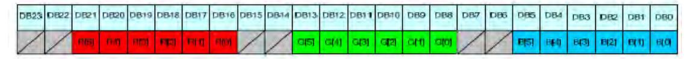

| DB23 | DB22 | DB21 | DE20 | DB19 | DB18 | DB17 | DB16 | DB15 | DB14 | DB13 | DB12 | DB11 | DB10 | Dea | DBS | D87  | 086  | DBS  | DB4 | DB3 | DB2  | DB4   | DB0  |
|------|------|------|------|------|------|------|------|------|------|------|------|------|------|-----|-----|------|------|------|-----|-----|------|-------|------|
| HIM  | 0161 | na.  | 1991 | 010) | mra. | 011) | pig  | SIT! | আল   | 99   | SIT  | CHI  | SIN  | anj | 200 | PE7) | H(0) | P(S) | PMJ | 脚洞  | B(F) | Parti | B(O) |

#### RGB Interfa c e 16/18/24-bit pixel format selection

The Pixel clock (PCLK) is running all the time without stopping, it is used for entering VS, HS, DE and D[23:0] states when there is a rising edge of the PCLK. The PCLK can not be used as the internal clock for other functions of the display module.

Vertical sync hronization (VS) is used to tell when there is received a new frame of the display. This is low enable and its state is read to the display module by a rising edge of the PCLK signal.

Horizontal synchroni zation (HS) is used to tell when there is received a new line of the frame. This is low enable and its state is read to the display module by a rising edge of the PCLK signal .

DE (Data Enable) is used to tell when there is received RGB information that should be transferred on the display. This is a high enable and its state is read to the display module by a rising edge of the PCLK signal.

D[23:0] are used to tell what is the information of the image that is transferred on the display(When DE= '0' (low) and there is a rising edge of PCLK). D[23:0] can be '0' (low) or '1'(high). These lines are read by a rising edge of the PCLK signal.

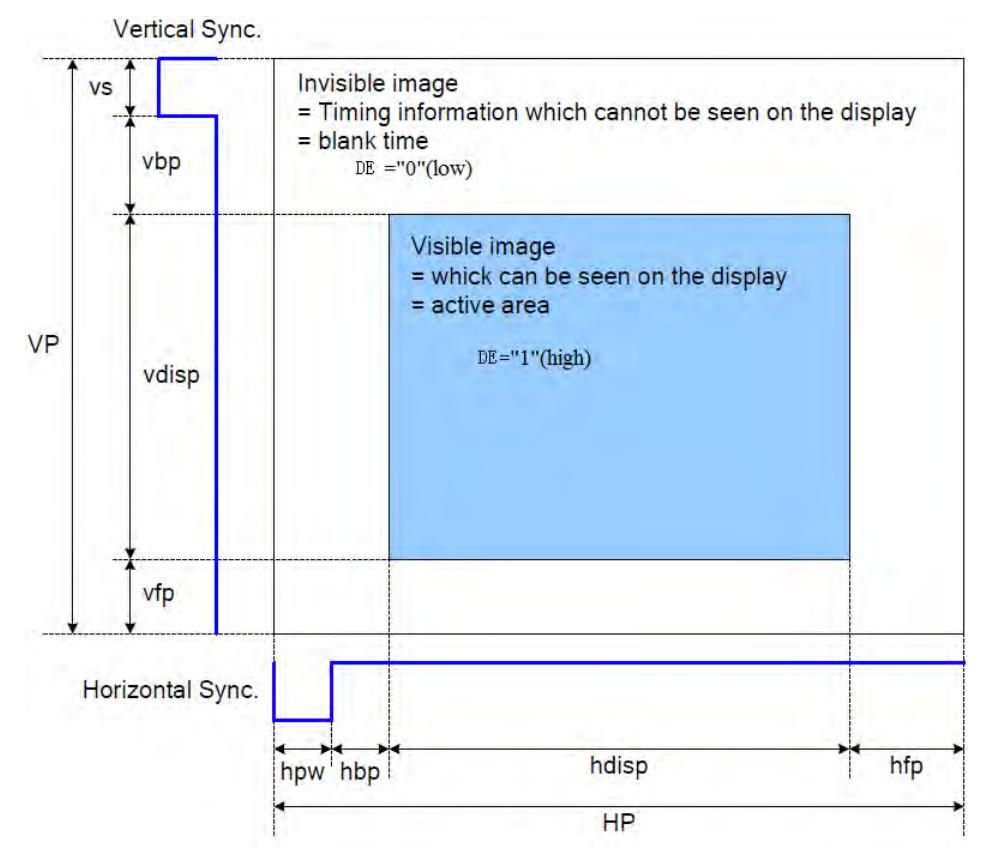

DRAM Access Area by RGB Interface

#### **6.1.2 RGB Interface Mode Selection**

NV3052CGRB supports two kinds of RGB interface, DE mode and SYNC mode.The table shown below uses command 23h to select RGB interface mode.

| sync_mode[1:0] | RGB Mode     |
|----------------|--------------|
| 00             | SYNC+DE mode |
| 01             | SYNC mode    |
| 10             | DE mode      |
| 11             | SYNC+DE mode |

#### **6.1.3 RGB Interface Timing**

The timing chart of RGB interface DE mode is shown as follows.

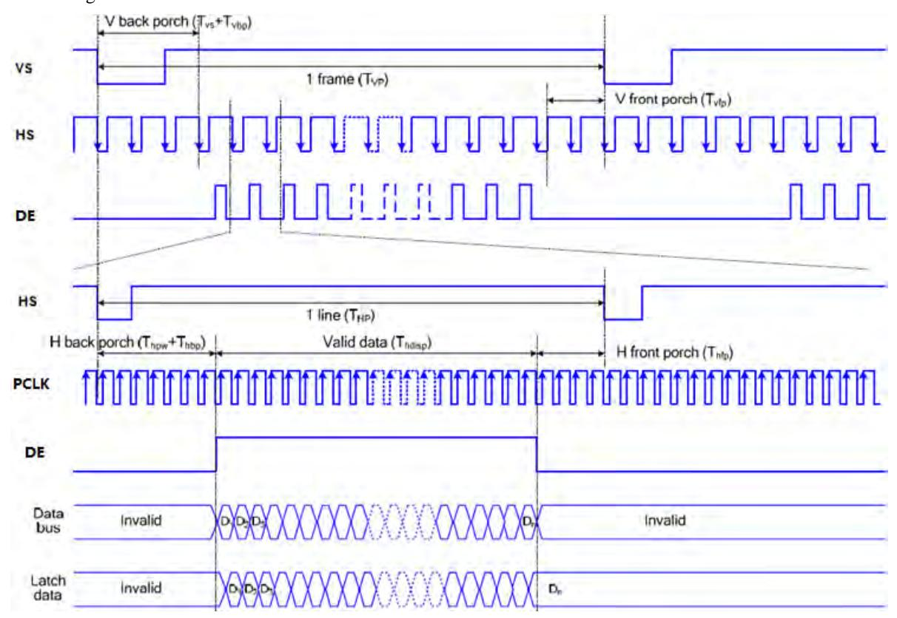

Timing Chart of Signals in RGB Interface DE Mode

Note: The setting of front porch and back porch in host must match that in IC as this mode.

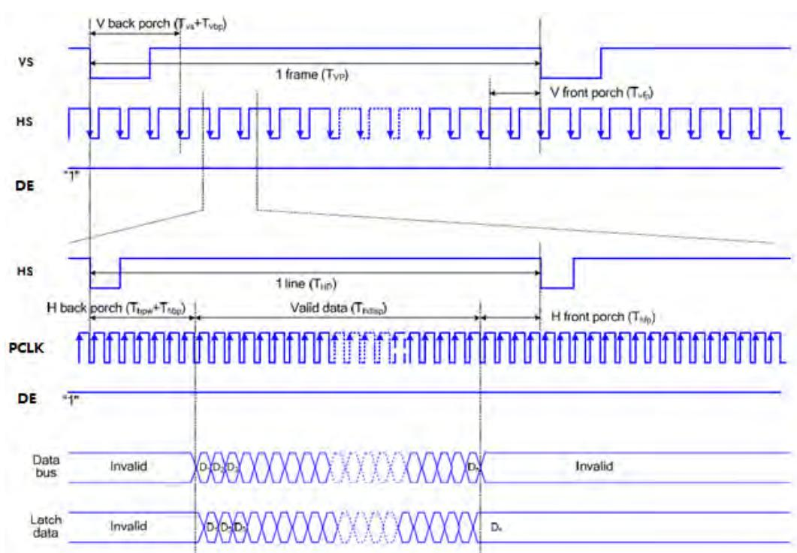

The timing chart of RGB interface SYNC mode is shown as follows.

Timing chart of RGB interface SYNC mode

Below Table provide the timing parameter by external Vertical-cycle

(Resolution for 720/640 horizontal x 1280 vertical display with Frame-Rate of 60Hz)

| Parameters                        | Symbols | Min. | Typ      | Max.   | Unit |
|-----------------------------------|---------|------|----------|--------|------|
| Horizontal Synchronization        | hpw     | -    | 2        | -      | PCLK |
| Horizontal Back Porch             | hbp     | -    | 42       | -      | PCLK |
| Horizontal Front Porch            | hfp     | -    | 44       | -      | PCLK |
| Hsync+ HBP+ HFP                   | -       | -    | 88*Note1 | -      | PCLK |
| Horizontal Address (Display area) | hdisp   | -    | 720      | -      | PCLK |
| Horizontal cycle                  | -       | -    | 12.703   | -      | us   |
| Vertical Synchronization          | VS      | -    | 2        | -      | Line |
| Vertical Back Porch               | vbp     | -    | 14       | -      | Line |
| Vertical Front Porch              | vfp     | -    | 16       | -      | Line |
| Vsync+ VBP+ VFP                   | -       | -    | 32       | -      | Line |
| Vertical Address (Display area)   | vdisp   | -    | 1280     | -      | Line |
| Vertical cycle                    | -       | -    | 16.66    | 16.181 | ms   |
| Frame-Rate                        | -       | -    | 60       | 61.8   | Hz   |

&quot;-" means no limit.

Note : 1. If using Image Process Algorithm, Type value for H-blanking is minimum requirement.

## **6.2. Serial Interface (SPI)**

The serial interface is used to communication between the micro controller and the LCD driver chip. It contains CSX (chip select), SCL (serial clock), SDI (serial data input) and SDO (serial data output). Serial clock (SCL) is used for interface with MPU only, so it can be stopped when no communication is necessary. If the host places the SDI line into high-impedance state during the read intervals, then the SDI and SDO can be tied together.

#### **6.2.1. SPI write mode**

The write mode of the interface means the micro controller writes commands and data to the NV3052CGRB. The serial interface is initialized when CSX is high. In this state, SCL clock pulse or SDI data have no effect. A falling edge on CSX enables the serial interface and indicates the start of data transmission. When CSX is high, SCL clock is ignored. During the high time of CSX the serial interface is initialized. At the falling CSX edge, SCL can be high or low. SDI / SDO is sampled at the rising edge of SCL. R/W indicates, whether the byte is read command(R/W = '1') or write command (R/W = '0'). It is sampled when first rising SCL edge. If CSX stays low after the last bit of command/data byte, the serial interface expects the R/W bit of the next byte at the next rising edge of SCL.

#### **Register Write: Singal Parameter**

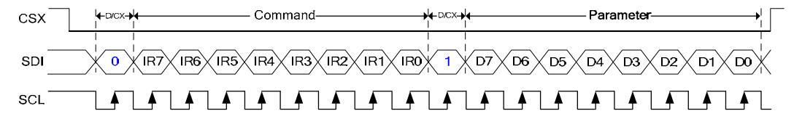

Figure: SPI Protocol for write

#### **6.2.2. SPI read mode**

The read mode of the interface means that the micro controller reads register value from the NV3052CGRB. To do so the micro controller first has to send a command and then the following byte is transmitted in the opposite direction. After that CSX is required to go high before a new command is send. The NV3052CGRB samples the SDI (input data) at the rising edges, but shifts SDO (output data) at the falling SCL edges.

Thus the micro controller is supported to read data at the rising SCL edges. After the read status command has been sent, the SDI line must be set to tri-state no later than at the falling SCL edge of the last bit. For the memory data read, a dummy clock cycle is needed (8 SCL clocks) to wait the memory data send out in SPI interface. But it doesn't need any dummy clock when execute the command data read.

#### **Register Read: Without dummy clock**

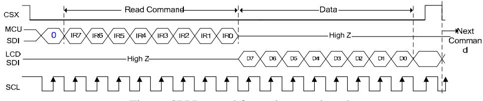

Figure: SPI Protocol for register read mode

#### **6.3. Sleep Out-Command And Self-Diagnostic Functions Of The Display Module**

#### **6.3.1. Register loading detection**

Sleep Out-command is a trigger for an internal function of the display module, which indicates, if the display module loading function of factory default values from OTP (one-time programming memory) to registers of the display controller is working properly.

There are compared factory values of the OTP and register values of the display controller by the display controller. If those both values (OTP and register values) are same, there is inverted (=increased by 1) a bit in "Read Display Self-Diagnostic Result (0Fh)" (=RDDSDR) (The used bit of this command is D7). If those both values are not same, this bit (D7) is not inverted (= increased by 1).

The flow chart for this internal function is following:

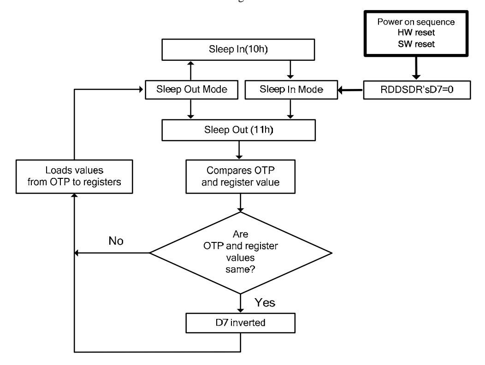

#### **6.3.2. Functionality detection**

Sleep Out-command is a trigger for an internal function of the display module, which indicates, if the display module is still running and meets functionality requirements.

The internal function (= the display controller) is comparing, if the display module is still meeting functionality requirements (only Booster voltage level). If functionality requirement is met, there is inverted (= increased by 1) a bit in "Read Display Self- Diagnostic Result (0Fh)" (=RDDSDR) (The used bit of this command is D6). If functionality requirement is not same, this bit (D6) is not inverted (= increased by 1).

The flow chart for this internal function is following:

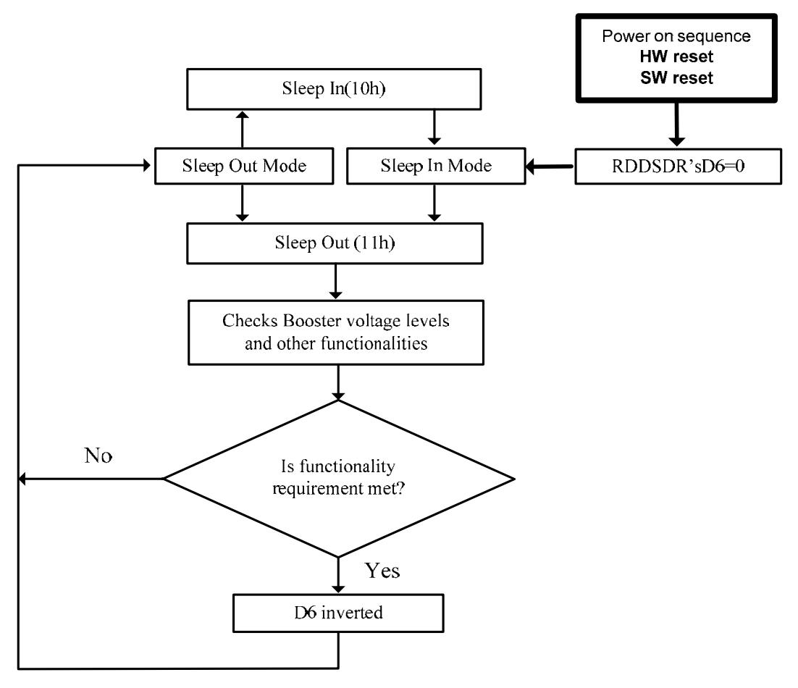

Note: There is needed 120msec after Sleep Out -command, when there is changing from Sleep In –mode to Sleep Out -mode, before there is possible to check if functionality requirements are met and a value of RDDSDR's D6 is valid. Otherwise, there is 5msec delay for D6's value, when Sleep Out –command is sent in Sleep Out -mode.

#### **6.4. Power On/Off Sequence**

IOVCC and VCI can be applied in any order. IOVCC and VCI can be powered down in any order.

During power off, if LCD is in the Sleep Out mode, VCI and IOVCC must be powered down minimum 120msec after RESX has been released.

During power off, if LCD is in the Sleep In mode, IOVCC or VCI can be powered down minimum 0msec after RESX has been released.

CSX can be applied at any timing or can be permanently grounded. RESX has priority over CSX.

Note 1: There will be no damage to the display module if the power sequences are not met.

Note 2: There will be no abnormal visible effects on the display panel during the Power On/Off Sequences.

Note 3: There will be no abnormal visible effects on the display between end of Power On Sequence and before receiving Sleep Out command.

Also between receiving Sleep In command and Power Off Sequence.

If RESX line is not held stable by host during Power On Sequence, then it will be necessary to apply a Hardware Reset (RESX) after Host Power On Sequence is complete to ensure correct operation. Otherwise function is not guaranteed.

The power on/off sequence is illustrated below:

#### **6.4.1. Case 1 – RESX line is held high or unstable by host at power on**

If RESX line is held High or unstable by the host during Power On, then a Hardware Reset must be applied after both VCI and IOVCC have been applied – otherwise correct functionality is not guaranteed. There is no timing restriction upon this hardware reset.

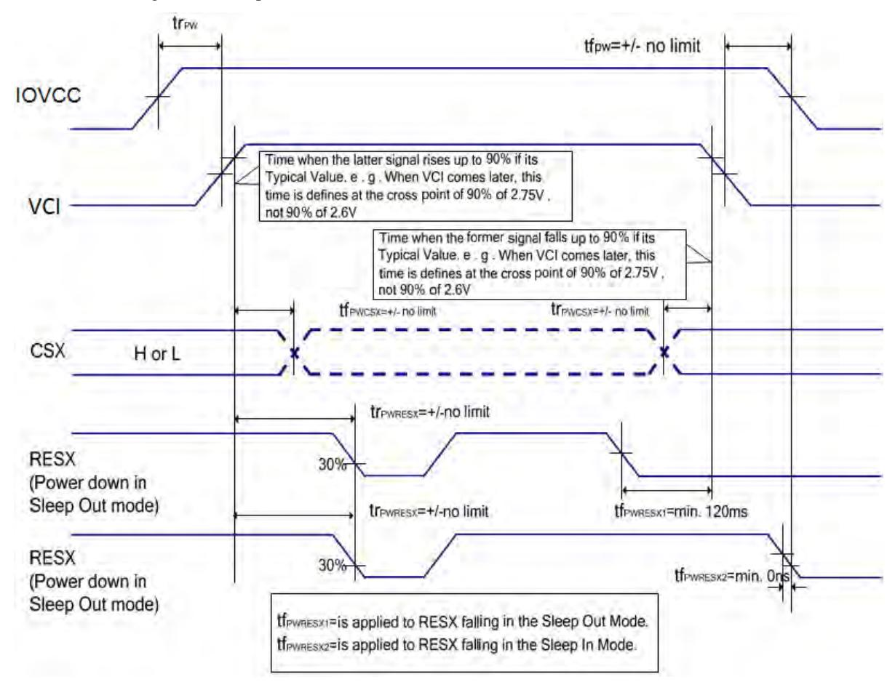

#### **6.4.2. Case 2 – RESX line is held low or unstable by host at power on**

If RESX line is held Low (and stable) by the host during Power On, then the RESX must be held low for minimum 10sec after both VCI and IOVCC have been applied.

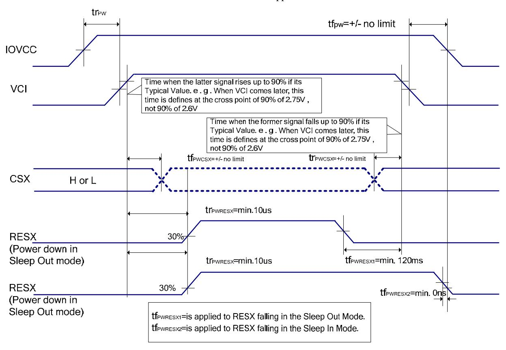

#### **6.4.3. Uncontrolled power off**

The uncontrolled power off means a situation when e.g. there is removed a battery without the controlled power off sequence. There will not be any damages for the display module or the display module will not cause any damages for the host or lines of the interface.

At an uncontrolled power off the display will go blank and there will not be any visible effects within (TBD) second on the display (blank display) and remains blank until "Power On Sequence" powers it up.

# **7. ELECTRICAL SPECIFICATION**

#### **7.1. Absolute Maximum Ratings**

(VCI=2.5V~6.0V, IOVCC = 1.65V~3.6V, Ta = **-**30℃ ~ 85℃)

| Parameter              | Symbol    | Rating            | Unit | Note |
|------------------------|-----------|-------------------|------|------|
| Power Supply Voltage 1 | IOVCC-VSS | -0.3 ~ +4.5       | V    |      |
| Power Supply Voltage 3 | VCI-VSS   | -0.3 ~ +6.6       | V    |      |
| Power Supply Voltage 4 | VPP-VSS   | -0.3 ~ +7.8       | V    |      |
| Power Supply Voltage 5 | DVDD-VSS  | -0.3 ~ +1.8       | V    |      |
| Power Supply Voltage 6 | VSP-VSS   | -0.3 ~ +6.6       | V    |      |
| Power Supply Voltage 7 | VSS-VSN   | -0.3 ~ +6.6       | V    |      |
| Power Supply Voltage 8 | VGH-VGL   | -0.3 ~ +32        | V    |      |
| Input Voltage          | Vt        | -0.3 ~ IOVCC +0.3 | V    |      |
| Operating Temperature  | Topr      | -30 ~ +85         | ℃    |      |
| Storage Temperature    | Tstg      | -40 ~ +125        | ℃    |      |

Note: If the absolute maximum rating of even is one of the above parameters is exceeded even momentarily, the quality of the product may be degraded. Absolute maximum ratings, therefore, specify the values exceeding which the product may be physically damaged. Be sure to use the product within the range of the absolute maximum ratings.

## **7.2. DC characteristic**

#### **7.2.1. Basic DC characteristic**

(VCI=2.5V~6.0V, IOVCC = 1.65V~3.6V, Ta = -30℃ ~ 85℃)

|                                       |        |                                                                                             |           | Specification |           |      |       |
|---------------------------------------|--------|---------------------------------------------------------------------------------------------|-----------|---------------|-----------|------|-------|
| Parameter                             | Symbol | Conditions                                                                                  | MIN       | TYP           | MAX       | Unit | Notes |
| Power & Operation Voltage    |        |                                                                                             |           |               |           |      |       |
| Analog Operating voltage              | VCI    | Operating Voltage                                                                           | 2.5       | 2.8           | 6.0       | V    |       |
| Logic Operating voltage               | IOVCC  | I/O supply voltage                                                                          | 1.65      | 1.8           | 3.6       | V    |       |
| Input/Output                          |        |                                                                                             |           |               |           |      |       |
| Logic High level input voltage        | VIH    | -                                                                                           | 0.7*IOVCC | -             | IOVCC     | V    |       |
| Logic Low level input voltage         | VIL    | -                                                                                           | VSS       | -             | 0.3*IOVCC | V    |       |
| Logic High level output voltage       | VOH    | IOH = -0.1mA                                                                                | 0.8*IOVCC | -             | IOVCC     | V    |       |
| Logic Low level output voltage        | VOL    | IOL = +0.1mA                                                                                | VSS       | -             | 0.2*IOVCC | V    |       |
| Logic Input leakage current           | IIL    | Vin=IOVCC or VSSI                                                                           | -0.1      | -             | +0.1      | uA   |       |
| VCOM Operation                        |        |                                                                                             |           |               |           |      |       |
| VCOM voltage                          | VCOM   | -                                                                                           | -3.375    | -1.0          | 0         | V    |       |
| Source Driver                         |        |                                                                                             |           |               |           |      |       |
| Source output range                   | Vsout  | -                                                                                           | VGMN+0.1  | -             | VGMP-0.1  | V    |       |
| Gamma positive reference voltage VGMP |        | -                                                                                           | 2.62      | -             | 5.68      | V    |       |
| Gamma negative reference voltage      | VGMN   | -                                                                                           | -5.68     | -             | -2.62     | V    |       |
| Source output settling time           | Tr     | Below with 99% precision                                                                    | -         | TBD           | -         | us   |       |
| Output deviation voltage              | V,dev  | Sout >=+4.2V, Sout<=+0.8V                                                                   | -         | -             | TBD       | mV   |       |
| (Source positive output channel)      |        | +4.2V>Sout>+0.8V                                                                            | -         | -             | TBD       | mV   |       |
| Output deviation voltage              | V,dev  | Sout <=-4.2V, Sout>=-0.8V                                                                   | -         | -             | TBD       | mV   |       |
| (Source negative output channel)      |        | -4.2V <sout<-0.8v< td=""><td>-</td><td>-</td><td>TBD</td><td>mV</td><td></td></sout<-0.8v<> | -         | -             | TBD       | mV   |       |

| Output offset voltage      | VOFFSET | -         | -     | -    | TBD   | mV |       |
|----------------------------|---------|-----------|-------|------|-------|----|-------|
| Reference Voltage          |         |           |       |      |       |    |       |
| Internal reference voltage | VREF    |           | 1.876 | 2.00 | 2.125 | V  |       |
| Booster operation          |         |           |       |      |       |    |       |
|                            | VSP     |           | 4.5   |      | 6     | V  |       |
| 1st booster output voltage | VSN     |           | -6    |      | -4.5  | V  |       |
|                            | VGH     |           | 11.0  |      | 20.5  | V  |       |
| 2ndbooster output voltage  | VGL     |           | -15.5 |      | -7.0  | V  |       |
| Current Consumption        |         |           |       |      |       |    |       |
|                            | IIOVCC  |           |       | TBD  | TBD   | uA |       |
| Sleep-IN mode              | IVCI    | RESX=High |       | TBD  | TBD   | uA |       |
|                            | IIOVCC  |           |       | TBD  | TBD   | uA | Note2 |
| Deep standby mode          | IVCI    | RESX=High |       | TBD  | TBD   | uA |       |

Note1. The power/temperature conditions for Current consumption (Sleep-IN) part is VCI=3.0V, IOVCC=1.8V@25℃

(These values might be updated after further evaluation.)

#### **7.3. AC characteristic**

#### **7.3.1. Reset timing characteristics**

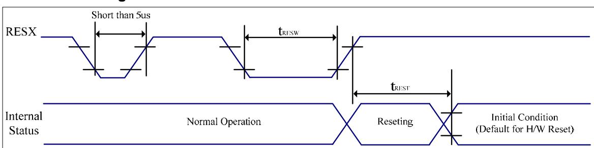

VSS=0V, IOVCC=1.65V to 3.6V, VCI=2.5V to 6.0V,Ta = -30℃ to 85℃

| Symbol | Parameter                 | Related Pins | MIN | TYP | MAX | Note                                        | Unit |
|--------|---------------------------|-----------------|-----|-----|-----|---------------------------------------------|------|
| tRESW  | *1) Reset low pulse width | RESX            | 10  | -   | -   | -                                           | us   |
|        |                           | -               | -   | -   | 5   | When reset applied during Sleep in mode  | ms   |
| tREST  | *2) Reset complete time   | -               | -   | -   | 120 | When reset applied during Sleep out mode | ms   |

Table: Reset input timing

Note 1: Due to an electrostatic discharge on RESX line,spike does not cause irregular system reset according to the table below.

| RESX Pulse           | Action                                                             |
|----------------------|--------------------------------------------------------------------|
| Shorter than 5us     | Reset Rejected                                                     |
| Longer than 10us     | Reset                                                              |
| Between 5us and 10us | Reset starts (It depends on voltage and temperature condition.) |

Note 2: During the resetting period, the display will be blanked (The display is entering blanking sequence, which maximum time is 120ms, when Reset Starts in Sleep Out mode. The display remains the blank state in Sleep In mode) , then return to default condition for H/W reset.

Note 3: During Reset Complete Time, ID1/ID2/ID3 and VCOM value in OTP will be latched to internal register. After a rising edge of RESX, there is a H/W reset complete time (Trest) which lasted 5ms..The loading operation will be done every time during this reset.

Note 4: Spike Rejection also applies during a valid reset pulse as shown below:

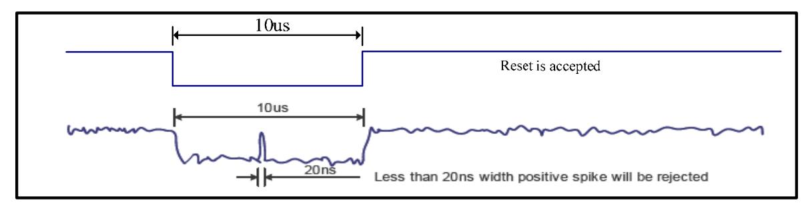

Note 5. It is necessary to wait 5msec after releasing RESX before sending commands. Also Sleep Out command cannot be sent for 120 msec.

#### **7.3.2. Parallel 24/18/16-bit RGB Interface Timing Characteristics**

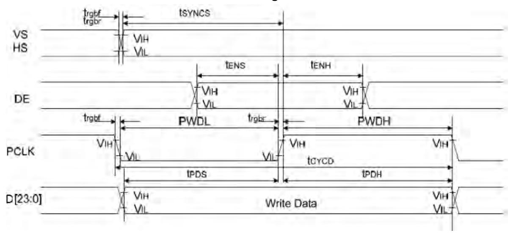

| Signal  | Symbol      | Parameter                 | min | max | Unit | Description  |
|---------|-------------|---------------------------|-----|-----|------|--------------|
|         | tSYNCS      | VS/HS setup time          | 5   | -   | ns   |              |
| VS/HS   | tSYNCH      | VS/HS hold time           | 5   | -   | ns   |              |
|         | tENS        | DE setup time             | 5   | -   | ns   |              |
| DE      | tENH        | DE hold time              | 5   | -   | ns   | 24/18/16-bit |
|         | tPOS        | Data setup time           | 5   | -   | ns   | bus RGB      |
| D[23:0] | tPDH        | Data hold time            | 5   | -   | ns   | interface    |
|         | PWDH        | PCLK high-level period    | 13  | -   | ns   | mode         |
|         | PWDL        | PCLK low-level period     | 13  | -   | ns   |              |
| PCLK    | tCYCD       | PCLK cycle time           | 28  | -   | ns   |              |
|         | trgbr,trgbf | PCLK,HS,VS rise/fall time | -   | 15  | ns   |              |

Note 1: IOVCC=1.65 to 3.6V, VCI=2.5 to 6V, VSSA=VSS=0V, Ta=**-**30 to 85℃

#### **7.3.3. Serial interface characteristics (SPI)**

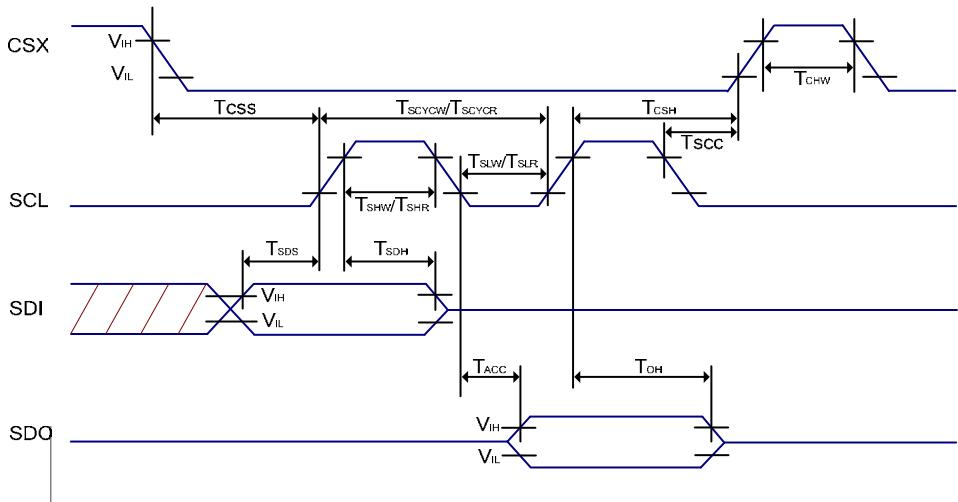

Figure: 3-pin Serial Interface Characteristics

Table: SPI Interface Characteristics

| Signal | Symbol | Parameter                   | MIN | MAX | Unit | Description                      |
|--------|--------|-----------------------------|-----|-----|------|----------------------------------|
|        | TCSS   | Chip select setup time      | 15  | -   | ns   |                                  |
|        | TCSH   | Chip select hold time       | 15  | -   | ns   |                                  |
| CSX    | TSCC   | Chip select setup time      | 20  | -   | ns   | -                                |
|        | TCHW   | Chip "H" pulse width        | 40  | -   | ns   |                                  |
|        | TSCYCW | Serial clock cycle (Write)  | 66  | -   | ns   |                                  |
|        | TSHW   | SCL "H" pulse width (Write) | 10  | -   | ns   | -                                |
| SCL    | TSLW   | SCL "L" pulse width (Write) | 10  | -   | ns   |                                  |
|        | TSCYCR | Serial clock cycle (Read)   | 150 | -   | ns   |                                  |
|        | TSHR   | SCL"H" pulse width (Read)   | 60  | -   | ns   | -                                |
|        | TSLR   | SCL"L" pulse width (Read)   | 60  | -   | ns   |                                  |
|        | TSDS   | Data setup time             | 10  | -   | ns   | -                                |
|        | TSDH   | Data hold time              | 10  | -   | ns   |                                  |
| SDI    | TACC   | Access time                 | 10  | 50  | ns   | For maximum                      |
|        | TOH    | Output disable time         | 15  | 50  | ns   | CL=30pF For minimum CL=8pF |

Note 1: IOVCC=1.65 to 3.6V, VCI=2.5 to 6V, VSSA=VSS=0V, Ta=**-**30 to 85℃

Note 2: The rise time and fall time (tr, tf) of input signal is specified at 15 ns or less. Logic high and low levels are specified as 30% and 70% of IOVCC for Input signals.

# **8. CHIP INFORMATION**

#### **8.1. PAD Assignment**

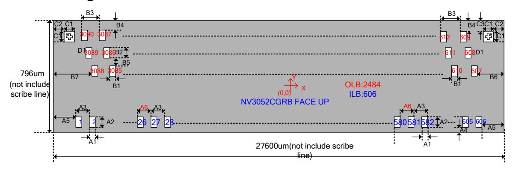

| Symbol | Size  | Symbol | Size  | Symbol | Size     |
|--------|-------|--------|-------|--------|----------|
| A1     | 30    | B1     | 16    | B7     | 160.4    |
| A2     | 48    | B2     | 65    | C1     | 50       |
| A3     | 45    | B3     | 33    | C2     | 69       |
| A4     | 13    | B4     | 13    | C3     | 13       |
| A5     | 166.5 | B5     | 25    |        |          |
| A6     | 55    | B6     | 138.4 |        | Unit: um |

Note: There is temperature compensation design.

#### **Maximum layout resistance:**

| Name                              | Type         | Maximum layout resistance | Unit |
|-----------------------------------|--------------|---------------------------|------|
| IOVCC                             | Power supply | 10                        | Ω    |
| VCI                               | Power supply | 10                        | Ω    |
| VSP,VSN, CSP, CSN                 | Power supply | 10                        | Ω    |
| DGND                              | Power supply | 10                        | Ω    |
| AGND                              | Power supply | 10                        | Ω    |
| VSSI                              | Power supply | 10                        | Ω    |
| CGND1                             | Power supply | 10                        | Ω    |
| RGND                              | Power supply | 10                        | Ω    |
| PPRECH                            | Input/Output | 10                        | Ω    |
| VPP                               | Power supply | 10                        | Ω    |
| BOOSTM[1:0]                       | Input        | 100                       | Ω    |
| EXTP, EXTN                        | Output       | 30                        | Ω    |
| SCL,CSX,RESX                      | Input        | 100                       | Ω    |
| SDI                               | Input/Output | 100                       | Ω    |
| SDO                               | Output       | 100                       | Ω    |
| TE, TE1                           | Output       | 100                       | Ω    |
| LEDPWM                            | Output       | 100                       | Ω    |
| DVDD                              | Output       | 10                        | Ω    |
| VGMP, VGMN                        | Output       | 10                        | Ω    |
| VREF                              | Output       | 10                        | Ω    |
| VGL                               | Output       | 10                        | Ω    |
| ATEST[2:1]                        | Output       | 100                       | Ω    |
| GOUT_L[22:1]                      | Output       | 30                        | Ω    |
| GOUT_R[22:1]                      | Output       | 30                        | Ω    |
| VCOM_L, VCOM_R                    | Output       | 10                        | Ω    |
| HS, VS, PCLK, DE, D[23:0]         | Input        | 30                        | Ω    |
| TEST_EN, BIST_EN, SPI_EN, CLK_SEL | Input        | 100                       | Ω    |
| EXT_CLK, TEST[3:0]                | Input        | 30                        | Ω    |
| TOUT[3:0]                         | Output       | 30                        | Ω    |

#### **8.2. PAD Location**

| No. | Pad name   | X- axis  | Y- axis | No. | Pad name | X- axis  | Y- axis | No. | Pad name | X- axis | Y- axis |
|-----|------------|----------|---------|-----|----------|----------|---------|-----|----------|---------|---------|
| 1   | DUMMY1     | -13622.5 | -361    | 43  | DUMMY    | -11722.5 | -361    | 85  | DUMMY    | -9832.5 | -361    |
| 2   | GOUT_L[1]  | -13577.5 | -361    | 44  | DUMMY    | -11677.5 | -361    | 86  | DUMMY    | -9787.5 | -361    |
| 3   | GOUT_L[2]  | -13532.5 | -361    | 45  | DUMMY    | -11632.5 | -361    | 87  | DUMMY    | -9742.5 | -361    |
| 4   | GOUT_L[3]  | -13487.5 | -361    | 46  | DUMMY    | -11587.5 | -361    | 88  | DUMMY    | -9697.5 | -361    |
| 5   | GOUT_L[4]  | -13442.5 | -361    | 47  | DUMMY    | -11542.5 | -361    | 89  | DUMMY    | -9652.5 | -361    |
| 6   | GOUT_L[5]  | -13397.5 | -361    | 48  | DUMMY    | -11497.5 | -361    | 90  | DUMMY    | -9607.5 | -361    |
| 7   | GOUT_L[6]  | -13352.5 | -361    | 49  | DUMMY    | -11452.5 | -361    | 91  | DUMMY    | -9562.5 | -361    |
| 8   | GOUT_L[7]  | -13307.5 | -361    | 50  | DUMMY    | -11407.5 | -361    | 92  | DUMMY    | -9517.5 | -361    |
| 9   | GOUT_L[8]  | -13262.5 | -361    | 51  | DUMMY    | -11362.5 | -361    | 93  | DUMMY    | -9472.5 | -361    |
| 10  | GOUT_L[9]  | -13217.5 | -361    | 52  | DUMMY    | -11317.5 | -361    | 94  | DUMMY    | -9427.5 | -361    |
| 11  | GOUT_L[10] | -13172.5 | -361    | 53  | DUMMY    | -11272.5 | -361    | 95  | DUMMY    | -9382.5 | -361    |
| 12  | GOUT_L[11] | -13127.5 | -361    | 54  | DUMMY    | -11227.5 | -361    | 96  | DUMMY    | -9337.5 | -361    |
| 13  | GOUT_L[12] | -13082.5 | -361    | 55  | DUMMY    | -11182.5 | -361    | 97  | DUMMY    | -9292.5 | -361    |
| 14  | GOUT_L[13] | -13037.5 | -361    | 56  | DUMMY    | -11137.5 | -361    | 98  | DUMMY    | -9247.5 | -361    |
| 15  | GOUT_L[14] | -12992.5 | -361    | 57  | DUMMY    | -11092.5 | -361    | 99  | DUMMY    | -9202.5 | -361    |
| 16  | GOUT_L[15] | -12947.5 | -361    | 58  | DUMMY    | -11047.5 | -361    | 100 | DUMMY    | -9157.5 | -361    |
| 17  | GOUT_L[16] | -12902.5 | -361    | 59  | DUMMY    | -11002.5 | -361    | 101 | DUMMY    | -9112.5 | -361    |
| 18  | GOUT_L[17] | -12857.5 | -361    | 60  | DUMMY    | -10957.5 | -361    | 102 | DUMMY    | -9067.5 | -361    |
| 19  | GOUT_L[18] | -12812.5 | -361    | 61  | DUMMY    | -10912.5 | -361    | 103 | DUMMY    | -9022.5 | -361    |
| 20  | GOUT_L[19] | -12767.5 | -361    | 62  | DUMMY    | -10867.5 | -361    | 104 | DUMMY    | -8977.5 | -361    |
| 21  | GOUT_L[20] | -12722.5 | -361    | 63  | DUMMY    | -10822.5 | -361    | 105 | DUMMY    | -8932.5 | -361    |
| 22  | GOUT_L[21] | -12677.5 | -361    | 64  | DUMMY    | -10777.5 | -361    | 106 | DUMMY    | -8887.5 | -361    |
| 23  | GOUT_L[22] | -12632.5 | -361    | 65  | DUMMY    | -10732.5 | -361    | 107 | DUMMY    | -8842.5 | -361    |
| 24  | VCOM_L     | -12587.5 | -361    | 66  | DUMMY    | -10687.5 | -361    | 108 | DUMMY    | -8797.5 | -361    |
| 25  | VCOM_L     | -12542.5 | -361    | 67  | DUMMY    | -10642.5 | -361    | 109 | DUMMY    | -8752.5 | -361    |
| 26  | VCOM_L     | -12497.5 | -361    | 68  | DUMMY    | -10597.5 | -361    | 110 | DUMMY    | -8707.5 | -361    |
| 27  | AGND       | -12442.5 | -361    | 69  | DUMMY    | -10552.5 | -361    | 111 | DUMMY    | -8662.5 | -361    |
| 28  | AGND       | -12397.5 | -361    | 70  | DUMMY    | -10507.5 | -361    | 112 | DUMMY    | -8617.5 | -361    |
| 29  | AGND       | -12352.5 | -361    | 71  | DUMMY    | -10462.5 | -361    | 113 | DUMMY    | -8572.5 | -361    |
| 30  | AGND       | -12307.5 | -361    | 72  | DUMMY    | -10417.5 | -361    | 114 | DUMMY    | -8527.5 | -361    |
| 31  | AGND       | -12262.5 | -361    | 73  | DUMMY    | -10372.5 | -361    | 115 | DUMMY    | -8482.5 | -361    |
| 32  | AGND       | -12217.5 | -361    | 74  | DUMMY    | -10327.5 | -361    | 116 | DUMMY    | -8437.5 | -361    |
| 33  | AGND       | -12172.5 | -361    | 75  | DUMMY    | -10282.5 | -361    | 117 | DUMMY    | -8392.5 | -361    |
| 34  | AGND       | -12127.5 | -361    | 76  | DUMMY    | -10237.5 | -361    | 118 | DUMMY    | -8347.5 | -361    |
| 35  | AGND       | -12082.5 | -361    | 77  | DUMMY    | -10192.5 | -361    | 119 | DUMMY    | -8302.5 | -361    |
| 36  | AGND       | -12037.5 | -361    | 78  | DUMMY    | -10147.5 | -361    | 120 | DUMMY    | -8257.5 | -361    |
| 37  | AGND       | -11992.5 | -361    | 79  | DUMMY    | -10102.5 | -361    | 121 | DUMMY    | -8212.5 | -361    |
| 38  | AGND       | -11947.5 | -361    | 80  | DUMMY    | -10057.5 | -361    | 122 | DUMMY    | -8167.5 | -361    |
| 39  | DUMMY      | -11902.5 | -361    | 81  | DUMMY    | -10012.5 | -361    | 123 | DUMMY    | -8122.5 | -361    |
| 40  | DUMMY      | -11857.5 | -361    | 82  | DUMMY    | -9967.5  | -361    | 124 | DUMMY    | -8077.5 | -361    |
| 41  | DUMMY      | -11812.5 | -361    | 83  | DUMMY    | -9922.5  | -361    | 125 | DUMMY    | -8032.5 | -361    |
| 42  | DUMMY      | -11767.5 | -361    | 84  | DUMMY    | -9877.5  | -361    | 126 | DUMMY    | -7987.5 | -361    |

| No. | Pad name | X- axis | Y-axis | No. | Pad name | X- axis | Y-axis | No. | Pad name | X- axis | Y- axis |
|-----|----------|---------|--------|-----|----------|---------|--------|-----|----------|---------|---------|
| 127 | DUMMY    | -7942.5 | -361   | 169 | AGND     | -6052.5 | -361   | 211 | D23      | -4162.5 | -361    |
| 128 | DUMMY    | -7897.5 | -361   | 170 | DGND     | -6007.5 | -361   | 212 | D23      | -4117.5 | -361    |
| 129 | DUMMY    | -7852.5 | -361   | 171 | DGND     | -5962.5 | -361   | 213 | D23      | -4072.5 | -361    |
| 130 | DUMMY    | -7807.5 | -361   | 172 | DGND     | -5917.5 | -361   | 214 | D22      | -4027.5 | -361    |
| 131 | DUMMY    | -7762.5 | -361   | 173 | DGND     | -5872.5 | -361   | 215 | D22      | -3982.5 | -361    |
| 132 | DUMMY    | -7717.5 | -361   | 174 | DGND     | -5827.5 | -361   | 216 | D22      | -3937.5 | -361    |
| 133 | DUMMY    | -7672.5 | -361   | 175 | DGND     | -5782.5 | -361   | 217 | D22      | -3892.5 | -361    |
| 134 | DUMMY    | -7627.5 | -361   | 176 | DGND     | -5737.5 | -361   | 218 | D22      | -3847.5 | -361    |
| 135 | DUMMY    | -7582.5 | -361   | 177 | DGND     | -5692.5 | -361   | 219 | D22      | -3802.5 | -361    |
| 136 | DUMMY    | -7537.5 | -361   | 178 | DGND     | -5647.5 | -361   | 220 | D21      | -3757.5 | -361    |
| 137 | DUMMY    | -7492.5 | -361   | 179 | VSSI     | -5602.5 | -361   | 221 | D21      | -3712.5 | -361    |
| 138 | DUMMY    | -7447.5 | -361   | 180 | VSSI     | -5557.5 | -361   | 222 | IOVCC    | -3667.5 | -361    |
| 139 | DUMMY    | -7402.5 | -361   | 181 | VSSI     | -5512.5 | -361   | 223 | IOVCC    | -3622.5 | -361    |
| 140 | IOVCC    | -7357.5 | -361   | 182 | VSSI     | -5467.5 | -361   | 224 | IOVCC    | -3577.5 | -361    |
| 141 | IOVCC    | -7312.5 | -361   | 183 | VSSI     | -5422.5 | -361   | 225 | IOVCC    | -3532.5 | -361    |
| 142 | IOVCC    | -7267.5 | -361   | 184 | VSSI     | -5377.5 | -361   | 226 | IOVCC    | -3487.5 | -361    |
| 143 | IOVCC    | -7222.5 | -361   | 185 | TOUT3    | -5332.5 | -361   | 227 | IOVCC    | -3442.5 | -361    |
| 144 | IOVCC    | -7177.5 | -361   | 186 | TOUT3    | -5287.5 | -361   | 228 | VSSI     | -3397.5 | -361    |
| 145 | IOVCC    | -7132.5 | -361   | 187 | TOUT2    | -5242.5 | -361   | 229 | VSSI     | -3352.5 | -361    |
| 146 | IOVCC    | -7087.5 | -361   | 188 | TOUT2    | -5197.5 | -361   | 230 | VSSI     | -3307.5 | -361    |
| 147 | IOVCC    | -7042.5 | -361   | 189 | TOUT1    | -5152.5 | -361   | 231 | VSSI     | -3262.5 | -361    |
| 148 | IOVCC    | -6997.5 | -361   | 190 | TOUT1    | -5107.5 | -361   | 232 | VSSI     | -3217.5 | -361    |
| 149 | IOVCC    | -6952.5 | -361   | 191 | TOUT0    | -5062.5 | -361   | 233 | VSSI     | -3172.5 | -361    |
| 150 | IOVCC    | -6907.5 | -361   | 192 | TOUT0    | -5017.5 | -361   | 234 | D20      | -3127.5 | -361    |
| 151 | IOVCC    | -6862.5 | -361   | 193 | DUMMY    | -4972.5 | -361   | 235 | D20      | -3082.5 | -361    |
| 152 | IOVCC    | -6817.5 | -361   | 194 | DUMMY    | -4927.5 | -361   | 236 | D20      | -3037.5 | -361    |
| 153 | IOVCC    | -6772.5 | -361   | 195 | VSN      | -4882.5 | -361   | 237 | D20      | -2992.5 | -361    |
| 154 | IOVCC    | -6727.5 | -361   | 196 | VSN      | -4837.5 | -361   | 238 | D19      | -2947.5 | -361    |
| 155 | AGND     | -6682.5 | -361   | 197 | VSN      | -4792.5 | -361   | 239 | D19      | -2902.5 | -361    |
| 156 | AGND     | -6637.5 | -361   | 198 | VSN      | -4747.5 | -361   | 240 | D[7]     | -2857.5 | -361    |
| 157 | AGND     | -6592.5 | -361   | 199 | VSN      | -4702.5 | -361   | 241 | D[7]     | -2812.5 | -361    |
| 158 | AGND     | -6547.5 | -361   | 200 | DUMMY    | -4657.5 | -361   | 242 | D[6]     | -2767.5 | -361    |
| 159 | AGND     | -6502.5 | -361   | 201 | DUMMY    | -4612.5 | -361   | 243 | D[6]     | -2722.5 | -361    |
| 160 | AGND     | -6457.5 | -361   | 202 | DUMMY    | -4567.5 | -361   | 244 | D[5]     | -2677.5 | -361    |
| 161 | AGND     | -6412.5 | -361   | 203 | VSP      | -4522.5 | -361   | 245 | D[5]     | -2632.5 | -361    |
| 162 | AGND     | -6367.5 | -361   | 204 | VSP      | -4477.5 | -361   | 246 | D[4]     | -2587.5 | -361    |
| 163 | AGND     | -6322.5 | -361   | 205 | VSP      | -4432.5 | -361   | 247 | D[4]     | -2542.5 | -361    |
| 164 | AGND     | -6277.5 | -361   | 206 | VSP      | -4387.5 | -361   | 248 | D[3]     | -2497.5 | -361    |
| 165 | AGND     | -6232.5 | -361   | 207 | VSP      | -4342.5 | -361   | 249 | D[3]     | -2452.5 | -361    |
| 166 | AGND     | -6187.5 | -361   | 208 | D23      | -4297.5 | -361   | 250 | D[2]     | -2407.5 | -361    |
| 167 | AGND     | -6142.5 | -361   | 209 | D23      | -4252.5 | -361   | 251 | D[2]     | -2362.5 | -361    |
| 168 | AGND     | -6097.5 | -361   | 210 | D23      | -4207.5 | -361   | 252 | D[1]     | -2317.5 | -361    |

| No. | Pad name | X- axis | Y-axis | No. | Pad name  | X- axis | Y-axis | No. | Pad name | X- axis | Y- axis |
|-----|----------|---------|--------|-----|-----------|---------|--------|-----|----------|---------|---------|
| 253 | D[1]     | -2272.5 | -361   | 295 | BIST_EN   | -382.5  | -361   | 337 | DUMMY    | 1507.5  | -361    |
| 254 | D[0]     | -2227.5 | -361   | 296 | TEST[3]   | -337.5  | -361   | 338 | PPRECH   | 1552.5  | -361    |
| 255 | D[0]     | -2182.5 | -361   | 297 | TEST[2]   | -292.5  | -361   | 339 | PPRECH   | 1597.5  | -361    |
| 256 | HS       | -2137.5 | -361   | 298 | TEST[1]   | -247.5  | -361   | 340 | PPRECH   | 1642.5  | -361    |
| 257 | HS       | -2092.5 | -361   | 299 | TEST[0]   | -202.5  | -361   | 341 | PPRECH   | 1687.5  | -361    |
| 258 | VS       | -2047.5 | -361   | 300 | VSSI      | -157.5  | -361   | 342 | PPRECH   | 1732.5  | -361    |
| 259 | VS       | -2002.5 | -361   | 301 | VSSI      | -112.5  | -361   | 343 | PPRECH   | 1777.5  | -361    |
| 260 | D18      | -1957.5 | -361   | 302 | DUMMY     | -67.5   | -361   | 344 | PPRECH   | 1822.5  | -361    |
| 261 | D18      | -1912.5 | -361   | 303 | DUMMY     | -22.5   | -361   | 345 | PPRECH   | 1867.5  | -361    |
| 262 | PCLK     | -1867.5 | -361   | 304 | IOVCC     | 22.5    | -361   | 346 | PPRECH   | 1912.5  | -361    |
| 263 | PCLK     | -1822.5 | -361   | 305 | IOVCC     | 67.5    | -361   | 347 | PPRECH   | 1957.5  | -361    |
| 264 | DE       | -1777.5 | -361   | 306 | DUMMY     | 112.5   | -361   | 348 | DGND     | 2002.5  | -361    |
| 265 | DE       | -1732.5 | -361   | 307 | DUMMY     | 157.5   | -361   | 349 | DGND     | 2047.5  | -361    |
| 266 | CSX      | -1687.5 | -361   | 308 | DUMMY     | 202.5   | -361   | 350 | DGND     | 2092.5  | -361    |
| 267 | CSX      | -1642.5 | -361   | 309 | DUMMY     | 247.5   | -361   | 351 | DGND     | 2137.5  | -361    |
| 268 | SCL      | -1597.5 | -361   | 310 | NC        | 292.5   | -361   | 352 | DGND     | 2182.5  | -361    |
| 269 | SCL      | -1552.5 | -361   | 311 | NC        | 337.5   | -361   | 353 | VSSI     | 2227.5  | -361    |
| 270 | SDI      | -1507.5 | -361   | 312 | IOVCC     | 382.5   | -361   | 354 | VSSI     | 2272.5  | -361    |
| 271 | SDI      | -1462.5 | -361   | 313 | IOVCC     | 427.5   | -361   | 355 | VSSI     | 2317.5  | -361    |
| 272 | SDO      | -1417.5 | -361   | 314 | RS[1]     | 472.5   | -361   | 356 | VSSI     | 2362.5  | -361    |
| 273 | SDO      | -1372.5 | -361   | 315 | RS[1]     | 517.5   | -361   | 357 | VSSI     | 2407.5  | -361    |
| 274 | LEDPWM   | -1327.5 | -361   | 316 | VSSI      | 562.5   | -361   | 358 | EXTN     | 2452.5  | -361    |
| 275 | LEDPWM   | -1282.5 | -361   | 317 | VSSI      | 607.5   | -361   | 359 | EXTN     | 2497.5  | -361    |
| 276 | LEDPWM   | -1237.5 | -361   | 318 | DUMMY     | 652.5   | -361   | 360 | EXTN     | 2542.5  | -361    |
| 277 | LEDPWM   | -1192.5 | -361   | 319 | DUMMY     | 697.5   | -361   | 361 | EXTN     | 2587.5  | -361    |
| 278 | TE       | -1147.5 | -361   | 320 | IOVCC     | 742.5   | -361   | 362 | EXTN     | 2632.5  | -361    |
| 279 | TE       | -1102.5 | -361   | 321 | IOVCC     | 787.5   | -361   | 363 | EXTN     | 2677.5  | -361    |
| 280 | TE       | -1057.5 | -361   | 322 | BOOSTM[0] | 832.5   | -361   | 364 | EXTN     | 2722.5  | -361    |
| 281 | TE       | -1012.5 | -361   | 323 | BOOSTM[0] | 877.5   | -361   | 365 | EXTN     | 2767.5  | -361    |
| 282 | TE       | -967.5  | -361   | 324 | VSSI      | 922.5   | -361   | 366 | EXTP     | 2812.5  | -361    |
| 283 | TE       | -922.5  | -361   | 325 | VSSI      | 967.5   | -361   | 367 | EXTP     | 2857.5  | -361    |
| 284 | TE1      | -877.5  | -361   | 326 | BOOSTM[1] | 1012.5  | -361   | 368 | EXTP     | 2902.5  | -361    |
| 285 | TE1      | -832.5  | -361   | 327 | BOOSTM[1] | 1057.5  | -361   | 369 | EXTP     | 2947.5  | -361    |
| 286 | TE1      | -787.5  | -361   | 328 | IOVCC     | 1102.5  | -361   | 370 | EXTP     | 2992.5  | -361    |
| 287 | TE1      | -742.5  | -361   | 329 | IOVCC     | 1147.5  | -361   | 371 | EXTP     | 3037.5  | -361    |
| 288 | TE1      | -697.5  | -361   | 330 | IOVCC     | 1192.5  | -361   | 372 | EXTP     | 3082.5  | -361    |
| 289 | TE1      | -652.5  | -361   | 331 | IOVCC     | 1237.5  | -361   | 373 | EXTP     | 3127.5  | -361    |
| 290 | RESX     | -607.5  | -361   | 332 | IOVCC     | 1282.5  | -361   | 374 | D17      | 3172.5  | -361    |
| 291 | RESX     | -562.5  | -361   | 333 | IOVCC     | 1327.5  | -361   | 375 | D17      | 3217.5  | -361    |
| 292 | RESX     | -517.5  | -361   | 334 | DUMMY     | 1372.5  | -361   | 376 | D17      | 3262.5  | -361    |
| 293 | RESX     | -472.5  | -361   | 335 | DUMMY     | 1417.5  | -361   | 377 | D17      | 3307.5  | -361    |
| 294 | TEST_EN  | -427.5  | -361   | 336 | DUMMY     | 1462.5  | -361   | 378 | D17      | 3352.5  | -361    |

| No. | Pad name | X- axis | Y- axis | No. | Pad name | X- axis | Y- axis | No. | Pad name | X- axis | Y- axis |
|-----|----------|---------|---------|-----|----------|---------|---------|-----|----------|---------|---------|
| 379 | D17      | 3397.5  | -361    | 421 | VCI      | 5287.5  | -361    | 463 | VSP      | 7177.5  | -361    |
| 380 | SPI_EN   | 3442.5  | -361    | 422 | VCI      | 5332.5  | -361    | 464 | VSP      | 7222.5  | -361    |
| 381 | SPI_EN   | 3487.5  | -361    | 423 | VCI      | 5377.5  | -361    | 465 | VSP      | 7267.5  | -361    |
| 382 | SPI_EN   | 3532.5  | -361    | 424 | VCI      | 5422.5  | -361    | 466 | VSP      | 7312.5  | -361    |
| 383 | SPI_EN   | 3577.5  | -361    | 425 | VCI      | 5467.5  | -361    | 467 | VSP      | 7357.5  | -361    |
| 384 | SPI_EN   | 3622.5  | -361    | 426 | VCI      | 5512.5  | -361    | 468 | VSN      | 7402.5  | -361    |
| 385 | SPI_EN   | 3667.5  | -361    | 427 | VCI      | 5557.5  | -361    | 469 | VSN      | 7447.5  | -361    |
| 386 | SPI_EN   | 3712.5  | -361    | 428 | IOVCC    | 5602.5  | -361    | 470 | VSN      | 7492.5  | -361    |
| 387 | CLK_SEL  | 3757.5  | -361    | 429 | IOVCC    | 5647.5  | -361    | 471 | VSN      | 7537.5  | -361    |
| 388 | CLK_SEL  | 3802.5  | -361    | 430 | IOVCC    | 5692.5  | -361    | 472 | VSN      | 7582.5  | -361    |
| 389 | EXT_CLK  | 3847.5  | -361    | 431 | IOVCC    | 5737.5  | -361    | 473 | CSN      | 7627.5  | -361    |
| 390 | EXT_CLK  | 3892.5  | -361    | 432 | IOVCC    | 5782.5  | -361    | 474 | CSN      | 7672.5  | -361    |
| 391 | ATEST1   | 3937.5  | -361    | 433 | D16      | 5827.5  | -361    | 475 | D14      | 7717.5  | -361    |
| 392 | ATEST1   | 3982.5  | -361    | 434 | D16      | 5872.5  | -361    | 476 | D14      | 7762.5  | -361    |
| 393 | ATEST2   | 4027.5  | -361    | 435 | D16      | 5917.5  | -361    | 477 | D14      | 7807.5  | -361    |
| 394 | ATEST2   | 4072.5  | -361    | 436 | D16      | 5962.5  | -361    | 478 | D14      | 7852.5  | -361    |
| 395 | RGND     | 4117.5  | -361    | 437 | D16      | 6007.5  | -361    | 479 | D14      | 7897.5  | -361    |
| 396 | RGND     | 4162.5  | -361    | 438 | D16      | 6052.5  | -361    | 480 | D14      | 7942.5  | -361    |
| 397 | RGND     | 4207.5  | -361    | 439 | D16      | 6097.5  | -361    | 481 | D14      | 7987.5  | -361    |
| 398 | RGND     | 4252.5  | -361    | 440 | D15      | 6142.5  | -361    | 482 | D13      | 8032.5  | -361    |
| 399 | AGND     | 4297.5  | -361    | 441 | D15      | 6187.5  | -361    | 483 | D13      | 8077.5  | -361    |
| 400 | AGND     | 4342.5  | -361    | 442 | D15      | 6232.5  | -361    | 484 | D13      | 8122.5  | -361    |
| 401 | AGND     | 4387.5  | -361    | 443 | D15      | 6277.5  | -361    | 485 | D13      | 8167.5  | -361    |
| 402 | AGND     | 4432.5  | -361    | 444 | D15      | 6322.5  | -361    | 486 | D13      | 8212.5  | -361    |
| 403 | AGND     | 4477.5  | -361    | 445 | D15      | 6367.5  | -361    | 487 | D13      | 8257.5  | -361    |
| 404 | AGND     | 4522.5  | -361    | 446 | D15      | 6412.5  | -361    | 488 | D13      | 8302.5  | -361    |
| 405 | AGND     | 4567.5  | -361    | 447 | VSN      | 6457.5  | -361    | 489 | D12      | 8347.5  | -361    |
| 406 | VGMP     | 4612.5  | -361    | 448 | VSN      | 6502.5  | -361    | 490 | D12      | 8392.5  | -361    |
| 407 | VGMP     | 4657.5  | -361    | 449 | VSN      | 6547.5  | -361    | 491 | D12      | 8437.5  | -361    |
| 408 | VGMP     | 4702.5  | -361    | 450 | VSN      | 6592.5  | -361    | 492 | D12      | 8482.5  | -361    |
| 409 | VGMN     | 4747.5  | -361    | 451 | VSN      | 6637.5  | -361    | 493 | D12      | 8527.5  | -361    |
| 410 | VGMN     | 4792.5  | -361    | 452 | VSN      | 6682.5  | -361    | 494 | D12      | 8572.5  | -361    |
| 411 | VGMN     | 4837.5  | -361    | 453 | VSN      | 6727.5  | -361    | 495 | D12      | 8617.5  | -361    |
| 412 | VREF     | 4882.5  | -361    | 454 | VSP      | 6772.5  | -361    | 496 | D11      | 8662.5  | -361    |
| 413 | VREF     | 4927.5  | -361    | 455 | VSP      | 6817.5  | -361    | 497 | D11      | 8707.5  | -361    |
| 414 | VREF     | 4972.5  | -361    | 456 | VSP      | 6862.5  | -361    | 498 | D11      | 8752.5  | -361    |
| 415 | AGND     | 5017.5  | -361    | 457 | VSP      | 6907.5  | -361    | 499 | D11      | 8797.5  | -361    |
| 416 | AGND     | 5062.5  | -361    | 458 | VSP      | 6952.5  | -361    | 500 | D11      | 8842.5  | -361    |
| 417 | AGND     | 5107.5  | -361    | 459 | VSP      | 6997.5  | -361    | 501 | D11      | 8887.5  | -361    |
| 418 | AGND     | 5152.5  | -361    | 460 | VSP      | 7042.5  | -361    | 502 | D11      | 8932.5  | -361    |
| 419 | AGND     | 5197.5  | -361    | 461 | CSP      | 7087.5  | -361    | 503 | DVDD     | 8977.5  | -361    |
| 420 | VCI      | 5242.5  | -361    | 462 | CSP      | 7132.5  | -361    | 504 | DVDD     | 9022.5  | -361    |

| No. | Pad name | X- axis | Y- axis | No. | Pad name   | X- axis | Y- axis | No. | Pad name   | X- axis | Y- axis |
|-----|----------|---------|---------|-----|------------|---------|---------|-----|------------|---------|---------|
| 505 | DVDD     | 9067.5  | -361    | 547 | VPP        | 10957.5 | -361    | 589 | GOUT_R[17] | 12857.5 | -361    |
| 506 | DVDD     | 9112.5  | -361    | 548 | VPP        | 11002.5 | -361    | 590 | GOUT_R[16] | 12902.5 | -361    |
| 507 | DVDD     | 9157.5  | -361    | 549 | VPP        | 11047.5 | -361    | 591 | GOUT_R[15] | 12947.5 | -361    |
| 508 | DVDD     | 9202.5  | -361    | 550 | VPP        | 11092.5 | -361    | 592 | GOUT_R[14] | 12992.5 | -361    |
| 509 | VSSI     | 9247.5  | -361    | 551 | NC         | 11137.5 | -361    | 593 | GOUT_R[13] | 13037.5 | -361    |
| 510 | VSSI     | 9292.5  | -361    | 552 | NC         | 11182.5 | -361    | 594 | GOUT_R[12] | 13082.5 | -361    |
| 511 | VSSI     | 9337.5  | -361    | 553 | NC         | 11227.5 | -361    | 595 | GOUT_R[11] | 13127.5 | -361    |
| 512 | VSSI     | 9382.5  | -361    | 554 | NC         | 11272.5 | -361    | 596 | GOUT_R[10] | 13172.5 | -361    |
| 513 | VSSI     | 9427.5  | -361    | 555 | NC         | 11317.5 | -361    | 597 | GOUT_R[9]  | 13217.5 | -361    |
| 514 | VSSI     | 9472.5  | -361    | 556 | NC         | 11362.5 | -361    | 598 | GOUT_R[8]  | 13262.5 | -361    |
| 515 | CGND1    | 9517.5  | -361    | 557 | IOVCC      | 11407.5 | -361    | 599 | GOUT_R[7]  | 13307.5 | -361    |
| 516 | CGND1    | 9562.5  | -361    | 558 | IOVCC      | 11452.5 | -361    | 600 | GOUT_R[6]  | 13352.5 | -361    |
| 517 | CGND1    | 9607.5  | -361    | 559 | IOVCC      | 11497.5 | -361    | 601 | GOUT_R[5]  | 13397.5 | -361    |
| 518 | CGND1    | 9652.5  | -361    | 560 | IOVCC      | 11542.5 | -361    | 602 | GOUT_R[4]  | 13442.5 | -361    |
| 519 | CGND1    | 9697.5  | -361    | 561 | IOVCC      | 11587.5 | -361    | 603 | GOUT_R[3]  | 13487.5 | -361    |
| 520 | CGND1    | 9742.5  | -361    | 562 | IOVCC      | 11632.5 | -361    | 604 | GOUT_R[2]  | 13532.5 | -361    |
| 521 | CGND1    | 9787.5  | -361    | 563 | IOVCC      | 11677.5 | -361    | 605 | GOUT_R[1]  | 13577.5 | -361    |
| 522 | CGND1    | 9832.5  | -361    | 564 | AGND       | 11722.5 | -361    | 606 | DUMMY2     | 13622.5 | -361    |
| 523 | D10      | 9877.5  | -361    | 565 | AGND       | 11767.5 | -361    | 607 | DUMMY3     | 13656.5 | 172.5   |
| 524 | D10      | 9922.5  | -361    | 566 | AGND       | 11812.5 | -361    | 608 | DUMMY4     | 13645.5 | 262.5   |
| 525 | D10      | 9967.5  | -361    | 567 | AGND       | 11857.5 | -361    | 609 | DUMMY5     | 13634.5 | 352.5   |
| 526 | D10      | 10012.5 | -361    | 568 | AGND       | 11902.5 | -361    | 610 | DUMMY6     | 13623.5 | 172.5   |
| 527 | D10      | 10057.5 | -361    | 569 | AGND       | 11947.5 | -361    | 611 | DUMMY7     | 13612.5 | 262.5   |
| 528 | D10      | 10102.5 | -361    | 570 | AGND       | 11992.5 | -361    | 612 | DUMMY8     | 13601.5 | 352.5   |
| 529 | D10      | 10147.5 | -361    | 571 | VGL        | 12037.5 | -361    | 613 | DUMMY9     | 13590.5 | 172.5   |
| 530 | D9       | 10192.5 | -361    | 572 | VGL        | 12082.5 | -361    | 614 | DUMMY10    | 13579.5 | 262.5   |
| 531 | D9       | 10237.5 | -361    | 573 | VGL        | 12127.5 | -361    | 615 | DUMMY11    | 13568.5 | 352.5   |
| 532 | D9       | 10282.5 | -361    | 574 | VGL        | 12172.5 | -361    | 616 | DUMMY12    | 13557.5 | 172.5   |
| 533 | D9       | 10327.5 | -361    | 575 | VGL        | 12217.5 | -361    | 617 | SDUM3      | 13546.5 | 262.5   |
| 534 | D9       | 10372.5 | -361    | 576 | VGL        | 12262.5 | -361    | 618 | S<2401>    | 13535.5 | 352.5   |
| 535 | D9       | 10417.5 | -361    | 577 | VCOM_DUM   | 12307.5 | -361    | 619 | S<2400>    | 13524.5 | 172.5   |
| 536 | D9       | 10462.5 | -361    | 578 | VCOM_DUM   | 12352.5 | -361    | 620 | S<2399>    | 13513.5 | 262.5   |
| 537 | D8       | 10507.5 | -361    | 579 | DUMMYR1    | 12397.5 | -361    | 621 | S<2398>    | 13502.5 | 352.5   |
| 538 | D8       | 10552.5 | -361    | 580 | DUMMYR1    | 12442.5 | -361    | 622 | S<2397>    | 13491.5 | 172.5   |
| 539 | D8       | 10597.5 | -361    | 581 | VCOM_R     | 12497.5 | -361    | 623 | S<2396>    | 13480.5 | 262.5   |
| 540 | D8       | 10642.5 | -361    | 582 | VCOM_R     | 12542.5 | -361    | 624 | S<2395>    | 13469.5 | 352.5   |
| 541 | D8       | 10687.5 | -361    | 583 | VCOM_R     | 12587.5 | -361    | 625 | S<2394>    | 13458.5 | 172.5   |
| 542 | D8       | 10732.5 | -361    | 584 | GOUT_R[22] | 12632.5 | -361    | 626 | S<2393>    | 13447.5 | 262.5   |
| 543 | D8       | 10777.5 | -361    | 585 | GOUT_R[21] | 12677.5 | -361    | 627 | S<2392>    | 13436.5 | 352.5   |
| 544 | VPP      | 10822.5 | -361    | 586 | GOUT_R[20] | 12722.5 | -361    | 628 | S<2391>    | 13425.5 | 172.5   |
| 545 | VPP      | 10867.5 | -361    | 587 | GOUT_R[19] | 12767.5 | -361    | 629 | S<2390>    | 13414.5 | 262.5   |
| 546 | VPP      | 10912.5 | -361    | 588 | GOUT_R[18] | 12812.5 | -361    | 630 | S<2389>    | 13403.5 | 352.5   |

The above "NC"means:The pad don't connect with inner IC.

| No. | Pad name | X- axis | Y- axis | No. | Pad name | X- axis | Y- axis | No. | Pad name | X- axis | Y- axis |
|-----|----------|---------|---------|-----|----------|---------|---------|-----|----------|---------|---------|
| 631 | S<2388>  | 13392.5 | 172.5   | 673 | S<2346>  | 12930.5 | 172.5   | 715 | S<2304>  | 12468.5 | 172.5   |
| 632 | S<2387>  | 13381.5 | 262.5   | 674 | S<2345>  | 12919.5 | 262.5   | 716 | S<2303>  | 12457.5 | 262.5   |
| 633 | S<2386>  | 13370.5 | 352.5   | 675 | S<2344>  | 12908.5 | 352.5   | 717 | S<2302>  | 12446.5 | 352.5   |
| 634 | S<2385>  | 13359.5 | 172.5   | 676 | S<2343>  | 12897.5 | 172.5   | 718 | S<2301>  | 12435.5 | 172.5   |
| 635 | S<2384>  | 13348.5 | 262.5   | 677 | S<2342>  | 12886.5 | 262.5   | 719 | S<2300>  | 12424.5 | 262.5   |
| 636 | S<2383>  | 13337.5 | 352.5   | 678 | S<2341>  | 12875.5 | 352.5   | 720 | S<2299>  | 12413.5 | 352.5   |
| 637 | S<2382>  | 13326.5 | 172.5   | 679 | S<2340>  | 12864.5 | 172.5   | 721 | S<2298>  | 12402.5 | 172.5   |
| 638 | S<2381>  | 13315.5 | 262.5   | 680 | S<2339>  | 12853.5 | 262.5   | 722 | S<2297>  | 12391.5 | 262.5   |
| 639 | S<2380>  | 13304.5 | 352.5   | 681 | S<2338>  | 12842.5 | 352.5   | 723 | S<2296>  | 12380.5 | 352.5   |
| 640 | S<2379>  | 13293.5 | 172.5   | 682 | S<2337>  | 12831.5 | 172.5   | 724 | S<2295>  | 12369.5 | 172.5   |
| 641 | S<2378>  | 13282.5 | 262.5   | 683 | S<2336>  | 12820.5 | 262.5   | 725 | S<2294>  | 12358.5 | 262.5   |
| 642 | S<2377>  | 13271.5 | 352.5   | 684 | S<2335>  | 12809.5 | 352.5   | 726 | S<2293>  | 12347.5 | 352.5   |
| 643 | S<2376>  | 13260.5 | 172.5   | 685 | S<2334>  | 12798.5 | 172.5   | 727 | S<2292>  | 12336.5 | 172.5   |
| 644 | S<2375>  | 13249.5 | 262.5   | 686 | S<2333>  | 12787.5 | 262.5   | 728 | S<2291>  | 12325.5 | 262.5   |
| 645 | S<2374>  | 13238.5 | 352.5   | 687 | S<2332>  | 12776.5 | 352.5   | 729 | S<2290>  | 12314.5 | 352.5   |
| 646 | S<2373>  | 13227.5 | 172.5   | 688 | S<2331>  | 12765.5 | 172.5   | 730 | S<2289>  | 12303.5 | 172.5   |
| 647 | S<2372>  | 13216.5 | 262.5   | 689 | S<2330>  | 12754.5 | 262.5   | 731 | S<2288>  | 12292.5 | 262.5   |
| 648 | S<2371>  | 13205.5 | 352.5   | 690 | S<2329>  | 12743.5 | 352.5   | 732 | S<2287>  | 12281.5 | 352.5   |
| 649 | S<2370>  | 13194.5 | 172.5   | 691 | S<2328>  | 12732.5 | 172.5   | 733 | S<2286>  | 12270.5 | 172.5   |
| 650 | S<2369>  | 13183.5 | 262.5   | 692 | S<2327>  | 12721.5 | 262.5   | 734 | S<2285>  | 12259.5 | 262.5   |
| 651 | S<2368>  | 13172.5 | 352.5   | 693 | S<2326>  | 12710.5 | 352.5   | 735 | S<2284>  | 12248.5 | 352.5   |
| 652 | S<2367>  | 13161.5 | 172.5   | 694 | S<2325>  | 12699.5 | 172.5   | 736 | S<2283>  | 12237.5 | 172.5   |
| 653 | S<2366>  | 13150.5 | 262.5   | 695 | S<2324>  | 12688.5 | 262.5   | 737 | S<2282>  | 12226.5 | 262.5   |
| 654 | S<2365>  | 13139.5 | 352.5   | 696 | S<2323>  | 12677.5 | 352.5   | 738 | S<2281>  | 12215.5 | 352.5   |
| 655 | S<2364>  | 13128.5 | 172.5   | 697 | S<2322>  | 12666.5 | 172.5   | 739 | S<2280>  | 12204.5 | 172.5   |
| 656 | S<2363>  | 13117.5 | 262.5   | 698 | S<2321>  | 12655.5 | 262.5   | 740 | S<2279>  | 12193.5 | 262.5   |
| 657 | S<2362>  | 13106.5 | 352.5   | 699 | S<2320>  | 12644.5 | 352.5   | 741 | S<2278>  | 12182.5 | 352.5   |
| 658 | S<2361>  | 13095.5 | 172.5   | 700 | S<2319>  | 12633.5 | 172.5   | 742 | S<2277>  | 12171.5 | 172.5   |
| 659 | S<2360>  | 13084.5 | 262.5   | 701 | S<2318>  | 12622.5 | 262.5   | 743 | S<2276>  | 12160.5 | 262.5   |
| 660 | S<2359>  | 13073.5 | 352.5   | 702 | S<2317>  | 12611.5 | 352.5   | 744 | S<2275>  | 12149.5 | 352.5   |
| 661 | S<2358>  | 13062.5 | 172.5   | 703 | S<2316>  | 12600.5 | 172.5   | 745 | S<2274>  | 12138.5 | 172.5   |
| 662 | S<2357>  | 13051.5 | 262.5   | 704 | S<2315>  | 12589.5 | 262.5   | 746 | S<2273>  | 12127.5 | 262.5   |
| 663 | S<2356>  | 13040.5 | 352.5   | 705 | S<2314>  | 12578.5 | 352.5   | 747 | S<2272>  | 12116.5 | 352.5   |
| 664 | S<2355>  | 13029.5 | 172.5   | 706 | S<2313>  | 12567.5 | 172.5   | 748 | S<2271>  | 12105.5 | 172.5   |
| 665 | S<2354>  | 13018.5 | 262.5   | 707 | S<2312>  | 12556.5 | 262.5   | 749 | S<2270>  | 12094.5 | 262.5   |
| 666 | S<2353>  | 13007.5 | 352.5   | 708 | S<2311>  | 12545.5 | 352.5   | 750 | S<2269>  | 12083.5 | 352.5   |
| 667 | S<2352>  | 12996.5 | 172.5   | 709 | S<2310>  | 12534.5 | 172.5   | 751 | S<2268>  | 12072.5 | 172.5   |
| 668 | S<2351>  | 12985.5 | 262.5   | 710 | S<2309>  | 12523.5 | 262.5   | 752 | S<2267>  | 12061.5 | 262.5   |
| 669 | S<2350>  | 12974.5 | 352.5   | 711 | S<2308>  | 12512.5 | 352.5   | 753 | S<2266>  | 12050.5 | 352.5   |
| 670 | S<2349>  | 12963.5 | 172.5   | 712 | S<2307>  | 12501.5 | 172.5   | 754 | S<2265>  | 12039.5 | 172.5   |
| 671 | S<2348>  | 12952.5 | 262.5   | 713 | S<2306>  | 12490.5 | 262.5   | 755 | S<2264>  | 12028.5 | 262.5   |
| 672 | S<2347>  | 12941.5 | 352.5   | 714 | S<2305>  | 12479.5 | 352.5   | 756 | S<2263>  | 12017.5 | 352.5   |

| No. | Pad name | X- axis | Y- axis | No. | Pad name | X- axis | Y- axis | No. | Pad name | X- axis | Y- axis |
|-----|----------|---------|---------|-----|----------|---------|---------|-----|----------|---------|---------|
| 757 | S<2262>  | 12006.5 | 172.5   | 799 | S<2220>  | 11544.5 | 172.5   | 841 | S<2178>  | 11082.5 | 172.5   |
| 758 | S<2261>  | 11995.5 | 262.5   | 800 | S<2219>  | 11533.5 | 262.5   | 842 | S<2177>  | 11071.5 | 262.5   |
| 759 | S<2260>  | 11984.5 | 352.5   | 801 | S<2218>  | 11522.5 | 352.5   | 843 | S<2176>  | 11060.5 | 352.5   |
| 760 | S<2259>  | 11973.5 | 172.5   | 802 | S<2217>  | 11511.5 | 172.5   | 844 | S<2175>  | 11049.5 | 172.5   |
| 761 | S<2258>  | 11962.5 | 262.5   | 803 | S<2216>  | 11500.5 | 262.5   | 845 | S<2174>  | 11038.5 | 262.5   |
| 762 | S<2257>  | 11951.5 | 352.5   | 804 | S<2215>  | 11489.5 | 352.5   | 846 | S<2173>  | 11027.5 | 352.5   |
| 763 | S<2256>  | 11940.5 | 172.5   | 805 | S<2214>  | 11478.5 | 172.5   | 847 | S<2172>  | 11016.5 | 172.5   |
| 764 | S<2255>  | 11929.5 | 262.5   | 806 | S<2213>  | 11467.5 | 262.5   | 848 | S<2171>  | 11005.5 | 262.5   |
| 765 | S<2254>  | 11918.5 | 352.5   | 807 | S<2212>  | 11456.5 | 352.5   | 849 | S<2170>  | 10994.5 | 352.5   |
| 766 | S<2253>  | 11907.5 | 172.5   | 808 | S<2211>  | 11445.5 | 172.5   | 850 | S<2169>  | 10983.5 | 172.5   |
| 767 | S<2252>  | 11896.5 | 262.5   | 809 | S<2210>  | 11434.5 | 262.5   | 851 | S<2168>  | 10972.5 | 262.5   |
| 768 | S<2251>  | 11885.5 | 352.5   | 810 | S<2209>  | 11423.5 | 352.5   | 852 | S<2167>  | 10961.5 | 352.5   |
| 769 | S<2250>  | 11874.5 | 172.5   | 811 | S<2208>  | 11412.5 | 172.5   | 853 | S<2166>  | 10950.5 | 172.5   |
| 770 | S<2249>  | 11863.5 | 262.5   | 812 | S<2207>  | 11401.5 | 262.5   | 854 | S<2165>  | 10939.5 | 262.5   |
| 771 | S<2248>  | 11852.5 | 352.5   | 813 | S<2206>  | 11390.5 | 352.5   | 855 | S<2164>  | 10928.5 | 352.5   |
| 772 | S<2247>  | 11841.5 | 172.5   | 814 | S<2205>  | 11379.5 | 172.5   | 856 | S<2163>  | 10917.5 | 172.5   |
| 773 | S<2246>  | 11830.5 | 262.5   | 815 | S<2204>  | 11368.5 | 262.5   | 857 | S<2162>  | 10906.5 | 262.5   |
| 774 | S<2245>  | 11819.5 | 352.5   | 816 | S<2203>  | 11357.5 | 352.5   | 858 | S<2161>  | 10895.5 | 352.5   |
| 775 | S<2244>  | 11808.5 | 172.5   | 817 | S<2202>  | 11346.5 | 172.5   | 859 | S<2160>  | 10884.5 | 172.5   |
| 776 | S<2243>  | 11797.5 | 262.5   | 818 | S<2201>  | 11335.5 | 262.5   | 860 | S<2159>  | 10873.5 | 262.5   |
| 777 | S<2242>  | 11786.5 | 352.5   | 819 | S<2200>  | 11324.5 | 352.5   | 861 | S<2158>  | 10862.5 | 352.5   |
| 778 | S<2241>  | 11775.5 | 172.5   | 820 | S<2199>  | 11313.5 | 172.5   | 862 | S<2157>  | 10851.5 | 172.5   |
| 779 | S<2240>  | 11764.5 | 262.5   | 821 | S<2198>  | 11302.5 | 262.5   | 863 | S<2156>  | 10840.5 | 262.5   |
| 780 | S<2239>  | 11753.5 | 352.5   | 822 | S<2197>  | 11291.5 | 352.5   | 864 | S<2155>  | 10829.5 | 352.5   |
| 781 | S<2238>  | 11742.5 | 172.5   | 823 | S<2196>  | 11280.5 | 172.5   | 865 | S<2154>  | 10818.5 | 172.5   |
| 782 | S<2237>  | 11731.5 | 262.5   | 824 | S<2195>  | 11269.5 | 262.5   | 866 | S<2153>  | 10807.5 | 262.5   |
| 783 | S<2236>  | 11720.5 | 352.5   | 825 | S<2194>  | 11258.5 | 352.5   | 867 | S<2152>  | 10796.5 | 352.5   |
| 784 | S<2235>  | 11709.5 | 172.5   | 826 | S<2193>  | 11247.5 | 172.5   | 868 | S<2151>  | 10785.5 | 172.5   |
| 785 | S<2234>  | 11698.5 | 262.5   | 827 | S<2192>  | 11236.5 | 262.5   | 869 | S<2150>  | 10774.5 | 262.5   |
| 786 | S<2233>  | 11687.5 | 352.5   | 828 | S<2191>  | 11225.5 | 352.5   | 870 | S<2149>  | 10763.5 | 352.5   |
| 787 | S<2232>  | 11676.5 | 172.5   | 829 | S<2190>  | 11214.5 | 172.5   | 871 | S<2148>  | 10752.5 | 172.5   |
| 788 | S<2231>  | 11665.5 | 262.5   | 830 | S<2189>  | 11203.5 | 262.5   | 872 | S<2147>  | 10741.5 | 262.5   |
| 789 | S<2230>  | 11654.5 | 352.5   | 831 | S<2188>  | 11192.5 | 352.5   | 873 | S<2146>  | 10730.5 | 352.5   |
| 790 | S<2229>  | 11643.5 | 172.5   | 832 | S<2187>  | 11181.5 | 172.5   | 874 | S<2145>  | 10719.5 | 172.5   |
| 791 | S<2228>  | 11632.5 | 262.5   | 833 | S<2186>  | 11170.5 | 262.5   | 875 | S<2144>  | 10708.5 | 262.5   |
| 792 | S<2227>  | 11621.5 | 352.5   | 834 | S<2185>  | 11159.5 | 352.5   | 876 | S<2143>  | 10697.5 | 352.5   |
| 793 | S<2226>  | 11610.5 | 172.5   | 835 | S<2184>  | 11148.5 | 172.5   | 877 | S<2142>  | 10686.5 | 172.5   |
| 794 | S<2225>  | 11599.5 | 262.5   | 836 | S<2183>  | 11137.5 | 262.5   | 878 | S<2141>  | 10675.5 | 262.5   |
| 795 | S<2224>  | 11588.5 | 352.5   | 837 | S<2182>  | 11126.5 | 352.5   | 879 | S<2140>  | 10664.5 | 352.5   |
| 796 | S<2223>  | 11577.5 | 172.5   | 838 | S<2181>  | 11115.5 | 172.5   | 880 | S<2139>  | 10653.5 | 172.5   |
| 797 | S<2222>  | 11566.5 | 262.5   | 839 | S<2180>  | 11104.5 | 262.5   | 881 | S<2138>  | 10642.5 | 262.5   |
| 798 | S<2221>  | 11555.5 | 352.5   | 840 | S<2179>  | 11093.5 | 352.5   | 882 | S<2137>  | 10631.5 | 352.5   |

| No. | Pad name | X- axis | Y- axis | No. | Pad name | X- axis | Y- axis | No.  | Pad name | X- axis | Y- axis |
|-----|----------|---------|---------|-----|----------|---------|---------|------|----------|---------|---------|
| 883 | S<2136>  | 10620.5 | 172.5   | 925 | S<2094>  | 10158.5 | 172.5   | 967  | S<2052>  | 9696.5  | 172.5   |
| 884 | S<2135>  | 10609.5 | 262.5   | 926 | S<2093>  | 10147.5 | 262.5   | 968  | S<2051>  | 9685.5  | 262.5   |
| 885 | S<2134>  | 10598.5 | 352.5   | 927 | S<2092>  | 10136.5 | 352.5   | 969  | S<2050>  | 9674.5  | 352.5   |
| 886 | S<2133>  | 10587.5 | 172.5   | 928 | S<2091>  | 10125.5 | 172.5   | 970  | S<2049>  | 9663.5  | 172.5   |
| 887 | S<2132>  | 10576.5 | 262.5   | 929 | S<2090>  | 10114.5 | 262.5   | 971  | S<2048>  | 9652.5  | 262.5   |
| 888 | S<2131>  | 10565.5 | 352.5   | 930 | S<2089>  | 10103.5 | 352.5   | 972  | S<2047>  | 9641.5  | 352.5   |
| 889 | S<2130>  | 10554.5 | 172.5   | 931 | S<2088>  | 10092.5 | 172.5   | 973  | S<2046>  | 9630.5  | 172.5   |
| 890 | S<2129>  | 10543.5 | 262.5   | 932 | S<2087>  | 10081.5 | 262.5   | 974  | S<2045>  | 9619.5  | 262.5   |
| 891 | S<2128>  | 10532.5 | 352.5   | 933 | S<2086>  | 10070.5 | 352.5   | 975  | S<2044>  | 9608.5  | 352.5   |
| 892 | S<2127>  | 10521.5 | 172.5   | 934 | S<2085>  | 10059.5 | 172.5   | 976  | S<2043>  | 9597.5  | 172.5   |
| 893 | S<2126>  | 10510.5 | 262.5   | 935 | S<2084>  | 10048.5 | 262.5   | 977  | S<2042>  | 9586.5  | 262.5   |
| 894 | S<2125>  | 10499.5 | 352.5   | 936 | S<2083>  | 10037.5 | 352.5   | 978  | S<2041>  | 9575.5  | 352.5   |
| 895 | S<2124>  | 10488.5 | 172.5   | 937 | S<2082>  | 10026.5 | 172.5   | 979  | S<2040>  | 9564.5  | 172.5   |
|     |          |         |         |     |          |         |         |      |          |         |         |
| 896 | S<2123>  | 10477.5 | 262.5   | 938 | S<2081>  | 10015.5 | 262.5   | 980  | S<2039>  | 9553.5  | 262.5   |
| 897 | S<2122>  | 10466.5 | 352.5   | 939 | S<2080>  | 10004.5 | 352.5   | 981  | S<2038>  | 9542.5  | 352.5   |
| 898 | S<2121>  | 10455.5 | 172.5   | 940 | S<2079>  | 9993.5  | 172.5   | 982  | S<2037>  | 9531.5  | 172.5   |
| 899 | S<2120>  | 10444.5 | 262.5   | 941 | S<2078>  | 9982.5  | 262.5   | 983  | S<2036>  | 9520.5  | 262.5   |
| 900 | S<2119>  | 10433.5 | 352.5   | 942 | S<2077>  | 9971.5  | 352.5   | 984  | S<2035>  | 9509.5  | 352.5   |
| 901 | S<2118>  | 10422.5 | 172.5   | 943 | S<2076>  | 9960.5  | 172.5   | 985  | S<2034>  | 9498.5  | 172.5   |
| 902 | S<2117>  | 10411.5 | 262.5   | 944 | S<2075>  | 9949.5  | 262.5   | 986  | S<2033>  | 9487.5  | 262.5   |
| 903 | S<2116>  | 10400.5 | 352.5   | 945 | S<2074>  | 9938.5  | 352.5   | 987  | S<2032>  | 9476.5  | 352.5   |
| 904 | S<2115>  | 10389.5 | 172.5   | 946 | S<2073>  | 9927.5  | 172.5   | 988  | S<2031>  | 9465.5  | 172.5   |
| 905 | S<2114>  | 10378.5 | 262.5   | 947 | S<2072>  | 9916.5  | 262.5   | 989  | S<2030>  | 9454.5  | 262.5   |
| 906 | S<2113>  | 10367.5 | 352.5   | 948 | S<2071>  | 9905.5  | 352.5   | 990  | S<2029>  | 9443.5  | 352.5   |
| 907 | S<2112>  | 10356.5 | 172.5   | 949 | S<2070>  | 9894.5  | 172.5   | 991  | S<2028>  | 9432.5  | 172.5   |
| 908 | S<2111>  | 10345.5 | 262.5   | 950 | S<2069>  | 9883.5  | 262.5   | 992  | S<2027>  | 9421.5  | 262.5   |
| 909 | S<2110>  | 10334.5 | 352.5   | 951 | S<2068>  | 9872.5  | 352.5   | 993  | S<2026>  | 9410.5  | 352.5   |
| 910 | S<2109>  | 10323.5 | 172.5   | 952 | S<2067>  | 9861.5  | 172.5   | 994  | S<2025>  | 9399.5  | 172.5   |
| 911 | S<2108>  | 10312.5 | 262.5   | 953 | S<2066>  | 9850.5  | 262.5   | 995  | S<2024>  | 9388.5  | 262.5   |
| 912 | S<2107>  | 10301.5 | 352.5   | 954 | S<2065>  | 9839.5  | 352.5   | 996  | S<2023>  | 9377.5  | 352.5   |
| 913 | S<2106>  | 10290.5 | 172.5   | 955 | S<2064>  | 9828.5  | 172.5   | 997  | S<2022>  | 9366.5  | 172.5   |
| 914 | S<2105>  | 10279.5 | 262.5   | 956 | S<2063>  | 9817.5  | 262.5   | 998  | S<2021>  | 9355.5  | 262.5   |
| 915 | S<2104>  | 10268.5 | 352.5   | 957 | S<2062>  | 9806.5  | 352.5   | 999  | S<2020>  | 9344.5  | 352.5   |
| 916 | S<2103>  | 10257.5 | 172.5   | 958 | S<2061>  | 9795.5  | 172.5   | 1000 | S<2019>  | 9333.5  | 172.5   |
| 917 | S<2102>  | 10246.5 | 262.5   | 959 | S<2060>  | 9784.5  | 262.5   | 1001 | S<2018>  | 9322.5  | 262.5   |
| 918 | S<2101>  | 10235.5 | 352.5   | 960 | S<2059>  | 9773.5  | 352.5   | 1002 | S<2017>  | 9311.5  | 352.5   |
| 919 | S<2100>  | 10224.5 | 172.5   | 961 | S<2058>  | 9762.5  | 172.5   | 1003 | S<2016>  | 9300.5  | 172.5   |
| 920 | S<2099>  | 10213.5 | 262.5   | 962 | S<2057>  | 9751.5  | 262.5   | 1004 | S<2015>  | 9289.5  | 262.5   |
| 921 | S<2098>  | 10202.5 | 352.5   | 963 | S<2056>  | 9740.5  | 352.5   | 1005 | S<2014>  | 9278.5  | 352.5   |
| 922 | S<2097>  | 10191.5 | 172.5   | 964 | S<2055>  | 9729.5  | 172.5   | 1006 | S<2013>  | 9267.5  | 172.5   |
| 923 | S<2096>  | 10180.5 | 262.5   | 965 | S<2054>  | 9718.5  | 262.5   | 1007 | S<2012>  | 9256.5  | 262.5   |
| 924 | S<2095>  | 10169.5 | 352.5   | 966 | S<2053>  | 9707.5  | 352.5   | 1008 | S<2011>  | 9245.5  | 352.5   |

| No.  | Pad name | X- axis | Y- axis | No.  | Pad name | X- axis | Y- axis | No.  | Pad name | X- axis | Y- axis |
|------|----------|---------|---------|------|----------|---------|---------|------|----------|---------|---------|
| 1009 | S<2010>  | 9234.5  | 172.5   | 1051 | S<1968>  | 8772.5  | 172.5   | 1093 | S<1926>  | 8310.5  | 172.5   |
| 1010 | S<2009>  | 9223.5  | 262.5   | 1052 | S<1967>  | 8761.5  | 262.5   | 1094 | S<1925>  | 8299.5  | 262.5   |
| 1011 | S<2008>  | 9212.5  | 352.5   | 1053 | S<1966>  | 8750.5  | 352.5   | 1095 | S<1924>  | 8288.5  | 352.5   |
| 1012 | S<2007>  | 9201.5  | 172.5   | 1054 | S<1965>  | 8739.5  | 172.5   | 1096 | S<1923>  | 8277.5  | 172.5   |
| 1013 | S<2006>  | 9190.5  | 262.5   | 1055 | S<1964>  | 8728.5  | 262.5   | 1097 | S<1922>  | 8266.5  | 262.5   |
| 1014 | S<2005>  | 9179.5  | 352.5   | 1056 | S<1963>  | 8717.5  | 352.5   | 1098 | S<1921>  | 8255.5  | 352.5   |
| 1015 | S<2004>  | 9168.5  | 172.5   | 1057 | S<1962>  | 8706.5  | 172.5   | 1099 | S<1920>  | 8244.5  | 172.5   |
| 1016 | S<2003>  | 9157.5  | 262.5   | 1058 | S<1961>  | 8695.5  | 262.5   | 1100 | S<1919>  | 8233.5  | 262.5   |
| 1017 | S<2002>  | 9146.5  | 352.5   | 1059 | S<1960>  | 8684.5  | 352.5   | 1101 | S<1918>  | 8222.5  | 352.5   |
| 1018 | S<2001>  | 9135.5  | 172.5   | 1060 | S<1959>  | 8673.5  | 172.5   | 1102 | S<1917>  | 8211.5  | 172.5   |
| 1019 | S<2000>  | 9124.5  | 262.5   | 1061 | S<1958>  | 8662.5  | 262.5   | 1103 | S<1916>  | 8200.5  | 262.5   |
| 1020 | S<1999>  | 9113.5  | 352.5   | 1062 | S<1957>  | 8651.5  | 352.5   | 1104 | S<1915>  | 8189.5  | 352.5   |
| 1021 | S<1998>  | 9102.5  | 172.5   | 1063 | S<1956>  | 8640.5  | 172.5   | 1105 | S<1914>  | 8178.5  | 172.5   |
| 1022 | S<1997>  | 9091.5  | 262.5   | 1064 | S<1955>  | 8629.5  | 262.5   | 1106 | S<1913>  | 8167.5  | 262.5   |
| 1023 | S<1996>  | 9080.5  | 352.5   | 1065 | S<1954>  | 8618.5  | 352.5   | 1107 | S<1912>  | 8156.5  | 352.5   |
| 1024 | S<1995>  | 9069.5  | 172.5   | 1066 | S<1953>  | 8607.5  | 172.5   | 1108 | S<1911>  | 8145.5  | 172.5   |
| 1025 | S<1994>  | 9058.5  | 262.5   | 1067 | S<1952>  | 8596.5  | 262.5   | 1109 | S<1910>  | 8134.5  | 262.5   |
| 1026 | S<1993>  | 9047.5  | 352.5   | 1068 | S<1951>  | 8585.5  | 352.5   | 1110 | S<1909>  | 8123.5  | 352.5   |
| 1027 | S<1992>  | 9036.5  | 172.5   | 1069 | S<1950>  | 8574.5  | 172.5   | 1111 | S<1908>  | 8112.5  | 172.5   |
| 1028 | S<1991>  | 9025.5  | 262.5   | 1070 | S<1949>  | 8563.5  | 262.5   | 1112 | S<1907>  | 8101.5  | 262.5   |
| 1029 | S<1990>  | 9014.5  | 352.5   | 1071 | S<1948>  | 8552.5  | 352.5   | 1113 | S<1906>  | 8090.5  | 352.5   |
| 1030 | S<1989>  | 9003.5  | 172.5   | 1072 | S<1947>  | 8541.5  | 172.5   | 1114 | S<1905>  | 8079.5  | 172.5   |
| 1031 | S<1988>  | 8992.5  | 262.5   | 1073 | S<1946>  | 8530.5  | 262.5   | 1115 | S<1904>  | 8068.5  | 262.5   |
| 1032 | S<1987>  | 8981.5  | 352.5   | 1074 | S<1945>  | 8519.5  | 352.5   | 1116 | S<1903>  | 8057.5  | 352.5   |
| 1033 | S<1986>  | 8970.5  | 172.5   | 1075 | S<1944>  | 8508.5  | 172.5   | 1117 | S<1902>  | 8046.5  | 172.5   |
| 1034 | S<1985>  | 8959.5  | 262.5   | 1076 | S<1943>  | 8497.5  | 262.5   | 1118 | S<1901>  | 8035.5  | 262.5   |
| 1035 | S<1984>  | 8948.5  | 352.5   | 1077 | S<1942>  | 8486.5  | 352.5   | 1119 | S<1900>  | 8024.5  | 352.5   |
| 1036 | S<1983>  | 8937.5  | 172.5   | 1078 | S<1941>  | 8475.5  | 172.5   | 1120 | S<1899>  | 8013.5  | 172.5   |
| 1037 | S<1982>  | 8926.5  | 262.5   | 1079 | S<1940>  | 8464.5  | 262.5   | 1121 | S<1898>  | 8002.5  | 262.5   |
| 1038 | S<1981>  | 8915.5  | 352.5   | 1080 | S<1939>  | 8453.5  | 352.5   | 1122 | S<1897>  | 7991.5  | 352.5   |
| 1039 | S<1980>  | 8904.5  | 172.5   | 1081 | S<1938>  | 8442.5  | 172.5   | 1123 | S<1896>  | 7980.5  | 172.5   |
| 1040 | S<1979>  | 8893.5  | 262.5   | 1082 | S<1937>  | 8431.5  | 262.5   | 1124 | S<1895>  | 7969.5  | 262.5   |
| 1041 | S<1978>  | 8882.5  | 352.5   | 1083 | S<1936>  | 8420.5  | 352.5   | 1125 | S<1894>  | 7958.5  | 352.5   |
| 1042 | S<1977>  | 8871.5  | 172.5   | 1084 | S<1935>  | 8409.5  | 172.5   | 1126 | S<1893>  | 7947.5  | 172.5   |
| 1043 | S<1976>  | 8860.5  | 262.5   | 1085 | S<1934>  | 8398.5  | 262.5   | 1127 | S<1892>  | 7936.5  | 262.5   |
| 1044 | S<1975>  | 8849.5  | 352.5   | 1086 | S<1933>  | 8387.5  | 352.5   | 1128 | S<1891>  | 7925.5  | 352.5   |
| 1045 | S<1974>  | 8838.5  | 172.5   | 1087 | S<1932>  | 8376.5  | 172.5   | 1129 | S<1890>  | 7914.5  | 172.5   |
| 1046 | S<1973>  | 8827.5  | 262.5   | 1088 | S<1931>  | 8365.5  | 262.5   | 1130 | S<1889>  | 7903.5  | 262.5   |
| 1047 | S<1972>  | 8816.5  | 352.5   | 1089 | S<1930>  | 8354.5  | 352.5   | 1131 | S<1888>  | 7892.5  | 352.5   |
| 1048 | S<1971>  | 8805.5  | 172.5   | 1090 | S<1929>  | 8343.5  | 172.5   | 1132 | S<1887>  | 7881.5  | 172.5   |
| 1049 | S<1970>  | 8794.5  | 262.5   | 1091 | S<1928>  | 8332.5  | 262.5   | 1133 | S<1886>  | 7870.5  | 262.5   |
| 1050 | S<1969>  | 8783.5  | 352.5   | 1092 | S<1927>  | 8321.5  | 352.5   | 1134 | S<1885>  | 7859.5  | 352.5   |

| No.  | Pad name | X- axis | Y- axis | No.  | Pad name | X- axis | Y- axis | No.  | Pad name | X- axis | Y- axis |
|------|----------|---------|---------|------|----------|---------|---------|------|----------|---------|---------|
| 1135 | S<1884>  | 7848.5  | 172.5   | 1177 | S<1842>  | 7386.5  | 172.5   | 1219 | DUMMY13  | 6924.5  | 172.5   |
| 1136 | S<1883>  | 7837.5  | 262.5   | 1178 | S<1841>  | 7375.5  | 262.5   | 1220 | DUMMY14  | 6913.5  | 262.5   |
| 1137 | S<1882>  | 7826.5  | 352.5   | 1179 | S<1840>  | 7364.5  | 352.5   | 1221 | DUMMY15  | 6902.5  | 352.5   |
| 1138 | S<1881>  | 7815.5  | 172.5   | 1180 | S<1839>  | 7353.5  | 172.5   | 1222 | DUMMY16  | 6891.5  | 172.5   |
| 1139 | S<1880>  | 7804.5  | 262.5   | 1181 | S<1838>  | 7342.5  | 262.5   | 1223 | DUMMY17  | 6880.5  | 262.5   |
| 1140 | S<1879>  | 7793.5  | 352.5   | 1182 | S<1837>  | 7331.5  | 352.5   | 1224 | DUMMY18  | 6869.5  | 352.5   |
| 1141 | S<1878>  | 7782.5  | 172.5   | 1183 | S<1836>  | 7320.5  | 172.5   | 1225 | DUMMY19  | 6858.5  | 172.5   |
| 1142 | S<1877>  | 7771.5  | 262.5   | 1184 | S<1835>  | 7309.5  | 262.5   | 1226 | DUMMY20  | 6847.5  | 262.5   |
| 1143 | S<1876>  | 7760.5  | 352.5   | 1185 | S<1834>  | 7298.5  | 352.5   | 1227 | DUMMY21  | 6836.5  | 352.5   |
| 1144 | S<1875>  | 7749.5  | 172.5   | 1186 | S<1833>  | 7287.5  | 172.5   | 1228 | DUMMY22  | 6825.5  | 172.5   |
|      |          |         |         |      |          |         |         |      |          |         |         |
| 1145 | S<1874>  | 7738.5  | 262.5   | 1187 | S<1832>  | 7276.5  | 262.5   | 1229 | DUMMY23  | 6814.5  | 262.5   |
| 1146 | S<1873>  | 7727.5  | 352.5   | 1188 | S<1831>  | 7265.5  | 352.5   | 1230 | DUMMY24  | 6803.5  | 352.5   |
| 1147 | S<1872>  | 7716.5  | 172.5   | 1189 | S<1830>  | 7254.5  | 172.5   | 1231 | DUMMY25  | 6792.5  | 172.5   |
| 1148 | S<1871>  | 7705.5  | 262.5   | 1190 | S<1829>  | 7243.5  | 262.5   | 1232 | DUMMY26  | 6781.5  | 262.5   |
| 1149 | S<1870>  | 7694.5  | 352.5   | 1191 | S<1828>  | 7232.5  | 352.5   | 1233 | DUMMY27  | 6770.5  | 352.5   |
| 1150 | S<1869>  | 7683.5  | 172.5   | 1192 | S<1827>  | 7221.5  | 172.5   | 1234 | DUMMY28  | 6759.5  | 172.5   |
| 1151 | S<1868>  | 7672.5  | 262.5   | 1193 | S<1826>  | 7210.5  | 262.5   | 1235 | DUMMY29  | 6748.5  | 262.5   |
| 1152 | S<1867>  | 7661.5  | 352.5   | 1194 | S<1825>  | 7199.5  | 352.5   | 1236 | DUMMY30  | 6737.5  | 352.5   |
| 1153 | S<1866>  | 7650.5  | 172.5   | 1195 | S<1824>  | 7188.5  | 172.5   | 1237 | S<1800>  | 6726.5  | 172.5   |
| 1154 | S<1865>  | 7639.5  | 262.5   | 1196 | S<1823>  | 7177.5  | 262.5   | 1238 | S<1799>  | 6715.5  | 262.5   |
| 1155 | S<1864>  | 7628.5  | 352.5   | 1197 | S<1822>  | 7166.5  | 352.5   | 1239 | S<1798>  | 6704.5  | 352.5   |
| 1156 | S<1863>  | 7617.5  | 172.5   | 1198 | S<1821>  | 7155.5  | 172.5   | 1240 | S<1797>  | 6693.5  | 172.5   |
| 1157 | S<1862>  | 7606.5  | 262.5   | 1199 | S<1820>  | 7144.5  | 262.5   | 1241 | S<1796>  | 6682.5  | 262.5   |
| 1158 | S<1861>  | 7595.5  | 352.5   | 1200 | S<1819>  | 7133.5  | 352.5   | 1242 | S<1795>  | 6671.5  | 352.5   |
| 1159 | S<1860>  | 7584.5  | 172.5   | 1201 | S<1818>  | 7122.5  | 172.5   | 1243 | S<1794>  | 6660.5  | 172.5   |
| 1160 | S<1859>  | 7573.5  | 262.5   | 1202 | S<1817>  | 7111.5  | 262.5   | 1244 | S<1793>  | 6649.5  | 262.5   |
| 1161 | S<1858>  | 7562.5  | 352.5   | 1203 | S<1816>  | 7100.5  | 352.5   | 1245 | S<1792>  | 6638.5  | 352.5   |
| 1162 | S<1857>  | 7551.5  | 172.5   | 1204 | S<1815>  | 7089.5  | 172.5   | 1246 | S<1791>  | 6627.5  | 172.5   |
| 1163 | S<1856>  | 7540.5  | 262.5   | 1205 | S<1814>  | 7078.5  | 262.5   | 1247 | S<1790>  | 6616.5  | 262.5   |
| 1164 | S<1855>  | 7529.5  | 352.5   | 1206 | S<1813>  | 7067.5  | 352.5   | 1248 | S<1789>  | 6605.5  | 352.5   |
| 1165 | S<1854>  | 7518.5  | 172.5   | 1207 | S<1812>  | 7056.5  | 172.5   | 1249 | S<1788>  | 6594.5  | 172.5   |
| 1166 | S<1853>  | 7507.5  | 262.5   | 1208 | S<1811>  | 7045.5  | 262.5   | 1250 | S<1787>  | 6583.5  | 262.5   |
| 1167 | S<1852>  | 7496.5  | 352.5   | 1209 | S<1810>  | 7034.5  | 352.5   | 1251 | S<1786>  | 6572.5  | 352.5   |
| 1168 | S<1851>  | 7485.5  | 172.5   | 1210 | S<1809>  | 7023.5  | 172.5   | 1252 | S<1785>  | 6561.5  | 172.5   |
| 1169 | S<1850>  | 7474.5  | 262.5   | 1211 | S<1808>  | 7012.5  | 262.5   | 1253 | S<1784>  | 6550.5  | 262.5   |
| 1170 | S<1849>  | 7463.5  | 352.5   | 1212 | S<1807>  | 7001.5  | 352.5   | 1254 | S<1783>  | 6539.5  | 352.5   |
| 1171 | S<1848>  | 7452.5  | 172.5   | 1213 | S<1806>  | 6990.5  | 172.5   | 1255 | S<1782>  | 6528.5  | 172.5   |
| 1172 | S<1847>  | 7441.5  | 262.5   | 1214 | S<1805>  | 6979.5  | 262.5   | 1256 | S<1781>  | 6517.5  | 262.5   |
| 1173 | S<1846>  | 7430.5  | 352.5   | 1215 | S<1804>  | 6968.5  | 352.5   | 1257 | S<1780>  | 6506.5  | 352.5   |
| 1174 | S<1845>  | 7419.5  | 172.5   | 1216 | S<1803>  | 6957.5  | 172.5   | 1258 | S<1779>  | 6495.5  | 172.5   |
| 1175 | S<1844>  | 7408.5  | 262.5   | 1217 | S<1802>  | 6946.5  | 262.5   | 1259 | S<1778>  | 6484.5  | 262.5   |
| 1176 | S<1843>  | 7397.5  | 352.5   | 1218 | S<1801>  | 6935.5  | 352.5   | 1260 | S<1777>  | 6473.5  | 352.5   |

| No.  | Pad name | X- axis | Y- axis | No.  | Pad name | X- axis | Y- axis | No.  | Pad name | X- axis | Y- axis |
|------|----------|---------|---------|------|----------|---------|---------|------|----------|---------|---------|
| 1261 | S<1776>  | 6462.5  | 172.5   | 1303 | S<1734>  | 6000.5  | 172.5   | 1345 | S<1692>  | 5538.5  | 172.5   |
| 1262 | S<1775>  | 6451.5  | 262.5   | 1304 | S<1733>  | 5989.5  | 262.5   | 1346 | S<1691>  | 5527.5  | 262.5   |
| 1263 | S<1774>  | 6440.5  | 352.5   | 1305 | S<1732>  | 5978.5  | 352.5   | 1347 | S<1690>  | 5516.5  | 352.5   |
| 1264 | S<1773>  | 6429.5  | 172.5   | 1306 | S<1731>  | 5967.5  | 172.5   | 1348 | S<1689>  | 5505.5  | 172.5   |
| 1265 | S<1772>  | 6418.5  | 262.5   | 1307 | S<1730>  | 5956.5  | 262.5   | 1349 | S<1688>  | 5494.5  | 262.5   |
| 1266 | S<1771>  | 6407.5  | 352.5   | 1308 | S<1729>  | 5945.5  | 352.5   | 1350 | S<1687>  | 5483.5  | 352.5   |
| 1267 | S<1770>  | 6396.5  | 172.5   | 1309 | S<1728>  | 5934.5  | 172.5   | 1351 | S<1686>  | 5472.5  | 172.5   |
| 1268 | S<1769>  | 6385.5  | 262.5   | 1310 | S<1727>  | 5923.5  | 262.5   | 1352 | S<1685>  | 5461.5  | 262.5   |
| 1269 | S<1768>  | 6374.5  | 352.5   | 1311 | S<1726>  | 5912.5  | 352.5   | 1353 | S<1684>  | 5450.5  | 352.5   |
| 1270 | S<1767>  | 6363.5  | 172.5   | 1312 | S<1725>  | 5901.5  | 172.5   | 1354 | S<1683>  | 5439.5  | 172.5   |
| 1271 | S<1766>  | 6352.5  | 262.5   | 1313 | S<1724>  | 5890.5  | 262.5   | 1355 | S<1682>  | 5428.5  | 262.5   |
| 1272 | S<1765>  | 6341.5  | 352.5   | 1314 | S<1723>  | 5879.5  | 352.5   | 1356 | S<1681>  | 5417.5  | 352.5   |
| 1273 | S<1764>  | 6330.5  | 172.5   | 1315 | S<1722>  | 5868.5  | 172.5   | 1357 | S<1680>  | 5406.5  | 172.5   |
| 1274 | S<1763>  | 6319.5  | 262.5   | 1316 | S<1721>  | 5857.5  | 262.5   | 1358 | S<1679>  | 5395.5  | 262.5   |
| 1275 | S<1762>  | 6308.5  | 352.5   | 1317 | S<1720>  | 5846.5  | 352.5   | 1359 | S<1678>  | 5384.5  | 352.5   |
| 1276 | S<1761>  | 6297.5  | 172.5   | 1318 | S<1719>  | 5835.5  | 172.5   | 1360 | S<1677>  | 5373.5  | 172.5   |
| 1277 | S<1760>  | 6286.5  | 262.5   | 1319 | S<1718>  | 5824.5  | 262.5   | 1361 | S<1676>  | 5362.5  | 262.5   |
| 1278 | S<1759>  | 6275.5  | 352.5   | 1320 | S<1717>  | 5813.5  | 352.5   | 1362 | S<1675>  | 5351.5  | 352.5   |
| 1279 | S<1758>  | 6264.5  | 172.5   | 1321 | S<1716>  | 5802.5  | 172.5   | 1363 | S<1674>  | 5340.5  | 172.5   |
| 1280 | S<1757>  | 6253.5  | 262.5   | 1322 | S<1715>  | 5791.5  | 262.5   | 1364 | S<1673>  | 5329.5  | 262.5   |
| 1281 | S<1756>  | 6242.5  | 352.5   | 1323 | S<1714>  | 5780.5  | 352.5   | 1365 | S<1672>  | 5318.5  | 352.5   |
| 1282 | S<1755>  | 6231.5  | 172.5   | 1324 | S<1713>  | 5769.5  | 172.5   | 1366 | S<1671>  | 5307.5  | 172.5   |
| 1283 | S<1754>  | 6220.5  | 262.5   | 1325 | S<1712>  | 5758.5  | 262.5   | 1367 | S<1670>  | 5296.5  | 262.5   |
| 1284 | S<1753>  | 6209.5  | 352.5   | 1326 | S<1711>  | 5747.5  | 352.5   | 1368 | S<1669>  | 5285.5  | 352.5   |
| 1285 | S<1752>  | 6198.5  | 172.5   | 1327 | S<1710>  | 5736.5  | 172.5   | 1369 | S<1668>  | 5274.5  | 172.5   |
| 1286 | S<1751>  | 6187.5  | 262.5   | 1328 | S<1709>  | 5725.5  | 262.5   | 1370 | S<1667>  | 5263.5  | 262.5   |
| 1287 | S<1750>  | 6176.5  | 352.5   | 1329 | S<1708>  | 5714.5  | 352.5   | 1371 | S<1666>  | 5252.5  | 352.5   |
| 1288 | S<1749>  | 6165.5  | 172.5   | 1330 | S<1707>  | 5703.5  | 172.5   | 1372 | S<1665>  | 5241.5  | 172.5   |
| 1289 | S<1748>  | 6154.5  | 262.5   | 1331 | S<1706>  | 5692.5  | 262.5   | 1373 | S<1664>  | 5230.5  | 262.5   |
| 1290 | S<1747>  | 6143.5  | 352.5   | 1332 | S<1705>  | 5681.5  | 352.5   | 1374 | S<1663>  | 5219.5  | 352.5   |
| 1291 | S<1746>  | 6132.5  | 172.5   | 1333 | S<1704>  | 5670.5  | 172.5   | 1375 | S<1662>  | 5208.5  | 172.5   |
| 1292 | S<1745>  | 6121.5  | 262.5   | 1334 | S<1703>  | 5659.5  | 262.5   | 1376 | S<1661>  | 5197.5  | 262.5   |
| 1293 | S<1744>  | 6110.5  | 352.5   | 1335 | S<1702>  | 5648.5  | 352.5   | 1377 | S<1660>  | 5186.5  | 352.5   |
| 1294 | S<1743>  | 6099.5  | 172.5   | 1336 | S<1701>  | 5637.5  | 172.5   | 1378 | S<1659>  | 5175.5  | 172.5   |
| 1295 | S<1742>  | 6088.5  | 262.5   | 1337 | S<1700>  | 5626.5  | 262.5   | 1379 | S<1658>  | 5164.5  | 262.5   |
| 1296 | S<1741>  | 6077.5  | 352.5   | 1338 | S<1699>  | 5615.5  | 352.5   | 1380 | S<1657>  | 5153.5  | 352.5   |
| 1297 | S<1740>  | 6066.5  | 172.5   | 1339 | S<1698>  | 5604.5  | 172.5   | 1381 | S<1656>  | 5142.5  | 172.5   |
| 1298 | S<1739>  | 6055.5  | 262.5   | 1340 | S<1697>  | 5593.5  | 262.5   | 1382 | S<1655>  | 5131.5  | 262.5   |
| 1299 | S<1738>  | 6044.5  | 352.5   | 1341 | S<1696>  | 5582.5  | 352.5   | 1383 | S<1654>  | 5120.5  | 352.5   |
| 1300 | S<1737>  | 6033.5  | 172.5   | 1342 | S<1695>  | 5571.5  | 172.5   | 1384 | S<1653>  | 5109.5  | 172.5   |
| 1301 | S<1736>  | 6022.5  | 262.5   | 1343 | S<1694>  | 5560.5  | 262.5   | 1385 | S<1652>  | 5098.5  | 262.5   |
| 1302 | S<1735>  | 6011.5  | 352.5   | 1344 | S<1693>  | 5549.5  | 352.5   | 1386 | S<1651>  | 5087.5  | 352.5   |

| No.  | Pad name | X- axis | Y- axis | No.  | Pad name | X- axis | Y- axis | No.  | Pad name | X- axis | Y- axis |
|------|----------|---------|---------|------|----------|---------|---------|------|----------|---------|---------|
| 1387 | S<1650>  | 5076.5  | 172.5   | 1429 | S<1608>  | 4614.5  | 172.5   | 1471 | S<1566>  | 4152.5  | 172.5   |
| 1388 | S<1649>  | 5065.5  | 262.5   | 1430 | S<1607>  | 4603.5  | 262.5   | 1472 | S<1565>  | 4141.5  | 262.5   |
| 1389 | S<1648>  | 5054.5  | 352.5   | 1431 | S<1606>  | 4592.5  | 352.5   | 1473 | S<1564>  | 4130.5  | 352.5   |
| 1390 | S<1647>  | 5043.5  | 172.5   | 1432 | S<1605>  | 4581.5  | 172.5   | 1474 | S<1563>  | 4119.5  | 172.5   |
| 1391 | S<1646>  | 5032.5  | 262.5   | 1433 | S<1604>  | 4570.5  | 262.5   | 1475 | S<1562>  | 4108.5  | 262.5   |
| 1392 | S<1645>  | 5021.5  | 352.5   | 1434 | S<1603>  | 4559.5  | 352.5   | 1476 | S<1561>  | 4097.5  | 352.5   |
| 1393 | S<1644>  | 5010.5  | 172.5   | 1435 | S<1602>  | 4548.5  | 172.5   | 1477 | S<1560>  | 4086.5  | 172.5   |
| 1394 | S<1643>  | 4999.5  | 262.5   | 1436 | S<1601>  | 4537.5  | 262.5   | 1478 | S<1559>  | 4075.5  | 262.5   |
| 1395 | S<1642>  | 4988.5  | 352.5   | 1437 | S<1600>  | 4526.5  | 352.5   | 1479 | S<1558>  | 4064.5  | 352.5   |
| 1396 | S<1641>  | 4977.5  | 172.5   | 1438 | S<1599>  | 4515.5  | 172.5   | 1480 | S<1557>  | 4053.5  | 172.5   |
| 1397 | S<1640>  | 4966.5  | 262.5   | 1439 | S<1598>  | 4504.5  | 262.5   | 1481 | S<1556>  | 4042.5  | 262.5   |
| 1398 | S<1639>  | 4955.5  | 352.5   | 1440 | S<1597>  | 4493.5  | 352.5   | 1482 | S<1555>  | 4031.5  | 352.5   |
| 1399 | S<1638>  | 4944.5  | 172.5   | 1441 | S<1596>  | 4482.5  | 172.5   | 1483 | S<1554>  | 4020.5  | 172.5   |
| 1400 | S<1637>  | 4933.5  | 262.5   | 1442 | S<1595>  | 4471.5  | 262.5   | 1484 | S<1553>  | 4009.5  | 262.5   |
| 1401 | S<1636>  | 4922.5  | 352.5   | 1443 | S<1594>  | 4460.5  | 352.5   | 1485 | S<1552>  | 3998.5  | 352.5   |
| 1402 | S<1635>  | 4911.5  | 172.5   | 1444 | S<1593>  | 4449.5  | 172.5   | 1486 | S<1551>  | 3987.5  | 172.5   |
| 1403 | S<1634>  | 4900.5  | 262.5   | 1445 | S<1592>  | 4438.5  | 262.5   | 1487 | S<1550>  | 3976.5  | 262.5   |
| 1404 | S<1633>  | 4889.5  | 352.5   | 1446 | S<1591>  | 4427.5  | 352.5   | 1488 | S<1549>  | 3965.5  | 352.5   |
| 1405 | S<1632>  | 4878.5  | 172.5   | 1447 | S<1590>  | 4416.5  | 172.5   | 1489 | S<1548>  | 3954.5  | 172.5   |
| 1406 | S<1631>  | 4867.5  | 262.5   | 1448 | S<1589>  | 4405.5  | 262.5   | 1490 | S<1547>  | 3943.5  | 262.5   |
| 1407 | S<1630>  | 4856.5  | 352.5   | 1449 | S<1588>  | 4394.5  | 352.5   | 1491 | S<1546>  | 3932.5  | 352.5   |
| 1408 | S<1629>  | 4845.5  | 172.5   | 1450 | S<1587>  | 4383.5  | 172.5   | 1492 | S<1545>  | 3921.5  | 172.5   |
| 1409 | S<1628>  | 4834.5  | 262.5   | 1451 | S<1586>  | 4372.5  | 262.5   | 1493 | S<1544>  | 3910.5  | 262.5   |
| 1410 | S<1627>  | 4823.5  | 352.5   | 1452 | S<1585>  | 4361.5  | 352.5   | 1494 | S<1543>  | 3899.5  | 352.5   |
| 1411 | S<1626>  | 4812.5  | 172.5   | 1453 | S<1584>  | 4350.5  | 172.5   | 1495 | S<1542>  | 3888.5  | 172.5   |
| 1412 | S<1625>  | 4801.5  | 262.5   | 1454 | S<1583>  | 4339.5  | 262.5   | 1496 | S<1541>  | 3877.5  | 262.5   |
| 1413 | S<1624>  | 4790.5  | 352.5   | 1455 | S<1582>  | 4328.5  | 352.5   | 1497 | S<1540>  | 3866.5  | 352.5   |
| 1414 | S<1623>  | 4779.5  | 172.5   | 1456 | S<1581>  | 4317.5  | 172.5   | 1498 | S<1539>  | 3855.5  | 172.5   |
| 1415 | S<1622>  | 4768.5  | 262.5   | 1457 | S<1580>  | 4306.5  | 262.5   | 1499 | S<1538>  | 3844.5  | 262.5   |
| 1416 | S<1621>  | 4757.5  | 352.5   | 1458 | S<1579>  | 4295.5  | 352.5   | 1500 | S<1537>  | 3833.5  | 352.5   |
| 1417 | S<1620>  | 4746.5  | 172.5   | 1459 | S<1578>  | 4284.5  | 172.5   | 1501 | S<1536>  | 3822.5  | 172.5   |
| 1418 | S<1619>  | 4735.5  | 262.5   | 1460 | S<1577>  | 4273.5  | 262.5   | 1502 | S<1535>  | 3811.5  | 262.5   |
| 1419 | S<1618>  | 4724.5  | 352.5   | 1461 | S<1576>  | 4262.5  | 352.5   | 1503 | S<1534>  | 3800.5  | 352.5   |
| 1420 | S<1617>  | 4713.5  | 172.5   | 1462 | S<1575>  | 4251.5  | 172.5   | 1504 | S<1533>  | 3789.5  | 172.5   |
| 1421 | S<1616>  | 4702.5  | 262.5   | 1463 | S<1574>  | 4240.5  | 262.5   | 1505 | S<1532>  | 3778.5  | 262.5   |
| 1422 | S<1615>  | 4691.5  | 352.5   | 1464 | S<1573>  | 4229.5  | 352.5   | 1506 | S<1531>  | 3767.5  | 352.5   |
| 1423 | S<1614>  | 4680.5  | 172.5   | 1465 | S<1572>  | 4218.5  | 172.5   | 1507 | S<1530>  | 3756.5  | 172.5   |
| 1424 | S<1613>  | 4669.5  | 262.5   | 1466 | S<1571>  | 4207.5  | 262.5   | 1508 | S<1529>  | 3745.5  | 262.5   |
| 1425 | S<1612>  | 4658.5  | 352.5   | 1467 | S<1570>  | 4196.5  | 352.5   | 1509 | S<1528>  | 3734.5  | 352.5   |
| 1426 | S<1611>  | 4647.5  | 172.5   | 1468 | S<1569>  | 4185.5  | 172.5   | 1510 | S<1527>  | 3723.5  | 172.5   |
| 1427 | S<1610>  | 4636.5  | 262.5   | 1469 | S<1568>  | 4174.5  | 262.5   | 1511 | S<1526>  | 3712.5  | 262.5   |
| 1428 | S<1609>  | 4625.5  | 352.5   | 1470 | S<1567>  | 4163.5  | 352.5   | 1512 | S<1525>  | 3701.5  | 352.5   |

| No.  | Pad name | X- axis | Y- axis | No.  | Pad name | X- axis | Y- axis | No.  | Pad name | X- axis | Y- axis |
|------|----------|---------|---------|------|----------|---------|---------|------|----------|---------|---------|
| 1513 | S<1524>  | 3690.5  | 172.5   | 1555 | S<1482>  | 3228.5  | 172.5   | 1597 | S<1440>  | 2766.5  | 172.5   |
| 1514 | S<1523>  | 3679.5  | 262.5   | 1556 | S<1481>  | 3217.5  | 262.5   | 1598 | S<1439>  | 2755.5  | 262.5   |
| 1515 | S<1522>  | 3668.5  | 352.5   | 1557 | S<1480>  | 3206.5  | 352.5   | 1599 | S<1438>  | 2744.5  | 352.5   |
| 1516 | S<1521>  | 3657.5  | 172.5   | 1558 | S<1479>  | 3195.5  | 172.5   | 1600 | S<1437>  | 2733.5  | 172.5   |
| 1517 | S<1520>  | 3646.5  | 262.5   | 1559 | S<1478>  | 3184.5  | 262.5   | 1601 | S<1436>  | 2722.5  | 262.5   |
| 1518 | S<1519>  | 3635.5  | 352.5   | 1560 | S<1477>  | 3173.5  | 352.5   | 1602 | S<1435>  | 2711.5  | 352.5   |
| 1519 | S<1518>  | 3624.5  | 172.5   | 1561 | S<1476>  | 3162.5  | 172.5   | 1603 | S<1434>  | 2700.5  | 172.5   |
| 1520 | S<1517>  | 3613.5  | 262.5   | 1562 | S<1475>  | 3151.5  | 262.5   | 1604 | S<1433>  | 2689.5  | 262.5   |
| 1521 | S<1516>  | 3602.5  | 352.5   | 1563 | S<1474>  | 3140.5  | 352.5   | 1605 | S<1432>  | 2678.5  | 352.5   |
| 1522 | S<1515>  | 3591.5  | 172.5   | 1564 | S<1473>  | 3129.5  | 172.5   | 1606 | S<1431>  | 2667.5  | 172.5   |
| 1523 | S<1514>  | 3580.5  | 262.5   | 1565 | S<1472>  | 3118.5  | 262.5   | 1607 | S<1430>  | 2656.5  | 262.5   |
| 1524 | S<1513>  | 3569.5  | 352.5   | 1566 | S<1471>  | 3107.5  | 352.5   | 1608 | S<1429>  | 2645.5  | 352.5   |
| 1525 | S<1512>  | 3558.5  | 172.5   | 1567 | S<1470>  | 3096.5  | 172.5   | 1609 | S<1428>  | 2634.5  | 172.5   |
| 1526 | S<1511>  | 3547.5  | 262.5   | 1568 | S<1469>  | 3085.5  | 262.5   | 1610 | S<1427>  | 2623.5  | 262.5   |
| 1527 | S<1510>  | 3536.5  | 352.5   | 1569 | S<1468>  | 3074.5  | 352.5   | 1611 | S<1426>  | 2612.5  | 352.5   |
| 1528 | S<1509>  | 3525.5  | 172.5   | 1570 | S<1467>  | 3063.5  | 172.5   | 1612 | S<1425>  | 2601.5  | 172.5   |
| 1529 | S<1508>  | 3514.5  | 262.5   | 1571 | S<1466>  | 3052.5  | 262.5   | 1613 | S<1424>  | 2590.5  | 262.5   |
| 1530 | S<1507>  | 3503.5  | 352.5   | 1572 | S<1465>  | 3041.5  | 352.5   | 1614 | S<1423>  | 2579.5  | 352.5   |
| 1531 | S<1506>  | 3492.5  | 172.5   | 1573 | S<1464>  | 3030.5  | 172.5   | 1615 | S<1422>  | 2568.5  | 172.5   |
| 1532 | S<1505>  | 3481.5  | 262.5   | 1574 | S<1463>  | 3019.5  | 262.5   | 1616 | S<1421>  | 2557.5  | 262.5   |
| 1533 | S<1504>  | 3470.5  | 352.5   | 1575 | S<1462>  | 3008.5  | 352.5   | 1617 | S<1420>  | 2546.5  | 352.5   |
| 1534 | S<1503>  | 3459.5  | 172.5   | 1576 | S<1461>  | 2997.5  | 172.5   | 1618 | S<1419>  | 2535.5  | 172.5   |
| 1535 | S<1502>  | 3448.5  | 262.5   | 1577 | S<1460>  | 2986.5  | 262.5   | 1619 | S<1418>  | 2524.5  | 262.5   |
| 1536 | S<1501>  | 3437.5  | 352.5   | 1578 | S<1459>  | 2975.5  | 352.5   | 1620 | S<1417>  | 2513.5  | 352.5   |
| 1537 | S<1500>  | 3426.5  | 172.5   | 1579 | S<1458>  | 2964.5  | 172.5   | 1621 | S<1416>  | 2502.5  | 172.5   |
| 1538 | S<1499>  | 3415.5  | 262.5   | 1580 | S<1457>  | 2953.5  | 262.5   | 1622 | S<1415>  | 2491.5  | 262.5   |
| 1539 | S<1498>  | 3404.5  | 352.5   | 1581 | S<1456>  | 2942.5  | 352.5   | 1623 | S<1414>  | 2480.5  | 352.5   |
| 1540 | S<1497>  | 3393.5  | 172.5   | 1582 | S<1455>  | 2931.5  | 172.5   | 1624 | S<1413>  | 2469.5  | 172.5   |
| 1541 | S<1496>  | 3382.5  | 262.5   | 1583 | S<1454>  | 2920.5  | 262.5   | 1625 | S<1412>  | 2458.5  | 262.5   |
| 1542 | S<1495>  | 3371.5  | 352.5   | 1584 | S<1453>  | 2909.5  | 352.5   | 1626 | S<1411>  | 2447.5  | 352.5   |
| 1543 | S<1494>  | 3360.5  | 172.5   | 1585 | S<1452>  | 2898.5  | 172.5   | 1627 | S<1410>  | 2436.5  | 172.5   |
| 1544 | S<1493>  | 3349.5  | 262.5   | 1586 | S<1451>  | 2887.5  | 262.5   | 1628 | S<1409>  | 2425.5  | 262.5   |
| 1545 | S<1492>  | 3338.5  | 352.5   | 1587 | S<1450>  | 2876.5  | 352.5   | 1629 | S<1408>  | 2414.5  | 352.5   |
| 1546 | S<1491>  | 3327.5  | 172.5   | 1588 | S<1449>  | 2865.5  | 172.5   | 1630 | S<1407>  | 2403.5  | 172.5   |
| 1547 | S<1490>  | 3316.5  | 262.5   | 1589 | S<1448>  | 2854.5  | 262.5   | 1631 | S<1406>  | 2392.5  | 262.5   |
| 1548 | S<1489>  | 3305.5  | 352.5   | 1590 | S<1447>  | 2843.5  | 352.5   | 1632 | S<1405>  | 2381.5  | 352.5   |
| 1549 | S<1488>  | 3294.5  | 172.5   | 1591 | S<1446>  | 2832.5  | 172.5   | 1633 | S<1404>  | 2370.5  | 172.5   |
| 1550 | S<1487>  | 3283.5  | 262.5   | 1592 | S<1445>  | 2821.5  | 262.5   | 1634 | S<1403>  | 2359.5  | 262.5   |
| 1551 | S<1486>  | 3272.5  | 352.5   | 1593 | S<1444>  | 2810.5  | 352.5   | 1635 | S<1402>  | 2348.5  | 352.5   |
| 1552 | S<1485>  | 3261.5  | 172.5   | 1594 | S<1443>  | 2799.5  | 172.5   | 1636 | S<1401>  | 2337.5  | 172.5   |
| 1553 | S<1484>  | 3250.5  | 262.5   | 1595 | S<1442>  | 2788.5  | 262.5   | 1637 | S<1400>  | 2326.5  | 262.5   |
| 1554 | S<1483>  | 3239.5  | 352.5   | 1596 | S<1441>  | 2777.5  | 352.5   | 1638 | S<1399>  | 2315.5  | 352.5   |

| No.  | Pad name | X- axis | Y- axis | No.  | Pad name | X- axis | Y- axis | No.  | Pad name | X- axis | Y- axis |
|------|----------|---------|---------|------|----------|---------|---------|------|----------|---------|---------|
| 1639 | S<1398>  | 2304.5  | 172.5   | 1681 | S<1356>  | 1842.5  | 172.5   | 1723 | S<1314>  | 1380.5  | 172.5   |
| 1640 | S<1397>  | 2293.5  | 262.5   | 1682 | S<1355>  | 1831.5  | 262.5   | 1724 | S<1313>  | 1369.5  | 262.5   |
| 1641 | S<1396>  | 2282.5  | 352.5   | 1683 | S<1354>  | 1820.5  | 352.5   | 1725 | S<1312>  | 1358.5  | 352.5   |
| 1642 | S<1395>  | 2271.5  | 172.5   | 1684 | S<1353>  | 1809.5  | 172.5   | 1726 | S<1311>  | 1347.5  | 172.5   |
| 1643 | S<1394>  | 2260.5  | 262.5   | 1685 | S<1352>  | 1798.5  | 262.5   | 1727 | S<1310>  | 1336.5  | 262.5   |
| 1644 | S<1393>  | 2249.5  | 352.5   | 1686 | S<1351>  | 1787.5  | 352.5   | 1728 | S<1309>  | 1325.5  | 352.5   |
| 1645 | S<1392>  | 2238.5  | 172.5   | 1687 | S<1350>  | 1776.5  | 172.5   | 1729 | S<1308>  | 1314.5  | 172.5   |
| 1646 | S<1391>  | 2227.5  | 262.5   | 1688 | S<1349>  | 1765.5  | 262.5   | 1730 | S<1307>  | 1303.5  | 262.5   |
| 1647 | S<1390>  | 2216.5  | 352.5   | 1689 | S<1348>  | 1754.5  | 352.5   | 1731 | S<1306>  | 1292.5  | 352.5   |
| 1648 | S<1389>  | 2205.5  | 172.5   | 1690 | S<1347>  | 1743.5  | 172.5   | 1732 | S<1305>  | 1281.5  | 172.5   |
| 1649 | S<1388>  | 2194.5  | 262.5   | 1691 | S<1346>  | 1732.5  | 262.5   | 1733 | S<1304>  | 1270.5  | 262.5   |
| 1650 | S<1387>  | 2183.5  | 352.5   | 1692 | S<1345>  | 1721.5  | 352.5   | 1734 | S<1303>  | 1259.5  | 352.5   |
| 1651 | S<1386>  | 2172.5  | 172.5   | 1693 | S<1344>  | 1710.5  | 172.5   | 1735 | S<1302>  | 1248.5  | 172.5   |
| 1652 | S<1385>  | 2161.5  | 262.5   | 1694 | S<1343>  | 1699.5  | 262.5   | 1736 | S<1301>  | 1237.5  | 262.5   |
| 1653 | S<1384>  | 2150.5  | 352.5   | 1695 | S<1342>  | 1688.5  | 352.5   | 1737 | S<1300>  | 1226.5  | 352.5   |
| 1654 | S<1383>  | 2139.5  | 172.5   | 1696 | S<1341>  | 1677.5  | 172.5   | 1738 | S<1299>  | 1215.5  | 172.5   |
| 1655 | S<1382>  | 2128.5  | 262.5   | 1697 | S<1340>  | 1666.5  | 262.5   | 1739 | S<1298>  | 1204.5  | 262.5   |
| 1656 | S<1381>  | 2117.5  | 352.5   | 1698 | S<1339>  | 1655.5  | 352.5   | 1740 | S<1297>  | 1193.5  | 352.5   |
| 1657 | S<1380>  | 2106.5  | 172.5   | 1699 | S<1338>  | 1644.5  | 172.5   | 1741 | S<1296>  | 1182.5  | 172.5   |
| 1658 | S<1379>  | 2095.5  | 262.5   | 1700 | S<1337>  | 1633.5  | 262.5   | 1742 | S<1295>  | 1171.5  | 262.5   |
| 1659 | S<1378>  | 2084.5  | 352.5   | 1701 | S<1336>  | 1622.5  | 352.5   | 1743 | S<1294>  | 1160.5  | 352.5   |
| 1660 | S<1377>  | 2073.5  | 172.5   | 1702 | S<1335>  | 1611.5  | 172.5   | 1744 | S<1293>  | 1149.5  | 172.5   |
| 1661 | S<1376>  | 2062.5  | 262.5   | 1703 | S<1334>  | 1600.5  | 262.5   | 1745 | S<1292>  | 1138.5  | 262.5   |
| 1662 | S<1375>  | 2051.5  | 352.5   | 1704 | S<1333>  | 1589.5  | 352.5   | 1746 | S<1291>  | 1127.5  | 352.5   |
| 1663 | S<1374>  | 2040.5  | 172.5   | 1705 | S<1332>  | 1578.5  | 172.5   | 1747 | S<1290>  | 1116.5  | 172.5   |
| 1664 | S<1373>  | 2029.5  | 262.5   | 1706 | S<1331>  | 1567.5  | 262.5   | 1748 | S<1289>  | 1105.5  | 262.5   |
| 1665 | S<1372>  | 2018.5  | 352.5   | 1707 | S<1330>  | 1556.5  | 352.5   | 1749 | S<1288>  | 1094.5  | 352.5   |
| 1666 | S<1371>  | 2007.5  | 172.5   | 1708 | S<1329>  | 1545.5  | 172.5   | 1750 | S<1287>  | 1083.5  | 172.5   |
| 1667 | S<1370>  | 1996.5  | 262.5   | 1709 | S<1328>  | 1534.5  | 262.5   | 1751 | S<1286>  | 1072.5  | 262.5   |
| 1668 | S<1369>  | 1985.5  | 352.5   | 1710 | S<1327>  | 1523.5  | 352.5   | 1752 | S<1285>  | 1061.5  | 352.5   |
| 1669 | S<1368>  | 1974.5  | 172.5   | 1711 | S<1326>  | 1512.5  | 172.5   | 1753 | S<1284>  | 1050.5  | 172.5   |
| 1670 | S<1367>  | 1963.5  | 262.5   | 1712 | S<1325>  | 1501.5  | 262.5   | 1754 | S<1283>  | 1039.5  | 262.5   |
| 1671 | S<1366>  | 1952.5  | 352.5   | 1713 | S<1324>  | 1490.5  | 352.5   | 1755 | S<1282>  | 1028.5  | 352.5   |
| 1672 | S<1365>  | 1941.5  | 172.5   | 1714 | S<1323>  | 1479.5  | 172.5   | 1756 | S<1281>  | 1017.5  | 172.5   |
| 1673 | S<1364>  | 1930.5  | 262.5   | 1715 | S<1322>  | 1468.5  | 262.5   | 1757 | S<1280>  | 1006.5  | 262.5   |
| 1674 | S<1363>  | 1919.5  | 352.5   | 1716 | S<1321>  | 1457.5  | 352.5   | 1758 | S<1279>  | 995.5   | 352.5   |
| 1675 | S<1362>  | 1908.5  | 172.5   | 1717 | S<1320>  | 1446.5  | 172.5   | 1759 | S<1278>  | 984.5   | 172.5   |
| 1676 | S<1361>  | 1897.5  | 262.5   | 1718 | S<1319>  | 1435.5  | 262.5   | 1760 | S<1277>  | 973.5   | 262.5   |
| 1677 | S<1360>  | 1886.5  | 352.5   | 1719 | S<1318>  | 1424.5  | 352.5   | 1761 | S<1276>  | 962.5   | 352.5   |
| 1678 | S<1359>  | 1875.5  | 172.5   | 1720 | S<1317>  | 1413.5  | 172.5   | 1762 | S<1275>  | 951.5   | 172.5   |
| 1679 | S<1358>  | 1864.5  | 262.5   | 1721 | S<1316>  | 1402.5  | 262.5   | 1763 | S<1274>  | 940.5   | 262.5   |
| 1680 | S<1357>  | 1853.5  | 352.5   | 1722 | S<1315>  | 1391.5  | 352.5   | 1764 | S<1273>  | 929.5   | 352.5   |

| No.  | Pad name | X- axis | Y- axis | No.  | Pad name | X- axis | Y- axis | No.  | Pad name | X- axis | Y- axis |
|------|----------|---------|---------|------|----------|---------|---------|------|----------|---------|---------|
| 1765 | S<1272>  | 918.5   | 172.5   | 1807 | DUMMY121 | 456.5   | 172.5   | 1849 | DUMMY163 | -5.5    | 172.5   |
| 1766 | S<1271>  | 907.5   | 262.5   | 1808 | DUMMY122 | 445.5   | 262.5   | 1850 | DUMMY164 | -16.5   | 262.5   |
| 1767 | S<1270>  | 896.5   | 352.5   | 1809 | DUMMY123 | 434.5   | 352.5   | 1851 | DUMMY165 | -27.5   | 352.5   |
| 1768 | S<1269>  | 885.5   | 172.5   | 1810 | DUMMY124 | 423.5   | 172.5   | 1852 | DUMMY166 | -38.5   | 172.5   |
| 1769 | S<1268>  | 874.5   | 262.5   | 1811 | DUMMY125 | 412.5   | 262.5   | 1853 | DUMMY167 | -49.5   | 262.5   |
| 1770 | S<1267>  | 863.5   | 352.5   | 1812 | DUMMY126 | 401.5   | 352.5   | 1854 | DUMMY168 | -60.5   | 352.5   |
| 1771 | S<1266>  | 852.5   | 172.5   | 1813 | DUMMY127 | 390.5   | 172.5   | 1855 | DUMMY169 | -71.5   | 172.5   |
| 1772 | S<1265>  | 841.5   | 262.5   | 1814 | DUMMY128 | 379.5   | 262.5   | 1856 | DUMMY170 | -82.5   | 262.5   |
| 1773 | S<1264>  | 830.5   | 352.5   | 1815 | DUMMY129 | 368.5   | 352.5   | 1857 | DUMMY171 | -93.5   | 352.5   |
| 1774 | S<1263>  | 819.5   | 172.5   | 1816 | DUMMY130 | 357.5   | 172.5   | 1858 | DUMMY172 | -104.5  | 172.5   |
| 1775 | S<1262>  | 808.5   | 262.5   | 1817 | DUMMY131 | 346.5   | 262.5   | 1859 | DUMMY173 | -115.5  | 262.5   |
| 1776 | S<1261>  | 797.5   | 352.5   | 1818 | DUMMY132 | 335.5   | 352.5   | 1860 | DUMMY174 | -126.5  | 352.5   |
| 1777 | S<1260>  | 786.5   | 172.5   | 1819 | DUMMY133 | 324.5   | 172.5   | 1861 | DUMMY175 | -137.5  | 172.5   |
| 1778 | S<1259>  | 775.5   | 262.5   | 1820 | DUMMY134 | 313.5   | 262.5   | 1862 | DUMMY176 | -148.5  | 262.5   |
| 1779 | S<1258>  | 764.5   | 352.5   | 1821 | DUMMY135 | 302.5   | 352.5   | 1863 | DUMMY177 | -159.5  | 352.5   |
| 1780 | S<1257>  | 753.5   | 172.5   | 1822 | DUMMY136 | 291.5   | 172.5   | 1864 | DUMMY178 | -170.5  | 172.5   |
| 1781 | S<1256>  | 742.5   | 262.5   | 1823 | DUMMY137 | 280.5   | 262.5   | 1865 | DUMMY179 | -181.5  | 262.5   |
| 1782 | S<1255>  | 731.5   | 352.5   | 1824 | DUMMY138 | 269.5   | 352.5   | 1866 | DUMMY180 | -192.5  | 352.5   |
| 1783 | S<1254>  | 720.5   | 172.5   | 1825 | DUMMY139 | 258.5   | 172.5   | 1867 | DUMMY181 | -203.5  | 172.5   |
| 1784 | S<1253>  | 709.5   | 262.5   | 1826 | DUMMY140 | 247.5   | 262.5   | 1868 | DUMMY182 | -214.5  | 262.5   |
| 1785 | S<1252>  | 698.5   | 352.5   | 1827 | DUMMY141 | 236.5   | 352.5   | 1869 | DUMMY183 | -225.5  | 352.5   |
| 1786 | S<1251>  | 687.5   | 172.5   | 1828 | DUMMY142 | 225.5   | 172.5   | 1870 | DUMMY184 | -236.5  | 172.5   |
| 1787 | S<1250>  | 676.5   | 262.5   | 1829 | DUMMY143 | 214.5   | 262.5   | 1871 | DUMMY185 | -247.5  | 262.5   |
| 1788 | S<1249>  | 665.5   | 352.5   | 1830 | DUMMY144 | 203.5   | 352.5   | 1872 | DUMMY186 | -258.5  | 352.5   |
| 1789 | DUMMY103 | 654.5   | 172.5   | 1831 | DUMMY145 | 192.5   | 172.5   | 1873 | DUMMY187 | -269.5  | 172.5   |
| 1790 | DUMMY104 | 643.5   | 262.5   | 1832 | DUMMY146 | 181.5   | 262.5   | 1874 | DUMMY188 | -280.5  | 262.5   |
| 1791 | DUMMY105 | 632.5   | 352.5   | 1833 | DUMMY147 | 170.5   | 352.5   | 1875 | DUMMY189 | -291.5  | 352.5   |
| 1792 | DUMMY106 | 621.5   | 172.5   | 1834 | DUMMY148 | 159.5   | 172.5   | 1876 | DUMMY190 | -302.5  | 172.5   |
| 1793 | DUMMY107 | 610.5   | 262.5   | 1835 | DUMMY149 | 148.5   | 262.5   | 1877 | DUMMY191 | -313.5  | 262.5   |
| 1794 | DUMMY108 | 599.5   | 352.5   | 1836 | DUMMY150 | 137.5   | 352.5   | 1878 | DUMMY192 | -324.5  | 352.5   |
| 1795 | DUMMY109 | 588.5   | 172.5   | 1837 | DUMMY151 | 126.5   | 172.5   | 1879 | DUMMY193 | -335.5  | 172.5   |
| 1796 | DUMMY110 | 577.5   | 262.5   | 1838 | DUMMY152 | 115.5   | 262.5   | 1880 | DUMMY194 | -346.5  | 262.5   |
| 1797 | DUMMY111 | 566.5   | 352.5   | 1839 | DUMMY153 | 104.5   | 352.5   | 1881 | DUMMY195 | -357.5  | 352.5   |
| 1798 | DUMMY112 | 555.5   | 172.5   | 1840 | DUMMY154 | 93.5    | 172.5   | 1882 | DUMMY196 | -368.5  | 172.5   |
| 1799 | DUMMY113 | 544.5   | 262.5   | 1841 | DUMMY155 | 82.5    | 262.5   | 1883 | DUMMY197 | -379.5  | 262.5   |
| 1800 | DUMMY114 | 533.5   | 352.5   | 1842 | DUMMY156 | 71.5    | 352.5   | 1884 | DUMMY198 | -390.5  | 352.5   |
| 1801 | DUMMY115 | 522.5   | 172.5   | 1843 | DUMMY157 | 60.5    | 172.5   | 1885 | DUMMY199 | -401.5  | 172.5   |
| 1802 | DUMMY116 | 511.5   | 262.5   | 1844 | DUMMY158 | 49.5    | 262.5   | 1886 | DUMMY200 | -412.5  | 262.5   |
| 1803 | DUMMY117 | 500.5   | 352.5   | 1845 | DUMMY159 | 38.5    | 352.5   | 1887 | DUMMY201 | -423.5  | 352.5   |
| 1804 | DUMMY118 | 489.5   | 172.5   | 1846 | DUMMY160 | 27.5    | 172.5   | 1888 | DUMMY202 | -434.5  | 172.5   |
| 1805 | DUMMY119 | 478.5   | 262.5   | 1847 | DUMMY161 | 16.5    | 262.5   | 1889 | DUMMY203 | -445.5  | 262.5   |
| 1806 | DUMMY120 | 467.5   | 352.5   | 1848 | DUMMY162 | 5.5     | 352.5   | 1890 | DUMMY204 | -456.5  | 352.5   |

| No.  | Pad name | X- axis  | Y- axis | No.  | Pad name | X- axis   | Y- axis | No.  | Pad name | X- axis   | Y- axis |
|------|----------|----------|---------|------|----------|-----------|---------|------|----------|-----------|---------|
| 1891 | DUMMY205 | -467.500 | 172.5   | 1933 | S<1128>  | -929.500  | 172.5   | 1975 | S<1086>  | -1391.500 | 172.5   |
| 1892 | DUMMY206 | -478.500 | 262.5   | 1934 | S<1127>  | -940.500  | 262.5   | 1976 | S<1085>  | -1402.500 | 262.5   |
| 1893 | DUMMY207 | -489.500 | 352.5   | 1935 | S<1126>  | -951.500  | 352.5   | 1977 | S<1084>  | -1413.500 | 352.5   |
| 1894 | DUMMY208 | -500.500 | 172.5   | 1936 | S<1125>  | -962.500  | 172.5   | 1978 | S<1083>  | -1424.500 | 172.5   |
| 1895 | DUMMY209 | -511.500 | 262.5   | 1937 | S<1124>  | -973.500  | 262.5   | 1979 | S<1082>  | -1435.500 | 262.5   |
| 1896 | DUMMY210 | -522.500 | 352.5   | 1938 | S<1123>  | -984.500  | 352.5   | 1980 | S<1081>  | -1446.500 | 352.5   |
| 1897 | DUMMY211 | -533.500 | 172.5   | 1939 | S<1122>  | -995.500  | 172.5   | 1981 | S<1080>  | -1457.500 | 172.5   |
| 1898 | DUMMY212 | -544.500 | 262.5   | 1940 | S<1121>  | -1006.500 | 262.5   | 1982 | S<1079>  | -1468.500 | 262.5   |
| 1899 | DUMMY213 | -555.500 | 352.5   | 1941 | S<1120>  | -1017.500 | 352.5   | 1983 | S<1078>  | -1479.500 | 352.5   |
| 1900 | DUMMY214 | -566.500 | 172.5   | 1942 | S<1119>  | -1028.500 | 172.5   | 1984 | S<1077>  | -1490.500 | 172.5   |
| 1901 | DUMMY215 | -577.500 | 262.5   | 1943 | S<1118>  | -1039.500 | 262.5   | 1985 | S<1076>  | -1501.500 | 262.5   |
| 1902 | DUMMY216 | -588.500 | 352.5   | 1944 | S<1117>  | -1050.500 | 352.5   | 1986 | S<1075>  | -1512.500 | 352.5   |
| 1903 | DUMMY217 | -599.500 | 172.5   | 1945 | S<1116>  | -1061.500 | 172.5   | 1987 | S<1074>  | -1523.500 | 172.5   |
| 1904 | DUMMY218 | -610.500 | 262.5   | 1946 | S<1115>  | -1072.500 | 262.5   | 1988 | S<1073>  | -1534.500 | 262.5   |
| 1905 | DUMMY219 | -621.500 | 352.5   | 1947 | S<1114>  | -1083.500 | 352.5   | 1989 | S<1072>  | -1545.500 | 352.5   |
| 1906 | DUMMY220 | -632.500 | 172.5   | 1948 | S<1113>  | -1094.500 | 172.5   | 1990 | S<1071>  | -1556.500 | 172.5   |
| 1907 | DUMMY221 | -643.500 | 262.5   | 1949 | S<1112>  | -1105.500 | 262.5   | 1991 | S<1070>  | -1567.500 | 262.5   |
| 1908 | DUMMY222 | -654.500 | 352.5   | 1950 | S<1111>  | -1116.500 | 352.5   | 1992 | S<1069>  | -1578.500 | 352.5   |
| 1909 | S<1152>  | -665.500 | 172.5   | 1951 | S<1110>  | -1127.500 | 172.5   | 1993 | S<1068>  | -1589.500 | 172.5   |
| 1910 | S<1151>  | -676.500 | 262.5   | 1952 | S<1109>  | -1138.500 | 262.5   | 1994 | S<1067>  | -1600.500 | 262.5   |
| 1911 | S<1150>  | -687.500 | 352.5   | 1953 | S<1108>  | -1149.500 | 352.5   | 1995 | S<1066>  | -1611.500 | 352.5   |
| 1912 | S<1149>  | -698.500 | 172.5   | 1954 | S<1107>  | -1160.500 | 172.5   | 1996 | S<1065>  | -1622.500 | 172.5   |
| 1913 | S<1148>  | -709.500 | 262.5   | 1955 | S<1106>  | -1171.500 | 262.5   | 1997 | S<1064>  | -1633.500 | 262.5   |
| 1914 | S<1147>  | -720.500 | 352.5   | 1956 | S<1105>  | -1182.500 | 352.5   | 1998 | S<1063>  | -1644.500 | 352.5   |
| 1915 | S<1146>  | -731.500 | 172.5   | 1957 | S<1104>  | -1193.500 | 172.5   | 1999 | S<1062>  | -1655.500 | 172.5   |
| 1916 | S<1145>  | -742.500 | 262.5   | 1958 | S<1103>  | -1204.500 | 262.5   | 2000 | S<1061>  | -1666.500 | 262.5   |
| 1917 | S<1144>  | -753.500 | 352.5   | 1959 | S<1102>  | -1215.500 | 352.5   | 2001 | S<1060>  | -1677.500 | 352.5   |
| 1918 | S<1143>  | -764.500 | 172.5   | 1960 | S<1101>  | -1226.500 | 172.5   | 2002 | S<1059>  | -1688.500 | 172.5   |
| 1919 | S<1142>  | -775.500 | 262.5   | 1961 | S<1100>  | -1237.500 | 262.5   | 2003 | S<1058>  | -1699.500 | 262.5   |
| 1920 | S<1141>  | -786.500 | 352.5   | 1962 | S<1099>  | -1248.500 | 352.5   | 2004 | S<1057>  | -1710.500 | 352.5   |
| 1921 | S<1140>  | -797.500 | 172.5   | 1963 | S<1098>  | -1259.500 | 172.5   | 2005 | S<1056>  | -1721.500 | 172.5   |
| 1922 | S<1139>  | -808.500 | 262.5   | 1964 | S<1097>  | -1270.500 | 262.5   | 2006 | S<1055>  | -1732.500 | 262.5   |
| 1923 | S<1138>  | -819.500 | 352.5   | 1965 | S<1096>  | -1281.500 | 352.5   | 2007 | S<1054>  | -1743.500 | 352.5   |
| 1924 | S<1137>  | -830.500 | 172.5   | 1966 | S<1095>  | -1292.500 | 172.5   | 2008 | S<1053>  | -1754.500 | 172.5   |
| 1925 | S<1136>  | -841.500 | 262.5   | 1967 | S<1094>  | -1303.500 | 262.5   | 2009 | S<1052>  | -1765.500 | 262.5   |
| 1926 | S<1135>  | -852.500 | 352.5   | 1968 | S<1093>  | -1314.500 | 352.5   | 2010 | S<1051>  | -1776.500 | 352.5   |
| 1927 | S<1134>  | -863.500 | 172.5   | 1969 | S<1092>  | -1325.500 | 172.5   | 2011 | S<1050>  | -1787.500 | 172.5   |
| 1928 | S<1133>  | -874.500 | 262.5   | 1970 | S<1091>  | -1336.500 | 262.5   | 2012 | S<1049>  | -1798.500 | 262.5   |
| 1929 | S<1132>  | -885.500 | 352.5   | 1971 | S<1090>  | -1347.500 | 352.5   | 2013 | S<1048>  | -1809.500 | 352.5   |
| 1930 | S<1131>  | -896.500 | 172.5   | 1972 | S<1089>  | -1358.500 | 172.5   | 2014 | S<1047>  | -1820.500 | 172.5   |
| 1931 | S<1130>  | -907.500 | 262.5   | 1973 | S<1088>  | -1369.500 | 262.5   | 2015 | S<1046>  | -1831.500 | 262.5   |
| 1932 | S<1129>  | -918.500 | 352.5   | 1974 | S<1087>  | -1380.500 | 352.5   | 2016 | S<1045>  | -1842.500 | 352.5   |

| No.  | Pad name | X- axis   | Y- axis | No.  | Pad name | X- axis   | Y- axis | No.  | Pad name | X- axis   | Y- axis |
|------|----------|-----------|---------|------|----------|-----------|---------|------|----------|-----------|---------|
| 2017 | S<1044>  | -1853.500 | 172.5   | 2059 | S<1002>  | -2315.500 | 172.5   | 2101 | S<960>   | -2777.500 | 172.5   |
| 2018 | S<1043>  | -1864.500 | 262.5   | 2060 | S<1001>  | -2326.500 | 262.5   | 2102 | S<959>   | -2788.500 | 262.5   |
| 2019 | S<1042>  | -1875.500 | 352.5   | 2061 | S<1000>  | -2337.500 | 352.5   | 2103 | S<958>   | -2799.500 | 352.5   |
| 2020 | S<1041>  | -1886.500 | 172.5   | 2062 | S<999>   | -2348.500 | 172.5   | 2104 | S<957>   | -2810.500 | 172.5   |
| 2021 | S<1040>  | -1897.500 | 262.5   | 2063 | S<998>   | -2359.500 | 262.5   | 2105 | S<956>   | -2821.500 | 262.5   |
| 2022 | S<1039>  | -1908.500 | 352.5   | 2064 | S<997>   | -2370.500 | 352.5   | 2106 | S<955>   | -2832.500 | 352.5   |
| 2023 | S<1038>  | -1919.500 | 172.5   | 2065 | S<996>   | -2381.500 | 172.5   | 2107 | S<954>   | -2843.500 | 172.5   |
| 2024 | S<1037>  | -1930.500 | 262.5   | 2066 | S<995>   | -2392.500 | 262.5   | 2108 | S<953>   | -2854.500 | 262.5   |
| 2025 | S<1036>  | -1941.500 | 352.5   | 2067 | S<994>   | -2403.500 | 352.5   | 2109 | S<952>   | -2865.500 | 352.5   |
| 2026 | S<1035>  | -1952.500 | 172.5   | 2068 | S<993>   | -2414.500 | 172.5   | 2110 | S<951>   | -2876.500 | 172.5   |
| 2027 | S<1034>  | -1963.500 | 262.5   | 2069 | S<992>   | -2425.500 | 262.5   | 2111 | S<950>   | -2887.500 | 262.5   |
| 2028 | S<1033>  | -1974.500 | 352.5   | 2070 | S<991>   | -2436.500 | 352.5   | 2112 | S<949>   | -2898.500 | 352.5   |
| 2029 | S<1032>  | -1985.500 | 172.5   | 2071 | S<990>   | -2447.500 | 172.5   | 2113 | S<948>   | -2909.500 | 172.5   |
| 2030 | S<1031>  | -1996.500 | 262.5   | 2072 | S<989>   | -2458.500 | 262.5   | 2114 | S<947>   | -2920.500 | 262.5   |
| 2031 | S<1030>  | -2007.500 | 352.5   | 2073 | S<988>   | -2469.500 | 352.5   | 2115 | S<946>   | -2931.500 | 352.5   |
| 2032 | S<1029>  | -2018.500 | 172.5   | 2074 | S<987>   | -2480.500 | 172.5   | 2116 | S<945>   | -2942.500 | 172.5   |
| 2033 | S<1028>  | -2029.500 | 262.5   | 2075 | S<986>   | -2491.500 | 262.5   | 2117 | S<944>   | -2953.500 | 262.5   |
| 2034 | S<1027>  | -2040.500 | 352.5   | 2076 | S<985>   | -2502.500 | 352.5   | 2118 | S<943>   | -2964.500 | 352.5   |
| 2035 | S<1026>  | -2051.500 | 172.5   | 2077 | S<984>   | -2513.500 | 172.5   | 2119 | S<942>   | -2975.500 | 172.5   |
| 2036 | S<1025>  | -2062.500 | 262.5   | 2078 | S<983>   | -2524.500 | 262.5   | 2120 | S<941>   | -2986.500 | 262.5   |
| 2037 | S<1024>  | -2073.500 | 352.5   | 2079 | S<982>   | -2535.500 | 352.5   | 2121 | S<940>   | -2997.500 | 352.5   |
| 2038 | S<1023>  | -2084.500 | 172.5   | 2080 | S<981>   | -2546.500 | 172.5   | 2122 | S<939>   | -3008.500 | 172.5   |
| 2039 | S<1022>  | -2095.500 | 262.5   | 2081 | S<980>   | -2557.500 | 262.5   | 2123 | S<938>   | -3019.500 | 262.5   |
| 2040 | S<1021>  | -2106.500 | 352.5   | 2082 | S<979>   | -2568.500 | 352.5   | 2124 | S<937>   | -3030.500 | 352.5   |
| 2041 | S<1020>  | -2117.500 | 172.5   | 2083 | S<978>   | -2579.500 | 172.5   | 2125 | S<936>   | -3041.500 | 172.5   |
| 2042 | S<1019>  | -2128.500 | 262.5   | 2084 | S<977>   | -2590.500 | 262.5   | 2126 | S<935>   | -3052.500 | 262.5   |
| 2043 | S<1018>  | -2139.500 | 352.5   | 2085 | S<976>   | -2601.500 | 352.5   | 2127 | S<934>   | -3063.500 | 352.5   |
| 2044 | S<1017>  | -2150.500 | 172.5   | 2086 | S<975>   | -2612.500 | 172.5   | 2128 | S<933>   | -3074.500 | 172.5   |
| 2045 | S<1016>  | -2161.500 | 262.5   | 2087 | S<974>   | -2623.500 | 262.5   | 2129 | S<932>   | -3085.500 | 262.5   |
| 2046 | S<1015>  | -2172.500 | 352.5   | 2088 | S<973>   | -2634.500 | 352.5   | 2130 | S<931>   | -3096.500 | 352.5   |
| 2047 | S<1014>  | -2183.500 | 172.5   | 2089 | S<972>   | -2645.500 | 172.5   | 2131 | S<930>   | -3107.500 | 172.5   |
| 2048 | S<1013>  | -2194.500 | 262.5   | 2090 | S<971>   | -2656.500 | 262.5   | 2132 | S<929>   | -3118.500 | 262.5   |
| 2049 | S<1012>  | -2205.500 | 352.5   | 2091 | S<970>   | -2667.500 | 352.5   | 2133 | S<928>   | -3129.500 | 352.5   |
| 2050 | S<1011>  | -2216.500 | 172.5   | 2092 | S<969>   | -2678.500 | 172.5   | 2134 | S<927>   | -3140.500 | 172.5   |
| 2051 | S<1010>  | -2227.500 | 262.5   | 2093 | S<968>   | -2689.500 | 262.5   | 2135 | S<926>   | -3151.500 | 262.5   |
| 2052 | S<1009>  | -2238.500 | 352.5   | 2094 | S<967>   | -2700.500 | 352.5   | 2136 | S<925>   | -3162.500 | 352.5   |
| 2053 | S<1008>  | -2249.500 | 172.5   | 2095 | S<966>   | -2711.500 | 172.5   | 2137 | S<924>   | -3173.500 | 172.5   |
| 2054 | S<1007>  | -2260.500 | 262.5   | 2096 | S<965>   | -2722.500 | 262.5   | 2138 | S<923>   | -3184.500 | 262.5   |
| 2055 | S<1006>  | -2271.500 | 352.5   | 2097 | S<964>   | -2733.500 | 352.5   | 2139 | S<922>   | -3195.500 | 352.5   |
| 2056 | S<1005>  | -2282.500 | 172.5   | 2098 | S<963>   | -2744.500 | 172.5   | 2140 | S<921>   | -3206.500 | 172.5   |
| 2057 | S<1004>  | -2293.500 | 262.5   | 2099 | S<962>   | -2755.500 | 262.5   | 2141 | S<920>   | -3217.500 | 262.5   |
| 2058 | S<1003>  | -2304.500 | 352.5   | 2100 | S<961>   | -2766.500 | 352.5   | 2142 | S<919>   | -3228.500 | 352.5   |

| No.  | Pad name | X- axis   | Y- axis | No.  | Pad name | X- axis   | Y- axis | No.  | Pad name | X- axis   | Y- axis |
|------|----------|-----------|---------|------|----------|-----------|---------|------|----------|-----------|---------|
| 2143 | S<918>   | -3239.500 | 172.5   | 2185 | S<876>   | -3701.500 | 172.5   | 2227 | S<834>   | -4163.500 | 172.5   |
| 2144 | S<917>   | -3250.500 | 262.5   | 2186 | S<875>   | -3712.500 | 262.5   | 2228 | S<833>   | -4174.500 | 262.5   |
| 2145 | S<916>   | -3261.500 | 352.5   | 2187 | S<874>   | -3723.500 | 352.5   | 2229 | S<832>   | -4185.500 | 352.5   |
| 2146 | S<915>   | -3272.500 | 172.5   | 2188 | S<873>   | -3734.500 | 172.5   | 2230 | S<831>   | -4196.500 | 172.5   |
| 2147 | S<914>   | -3283.500 | 262.5   | 2189 | S<872>   | -3745.500 | 262.5   | 2231 | S<830>   | -4207.500 | 262.5   |
| 2148 | S<913>   | -3294.500 | 352.5   | 2190 | S<871>   | -3756.500 | 352.5   | 2232 | S<829>   | -4218.500 | 352.5   |
| 2149 | S<912>   | -3305.500 | 172.5   | 2191 | S<870>   | -3767.500 | 172.5   | 2233 | S<828>   | -4229.500 | 172.5   |
| 2150 | S<911>   | -3316.500 | 262.5   | 2192 | S<869>   | -3778.500 | 262.5   | 2234 | S<827>   | -4240.500 | 262.5   |
| 2151 | S<910>   | -3327.500 | 352.5   | 2193 | S<868>   | -3789.500 | 352.5   | 2235 | S<826>   | -4251.500 | 352.5   |
| 2152 | S<909>   | -3338.500 | 172.5   | 2194 | S<867>   | -3800.500 | 172.5   | 2236 | S<825>   | -4262.500 | 172.5   |
| 2153 | S<908>   | -3349.500 | 262.5   | 2195 | S<866>   | -3811.500 | 262.5   | 2237 | S<824>   | -4273.500 | 262.5   |
| 2154 | S<907>   | -3360.500 | 352.5   | 2196 | S<865>   | -3822.500 | 352.5   | 2238 | S<823>   | -4284.500 | 352.5   |
| 2155 | S<906>   | -3371.500 | 172.5   | 2197 | S<864>   | -3833.500 | 172.5   | 2239 | S<822>   | -4295.500 | 172.5   |
| 2156 | S<905>   | -3382.500 | 262.5   | 2198 | S<863>   | -3844.500 | 262.5   | 2240 | S<821>   | -4306.500 | 262.5   |
| 2157 | S<904>   | -3393.500 | 352.5   | 2199 | S<862>   | -3855.500 | 352.5   | 2241 | S<820>   | -4317.500 | 352.5   |
| 2158 | S<903>   | -3404.500 | 172.5   | 2200 | S<861>   | -3866.500 | 172.5   | 2242 | S<819>   | -4328.500 | 172.5   |
| 2159 | S<902>   | -3415.500 | 262.5   | 2201 | S<860>   | -3877.500 | 262.5   | 2243 | S<818>   | -4339.500 | 262.5   |
| 2160 | S<901>   | -3426.500 | 352.5   | 2202 | S<859>   | -3888.500 | 352.5   | 2244 | S<817>   | -4350.500 | 352.5   |
| 2161 | S<900>   | -3437.500 | 172.5   | 2203 | S<858>   | -3899.500 | 172.5   | 2245 | S<816>   | -4361.500 | 172.5   |
| 2162 | S<899>   | -3448.500 | 262.5   | 2204 | S<857>   | -3910.500 | 262.5   | 2246 | S<815>   | -4372.500 | 262.5   |
| 2163 | S<898>   | -3459.500 | 352.5   | 2205 | S<856>   | -3921.500 | 352.5   | 2247 | S<814>   | -4383.500 | 352.5   |
| 2164 | S<897>   | -3470.500 | 172.5   | 2206 | S<855>   | -3932.500 | 172.5   | 2248 | S<813>   | -4394.500 | 172.5   |
| 2165 | S<896>   | -3481.500 | 262.5   | 2207 | S<854>   | -3943.500 | 262.5   | 2249 | S<812>   | -4405.500 | 262.5   |
| 2166 | S<895>   | -3492.500 | 352.5   | 2208 | S<853>   | -3954.500 | 352.5   | 2250 | S<811>   | -4416.500 | 352.5   |
| 2167 | S<894>   | -3503.500 | 172.5   | 2209 | S<852>   | -3965.500 | 172.5   | 2251 | S<810>   | -4427.500 | 172.5   |
| 2168 | S<893>   | -3514.500 | 262.5   | 2210 | S<851>   | -3976.500 | 262.5   | 2252 | S<809>   | -4438.500 | 262.5   |
| 2169 | S<892>   | -3525.500 | 352.5   | 2211 | S<850>   | -3987.500 | 352.5   | 2253 | S<808>   | -4449.500 | 352.5   |
| 2170 | S<891>   | -3536.500 | 172.5   | 2212 | S<849>   | -3998.500 | 172.5   | 2254 | S<807>   | -4460.500 | 172.5   |
| 2171 | S<890>   | -3547.500 | 262.5   | 2213 | S<848>   | -4009.500 | 262.5   | 2255 | S<806>   | -4471.500 | 262.5   |
| 2172 | S<889>   | -3558.500 | 352.5   | 2214 | S<847>   | -4020.500 | 352.5   | 2256 | S<805>   | -4482.500 | 352.5   |
| 2173 | S<888>   | -3569.500 | 172.5   | 2215 | S<846>   | -4031.500 | 172.5   | 2257 | S<804>   | -4493.500 | 172.5   |
| 2174 | S<887>   | -3580.500 | 262.5   | 2216 | S<845>   | -4042.500 | 262.5   | 2258 | S<803>   | -4504.500 | 262.5   |
| 2175 | S<886>   | -3591.500 | 352.5   | 2217 | S<844>   | -4053.500 | 352.5   | 2259 | S<802>   | -4515.500 | 352.5   |
| 2176 | S<885>   | -3602.500 | 172.5   | 2218 | S<843>   | -4064.500 | 172.5   | 2260 | S<801>   | -4526.500 | 172.5   |
| 2177 | S<884>   | -3613.500 | 262.5   | 2219 | S<842>   | -4075.500 | 262.5   | 2261 | S<800>   | -4537.500 | 262.5   |
| 2178 | S<883>   | -3624.500 | 352.5   | 2220 | S<841>   | -4086.500 | 352.5   | 2262 | S<799>   | -4548.500 | 352.5   |
| 2179 | S<882>   | -3635.500 | 172.5   | 2221 | S<840>   | -4097.500 | 172.5   | 2263 | S<798>   | -4559.500 | 172.5   |
| 2180 | S<881>   | -3646.500 | 262.5   | 2222 | S<839>   | -4108.500 | 262.5   | 2264 | S<797>   | -4570.500 | 262.5   |
| 2181 | S<880>   | -3657.500 | 352.5   | 2223 | S<838>   | -4119.500 | 352.5   | 2265 | S<796>   | -4581.500 | 352.5   |
| 2182 | S<879>   | -3668.500 | 172.5   | 2224 | S<837>   | -4130.500 | 172.5   | 2266 | S<795>   | -4592.500 | 172.5   |
| 2183 | S<878>   | -3679.500 | 262.5   | 2225 | S<836>   | -4141.500 | 262.5   | 2267 | S<794>   | -4603.500 | 262.5   |
| 2184 | S<877>   | -3690.500 | 352.5   | 2226 | S<835>   | -4152.500 | 352.5   | 2268 | S<793>   | -4614.500 | 352.5   |

| No.  | Pad name | X- axis   | Y- axis | No.  | Pad name | X- axis   | Y- axis | No.  | Pad name | X- axis   | Y- axis |
|------|----------|-----------|---------|------|----------|-----------|---------|------|----------|-----------|---------|
| 2269 | S<792>   | -4625.500 | 172.5   | 2311 | S<750>   | -5087.500 | 172.5   | 2353 | S<708>   | -5549.500 | 172.5   |
| 2270 | S<791>   | -4636.500 | 262.5   | 2312 | S<749>   | -5098.500 | 262.5   | 2354 | S<707>   | -5560.500 | 262.5   |
| 2271 | S<790>   | -4647.500 | 352.5   | 2313 | S<748>   | -5109.500 | 352.5   | 2355 | S<706>   | -5571.500 | 352.5   |
| 2272 | S<789>   | -4658.500 | 172.5   | 2314 | S<747>   | -5120.500 | 172.5   | 2356 | S<705>   | -5582.500 | 172.5   |
| 2273 | S<788>   | -4669.500 | 262.5   | 2315 | S<746>   | -5131.500 | 262.5   | 2357 | S<704>   | -5593.500 | 262.5   |
| 2274 | S<787>   | -4680.500 | 352.5   | 2316 | S<745>   | -5142.500 | 352.5   | 2358 | S<703>   | -5604.500 | 352.5   |
| 2275 | S<786>   | -4691.500 | 172.5   | 2317 | S<744>   | -5153.500 | 172.5   | 2359 | S<702>   | -5615.500 | 172.5   |
| 2276 | S<785>   | -4702.500 | 262.5   | 2318 | S<743>   | -5164.500 | 262.5   | 2360 | S<701>   | -5626.500 | 262.5   |
| 2277 | S<784>   | -4713.500 | 352.5   | 2319 | S<742>   | -5175.500 | 352.5   | 2361 | S<700>   | -5637.500 | 352.5   |
| 2278 | S<783>   | -4724.500 | 172.5   | 2320 | S<741>   | -5186.500 | 172.5   | 2362 | S<699>   | -5648.500 | 172.5   |
| 2279 | S<782>   | -4735.500 | 262.5   | 2321 | S<740>   | -5197.500 | 262.5   | 2363 | S<698>   | -5659.500 | 262.5   |
| 2280 | S<781>   | -4746.500 | 352.5   | 2322 | S<739>   | -5208.500 | 352.5   | 2364 | S<697>   | -5670.500 | 352.5   |
| 2281 | S<780>   | -4757.500 | 172.5   | 2323 | S<738>   | -5219.500 | 172.5   | 2365 | S<696>   | -5681.500 | 172.5   |
| 2282 | S<779>   | -4768.500 | 262.5   | 2324 | S<737>   | -5230.500 | 262.5   | 2366 | S<695>   | -5692.500 | 262.5   |
| 2283 | S<778>   | -4779.500 | 352.5   | 2325 | S<736>   | -5241.500 | 352.5   | 2367 | S<694>   | -5703.500 | 352.5   |
| 2284 | S<777>   | -4790.500 | 172.5   | 2326 | S<735>   | -5252.500 | 172.5   | 2368 | S<693>   | -5714.500 | 172.5   |
| 2285 | S<776>   | -4801.500 | 262.5   | 2327 | S<734>   | -5263.500 | 262.5   | 2369 | S<692>   | -5725.500 | 262.5   |
| 2286 | S<775>   | -4812.500 | 352.5   | 2328 | S<733>   | -5274.500 | 352.5   | 2370 | S<691>   | -5736.500 | 352.5   |
| 2287 | S<774>   | -4823.500 | 172.5   | 2329 | S<732>   | -5285.500 | 172.5   | 2371 | S<690>   | -5747.500 | 172.5   |
| 2288 | S<773>   | -4834.500 | 262.5   | 2330 | S<731>   | -5296.500 | 262.5   | 2372 | S<689>   | -5758.500 | 262.5   |
| 2289 | S<772>   | -4845.500 | 352.5   | 2331 | S<730>   | -5307.500 | 352.5   | 2373 | S<688>   | -5769.500 | 352.5   |
| 2290 | S<771>   | -4856.500 | 172.5   | 2332 | S<729>   | -5318.500 | 172.5   | 2374 | S<687>   | -5780.500 | 172.5   |
| 2291 | S<770>   | -4867.500 | 262.5   | 2333 | S<728>   | -5329.500 | 262.5   | 2375 | S<686>   | -5791.500 | 262.5   |
| 2292 | S<769>   | -4878.500 | 352.5   | 2334 | S<727>   | -5340.500 | 352.5   | 2376 | S<685>   | -5802.500 | 352.5   |
| 2293 | S<768>   | -4889.500 | 172.5   | 2335 | S<726>   | -5351.500 | 172.5   | 2377 | S<684>   | -5813.500 | 172.5   |
| 2294 | S<767>   | -4900.500 | 262.5   | 2336 | S<725>   | -5362.500 | 262.5   | 2378 | S<683>   | -5824.500 | 262.5   |
| 2295 | S<766>   | -4911.500 | 352.5   | 2337 | S<724>   | -5373.500 | 352.5   | 2379 | S<682>   | -5835.500 | 352.5   |
| 2296 | S<765>   | -4922.500 | 172.5   | 2338 | S<723>   | -5384.500 | 172.5   | 2380 | S<681>   | -5846.500 | 172.5   |
| 2297 | S<764>   | -4933.500 | 262.5   | 2339 | S<722>   | -5395.500 | 262.5   | 2381 | S<680>   | -5857.500 | 262.5   |
| 2298 | S<763>   | -4944.500 | 352.5   | 2340 | S<721>   | -5406.500 | 352.5   | 2382 | S<679>   | -5868.500 | 352.5   |
| 2299 | S<762>   | -4955.500 | 172.5   | 2341 | S<720>   | -5417.500 | 172.5   | 2383 | S<678>   | -5879.500 | 172.5   |
| 2300 | S<761>   | -4966.500 | 262.5   | 2342 | S<719>   | -5428.500 | 262.5   | 2384 | S<677>   | -5890.500 | 262.5   |
| 2301 | S<760>   | -4977.500 | 352.5   | 2343 | S<718>   | -5439.500 | 352.5   | 2385 | S<676>   | -5901.500 | 352.5   |
| 2302 | S<759>   | -4988.500 | 172.5   | 2344 | S<717>   | -5450.500 | 172.5   | 2386 | S<675>   | -5912.500 | 172.5   |
| 2303 | S<758>   | -4999.500 | 262.5   | 2345 | S<716>   | -5461.500 | 262.5   | 2387 | S<674>   | -5923.500 | 262.5   |
| 2304 | S<757>   | -5010.500 | 352.5   | 2346 | S<715>   | -5472.500 | 352.5   | 2388 | S<673>   | -5934.500 | 352.5   |
| 2305 | S<756>   | -5021.500 | 172.5   | 2347 | S<714>   | -5483.500 | 172.5   | 2389 | S<672>   | -5945.500 | 172.5   |
| 2306 | S<755>   | -5032.500 | 262.5   | 2348 | S<713>   | -5494.500 | 262.5   | 2390 | S<671>   | -5956.500 | 262.5   |
| 2307 | S<754>   | -5043.500 | 352.5   | 2349 | S<712>   | -5505.500 | 352.5   | 2391 | S<670>   | -5967.500 | 352.5   |
| 2308 | S<753>   | -5054.500 | 172.5   | 2350 | S<711>   | -5516.500 | 172.5   | 2392 | S<669>   | -5978.500 | 172.5   |
| 2309 | S<752>   | -5065.500 | 262.5   | 2351 | S<710>   | -5527.500 | 262.5   | 2393 | S<668>   | -5989.500 | 262.5   |
| 2310 | S<751>   | -5076.500 | 352.5   | 2352 | S<709>   | -5538.500 | 352.5   | 2394 | S<667>   | -6000.500 | 352.5   |

| No.  | Pad name | X- axis   | Y- axis | No.  | Pad name | X- axis   | Y- axis | No.  | Pad name | X- axis   | Y- axis |
|------|----------|-----------|---------|------|----------|-----------|---------|------|----------|-----------|---------|
| 2395 | S<666>   | -6011.500 | 172.5   | 2437 | S<624>   | -6473.500 | 172.5   | 2479 | S<600>   | -6935.500 | 172.5   |
| 2396 | S<665>   | -6022.500 | 262.5   | 2438 | S<623>   | -6484.500 | 262.5   | 2480 | S<599>   | -6946.500 | 262.5   |
| 2397 | S<664>   | -6033.500 | 352.5   | 2439 | S<622>   | -6495.500 | 352.5   | 2481 | S<598>   | -6957.500 | 352.5   |
| 2398 | S<663>   | -6044.500 | 172.5   | 2440 | S<621>   | -6506.500 | 172.5   | 2482 | S<597>   | -6968.500 | 172.5   |
| 2399 | S<662>   | -6055.500 | 262.5   | 2441 | S<620>   | -6517.500 | 262.5   | 2483 | S<596>   | -6979.500 | 262.5   |
| 2400 | S<661>   | -6066.500 | 352.5   | 2442 | S<619>   | -6528.500 | 352.5   | 2484 | S<595>   | -6990.500 | 352.5   |
| 2401 | S<660>   | -6077.500 | 172.5   | 2443 | S<618>   | -6539.500 | 172.5   | 2485 | S<594>   | -7001.500 | 172.5   |
| 2402 | S<659>   | -6088.500 | 262.5   | 2444 | S<617>   | -6550.500 | 262.5   | 2486 | S<593>   | -7012.500 | 262.5   |
| 2403 | S<658>   | -6099.500 | 352.5   | 2445 | S<616>   | -6561.500 | 352.5   | 2487 | S<592>   | -7023.500 | 352.5   |
| 2404 | S<657>   | -6110.500 | 172.5   | 2446 | S<615>   | -6572.500 | 172.5   | 2488 | S<591>   | -7034.500 | 172.5   |
| 2405 | S<656>   | -6121.500 | 262.5   | 2447 | S<614>   | -6583.500 | 262.5   | 2489 | S<590>   | -7045.500 | 262.5   |
| 2406 | S<655>   | -6132.500 | 352.5   | 2448 | S<613>   | -6594.500 | 352.5   | 2490 | S<589>   | -7056.500 | 352.5   |
| 2407 | S<654>   | -6143.500 | 172.5   | 2449 | S<612>   | -6605.500 | 172.5   | 2491 | S<588>   | -7067.500 | 172.5   |
| 2408 | S<653>   | -6154.500 | 262.5   | 2450 | S<611>   | -6616.500 | 262.5   | 2492 | S<587>   | -7078.500 | 262.5   |
| 2409 | S<652>   | -6165.500 | 352.5   | 2451 | S<610>   | -6627.500 | 352.5   | 2493 | S<586>   | -7089.500 | 352.5   |
| 2410 | S<651>   | -6176.500 | 172.5   | 2452 | S<609>   | -6638.500 | 172.5   | 2494 | S<585>   | -7100.500 | 172.5   |
| 2411 | S<650>   | -6187.500 | 262.5   | 2453 | S<608>   | -6649.500 | 262.5   | 2495 | S<584>   | -7111.500 | 262.5   |
| 2412 | S<649>   | -6198.500 | 352.5   | 2454 | S<607>   | -6660.500 | 352.5   | 2496 | S<583>   | -7122.500 | 352.5   |
| 2413 | S<648>   | -6209.500 | 172.5   | 2455 | S<606>   | -6671.500 | 172.5   | 2497 | S<582>   | -7133.500 | 172.5   |
| 2414 | S<647>   | -6220.500 | 262.5   | 2456 | S<605>   | -6682.500 | 262.5   | 2498 | S<581>   | -7144.500 | 262.5   |
| 2415 | S<646>   | -6231.500 | 352.5   | 2457 | S<604>   | -6693.500 | 352.5   | 2499 | S<580>   | -7155.500 | 352.5   |
| 2416 | S<645>   | -6242.500 | 172.5   | 2458 | S<603>   | -6704.500 | 172.5   | 2500 | S<579>   | -7166.500 | 172.5   |
| 2417 | S<644>   | -6253.500 | 262.5   | 2459 | S<602>   | -6715.500 | 262.5   | 2501 | S<578>   | -7177.500 | 262.5   |
| 2418 | S<643>   | -6264.500 | 352.5   | 2460 | S<601>   | -6726.500 | 352.5   | 2502 | S<577>   | -7188.500 | 352.5   |
| 2419 | S<642>   | -6275.500 | 172.5   | 2461 | DUMMY295 | -6737.500 | 172.5   | 2503 | S<576>   | -7199.500 | 172.5   |
| 2420 | S<641>   | -6286.500 | 262.5   | 2462 | DUMMY296 | -6748.500 | 262.5   | 2504 | S<575>   | -7210.500 | 262.5   |
| 2421 | S<640>   | -6297.500 | 352.5   | 2463 | DUMMY297 | -6759.500 | 352.5   | 2505 | S<574>   | -7221.500 | 352.5   |
| 2422 | S<639>   | -6308.500 | 172.5   | 2464 | DUMMY298 | -6770.500 | 172.5   | 2506 | S<573>   | -7232.500 | 172.5   |
| 2423 | S<638>   | -6319.500 | 262.5   | 2465 | DUMMY299 | -6781.500 | 262.5   | 2507 | S<572>   | -7243.500 | 262.5   |
| 2424 | S<637>   | -6330.500 | 352.5   | 2466 | DUMMY300 | -6792.500 | 352.5   | 2508 | S<571>   | -7254.500 | 352.5   |
| 2425 | S<636>   | -6341.500 | 172.5   | 2467 | DUMMY301 | -6803.500 | 172.5   | 2509 | S<570>   | -7265.500 | 172.5   |
| 2426 | S<635>   | -6352.500 | 262.5   | 2468 | DUMMY302 | -6814.500 | 262.5   | 2510 | S<569>   | -7276.500 | 262.5   |
| 2427 | S<634>   | -6363.500 | 352.5   | 2469 | DUMMY303 | -6825.500 | 352.5   | 2511 | S<568>   | -7287.500 | 352.5   |
| 2428 | S<633>   | -6374.500 | 172.5   | 2470 | DUMMY304 | -6836.500 | 172.5   | 2512 | S<567>   | -7298.500 | 172.5   |
| 2429 | S<632>   | -6385.500 | 262.5   | 2471 | DUMMY305 | -6847.500 | 262.5   | 2513 | S<566>   | -7309.500 | 262.5   |
| 2430 | S<631>   | -6396.500 | 352.5   | 2472 | DUMMY306 | -6858.500 | 352.5   | 2514 | S<565>   | -7320.500 | 352.5   |
| 2431 | S<630>   | -6407.500 | 172.5   | 2473 | DUMMY307 | -6869.500 | 172.5   | 2515 | S<564>   | -7331.500 | 172.5   |
| 2432 | S<629>   | -6418.500 | 262.5   | 2474 | DUMMY308 | -6880.500 | 262.5   | 2516 | S<563>   | -7342.500 | 262.5   |
| 2433 | S<628>   | -6429.500 | 352.5   | 2475 | DUMMY309 | -6891.500 | 352.5   | 2517 | S<562>   | -7353.500 | 352.5   |
| 2434 | S<627>   | -6440.500 | 172.5   | 2476 | DUMMY310 | -6902.500 | 172.5   | 2518 | S<561>   | -7364.500 | 172.5   |
| 2435 | S<626>   | -6451.500 | 262.5   | 2477 | DUMMY311 | -6913.500 | 262.5   | 2519 | S<560>   | -7375.500 | 262.5   |
| 2436 | S<625>   | -6462.500 | 352.5   | 2478 | DUMMY312 | -6924.500 | 352.5   | 2520 | S<559>   | -7386.500 | 352.5   |

| No.  | Pad name | X- axis   | Y- axis | No.  | Pad name | X- axis   | Y- axis | No.  | Pad name | X- axis   | Y- axis |
|------|----------|-----------|---------|------|----------|-----------|---------|------|----------|-----------|---------|
| 2521 | S<558>   | -7397.500 | 172.5   | 2563 | S<516>   | -7859.500 | 172.5   | 2605 | S<474>   | -8321.500 | 172.5   |
| 2522 | S<557>   | -7408.500 | 262.5   | 2564 | S<515>   | -7870.500 | 262.5   | 2606 | S<473>   | -8332.500 | 262.5   |
| 2523 | S<556>   | -7419.500 | 352.5   | 2565 | S<514>   | -7881.500 | 352.5   | 2607 | S<472>   | -8343.500 | 352.5   |
| 2524 | S<555>   | -7430.500 | 172.5   | 2566 | S<513>   | -7892.500 | 172.5   | 2608 | S<471>   | -8354.500 | 172.5   |
| 2525 | S<554>   | -7441.500 | 262.5   | 2567 | S<512>   | -7903.500 | 262.5   | 2609 | S<470>   | -8365.500 | 262.5   |
| 2526 | S<553>   | -7452.500 | 352.5   | 2568 | S<511>   | -7914.500 | 352.5   | 2610 | S<469>   | -8376.500 | 352.5   |
| 2527 | S<552>   | -7463.500 | 172.5   | 2569 | S<510>   | -7925.500 | 172.5   | 2611 | S<468>   | -8387.500 | 172.5   |
| 2528 | S<551>   | -7474.500 | 262.5   | 2570 | S<509>   | -7936.500 | 262.5   | 2612 | S<467>   | -8398.500 | 262.5   |
| 2529 | S<550>   | -7485.500 | 352.5   | 2571 | S<508>   | -7947.500 | 352.5   | 2613 | S<466>   | -8409.500 | 352.5   |
| 2530 | S<549>   | -7496.500 | 172.5   | 2572 | S<507>   | -7958.500 | 172.5   | 2614 | S<465>   | -8420.500 | 172.5   |
| 2531 | S<548>   | -7507.500 | 262.5   | 2573 | S<506>   | -7969.500 | 262.5   | 2615 | S<464>   | -8431.500 | 262.5   |
| 2532 | S<547>   | -7518.500 | 352.5   | 2574 | S<505>   | -7980.500 | 352.5   | 2616 | S<463>   | -8442.500 | 352.5   |
| 2533 | S<546>   | -7529.500 | 172.5   | 2575 | S<504>   | -7991.500 | 172.5   | 2617 | S<462>   | -8453.500 | 172.5   |
| 2534 | S<545>   | -7540.500 | 262.5   | 2576 | S<503>   | -8002.500 | 262.5   | 2618 | S<461>   | -8464.500 | 262.5   |
| 2535 | S<544>   | -7551.500 | 352.5   | 2577 | S<502>   | -8013.500 | 352.5   | 2619 | S<460>   | -8475.500 | 352.5   |
| 2536 | S<543>   | -7562.500 | 172.5   | 2578 | S<501>   | -8024.500 | 172.5   | 2620 | S<459>   | -8486.500 | 172.5   |
| 2537 | S<542>   | -7573.500 | 262.5   | 2579 | S<500>   | -8035.500 | 262.5   | 2621 | S<458>   | -8497.500 | 262.5   |
| 2538 | S<541>   | -7584.500 | 352.5   | 2580 | S<499>   | -8046.500 | 352.5   | 2622 | S<457>   | -8508.500 | 352.5   |
| 2539 | S<540>   | -7595.500 | 172.5   | 2581 | S<498>   | -8057.500 | 172.5   | 2623 | S<456>   | -8519.500 | 172.5   |
| 2540 | S<539>   | -7606.500 | 262.5   | 2582 | S<497>   | -8068.500 | 262.5   | 2624 | S<455>   | -8530.500 | 262.5   |
| 2541 | S<538>   | -7617.500 | 352.5   | 2583 | S<496>   | -8079.500 | 352.5   | 2625 | S<454>   | -8541.500 | 352.5   |
| 2542 | S<537>   | -7628.500 | 172.5   | 2584 | S<495>   | -8090.500 | 172.5   | 2626 | S<453>   | -8552.500 | 172.5   |
| 2543 | S<536>   | -7639.500 | 262.5   | 2585 | S<494>   | -8101.500 | 262.5   | 2627 | S<452>   | -8563.500 | 262.5   |
| 2544 | S<535>   | -7650.500 | 352.5   | 2586 | S<493>   | -8112.500 | 352.5   | 2628 | S<451>   | -8574.500 | 352.5   |
| 2545 | S<534>   | -7661.500 | 172.5   | 2587 | S<492>   | -8123.500 | 172.5   | 2629 | S<450>   | -8585.500 | 172.5   |
| 2546 | S<533>   | -7672.500 | 262.5   | 2588 | S<491>   | -8134.500 | 262.5   | 2630 | S<449>   | -8596.500 | 262.5   |
| 2547 | S<532>   | -7683.500 | 352.5   | 2589 | S<490>   | -8145.500 | 352.5   | 2631 | S<448>   | -8607.500 | 352.5   |
| 2548 | S<531>   | -7694.500 | 172.5   | 2590 | S<489>   | -8156.500 | 172.5   | 2632 | S<447>   | -8618.500 | 172.5   |
| 2549 | S<530>   | -7705.500 | 262.5   | 2591 | S<488>   | -8167.500 | 262.5   | 2633 | S<446>   | -8629.500 | 262.5   |
| 2550 | S<529>   | -7716.500 | 352.5   | 2592 | S<487>   | -8178.500 | 352.5   | 2634 | S<445>   | -8640.500 | 352.5   |
| 2551 | S<528>   | -7727.500 | 172.5   | 2593 | S<486>   | -8189.500 | 172.5   | 2635 | S<444>   | -8651.500 | 172.5   |
| 2552 | S<527>   | -7738.500 | 262.5   | 2594 | S<485>   | -8200.500 | 262.5   | 2636 | S<443>   | -8662.500 | 262.5   |
| 2553 | S<526>   | -7749.500 | 352.5   | 2595 | S<484>   | -8211.500 | 352.5   | 2637 | S<442>   | -8673.500 | 352.5   |
| 2554 | S<525>   | -7760.500 | 172.5   | 2596 | S<483>   | -8222.500 | 172.5   | 2638 | S<441>   | -8684.500 | 172.5   |
| 2555 | S<524>   | -7771.500 | 262.5   | 2597 | S<482>   | -8233.500 | 262.5   | 2639 | S<440>   | -8695.500 | 262.5   |
| 2556 | S<523>   | -7782.500 | 352.5   | 2598 | S<481>   | -8244.500 | 352.5   | 2640 | S<439>   | -8706.500 | 352.5   |
| 2557 | S<522>   | -7793.500 | 172.5   | 2599 | S<480>   | -8255.500 | 172.5   | 2641 | S<438>   | -8717.500 | 172.5   |
| 2558 | S<521>   | -7804.500 | 262.5   | 2600 | S<479>   | -8266.500 | 262.5   | 2642 | S<437>   | -8728.500 | 262.5   |
| 2559 | S<520>   | -7815.500 | 352.5   | 2601 | S<478>   | -8277.500 | 352.5   | 2643 | S<436>   | -8739.500 | 352.5   |
| 2560 | S<519>   | -7826.500 | 172.5   | 2602 | S<477>   | -8288.500 | 172.5   | 2644 | S<435>   | -8750.500 | 172.5   |
| 2561 | S<518>   | -7837.500 | 262.5   | 2603 | S<476>   | -8299.500 | 262.5   | 2645 | S<434>   | -8761.500 | 262.5   |
| 2562 | S<517>   | -7848.500 | 352.5   | 2604 | S<475>   | -8310.500 | 352.5   | 2646 | S<433>   | -8772.500 | 352.5   |

| No.  | Pad name | X- axis   | Y- axis | No.  | Pad name | X- axis   | Y- axis | No.  | Pad name | X- axis    | Y- axis |
|------|----------|-----------|---------|------|----------|-----------|---------|------|----------|------------|---------|
| 2647 | S<432>   | -8783.500 | 172.5   | 2689 | S<390>   | -9245.500 | 172.5   | 2731 | S<348>   | -9707.500  | 172.5   |
| 2648 | S<431>   | -8794.500 | 262.5   | 2690 | S<389>   | -9256.500 | 262.5   | 2732 | S<347>   | -9718.500  | 262.5   |
| 2649 | S<430>   | -8805.500 | 352.5   | 2691 | S<388>   | -9267.500 | 352.5   | 2733 | S<346>   | -9729.500  | 352.5   |
| 2650 | S<429>   | -8816.500 | 172.5   | 2692 | S<387>   | -9278.500 | 172.5   | 2734 | S<345>   | -9740.500  | 172.5   |
| 2651 | S<428>   | -8827.500 | 262.5   | 2693 | S<386>   | -9289.500 | 262.5   | 2735 | S<344>   | -9751.500  | 262.5   |
| 2652 | S<427>   | -8838.500 | 352.5   | 2694 | S<385>   | -9300.500 | 352.5   | 2736 | S<343>   | -9762.500  | 352.5   |
| 2653 | S<426>   | -8849.500 | 172.5   | 2695 | S<384>   | -9311.500 | 172.5   | 2737 | S<342>   | -9773.500  | 172.5   |
| 2654 | S<425>   | -8860.500 | 262.5   | 2696 | S<383>   | -9322.500 | 262.5   | 2738 | S<341>   | -9784.500  | 262.5   |
| 2655 | S<424>   | -8871.500 | 352.5   | 2697 | S<382>   | -9333.500 | 352.5   | 2739 | S<340>   | -9795.500  | 352.5   |
| 2656 | S<423>   | -8882.500 | 172.5   | 2698 | S<381>   | -9344.500 | 172.5   | 2740 | S<339>   | -9806.500  | 172.5   |
| 2657 | S<422>   | -8893.500 | 262.5   | 2699 | S<380>   | -9355.500 | 262.5   | 2741 | S<338>   | -9817.500  | 262.5   |
| 2658 | S<421>   | -8904.500 | 352.5   | 2700 | S<379>   | -9366.500 | 352.5   | 2742 | S<337>   | -9828.500  | 352.5   |
| 2659 | S<420>   | -8915.500 | 172.5   | 2701 | S<378>   | -9377.500 | 172.5   | 2743 | S<336>   | -9839.500  | 172.5   |
| 2660 | S<419>   | -8926.500 | 262.5   | 2702 | S<377>   | -9388.500 | 262.5   | 2744 | S<335>   | -9850.500  | 262.5   |
| 2661 | S<418>   | -8937.500 | 352.5   | 2703 | S<376>   | -9399.500 | 352.5   | 2745 | S<334>   | -9861.500  | 352.5   |
| 2662 | S<417>   | -8948.500 | 172.5   | 2704 | S<375>   | -9410.500 | 172.5   | 2746 | S<333>   | -9872.500  | 172.5   |
| 2663 | S<416>   | -8959.500 | 262.5   | 2705 | S<374>   | -9421.500 | 262.5   | 2747 | S<332>   | -9883.500  | 262.5   |
| 2664 | S<415>   | -8970.500 | 352.5   | 2706 | S<373>   | -9432.500 | 352.5   | 2748 | S<331>   | -9894.500  | 352.5   |
| 2665 | S<414>   | -8981.500 | 172.5   | 2707 | S<372>   | -9443.500 | 172.5   | 2749 | S<330>   | -9905.500  | 172.5   |
| 2666 | S<413>   | -8992.500 | 262.5   | 2708 | S<371>   | -9454.500 | 262.5   | 2750 | S<329>   | -9916.500  | 262.5   |
| 2667 | S<412>   | -9003.500 | 352.5   | 2709 | S<370>   | -9465.500 | 352.5   | 2751 | S<328>   | -9927.500  | 352.5   |
| 2668 | S<411>   | -9014.500 | 172.5   | 2710 | S<369>   | -9476.500 | 172.5   | 2752 | S<327>   | -9938.500  | 172.5   |
| 2669 | S<410>   | -9025.500 | 262.5   | 2711 | S<368>   | -9487.500 | 262.5   | 2753 | S<326>   | -9949.500  | 262.5   |
| 2670 | S<409>   | -9036.500 | 352.5   | 2712 | S<367>   | -9498.500 | 352.5   | 2754 | S<325>   | -9960.500  | 352.5   |
| 2671 | S<408>   | -9047.500 | 172.5   | 2713 | S<366>   | -9509.500 | 172.5   | 2755 | S<324>   | -9971.500  | 172.5   |
| 2672 | S<407>   | -9058.500 | 262.5   | 2714 | S<365>   | -9520.500 | 262.5   | 2756 | S<323>   | -9982.500  | 262.5   |
| 2673 | S<406>   | -9069.500 | 352.5   | 2715 | S<364>   | -9531.500 | 352.5   | 2757 | S<322>   | -9993.500  | 352.5   |
| 2674 | S<405>   | -9080.500 | 172.5   | 2716 | S<363>   | -9542.500 | 172.5   | 2758 | S<321>   | -10004.500 | 172.5   |
| 2675 | S<404>   | -9091.500 | 262.5   | 2717 | S<362>   | -9553.500 | 262.5   | 2759 | S<320>   | -10015.500 | 262.5   |
| 2676 | S<403>   | -9102.500 | 352.5   | 2718 | S<361>   | -9564.500 | 352.5   | 2760 | S<319>   | -10026.500 | 352.5   |
| 2677 | S<402>   | -9113.500 | 172.5   | 2719 | S<360>   | -9575.500 | 172.5   | 2761 | S<318>   | -10037.500 | 172.5   |
| 2678 | S<401>   | -9124.500 | 262.5   | 2720 | S<359>   | -9586.500 | 262.5   | 2762 | S<317>   | -10048.500 | 262.5   |
| 2679 | S<400>   | -9135.500 | 352.5   | 2721 | S<358>   | -9597.500 | 352.5   | 2763 | S<316>   | -10059.500 | 352.5   |
| 2680 | S<399>   | -9146.500 | 172.5   | 2722 | S<357>   | -9608.500 | 172.5   | 2764 | S<315>   | -10070.500 | 172.5   |
| 2681 | S<398>   | -9157.500 | 262.5   | 2723 | S<356>   | -9619.500 | 262.5   | 2765 | S<314>   | -10081.500 | 262.5   |
| 2682 | S<397>   | -9168.500 | 352.5   | 2724 | S<355>   | -9630.500 | 352.5   | 2766 | S<313>   | -10092.500 | 352.5   |
| 2683 | S<396>   | -9179.500 | 172.5   | 2725 | S<354>   | -9641.500 | 172.5   | 2767 | S<312>   | -10103.500 | 172.5   |
| 2684 | S<395>   | -9190.500 | 262.5   | 2726 | S<353>   | -9652.500 | 262.5   | 2768 | S<311>   | -10114.500 | 262.5   |
| 2685 | S<394>   | -9201.500 | 352.5   | 2727 | S<352>   | -9663.500 | 352.5   | 2769 | S<310>   | -10125.500 | 352.5   |
| 2686 | S<393>   | -9212.500 | 172.5   | 2728 | S<351>   | -9674.500 | 172.5   | 2770 | S<309>   | -10136.500 | 172.5   |
| 2687 | S<392>   | -9223.500 | 262.5   | 2729 | S<350>   | -9685.500 | 262.5   | 2771 | S<308>   | -10147.500 | 262.5   |
| 2688 | S<391>   | -9234.500 | 352.5   | 2730 | S<349>   | -9696.500 | 352.5   | 2772 | S<307>   | -10158.500 | 352.5   |

| No.  | Pad name | X- axis    | Y- axis | No.  | Pad name | X- axis    | Y- axis | No.  | Pad name | X- axis    | Y- axis |
|------|----------|------------|---------|------|----------|------------|---------|------|----------|------------|---------|
| 2773 | S<306>   | -10169.500 | 172.5   | 2815 | S<264>   | -10631.500 | 172.5   | 2857 | S<222>   | -11093.500 | 172.5   |
| 2774 | S<305>   | -10180.500 | 262.5   | 2816 | S<263>   | -10642.500 | 262.5   | 2858 | S<221>   | -11104.500 | 262.5   |
| 2775 | S<304>   | -10191.500 | 352.5   | 2817 | S<262>   | -10653.500 | 352.5   | 2859 | S<220>   | -11115.500 | 352.5   |
| 2776 | S<303>   | -10202.500 | 172.5   | 2818 | S<261>   | -10664.500 | 172.5   | 2860 | S<219>   | -11126.500 | 172.5   |
| 2777 | S<302>   | -10213.500 | 262.5   | 2819 | S<260>   | -10675.500 | 262.5   | 2861 | S<218>   | -11137.500 | 262.5   |
| 2778 | S<301>   | -10224.500 | 352.5   | 2820 | S<259>   | -10686.500 | 352.5   | 2862 | S<217>   | -11148.500 | 352.5   |
| 2779 | S<300>   | -10235.500 | 172.5   | 2821 | S<258>   | -10697.500 | 172.5   | 2863 | S<216>   | -11159.500 | 172.5   |
| 2780 | S<299>   | -10246.500 | 262.5   | 2822 | S<257>   | -10708.500 | 262.5   | 2864 | S<215>   | -11170.500 | 262.5   |
| 2781 | S<298>   | -10257.500 | 352.5   | 2823 | S<256>   | -10719.500 | 352.5   | 2865 | S<214>   | -11181.500 | 352.5   |
| 2782 | S<297>   | -10268.500 | 172.5   | 2824 | S<255>   | -10730.500 | 172.5   | 2866 | S<213>   | -11192.500 | 172.5   |
| 2783 | S<296>   | -10279.500 | 262.5   | 2825 | S<254>   | -10741.500 | 262.5   | 2867 | S<212>   | -11203.500 | 262.5   |
| 2784 | S<295>   | -10290.500 | 352.5   | 2826 | S<253>   | -10752.500 | 352.5   | 2868 | S<211>   | -11214.500 | 352.5   |
| 2785 | S<294>   | -10301.500 | 172.5   | 2827 | S<252>   | -10763.500 | 172.5   | 2869 | S<210>   | -11225.500 | 172.5   |
| 2786 | S<293>   | -10312.500 | 262.5   | 2828 | S<251>   | -10774.500 | 262.5   | 2870 | S<209>   | -11236.500 | 262.5   |
| 2787 | S<292>   | -10323.500 | 352.5   | 2829 | S<250>   | -10785.500 | 352.5   | 2871 | S<208>   | -11247.500 | 352.5   |
| 2788 | S<291>   | -10334.500 | 172.5   | 2830 | S<249>   | -10796.500 | 172.5   | 2872 | S<207>   | -11258.500 | 172.5   |
| 2789 | S<290>   | -10345.500 | 262.5   | 2831 | S<248>   | -10807.500 | 262.5   | 2873 | S<206>   | -11269.500 | 262.5   |
| 2790 | S<289>   | -10356.500 | 352.5   | 2832 | S<247>   | -10818.500 | 352.5   | 2874 | S<205>   | -11280.500 | 352.5   |
| 2791 | S<288>   | -10367.500 | 172.5   | 2833 | S<246>   | -10829.500 | 172.5   | 2875 | S<204>   | -11291.500 | 172.5   |
| 2792 | S<287>   | -10378.500 | 262.5   | 2834 | S<245>   | -10840.500 | 262.5   | 2876 | S<203>   | -11302.500 | 262.5   |
| 2793 | S<286>   | -10389.500 | 352.5   | 2835 | S<244>   | -10851.500 | 352.5   | 2877 | S<202>   | -11313.500 | 352.5   |
| 2794 | S<285>   | -10400.500 | 172.5   | 2836 | S<243>   | -10862.500 | 172.5   | 2878 | S<201>   | -11324.500 | 172.5   |
| 2795 | S<284>   | -10411.500 | 262.5   | 2837 | S<242>   | -10873.500 | 262.5   | 2879 | S<200>   | -11335.500 | 262.5   |
| 2796 | S<283>   | -10422.500 | 352.5   | 2838 | S<241>   | -10884.500 | 352.5   | 2880 | S<199>   | -11346.500 | 352.5   |
| 2797 | S<282>   | -10433.500 | 172.5   | 2839 | S<240>   | -10895.500 | 172.5   | 2881 | S<198>   | -11357.500 | 172.5   |
| 2798 | S<281>   | -10444.500 | 262.5   | 2840 | S<239>   | -10906.500 | 262.5   | 2882 | S<197>   | -11368.500 | 262.5   |
| 2799 | S<280>   | -10455.500 | 352.5   | 2841 | S<238>   | -10917.500 | 352.5   | 2883 | S<196>   | -11379.500 | 352.5   |
| 2800 | S<279>   | -10466.500 | 172.5   | 2842 | S<237>   | -10928.500 | 172.5   | 2884 | S<195>   | -11390.500 | 172.5   |
| 2801 | S<278>   | -10477.500 | 262.5   | 2843 | S<236>   | -10939.500 | 262.5   | 2885 | S<194>   | -11401.500 | 262.5   |
| 2802 | S<277>   | -10488.500 | 352.5   | 2844 | S<235>   | -10950.500 | 352.5   | 2886 | S<193>   | -11412.500 | 352.5   |
| 2803 | S<276>   | -10499.500 | 172.5   | 2845 | S<234>   | -10961.500 | 172.5   | 2887 | S<192>   | -11423.500 | 172.5   |
| 2804 | S<275>   | -10510.500 | 262.5   | 2846 | S<233>   | -10972.500 | 262.5   | 2888 | S<191>   | -11434.500 | 262.5   |
| 2805 | S<274>   | -10521.500 | 352.5   | 2847 | S<232>   | -10983.500 | 352.5   | 2889 | S<190>   | -11445.500 | 352.5   |
| 2806 | S<273>   | -10532.500 | 172.5   | 2848 | S<231>   | -10994.500 | 172.5   | 2890 | S<189>   | -11456.500 | 172.5   |
| 2807 | S<272>   | -10543.500 | 262.5   | 2849 | S<230>   | -11005.500 | 262.5   | 2891 | S<188>   | -11467.500 | 262.5   |
| 2808 | S<271>   | -10554.500 | 352.5   | 2850 | S<229>   | -11016.500 | 352.5   | 2892 | S<187>   | -11478.500 | 352.5   |
| 2809 | S<270>   | -10565.500 | 172.5   | 2851 | S<228>   | -11027.500 | 172.5   | 2893 | S<186>   | -11489.500 | 172.5   |
| 2810 | S<269>   | -10576.500 | 262.5   | 2852 | S<227>   | -11038.500 | 262.5   | 2894 | S<185>   | -11500.500 | 262.5   |
| 2811 | S<268>   | -10587.500 | 352.5   | 2853 | S<226>   | -11049.500 | 352.5   | 2895 | S<184>   | -11511.500 | 352.5   |
| 2812 | S<267>   | -10598.500 | 172.5   | 2854 | S<225>   | -11060.500 | 172.5   | 2896 | S<183>   | -11522.500 | 172.5   |
| 2813 | S<266>   | -10609.500 | 262.5   | 2855 | S<224>   | -11071.500 | 262.5   | 2897 | S<182>   | -11533.500 | 262.5   |
| 2814 | S<265>   | -10620.500 | 352.5   | 2856 | S<223>   | -11082.500 | 352.5   | 2898 | S<181>   | -11544.500 | 352.5   |

| No.  | Pad name | X- axis    | Y- axis | No.  | Pad name | X- axis    | Y- axis | No.  | Pad name | X- axis    | Y- axis |
|------|----------|------------|---------|------|----------|------------|---------|------|----------|------------|---------|
| 2899 | S<180>   | -11555.500 | 172.5   | 2941 | S<138>   | -12017.500 | 172.5   | 2983 | S<96>    | -12479.500 | 172.5   |
| 2900 | S<179>   | -11566.500 | 262.5   | 2942 | S<137>   | -12028.500 | 262.5   | 2984 | S<95>    | -12490.500 | 262.5   |
| 2901 | S<178>   | -11577.500 | 352.5   | 2943 | S<136>   | -12039.500 | 352.5   | 2985 | S<94>    | -12501.500 | 352.5   |
| 2902 | S<177>   | -11588.500 | 172.5   | 2944 | S<135>   | -12050.500 | 172.5   | 2986 | S<93>    | -12512.500 | 172.5   |
| 2903 | S<176>   | -11599.500 | 262.5   | 2945 | S<134>   | -12061.500 | 262.5   | 2987 | S<92>    | -12523.500 | 262.5   |
| 2904 | S<175>   | -11610.500 | 352.5   | 2946 | S<133>   | -12072.500 | 352.5   | 2988 | S<91>    | -12534.500 | 352.5   |
| 2905 | S<174>   | -11621.500 | 172.5   | 2947 | S<132>   | -12083.500 | 172.5   | 2989 | S<90>    | -12545.500 | 172.5   |
| 2906 | S<173>   | -11632.500 | 262.5   | 2948 | S<131>   | -12094.500 | 262.5   | 2990 | S<89>    | -12556.500 | 262.5   |
| 2907 | S<172>   | -11643.500 | 352.5   | 2949 | S<130>   | -12105.500 | 352.5   | 2991 | S<88>    | -12567.500 | 352.5   |
| 2908 | S<171>   | -11654.500 | 172.5   | 2950 | S<129>   | -12116.500 | 172.5   | 2992 | S<87>    | -12578.500 | 172.5   |
| 2909 | S<170>   | -11665.500 | 262.5   | 2951 | S<128>   | -12127.500 | 262.5   | 2993 | S<86>    | -12589.500 | 262.5   |
| 2910 | S<169>   | -11676.500 | 352.5   | 2952 | S<127>   | -12138.500 | 352.5   | 2994 | S<85>    | -12600.500 | 352.5   |
| 2911 | S<168>   | -11687.500 | 172.5   | 2953 | S<126>   | -12149.500 | 172.5   | 2995 | S<84>    | -12611.500 | 172.5   |
| 2912 | S<167>   | -11698.500 | 262.5   | 2954 | S<125>   | -12160.500 | 262.5   | 2996 | S<83>    | -12622.500 | 262.5   |
| 2913 | S<166>   | -11709.500 | 352.5   | 2955 | S<124>   | -12171.500 | 352.5   | 2997 | S<82>    | -12633.500 | 352.5   |
| 2914 | S<165>   | -11720.500 | 172.5   | 2956 | S<123>   | -12182.500 | 172.5   | 2998 | S<81>    | -12644.500 | 172.5   |
| 2915 | S<164>   | -11731.500 | 262.5   | 2957 | S<122>   | -12193.500 | 262.5   | 2999 | S<80>    | -12655.500 | 262.5   |
| 2916 | S<163>   | -11742.500 | 352.5   | 2958 | S<121>   | -12204.500 | 352.5   | 3000 | S<79>    | -12666.500 | 352.5   |
| 2917 | S<162>   | -11753.500 | 172.5   | 2959 | S<120>   | -12215.500 | 172.5   | 3001 | S<78>    | -12677.500 | 172.5   |
| 2918 | S<161>   | -11764.500 | 262.5   | 2960 | S<119>   | -12226.500 | 262.5   | 3002 | S<77>    | -12688.500 | 262.5   |
| 2919 | S<160>   | -11775.500 | 352.5   | 2961 | S<118>   | -12237.500 | 352.5   | 3003 | S<76>    | -12699.500 | 352.5   |
| 2920 | S<159>   | -11786.500 | 172.5   | 2962 | S<117>   | -12248.500 | 172.5   | 3004 | S<75>    | -12710.500 | 172.5   |
| 2921 | S<158>   | -11797.500 | 262.5   | 2963 | S<116>   | -12259.500 | 262.5   | 3005 | S<74>    | -12721.500 | 262.5   |
| 2922 | S<157>   | -11808.500 | 352.5   | 2964 | S<115>   | -12270.500 | 352.5   | 3006 | S<73>    | -12732.500 | 352.5   |
| 2923 | S<156>   | -11819.500 | 172.5   | 2965 | S<114>   | -12281.500 | 172.5   | 3007 | S<72>    | -12743.500 | 172.5   |
| 2924 | S<155>   | -11830.500 | 262.5   | 2966 | S<113>   | -12292.500 | 262.5   | 3008 | S<71>    | -12754.500 | 262.5   |
| 2925 | S<154>   | -11841.500 | 352.5   | 2967 | S<112>   | -12303.500 | 352.5   | 3009 | S<70>    | -12765.500 | 352.5   |
| 2926 | S<153>   | -11852.500 | 172.5   | 2968 | S<111>   | -12314.500 | 172.5   | 3010 | S<69>    | -12776.500 | 172.5   |
| 2927 | S<152>   | -11863.500 | 262.5   | 2969 | S<110>   | -12325.500 | 262.5   | 3011 | S<68>    | -12787.500 | 262.5   |
| 2928 | S<151>   | -11874.500 | 352.5   | 2970 | S<109>   | -12336.500 | 352.5   | 3012 | S<67>    | -12798.500 | 352.5   |
| 2929 | S<150>   | -11885.500 | 172.5   | 2971 | S<108>   | -12347.500 | 172.5   | 3013 | S<66>    | -12809.500 | 172.5   |
| 2930 | S<149>   | -11896.500 | 262.5   | 2972 | S<107>   | -12358.500 | 262.5   | 3014 | S<65>    | -12820.500 | 262.5   |
| 2931 | S<148>   | -11907.500 | 352.5   | 2973 | S<106>   | -12369.500 | 352.5   | 3015 | S<64>    | -12831.500 | 352.5   |
| 2932 | S<147>   | -11918.500 | 172.5   | 2974 | S<105>   | -12380.500 | 172.5   | 3016 | S<63>    | -12842.500 | 172.5   |
| 2933 | S<146>   | -11929.500 | 262.5   | 2975 | S<104>   | -12391.500 | 262.5   | 3017 | S<62>    | -12853.500 | 262.5   |
| 2934 | S<145>   | -11940.500 | 352.5   | 2976 | S<103>   | -12402.500 | 352.5   | 3018 | S<61>    | -12864.500 | 352.5   |
| 2935 | S<144>   | -11951.500 | 172.5   | 2977 | S<102>   | -12413.500 | 172.5   | 3019 | S<60>    | -12875.500 | 172.5   |
| 2936 | S<143>   | -11962.500 | 262.5   | 2978 | S<101>   | -12424.500 | 262.5   | 3020 | S<59>    | -12886.500 | 262.5   |
| 2937 | S<142>   | -11973.500 | 352.5   | 2979 | S<100>   | -12435.500 | 352.5   | 3021 | S<58>    | -12897.500 | 352.5   |
| 2938 | S<141>   | -11984.500 | 172.5   | 2980 | S<99>    | -12446.500 | 172.5   | 3022 | S<57>    | -12908.500 | 172.5   |
| 2939 | S<140>   | -11995.500 | 262.5   | 2981 | S<98>    | -12457.500 | 262.5   | 3023 | S<56>    | -12919.500 | 262.5   |
| 2940 | S<139>   | -12006.500 | 352.5   | 2982 | S<97>    | -12468.500 | 352.5   | 3024 | S<55>    | -12930.500 | 352.5   |

| No.  | Pad name | X-axis     | Y- axis | No.  | Pad name | X- axis    | Y- axis |
|------|----------|------------|---------|------|----------|------------|---------|
| 3025 | S<54>    | -12941.500 | 172.5   | 3058 | S<21>    | -13304.500 | 172.5   |
| 3026 | S<53>    | -12952.500 | 262.5   | 3059 | S<20>    | -13315.500 | 262.5   |
| 3027 | S<52>    | -12963.500 | 352.5   | 3060 | S<19>    | -13326.500 | 352.5   |
| 3028 | S<51>    | -12974.500 | 172.5   | 3061 | S<18>    | -13337.500 | 172.5   |
| 3029 | S<50>    | -12985.500 | 262.5   | 3062 | S<17>    | -13348.500 | 262.5   |
| 3030 | S<49>    | -12996.500 | 352.5   | 3063 | S<16>    | -13359.500 | 352.5   |
| 3031 | S<48>    | -13007.500 | 172.5   | 3064 | S<15>    | -13370.500 | 172.5   |
| 3032 | S<47>    | -13018.500 | 262.5   | 3065 | S<14>    | -13381.500 | 262.5   |
| 3033 | S<46>    | -13029.500 | 352.5   | 3066 | S<13>    | -13392.500 | 352.5   |
| 3034 | S<45>    | -13040.500 | 172.5   | 3067 | S<12>    | -13403.500 | 172.5   |
| 3035 | S<44>    | -13051.500 | 262.5   | 3068 | S<11>    | -13414.500 | 262.5   |
| 3036 | S<43>    | -13062.500 | 352.5   | 3069 | S<10>    | -13425.500 | 352.5   |
| 3037 | S<42>    | -13073.500 | 172.5   | 3070 | S<9>     | -13436.500 | 172.5   |
| 3038 | S<41>    | -13084.500 | 262.5   | 3071 | S<8>     | -13447.500 | 262.5   |
| 3039 | S<40>    | -13095.500 | 352.5   | 3072 | S<7>     | -13458.500 | 352.5   |
| 3040 | S<39>    | -13106.500 | 172.5   | 3073 | S<6>     | -13469.500 | 172.5   |
| 3041 | S<38>    | -13117.500 | 262.5   | 3074 | S<5>     | -13480.500 | 262.5   |
| 3042 | S<37>    | -13128.500 | 352.5   | 3075 | S<4>     | -13491.500 | 352.5   |
| 3043 | S<36>    | -13139.500 | 172.5   | 3076 | S<3>     | -13502.500 | 172.5   |
| 3044 | S<35>    | -13150.500 | 262.5   | 3077 | S<2>     | -13513.500 | 262.5   |
| 3045 | S<34>    | -13161.500 | 352.5   | 3078 | S<1>     | -13524.500 | 352.5   |
| 3046 | S<33>    | -13172.500 | 172.5   | 3079 | S<0>     | -13535.500 | 172.5   |
| 3047 | S<32>    | -13183.500 | 262.5   | 3080 | SDUM0    | -13546.500 | 262.5   |
| 3048 | S<31>    | -13194.500 | 352.5   | 3081 | DUMMY313 | -13557.500 | 352.5   |
| 3049 | S<30>    | -13205.500 | 172.5   | 3082 | DUMMY314 | -13568.500 | 172.5   |
| 3050 | S<29>    | -13216.500 | 262.5   | 3083 | DUMMY315 | -13579.500 | 262.5   |
| 3051 | S<28>    | -13227.500 | 352.5   | 3084 | DUMMY316 | -13590.500 | 352.5   |
| 3052 | S<27>    | -13238.500 | 172.5   | 3085 | DUMMY317 | -13601.500 | 172.5   |
| 3053 | S<26>    | -13249.500 | 262.5   | 3086 | DUMMY318 | -13612.500 | 262.5   |
| 3054 | S<25>    | -13260.500 | 352.5   | 3087 | DUMMY319 | -13623.500 | 352.5   |
| 3055 | S<24>    | -13271.500 | 172.5   | 3088 | DUMMY320 | -13634.500 | 172.5   |
| 3056 | S<23>    | -13282.500 | 262.5   | 3089 | DUMMY321 | -13645.500 | 262.5   |
| 3057 | S<22>    | -13293.500 | 352.5   | 3090 | DUMMY322 | -13656.500 | 352.5   |

#### **8.3. Alignment Mark**

--Alignment Mark coordinate

Left1 (-13706, 360),Right1 (13706, 360)

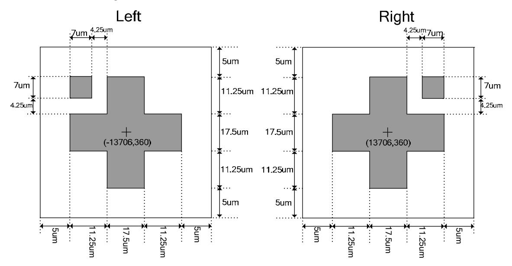

Left2 (-13706, 273),Right2 (13706, 273)

--Alignment Mark size

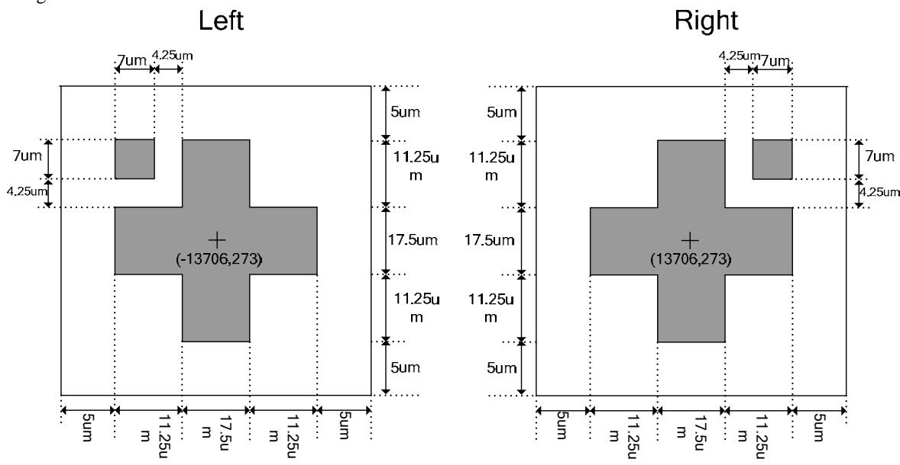

# **9. DISCLAIMER**

The information appearing in this publication is believed to be accurate.

Integrated circuits sold by NV Technology are covered by the warranty and patent indemnification provisions stipulated in the terms of sale only. NV Technology makes no warranty, express, statutory implied or by description regarding the information in this publication or regarding the freedom of the described chip(s) from patent infringement. FURTHERMORE, NV Technology MAKES NO WARRANTY OF MERCHANTABILITY OR FITNESS FOR ANY PURPOSE. NV Technology reserves the right to halt production or alter the specifications and prices at any time without notice. Accordingly, the reader is cautioned to verify that the data sheets and other information in this publication are current before placing orders. Products described herein are intended for use in normal commercial applications. Applications involving unusual environmental or reliability requirements, e.g. military equipment or medical life support equipment, are specifically not recommended without additional processing by NV Technology for such applications. Please note that application circuits illustrated in this document are for reference purposes only.

#### **Revision history**

| Version No. | Date      | Page | Introduction                                                                                                            |
|-------------|-----------|------|-------------------------------------------------------------------------------------------------------------------------|
| 0.1         | 2020-4-17 | All  | New build.                                                                                                              |
| 0.2         | 2021-9-29 | All  | Change"Operating Temperature -30℃ ~ +70℃"to"-30℃~ +85℃"; Change"Storage Temperature -40℃ ~ +85℃"to "-40℃~ +125℃"; |

Information furnished is believed to be accurate and reliable. However, New Vision Microelectronics Inc. assumes no responsibility for the consequences of use of such information nor for any infringement of patents or other rights of third parties, which may result from its use. No license is granted by implication or otherwise under any patent or patent rights of New Vision Microelectronics Inc. Specifications mentioned in this publication are subject to change without notice. This publication supersedes and replaces all information if previously supplied.

