# Adafruit Qualia ESP32-S3 for RGB-666 Displays

Created by Melissa LeBlanc-Williams

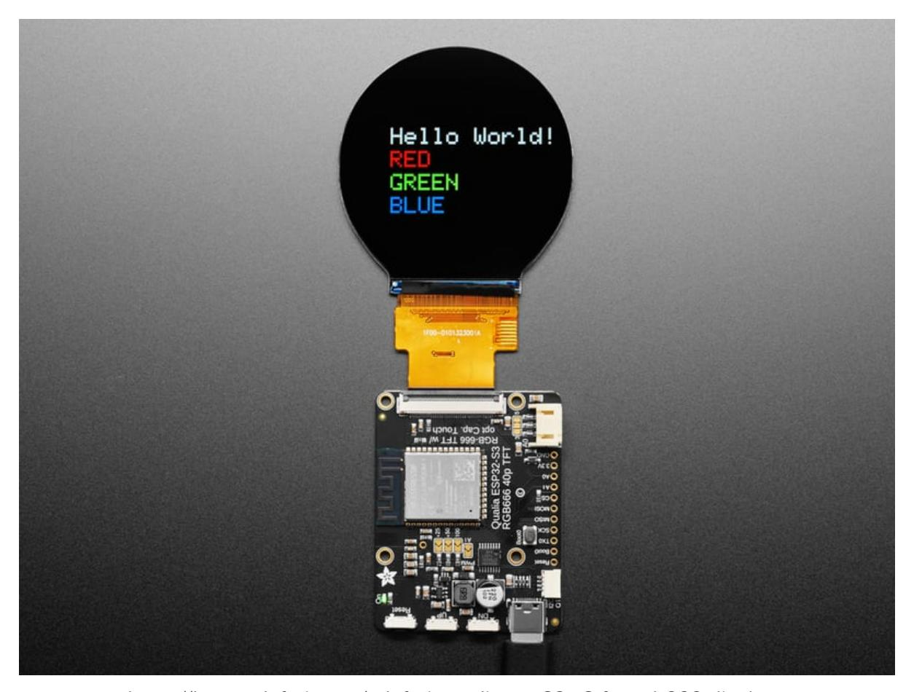

https://learn.adafruit.com/adafruit-qualia-esp32-s3-for-rgb666-displays

Last updated on 2026-02-27 04:34:21 PM UTC

©Adafruit Industries Page 1 of 252

## Table of Contents

| Overview                                                                                                                                                                                                                                                                                  | 9  |
|-------------------------------------------------------------------------------------------------------------------------------------------------------------------------------------------------------------------------------------------------------------------------------------------|----|
| Pinouts                                                                                                                                                                                                                                                                                   | 13 |
| • Microcontroller and WiFi<br>• 40-Pin Display Connector<br>• IO Expander<br>• Stemma QT Connector<br>• Reset and Boot0 Pins<br>• Debug Pin<br>• SPI Pins<br>• Analog Connector/Pins<br>• Buttons<br>• Backlight Jumpers<br>• IO Expander Address Jumpers<br>• Parallel Interface Jumpers |    |
| CircuitPython                                                                                                                                                                                                                                                                             | 18 |
| • CircuitPython Quickstart                                                                                                                                                                                                                                                                |    |
| The CIRCUITPY Drive                                                                                                                                                                                                                                                                       | 22 |
| • Boards Without CIRCUITPY                                                                                                                                                                                                                                                                |    |
| CircuitPython Pins and Modules                                                                                                                                                                                                                                                            | 23 |
| • CircuitPython Pins<br>• import board<br>• I2C, SPI, and UART<br>• What Are All the Available Names?<br>• Microcontroller Pin Names<br>• CircuitPython Built-In Modules                                                                                                                  |    |
| Installing the Mu Editor                                                                                                                                                                                                                                                                  | 30 |
| • Download and Install Mu<br>• Starting Up Mu<br>• Using Mu                                                                                                                                                                                                                               |    |
| Creating and Editing Code                                                                                                                                                                                                                                                                 | 32 |
| • Creating Code<br>• Editing Code<br>• Back to Editing Code<br>• Naming Your Program File                                                                                                                                                                                                 |    |
| Exploring Your First CircuitPython Program                                                                                                                                                                                                                                                | 38 |
| • Imports & Libraries<br>• Setting Up The LED<br>• Loop-de-loops<br>• What Happens When My Code Finishes Running?<br>• What if I Don't Have the Loop?                                                                                                                                     |    |
| Connecting to the Serial Console<br>• Are you using Mu?<br>• Serial Console Issues or Delays on Linux<br>• Setting Permissions on Linux                                                                                                                                                   | 41 |

©Adafruit Industries Page 2 of 252

|  |  | • Using Something Else? |  |  |
|--|--|-------------------------|--|--|
|--|--|-------------------------|--|--|

| Interacting with the Serial Console                                                                                                                                                                                                                                                                                                                                                                                                                                                                                                                                                                                | 44 |
|--------------------------------------------------------------------------------------------------------------------------------------------------------------------------------------------------------------------------------------------------------------------------------------------------------------------------------------------------------------------------------------------------------------------------------------------------------------------------------------------------------------------------------------------------------------------------------------------------------------------|----|
| The REPL<br>• Entering the REPL<br>• Interacting with the REPL                                                                                                                                                                                                                                                                                                                                                                                                                                                                                                                                                     | 47 |
| • Returning to the Serial Console<br>CircuitPython Libraries<br>• The Adafruit Learn Guide Project Bundle<br>• The Adafruit CircuitPython Library Bundle<br>• Downloading the Adafruit CircuitPython Library Bundle<br>• The CircuitPython Community Library Bundle<br>• Downloading the CircuitPython Community Library Bundle<br>• Understanding the Bundle<br>• Example Files<br>• Copying Libraries to Your Board<br>• Understanding Which Libraries to Install<br>• Example: ImportError Due to Missing Library<br>• Library Install on Non-Express Boards<br>• Updating CircuitPython Libraries and Examples | 52 |
| • CircUp CLI Tool<br>CircuitPython Documentation                                                                                                                                                                                                                                                                                                                                                                                                                                                                                                                                                                   | 64 |
| • CircuitPython Core Documentation<br>• CircuitPython Library Documentation                                                                                                                                                                                                                                                                                                                                                                                                                                                                                                                                        |    |
| Recommended Editors<br>• Recommended editors<br>• Recommended only with particular settings or add-ons<br>• Editors that are NOT recommended                                                                                                                                                                                                                                                                                                                                                                                                                                                                       | 71 |
| Advanced Serial Console on Windows<br>• What's the COM?<br>• Windows Serial Port Terminal Programs<br>• Install Putty<br>• Windows 7 and 8.1                                                                                                                                                                                                                                                                                                                                                                                                                                                                       | 73 |
| Advanced Serial Console on Mac<br>• What's the Port?<br>• macOS Serial Port Terminal Programs<br>• Connect with screen                                                                                                                                                                                                                                                                                                                                                                                                                                                                                             | 76 |
| Advanced Serial Console on Linux<br>• What's the Port?<br>• Linux Serial Port Terminal Programs<br>• Connect with tio<br>• Permissions on Linux                                                                                                                                                                                                                                                                                                                                                                                                                                                                    | 79 |
| Frequently Asked Questions<br>• Using Older Versions<br>• Python Arithmetic<br>• Wireless Connectivity<br>• Asyncio and Interrupts<br>• Status RGB LED                                                                                                                                                                                                                                                                                                                                                                                                                                                             | 83 |

©Adafruit Industries Page 3 of 252

| • Memory Issues<br>• Unsupported Hardware                                                          |     |
|----------------------------------------------------------------------------------------------------|-----|
| Troubleshooting                                                                                    | 90  |
| • Always Run the Latest Version of CircuitPython and Libraries                                     |     |
| • I have to continue using CircuitPython 7.x or earlier. Where can I find compatible libraries?    |     |
| • macOS Sonoma before 14.4: Errors Writing to CIRCUITPYmacOS 14.4 - 15.1: Slow Writes to CIRCUITPY |     |
| • Bootloader (boardnameBOOT) Drive Not Present                                                     |     |
| • Windows Explorer Locks Up When Accessing boardnameBOOT Drive                                     |     |
| • Copying UF2 to boardnameBOOT Drive Hangs at 0% Copied                                            |     |
| • CIRCUITPY Drive Does Not Appear or Disappears Quickly                                            |     |
| • "M105" Seen on Display, Crashes, Missing CIRCUITPY                                               |     |
| • Device Errors or Problems on Windows                                                             |     |
| • Serial Console in Mu Not Displaying Anything                                                     |     |
| • code.py Restarts Constantly                                                                      |     |
| • CircuitPython RGB Status Light                                                                   |     |
| • CircuitPython 7.0.0 and Later                                                                    |     |
| • CircuitPython 6.3.0 and earlier                                                                  |     |
| • Serial console showing ValueError: Incompatible .mpy file                                        |     |
| • CIRCUITPY Drive Issues                                                                           |     |
| • Safe Mode                                                                                        |     |
| • To erase CIRCUITPY: storage.erase_filesystem()                                                   |     |
| • Erase CIRCUITPY Without Access to the REPL                                                       |     |
| • For the specific boards listed below:                                                            |     |
| • For SAMD21 non-Express boards that have a UF2 bootloader:                                        |     |
| • For SAMD21 non-Express boards that do not have a UF2 bootloader:                                 |     |
| • Running Out of File Space on SAMD21 Non-Express Boards                                           |     |
| • Delete something!                                                                                |     |
| • Use tabs                                                                                         |     |
| • On macOS?                                                                                        |     |
| • Prevent & Remove macOS Hidden Files                                                              |     |
| • Copy Files on macOS Without Creating Hidden Files                                                |     |
| • Other macOS Space-Saving Tips                                                                    |     |
| • Device Locked Up or Boot Looping                                                                 |     |
| Welcome to the Community!                                                                          | 111 |
| • Adafruit Discord                                                                                 |     |
| • CircuitPython.org                                                                                |     |
| • Adafruit GitHub                                                                                  |     |
| • Adafruit Forums                                                                                  |     |
| • Read the Docs                                                                                    |     |
| Create Your settings.toml File                                                                     | 120 |
| • CircuitPython settings.toml File                                                                 |     |
| • settings.toml File Tips                                                                          |     |
| • Accessing Your settings.toml Information in code.py                                              |     |
| CircuitPython Internet Test                                                                        | 123 |
| • The settings.toml File                                                                           |     |
| • IPv6 Networking                                                                                  |     |
|                                                                                                    |     |

©Adafruit Industries Page 4 of 252

[Converting Arduino\\_GFX init strings to CircuitPython](#page-130-0)

• Using Arduino\_GFX Init Codes

• Using Init Code Files

• Script Output

[131](#page-130-0)

| Determining Timings                                                         | 136 |
|-----------------------------------------------------------------------------|-----|
| • Using a Data Sheet                                                        |     |
| • Fill in the Settings                                                      |     |
| • Experimenting with Settings<br>• Testing your Settings with CircuitPython |     |
|                                                                             |     |
| Backlight Settings                                                          | 140 |
| • Display Settings                                                          |     |
| CircuitPython Display Setup                                                 | 143 |
| • CircuitPython Board Definition                                            |     |
| • Example TFT_PINS                                                          |     |
| • Example TFT_TIMINGS<br>• I/O Expander                                     |     |
| • Display Initialization Code                                               |     |
| • Sending Initialization Code via I2C IO Expander                           |     |
| • I2C Bus Speed                                                             |     |
| • Constructing the framebuffer and the display<br>• Dot clocks              |     |
|                                                                             |     |
| CircuitPython Touch Display Usage                                           | 154 |
| • Determining the I2C Address<br>• Initializing the FocalTouch Controller   |     |
| • Initializing the CST826 Controller                                        |     |
| • Reading from the Touch Controller                                         |     |
| • Example                                                                   |     |
| Qualia S3 RGB-666 with TL021WVC02 2.1" 480x480 Round Display                | 159 |
| • Initialization Codes                                                      |     |
| • Timings                                                                   |     |
| • Example                                                                   |     |
| Qualia S3 RGB-666 with TL028WVC01 2.8" Round Display                        | 163 |
| • Initialization Codes                                                      |     |
| • Timings                                                                   |     |
| • Example                                                                   |     |
| Qualia S3 RGB-666 with HD40015C40 4" 720x720 Round Display                  | 167 |
| • Initialization Codes                                                      |     |
| • Timings<br>• Example                                                      |     |
|                                                                             |     |
| Qualia S3 RGB-666 with TL034WVS05 3.4" 480x480 Square Display               | 175 |
| • Initialization Codes                                                      |     |
| • Timings                                                                   |     |
| • Example                                                                   |     |
| Qualia S3 RGB-666 with TL040WVS03 4" 480x480 Square Display                 | 179 |
| • Initialization Codes                                                      |     |
| • Timings                                                                   |     |
| • Example                                                                   |     |
| Qualia S3 RGB-666 with TL040HDS20 4.0" 720x720 Square Display               | 183 |
| • Initialization Codes                                                      |     |
| • Timings                                                                   |     |
| • Example                                                                   |     |

©Adafruit Industries Page 5 of 252

| Qualia S3 RGB-666 with TL032FWV01 3.2" 320x820 Bar Display                                                                                     | 186 |
|------------------------------------------------------------------------------------------------------------------------------------------------|-----|
| • Initialization Codes<br>• Timings<br>• Example                                                                                               |     |
| Qualia S3 RGB-666 with HD371001C 3.7" 240x960 Bar Display                                                                                      | 190 |
| • Initialization Codes<br>• Timings<br>• Example                                                                                               |     |
| Qualia S3 RGB-666 with HD458002C40 4.58" 320x960 Bar Display                                                                                   | 194 |
| • Initialization Codes<br>• Timings<br>• Example                                                                                               |     |
| Arduino IDE Setup                                                                                                                              | 198 |
| Using with Arduino IDE                                                                                                                         | 202 |
| • Blink<br>• Select ESP32-S2/S3 Board in Arduino IDE<br>• Launch ESP32-S2/S3 ROM Bootloader<br>• Load Blink Sketch                             |     |
| Library Installation                                                                                                                           | 206 |
| WiFi Test                                                                                                                                      | 207 |
| • WiFi Connection Test                                                                                                                         |     |
| • Secure Connection Example                                                                                                                    |     |
| Usage with Adafruit IO                                                                                                                         | 214 |
| • Install Libraries<br>• Adafruit IO Setup<br>• Code Usage                                                                                     |     |
| Arduino Rainbow Demo                                                                                                                           | 222 |
| Arduino Product Demo                                                                                                                           | 227 |
| Arduino Touch Display Usage                                                                                                                    | 230 |
| • Determining the I2C Address                                                                                                                  |     |
| • FocalTouch Controllers                                                                                                                       |     |
| • CST826 Touch Controller<br>• Example                                                                                                         |     |
| Install UF2 Bootloader                                                                                                                         | 233 |
| Factory Reset                                                                                                                                  | 233 |
| • Install the Factory Reset Firmware UF2                                                                                                       |     |
| • UF2 Bootloader Installation and Repair                                                                                                       |     |
| • OPEN INSTALLER Method for UF2 Bootloader Installation<br>• Adafruit WebSerial ESPTool and esptool.py Methods for UF2 Bootloader Installation |     |
| • Step 1. Download the UF2 Bootloader .bin File for your board                                                                                 |     |
| • Step 2. Enter ROM bootloader mode                                                                                                            |     |

©Adafruit Industries Page 6 of 252

• Step 3: Alternative A. The Adafruit WebSerial ESPTool Method

• Connect

• Erase the Contents of Flash

- Flash the Bootloader .bin File
- Step 3: Alternative B. The esptool.py Method (for advanced users)
- Install esptool.py
- Test the Installation
- Find the Serial Port
- Connect
- Erase the Flash
- Flash the UF2 Bootloader
- Step 4. Reset the board
- Older Versions of Chrome
- Step 3: Alternative C. The Flash an Arduino Sketch Method
- Arduino IDE Setup
- Load the Blink Sketch

[251](#page-250-0) [Downloads](#page-250-0)

- Schematic
- Fab Print

©Adafruit Industries Page 7 of 252

©Adafruit Industries Page 8 of 252

# <span id="page-8-0"></span>Overview

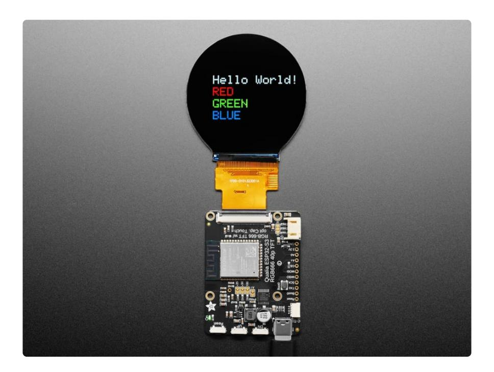

There are things everyone loves: ice cream, kittens, and honkin' large TFT LCD screens. We're no strangers to small TFT's - [from our itsy 1.14" color display](https://www.adafruit.com/search?q=1.14+tft) (https:// adafru.it/191f) that graces many-a-TFT-Feather to [our fancy 3.5" 320x480](https://www.adafruit.com/product/2050) (http:// adafru.it/2050) breakout screen. But most people who dabble or engineer with microcontrollers know that you sort of 'top out' at 320x480 - that's the largest resolution you can use with every day SPI or 8-bit 8080 interfaces. After that, you're in TTL-interface TFT land, where displays no longer have an internal memory buffer and instead the controller has to continuously write scanline data over a 16, 18 or 24 pin interface.

©Adafruit Industries Page 9 of 252

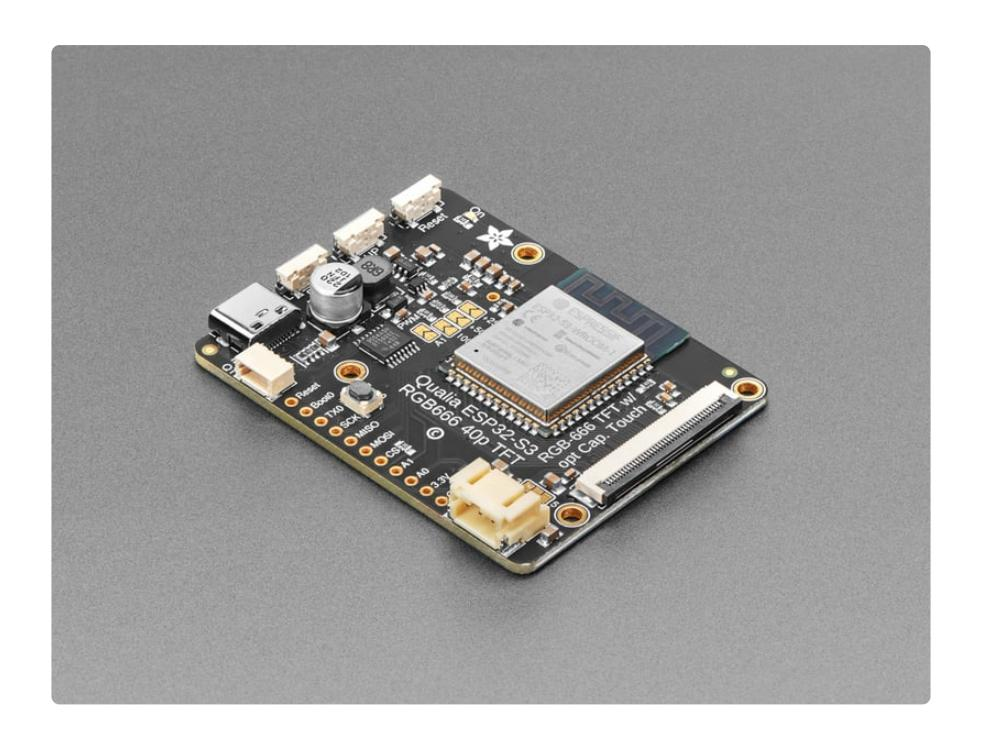

RGB TTL interface TFT displays can get big: they start out at around 4.3" diagonal 480x272, and can get to 800x480, 800x600 or even 720x720. For displays that big, you need a lot of video RAM (800x480 at 24 bit color is just over 1MB), plenty of spare GPIO to dedicate, and a peripheral that will DMA the video RAM out to the display continuously. This is a setup familiar to people working with hefty microcontrollers or microcomputers, the sort of device that run cell phones, or your car's GPS navigation screen. But until now, nearly impossible to use on low cost microcontrollers.

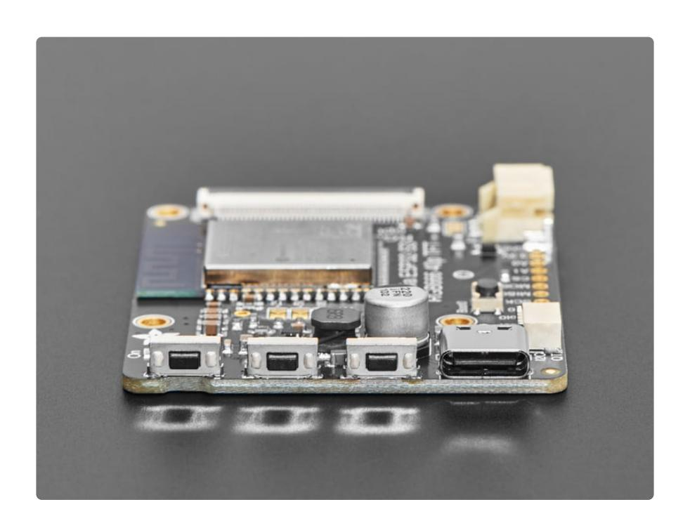

©Adafruit Industries Page 10 of 252

The ESP32-S3 is the first low-cost microcontroller that has a built in peripheral that can drive TTL displays, and it can come with enough PSRAM to buffer those large images. For example, on the Adafruit Qualia ESP32-S3 for TTL RGB-666 Displays, we use a S3 module with 16 MB of Flash and 8 MB of octal PSRAM. Using the built in RGB display peripheral you can display graphics, images, animations or even video (cinepak, natch!) with near-instantaneous updates since the whole screen gets updated about 30 frames per second (FPS).

This dev board is designed to make it easy for you to explore displays that use the 'secondary standard' 40-pin RGB-666 connector. This pin order is most commonly seen on square, round and bar displays. [You'll want to compare the display you're](https://cdn-shop.adafruit.com/product-files/5792/Specification_TL021WVC02CT-B1323B.pdf) [using to this datasheet](https://cdn-shop.adafruit.com/product-files/5792/Specification_TL021WVC02CT-B1323B.pdf) (http://adafru.it/5792021021323), and if it matches, you'll probably be good! One nice thing about this connector ordering is that it also includes pins for capacitive touch overlay, and we wire those up to the ESP32-S3's I2C port so you can also have touch control with your display.

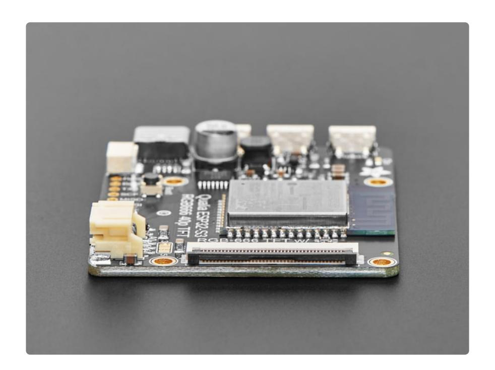

Don't forget! This is just the development board, a display is not included. Use any RGB-666 pinout display with or without a touch overlay. Note that you will need to program in the driver initialization code, dimensions, and pulse widths in your programming language. Here are some known-working displays that you can use in Arduino and CircuitPython:

- [2.1" 480x480 Round with Capacitive Touch](https://www.adafruit.com/product/5792) (http://adafru.it/5792) •
- [2.1" 480x480 Round without Touch](https://www.adafruit.com/product/5806) (http://adafru.it/5806) •

©Adafruit Industries Page 11 of 252

- [4" 720x720 Square with Capacitive Touch](https://www.adafruit.com/product/5794) (http://adafru.it/5794) •
- [4" 720x720 Round without Touch](https://www.adafruit.com/product/5793) (http://adafru.it/5793) •
- [4.6" 960x320 Rectangular Bar](https://www.adafruit.com/product/5805) (http://adafru.it/5805) •

On the Qualia board we have the S3 modules, with 16 pins connected to the TFT for 5-6-5 RGB color, plus HSync, VSync, Data Enable and Pixel Clock. There's a constant current backlight control circuit using the [TPS61169](https://www.ti.com/product/TPS61169/part-details/TPS61169DCKR) (https://adafru.it/191A) which can get up to 30V forward voltage and can be configured for 25mA-200mA in 25mA increments (default is 25mA). Power and programming is provided over a USB C connector, wired to the S3's native USB port. For debugging, the hardware UART TX pin is available as well.

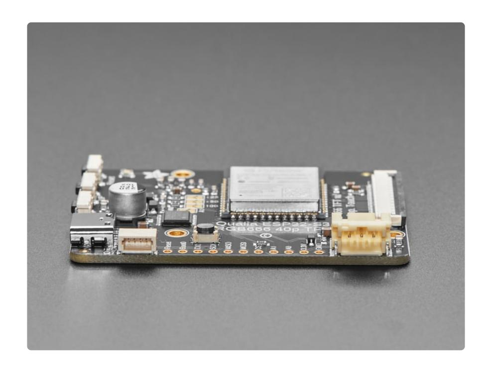

Since almost every GPIO is used, and almost all RGB-666 displays need to be initialized over SPI, we put a [PCA9554A](https://www.ti.com/product/PCA9554A) (https://adafru.it/1a8u) I/O expander on the shared I2C bus. Arduino or CircuitPython can be instructed on how to use the expander to reset and init the display you have if necessary. The remaining expander pins are connected to two right-angle buttons, and the display backlight.

The expander is what lets us have a full 4-pin SPI port and two more analog GPIO pins - [enough to wire up an MMC in 1-wire SDIO mode along with an I2S amplifier to make](https://www.youtube.com/watch?v=pEjw-bCQ-lQ) [an A/V playback demo](https://www.youtube.com/watch?v=pEjw-bCQ-lQ) (https://adafru.it/191C). Maybe we can even eat ice cream while watching kitten vids! There is also the shared I2C port, we provide a Stemma QT / Qwiic port for easy addition of any sensor or device you like.

©Adafruit Industries Page 12 of 252

# <span id="page-12-0"></span>Pinouts

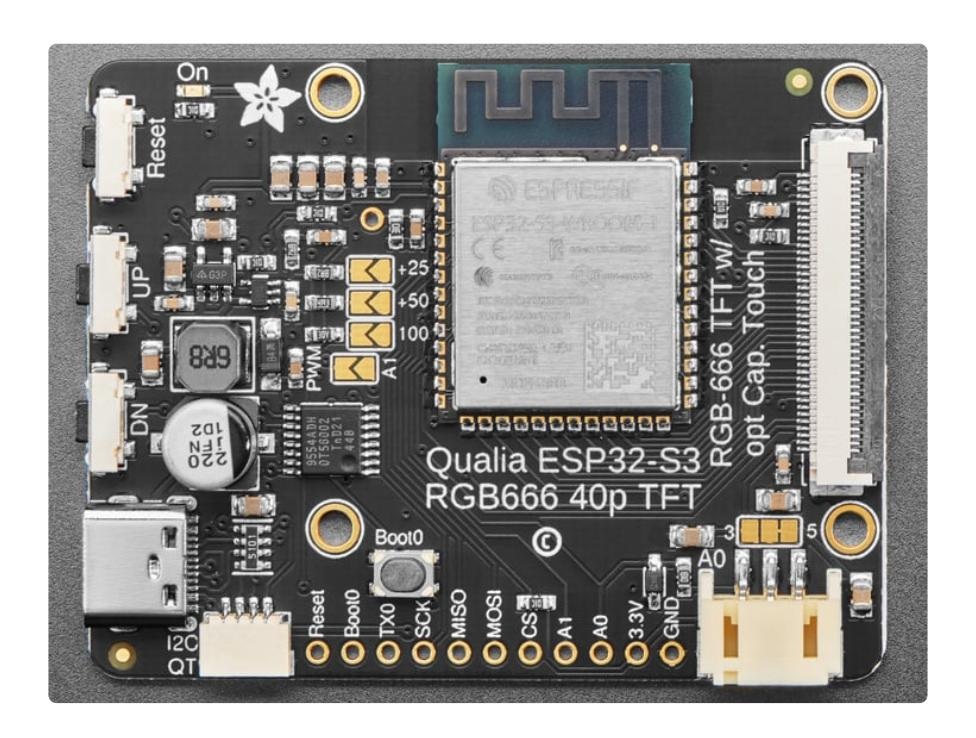

## Microcontroller and WiFi

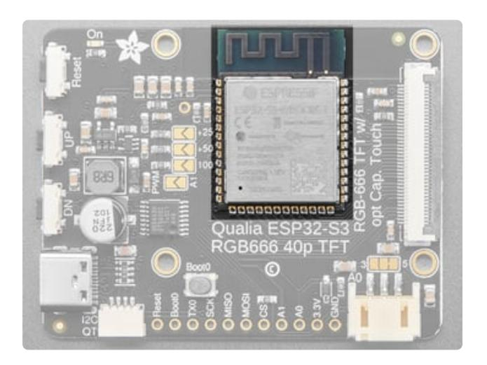

The main processor chip is the Espressif ESP32-S3 with 3.3v logic/ power. It has 16MB of Flash and 8MB of RAM.

The ESP32-S3 comes with WiFi and Bluetooth LE baked right in, though CircuitPython only supports WiFi at this time, not BLE on the S3 chip

## 40-Pin Display Connector


Not all 40-pin displays have the power pins in the same place. Hooking up a non RGB666 display with the Qualia S3 risks damaging the display.

©Adafruit Industries Page 13 of 252

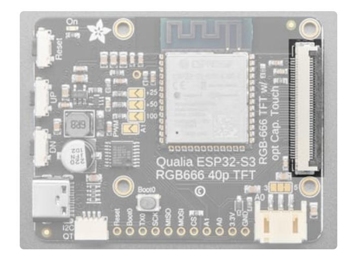

There is a 40-pin display connector to connect your display. Displays should be connected with the metal pins of the cable facing towards the board. Pin 1 should be furthest from the JST connector.

## IO Expander

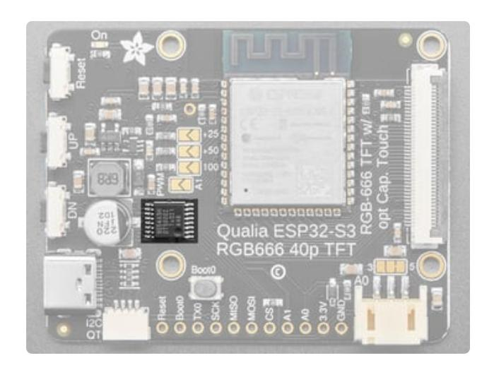

The Qualia S3 includes a PCA9554A IO Expander. The IO Expander is connected via the I2C bus. The main purpose of the expander is to add additional pins to communicate with the display.

The default address of the IO expander is 0x3F, but it can be changed by soldering jumpers on the reverse side in case it interferes with another I2C device.

## Stemma QT Connector

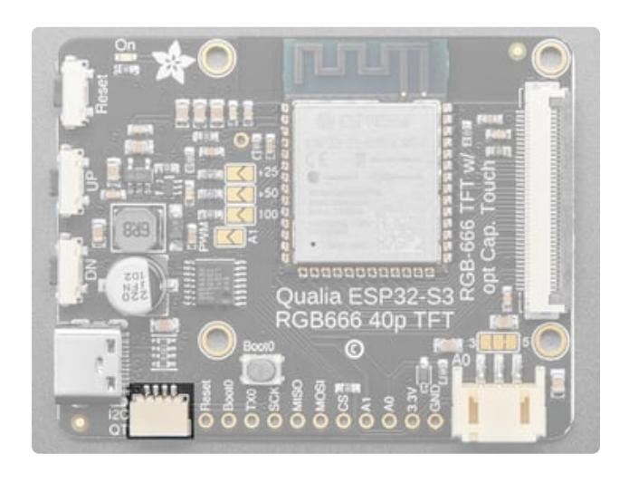

There is a 4-pin Stemma QT connector on the left. The I2C has pullups to 3.3V power.

In CircuitPython, you can use the STEMMA connector

with board.SCL and board.SDA , or board.STEMMA\_I2C() .

©Adafruit Industries Page 14 of 252

## Reset and Boot0 Pins

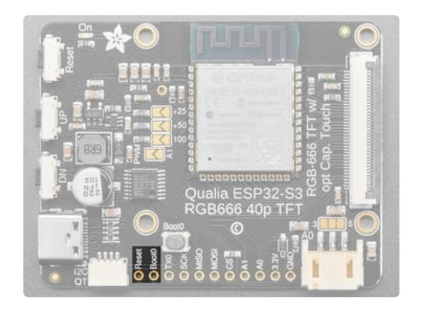

Reset is the Reset pin. Tie to ground to manually reset the ESP32-S3.

Tying Boot0 to ground while resetting will place the ESP32-S3 in ROM bootloader mode.

## Debug Pin

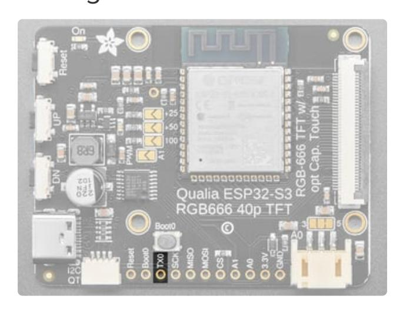

If you'd like to do lower level debugging, we have the ESP32-S3's TXD0 debug pin exposed as TX0 to view messages.

To read, you would connect a Serial UART cable Receive connection here and the cable ground connection to the GND pin.

©Adafruit Industries Page 15 of 252

## SPI Pins

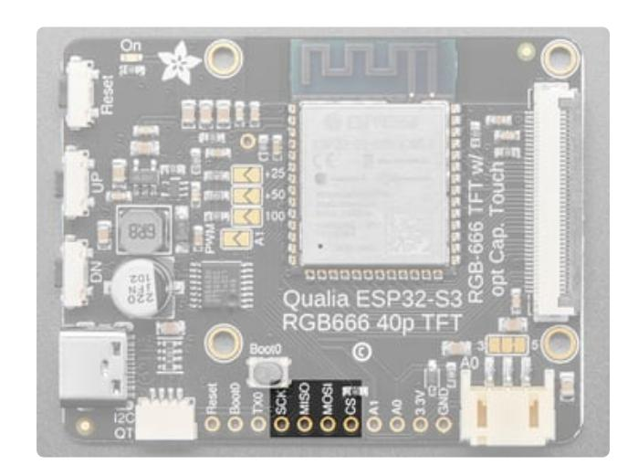

The SPI pins of the ESP32-S3 are exposed for communication with other SPI hardware.

Each of these pins can alternatively be used for digital I/O:

SCK is connected to board.SCK or Arduino 5 .

MISO is connected to board.MISO or Arduino 6 .

MOSI is connected to board.MOSI or Arduino 7 .

CS is connected to board.CS or Arduino 15 and includes a 10K Pull-up resistor.

## Analog Connector/Pins

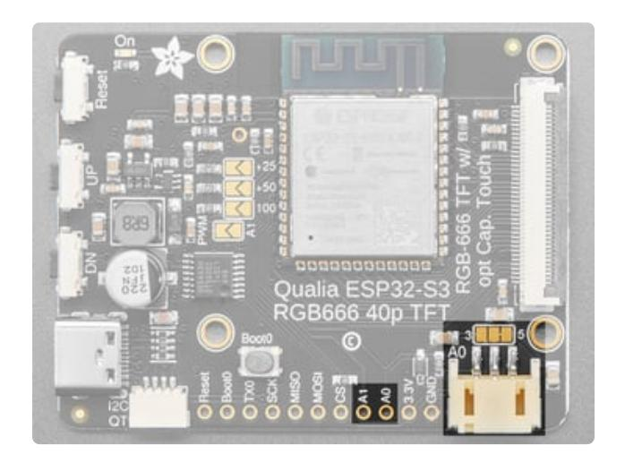

On the bottom side towards the right, there is a connector labeled A0. This is a 3-pin JST analog connector for sensors, NeoPixels, or analog input or digital I/O.

For the JST connected, there is a jumper above that can be cut and soldered to use 3V instead of 5V.

Along the bottom there are also pins labeled A0 and A1 .

Each of these pins can be used for analog inputs or digital I/O.

©Adafruit Industries Page 16 of 252

## Buttons

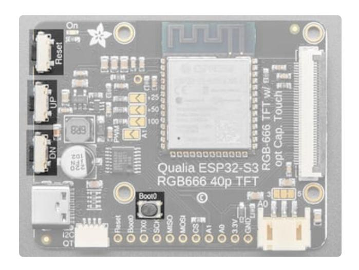

There are three buttons along the left side of the Qualia S3.

The Reset button is located in the top position. Click it once to re-start your firmware. Click it again after about a half second to enter bootloader mode.

The UP button is located in the middle and is connected to the IO expander

The DN button, or Down button, is located on the bottom and is connected to the IO expander.

The expander implements a light pullup for each of the buttons and pressing either of them pulls the input low.

The Boot0 button is located between the up button and the Microcontroller. Hold it while pressing reset to enter ROM Bootloader mode.

## Backlight Jumpers

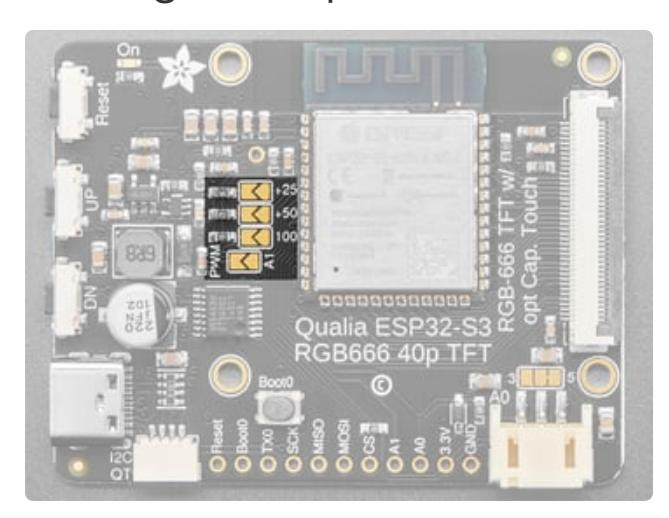

Soldering the bottom PWM jumper allows using Pin A1 to control the backlight of the display.

By default, 25mA is provided to the backlight, but additional amperage can be set by soldering the top jumpers to provide up to 200mA if needed.

©Adafruit Industries Page 17 of 252

## IO Expander Address Jumpers

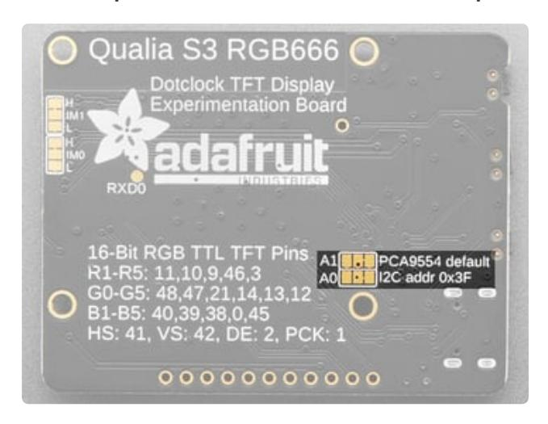

On the reverse, are a couple of solderable jumpers to change the I2C address of the IO Expander. By default, both jumpers are set to high, providing a default address of 0x3F. However, it can be set between 0x3B-0x3F.

## Parallel Interface Jumpers

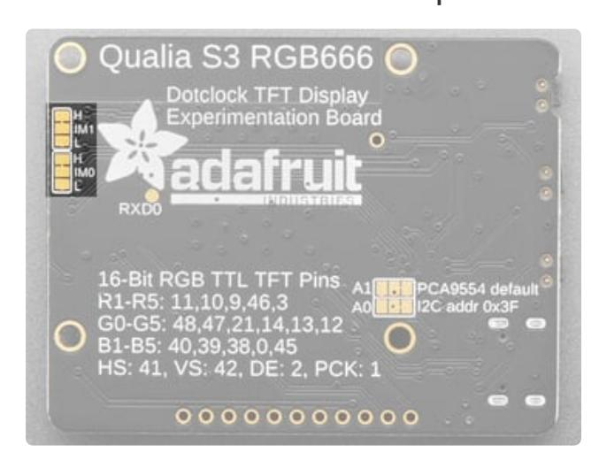

The IM0 and IM1 jumpers are for selecting the mode of the parallel interface for the display. The default selection should work for most displays.

# <span id="page-17-0"></span>CircuitPython

[CircuitPython](https://github.com/adafruit/circuitpython) (https://adafru.it/tB7) is a derivative of [MicroPython](https://micropython.org) (https://adafru.it/BeZ) designed to simplify experimentation and education on low-cost microcontrollers. It makes it easier than ever to get prototyping by requiring no upfront desktop software downloads. Simply copy and edit files on the CIRCUITPY drive to iterate.

## CircuitPython Quickstart

Follow this step-by-step to quickly get CircuitPython running on your board.

©Adafruit Industries Page 18 of 252

This microcontroller requires the latest unstable (development) release of CircuitPython. Click below to visit the downloads page on circuitpython.org for your board. Then, Browse S3 under Absolute Newest.

## https://adafru.it/191D

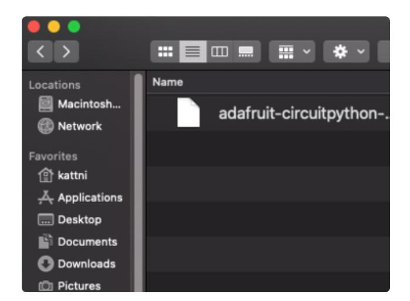

Click the link above to download the latest CircuitPython UF2 file.

Save it wherever is convenient for you.


The Qualia S3 does not have a RGB status LED

©Adafruit Industries Page 19 of 252

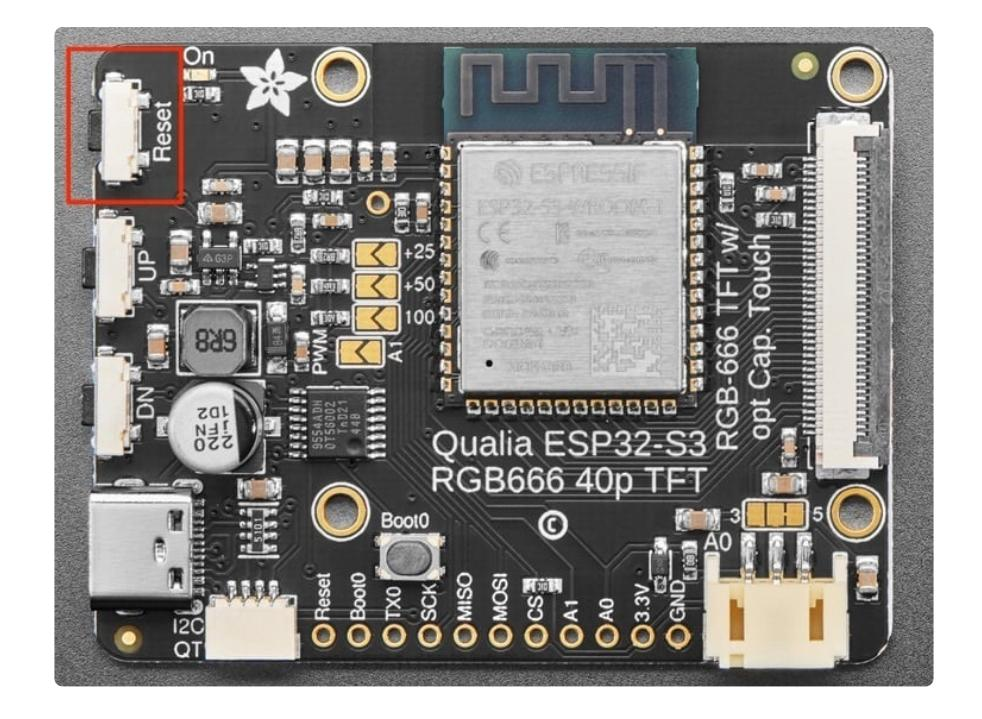

Plug your board into your computer, using a known-good data-sync cable, directly, or via an adapter if needed.

Double-click the reset button (highlighted in red above), and you will see the RGB status LED(s) turn green (highlighted in green above). If you see red, try another port, or if you're using an adapter or hub, try without the hub, or different adapter or hub.


This board does not have a Neopixel, so you will need to just double tap the reset button.

For this board, tap reset and wait about a half a second and then tap reset again.


Some boards may not have a UF2 bootloader installed. If double-clicking does not work, follow the instructions on the "Install UF2 Bootloader" page in this

©Adafruit Industries Page 20 of 252

If double-clicking doesn't work the first time, try again. Sometimes it can take a few tries to get the rhythm right!

A lot of people end up using charge-only USB cables and it is very frustrating! Make sure you have a USB cable you know is good for data sync.

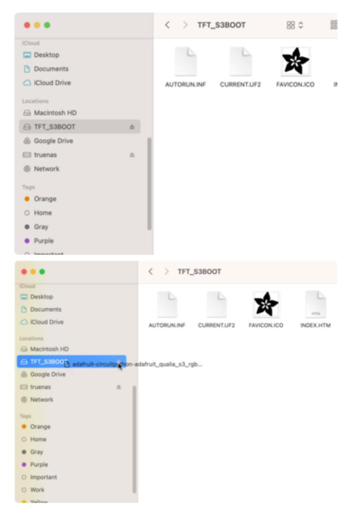

You will see a new disk drive appear called TFT\_S3BOOT.

Drag the adafruit\_circuitpython\_etc.uf2 file to TFT\_S3BOOT.

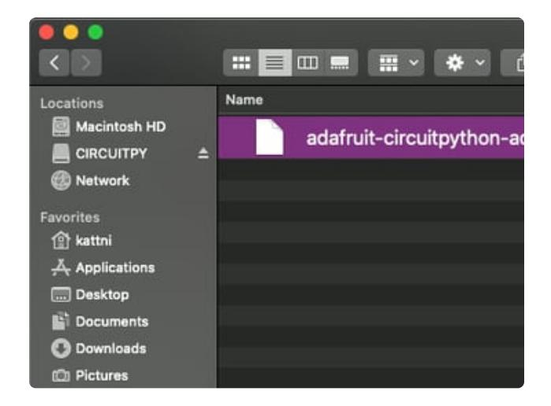

The BOOT drive will disappear and a new disk drive called CIRCUITPY will appear.

That's it!

©Adafruit Industries Page 21 of 252

# <span id="page-21-0"></span>The CIRCUITPY Drive

When CircuitPython finishes installing, or you plug a CircuitPython board into your computer with CircuitPython already installed, the board shows up on your computer as a USB drive called CIRCUITPY.

The CIRCUITPY drive is where your code and the necessary libraries and files will live. You can edit your code directly on this drive and when you save, it will run automatically. When you create and edit code, you'll save your code in a code.py file located on the CIRCUITPY drive. If you're following along with a Learn guide, you can paste the contents of the tutorial example into code.py on the CIRCUITPY drive and save it to run the example.

With a fresh CircuitPython install, on your CIRCUITPY drive, you'll find a code.py file containing print("Hello World!") and an empty lib folder. If your CIRCUITPY drive does not contain a code.py file, you can easily create one and save it to the drive. CircuitPython looks for code.py and executes the code within the file automatically when the board starts up or resets. Following a change to the contents of CIRCUITPY, such as making a change to the code.py file, the board will reset, and the code will be run. You do not need to manually run the code. This is what makes it so easy to get started with your project and update your code!

Note that all changes to the contents of CIRCUITPY, such as saving a new file, renaming a current file, or deleting an existing file will trigger a reset of the board.

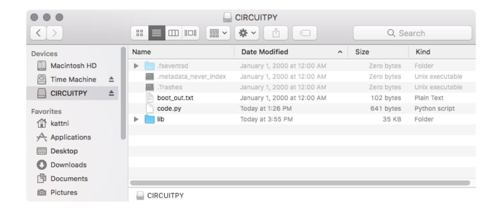

## Boards Without CIRCUITPY

CircuitPython is available for some microcontrollers that do not support native USB. Those boards cannot present a CIRCUITPY drive. This includes boards using ESP32 or ESP32-C3 microcontrollers.

©Adafruit Industries Page 22 of 252

On these boards, there are alternative ways to transfer and edit files. You can use the [Thonny editor](https://thonny.org) (https://adafru.it/18e7), which uses hidden commands sent to the REPL to read and write files. Or you can use the CircuitPython web workflow, introduced in Circuitpython 8. The web workflow provides browser-based WiFi access to the CircuitPython filesystem. These guides will help you with the web workflow:

- [CircuitPython on ESP32 Quick Start](https://learn.adafruit.com/circuitpython-with-esp32-quick-start) (https://adafru.it/10JF) •
- [CircuitPython Web Workflow Code Editor Quick Start](https://learn.adafruit.com/getting-started-with-web-workflow-using-the-code-editor) (https://adafru.it/18e8) •

# <span id="page-22-0"></span>CircuitPython Pins and Modules

CircuitPython is designed to run on microcontrollers and allows you to interface with all kinds of sensors, inputs and other hardware peripherals. There are tons of guides showing how to wire up a circuit, and use CircuitPython to, for example, read data from a sensor, or detect a button press. Most CircuitPython code includes hardware setup which requires various modules, such as board or digitalio . You import these modules and then use them in your code. How does CircuitPython know to look for hardware in the specific place you connected it, and where do these modules come from?

This page explains both. You'll learn how CircuitPython finds the pins on your microcontroller board, including how to find the available pins for your board and what each pin is named. You'll also learn about the modules built into CircuitPython, including how to find all the modules available for your board.

# CircuitPython Pins

When using hardware peripherals with a CircuitPython compatible microcontroller, you'll almost certainly be utilising pins. This section will cover how to access your board's pins using CircuitPython, how to discover what pins and board-specific objects are available in CircuitPython for your board, how to use the board-specific objects, and how to determine all available pin names for a given pin on your board.

## import board

When you're using any kind of hardware peripherals wired up to your microcontroller board, the import list in your code will include import board . The board module is built into CircuitPython, and is used to provide access to a series of board-specific objects, including pins. Take a look at your microcontroller board. You'll notice that

©Adafruit Industries Page 23 of 252

next to the pins are pin labels. You can always access a pin by its pin label. However, there are almost always multiple names for a given pin.

To see all the available board-specific objects and pins for your board, enter the REPL ( >>> ) and run the following commands:

```
import board
dir(board)
```

Here is the output for the QT Py SAMD21. You may have a different board, and this list will vary, based on the board.

The following pins have labels on the physical QT Py SAMD21 board: A0, A1, A2, A3, SDA, SCL, TX, RX, SCK, MISO, and MOSI. You see that there are many more entries available in board than the labels on the QT Py.

You can use the pin names on the physical board, regardless of whether they seem to be specific to a certain protocol.

For example, you do not have to use the SDA pin for I2C - you can use it for a button or LED.

On the flip side, there may be multiple names for one pin. For example, on the QT Py SAMD21, pin A0 is labeled on the physical board silkscreen, but it is available in CircuitPython as both A0 and D0 . For more information on finding all the names for a given pin, see the [What Are All the Available Pin Names?](https://learn.adafruit.com/circuitpython-essentials/circuitpython-pins-and-modules#what-are-all-the-available-names-3082670-14) (https://adafru.it/QkA) section below.

The results of dir(board) for CircuitPython compatible boards will look similar to the results for the QT Py SAMD21 in terms of the pin names, e.g. A0, D0, etc. However, some boards, for example, the Metro ESP32-S2, have different styled pin names. Here is the output for the Metro ESP32-S2.

©Adafruit Industries Page 24 of 252

Note that most of the pins are named in an IO# style, such as IO1 and IO2. Those pins on the physical board are labeled only with a number, so an easy way to know how to access them in CircuitPython, is to run those commands in the REPL and find the pin naming scheme.


If your code is failing to run because it can't find a pin name you provided, verify that you have the proper pin name by running these commands in the

## I2C, SPI, and UART

You'll also see there are often (but not always!) three special board-specific objects included: I2C , SPI , and UART - each one is for the default pin-set used for each of the three common protocol busses they are named for. These are called singletons.

What's a singleton? When you create an object in CircuitPython, you are instantiating ('creating') it. Instantiating an object means you are creating an instance of the object with the unique values that are provided, or "passed", to it.

For example, When you instantiate an I2C object using the busio module, it expects two pins: clock and data, typically SCL and SDA. It often looks like this:

```
i2c = busio.I2C(board.SCL, board.SDA)
```

Then, you pass the I2C object to a driver for the hardware you're using. For example, if you were using the TSL2591 light sensor and its CircuitPython library, the next line of code would be:

```
tsl2591 = adafruit_tsl2591.TSL2591(i2c)
```

©Adafruit Industries Page 25 of 252

However, CircuitPython makes this simpler by including the I2C singleton in the board module. Instead of the two lines of code above, you simply provide the singleton as the I2C object. So if you were using the TSL2591 and its CircuitPython library, the two above lines of code would be replaced with:

tsl2591 = adafruit\_tsl2591.TSL2591(board.I2C())


The board.I2C(), board.SPI(), and board.UART() singletons do not exist on all boards. They exist if there are board markings for the default pins for those

This eliminates the need for the busio module, and simplifies the code. Behind the scenes, the board.I2C() object is instantiated when you call it, but not before, and on subsequent calls, it returns the same object. Basically, it does not create an object until you need it, and provides the same object every time you need it. You can call board.I2C() as many times as you like, and it will always return the same object.


The UART/SPI/I2C singletons will use the 'default' bus pins for each board often labeled as RX/TX (UART), MOSI/MISO/SCK (SPI), or SDA/SCL (I2C). Check your board documentation/pinout for the default busses.

## What Are All the Available Names?

Many pins on CircuitPython compatible microcontroller boards have multiple names, however, typically, there's only one name labeled on the physical board. So how do you find out what the other available pin names are? Simple, with the following script! Each line printed out to the serial console contains the set of names for a particular pin.

On a microcontroller board running CircuitPython, first, connect to the serial console.

In the example below, click the Download Project Bundle button below to download the necessary libraries and the code.py file in a zip file. Extract the contents of the zip file, open the directory CircuitPython\_Essentials/Pin\_Map\_Script/ and then click on

©Adafruit Industries Page 26 of 252

the directory that matches the version of CircuitPython you're using and copy the contents of that directory to your CIRCUITPY drive.

Your CIRCUITPY drive should now look similar to the following image:

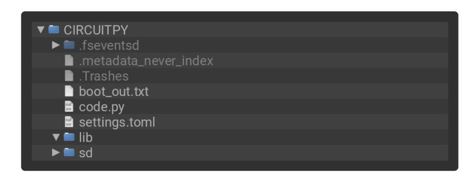

```
# SPDX-FileCopyrightText: 2020 anecdata for Adafruit Industries
# SPDX-FileCopyrightText: 2021 Neradoc for Adafruit Industries
# SPDX-FileCopyrightText: 2021-2023 Kattni Rembor for Adafruit Industries
# SPDX-FileCopyrightText: 2023 Dan Halbert for Adafruit Industries
#
# SPDX-License-Identifier: MIT
"""CircuitPython Essentials Pin Map Script"""
import microcontroller
import board
try:
    import cyw43 # raspberrypi
except ImportError:
    cyw43 = None
board_pins = []
for pin in dir(microcontroller.pin):
    if (isinstance(getattr(microcontroller.pin, pin), microcontroller.Pin) or
        (cyw43 and isinstance(getattr(microcontroller.pin, pin), cyw43.CywPin))):
        pins = []
        for alias in dir(board):
            if getattr(board, alias) is getattr(microcontroller.pin, pin):
                pins.append(f"board.{alias}")
        # Add the original GPIO name, in parentheses.
        if pins:
            # Only include pins that are in board.
            pins.append(f"({str(pin)})")
            board_pins.append(" ".join(pins))
for pins in sorted(board_pins):
    print(pins)
```

Here is the result when this script is run on QT Py SAMD21:

©Adafruit Industries Page 27 of 252

Each line represents a single pin. Find the line containing the pin name that's labeled on the physical board, and you'll find the other names available for that pin. For example, the first pin on the board is labeled A0. The first line in the output is board.A0 board.D0 (PA02) . This means that you can access pin A0 in CircuitPython using both board.A0 and board.D0 .

The pins in parentheses are the microcontroller pin names. See the next section for more info on those.

You'll notice there are two "pins" that aren't labeled on the board but appear in the list: board.NEOPIXEL and board.NEOPIXEL\_POWER . Many boards have several of these special pins that give you access to built-in board hardware, such as an LED or an on-board sensor. The QT Py SAMD21 only has one on-board extra piece of hardware, a NeoPixel LED, so there's only the one available in the list. But you can also control whether or not power is applied to the NeoPixel, so there's a separate pin for that.

That's all there is to figuring out the available names for a pin on a compatible microcontroller board in CircuitPython!

## Microcontroller Pin Names

The pin names available to you in the CircuitPython board module are not the same as the names of the pins on the microcontroller itself. The board pin names are aliases to the microcontroller pin names. If you look at the datasheet for your microcontroller, you'll likely find a pinout with a series of pin names, such as "PA18" or "GPIO5". If you want to get to the actual microcontroller pin name in CircuitPython, you'll need the microcontroller.pin module. As with board , you can run dir(microcontroller.pin) in the REPL to receive a list of the microcontroller pin names.

©Adafruit Industries Page 28 of 252

# CircuitPython Built-In Modules

There is a set of modules used in most CircuitPython programs. One or more of these modules is always used in projects involving hardware. Often hardware requires installing a separate library from the Adafruit CircuitPython Bundle. But, if you try to find board or digitalio in the same bundle, you'll come up lacking. So, where do these modules come from? They're built into CircuitPython! You can find an comprehensive list of built-in CircuitPython modules and the technical details of their functionality from CircuitPython [here](https://circuitpython.readthedocs.io/en/latest/shared-bindings/index.html#modules) (https://adafru.it/QkB) and the Python-like modules included [here](https://circuitpython.readthedocs.io/en/latest/docs/library/index.html) (https://adafru.it/QkC). However, not every module is available for every board due to size constraints or hardware limitations. How do you find out what modules are available for your board?

There are two options for this. You can check the [support matrix](https://circuitpython.readthedocs.io/en/latest/shared-bindings/support_matrix.html#) (https://adafru.it/ N2a), and search for your board by name. Or, you can use the REPL.

Plug in your board, connect to the serial console and enter the REPL. Type the following command.

```
help("modules")
```

That's it! You now know two ways to find all of the modules built into CircuitPython for your compatible microcontroller board.

©Adafruit Industries Page 29 of 252

# <span id="page-29-0"></span>Installing the Mu Editor

Mu is a simple code editor that works with the Adafruit CircuitPython boards. It's written in Python and works on Windows, MacOS, Linux and Raspberry Pi. The serial console is built right in so you get immediate feedback from your board's serial output!

Mu is our recommended editor - please use it (unless you are an experienced coder with a favorite editor already!). While it has been announced end of life in 2026, it still works fine.

You are free to use whatever text editor you wish along with a terminal program to connect to the CircuitPython REPL. Thonny is one such editor.

## Download and Install Mu

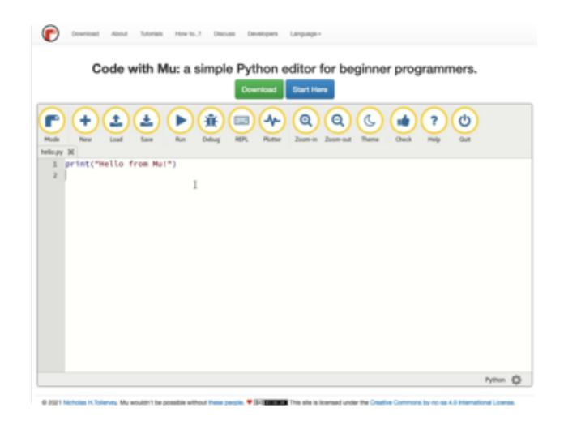

Download Mu from [https://](https://codewith.mu/) [codewith.mu](https://codewith.mu/) (https://adafru.it/Be6).

Click the Download link for downloads and installation instructions.

Click Start Here to find a wealth of other information, including extensive tutorials and and how-to's.


Windows users: due to the nature of MSI installers, please remove old versions of Mu before installing the latest version.

©Adafruit Industries Page 30 of 252

## Starting Up Mu

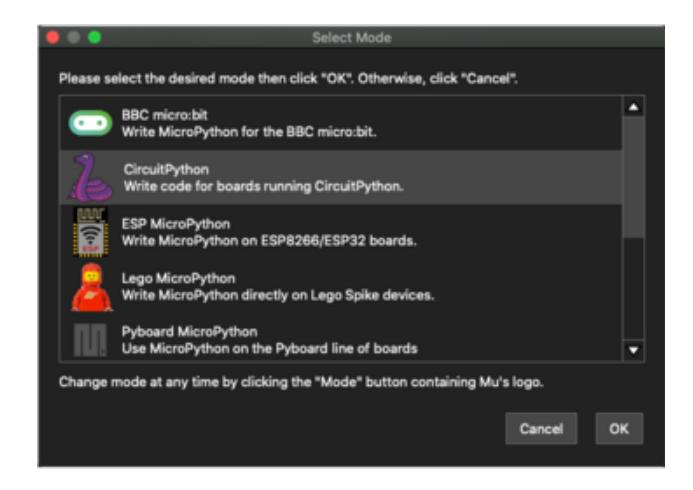

The first time you start Mu, you will be prompted to select your 'mode' - you can always change your mind later. For now please select CircuitPython!

The current mode is displayed in the lower right corner of the window, next to the "gear" icon. If the mode says "Microbit" or something else, click the Mode button in the upper left, and then choose "CircuitPython" in the dialog box that appears.

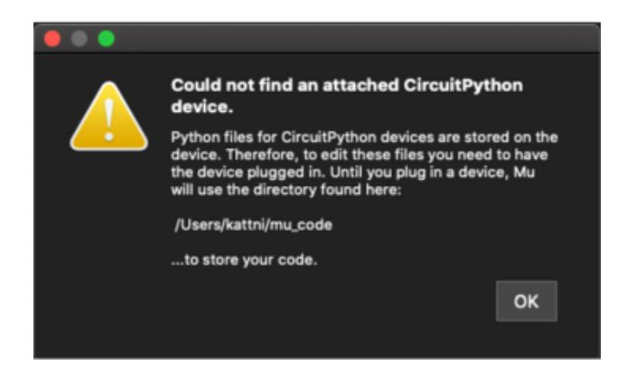

Mu attempts to auto-detect your board on startup, so if you do not have a CircuitPython board plugged in with a CIRCUITPY drive available, Mu will inform you where it will store any code you save until you plug in a board.

To avoid this warning, plug in a board and ensure that the CIRCUITPY drive is mounted before starting Mu.

## Using Mu

You can now explore Mu! The three main sections of the window are labeled below; the button bar, the text editor, and the serial console / REPL.

©Adafruit Industries Page 31 of 252

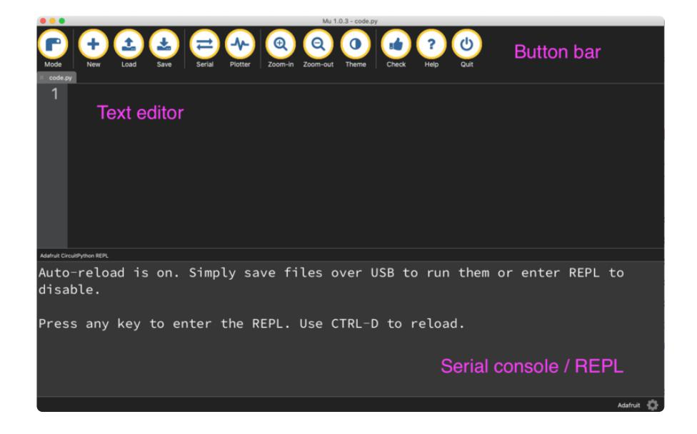

Now you're ready to code! Let's keep going...

# <span id="page-31-0"></span>Creating and Editing Code

One of the best things about CircuitPython is how simple it is to get code up and running. This section covers how to create and edit your first CircuitPython program.

To create and edit code, all you'll need is an editor. There are many options. Adafruit strongly recommends using Mu! It's designed for CircuitPython, and it's really simple and easy to use, with a built in serial console!

If you don't or can't use Mu, there are a number of other editors that work quite well. The [Recommended Editors page](https://learn.adafruit.com/welcome-to-circuitpython/recommended-editors) (https://adafru.it/Vue) has more details. Otherwise, make sure you do "Eject" or "Safe Remove" on Windows or "sync" on Linux after writing a file if you aren't using Mu. (This was formerly not a problem on macOS, but see the warning below.)


macOS Sonoma 14.1 introduced a bug that delays writes to small drives such as CIRCUITPY drives. This caused errors when saving files to CIRCUITPY. There is a [workaround](https://learn.adafruit.com/welcome-to-circuitpython/troubleshooting#macos-sonoma-14-dot-x-disk-errors-writing-to-circuitpy-3160304). The bug was fixed in Sonoma 14.4, but at the cost of greatly slowed writes to drives 1GB or smaller.

©Adafruit Industries Page 32 of 252

## Creating Code

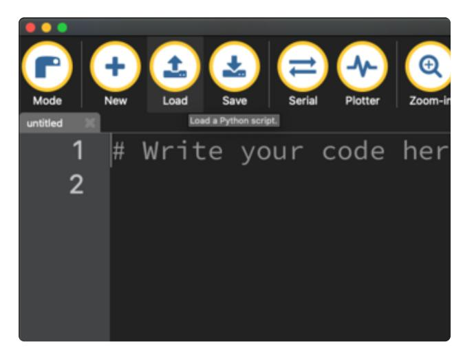

Installing CircuitPython generates a code.py file on your CIRCUITPY drive. To begin your own program, open your editor, and load the code.py file from the CIRCUITPY drive.

If you are using Mu, click the Load button in the button bar, navigate to the CIRCUITPY drive, and choose code.py.

Copy and paste the following code into your editor:

```
import board
import digitalio
import time
led = digitalio.DigitalInOut(board.LED)
led.direction = digitalio.Direction.OUTPUT
while True:
    led.value = True
    time.sleep(0.5)
    led.value = False
    time.sleep(0.5)
```


The KB2040, QT Py , Qualia, and the Trinkeys do not have a built-in little red LED! There is an addressable RGB NeoPixel LED. The above example will NOT work on the KB2040, QT Py, Qualia, or the Trinkeys!

If you're using a KB2040, QT Py, Quaila, or a Trinkey, or any other board without a single-color LED that can blink, please download the [NeoPixel blink example](https://github.com/adafruit/Adafruit_Learning_System_Guides/blob/master/Welcome_to_CircuitPython/code.py) (https:// adafru.it/UDU).

©Adafruit Industries Page 33 of 252


The NeoPixel blink example uses the onboard NeoPixel, but the time code is the same. You can use the linked NeoPixel Blink example to follow along with this guide page.

It will look like this. Note that under the while True: line, the next four lines begin with four spaces to indent them, and they're indented exactly the same amount. All the lines before that have no spaces before the text.

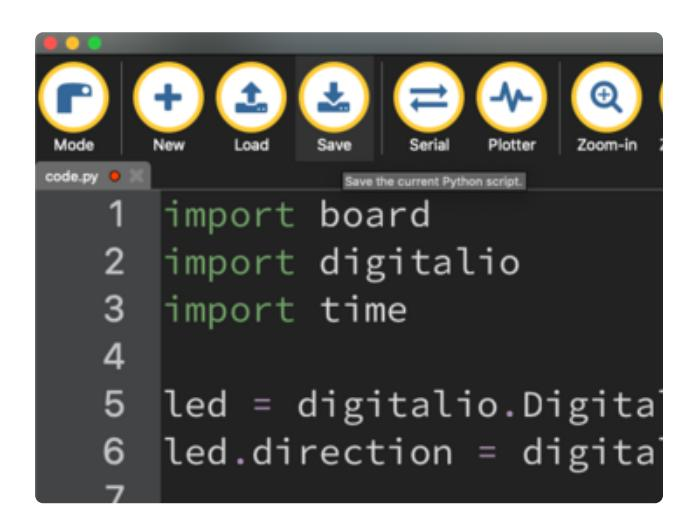

Save the code.py file on your CIRCUITPY drive.

The little LED should now be blinking. Once per half-second.

Congratulations, you've just run your first CircuitPython program!


On most boards you'll find a tiny red LED. On the ItsyBitsy nRF52840, you'll find a tiny blue LED. On QT Py M0, QT Py RP2040, Qualia, and the Trinkey series, you will find only an RGB NeoPixel LED.

©Adafruit Industries Page 34 of 252

## Editing Code

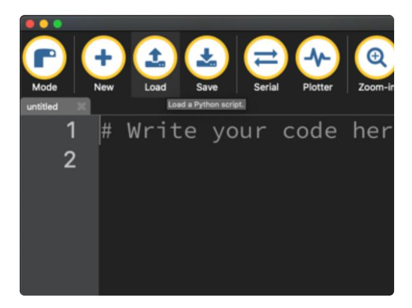

To edit code, open the code.py file on your CIRCUITPY drive into your editor.

Make the desired changes to your code. Save the file. That's it!

Your code changes are run as soon as the file is done saving.

There's one warning before you continue...


Don't click reset or unplug your board!

The CircuitPython code on your board detects when the files are changed or written and will automatically re-start your code. This makes coding very fast because you save, and it re-runs. If you unplug or reset the board before your computer finishes writing the file to your board, you can corrupt the drive. If this happens, you may lose the code you've written, so it's important to backup your code to your computer regularly.

There are a couple of ways to avoid filesystem corruption.

1. Use an editor that writes out the file completely when you save it.

Check out the [Recommended Editors page](https://learn.adafruit.com/welcome-to-circuitpython/recommended-editors) (https://adafru.it/Vue) for details on different editing options.

©Adafruit Industries Page 35 of 252


u are dragging a file from your host computer onto the CIRCUITPY drive, still need to do step 2. Eject or Sync (below) to make sure the file is pletely written.

## 2. Eject or Sync the Drive After Writing

If you are using one of our not-recommended-editors, not all is lost! You can still make it work

On Windows, you can Eject or Safe Remove the **CIRCUITPY** drive. It won't actually eject, but it will force the operating system to save your file to disk. On Linux, use the **sync** command in a terminal to force the write to disk.

You also need to do this if you use Windows Explorer or a Linux graphical file manager to drag a file onto **CIRCUITPY**.

# ?

# Oh No I Did Something Wrong and Now The CIRCUITPY Drive Doesn't Show Up!!!

Don't worry! Corrupting the drive isn't the end of the world (or your board!). If this happens, follow the steps found on the Troubleshooting (https://adafru.it/Den) page of every board guide to get your board up and running again.


u are having trouble saving code on Windows 10, try including this code pet at the top of code.py:

import supervisor
supervisor.runtime.autoreload = False

© Adafruit Industries Page 36 of 252

## Back to Editing Code...

Now! Let's try editing the program you added to your board. Open your code.py file into your editor. You'll make a simple change. Change the first 0.5 to 0.1 . The code should look like this:

```
import board
import digitalio
import time
led = digitalio.DigitalInOut(board.LED)
led.direction = digitalio.Direction.OUTPUT
while True:
    led.value = True
    time.sleep(0.1)
    led.value = False
    time.sleep(0.5)
```

Leave the rest of the code as-is. Save your file. See what happens to the LED on your board? Something changed! Do you know why?

You don't have to stop there! Let's keep going. Change the second 0.5 to 0.1 so it looks like this:

```
while True:
 led.value = True
 time.sleep(0.1)
 led.value = False
 time.sleep(0.1)
```

Now it blinks really fast! You decreased the both time that the code leaves the LED on and off!

Now try increasing both of the 0.1 to 1 . Your LED will blink much more slowly because you've increased the amount of time that the LED is turned on and off.

Well done! You're doing great! You're ready to start into new examples and edit them to see what happens! These were simple changes, but major changes are done using the same process. Make your desired change, save it, and get the results. That's really all there is to it!

©Adafruit Industries Page 37 of 252

# Naming Your Program File

CircuitPython looks for a code file on the board to run. There are four options: code.txt, code.py, main.txt and main.py. CircuitPython looks for those files, in that order, and then runs the first one it finds. While code.py is the recommended name for your code file, it is important to know that the other options exist. If your program doesn't seem to be updating as you work, make sure you haven't created another code file that's being read instead of the one you're working on.

# <span id="page-37-0"></span>Exploring Your First CircuitPython Program

First, you'll take a look at the code you're editing.

Here is the original code again for the LED blink example (if your board doesn't have a single-color LED to blink, look instead at the NeoPixel blink example):

```
import board
import digitalio
import time
led = digitalio.DigitalInOut(board.LED)
led.direction = digitalio.Direction.OUTPUT
while True:
    led.value = True
    time.sleep(0.5)
    led.value = False
    time.sleep(0.5)
```

## Imports & Libraries

Each CircuitPython program you run needs to have a lot of information to work. The reason CircuitPython is so simple to use is that most of that information is stored in other files and works in the background. The files built into CircuitPython are called modules, and the files you load separately are called libraries. Modules are built into CircuitPython. Libraries are stored on your CIRCUITPY drive in a folder called lib.

```
import board
import digitalio
import time
```

The import statements tells the board that you're going to use a particular library or module in your code. In this example, you imported three modules: board ,

©Adafruit Industries Page 38 of 252

digitalio , and time . All three of these modules are built into CircuitPython, so no separate library files are needed. That's one of the things that makes this an excellent first example. You don't need anything extra to make it work!

These three modules each have a purpose. The first one, board , gives you access to the hardware on your board. The second, digitalio , lets you access that hardware as inputs/outputs. The third, time , let's you control the flow of your code in multiple ways, including passing time by 'sleeping'.

## Setting Up The LED

The next two lines setup the code to use the LED.

```
led = digitalio.DigitalInOut(board.LED)
led.direction = digitalio.Direction.OUTPUT
```

Your board knows the red LED as LED . So, you initialise that pin, and you set it to output. You set led to equal the rest of that information so you don't have to type it all out again later in our code.

## Loop-de-loops

The third section starts with a while statement. while True: essentially means, "forever do the following:". while True: creates a loop. Code will loop "while" the condition is "true" (vs. false), and as True is never False, the code will loop forever. All code that is indented under while True: is "inside" the loop.

Inside our loop, you have four items:

```
while True:
    led.value = True
    time.sleep(0.5)
    led.value = False
    time.sleep(0.5)
```

First, you have led.value = True . This line tells the LED to turn on. On the next line, you have time.sleep(0.5) . This line is telling CircuitPython to pause running code for 0.5 seconds. Since this is between turning the led on and off, the led will be on for 0.5 seconds.

©Adafruit Industries Page 39 of 252

The next two lines are similar. led.value = False tells the LED to turn off, and time.sleep(0.5) tells CircuitPython to pause for another 0.5 seconds. This occurs between turning the led off and back on so the LED will be off for 0.5 seconds too.

Then the loop will begin again, and continue to do so as long as the code is running!

So, when you changed the first 0.5 to 0.1 , you decreased the amount of time that the code leaves the LED on. So it blinks on really quickly before turning off!

Great job! You've edited code in a CircuitPython program!

## What Happens When My Code Finishes Running?

When your code finishes running, CircuitPython resets your microcontroller board to prepare it for the next run of code. That means any set up you did earlier no longer applies, and the pin states are reset.

For example, try reducing the code snippet above by eliminating the loop entirely, and replacing it with led.value = True . The LED will flash almost too quickly to see, and turn off. This is because the code finishes running and resets the pin state, and the LED is no longer receiving a signal.

To that end, most CircuitPython programs involve some kind of loop, infinite or otherwise.

## What if I Don't Have the Loop?

If you don't have the loop, the code will run to the end and exit. This can lead to some unexpected behavior in simple programs like this since the "exit" also resets the state of the hardware. This is a different behavior than running commands via REPL. So if you are writing a simple program that doesn't seem to work, you may need to add a loop to the end so the program doesn't exit.

The simplest loop would be:

```
while True:
    pass
```

And remember - you can press CTRL+C to exit the loop.

See also the [Behavior section in the docs](https://circuitpython.readthedocs.io/en/latest/README.html#behavior) (https://adafru.it/Bvz).

©Adafruit Industries Page 40 of 252

# <span id="page-40-0"></span>Connecting to the Serial Console

One of the staples of CircuitPython (and programming in general!) is something called a "print statement". This is a line you include in your code that causes your code to output text. A print statement in CircuitPython (and Python) looks like this:

```
print("Hello, world!")
```

This line in your code.py would result in:

```
Hello, world!
```

However, these print statements need somewhere to display. That's where the serial console comes in!

The serial console receives output from your CircuitPython board sent over USB and displays it so you can see it. This is necessary when you've included a print statement in your code and you'd like to see what you printed. It is also helpful for troubleshooting errors, because your board will send errors and the serial console will display those too.

The serial console requires an editor that has a built in terminal, or a separate terminal program. A terminal is a program that gives you a text-based interface to perform various tasks.

# Are you using Mu?

If so, good news! The serial console is built into Mu and will autodetect your board making using the serial console really really easy.

©Adafruit Industries Page 41 of 252

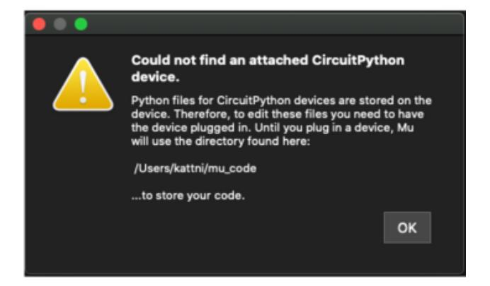

First, make sure your CircuitPython board is plugged in.

If you open Mu without a board plugged in, you may encounter the error seen here, letting you know no CircuitPython board was found and indicating where your code will be stored until you plug in a board.

[If you are using Windows 7, make sure you](https://learn.adafruit.com/welcome-to-circuitpython/windows-7-and-8-1-drivers) [installed the drivers](https://learn.adafruit.com/welcome-to-circuitpython/windows-7-and-8-1-drivers) (https://adafru.it/VuB).

Once you've opened Mu with your board plugged in, look for the Serial button in the button bar and click it.

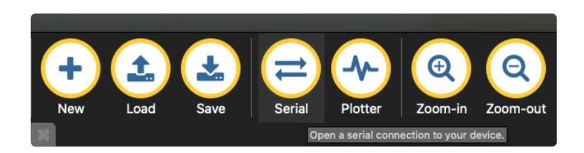

The Mu window will split in two, horizontally, and display the serial console at the bottom.

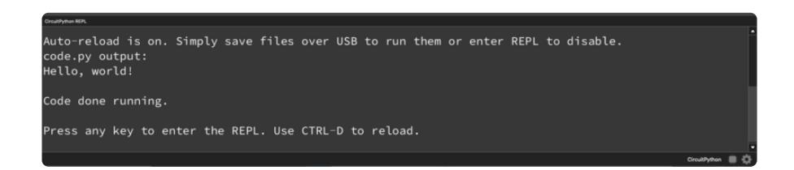


If nothing appears in the serial console, it may mean your code is done running or has no print statements in it. Click into the serial console part of Mu, and press CTRL+D to reload.

©Adafruit Industries Page 42 of 252

## Serial Console Issues or Delays on Linux

If you're on Linux, and are seeing multi-second delays connecting to the serial console, or are seeing "AT" and other gibberish when you connect, then the modemmanager service might be interfering. Just remove it; it doesn't have much use unless you're still using dial-up modems.

To remove modemmanager , type the following command at a shell:

sudo apt purge modemmanager

## Setting Permissions on Linux

On Linux, if you see an error box something like the one below when you press the Serial button, you need to add yourself to a user group to have permission to connect to the serial console.

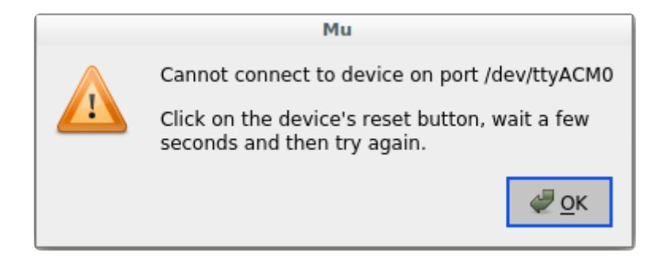

On Ubuntu and Debian, add yourself to the dialout group by doing:

sudo adduser \$USER dialout

After running the command above, reboot your machine to gain access to the group. On other Linux distributions, the group you need may be different. See the [Advanced](https://learn.adafruit.com/welcome-to-circuitpython/advanced-serial-console-on-linux) [Serial Console on Linux](https://learn.adafruit.com/welcome-to-circuitpython/advanced-serial-console-on-linux) (https://adafru.it/VAO) for details on how to add yourself to the right group.

# Using Something Else?

If you're not using Mu to edit, or if for some reason you are not a fan of its built in serial console, you can run the serial console from a separate program.

©Adafruit Industries Page 43 of 252

Windows requires you to download a terminal program. [Check out the Advanced](file:welcome-to-circuitpython/advanced-serial-console-on-windows) [Serial Console on Windows page for more details.](file:welcome-to-circuitpython/advanced-serial-console-on-windows) (https://adafru.it/AAH)

MacOS has serial connection programs you can run in Terminal. [Check the Advanced](file:welcome-to-circuitpython/advanced-serial-console-on-mac-and-linux) [Serial Console on Mac page for more details.](file:welcome-to-circuitpython/advanced-serial-console-on-mac-and-linux) (https://adafru.it/AAI)

Linux has multiple terminal programs included options are available for download. [Check the Advanced Serial Console on Linux page for more details.](https://learn.adafruit.com/welcome-to-circuitpython/advanced-serial-console-on-linux) (https://adafru.it/ VAO)

Once connected, you'll see something like the following.

# <span id="page-43-0"></span>Interacting with the Serial Console

Once you've successfully connected to the serial console, it's time to start using it.

The code you wrote earlier has no output to the serial console. So, you're going to edit it to create some output.

Open your code.py file into your editor, and include a print statement. You can print anything you like! Just include your phrase between the quotation marks inside the parentheses. For example:

```
import board
import digitalio
import time
led = digitalio.DigitalInOut(board.LED)
led.direction = digitalio.Direction.OUTPUT
while True:
    print("Hello, CircuitPython!")
    led.value = True
    time.sleep(1)
    led.value = False
    time.sleep(1)
```

Save your file.

Now, let's go take a look at the window with our connection to the serial console.

©Adafruit Industries Page 44 of 252

Excellent! Our print statement is showing up in our console! Try changing the printed text to something else.

```
import board
import digitalio
import time
led = digitalio.DigitalInOut(board.LED)
led.direction = digitalio.Direction.OUTPUT
while True:
    print("Hello back to you!")
    led.value = True
    time.sleep(1)
    led.value = False
    time.sleep(1)
```

Keep your serial console window where you can see it. Save your file. You'll see what the serial console displays when the board reboots. Then you'll see your new change!

The Traceback (most recent call last): is telling you the last thing your board was doing before you saved your file. This is normal behavior and will happen every time the board resets. This is really handy for troubleshooting. Let's introduce an error so you can see how it is used.

```
Delete the e at the end of True from the line led.value = True so that it says 
led.value = Tru
```

©Adafruit Industries Page 45 of 252

```
import board
import digitalio
import time
led = digitalio.DigitalInOut(board.LED)
led.direction = digitalio.Direction.OUTPUT
while True:
    print("Hello back to you!")
    led.value = Tru
    time.sleep(1)
    led.value = False
    time.sleep(1)
```

Save your file. You will notice that your red LED will stop blinking, and you may have a colored status LED blinking at you. This is because the code is no longer correct and can no longer run properly. You need to fix it!

Usually when you run into errors, it's not because you introduced them on purpose. You may have 200 lines of code, and have no idea where your error could be hiding. This is where the serial console can help. Let's take a look!

The Traceback (most recent call last): is telling you that the last thing it was able to run was line 10 in your code. The next line is your error: NameError: name 'Tru' is not defined . This error might not mean a lot to you, but combined with knowing the issue is on line 10, it gives you a great place to start!

Go back to your code, and take a look at line 10. Obviously, you know what the problem is already. But if you didn't, you'd want to look at line 10 and see if you could figure it out. If you're still unsure, try googling the error to get some help. In this case, you know what to look for. You spelled True wrong. Fix the typo and save your file.

©Adafruit Industries Page 46 of 252

Nice job fixing the error! Your serial console is streaming and your red LED Is blinking again.

The serial console will display any output generated by your code. Some sensors, such as a humidity sensor or a thermistor, receive data and you can use print statements to display that information. You can also use print statements for troubleshooting, which is called "print debugging". Essentially, if your code isn't working, and you want to know where it's failing, you can put print statements in various places to see where it stops printing.

The serial console has many uses, and is an amazing tool overall for learning and programming!

# <span id="page-46-0"></span>The REPL

The other feature of the serial connection is the Read-Evaluate-Print-Loop, or REPL. The REPL allows you to enter individual lines of code and have them run immediately. It's really handy if you're running into trouble with a particular program and can't figure out why. It's interactive so it's great for testing new ideas.

## Entering the REPL

To use the REPL, you first need to be connected to the serial console. Once that connection has been established, you'll want to press CTRL+C.

If there is code running, in this case code measuring distance, it will stop and you'll see Press any key to enter the REPL. Use CTRL-D to reload. Follow those instructions, and press any key on your keyboard.

©Adafruit Industries Page 47 of 252

The Traceback (most recent call last): is telling you the last thing your board was doing before you pressed Ctrl + C and interrupted it. The KeyboardInterrupt is you pressing CTRL+C. This information can be handy when troubleshooting, but for now, don't worry about it. Just note that it is expected behavior.

If your code.py file is empty or does not contain a loop, it will show an empty output and Code done running. . There is no information about what your board was doing before you interrupted it because there is no code running.

If you have no code.py on your CIRCUITPY drive, you will enter the REPL immediately after pressing CTRL+C. Again, there is no information about what your board was doing before you interrupted it because there is no code running.

Regardless, once you press a key you'll see a >>> prompt welcoming you to the REPL!

©Adafruit Industries Page 48 of 252

If you have trouble getting to the >>> prompt, try pressing Ctrl + C a few more times.

The first thing you get from the REPL is information about your board.

This line tells you the version of CircuitPython you're using and when it was released. Next, it gives you the type of board you're using and the type of microcontroller the board uses. Each part of this may be different for your board depending on the versions you're working with.

This is followed by the CircuitPython prompt.

## Interacting with the REPL

From this prompt you can run all sorts of commands and code. The first thing you'll do is run help() . This will tell you where to start exploring the REPL. To run code in the REPL, type it in next to the REPL prompt.

Type help() next to the prompt in the REPL.

Then press enter. You should then see a message.

©Adafruit Industries Page 49 of 252

First part of the message is another reference to the version of CircuitPython you're using. Second, a URL for the CircuitPython related project guides. Then... wait. What's this? To list built-in modules type help("modules"). Remember the modules you learned about while going through creating code? That's exactly what this is talking about! This is a perfect place to start. Let's take a look!

Type help("modules") into the REPL next to the prompt, and press enter.

This is a list of all the core modules built into CircuitPython, including board . Remember, board contains all of the pins on the board that you can use in your code. From the REPL, you are able to see that list!

Type import board into the REPL and press enter. It'll go to a new prompt. It might look like nothing happened, but that's not the case! If you recall, the import statement simply tells the code to expect to do something with that module. In this case, it's telling the REPL that you plan to do something with that module.

Next, type dir(board) into the REPL and press enter.

©Adafruit Industries Page 50 of 252

This is a list of all of the pins on your board that are available for you to use in your code. Each board's list will differ slightly depending on the number of pins available. Do you see LED ? That's the pin you used to blink the red LED!

The REPL can also be used to run code. Be aware that any code you enter into the REPL isn't saved anywhere. If you're testing something new that you'd like to keep, make sure you have it saved somewhere on your computer as well!

Every programmer in every programming language starts with a piece of code that says, "Hello, World." You're going to say hello to something else. Type into the REPL:

```
print("Hello, CircuitPython!")
```

Then press enter.

That's all there is to running code in the REPL! Nice job!

You can write single lines of code that run stand-alone. You can also write entire programs into the REPL to test them. Remember that nothing typed into the REPL is saved.

There's a lot the REPL can do for you. It's great for testing new ideas if you want to see if a few new lines of code will work. It's fantastic for troubleshooting code by entering it one line at a time and finding out where it fails. It lets you see what modules are available and explore those modules.

Try typing more into the REPL to see what happens!


Everything typed into the REPL is ephemeral. Once you reload the REPL or return to the serial console, nothing you typed will be retained in any memory space. So be sure to save any desired code you wrote somewhere else, or you'll lose it when you leave the current REPL instance!

# Returning to the Serial Console

When you're ready to leave the REPL and return to the serial console, simply press CTRL+D. This will reload your board and reenter the serial console. You will restart the

©Adafruit Industries Page 51 of 252

program you had running before entering the REPL. In the console window, you'll see any output from the program you had running. And if your program was affecting anything visual on the board, you'll see that start up again as well.

You can return to the REPL at any time!

# <span id="page-51-0"></span>CircuitPython Libraries

As CircuitPython development continues and there are new releases, Adafruit will stop supporting older releases. Visit <https://circuitpython.org/downloads> to download the latest version of CircuitPython for your board. You must download the CircuitPython Library Bundle that matches your version of CircuitPython. Please update CircuitPython and then visit [https://](https://circuitpython.org/libraries) [circuitpython.org/libraries](https://circuitpython.org/libraries) to download the latest Library Bundle.

Each CircuitPython program you run needs to have a lot of information to work. The reason CircuitPython is so simple to use is that most of that information is stored in other files and works in the background. These files are called libraries. Some of them are built into CircuitPython. Others are stored on your CIRCUITPY drive in a folder called lib. Part of what makes CircuitPython so great is its ability to store code separately from the firmware itself. Storing code separately from the firmware makes it easier to update both the code you write and the libraries you depend.

Your board may ship with a lib folder already, it's in the base directory of the drive. If not, simply create the folder yourself. When you first install CircuitPython, an empty lib directory will be created for you.

©Adafruit Industries Page 52 of 252

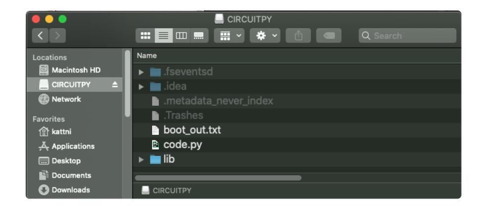

CircuitPython libraries work in the same way as regular Python modules so the [Python](https://docs.python.org/3/tutorial/modules.html) [docs](https://docs.python.org/3/tutorial/modules.html) (https://adafru.it/rar) are an excellent reference for how it all should work. In Python terms, you can place our library files in the lib directory because it's part of the Python path by default.

One downside of this approach of separate libraries is that they are not built in. To use them, one needs to copy them to the CIRCUITPY drive before they can be used. Fortunately, there is a library bundle.

The bundle and the library releases on GitHub also feature optimized versions of the libraries with the .mpy file extension. These files take less space on the drive and have a smaller memory footprint as they are loaded.

Due to the regular updates and space constraints, Adafruit does not ship boards with the entire bundle. Therefore, you will need to load the libraries you need when you begin working with your board. You can find example code in the guides for your board that depends on external libraries.

Either way, as you start to explore CircuitPython, you'll want to know how to get libraries on board.

# The Adafruit Learn Guide Project Bundle

The quickest and easiest way to get going with a project from the Adafruit Learn System is by utilising the Project Bundle. Most guides now have a Download Project Bundle button available at the top of the full code example embed. This button downloads all the necessary files, including images, etc., to get the guide project up and running. Simply click, open the resulting zip, copy over the right files, and you're good to go!

The first step is to find the Download Project Bundle button in the guide you're working on.

©Adafruit Industries Page 53 of 252


The Download Project Bundle button is only available on full demo code embedded from GitHub in a Learn guide. Code snippets will NOT have the button available.

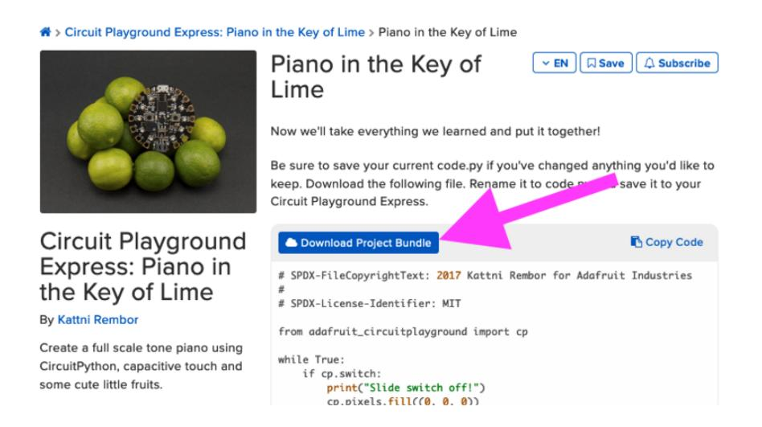


When you copy the contents of the Project Bundle to your CIRCUITPY drive, it will replace all the existing content! If you don't want to lose anything, ensure you copy your current code to your computer before you copy over the new Project Bundle content!

The Download Project Bundle button downloads a zip file. This zip contains a series of directories, nested within which is the code.py, any applicable assets like images or audio, and the lib/ folder containing all the necessary libraries. The following zip was downloaded from the Piano in the Key of Lime guide.

©Adafruit Industries Page 54 of 252

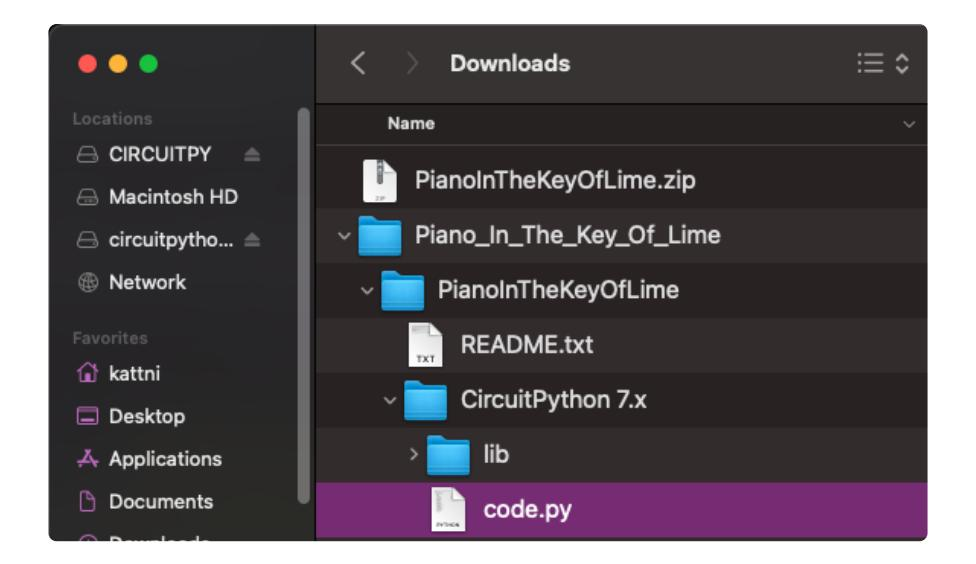


The Piano in the Key of Lime guide was chosen as an example. That guide is specific to Circuit Playground Express, and cannot be used on all boards. Do not expect to download that exact bundle and have it work on your non-CPX microcontroller.

When you open the zip, you'll find some nested directories. Navigate through them until you find what you need. You'll eventually find a directory for your CircuitPython version (in this case, 7.x). In the version directory, you'll find the file and directory you need: code.py and lib/. Once you find the content you need, you can copy it all over to your CIRCUITPY drive, replacing any files already on the drive with the files from the freshly downloaded zip.


In some cases, there will be other files such as audio or images in the same directory as code.py and lib/. Make sure you include all the files when you copy things over!

Once you copy over all the relevant files, the project should begin running! If you find that the project is not running as expected, make sure you've copied ALL of the project files onto your microcontroller board.

That's all there is to using the Project Bundle!

©Adafruit Industries Page 55 of 252

# The Adafruit CircuitPython Library Bundle

Adafruit provides CircuitPython libraries for much of the hardware they provide, including sensors, breakouts and more. To eliminate the need for searching for each library individually, the libraries are available together in the Adafruit CircuitPython Library Bundle. The bundle contains all the files needed to use each library.

## Downloading the Adafruit CircuitPython Library Bundle

You can download the latest Adafruit CircuitPython Library Bundle release by clicking the button below. The libraries are being constantly updated and improved, so you'll always want to download the latest bundle.

Match up the bundle version with the version of CircuitPython you are running. For example, you would download the 6.x library bundle if you're running any version of CircuitPython 6, or the 7.x library bundle if you're running any version of CircuitPython 7, etc. If you mix libraries with major CircuitPython versions, you will get incompatible mpy errors due to changes in library interfaces possible during major version changes.

## https://adafru.it/ENC

Download the bundle version that matches your CircuitPython firmware version. If you don't know the version, check the version info in boot\_out.txt file on the CIRCUITPY drive, or the initial prompt in the CircuitPython REPL. For example, if you're running v7.0.0, download the 7.x library bundle.

There's also a py bundle which contains the uncompressed python files, you probably don't want that unless you are doing advanced work on libraries.

# The CircuitPython Community Library Bundle

The CircuitPython Community Library Bundle is made up of libraries written and provided by members of the CircuitPython community. These libraries are often written when community members encountered hardware not supported in the

©Adafruit Industries Page 56 of 252

Adafruit Bundle, or to support a personal project. The authors all chose to submit these libraries to the Community Bundle make them available to the community.

These libraries are maintained by their authors and are not supported by Adafruit. As you would with any library, if you run into problems, feel free to file an issue on the GitHub repo for the library. Bear in mind, though, that most of these libraries are supported by a single person and you should be patient about receiving a response. Remember, these folks are not paid by Adafruit, and are volunteering their personal time when possible to provide support.

## Downloading the CircuitPython Community Library Bundle

You can download the latest CircuitPython Community Library Bundle release by clicking the button below. The libraries are being constantly updated and improved, so you'll always want to download the latest bundle.

## https://adafru.it/VCn

The link takes you to the latest release of the CircuitPython Community Library Bundle on GitHub. There are multiple versions of the bundle available. Download the bundle version that matches your CircuitPython firmware version. If you don't know the version, check the version info in boot\_out.txt file on the CIRCUITPY drive, or the initial prompt in the CircuitPython REPL. For example, if you're running v7.0.0, download the 7.x library bundle.

# Understanding the Bundle

After downloading the zip, extract its contents. This is usually done by double clicking on the zip. On Mac OSX, it places the file in the same directory as the zip.

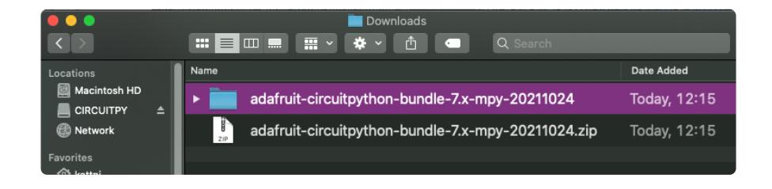

©Adafruit Industries Page 57 of 252

Open the bundle folder. Inside you'll find two information files, and two folders. One folder is the lib bundle, and the other folder is the examples bundle.

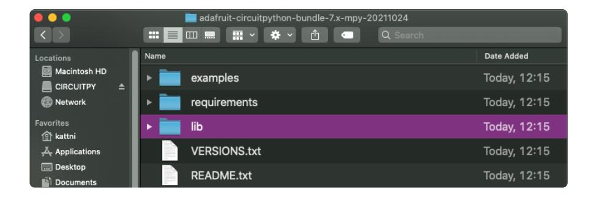

Now open the lib folder. When you open the folder, you'll see a large number of .mpy files, and folders.

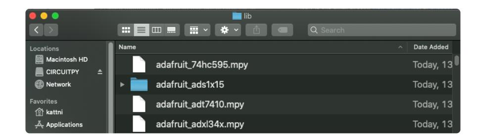

## Example Files

All example files from each library are now included in the bundles in an examples directory (as seen above), as well as an examples-only bundle. These are included for two main reasons:

- Allow for quick testing of devices. •
- Provide an example base of code, that is easily built upon for individualized purposes. •

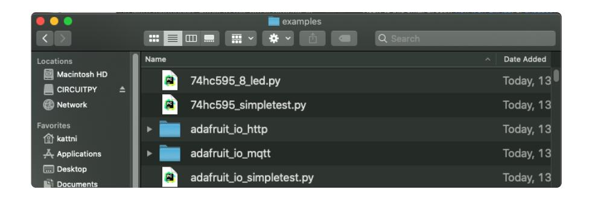

©Adafruit Industries Page 58 of 252

## Copying Libraries to Your Board

First open the lib folder on your CIRCUITPY drive. Then, open the lib folder you extracted from the downloaded zip. Inside you'll find a number of folders and .mpy files. Find the library you'd like to use, and copy it to the lib folder on CIRCUITPY.

If the library is a directory with multiple .mpy files in it, be sure to copy the entire folder to CIRCUITPY/lib.

This also applies to example files. Open the examples folder you extracted from the downloaded zip, and copy the applicable file to your CIRCUITPY drive. Then, rename it to code.py to run it.


If a library has multiple .mpy files contained in a folder, be sure to copy the entire folder to CIRCUITPY/lib.

# Understanding Which Libraries to Install

You now know how to load libraries on to your CircuitPython-compatible microcontroller board. You may now be wondering, how do you know which libraries you need to install? Unfortunately, it's not always straightforward. Fortunately, there is an obvious place to start, and a relatively simple way to figure out the rest. First up: the best place to start.

When you look at most CircuitPython examples, you'll see they begin with one or more import statements. These typically look like the following:

import library\_or\_module •

However, import statements can also sometimes look like the following:

- from library\_or\_module import name •
- from library\_or\_module.subpackage import name •
- from library\_or\_module import name as local\_name •

They can also have more complicated formats, such as including a try / except block, etc.

©Adafruit Industries Page 59 of 252

The important thing to know is that an import statement will always include the name of the module or library that you're importing.

Therefore, the best place to start is by reading through the import statements.

Here is an example import list for you to work with in this section. There is no setup or other code shown here, as the purpose of this section involves only the import list.

```
import time
import board
import neopixel
import adafruit_lis3dh
import usb_hid
from adafruit_hid.consumer_control import ConsumerControl
from adafruit_hid.consumer_control_code import ConsumerControlCode
```

Keep in mind, not all imported items are libraries. Some of them are almost always built-in CircuitPython modules. How do you know the difference? Time to visit the REPL.

In the [Interacting with the REPL section](https://learn.adafruit.com/welcome-to-circuitpython/the-repl#interacting-with-the-repl-2977486-14) (https://adafru.it/Awz) on [The REPL](https://learn.adafruit.com/welcome-to-circuitpython/the-repl) [page](https://learn.adafruit.com/welcome-to-circuitpython/the-repl) (https://adafru.it/Awz) in this guide, the help("modules") command is discussed. This command provides a list of all of the built-in modules available in CircuitPython for your board. So, if you connect to the serial console on your board, and enter the REPL, you can run help("modules") to see what modules are available for your board. Then, as you read through the import statements, you can, for the purposes of figuring out which libraries to load, ignore the statement that import modules.

The following is the list of modules built into CircuitPython for the Feather RP2040. Your list may look similar or be anything down to a significant subset of this list for smaller boards.

©Adafruit Industries Page 60 of 252

Now that you know what you're looking for, it's time to read through the import statements. The first two, time and board , are on the modules list above, so they're built-in.

The next one, neopixel , is not on the module list. That means it's your first library! So, you would head over to the bundle zip you downloaded, and search for neopixel. There is a neopixel.mpy file in the bundle zip. Copy it over to the lib folder on your CIRCUITPY drive. The following one, adafruit\_lis3dh , is also not on the module list. Follow the same process for adafruit\_lis3dh, where you'll find adafruit\_lis3dh.mpy, and copy that over.

The fifth one is usb\_hid , and it is in the modules list, so it is built in. Often all of the built-in modules come first in the import list, but sometimes they don't! Don't assume that everything after the first library is also a library, and verify each import with the modules list to be sure. Otherwise, you'll search the bundle and come up empty!

The final two imports are not as clear. Remember, when import statements are formatted like this, the first thing after the from is the library name. In this case, the library name is adafruit\_hid . A search of the bundle will find an adafruit\_hid folder. When a library is a folder, you must copy the entire folder and its contents as it is in the bundle to the lib folder on your CIRCUITPY drive. In this case, you would copy the entire adafruit\_hid folder to your CIRCUITPY/lib folder.

Notice that there are two imports that begin with adafruit\_hid . Sometimes you will need to import more than one thing from the same library. Regardless of how many times you import the same library, you only need to load the library by copying over the adafruit\_hid folder once.

That is how you can use your example code to figure out what libraries to load on your CircuitPython-compatible board!

There are cases, however, where libraries require other libraries internally. The internally required library is called a dependency. In the event of library dependencies, the easiest way to figure out what other libraries are required is to connect to the serial console and follow along with the ImportError printed there. The following is a very simple example of an ImportError , but the concept is the same for any missing library.

# Example: ImportError Due to Missing Library

If you choose to load libraries as you need them, or you're starting fresh with an existing example, you may end up with code that tries to use a library you haven't yet

©Adafruit Industries Page 61 of 252

loaded. This section will demonstrate what happens when you try to utilise a library that you don't have loaded on your board, and cover the steps required to resolve the issue.

This demonstration will only return an error if you do not have the required library loaded into the lib folder on your CIRCUITPY drive.

Let's use a modified version of the Blink example.

```
import board
import time
import simpleio
led = simpleio.DigitalOut(board.LED)
while True:
 led.value = True
 time.sleep(0.5)
 led.value = False
 time.sleep(0.5)
```

Save this file. Nothing happens to your board. Let's check the serial console to see what's going on.

You have an ImportError . It says there is no module named 'simpleio' . That's the one you just included in your code!

Click the link above to download the correct bundle. Extract the lib folder from the downloaded bundle file. Scroll down to find simpleio.mpy. This is the library file you're looking for! Follow the steps above to load an individual library file.

The LED starts blinking again! Let's check the serial console.

©Adafruit Industries Page 62 of 252

No errors! Excellent. You've successfully resolved an ImportError !

If you run into this error in the future, follow along with the steps above and choose the library that matches the one you're missing.

# Library Install on Non-Express Boards

If you have an M0 non-Express board such as Trinket M0, Gemma M0, QT Py M0, or one of the M0 Trinkeys, you'll want to follow the same steps in the example above to install libraries as you need them. Remember, you don't need to wait for an ImportError if you know what library you added to your code. Open the library bundle you downloaded, find the library you need, and drag it to the lib folder on your CIRCUITPY drive.

You can still end up running out of space on your M0 non-Express board even if you only load libraries as you need them. There are a number of steps you can use to try to resolve this issue. You'll find suggestions on the [Troubleshooting page](https://learn.adafruit.com/welcome-to-circuitpython/troubleshooting) (https:// adafru.it/Den).

# Updating CircuitPython Libraries and Examples

Libraries and examples are updated from time to time, and it's important to update the files you have on your CIRCUITPY drive.

To update a single library or example, follow the same steps above. When you drag the library file to your lib folder, it will ask if you want to replace it. Say yes. That's it!

A new library bundle is released every time there's an update to a library. Updates include things like bug fixes and new features. It's important to check in every so often to see if the libraries you're using have been updated.

## CircUp CLI Tool

There is a command line interface (CLI) utility called [CircUp](https://learn.adafruit.com/keep-your-circuitpython-libraries-on-devices-up-to-date-with-circup) (https://adafru.it/Tfi) that can be used to easily install and update libraries on your device. Follow the directions

©Adafruit Industries Page 63 of 252

on the [install page within the CircUp learn guide](https://learn.adafruit.com/keep-your-circuitpython-libraries-on-devices-up-to-date-with-circup/install-circup) (https://adafru.it/-Ad). Once you've got it installed you run the command circup update in a terminal to interactively update all libraries on the connected CircuitPython device. See the [usage page in the](https://learn.adafruit.com/keep-your-circuitpython-libraries-on-devices-up-to-date-with-circup/usage) [CircUp guide](https://learn.adafruit.com/keep-your-circuitpython-libraries-on-devices-up-to-date-with-circup/usage) (https://adafru.it/-Ah) for a full list of functionality

# <span id="page-63-0"></span>CircuitPython Documentation

You've learned about the CircuitPython built-in modules and external libraries. You know that you can find the modules in CircuitPython, and the libraries in the Library Bundles. There are guides available that explain the basics of many of the modules and libraries. However, there's sometimes more capabilities than are necessarily showcased in the guides, and often more to learn about a module or library. So, where can you find more detailed information? That's when you want to look at the API documentation.

The entire CircuitPython project comes with extensive documentation available on Read the Docs. This includes both the [CircuitPython core](https://circuitpython.readthedocs.io/) (https://adafru.it/Beg) and the [Adafruit CircuitPython libraries](https://circuitpython.readthedocs.io/projects/bundle/en/latest/) (https://adafru.it/Tra).

## CircuitPython Core Documentation

The [CircuitPython core documentation](https://circuitpython.readthedocs.io/) (https://adafru.it/Beg) covers many of the details you might want to know about the CircuitPython core and related topics. It includes API and usage info, a design guide and information about porting CircuitPython to new boards, MicroPython info with relation to CircuitPython, and general information about the project.

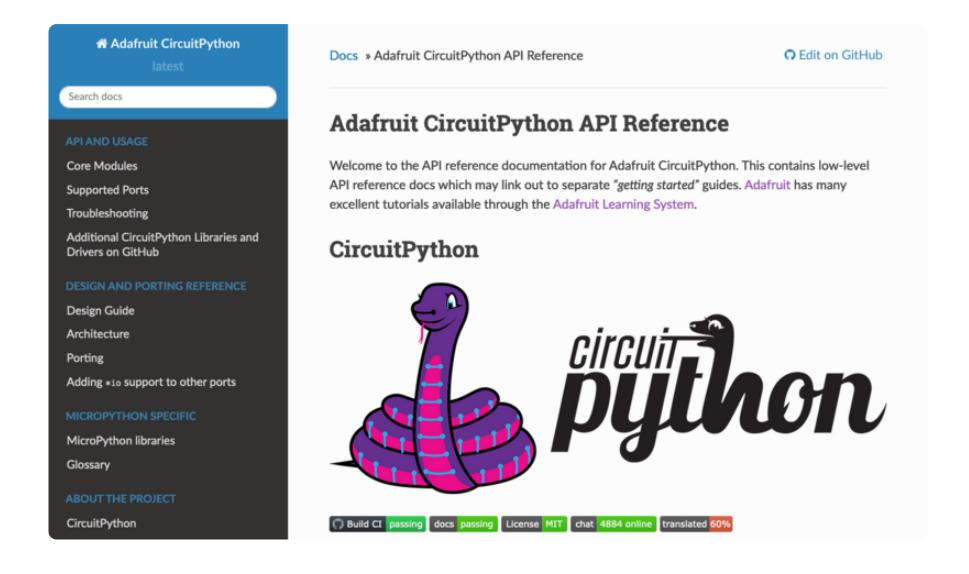

©Adafruit Industries Page 64 of 252

The main page covers the basics including where to download CircuitPython, how to contribute, differences from MicroPython, information about the project structure, and a full table of contents for the rest of the documentation.

The list along the left side leads to more information about specific topics.

The first section is API and Usage. This is where you can find information about how to use individual built-in core modules, such as time and digitalio , details about the supported ports, suggestions for troubleshooting, and basic info and links to the library bundles. The Core Modules section also includes the Support Matrix, which is a table of which core modules are available on which boards.

The second section is Design and Porting Reference. It includes a design guide, architecture information, details on porting, and adding module support to other ports.

The third section is MicroPython Specific. It includes information on MicroPython and related libraries, and a glossary of terms.

The fourth and final section is About the Project. It includes further information including details on building, testing, and debugging CircuitPython, along with various other useful links including the Adafruit Community Code of Conduct.

Whether you're a seasoned pro or new to electronics and programming, you'll find a wealth of information to help you along your CircuitPython journey in the documentation!

## CircuitPython Library Documentation

The Adafruit CircuitPython libraries are documented in a very similar fashion. Each library has its own page on Read the Docs. There is a comprehensive list available [here](https://circuitpython.readthedocs.io/projects/bundle/en/latest/) (https://adafru.it/Tra). Otherwise, to view the documentation for a specific library, you can visit the GitHub repository for the library, and find the link in the README.

For the purposes of this page, the [LED Animation library](https://github.com/adafruit/Adafruit_CircuitPython_LED_Animation) (https://adafru.it/O2d) documentation will be featured. There are two links to the documentation in each library GitHub repo. The first one is the docs badge near the top of the README.

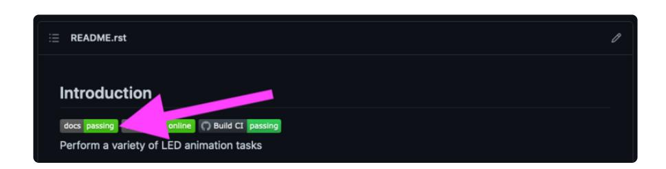

©Adafruit Industries Page 65 of 252

The second place is the Documentation section of the README. Scroll down to find it, and click on Read the Docs to get to the documentation.


Now that you know how to find it, it's time to take a look at what to expect.


Not all library documentation will look exactly the same, but this will give you some idea of what to expect from library docs.

The Introduction page is generated from the README, so it includes all the same info, such as PyPI installation instructions, a quick demo, and some build details. It also includes a full table of contents for the rest of the documentation (which is not part of the GitHub README). The page should look something like the following.

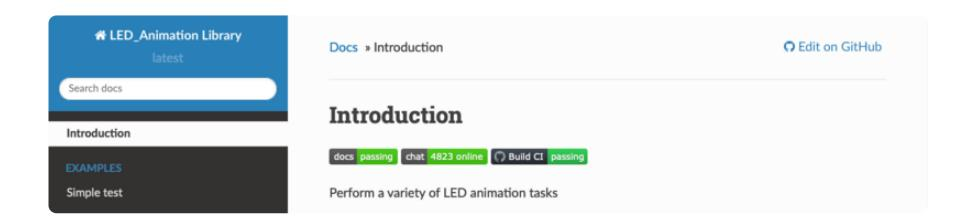

The left side contains links to the rest of the documentation, divided into three separate sections: Examples, API Reference, and Other Links.

## Examples

The [Examples section](https://circuitpython.readthedocs.io/projects/led-animation/en/latest/examples.html) (https://adafru.it/VFD) is a list of library examples. This list contains anywhere from a small selection to the full list of the examples available for the library.

This section will always contain at least one example - the simple test example.

©Adafruit Industries Page 66 of 252


The simple test example is usually a basic example designed to show your setup is working. It may require other libraries to run. Keep in mind, it's simple - it won't showcase a comprehensive use of all the library features.

The LED Animation simple test demonstrates the Blink animation.

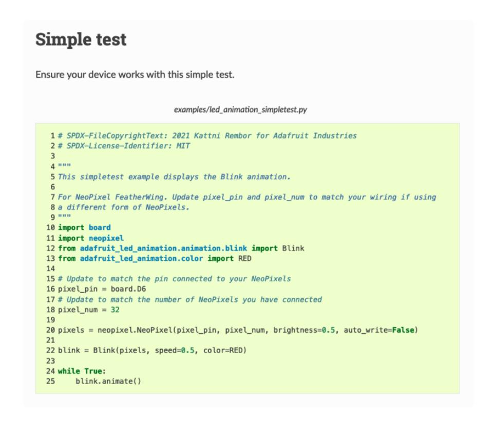

In some cases, you'll find a longer list, that may include examples that explore other features in the library. The LED Animation documentation includes a series of examples, all of which are available in the library. These examples include demonstrations of both basic and more complex features. Simply click on the example that interests you to view the associated code.

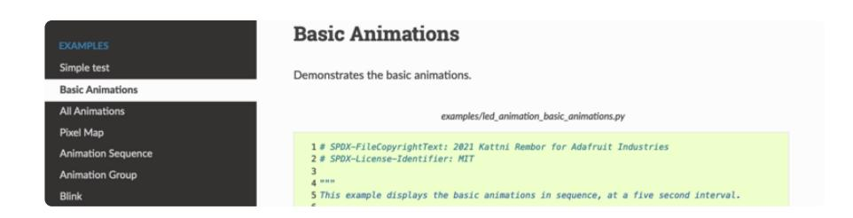

©Adafruit Industries Page 67 of 252


When there are multiple links in the Examples section, all of the example content is, in actuality, on the same page. Each link after the first is an anchor link to the specified section of the page. Therefore, you can also view all the available examples by scrolling down the page.

You can view the rest of the examples by clicking through the list or scrolling down the page. These examples are fully working code. Which is to say, while they may rely on other libraries as well as the library for which you are viewing the documentation, they should not require modification to otherwise work.

## API Reference

The [API Reference section](https://circuitpython.readthedocs.io/projects/led-animation/en/latest/api.html) (https://adafru.it/Rqa) includes a list of the library functions and classes. The API (Application Programming Interface) of a library is the set of functions and classes the library provides. Essentially, the API defines how your program interfaces with the functions and classes that you call in your code to use the library.

There is always at least one list item included. Libraries for which the code is included in a single Python (.py) file, will only have one item. Libraries for which the code is multiple Python files in a directory (called subpackages) will have multiple items in this list. The LED Animation library has a series of subpackages, and therefore, multiple items in this list.

Click on the first item in the list to begin viewing the API Reference section.

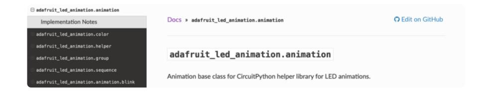


As with the Examples section, all of the API Reference content is on a single page, and the links under API Reference are anchor links to the specified section of the page.

©Adafruit Industries Page 68 of 252

When you click on an item in the API Reference section, you'll find details about the classes and functions in the library. In the case of only one item in this section, all the available functionality of the library will be contained within that first and only subsection. However, in the case of a library that has subpackages, each item will contain the features of the particular subpackage indicated by the link. The documentation will cover all of the available functions of the library, including more complex ones that may not interest you.

The first list item is the animation subpackage. If you scroll down, you'll begin to see the available features of animation. They are listed alphabetically. Each of these things can be called in your code. It includes the name and a description of the specific function you would call, and if any parameters are necessary, lists those with a description as well.

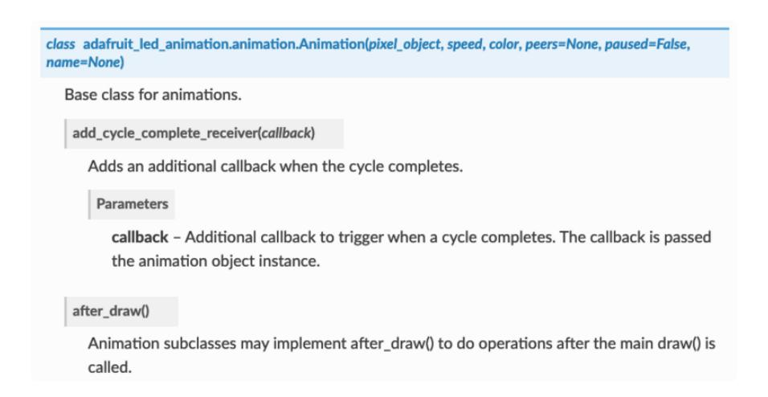

You can view the other subpackages by clicking the link on the left or scrolling down the page. You may be interested in something a little more practical. Here is an example. To use the LED Animation library Comet animation, you would run the following example.

```
# SPDX-FileCopyrightText: 2021 Kattni Rembor for Adafruit Industries
# SPDX-License-Identifier: MIT
"""
This example animates a jade comet that bounces from end to end of the strip.
For QT Py Haxpress and a NeoPixel strip. Update pixel_pin and pixel_num to match 
your wiring if
using a different board or form of NeoPixels.
This example will run on SAMD21 (M0) Express boards (such as Circuit Playground 
Express or QT Py
Haxpress), but not on SAMD21 non-Express boards (such as QT Py or Trinket).
"""
import board
import neopixel
```

©Adafruit Industries Page 69 of 252

```
from adafruit_led_animation.animation.comet import Comet
from adafruit_led_animation.color import JADE
# Update to match the pin connected to your NeoPixels
pixel_pin = board.A3
# Update to match the number of NeoPixels you have connected
pixel_num = 30
pixels = neopixel.NeoPixel(pixel_pin, pixel_num, brightness=0.5, auto_write=False)
comet = Comet(pixels, speed=0.02, color=JADE, tail_length=10, bounce=True)
while True:
    comet.animate()
```

Note the line where you create the comet object. There are a number of items inside the parentheses. In this case, you're provided with a fully working example. But what if you want to change how the comet works? The code alone does not explain what the options mean.

So, in the API Reference documentation list, click the adafruit\_led\_animation.animation.comet link and scroll down a bit until you see the following.

Look familiar? It is! This is the documentation for setting up the comet object. It explains what each argument provided in the comet setup in the code meant, as well as the other available features. For example, the code includes speed=0.02 . The documentation clarifies that this is the "Animation speed in seconds". The code doesn't include ring . The documentation indicates this is an available setting that enables "Ring mode".

©Adafruit Industries Page 70 of 252

This type of information is available for any function you would set up in your code. If you need clarification on something, wonder whether there's more options available, or are simply interested in the details involved in the code you're writing, check out the documentation for the CircuitPython libraries!

## Other Links

This section is the same for every library. It includes a list of links to external sites, which you can visit for more information about the CircuitPython Project and Adafruit.

That covers the CircuitPython library documentation! When you are ready to go beyond the basic library features covered in a guide, or you're interested in understanding those features better, the library documentation on Read the Docs has you covered!

# <span id="page-70-0"></span>Recommended Editors

The CircuitPython code on your board detects when the files are changed or written and will automatically re-start your code. This makes coding very fast because you save, and it re-runs.

However, you must wait until the file is done being saved before unplugging or resetting your board! On Windows using some editors this can sometimes take up to 90 seconds, on Linux it can take 30 seconds to complete because the text editor does not save the file completely. Mac OS does not seem to have this delay, which is nice!

This is really important to be aware of. If you unplug or reset the board before your computer finishes writing the file to your board, you can corrupt the drive. If this happens, you may lose the code you've written, so it's important to backup your code to your computer regularly.

To avoid the likelihood of filesystem corruption, use an editor that writes out the file completely when you save it. Check out the list of recommended editors below.

## Recommended editors

- [mu](https://learn.adafruit.com/welcome-to-circuitpython/installing-mu-editor) (https://adafru.it/ANO) is an editor that safely writes all changes (it's also our recommended editor!) •
- [emacs](https://www.gnu.org/software/emacs/) (https://adafru.it/xNA) is also an editor that will [fulIy write files on](https://www.gnu.org/software/emacs/manual/html_node/emacs/Customize-Save.html) [save](https://www.gnu.org/software/emacs/manual/html_node/emacs/Customize-Save.html) (https://adafru.it/Be7) •
- [Sublime Text](https://www.sublimetext.com/) (https://adafru.it/xNB) safely writes all changes •

©Adafruit Industries Page 71 of 252

- [Visual Studio Code](https://code.visualstudio.com/) (https://adafru.it/Be9) appears to safely write all changes •
- gedit on Linux appears to safely write all changes •
- [IDLE](https://docs.python.org/3/library/idle.html) (https://adafru.it/IWB), in Python 3.8.1 or later, [was fixed](https://bugs.python.org/issue36807) (https://adafru.it/ IWD) to write all changes immediately •
- [Thonny](https://thonny.org/) (https://adafru.it/Qb6) fully writes files on save •
- [Notepad++](https://notepad-plus-plus.org/) (https://adafru.it/xNf) flushes files after writes, as of several years ago. In addition, you can change the path used for "Enable session snapshot and periodic backup" to write somewhere else than the CIRCUITPY drive. This will save space on CIRCUITPY and reduce writes to the drive. •

## Recommended only with particular settings or add-ons

- [vim](http://www.vim.org/) (https://adafru.it/ek9) / vi safely writes all changes. But set up vim to not write [swapfiles](https://vi.stackexchange.com/a/179) (https://adafru.it/ELO) (.swp files: temporary records of your edits) to CIRCUITPY. Run vim with vim -n , set the no swapfile option, or set the directory option to write swapfiles elsewhere. Otherwise the swapfile writes trigger restarts of your program. •
- The [PyCharm IDE](https://www.jetbrains.com/pycharm/) (https://adafru.it/xNC) is safe if "Safe Write" is turned on in Settings->System Settings->Synchronization (true by default). •
- If you are using [Atom](https://atom.io/) (https://adafru.it/fMG), install the  [fsync-on-save](https://atom.io/packages/fsync-on-save) [package](https://atom.io/packages/fsync-on-save) (https://adafru.it/E9m) or the [language-circuitpython package](https://atom.io/packages/language-circuitpython) (https:// adafru.it/Vuf) so that it will always write out all changes to files on CIRCUITPY. •
- [SlickEdit](https://www.slickedit.com/) (https://adafru.it/DdP) works only if you [add a macro to flush the](https://forums.adafruit.com/viewtopic.php?f=57&t=144412#p713290) [disk](https://forums.adafruit.com/viewtopic.php?f=57&t=144412#p713290) (https://adafru.it/ven). •


The editors listed below are specifically NOT recommended!

## Editors that are NOT recommended

- notepad (the default Windows editor) can be slow to write, so the editors above are recommended! If you are using notepad, be sure to eject the drive. •
- IDLE in Python 3.8.0 or earlier does not force out changes immediately. Later versions do force out changes. •
- nano (on Linux) does not force out changes. •
- geany (on Linux) does not force out changes. •

©Adafruit Industries Page 72 of 252

Anything else - Other editors have not been tested so please use a recommended one! •

# <span id="page-72-0"></span>Advanced Serial Console on Windows

# What's the COM?

First, you'll want to find out which serial port your board is using. When you plug your board in to USB on your computer, it connects to a serial port. The port is like a door through which your board can communicate with your computer using USB.

You'll use Windows Device Manager to determine which port the board is using. The easiest way to determine which port the board is using is to first check without the board plugged in. Open Device Manager. Click on Ports (COM & LPT). You should find something already in that list with (COM#) after it where # is a number.

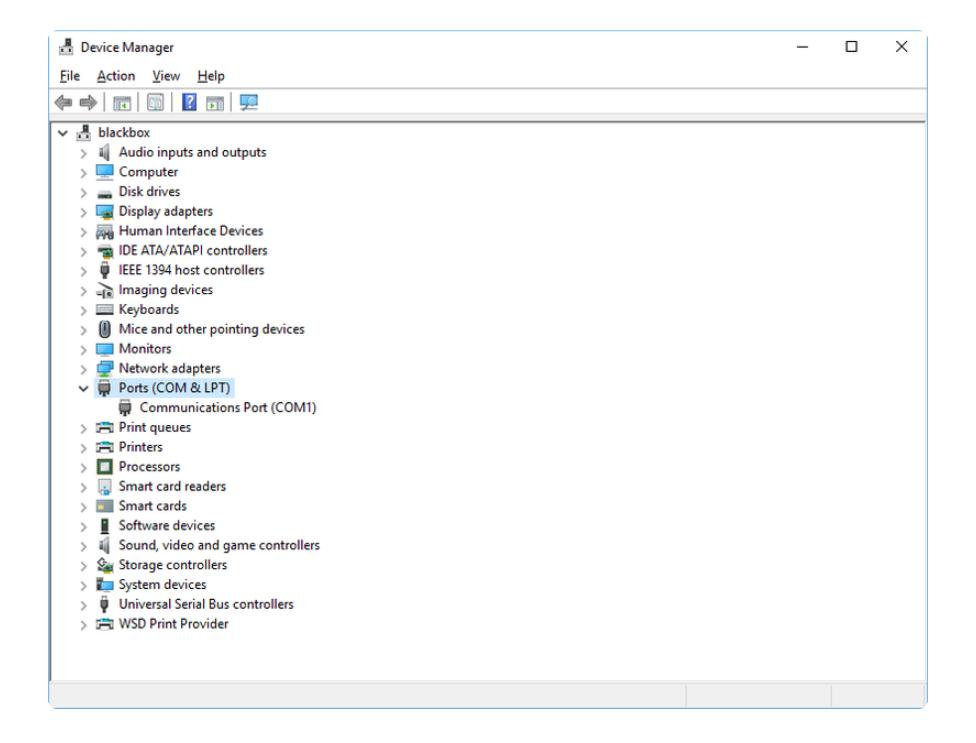

Now plug in your board. The Device Manager list will refresh and a new item will appear under Ports (COM & LPT). You'll find a different (COM#) after this item in the list.

©Adafruit Industries Page 73 of 252

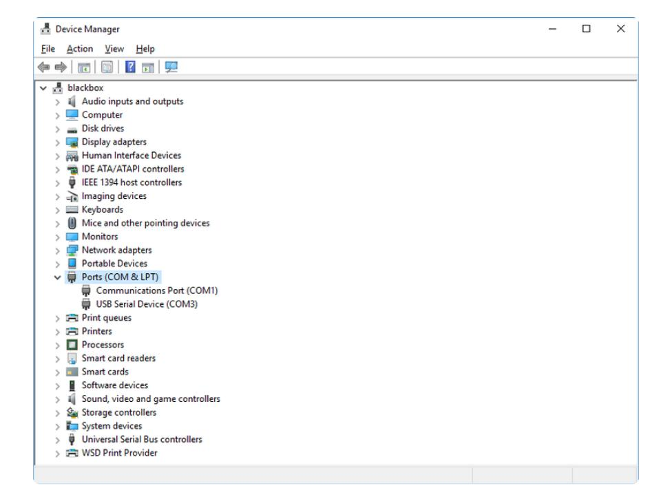

Sometimes the item will refer to the name of the board. Other times it may be called something like USB Serial Device, as seen in the image above. Either way, there is a new (COM#) following the name. This is the port your board is using.

## Windows Serial Port Terminal Programs

- Putty is a venerable serial port connection program. More details are below. •
- [Tera Term](https://teratermproject.github.io/index-en.html) (https://adafru.it/1afx) is a nice terminal program. It will reconnect automatically after disconnections •
- VSCode has a number of serial port extensions, such as [Serial Monitor](https://marketplace.visualstudio.com/items?itemName=ms-vscode.vscode-serial-monitor) (https:// adafru.it/1aAn). •
- PyCharm has a [Serial Port Monitor](https://plugins.jetbrains.com/plugin/8031-serial-port-monitor) (https://adafru.it/1aAo) plugin. •

## Install Putty

PuTTY is a well-known choice for connecting to serial ports on Windows.

The first thing to do is download the [latest version of PuTTY](https://www.chiark.greenend.org.uk/~sgtatham/putty/latest.html) (https://adafru.it/Bf1). You'll want to download the Windows installer file. It is most likely that you'll need the 64-bit version. Download the file and install the program on your machine. If you run into issues, you can try downloading the 32-bit version instead. However, the 64-bit version will work on most PCs.

©Adafruit Industries Page 74 of 252

Now you need to open PuTTY.

- Under Connection type: choose the button next to Serial. •
- In the box under Serial line, enter the serial port you found that your board is using. •
- In the box under Speed, enter 115200. This called the baud rate, which is the speed in bits per second that data is sent over the serial connection. For boards with built in USB it doesn't matter so much but for ESP8266 and other board with a separate chip, the speed required by the board is 115200 bits per second. So you might as well just use 115200! •

If you want to save those settings for later, use the options under Load, save or delete a stored session. Enter a name in the box under Saved Sessions, and click the Save button on the right.

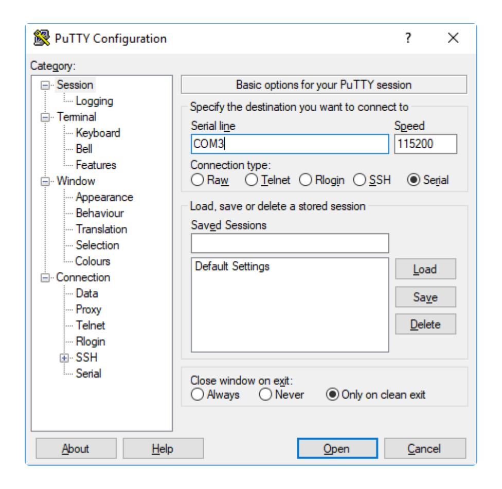

Once your settings are entered, you're ready to connect to the serial console. Click "Open" at the bottom of the window. A new window will open.

©Adafruit Industries Page 75 of 252

If no code is running, the window will either be blank or will look like the window above. Now you're ready to see the results of your code.

Great job! You've connected to the serial console!

# Windows 7 and 8.1

If you're using Windows 7 (or 8 or 8.1), you'll need to install drivers. See the [Windows 7](https://learn.adafruit.com/welcome-to-circuitpython/windows-7-and-8-1-drivers) [and 8.1 Drivers page](https://learn.adafruit.com/welcome-to-circuitpython/windows-7-and-8-1-drivers) (https://adafru.it/VuB) for details. You will not need to install drivers on Mac, Linux or Windows 10 or 11.

# <span id="page-75-0"></span>Advanced Serial Console on Mac

Connecting to the serial console on Mac does not require installing any drivers or extra software. You'll use a terminal program to find your board, and screen to connect to it. Terminal and screen both come installed by default.

## What's the Port?

First you'll want to find out which serial port your board is using. When you plug your board in to USB on your computer, it connects to a serial port. The port is like a door through which your board can communicate with your computer using USB.

The easiest way to determine which port the board is using is to first check without the board plugged in. Open Terminal and type the following:

```
ls /dev/tty.*
```

©Adafruit Industries Page 76 of 252

Each serial connection shows up in the /dev/ directory. It has a name that starts with tty. . The command ls shows you a list of items in a directory. You can use \* as a wildcard, to search for files that start with the same letters but end in something different. In this case, you're asking to see all of the listings in /dev/ that start with tty. and end in anything. This will show us the current serial connections.

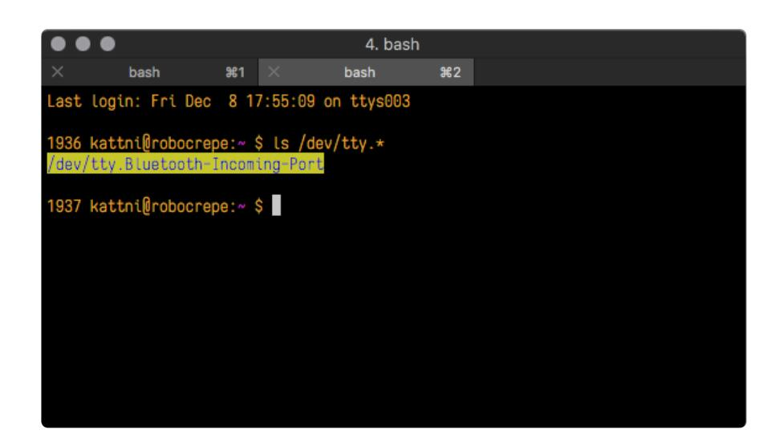

Now, plug your board. In Terminal, type:

### ls /dev/tty.\*

This will show you the current serial connections, which will now include your board.

A new listing has appeared called /dev/tty.usbmodem141441 .

The tty.usbmodem141441 part of this listing is the name the example board is using. Yours will be called something similar.

©Adafruit Industries Page 77 of 252


Using the screen terminal program can cause your CircuitPython program to hang when trying to print, if you exit screen after you've used it to connect.

## macOS Serial Port Terminal Programs

- screen is included with macOS. However, it's problematic because when it starts up, it enables the using DTR/RTS flow control signals and does not turn that off when it quits. This causes CircuitPython to block sending output when screen has exited, which will cause your program to stall until it is reconnected. See [this issue](https://github.com/adafruit/circuitpython/issues/10814) (https://adafru.it/1aAp) for a discussion. •
- [tio](https://github.com/tio/tio) (https://adafru.it/11xF) is a nice terminal program that works properly. You can install it with [Homebrew](https://brew.sh/) (https://adafru.it/wPC). •
- VSCode has a number of serial port extensions, such as [Serial Monitor](https://marketplace.visualstudio.com/items?itemName=ms-vscode.vscode-serial-monitor) (https:// adafru.it/1aAn). •
- PyCharm has a [Serial Port Monitor](https://plugins.jetbrains.com/plugin/8031-serial-port-monitor) (https://adafru.it/1aAo) plugin. •

## Connect with screen

Despite the caveats above, if you can't download a better terminal program, you can use screen . The screen command is included with MacOS. To connect to the serial console, use Terminal. Type the following command, replacing board\_name with the name you found your board is using:

screen /dev/tty.board\_name 115200

The first part of this establishes using the screen command. The second part tells screen the name of the board you're trying to use. The third part tells screen what baud rate to use for the serial connection. The baud rate is the speed in bits per second that data is sent over the serial connection. In this case, the speed required by the board is 115200 bits per second.

©Adafruit Industries Page 78 of 252

Press enter to run the command. It will open in the same window. If no code is running, the window will be blank. Otherwise, you'll see the output of your code.

Great job! You've connected to the serial console!

# <span id="page-78-0"></span>Advanced Serial Console on Linux

Connecting to the serial console on Linux does not require installing any drivers, but you may need to install screen using your package manager. You'll use a terminal program to find your board, and screen to connect to it. There are a variety of terminal programs such as gnome-terminal (called Terminal) or Konsole on KDE.

The tio program works as well to connect to your board, and has the benefit of automatically reconnecting. You would need to install it using your package manager.

## What's the Port?

First you'll want to find out which serial port your board is using. When you plug your board in to USB on your computer, it connects to a serial port. The port is like a door through which your board can communicate with your computer using USB.

The easiest way to determine which port the board is using is to first check without the board plugged in. Open your terminal program and type the following:

## ls /dev/ttyACM\*

Each serial connection shows up in the /dev/ directory. It has a name that starts with ttyACM. The command ls shows you a list of items in a directory. You can use \* as a wildcard, to search for files that start with the same letters but end in something

©Adafruit Industries Page 79 of 252

different. In this case, You're asking to see all of the listings in /dev/ that start with ttyACM and end in anything. This will show us the current serial connections.

In the example below, the error is indicating that are no current serial connections starting with ttyACM.

Now plug in your board. In your terminal program, type:

## ls /dev/ttyACM\*

This will show you the current serial connections, which will now include your board.

A new listing has appeared called /dev/ttyACM0. The ttyACM0 part of this listing is the name the example board is using. Yours will be called something similar.

## Linux Serial Port Terminal Programs

[tio](https://github.com/tio/tio) (https://adafru.it/11xF) is a nice terminal program that works properly. You can install it using your package manager. •

©Adafruit Industries Page 80 of 252

- VSCode has a number of serial port extensions, such as [Serial Monitor](https://marketplace.visualstudio.com/items?itemName=ms-vscode.vscode-serial-monitor) (https:// adafru.it/1aAn). •
- PyCharm has a [Serial Port Monitor](https://plugins.jetbrains.com/plugin/8031-serial-port-monitor) (https://adafru.it/1aAo) plugin. •

## Connect with tio

Now that you know the name your board is using, you're ready connect to the serial console. Install tio using your package manager..

ype the following command, replacing ttyACMx with the name you found your board is using:

```
tio /dev/ttyACMx
```

This will connect to the serial port and display a header like this:

```
$ tio /dev/ttyACM0
[11:07:00.578] tio v2.7
[11:07:00.578] Press ctrl-t q to quit
```

## Permissions on Linux

If you try to run tio and it doesn't work, then you may be running into an issue with permissions. Your Linux distribution may not allow access to serial ports by defaut. You may see something like this; note the "permission denied".

```
[11:13:42.754] tio v2.7
[11:13:42.754] Press ctrl-t q to quit
[11:13:42.754] Warning: Could not open tty device (Permission denied)
[11:13:42.754] Waiting for tty device..
```

then you may need to grant yourself access. There are generally two ways you can do this. The first is to just run screen using the sudo command, which temporarily gives you elevated privileges.

©Adafruit Industries Page 81 of 252

```
$ sudo tio /dev/ttyACM0
[sudo] password for smith:
```

Once you enter your password, you should be in:

The second way is to add yourself to the user group associated with the hardware. To figure out what that group is, use the command ls -l as shown below. The group name is circled in red.

Then use the command adduser to add yourself to that group. You need elevated privileges to do this, so you'll need to use sudo . In the example below, the group is adm and the user is ackbar.

On Debian-based distributions, such as,Ubuntu the group will be dialout, not adm.

After you add yourself to the group, you'll need to logout and log back in, or in some cases, reboot your machine. After you log in again, verify that you have been added to the group using the command groups . If you are still not in the group, reboot and check again.

©Adafruit Industries Page 82 of 252

And now you should be able to run screen without using sudo .

## And you're in:

# <span id="page-82-0"></span>Frequently Asked Questions

These are some of the common questions regarding CircuitPython and CircuitPython microcontrollers.

? What are some common acronyms to know?

CP or CPy = [CircuitPython](https://circuitpython.org) (https://adafru.it/KJD)

CPC = [Circuit Playground Classic](https://www.adafruit.com/product/3000) (http://adafru.it/3000) (does not run

CircuitPython)

CPX = [Circuit Playground Express](https://www.adafruit.com/product/3333) (http://adafru.it/3333)

CPB = [Circuit Playground Bluefruit](https://www.adafruit.com/product/4333) (http://adafru.it/4333)

©Adafruit Industries Page 83 of 252

## **Using Older Versions**

As CircuitPython development continues and there are new releases, Adafruit stop supporting older releases. Visit <a href="https://circuitpython.org/downloads">https://circuitpython.org/downloads</a> ownload the latest version of CircuitPython for your board. You must nload the CircuitPython Library Bundle that matches your version of uitPython. Please update CircuitPython and then visit <a href="https://">https://</a>

<u>circuitpython.org/libraries</u> to download the latest Library Bundle.

# I have to continue using CircuitPython 8.x or earlier. Where can I find compatible libraries?

We are no longer building or supporting the CircuitPython 8.x or earlier library bundles. We highly encourage you to update CircuitPython to the latest version (https://adafru.it/Em8) and use the current version of the libraries (https://adafru.it/ENC). However, if for some reason you cannot update, here are the last available library bundles for older versions:

- 2.x bundle (https://adafru.it/FJA)
- 3.x bundle (https://adafru.it/FJB)
- 4.x bundle (https://adafru.it/QDL)
- 5.x bundle (https://adafru.it/QDJ)
- 6.x bundle (https://adafru.it/Xmf)
- 7.x bundle (https://adafru.it/18e9)
- 8.x bundle (https://adafru.it/1af0)

## Python Arithmetic

Poes CircuitPython support floating-point numbers?

All CircuitPython boards support floating point arithmetic, even if the microcontroller chip does not support floating point in hardware. Floating point numbers are stored in 30 bits, with an 8-bit exponent and a 22-bit

© Adafruit Industries Page 84 of 252

mantissa. Note that this is two bits less than standard 32-bit singleprecision floats. You will get about 5-1/2 digits of decimal precision.

(The **broadcom** port may provide 64-bit floats in some cases.)

# ? Does CircuitPython support long integers, like regular Python?

Python long integers (integers of arbitrary size) are available on most builds, except those on boards with the smallest available firmware size. On these boards, integers are stored in 31 bits.

Boards without long integer support are mostly SAMD21 ("M0") boards without an external flash chip, such as the Adafruit Gemma M0, Trinket M0, QT Py M0, and the Trinkey series. There are also a number of thirdparty boards in this category. There are also a few small STM third-party boards without long integer support.

time.localtime() , time.mktime() , time.time() , and time.monotonic\_ns() are available only on builds with long integers.

## Wireless Connectivity

# ? How do I connect to the Internet with CircuitPython?

If you'd like to include WiFi in your project, your best bet is to use a board that is running natively on ESP32 chipsets - those have WiFi built in!

If your development board has an SPI port and at least 4 additional pins, you can check out [this guide](https://learn.adafruit.com/adafruit-io-basics-airlift) (https://adafru.it/F5X) on using AirLift with CircuitPython - extra wiring is required and some boards like the MacroPad or NeoTrellis do not have enough available pins to add the hardware support.

©Adafruit Industries Page 85 of 252

For further project examples, and guides about using AirLift with specific hardware, check out the Adafruit Learn System (https://adafru.it/VBr).

# Provided I do BLE (Bluetooth Low Energy) with CircuitPython?

nRF52840, nRF52833, and **as of CircuitPython 9.1.0**, ESP32, ESP32-C3, and ESP32-S3 boards (with 8MB) have the most complete BLE implementation. Your program can act as both a BLE central and peripheral. As a central, you can scan for advertisements, and connect to an advertising board. As a peripheral, you can advertise, and you can create services available to a central. Pairing and bonding are supported.

Most Espressif boards with only 4MB of flash do not have enough room to include BLE in CircuitPython 9. Check the Module Support Matrix (https://adafru.it/-Cy) to see if your board has support on \_bleio. CircuitPython 10 is planned to support \_bleio on Espressif boards with 4MB flash.

Note that the ESP32-S2 does not have Bluetooth capability.

On most other boards with adequate firmware space, BLE is available for use with AirLift (https://adafru.it/11Av) or other NINA-FW-based coprocessors. Some boards have this coprocessor on board, such as the PyPortal (https://adafru.it/11Aw). Currently, this implementation only supports acting as a BLE peripheral. Scanning and connecting as a central are not yet implemented. Bonding and pairing are not supported.

# ? Are there other ways to communicate by radio with CircuitPython?

Check out Adafruit's RFM boards (https://adafru.it/11Ay)for simple radio communication supported by CircuitPython, which can be used over distances of 100m to over a km, depending on the version. The RFM SAMD21 M0 boards can be used, but they were not designed for

© Adafruit Industries Page 86 of 252

CircuitPython, and have limited RAM and flash space; using the RFM breakouts or FeatherWings with more capable boards will be easier.

## Asyncio and Interrupts

Is there asyncio support in CircuitPython?

There is support for asyncio starting with CircuitPython 7.1.0, on all boards except the smallest SAMD21 builds. Read about using it in the Cooperative Multitasking in CircuitPython (https://adafru.it/XnA) Guide.

Poes CircuitPython support interrupts?

No. CircuitPython does not currently support interrupts - please use asyncio for multitasking / 'threaded' control of your code

## Status RGB LED

My RGB NeoPixel/DotStar LED is blinking funny colors - what does it mean?

The status LED can tell you what's going on with your CircuitPython board. Read more here for what the colors mean! (https://adafru.it/Den)

## Memory Issues


© Adafruit Industries Page 87 of 252

# What is a MemoryError?

Memory allocation errors happen when you're trying to store too much on the board. The CircuitPython microcontroller boards have a limited amount of memory available. You can have about 250 lines of code on the M0 Express boards. If you try to import too many libraries, a combination of large libraries, or run a program with too many lines of code, your code will fail to run and you will receive a MemoryError in the serial console.

# ? What do I do when I encounter a MemoryError?

Try resetting your board. Each time you reset the board, it reallocates the memory. While this is unlikely to resolve your issue, it's a simple step and is worth trying.

Make sure you are using **.mpy** versions of libraries. All of the CircuitPython libraries are available in the bundle in a **.mpy** format which takes up less memory than **.py** format. Be sure that you're using [the](https://github.com/adafruit/Adafruit_CircuitPython_Bundle/releases) [latest library bundle](https://github.com/adafruit/Adafruit_CircuitPython_Bundle/releases) (https://adafru.it/uap) for your version of CircuitPython.

If that does not resolve your issue, try shortening your code. Shorten comments, remove extraneous or unneeded code, or any other clean up you can do to shorten your code. If you're using a lot of functions, you could try moving those into a separate library, creating a **.mpy** of that library, and importing it into your code.

You can turn your entire file into a **.mpy** and import that into **code.py**. This means you will be unable to edit your code live on the board, but it can save you space.

?

©Adafruit Industries Page 88 of 252

# import statements affect memory? "> Can the order of my import statements affect memory?

It can because the memory gets fragmented differently depending on allocation order and the size of objects. Loading .mpy files uses less memory so its recommended to do that for files you aren't editing.

# Provide the second of the second of the second of the second of the second of the second of the second of the second of the second of the second of the second of the second of the second of the second of the second of the second of the second of the second of the second of the second of the second of the second of the second of the second of the second of the second of the second of the second of the second of the second of the second of the second of the second of the second of the second of the second of the second of the second of the second of the second of the second of the second of the second of the second of the second of the second of the second of the second of the second of the second of the second of the second of the second of the second of the second of the second of the second of the second of the second of the second of the second of the second of the second of the second of the second of the second of the second of the second of the second of the second of the second of the second of the second of the second of the second of the second of the second of the second of the second of the second of the second of the second of the second of the second of the second of the second of the second of the second of the second of the second of the second of the second of the second of the second of the second of the second of the second of the second of the second of the second of the second of the second of the second of the second of the second of the second of the second of the second of the second of the second of the second of the second of the second of the second of the second of the second of the second of the second of the second of the second of the second of the second of the second of the second of the second of the second of the second of the second of the second of the second of the second of the second of the second of the second of the second of the second of the second of the second of the second of the second of the second of the second of the second of the second of the second of the s

You can make your own .mpy versions of files with mpy-cross.

You can download **mpy-cross** for your operating system from here (https://adafru.it/QDK). Builds are available for Windows, macOS, x64 Linux, and Raspberry Pi Linux. Choose the latest **mpy-cross** whose version matches the version of CircuitPython you are using.

On macOS and Linux, after you download **mpy-cross**, you must make the the file executable by doing **chmod** +x name-of-the-mpy-cross-executable.

To make a .mpy file, run ./mpy-cross path/to/yourfile.py to create a yourfile.mpy in the same directory as the original file.

# Place How do I check how much memory I have free?

Run the following to see the number of bytes available for use:

```
import gc
gc.mem free()
```

© Adafruit Industries Page 89 of 252

## Unsupported Hardware

# ? Is ESP8266 or ESP32 supported in CircuitPython? Why not?

We dropped ESP8266 support as of 4.x - For more information please read about it [here](https://learn.adafruit.com/welcome-to-circuitpython/circuitpython-for-esp8266) (https://adafru.it/CiG)!

[As of CircuitPython 8.x we have started to support ESP32 and ESP32-C3](https://learn.adafruit.com/circuitpython-with-esp32-quick-start) [and have added a WiFi workflow for wireless coding!](https://learn.adafruit.com/circuitpython-with-esp32-quick-start) (https://adafru.it/ 10JF)

We also support ESP32-S2 & ESP32-S3, which have native USB.

? Does Feather M0 support WINC1500?

No, WINC1500 will not fit into the M0 flash space.

? Can AVRs such as ATmega328 or ATmega2560 run CircuitPython?

No.

# <span id="page-89-0"></span>Troubleshooting

From time to time, you will run into issues when working with CircuitPython. Here are a few things you may encounter and how to resolve them.

©Adafruit Industries Page 90 of 252

As CircuitPython development continues and there are new releases, Adafruit will stop supporting older releases. Visit <https://circuitpython.org/downloads> to download the latest version of CircuitPython for your board. You must download the CircuitPython Library Bundle that matches your version of CircuitPython. Please update CircuitPython and then visit [https://](https://circuitpython.org/libraries)

[circuitpython.org/libraries](https://circuitpython.org/libraries) to download the latest Library Bundle.

# Always Run the Latest Version of CircuitPython and Libraries

As CircuitPython development continues and there are new releases, Adafruit will stop supporting older releases. You need to [update to the latest](https://circuitpython.org/downloads) [CircuitPython.](https://circuitpython.org/downloads) (https://adafru.it/Em8).

You need to download the CircuitPython Library Bundle that matches your version of CircuitPython. Please update CircuitPython and then [download the latest](https://circuitpython.org/libraries) [bundle](https://circuitpython.org/libraries) (https://adafru.it/ENC).

As new versions of CircuitPython are released, Adafruit will stop providing the previous bundles as automatically created downloads on the Adafruit CircuitPython Library Bundle repo. If you must continue to use an earlier version, you can still download the appropriate version of mpy-cross from the particular release of CircuitPython on the CircuitPython repo and create your own compatible .mpy library files. However, it is best to update to the latest for both CircuitPython and the library bundle.

## I have to continue using CircuitPython 7.x or earlier. Where can I find compatible libraries?

Adafruit is no longer building or supporting the CircuitPython 7.x or earlier library bundles. You are highly encourged to [update CircuitPython to the latest version](https://circuitpython.org/downloads) (http s://adafru.it/Em8) and use [the current version of the libraries](https://circuitpython.org/libraries) (https://adafru.it/ENC). However, if for some reason you cannot update, links to the previous bundles are available in the [FAQ](https://learn.adafruit.com/welcome-to-circuitpython/frequently-asked-questions#faq-3105289) (https://adafru.it/FwY).

©Adafruit Industries Page 91 of 252

# macOS Sonoma before 14.4: Errors Writing to CIRCUITPY macOS 14.4 - 15.1: Slow Writes to CIRCUITPY

macOS Sonoma before 14.4 took many seconds to complete writes to small FAT drives, 8MB or smaller. This causes errors when writing to CIRCUITPY. The best solution was to remount the CIRCUITPY drive after it is automatically mounted. Or consider downgrading back to Ventura if that works for you. This problem was tracked in CircuitPython GitHub issue 8449 (https://adafru.it/18ea).

Below is a shell script to do this remount conveniently (courtesy @czei in GitHub (https://adafru.it/18ea)). Copy the code here into a file named, say, remount-CIRCUITPY.sh. Place the file in a directory on your PATH, or in some other convenient place.

macOS Sonoma 14.4 and versions of macOS before Sequoia 15.2 did not have the problem above, but did take an inordinately long time to write to FAT drives of size 1GB or less (40 times longer than 2GB drives). As of macOS 15.2, writes are no longer very slow. This problem was tracked in <u>CircuitPython GitHub issue 8918</u> (https://adafru.it/19iD).

```
#!/bin/sh
#
# This works around bug where, by default,
# macOS 14.x before 14.4 writes part of a file immediately,
# and then doesn't update the directory for 20-60 seconds, causing
# the file system to be corrupted.
#

disky=`df | grep CIRCUITPY | cut -d" " -f1`
sudo umount /Volumes/CIRCUITPY
sudo mkdir /Volumes/CIRCUITPY
sleep 2
sudo mount -v -o noasync -t msdos $disky /Volumes/CIRCUITPY
```

Then in a Terminal window, do this to make this script executable:

```
chmod +x remount-CIRCUITPY.sh
```

Place the file in a directory on your PATH, or in some other convenient place.

Now, each time you plug in or reset your CIRCUITPY board, run the file **remount- CIRCUITPY.sh**. You can run it in a Terminal window or you may be able to place it on the desktop or in your dock to run it just by double-clicking.

© Adafruit Industries Page 92 of 252

This will be something of a nuisance but it is the safest solution.

This problem is being tracked in this CircuitPython issue (https://adafru.it/18ea).

# Bootloader (boardnameBOOT) Drive Not Present

You may have a different board.

Only Adafruit Express boards and the SAMD21 non-Express boards ship with the <u>UF2 bootloader</u> (https://adafru.it/zbX)installed. The Feather M0 Basic, Feather M0 Adalogger, and similar boards use a regular Arduino-compatible bootloader, which does not show a **boardnameBOOT** drive.

### MakeCode

If you are running a <u>MakeCode</u> (https://adafru.it/zbY) program on Circuit Playground Express, press the reset button just once to get the **CPLAYBOOT** drive to show up. Pressing it twice will not work.

### macOS

**DriveDx** and its accompanything **SAT SMART Driver** can interfere with seeing the BOOT drive. See this forum post (https://adafru.it/sTc) for how to fix the problem.

### Windows 10 or later

Did you install the Adafruit Windows Drivers package by mistake, or did you upgrade to Windows 10 or later with the driver package installed? You don't need to install this package on Windows 10 or 11for most Adafruit boards. The old version (v1.5) can interfere with recognizing your device. Go to **Settings** -> **Apps** and uninstall all the "Adafruit" driver programs.

### Windows 7 or 81

Windows 7 and 8.1 have reached end of life. It is <u>recommended</u> (https://adafru.it/Amd) that you upgrade to Windows 10 or 11 if possible. Drivers are available for some older CircuitPython boards, but there are no plans to release drivers for newer boards.


Windows Drivers installer was last updated in November 2020 (v2.5.0.0). dows 7 drivers for CircuitPython boards released since then, including 040 boards, are not available. There are no plans to release drivers for er boards. The boards work fine on Windows 10 and later.

© Adafruit Industries Page 93 of 252

You should now be done! Test by unplugging and replugging the board. You should see the CIRCUITPY drive, and when you double-click the reset button (single click on Circuit Playground Express running MakeCode), you should see the appropriate boardnameBOOT drive.

Let us know in the [Adafruit support forums](https://forums.adafruit.com) (https://adafru.it/jIf) or on the [Adafruit](https://adafru.it/discord) [Discord](https://adafru.it/discord) () if this does not work for you!

# Windows Explorer Locks Up When Accessing boardnameBOOT Drive

On Windows, several third-party programs that can cause issues. The symptom is that you try to access the boardnameBOOT drive, and Windows or Windows Explorer seems to lock up. These programs are known to cause trouble:

- AIDA64: to fix, stop the program. This problem has been reported to AIDA64. They acquired hardware to test, and released a beta version that fixes the problem. This may have been incorporated into the latest release. Please let us know in the forums if you test this. •
- BitDefender anti-virus •
- Hard Disk Sentinel •
- Kaspersky anti-virus: To fix, you may need to disable Kaspersky completely. Disabling some aspects of Kaspersky does not always solve the problem. This problem has been reported to Kaspersky. •
- ESET NOD32 anti-virus: There have been problems with at least version 9.0.386.0, solved by uninstallation. •

# Copying UF2 to boardnameBOOT Drive Hangs at 0% Copied

On Windows, a Western DIgital (WD) utility that comes with their external USB drives can interfere with copying UF2 files to the boardnameBOOT drive. Uninstall that utility to fix the problem.

# CIRCUITPY Drive Does Not Appear or Disappears Quickly

BitDefender anti-virus has been reported to block access to CIRCUITPY. You can set an exception for the drive letter.

©Adafruit Industries Page 94 of 252

Kaspersky anti-virus can block the appearance of the CIRCUITPY drive. There has not yet been settings change discovered that prevents this. Complete uninstallation of Kaspersky fixes the problem.

Norton anti-virus can interfere with CIRCUITPY. A user has reported this problem on Windows 7. The user turned off both Smart Firewall and Auto Protect, and CIRCUITPY then appeared.

Sophos Endpoint security software [can cause CIRCUITPY to disappear](https://forums.adafruit.com/viewtopic.php?f=60&t=187629) (https:// adafru.it/ELr) and the BOOT drive to reappear. It is not clear what causes this behavior.

Samsung Magician can cause CIRCUITPY to disappear (reported [here](https://forums.adafruit.com/viewtopic.php?t=205159) (https:// adafru.it/18eb) and [here](https://forums.adafruit.com/viewtopic.php?p=987596#p987596) (https://adafru.it/18ec)).

## "M105" Seen on Display, Crashes, Missing CIRCUITPY

The Cura 3D printing program sends 3D printing GCODE commands to unused serial ports to try to find 3D printers connected over serial. This causes a variety of problems. Disable (uncheck) USB Printing in Cura in the Market -> Installed menu, or uninstall Cura. For more information see [this forum post](https://forums.adafruit.com/viewtopic.php?t=192784) (https://adafru.it/1aqT), [this](https://github.com/adafruit/circuitpython/issues/2585) [CircuitPython issue](https://github.com/adafruit/circuitpython/issues/2585) (https://adafru.it/1aqU), and [this Cura issue](https://github.com/Ultimaker/Cura/issues/5207) (https://adafru.it/1aqV).

# Device Errors or Problems on Windows

Windows can become confused about USB device installations. Try cleaning up your USB devices. Use [Uwe Sieber's Device Cleanup Tool](https://www.uwe-sieber.de/misc_tools_e.html) (https://adafru.it/RWd) (on that page, scroll down to "Device Cleanup Tool"). Download and unzip the tool. Unplug all the boards and other USB devices you want to clean up. Run the tool as Administrator. You will see a listing like this, probably with many more devices. It is listing all the USB devices that are not currently attached.

©Adafruit Industries Page 95 of 252

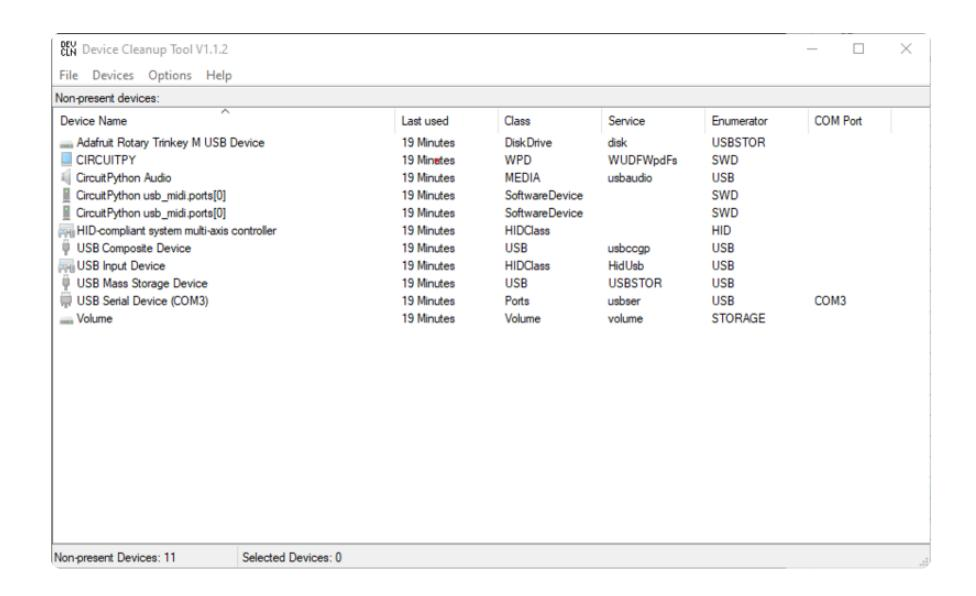

Select all the devices you want to remove, and then press Delete. It is usually safe just to select everything. Any device that is removed will get a fresh install when you plug it in. Using the Device Cleanup Tool also discards all the COM port assignments for the unplugged boards. If you have used many Arduino and CircuitPython boards, you have probably seen higher and higher COM port numbers used, seemingly without end. This will fix that problem.

# Serial Console in Mu Not Displaying Anything

There are times when the serial console will accurately not display anything, such as, when no code is currently running, or when code with no serial output is already running before you open the console. However, if you find yourself in a situation where you feel it should be displaying something like an error, consider the following.

Depending on the size of your screen or Mu window, when you open the serial console, the serial console panel may be very small. This can be a problem. A basic CircuitPython error takes 10 lines to display!

```
Auto-reload is on. Simply save files over USB to run them or enter REPL to disable.
code.py output:
Traceback (most recent call last):
 File "code.py", line 7
SyntaxError: invalid syntax
Press any key to enter the REPL. Use CTRL-D to reload.
```

©Adafruit Industries Page 96 of 252

More complex errors take even more lines!

Therefore, if your serial console panel is five lines tall or less, you may only see blank lines or blank lines followed by Press any key to enter the REPL. Use CTRL-D to reload. . If this is the case, you need to either mouse over the top of the panel to utilise the option to resize the serial panel, or use the scrollbar on the right side to scroll up and find your message.

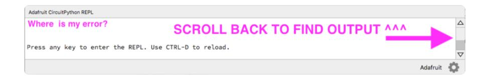

This applies to any kind of serial output whether it be error messages or print statements. So before you start trying to debug your problem on the hardware side, be sure to check that you haven't simply missed the serial messages due to serial output panel height.

# code.py Restarts Constantly

CircuitPython will restart code.py if you or your computer writes to something on the CIRCUITPY drive. This feature is called auto-reload, and lets you test a change to your program immediately.

Some utility programs, such as backup, anti-virus, or disk-checking apps, will write to the CIRCUITPY as part of their operation. Sometimes they do this very frequently, causing constant restarts.

Acronis True Image and related Acronis programs on Windows are known to cause this problem. It is possible to prevent this by [disabling the "](https://forum.acronis.com/forum/acronis-true-image-2018-forum/acronis-ati-2018-contantly-touch-usb-port-causing-issue-adafruit-circuitpython-folder) (https://adafru.it/ XDZ)[Acronis Managed Machine Service Mini"](https://forum.acronis.com/forum/acronis-true-image-2018-forum/acronis-ati-2018-contantly-touch-usb-port-causing-issue-adafruit-circuitpython-folder) (https://adafru.it/XDZ).

If you cannot stop whatever is causing the writes, you can disable auto-reload by putting this code in boot.py or code.py:

```
import supervisor
supervisor.runtime.autoreload = False
```

©Adafruit Industries Page 97 of 252

# CircuitPython RGB Status Light

Nearly all CircuitPython-capable boards have a single NeoPixel or DotStar RGB LED on the board that indicates the status of CircuitPython. A few boards designed before CircuitPython existed, such as the Feather M0 Basic, do not.

Circuit Playground Express and Circuit Playground Bluefruit have multiple RGB LEDs, but do NOT have a status LED. The LEDs are all green when in the bootloader. In versions before 7.0.0, they do NOT indicate any status while running CircuitPython.

## CircuitPython 7.0.0 and Later

The status LED blinks were changed in CircuitPython 7.0.0 in order to save battery power and simplify the blinks. These blink patterns will occur on single color LEDs when the board does not have any RGB LEDs. Speed and blink count also vary for this reason.

On start up, the LED will blink YELLOW multiple times for 1 second. Pressing the RESET button (or on Espressif, the BOOT button) during this time will restart the board and then enter safe mode. On Bluetooth capable boards, after the yellow blinks, there will be a set of faster blue blinks. Pressing reset during the BLUE blinks will clear Bluetooth information and start the device in discoverable mode, so it can be used with a BLE code editor.

Once started, CircuitPython will blink a pattern every 5 seconds when no user code is running to indicate why the code stopped:

- 1 GREEN blink: Code finished without error. •
- 2 RED blinks: Code ended due to an exception. Check the serial console for details. •
- 3 YELLOW blinks: CircuitPython is in safe mode. No user code was run. Check the serial console for safe mode reason. •

When in the REPL, CircuitPython will set the status LED to WHITE. You can change the LED color from the REPL. The status indicator will not persist on non-NeoPixel or DotStar LEDs.

©Adafruit Industries Page 98 of 252

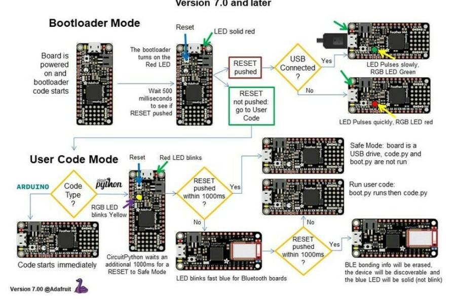

## CircuitPython 6.3.0 and earlier

Here's what the colors and blinking mean:

- steady GREEN: code.py (or code.txt, main.py, or main.txt) is running •
- pulsing GREEN: code.py (etc.) has finished or does not exist •
- steady YELLOW at start up: (4.0.0-alpha.5 and newer) CircuitPython is waiting for a reset to indicate that it should start in safe mode •
- pulsing YELLOW: Circuit Python is in safe mode: it crashed and restarted •
- steady WHITE: REPL is running •
- steady BLUE: boot.py is running •

Colors with multiple flashes following indicate a Python exception and then indicate the line number of the error. The color of the first flash indicates the type of error:

GREEN: IndentationError •

CYAN: SyntaxError WHITE: NameError ORANGE: OSError PURPLE: ValueError YELLOW: other error • • • • •

These are followed by flashes indicating the line number, including place value. WHITE flashes are thousands' place, BLUE are hundreds' place, YELLOW are tens' place, and CYAN are one's place. So for example, an error on line 32 would flash

©Adafruit Industries Page 99 of 252

YELLOW three times and then CYAN two times. Zeroes are indicated by an extra-long dark gap.

# Serial console showing ValueError: Incompatible .mpy file

This error occurs when importing a module that is stored as a .mpy binary file that was generated by a different version of CircuitPython than the one its being loaded into. In particular, the mpy binary format changed between CircuitPython versions 6.x and 7.x, 2.x and 3.x, and 1.x and 2.x.

So, for instance, if you upgraded to CircuitPython 7.x from 6.x you'll need to download a newer version of the library that triggered the error on import . All libraries are available in the [Adafruit bundle](https://github.com/adafruit/Adafruit_CircuitPython_Bundle/releases/latest) (https://adafru.it/y8E).

# CIRCUITPY Drive Issues

You may find that you can no longer save files to your CIRCUITPY drive. You may find that your CIRCUITPY stops showing up in your file explorer, or shows up as NO\_NAME. These are indicators that your filesystem has issues. When the CIRCUITPY disk is not safely ejected before being reset by the button or being disconnected from USB, it may corrupt the flash drive. It can happen on Windows, Mac or Linux, though it is more common on Windows.

©Adafruit Industries Page 100 of 252

Be aware, if you have used Arduino to program your board, CircuitPython is no longer able to provide the USB services. You will need to reload CircuitPython to resolve this situation.

The easiest first step is to reload CircuitPython. Double-tap reset on the board so you get a boardnameBOOT drive rather than a CIRCUITPY drive, and copy the latest version of CircuitPython (.uf2) back to the board. This may restore CIRCUITPY functionality.

If reloading CircuitPython does not resolve your issue, the next step is to try putting the board into safe mode.

## Safe Mode

Whether you've run into a situation where you can no longer edit your code.py on your CIRCUITPY drive, your board has gotten into a state where CIRCUITPY is readonly, or you have turned off the CIRCUITPY drive altogether, safe mode can help.

Safe mode in CircuitPython does not run any user code on startup, and disables autoreload. This means a few things. First, safe mode bypasses any code in boot.py (where you can set CIRCUITPY read-only or turn it off completely). Second, it does not run the code in code.py. And finally, it does not automatically soft-reload when data is written to the CIRCUITPY drive.

Therefore, whatever you may have done to put your board in a non-interactive state, safe mode gives you the opportunity to correct it without losing all of the data on the CIRCUITPY drive.

## Entering Safe Mode in CircuitPython 7.x and Later

You can enter safe by pressing reset during the right time when the board boots. Immediately after the board starts up or resets, it waits one second. On some boards, the onboard status LED will blink yellow during that time. If you press reset during that one second period, the board will start up in safe mode. It can be difficult to react to the yellow LED, so you may want to think of it simply as a "slow" double click of the reset button. (Remember, a fast double click of reset enters the bootloader.)

## Entering Safe Mode in CircuitPython 6.x

You can enter safe by pressing reset during the right time when the board boots.. Immediately after the board starts up or resets, it waits 0.7 seconds. On some boards, the onboard status LED (highlighted in green above) will turn solid yellow during this

©Adafruit Industries Page 101 of 252

time. If you press reset during that 0.7 seconds, the board will start up in safe mode. It can be difficult to react to the yellow LED, so you may want to think of it simply as a slow double click of the reset button. (Remember, a fast double click of reset enters the bootloader.)

## In Safe Mode

Once you've entered safe mode successfully in CircuitPython 6.x, the LED will pulse yellow.

If you successfully enter safe mode on CircuitPython 7.x, the LED will intermittently blink yellow three times.

If you connect to the serial console, you'll find the following message.

Auto-reload is off. Running in safe mode! Not running saved code.

CircuitPython is in safe mode because you pressed the reset button during boot. Press again to exit safe mode.

Press any key to enter the REPL. Use CTRL-D to reload.

You can now edit the contents of the CIRCUITPY drive. Remember, your code will not run until you press the reset button, or unplug and plug in your board, to get out of safe mode.

At this point, you'll want to remove any user code in code.py and, if present, the boot.py file from CIRCUITPY. Once removed, tap the reset button, or unplug and plug in your board, to restart CircuitPython. This will restart the board and may resolve your drive issues. If resolved, you can begin coding again as usual.

If safe mode does not resolve your issue, the board must be completely erased and CircuitPython must be reloaded onto the board.


You WILL lose everything on the board when you complete the following steps. If possible, make a copy of your code before continuing.

©Adafruit Industries Page 102 of 252

## To erase CIRCUITPY: storage.erase\_filesystem()

CircuitPython includes a built-in function to erase and reformat the filesystem. If you have a version of CircuitPython older than 2.3.0 on your board, you can [update to the](file:welcome-to-circuitpython/installing-circuitpython) [newest version](file:welcome-to-circuitpython/installing-circuitpython) (https://adafru.it/Amd) to do this.

- [Connect to the CircuitPython REPL](file:welcome-to-circuitpython/kattni-connecting-to-the-serial-console) (https://adafru.it/Bec) using Mu or a terminal program. 1.
- Type the following into the REPL: 2.

```
>>> import storage
>>> storage.erase_filesystem()
```

CIRCUITPY will be erased and reformatted, and your board will restart. That's it!

## Erase CIRCUITPY Without Access to the REPL

If you can't access the REPL, or you're running a version of CircuitPython previous to 2.3.0 and you don't want to upgrade, there are options available for some specific boards.

The options listed below are considered to be the "old way" of erasing your board. The method shown above using the REPL is highly recommended as the best method for erasing your board.


If at all possible, it is recommended to use the REPL to erase your CIRCUITPY drive. The REPL method is explained above.

## For the specific boards listed below:

If the board you are trying to erase is listed below, follow the steps to use the file to erase your board.

1. Download the correct erase file:

https://adafru.it/AdI

©Adafruit Industries Page 103 of 252

https://adafru.it/AdJ https://adafru.it/EVK https://adafru.it/AdK https://adafru.it/EoM https://adafru.it/DjD https://adafru.it/DBA https://adafru.it/Eca https://adafru.it/Gnc https://adafru.it/GAN https://adafru.it/GAO https://adafru.it/Jat

©Adafruit Industries Page 104 of 252

https://adafru.it/Q5B

## https://adafru.it/18ed

- 2. Double-click the reset button on the board to bring up the boardnameBOOT drive.
- 3. Drag the erase .uf2 file to the boardnameBOOT drive.
- 4. The status LED will turn yellow or blue, indicating the erase has started.
- 5. After approximately 15 seconds, the status LED will light up green. On the NeoTrellis M4 this is the first NeoPixel on the grid
- 6. Double-click the reset button on the board to bring up the boardnameBOOT drive.
- 7.  [Drag the appropriate latest release of CircuitPython](https://circuitpython.org/downloads) (https://adafru.it/Em8) .uf2 file to the boardnameBOOT drive.

It should reboot automatically and you should see CIRCUITPY in your file explorer again.

If the LED flashes red during step 5, it means the erase has failed. Repeat the steps starting with 2.

[If you haven't already downloaded the latest release of CircuitPython for your board,](file:welcome-to-circuitpython/installing-circuitpython) [check out the installation page](file:welcome-to-circuitpython/installing-circuitpython) (https://adafru.it/Amd). You'll also need to load your code and reinstall your libraries!

## For SAMD21 non-Express boards that have a UF2 bootloader:

Any SAMD21-based microcontroller that does not have external flash available is considered a SAMD21 non-Express board. Non-Express boards that have a UF2 bootloader include Trinket M0, GEMMA M0, QT Py M0, and the SAMD21-based Trinkey boards.

If you are trying to erase a SAMD21 non-Express board, follow these steps to erase your board.

1. Download the erase file:

https://adafru.it/VB-

©Adafruit Industries Page 105 of 252

- 2. Double-click the reset button on the board to bring up the boardnameBOOT drive.
- 3. Drag the erase .uf2 file to the boardnameBOOT drive.
- 4. The boot LED will start flashing again, and the boardnameBOOT drive will reappear.
- 5. [Drag the appropriate latest release CircuitPython](https://circuitpython.org/downloads) (https://adafru.it/Em8) .uf2 file to the boardnameBOOT drive.

It should reboot automatically and you should see CIRCUITPY in your file explorer again.

[If you haven't already downloaded the latest release of CircuitPython for your board,](file:welcome-to-circuitpython/installing-circuitpython) [check out the installation page](file:welcome-to-circuitpython/installing-circuitpython) (https://adafru.it/Amd) YYou'll also need to load your code and reinstall your libraries!

## For SAMD21 non-Express boards that do not have a UF2 bootloader:

Any SAMD21-based microcontroller that does not have external flash available is considered a SAMD21 non-Express board. Non-Express boards that do not have a UF2 bootloader include the Feather M0 Basic Proto, Feather Adalogger, or the Arduino Zero.

If you are trying to erase a non-Express board that does not have a UF2 bootloader, [follow these directions to reload CircuitPython using](file:welcome-to-circuitpython/non-uf2-installation) [bossac](file:welcome-to-circuitpython/non-uf2-installation) (https://adafru.it/Bed), which will erase and re-create CIRCUITPY.

# Running Out of File Space on SAMD21 Non-Express Boards

Any SAMD21-based microcontroller that does not have external flash available is considered a SAMD21 non-Express board. This includes boards like the Trinket M0, GEMMA M0, QT Py M0, and the SAMD21-based Trinkey boards.

The file system on the board is very tiny. (Smaller than an ancient floppy disk.) So, its likely you'll run out of space but don't panic! There are a number of ways to free up space.

©Adafruit Industries Page 106 of 252

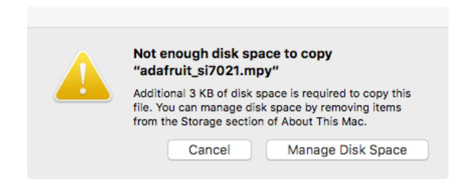

## Delete something!

The simplest way of freeing up space is to delete files from the drive. Perhaps there are libraries in the lib folder that you aren't using anymore or test code that isn't in use. Don't delete the lib folder completely, though, just remove what you don't need.

The board ships with the Windows 7 serial driver too! Feel free to delete that if you don't need it or have already installed it. It's ~12KiB or so.

## Use tabs

One unique feature of Python is that the indentation of code matters. Usually the recommendation is to indent code with four spaces for every indent. In general, that is recommended too. However, one trick to storing more human-readable code is to use a single tab character for indentation. This approach uses 1/4 of the space for indentation and can be significant when you're counting bytes.

## On macOS?

MacOS loves to generate hidden files. Luckily you can disable some of the extra hidden files that macOS adds by running a few commands to disable search indexing and create zero byte placeholders. Follow the steps below to maximize the amount of space available on macOS.

## Prevent & Remove macOS Hidden Files

First find the volume name for your board. With the board plugged in run this command in a terminal to list all the volumes:

ls -l /Volumes

©Adafruit Industries Page 107 of 252

Look for a volume with a name like CIRCUITPY (the default for CircuitPython). The full path to the volume is the /Volumes/CIRCUITPY path.

Now follow the [steps from this question](http://apple.stackexchange.com/questions/6707/how-to-stop-os-x-from-writing-spotlight-and-trash-files-to-memory-cards-and-usb/7135#7135) (https://adafru.it/u1c) to run these terminal commands that stop hidden files from being created on the board:

```
mdutil -i off /Volumes/CIRCUITPY
cd /Volumes/CIRCUITPY
rm -rf .{,_.}{fseventsd,Spotlight-V*,Trashes}
mkdir .fseventsd
touch .fseventsd/no_log .metadata_never_index .Trashes
cd -
```

Replace /Volumes/CIRCUITPY in the commands above with the full path to your board's volume if it's different. At this point all the hidden files should be cleared from the board and some hidden files will be prevented from being created.

Alternatively, with CircuitPython 4.x and above, the special files and folders mentioned above will be created automatically if you erase and reformat the filesystem. WARNING: Save your files first! Do this in the REPL:

```
>>> import storage
>>> storage.erase_filesystem()
```

However there are still some cases where hidden files will be created by MacOS. In particular if you copy a file that was downloaded from the internet it will have special metadata that MacOS stores as a hidden file. Luckily you can run a copy command from the terminal to copy files without this hidden metadata file. See the steps below.

## Copy Files on macOS Without Creating Hidden Files

Once you've disabled and removed hidden files with the above commands on macOS you need to be careful to copy files to the board with a special command that prevents future hidden files from being created. Unfortunately you cannot use drag and drop copy in Finder because it will still create these hidden extended attribute files in some cases (for files downloaded from the internet, like Adafruit's modules).

To copy a file or folder use the -X option for the cp command in a terminal. For example to copy a file\_name.mpy file to the board use a command like:

```
cp -X file_name.mpy /Volumes/CIRCUITPY
```

(Replace file\_name.mpy with the name of the file you want to copy.)

©Adafruit Industries Page 108 of 252

Or to copy a folder and all of the files and folders contained within, use a command like:

```
cp -rX folder_to_copy /Volumes/CIRCUITPY
```

If you are copying to the lib folder, or another folder, make sure it exists before copying.

```
# if lib does not exist, you'll create a file named lib !
cp -X file_name.mpy /Volumes/CIRCUITPY/lib
# This is safer, and will complain if a lib folder does not exist.
cp -X file_name.mpy /Volumes/CIRCUITPY/lib/
```

## Other macOS Space-Saving Tips

If you'd like to see the amount of space used on the drive and manually delete hidden files here's how to do so. First, move into the Volumes/ directory with cd /Volumes/ , and then list the amount of space used on the CIRCUITPY drive with the df command.

That's not very much space left! The next step is to show a list of the files currently on the CIRCUITPY drive, including the hidden files, using the ls command. You cannot use Finder to do this, you must do it via command line!

There are a few of the hidden files that MacOS loves to generate, all of which begin with a .\_ before the file name. Remove the .\_ files using the rm command. You can

©Adafruit Industries Page 109 of 252

remove them all once by running rm CIRCUITPY/.\_\* . The \* acts as a wildcard to apply the command to everything that begins with .\_ at the same time.

Finally, you can run df again to see the current space used.

Nice! You have 12Ki more than before! This space can now be used for libraries and code!

# Device Locked Up or Boot Looping

In rare cases, it may happen that something in your code.py or boot.py files causes the device to get locked up, or even go into a boot loop. A boot loop occurs when the board reboots repeatedly and never fully loads. These are not caused by your everyday Python exceptions, typically it's the result of a deeper problem within CircuitPython. In this situation, it can be difficult to recover your device if CIRCUITPY is not allowing you to modify the code.py or boot.py files. Safe mode is one recovery option. When the device boots up in safe mode it will not run the code.py or boot.py scripts, but will still connect the CIRCUITPY drive so that you can remove or modify those files as needed.

For more information on safe mode and how to enter safe mode, see the [Safe Mode](https://learn.adafruit.com/welcome-to-circuitpython/troubleshooting#safe-mode-3105351) [section on this page](https://learn.adafruit.com/welcome-to-circuitpython/troubleshooting#safe-mode-3105351) (https://adafru.it/Den).

©Adafruit Industries Page 110 of 252

# <span id="page-110-0"></span>Welcome to the Community!

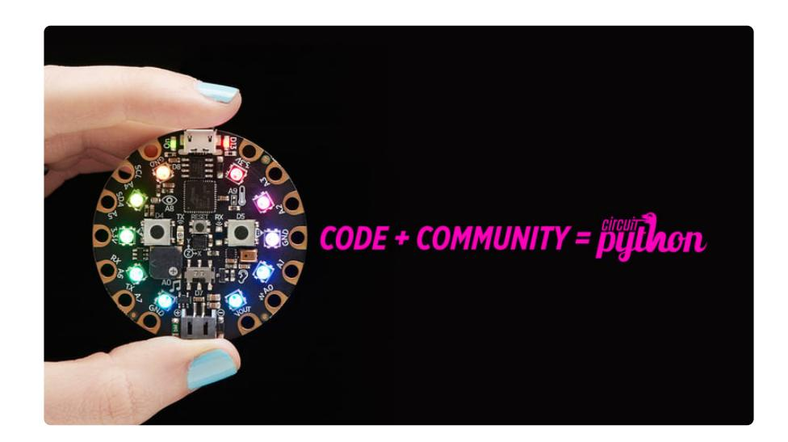

CircuitPython is a programming language that's super simple to get started with and great for learning. It runs on microcontrollers and works out of the box. You can plug it in and get started with any text editor. The best part? CircuitPython comes with an amazing, supportive community.

Everyone is welcome! CircuitPython is Open Source. This means it's available for anyone to use, edit, copy and improve upon. This also means CircuitPython becomes better because of you being a part of it. Whether this is your first microcontroller board or you're a seasoned software engineer, you have something important to offer the Adafruit CircuitPython community. This page highlights some of the many ways you can be a part of it!

©Adafruit Industries Page 111 of 252

## Adafruit Discord

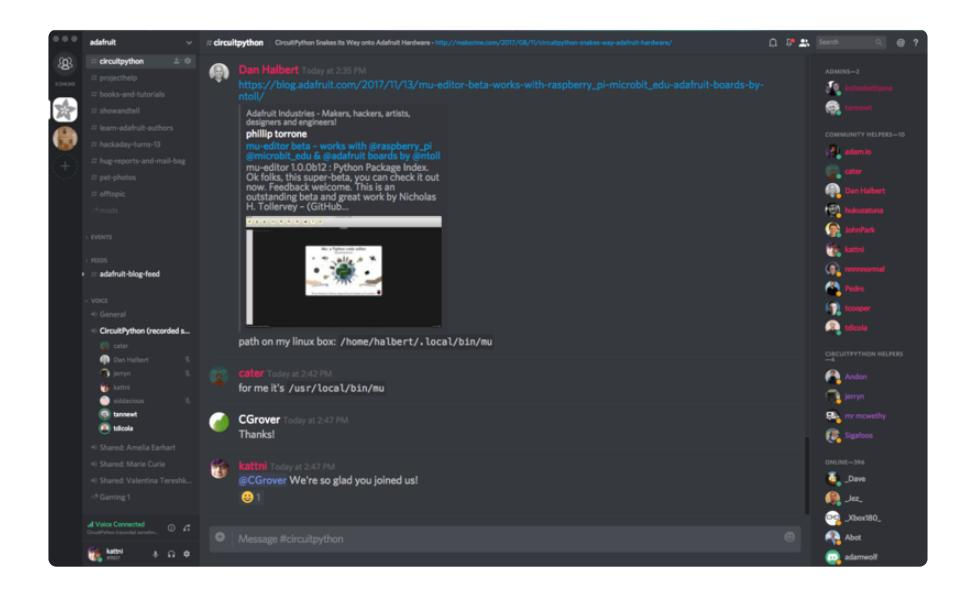

The Adafruit Discord server is the best place to start. Discord is where the community comes together to volunteer and provide live support of all kinds. From general discussion to detailed problem solving, and everything in between, Discord is a digital maker space with makers from around the world.

There are many different channels so you can choose the one best suited to your needs. Each channel is shown on Discord as "#channelname". There's the #help-withprojects channel for assistance with your current project or help coming up with ideas for your next one. There's the #show-and-tell channel for showing off your newest creation. Don't be afraid to ask a question in any channel! If you're unsure, #general is a great place to start. If another channel is more likely to provide you with a better answer, someone will guide you.

The help with CircuitPython channel is where to go with your CircuitPython questions. #help-with-circuitpython is there for new users and developers alike so feel free to ask a question or post a comment! Everyone of any experience level is welcome to join in on the conversation. Your contributions are important! The #circuitpython-dev channel is available for development discussions as well.

The easiest way to contribute to the community is to assist others on Discord. Supporting others doesn't always mean answering questions. Join in celebrating successes! Celebrate your mistakes! Sometimes just hearing that someone else has gone through a similar struggle can be enough to keep a maker moving forward.

The Adafruit Discord is the 24x7x365 hackerspace that you can bring your granddaughter to.

©Adafruit Industries Page 112 of 252

Visit <https://adafru.it/discord> ()to sign up for Discord. Everyone is looking forward to meeting you!

## CircuitPython.org

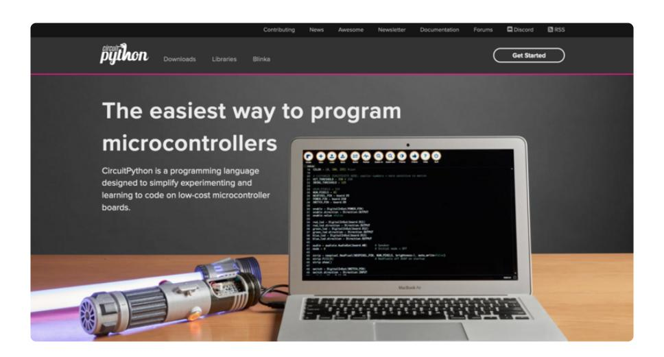

Beyond the Adafruit Learn System, which you are viewing right now, the best place to find information about CircuitPython is [circuitpython.org](https://circuitpython.org) (https://adafru.it/KJD). Everything you need to get started with your new microcontroller and beyond is available. You can do things like [download CircuitPython for your](https://circuitpython.org/downloads) [microcontroller](https://circuitpython.org/downloads) (https://adafru.it/Em8) or [download the latest CircuitPython Library](https://circuitpython.org/libraries) [bundle](https://circuitpython.org/libraries) (https://adafru.it/ENC), or check out [which single board computers support](https://circuitpython.org/blinka) [Blinka](https://circuitpython.org/blinka) (https://adafru.it/EA8). You can also get to various other CircuitPython related things like Awesome CircuitPython or the Python for Microcontrollers newsletter. This is all incredibly useful, but it isn't necessarily community related. So why is it included here? The [Contributing page](https://circuitpython.org/contributing) (https://adafru.it/VD7).

CircuitPython itself is written in C. However, all of the Adafruit CircuitPython libraries are written in Python. If you're interested in contributing to CircuitPython on the Python side of things, check out [circuitpython.org/contributing](https://circuitpython.org/contributing) (https://adafru.it/VD7). You'll find information pertaining to every Adafruit CircuitPython library GitHub

©Adafruit Industries Page 113 of 252

repository, giving you the opportunity to join the community by finding a contributing option that works for you.

Note the date on the page next to Current Status for:

If you submit any contributions to the libraries, and do not see them reflected on the Contributing page, it could be that the job that checks for new updates hasn't yet run for today. Simply check back tomorrow!

Now, a look at the different options.

## Pull Requests

The first tab you'll find is a list of open pull requests.

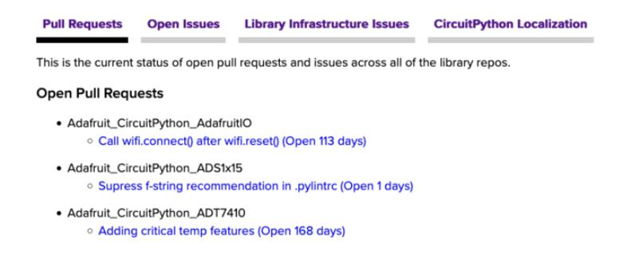

GitHub pull requests, or PRs, are opened when folks have added something to an Adafruit CircuitPython library GitHub repo, and are asking for Adafruit to add, or merge, their changes into the main library code. For PRs to be merged, they must first be reviewed. Reviewing is a great way to contribute! Take a look at the list of open pull requests, and pick one that interests you. If you have the hardware, you can test code changes. If you don't, you can still check the code updates for syntax. In the case of documentation updates, you can verify the information, or check it for spelling and grammar. Once you've checked out the update, you can leave a comment letting us know that you took a look. Once you've done that for a while, and you're more comfortable with it, you can consider joining the CircuitPythonLibrarians review team. The more reviewers we have, the more authors we can support. Reviewing is a crucial part of an open source ecosystem, CircuitPython included.

©Adafruit Industries Page 114 of 252

## Open Issues

The second tab you'll find is a list of open issues.

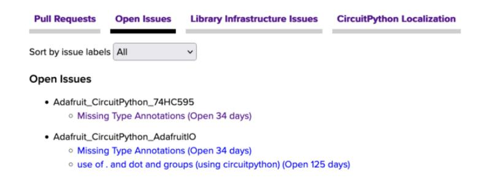

GitHub issues are filed for a number of reasons, including when there is a bug in the library or example code, or when someone wants to make a feature request. Issues are a great way to find an opportunity to contribute directly to the libraries by updating code or documentation. If you're interested in contributing code or documentation, take a look at the open issues and find one that interests you.

If you're not sure where to start, you can search the issues by label. Labels are applied to issues to make the goal easier to identify at a first glance, or to indicate the difficulty level of the issue. Click on the dropdown next to "Sort by issue labels" to see the list of available labels, and click on one to choose it.

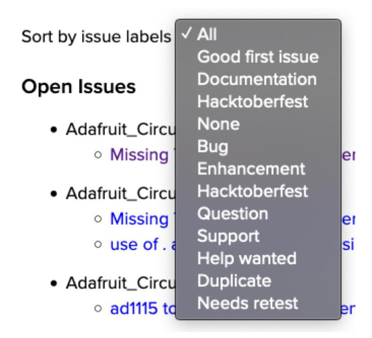

If you're new to everything, new to contributing to open source, or new to contributing to the CircuitPython project, you can choose "Good first issue". Issues

©Adafruit Industries Page 115 of 252

with that label are well defined, with a finite scope, and are intended to be easy for someone new to figure out.

If you're looking for something a little more complicated, consider "Bug" or "Enhancement". The Bug label is applied to issues that pertain to problems or failures found in the library. The Enhancement label is applied to feature requests.

Don't let the process intimidate you. If you're new to Git and GitHub, there is [a](https://learn.adafruit.com/contribute-to-circuitpython-with-git-and-github) [guide](https://learn.adafruit.com/contribute-to-circuitpython-with-git-and-github) (https://adafru.it/Dkh) to walk you through the entire process. As well, there are always folks available on [Discord](https:adafru.it/discord) () to answer questions.

## Library Infrastructure Issues

The third tab you'll find is a list of library infrastructure issues.

| Pull Requests                             | Open Issues                             | Library Infrastructure Issues                                                                                                                               | CircuitPython Localization                                          |                       |  |  |
|-------------------------------------------|-----------------------------------------|-------------------------------------------------------------------------------------------------------------------------------------------------------------|---------------------------------------------------------------------|-----------------------|--|--|
| Library Infra                             | Library Infrastructure Issues           |                                                                                                                                                             |                                                                     |                       |  |  |
| maintainability. Ac<br>made via a pull re | cordingly, we have<br>quest, however th | rary infrastructure. Having a standa<br>e a series of checks to ensure the s<br>ere are a few checks reported here<br>e issues, please feel free to contac' | tandard is met. Most of these are<br>that require changes to GitHub | e changes that can be |  |  |

This section is generated by a script that runs checks on the libraries, and then reports back where there may be issues. It is made up of a list of subsections each containing links to the repositories that are experiencing that particular issue. This page is available mostly for internal use, but you may find some opportunities to contribute on this page. If there's an issue listed that sounds like something you could help with, mention it on Discord, or file an issue on GitHub indicating you're working to resolve that issue. Others can reply either way to let you know what the scope of it might be, and help you resolve it if necessary.

## CircuitPython Localization

The fourth tab you'll find is the CircuitPython Localization tab.

©Adafruit Industries Page 116 of 252

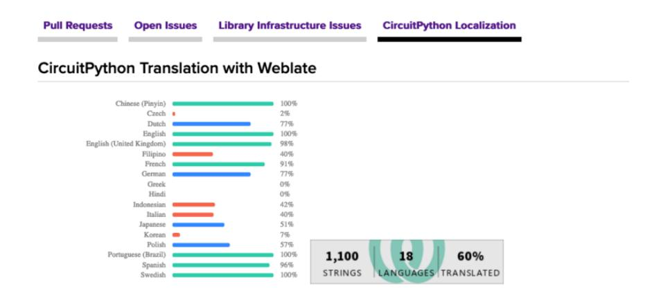

If you speak another language, you can help translate CircuitPython! The translations apply to informational and error messages that are within the CircuitPython core. It means that folks who do not speak English have the opportunity to have these messages shown to them in their own language when using CircuitPython. This is incredibly important to provide the best experience possible for all users. CircuitPython uses Weblate to translate, which makes it much simpler to contribute translations. You will still need to know some CircuitPython-specific practices and a few basics about coding strings, but as with any CircuitPython contributions, folks are there to help.

Regardless of your skill level, or how you want to contribute to the CircuitPython project, there is an opportunity available. The [Contributing page](https://circuitpython.org/contributing) (https://adafru.it/VD7) is an excellent place to start!

## Adafruit GitHub

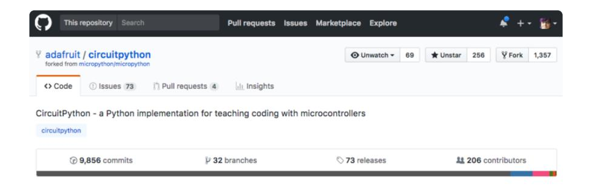

Whether you're just beginning or are life-long programmer who would like to contribute, there are ways for everyone to be a part of the CircuitPython project. The CircuitPython core is written in C. The libraries are written in Python. GitHub is the best source of ways to contribute to the [CircuitPython core](https://github.com/adafruit/circuitpython) (https://adafru.it/tB7), and the [CircuitPython libraries](https://circuitpython.org/contributing/open-issues) (https://adafru.it/VFv). If you need an account, visit [https://](https://github.com/) [github.com/](https://github.com/) (https://adafru.it/d6C) and sign up.

©Adafruit Industries Page 117 of 252

If you're new to GitHub or programming in general, there are great opportunities for you. For the CircuitPython core, head over to the CircuitPython repository on GitHub, click on "[Issues](https://github.com/adafruit/circuitpython/issues) (https://adafru.it/tBb)", and you'll find a list that includes issues labeled "[good first issue](https://github.com/adafruit/circuitpython/issues?q=is%3Aissue+is%3Aopen+label%3A%22good+first+issue%22) (https://adafru.it/188e)". For the libraries, head over to the [Contributing page Issues list](https://circuitpython.org/contributing/open-issues) (https://adafru.it/VFv), and use the drop down menu to search for "[good first issue](https://circuitpython.org/contributing/open-issues?label=good-first-issue) (https://adafru.it/VFw)". These issues are things that have been identified as something that someone with any level of experience can help with. These issues include options like updating documentation, providing feedback, and fixing simple bugs. If you need help getting started with GitHub, there is an excellent guide on [Contributing to CircuitPython with Git and GitHub](https://learn.adafruit.com/contribute-to-circuitpython-with-git-and-github) (https://adafru.it/ Dkh).

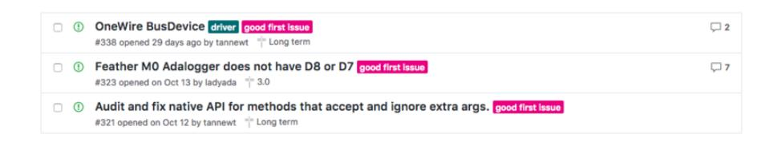

Already experienced and looking for a challenge? Checkout the rest of either issues list and you'll find plenty of ways to contribute. You'll find all sorts of things, from new driver requests, to library bugs, to core module updates. There's plenty of opportunities for everyone at any level!

When working with or using CircuitPython or the CircuitPython libraries, you may find problems. If you find a bug, that's great! The team loves bugs! Posting a detailed issue to GitHub is an invaluable way to contribute to improving CircuitPython. For CircuitPython itself, file an issue [here](https://github.com/adafruit/circuitpython/issues) (https://adafru.it/tBb). For the libraries, file an issue on the specific library repository on GitHub. Be sure to include the steps to replicate the issue as well as any other information you think is relevant. The more detail, the better!

Testing new software is easy and incredibly helpful. Simply load the newest version of CircuitPython or a library onto your CircuitPython hardware, and use it. Let us know about any problems you find by posting a new issue to GitHub. Software testing on both stable and unstable releases is a very important part of contributing CircuitPython. The developers can't possibly find all the problems themselves! They need your help to make CircuitPython even better.

On GitHub, you can submit feature requests, provide feedback, report problems and much more. If you have questions, remember that Discord and the Forums are both there for help!

©Adafruit Industries Page 118 of 252

## Adafruit Forums


The [Adafruit Forums](https://forums.adafruit.com) (https://adafru.it/jIf) are the perfect place for support. Adafruit has wonderful paid support folks to answer any questions you may have. Whether your hardware is giving you issues or your code doesn't seem to be working, the forums are always there for you to ask. You need an Adafruit account to post to the forums. You can use the same account you use to order from Adafruit.

While Discord may provide you with quicker responses than the forums, the forums are a more reliable source of information. If you want to be certain you're getting an Adafruit-supported answer, the forums are the best place to be.

There are forum categories that cover all kinds of topics, including everything Adafruit. The [Adafruit CircuitPython](https://forums.adafruit.com/viewforum.php?f=60) (https://adafru.it/xXA) category under "Supported Products & Projects" is the best place to post your CircuitPython questions.

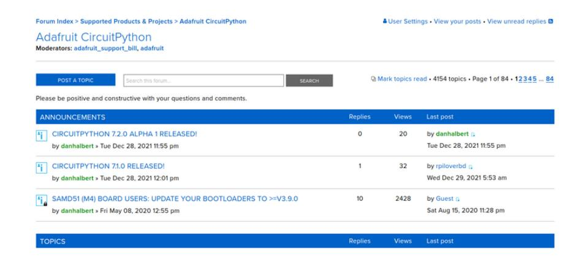

Be sure to include the steps you took to get to where you are. If it involves wiring, post a picture! If your code is giving you trouble, include your code in your post! These are great ways to make sure that there's enough information to help you with your issue.

©Adafruit Industries Page 119 of 252

You might think you're just getting started, but you definitely know something that someone else doesn't. The great thing about the forums is that you can help others too! Everyone is welcome and encouraged to provide constructive feedback to any of the posted questions. This is an excellent way to contribute to the community and share your knowledge!

## Read the Docs

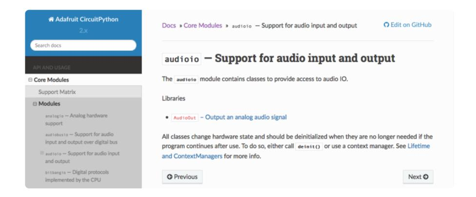

[Read the Docs](https://circuitpython.readthedocs.io/) (https://adafru.it/Beg) is a an excellent resource for a more detailed look at the CircuitPython core and the CircuitPython libraries. This is where you'll find things like API documentation and example code. For an in depth look at viewing and understanding Read the Docs, check out the [CircuitPython Documentation](https://learn.adafruit.com/welcome-to-circuitpython/circuitpython-documentation) (https:// adafru.it/VFx) page!

# <span id="page-119-0"></span>Create Your settings.toml File

CircuitPython works with WiFi-capable boards to enable you to make projects that have network connectivity. This means working with various passwords and API keys. As of [CircuitPython 8](https://circuitpython.org/downloads) (https://adafru.it/Em8), there is support for a settings.toml file. This is a file that is stored on your CIRCUITPY drive, that contains all of your secret

©Adafruit Industries Page 120 of 252

network information, such as your SSID, SSID password and any API keys for IoT services. It is designed to separate your sensitive information from your code.py file so you are able to share your code without sharing your credentials.

CircuitPython previously used a secrets.py file for this purpose. The settings.toml file is quite similar.


Your **settings.toml** file should be stored in the main directory of your **CIRCUITPY** drive. It should not be in a folder.

## CircuitPython settings.toml File

This section will provide a couple of examples of what your settings.toml file should look like, specifically for CircuitPython WiFi projects in general.

The most minimal settings.toml file must contain your WiFi SSID and password, as that is the minimum required to connect to WiFi. Copy this example, paste it into your settings.toml, and update:

- your\_wifi\_ssid •
- your\_wifi\_password •

```
CIRCUITPY_WIFI_SSID = "your_wifi_ssid"
CIRCUITPY_WIFI_PASSWORD = "your_wifi_password"
```

Many CircuitPython network-connected projects on the Adafruit Learn System involve using Adafruit IO. For these projects, you must also include your Adafruit IO username and key. Copy the following example, paste it into your settings.toml file, and update:

```
your_wifi_ssid
•
```

- your\_wifi\_password •
- your\_aio\_username •
- your\_aio\_key •

```
CIRCUITPY_WIFI_SSID = "your_wifi_ssid"
CIRCUITPY_WIFI_PASSWORD = "your_wifi_password"
```

©Adafruit Industries Page 121 of 252

```
ADAFRUIT_AIO_USERNAME = "your_aio_username"
ADAFRUIT_AIO_KEY = "your_aio_key"
```

Some projects use different variable names for the entries in the settings.toml file. For example, a project might use ADAFRUIT\_AIO\_ID in the place of ADAFRUIT\_AIO\_USERNAME . If you run into connectivity issues, one of the first things to check is that the names in the settings.toml file match the names in the code.


Not every project uses the same variable name for each entry in the **settings.toml** file! Always verify it matches the code.

## settings.toml File Tips

Here is an example settings.toml file.

```
# Comments are supported
CIRCUITPY_WIFI_SSID = "guest wifi"
CIRCUITPY_WIFI_PASSWORD = "guessable"
CIRCUITPY_WEB_API_PORT = 80
CIRCUITPY_WEB_API_PASSWORD = "passw0rd"
test_variable = "this is a test"
thumbs_up = "\U0001f44d"
```

In a settings.toml file, it's important to keep these factors in mind:

- Strings are wrapped in double quotes; ex: "your-string-here" •
- Integers are not quoted and may be written in decimal with optional sign ( +1 , -1 , 1000 ) or hexadecimal ( 0xabcd ). •
  - Floats (decimal numbers), octal ( 0o567 ) and binary ( 0b11011 ) are not supported. ◦
- Use \u escapes for weird characters, \x and \ooo escapes are not available in .toml files •
  - Example: \U0001f44d for (thumbs up emoji) and \u20ac for € (EUR sign) ◦

©Adafruit Industries Page 122 of 252

Unicode emoji, and non-ASCII characters, stand for themselves as long as you're careful to save in "UTF-8 without BOM" format •

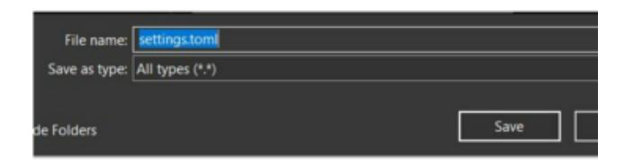

When your settings.toml file is ready, you can save it in your text editor with the .toml extension.

## Accessing Your settings.toml Information in code.py

In your code.py file, you'll need to import the os library to access the settings.toml file. Your settings are accessed with the os.getenv() function. You'll pass your settings entry to the function to import it into the code.py file.

```
import os
print(os.getenv("test_variable"))
```

In the upcoming CircuitPython WiFi examples, you'll see how the settings.toml file is used for connecting to your SSID and accessing your API keys.

# <span id="page-122-0"></span>CircuitPython Internet Test

One of the great things about most Espressif microcontrollers are their built-in WiFi capabilities. This page covers the basics of getting connected using CircuitPython.

©Adafruit Industries Page 123 of 252

The first thing you need to do is update your code.py to the following (it will error until WiFi details are added). Click the Download Project Bundle button to download the necessary libraries and the code.py file in a zip file. Extract the contents of the zip file, and copy the entire lib folder and the code.py file to your CIRCUITPY drive.

```
# SPDX-FileCopyrightText: 2020 Brent Rubell for Adafruit Industries
#
# SPDX-License-Identifier: MIT
import os
import ipaddress
import ssl
import wifi
import socketpool
import adafruit_requests
# URLs to fetch from
TEXT_URL = "http://wifitest.adafruit.com/testwifi/index.html"
JSON_QUOTES_URL = "https://www.adafruit.com/api/quotes.php"
JSON_STARS_URL = "https://api.github.com/repos/adafruit/circuitpython"
print("ESP32-S2 WebClient Test")
print(f"My MAC address: {[hex(i) for i in wifi.radio.mac_address]}")
print("Available WiFi networks:")
for network in wifi.radio.start_scanning_networks():
    print("\t%s\t\tRSSI: %d\tChannel: %d" % (str(network.ssid, "utf-8"),
                                             network.rssi, network.channel))
wifi.radio.stop_scanning_networks()
print(f"Connecting to {os.getenv('CIRCUITPY_WIFI_SSID')}")
wifi.radio.connect(os.getenv("CIRCUITPY_WIFI_SSID"),
os.getenv("CIRCUITPY_WIFI_PASSWORD"))
print(f"Connected to {os.getenv('CIRCUITPY_WIFI_SSID')}")
print(f"My IP address: {wifi.radio.ipv4_address}")
ping_ip = ipaddress.IPv4Address("8.8.8.8")
ping = wifi.radio.ping(ip=ping_ip)
# retry once if timed out
if ping is None:
    ping = wifi.radio.ping(ip=ping_ip)
if ping is None:
    print("Couldn't ping 'google.com' successfully")
else:
    # convert s to ms
    print(f"Pinging 'google.com' took: {ping * 1000} ms")
pool = socketpool.SocketPool(wifi.radio)
requests = adafruit_requests.Session(pool, ssl.create_default_context())
print(f"Fetching text from {TEXT_URL}")
response = requests.get(TEXT_URL)
print("-" * 40)
print(response.text)
print("-" * 40)
print(f"Fetching json from {JSON_QUOTES_URL}")
response = requests.get(JSON_QUOTES_URL)
print("-" * 40)
print(response.json())
print("-" * 40)
print()
```

©Adafruit Industries Page 124 of 252

```
print(f"Fetching and parsing json from {JSON_STARS_URL}")
response = requests.get(JSON_STARS_URL)
print("-" * 40)
print(f"CircuitPython GitHub Stars: {response.json()['stargazers_count']}")
print("-" * 40)
print("Done")
```

Your CIRCUITPY drive should resemble the following.

To get connected, the next thing you need to do is update the settings.toml file.

## The settings.toml File

We expect people to share tons of projects as they build CircuitPython WiFi widgets. What we want to avoid is people accidentally sharing their passwords or secret tokens and API keys. So, we designed all our examples to use a settings.toml file, that is on your CIRCUITPY drive, to hold secret/private/custom data. That way you can share your main project without worrying about accidentally sharing private stuff.

If you have a fresh install of CircuitPython on your board, the initial settings.toml file on your CIRCUITPY drive is empty.

To get started, you can update the settings.toml on your CIRCUITPY drive to contain the following code.

```
# SPDX-FileCopyrightText: 2023 Adafruit Industries
#
# SPDX-License-Identifier: MIT
# This is where you store the credentials necessary for your code.
# The associated demo only requires WiFi, but you can include any
# credentials here, such as Adafruit IO username and key, etc.
CIRCUITPY_WIFI_SSID = "your-wifi-ssid"
CIRCUITPY_WIFI_PASSWORD = "your-wifi-password"
```

©Adafruit Industries Page 125 of 252

This file should contain a series of Python variables, each assigned to a string. Each variable should describe what it represents (say wifi\_ssid ), followed by an = (equals sign), followed by the data in the form of a Python string (such as "my-wifi-password" including the quote marks).

At a minimum you'll need to add/update your WiFi SSID and WiFi password, so do that now!

As you make projects you may need more tokens and keys, just add them one line at a time. See for example other tokens such as one for accessing GitHub or the Hackaday API. Other non-secret data like your timezone can also go here.

For the correct time zone string, look at <http://worldtimeapi.org/timezones> (https:// adafru.it/EcP) and remember that if your city is not listed, look for a city in the same time zone, for example Boston, New York, Philadelphia, Washington DC, and Miami are all on the same time as New York.

Of course, don't share your settings.toml - keep that out of GitHub, Discord or other project-sharing sites.


Don't share your settings.toml file! It has your passwords and API keys in it!

If you connect to the serial console, you should see something like the following:

©Adafruit Industries Page 126 of 252

In order, the example code...

Checks the ESP32's MAC address.

```
print(f"My MAC address: {[hex(i) for i in wifi.radio.mac_address]}")
```

Performs a scan of all access points and prints out the access point's name (SSID), signal strength (RSSI), and channel.

```
print("Available WiFi networks:")
for network in wifi.radio.start_scanning_networks():
    print("\t%s\t\tRSSI: %d\tChannel: %d" % (str(network.ssid, "utf-8"),
                                             network.rssi, network.channel))
wifi.radio.stop_scanning_networks()
```

Connects to the access point you defined in the settings.toml file, and prints out its local IP address.

```
print(f"Connecting to {os.getenv('WIFI_SSID')}")
wifi.radio.connect(os.getenv("WIFI_SSID"), os.getenv("WIFI_PASSWORD"))
print(f"Connected to {os.getenv('WIFI_SSID')}")
print(f"My IP address: {wifi.radio.ipv4_address}")
```

©Adafruit Industries Page 127 of 252

Attempts to ping a Google DNS server to test connectivity. If a ping fails, it returns None . Initial pings can sometimes fail for various reasons. So, if the initial ping is successful ( is not None ), it will print the echo speed in ms. If the initial ping fails, it will try one more time to ping, and then print the returned value. If the second ping fails, it will result in "Ping google.com: None ms" being printed to the serial console. Failure to ping does not always indicate a lack of connectivity, so the code will continue to run.

```
ping_ip = ipaddress.IPv4Address("8.8.8.8")
ping = wifi.radio.ping(ip=ping_ip) * 1000
if ping is not None:
    print(f"Ping google.com: {ping} ms")
else:
    ping = wifi.radio.ping(ip=ping_ip)
    print(f"Ping google.com: {ping} ms")
```

The code creates a socketpool using the wifi radio's available sockets. This is performed so we don't need to re-use sockets. Then, it initializes a a new instance of the [requests](http://docs.python-requests.org/en/master/) (https://adafru.it/E9o) interface - which makes getting data from the internet really really easy.

```
pool = socketpool.SocketPool(wifi.radio)
requests = adafruit_requests.Session(pool, ssl.create_default_context())
```

To read in plain-text from a web URL, call requests.get - you may pass in either a http, or a https url for SSL connectivity.

```
print(f"Fetching text from {TEXT_URL}")
response = requests.get(TEXT_URL)
print("-" * 40)
print(response.text)
print("-" * 40)
```

Requests can also display a JSON-formatted response from a web URL using a call to requests.get .

```
print(f"Fetching json from {JSON_QUOTES_URL}")
response = requests.get(JSON_QUOTES_URL)
print("-" * 40)
print(response.json())
print("-" * 40)
```

Finally, you can fetch and parse a JSON URL using requests.get . This code snippet obtains the stargazers\_count field from a call to the GitHub API.

©Adafruit Industries Page 128 of 252

```
print(f"Fetching and parsing json from {JSON_STARS_URL}")
response = requests.get(JSON_STARS_URL)
print("-" * 40)
print(f"CircuitPython GitHub Stars: {response.json()['stargazers_count']}")
print("-" * 40)
```

OK you now have your ESP32 board set up with a proper settings.toml file and can connect over the Internet. If not, check that your settings.toml file has the right SSID and password and retrace your steps until you get the Internet connectivity working!

## IPv6 Networking

Starting in CircuitPython 9.2, IPv6 networking is available on most Espressif wifi boards. Socket-using libraries like adafruit\_requests and adafruit\_ntp will need to be updated to use the new APIs and for now can only connect to services on IPv4.

## IPv6 connectivity & privacy

IPv6 addresses are divided into many special kinds, and many of those kinds (like those starting with FC, FD, FE) are private or local; Addresses starting with other prefixes like 2002: and 2001: are globally routable. In 2024, far from all ISPs and home networks support IPv6 internet connectivity. For more info consult resources like [Wikipedia](https://en.wikipedia.org/wiki/IPv6_address#Local_addresses) (https://adafru.it/1a4z). If you're interested in global IPv6 connectivity you can use services like [Hurricane Electric](https://www.he.net/) (https://adafru.it/1a4A) to create an "IPv6 tunnel" (free as of 2024, but requires expertise and a compatible router or host computer to set up)

It's also important to be aware that, as currently implemented by Espressif, there are privacy concerns especially when these devices operate on the global IPv6 network: The device's unique identifier (its EUI-64 or MAC address) is used by default as part of its IPv6 address. This means that the device identity can be tracked across multiple networks by any service it connects to.

## Enable IPv6 networking

Due to the privacy consideration, IPv6 networking is not automatically enabled. Instead, it must be explicitly enabled by a call to start\_dhcp\_client with the ipv6=True argument specified:

```
wifi.start_dhcp_client(ipv6=True)
```

©Adafruit Industries Page 129 of 252

## Check IP addresses

The read-only addresses property of the wifi.radio object holds all addresses, including IPv4 and IPv6 addresses:

```
>>> wifi.radio.addresses
('FE80::7EDF:A1FF:FE00:518C', 'FD5F:3F5C:FE50:0:7EDF:A1FF:FE00:518C', '10.0.3.96')
```

The wifi.radio.dns servers can be IPv4 or IPv6:

```
>>> wifi.radio.dns
('FD5F:3F5C:FE50::1',)
>>> wifi.radio.dns = ("1.1.1.1",)
>>> wifi.radio.dns
('1.1.1.1',)
```

## Ping v6 networks

wifi.radio.ping accepts v6 addresses and names:

```
>>> wifi.radio.ping("google.com")
0.043
>>> wifi.radio.ping("ipv6.google.com")
0.048
```

## Create & use IPv6 sockets

Use the address family socket.AF\_INET6 . After the socket is created, use methods like connect , send , recfrom\_into , etc just like for IPv4 sockets. This code snippet shows communicating with a private-network NTP server; this IPv6 address will not work on your network:

```
>>> ntp_addr = ("fd5f:3f5c:fe50::20e", 123)
>>> PACKET_SIZE = 48
>>>
>>> buf = bytearray(PACKET_SIZE)
>>> with socket.socket(socket.AF_INET6, socket.SOCK_DGRAM) as s:
... s.settimeout(1)
... buf[0] = 0b0010_0011
... s.sendto(buf, ntp_addr)
... print(s.recvfrom_into(buf))
... print(buf)
...
48
(48, ('fd5f:3f5c:fe50::20e', 123))
bytearray(b'$\x01\x03\xeb\x00\x00\x00\x00\x00\x00\x00GGPS\x00\xeaA0h\x07s;
\xc0\x00\x00\x00\x00\x00\x00\x00\x00\xeaA0n\xeb4\x82-\xeaA0n\xebAU\xb1')
```

©Adafruit Industries Page 130 of 252

# <span id="page-130-0"></span>Converting Arduino\_GFX init strings to CircuitPython


Not all 40-pin displays have the power pins in the same place. Hooking up a non RGB-666 display with the Qualia S3 risks damaging the display.


The conversion script is intended to be run using Python and not CircuitPython on a computer with plenty of memory.

If you would like to generate the init code for CircuitPython, you can do so in a couple of ways with the conversion script below. In both ways you will need to run it using Python on your computer. Start by saving the code below as convert\_initcode.py.

```
# convert_initcode.py
# MIT license
import re
(
 BEGIN_WRITE,
 WRITE_COMMAND_8,
 WRITE_COMMAND_16,
 WRITE_DATA_8,
 WRITE_DATA_16,
 WRITE_BYTES,
 WRITE_C8_D8,
 WRITE_C8_D16,
 WRITE_C16_D16,
 END_WRITE,
 DELAY,
) = range(11)
class Encoder:
 def __init__(self):
 self.content = bytearray()
 self.reset()
 def command(self, command):
 if self.pending_command is not None:
 self.flush()
 self.pending_command = command
 self.pending_data = bytearray()
```

©Adafruit Industries Page 131 of 252

```
 def data(self, data):
 self.pending_data.append(data)
 def delay(self, value):
 self.pending_delay = value
 def flush(self):
 if self.pending_command is not None:
 self.content.append(self.pending_command)
 len_and_delay = len(self.pending_data) | (bool(self.pending_delay) << 7)
 self.content.append(len_and_delay)
 self.content.extend(self.pending_data)
 if self.pending_delay:
 self.content.append(self.pending_delay)
 print(f" {bytes(self.content)}")
 self.reset()
 def reset(self):
 self.pending_command = None
 self.pending_data = bytearray()
 self.pending_delay = 0
 self.content = bytearray()
def translate_init_operations(*initcode):
 initcode = iter(initcode)
 encoder = Encoder()
 print("init_code = bytes((")
 for op in initcode:
 if op in (BEGIN_WRITE, END_WRITE):
 continue
 elif op == WRITE_COMMAND_8:
 encoder.command(next(initcode))
 elif op == WRITE_C8_D8:
 encoder.command(next(initcode))
 encoder.data(next(initcode))
 elif op == WRITE_C8_D16:
 encoder.command(next(initcode))
 encoder.data(next(initcode))
 encoder.data(next(initcode))
 elif op == WRITE_BYTES:
 for _ in range(next(initcode)):
 encoder.data(next(initcode))
 elif op == DELAY:
 encoder.delay(next(initcode))
 else:
 raise ValueError(f"Invalid operation 0x{op:02x}")
 encoder.flush()
 print("))")
def translate_init_file(initcode_filename):
 initcode_regex = r"\( *0x([0-9a-fA-F]+) *\);"
 command_data_regex = r"\( *0x([0-9a-fA-F]+), *0x([0-9a-fA-F]+) *\);"
 delay_regex = r"\( *(\d+) *\);"
 # Init code files are inconsistent in their naming of command, data, and delay 
functions
 command8_values = ("SPI_WriteComm", "W_C", "WriteCommand", "WriteComm")
 data_values = ("SPI_WriteData", "W_D", "WriteParameter", "WriteData")
 delay_values = ("Delayms", "Delay", "Delay_ms")
 encoder = Encoder()
 def get_command8(line):
```

©Adafruit Industries Page 132 of 252

```
 for command in command8_values:
 if command in line:
 encoder.command(get_initcode8(line))
 return True
 return False
 def get_data(line):
 for data in data_values:
 if data in line:
 encoder.data(get_initcode8(line))
 return True
 return False
 def get_delay(line):
 for delay in delay_values:
 if delay in line:
 encoder.delay(get_delay_value(line))
 return True
 return False
 def get_initcode8(line):
 match = re.search(initcode_regex, line)
 if match:
 return int(match.group(1), 16)
 raise ValueError(f"Warning: could not parse initcode in line '{line}'")
 def get_initcode16(line):
 match = re.search(command_data_regex, line)
 if match:
 command = int(match.group(1), 16)
 data = int(match.group(2), 16)
 return command, data
 raise ValueError(f"Warning: could not parse initcode in line '{line}'")
 def get_delay_value(line):
 match = re.search(delay_regex, line)
 if match:
 return int(match.group(1))
 raise ValueError(f"Warning: could not parse delay in line '{line}'")
 with open(initcode_filename, encoding='utf-8', errors='ignore') as f:
 print("init_code = bytes((")
 for line in f.readlines():
 line = line.strip()
 # Remove comments or commented out code
 line = line.split("//")[0]
 if get_command8(line):
 continue
 if get_data(line):
 continue
 if get_delay(line):
 continue
 if "Wrt_Reg_3052" in line:
 command, data = get_initcode16(line)
 encoder.command(command)
 encoder.data(data)
 encoder.flush()
 print("))")
```

To use the code, you can just import the conversion script into your own code:

```
from convert_initcode import *
```

©Adafruit Industries Page 133 of 252

## Using Arduino\_GFX Init Codes

The first method is to convert the codes from the Arduino\_GFX library, which can be found at [https://github.com/moononournation/Arduino\\_GFX](https://github.com/moononournation/Arduino_GFX) (https://adafru.it/194D). The initialization codes for the dot clock displays are found inside of [src/display/](https://github.com/moononournation/Arduino_GFX/blob/master/src/display/Arduino_RGB_Display.h) [Arduino\\_RGB\\_Display.h](https://github.com/moononournation/Arduino_GFX/blob/master/src/display/Arduino_RGB_Display.h) (https://adafru.it/194E) by searching for the display's model number.

In your main script, just call translate\_init\_operations() like this:

```
translate_init_operations(
WRITE_COMMAND_8, 0xFF,
WRITE_BYTES, 5, 0x77, 0x01, 0x00, 0x00, 0x13,
WRITE_C8_D8, 0xEF, 0x08,
...
)
```

These operations are supported: COMMAND\_8 , C8\_D8 , C8\_D16 , WRITE\_BYTES . Adding support for WRITE\_DATA\_8 and WRITE\_DATA\_16 "should be easy" but it was not used in any examples so far.

It's assumed that BEGIN\_WRITE / END\_WRITE are not 'important'. However, DELAY is accounted for.

## Using Init Code Files

The second method is by using one of the init code files found on the product page for the display. Near the bottom of the page under Technical Details, most of the displays have a link to a file containing the init codes. Just save the file to your computer as something like display\_init\_codes.txt.

©Adafruit Industries Page 134 of 252

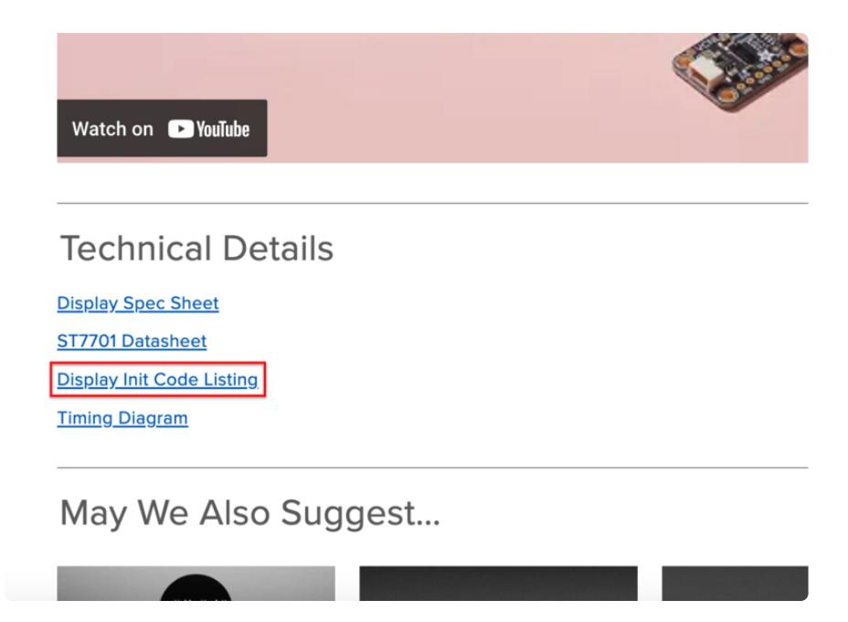

Then to convert the file, in your main script, just run translate\_init\_file() like this:

```
translate_init_file("display_init_codes.txt")
```

## Script Output

After running your script, you should see output like the following:

©Adafruit Industries Page 135 of 252

# <span id="page-135-0"></span>Determining Timings

If you have your own RGB-666 display, you may wish to use it with the Qualia ESP32- S3. The main pieces of information that you will need to find are:

- Display Width •
- Display Height •
- Horizontal and Vertical: •
  - Sync Pulse Width in milliseconds ◦
  - Front Porch in milliseconds ◦
  - Back Porch in milliseconds ◦

Pieces of Information that are helpful, but can be determined by trial and error include:

- Frequency of the Display Clock •
- Signal Polarities for the following: •
  - Horizontal Idle ◦
  - Vertical Idle ◦
  - Data Enable Idle ◦
  - Pixel Clock Active ◦
  - Pixel Clock Idle ◦


Some displays ignore many of the timing settings and use ones set through the init codes.

## Using a Data Sheet

The one of the best places to start looking for this information is the data sheet for the display. Data sheets may contain a diagram that will give you most of those values:

©Adafruit Industries Page 136 of 252

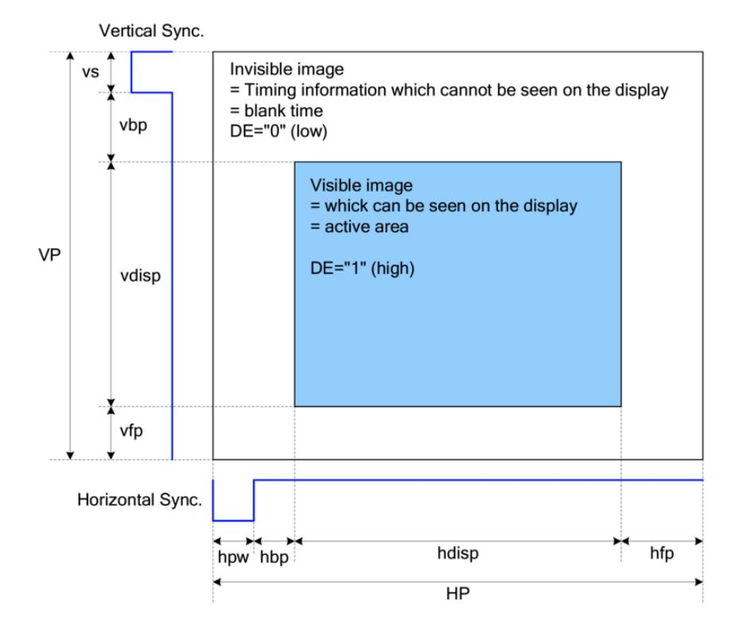

For the display width and height, these are in pixels and should be easy to find.

In the above diagram, you can see for instance the HP (or Horizontal Period) split up into hpw (or Horizontal Sync Pulse Width), hbp (or Horizontal Back Porch), hdisp (or Horizontal Display, which is the visible area), and hfp (or Horizontal Front Porch). For the vertical, this is the same except vs is used for the Vertical Sync Pulse Width.

When a display is drawn, the horizontal and vertical periods are split up into these sections. The Sync Pulse Widths are used by the display to keep everything in sync and the Front and Back Porch are blanking periods and are carried over from VGA when CRTs (or Cathode Ray Tubes) were used to give a little extra time for signals to synchronize or allow the electron beam to move to a different place.

While many data sheets will explicitly give you these values, occasionally you may be given values such as the total period time, one of the porch values and the timing of the display data, which you can use to calculate any missing values, which is why it's important to understand how the timings are used.

You can also use the diagram to figure out the Horizontal and Vertical Idle Polarity by looking at the lines underneath and to the left. In the case of the above diagram, both of the signals have a high idle state, which is the part of the signal where it is out of the sync pulse phase.

©Adafruit Industries Page 137 of 252

## Fill in the Settings

For the timings in CircuitPython, a dictionary is used. You can use the following code as a template and you will want to replace anywhere you see [Number] with the actual numerical value and anywhere you see [True/False] with a boolean value.

```
tft_timings = {
    "frequency": [Number],
    "width": [Number],
    "height": [Number],
    "hsync_pulse_width": [Number],
    "hsync_back_porch": [Number],
    "hsync_front_porch": [Number],
    "hsync_idle_low": [True/False],
    "vsync_pulse_width": [Number],
    "vsync_back_porch": [Number],
    "vsync_front_porch": [Number],
    "vsync_idle_low": [True/False],
    "pclk_active_high": [True/False],
    "pclk_idle_high": [True/False],
    "de_idle_high": [True/False],
}
```

## Experimenting with Settings

To get the remainder of the settings, you may need to experiment a bit. You can take a look at some of the other displays that are similar to get a good starting point. From there, start making adjustments until you get an image that looks correct. If you notice that any changes you are making seem to have little effect, then it is likely using settings from the init codes. In this case, you may need to consult the data sheet for the controller and figure out which code is causing issues. You also may try getting the init codes from different sources and see which ones work the best.

## Testing your Settings with CircuitPython

So you are at a point where everything seems correct, it's time to test that it all looks good. If the settings are off just a bit, you may notice certain colors look a bit glitchy and you will need to continue experimenting with the settings to fix it. You can fill in your timing settings and run this script to test that everything looks good:

```
from displayio import release_displays
release_displays()
import random
import displayio
import time
import busio
import board
import dotclockframebuffer
```

©Adafruit Industries Page 138 of 252

```
from framebufferio import FramebufferDisplay
init_code = bytes((...))
board.I2C().deinit()
i2c = busio.I2C(board.SCL, board.SDA) #, frequency=400_000)
tft_io_expander = dict(board.TFT_IO_EXPANDER)
dotclockframebuffer.ioexpander_send_init_sequence(i2c, init_code, **tft_io_expander)
i2c.deinit()
tft_pins = dict(board.TFT_PINS)
tft_timings = {...}
bitmap = displayio.Bitmap(256, 7*64, 65535)
fb = dotclockframebuffer.DotClockFramebuffer(**tft_pins, **tft_timings)
display = FramebufferDisplay(fb, auto_refresh=False)
# Create a TileGrid to hold the bitmap
tile_grid = displayio.TileGrid(bitmap,
pixel_shader=displayio.ColorConverter(input_colorspace=displayio.Colorspace.RGB565))
# Create a Group to hold the TileGrid
group = displayio.Group()
# Add the TileGrid to the Group
group.append(tile_grid)
# Add the Group to the Display
display.root_group = group
display.auto_refresh = True
for i in range(256):
    b = i >> 3
    g = (i >> 2) << 5
    r = b << 11
    for j in range(64):
        bitmap[i, j] = b
        bitmap[i, j+64] = b|g
        bitmap[i, j+128] = g
        bitmap[i, j+192] = g|r
        bitmap[i, j+256] = r
        bitmap[i, j+320] = r|b
        bitmap[i, j+384] = r|g|b
# Loop forever so you can enjoy your image
while True:
    time.sleep(1)
    display.auto_refresh = False
    group.x = random.randint(0, 32)
    group.y = random.randint(0, 32)
    display.auto_refresh = True
    pass
```

If your settings are slightly off, it may look like the following:

©Adafruit Industries Page 139 of 252

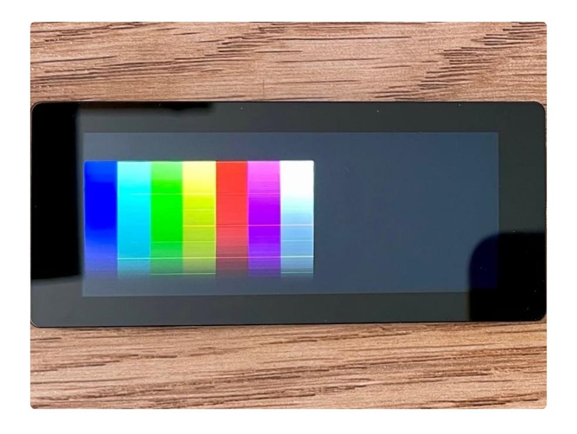

Once everything is set correctly, the above image should look like this:

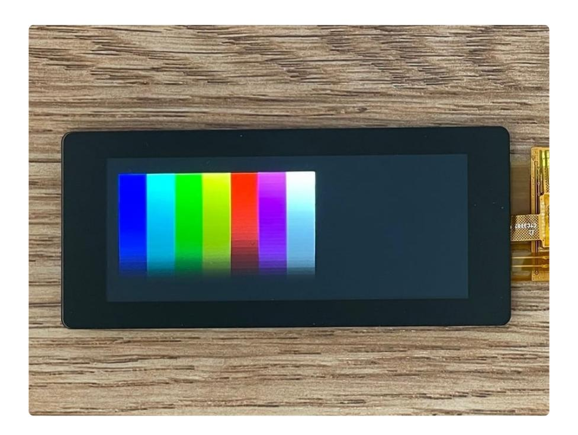

# <span id="page-139-0"></span>Backlight Settings

The default backlight setting for the Qualia ESP32-S3 is set to 25mA, which is a safe value and won't overload the display.

©Adafruit Industries Page 140 of 252

If you would like to make it brighter for your project, this can be increased by bridging the solderable jumpers on the front of the board. There are 3 jumpers, which are additive, labeled +25, +50, and +100. Added to the base 25mA, this means it can be set to a maximum of 200mA.

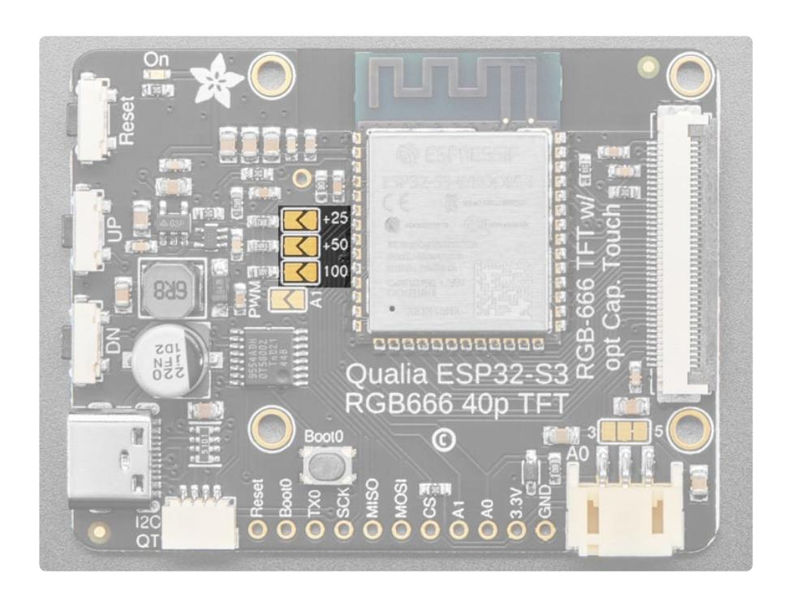

Keep in mind that it is possible to overload the display, so you will want to refer to the display spec sheet for the display you are using, which can be found on the corresponding display's product page near the bottom. Here's are a few spec sheet examples. You'll want to look for a table similar to the following:

| Item                           | Symbol          | Min.  | Тур. | Max. | Unit | Remark                   |
|--------------------------------|-----------------|-------|------|------|------|--------------------------|
| Forward Current                | IF              | -     | 20   | 25   | mA   | 4150-                    |
| Forward Current Voltage        | V <sub>F</sub>  | -     | 12.8 | 14   | V    | 4 LEDs<br>(4 LED Serial, |
| Backlight Power<br>Consumption | W <sub>BL</sub> | -     | 256  | 350  | mW   | 1LED Parallel)           |
| Operating Life Time            |                 | 30000 |      |      | hrs  | Note 2, Note 3           |

In this case, you will notice that the typical forward current is 20mA, but has a maximum current of 25mA. You will want to leave the display at the default 25mA in this case.

©Adafruit Industries Page 141 of 252

| Item                           | Symbol          | Min.  | Тур. | Max. | Unit | Remark                   |
|--------------------------------|-----------------|-------|------|------|------|--------------------------|
| Forward Current                | I <sub>F</sub>  | -     | 40   | 50   | mA   | 0.150-                   |
| Forward Current Voltage        | V <sub>F</sub>  | -     | 12.8 | 14   | V    | 8 LEDs<br>(4 LED Serial. |
| Backlight Power<br>Consumption | W <sub>BL</sub> | -     | 512  | 700  | mW   | 2LED Parallel)           |
| Operating Life Time            |                 | 30000 |      |      | hrs  | Note 2, Note 3           |

For the above display, you will notice that the typical is 40mA, but has a maximum of 50mA. You could increase the backlight current to 50mA by bridging the +25 jumper to add 25mA to the 25mA base current.

|                 |        |                      |        |        |      |                   | ,      |
|-----------------|--------|----------------------|--------|--------|------|-------------------|--------|
| Characteristics | Symbol | Condition            | Min.   | Туре   | Max. | Unit              | Notes  |
| Forward Voltage | Vf     | I <sub>L</sub> =40mA |        | 12     | 12.8 | V                 | -      |
| Forward current | IL     |                      | -      | 40     | -    | mA                | -      |
| Luminance       | Lv     | I <sub>L</sub> =40mA | -      | 300    | 1    | cd/m <sup>2</sup> | -      |
| LED life time   | -      | I <sub>L</sub> =40mA | 20,000 | 25,000 |      | Hr                | Note 1 |

In this spec sheet, you'll notice that it is expecting 40mA, but there is no maximum set. Extrapolating off the previous example, you could also go up to 50mA for that display.

## Display Settings

Here are the maximum backlight settings for the [displays carried in the Adafruit](https://www.adafruit.com/search?q=RGB+TTL+Display) [shop](https://www.adafruit.com/search?q=RGB+TTL+Display) (https://adafru.it/195a).

Round Displays

[2.1" 480x480 Round Display \(Touchscreen\)](https://www.adafruit.com/product/5792) (http://adafru.it/5792) - 25mA

[2.1" 480x480 Round Display \(No Touchscreen\)](https://www.adafruit.com/product/5806) (http://adafru.it/5806) - 25mA

©Adafruit Industries Page 142 of 252

```
2.8" 480x480 Round Display (http://adafru.it/5852) - 100mA
```

[4.0" 720x720 Round Display](https://www.adafruit.com/product/5793) (http://adafru.it/5793) - 50mA

Square Displays

[3.4" 480x480 Square Display \(Touchscreen\)](https://www.adafruit.com/product/5808) (http://adafru.it/5808) - 50mA

[3.4" 480x480 Square Display \(No touchscreen\)](https://www.adafruit.com/product/5825) (http://adafru.it/5825) - 50mA

[4.0" 480x480 Square Display](https://www.adafruit.com/product/5827) (http://adafru.it/5827) - 25mA

[4.0" 720x720 Square Display \(Touchscreen\)](https://www.adafruit.com/product/5794) (http://adafru.it/5794) - 50mA

[4.0" 720x720 Square Display \(No touchscreen\)](https://www.adafruit.com/product/5795) (http://adafru.it/5795) - 50mA

Bar Displays

[3.2" 320x820 Bar Display \(Touchscreen\)](https://www.adafruit.com/product/5797) (http://adafru.it/5797) - 25mA

[3.2" 320x820 Bar Display \(No touchscreen\)](https://www.adafruit.com/product/5828) (http://adafru.it/5828) - 25mA

[3.7" 240x960 Bar Display](https://www.adafruit.com/product/5799) (http://adafru.it/5799) - 25mA

[4.58" 320x960 Bar Display](https://www.adafruit.com/product/5805) (http://adafru.it/5805) - 50mA

# <span id="page-142-0"></span>CircuitPython Display Setup


Not all 40-pin displays have the power pins in the same place. Hooking up a non RGB-666 display with the Qualia S3 risks damaging the display.

To set up a display, you need to have several major pieces of information:

- The GPIO connections for the display (TFT\_PINS) •
- The I/O expander configuration (TFT\_IO\_EXPANDER) •
- The resolution and "timings" of the display (TFT\_TIMINGS), which also includes information about the polarity of certain signals. •

©Adafruit Industries Page 143 of 252

The initialization code of the display (TFT\_INIT\_SEQUENCE) •

Luckily, this guide provides all the information for the displays that are sold in the Adafruit shop. However, if you have a different display, you will need to find the information in the data sheet.

If a board is designed for dot clock TFT displays, the GPIO connections are listed in board.TFT\_PINS . Otherwise, it depends on how the display is connected.

If the board is designed for a single display, then the timings are listed in board.TFT\_TIMINGS .

These values are used in the display constructor with the \*\* so that each element becomes a separate argument to the function.

If the board's built in display requires an initialization sequence, then this is given as board.TFT\_INIT\_SEQUENCE . If the SPI bus is on an I2C I/O expander the settings for the I/O expander are in board.TFT\_IO\_EXPANDER , intended to be expanded with \*\* .

## CircuitPython Board Definition

If a board is tied to a specific display, then board definition in the CircuitPython c code can initialize the dot clock TFT display. For example, this is done with the Espressif ESP32-S3 LCD EV board:

```
// This file is part of the CircuitPython project: https://circuitpython.org
//
// SPDX-FileCopyrightText: Copyright (c) 2020 Scott Shawcroft for Adafruit 
Industries
//
// SPDX-License-Identifier: MIT
#include "py/objtuple.h"
#include "boards/espressif_esp32s3_lcd_ev/board.h"
#include "shared-bindings/board/__init__.h"
#include "shared-module/displayio/__init__.h"
static const mp_rom_map_elem_t tft_io_expander_table[] = {
    { MP_ROM_QSTR(MP_QSTR_i2c_address), MP_ROM_INT(0x20)},
    { MP_ROM_QSTR(MP_QSTR_gpio_address), MP_ROM_INT(1)},
    { MP_ROM_QSTR(MP_QSTR_gpio_data_len), MP_ROM_INT(1)},
    { MP_ROM_QSTR(MP_QSTR_gpio_data), MP_ROM_INT(0xF1)},
    { MP_ROM_QSTR(MP_QSTR_cs_bit), MP_ROM_INT(1)},
    { MP_ROM_QSTR(MP_QSTR_mosi_bit), MP_ROM_INT(3)},
    { MP_ROM_QSTR(MP_QSTR_clk_bit), MP_ROM_INT(2)},
    { MP_ROM_QSTR(MP_QSTR_i2c_init_sequence), &i2c_init_byte_obj},
};
MP_DEFINE_CONST_DICT(tft_io_expander_dict, tft_io_expander_table);
static const mp_rom_obj_tuple_t tft_r_pins = {
    {&mp_type_tuple},
    5,
    {
```

©Adafruit Industries Page 144 of 252

```
MP_ROM_PTR(&pin_GPIO1),
        MP_ROM_PTR(&pin_GPIO2),
        MP_ROM_PTR(&pin_GPIO42),
        MP_ROM_PTR(&pin_GPIO41),
        MP_ROM_PTR(&pin_GPIO40),
    }
};
static const mp_rom_obj_tuple_t tft_g_pins = {
    {&mp_type_tuple},
    6,
    {
        MP_ROM_PTR(&pin_GPIO21),
        MP_ROM_PTR(&pin_GPIO47),
        MP_ROM_PTR(&pin_GPIO48),
        MP_ROM_PTR(&pin_GPIO45),
        MP_ROM_PTR(&pin_GPIO38),
        MP_ROM_PTR(&pin_GPIO39),
    }
};
static const mp_rom_obj_tuple_t tft_b_pins = {
    {&mp_type_tuple},
    5,
    {
        MP_ROM_PTR(&pin_GPIO10),
        MP_ROM_PTR(&pin_GPIO11),
        MP_ROM_PTR(&pin_GPIO12),
        MP_ROM_PTR(&pin_GPIO13),
        MP_ROM_PTR(&pin_GPIO14),
    }
};
static const mp_rom_map_elem_t tft_pins_table[] = {
    { MP_ROM_QSTR(MP_QSTR_de), MP_ROM_PTR(&pin_GPIO17) },
    { MP_ROM_QSTR(MP_QSTR_vsync), MP_ROM_PTR(&pin_GPIO3) },
    { MP_ROM_QSTR(MP_QSTR_hsync), MP_ROM_PTR(&pin_GPIO46) },
    { MP_ROM_QSTR(MP_QSTR_dclk), MP_ROM_PTR(&pin_GPIO9) },
    { MP_ROM_QSTR(MP_QSTR_red), MP_ROM_PTR(&tft_r_pins) },
    { MP_ROM_QSTR(MP_QSTR_green), MP_ROM_PTR(&tft_g_pins) },
    { MP_ROM_QSTR(MP_QSTR_blue), MP_ROM_PTR(&tft_b_pins) },
};
MP_DEFINE_CONST_DICT(tft_pins_dict, tft_pins_table);
static const mp_rom_map_elem_t tft_timings_table[] = {
    { MP_ROM_QSTR(MP_QSTR_frequency), MP_ROM_INT(6500000) }, // nominal 16MHz, but 
display is unstable/tears at that frequency
    { MP_ROM_QSTR(MP_QSTR_width), MP_ROM_INT(480) },
    { MP_ROM_QSTR(MP_QSTR_height), MP_ROM_INT(480) },
    { MP_ROM_QSTR(MP_QSTR_hsync_pulse_width), MP_ROM_INT(13) },
    { MP_ROM_QSTR(MP_QSTR_hsync_front_porch), MP_ROM_INT(20) },
    { MP_ROM_QSTR(MP_QSTR_hsync_back_porch), MP_ROM_INT(40) },
    { MP_ROM_QSTR(MP_QSTR_hsync_idle_low), MP_ROM_FALSE },
    { MP_ROM_QSTR(MP_QSTR_vsync_pulse_width), MP_ROM_INT(15) },
    { MP_ROM_QSTR(MP_QSTR_vsync_front_porch), MP_ROM_INT(20) },
    { MP_ROM_QSTR(MP_QSTR_vsync_back_porch), MP_ROM_INT(40) },
    { MP_ROM_QSTR(MP_QSTR_vsync_idle_low), MP_ROM_FALSE },
    { MP_ROM_QSTR(MP_QSTR_de_idle_high), MP_ROM_FALSE },
    { MP_ROM_QSTR(MP_QSTR_pclk_active_high), MP_ROM_FALSE },
    { MP_ROM_QSTR(MP_QSTR_pclk_idle_high), MP_ROM_FALSE },
};
MP_DEFINE_CONST_DICT(tft_timings_dict, tft_timings_table);
static const mp_rom_map_elem_t board_module_globals_table[] = {
    CIRCUITPYTHON_BOARD_DICT_STANDARD_ITEMS
    { MP_ROM_QSTR(MP_QSTR_TFT_PINS), MP_ROM_PTR(&tft_pins_dict) },
    { MP_ROM_QSTR(MP_QSTR_TFT_TIMINGS), MP_ROM_PTR(&tft_timings_dict) },
    { MP_ROM_QSTR(MP_QSTR_TFT_IO_EXPANDER), MP_ROM_PTR(&tft_io_expander_dict) },
```

©Adafruit Industries Page 145 of 252

```
{ MP_ROM_QSTR(MP_QSTR_TFT_INIT_SEQUENCE), &display_init_byte_obj},
    { MP_ROM_QSTR(MP_QSTR_I2S_SCK), MP_ROM_PTR(&pin_GPIO16) },
    { MP_ROM_QSTR(MP_QSTR_I2S_MCLK), MP_ROM_PTR(&pin_GPIO5) },
    { MP_ROM_QSTR(MP_QSTR_I2S_WS), MP_ROM_PTR(&pin_GPIO7) },
    { MP_ROM_QSTR(MP_QSTR_I2S_SDO), MP_ROM_PTR(&pin_GPIO6) },
    { MP_ROM_QSTR(MP_QSTR_TX), MP_ROM_PTR(&pin_GPIO43) },
    { MP_ROM_QSTR(MP_QSTR_RX), MP_ROM_PTR(&pin_GPIO44) },
    { MP_ROM_QSTR(MP_QSTR_SCL), MP_ROM_PTR(DEFAULT_I2C_BUS_SCL) },
    { MP_ROM_QSTR(MP_QSTR_SDA), MP_ROM_PTR(DEFAULT_I2C_BUS_SDA) },
    { MP_ROM_QSTR(MP_QSTR_DISPLAY), MP_ROM_PTR(&displays[0].display) },
    // boot mode button can be used in SW as well
    { MP_ROM_QSTR(MP_QSTR_BUTTON), MP_ROM_PTR(&pin_GPIO0) },
    { MP_ROM_QSTR(MP_QSTR_I2C), MP_ROM_PTR(&board_i2c_obj) },
};
MP_DEFINE_CONST_DICT(board_module_globals, board_module_globals_table);
```

```
// This file is part of the CircuitPython project: https://circuitpython.org
//
// SPDX-FileCopyrightText: Copyright (c) 2020 Scott Shawcroft for Adafruit 
Industries
//
// SPDX-License-Identifier: MIT
#include "supervisor/board.h"
#include "mpconfigboard.h"
#include "shared-bindings/board/__init__.h"
#include "shared-bindings/busio/I2C.h"
#include "shared-bindings/dotclockframebuffer/DotClockFramebuffer.h"
#include "shared-bindings/dotclockframebuffer/__init__.h"
#include "shared-bindings/framebufferio/FramebufferDisplay.h"
#include "shared-bindings/microcontroller/Pin.h"
#include "shared-module/displayio/__init__.h"
#include "boards/espressif_esp32s3_lcd_ev/board.h"
#define MP_DEFINE_BYTES_OBJ_WITH_NULL(obj_name, bin) mp_obj_str_t obj_name = 
{{&mp_type_bytes}, 0, sizeof(bin) - 1, (const byte *)bin}
static const uint8_t display_init_sequence[] = {
    0xf0, 5, 0x55, 0xaa, 0x52, 0x08, 0x00,
    0xf6, 2, 0x5a, 0x87,
    0xc1, 1, 0x3f,
    0xc2, 1, 0x0e,
    0xc6, 1, 0xf8,
    0xc9, 1, 0x10,
    0xcd, 1, 0x25,
    0xf8, 1, 0x8a,
    0xac, 1, 0x45,
    0xa0, 1, 0xdd,
    0xa7, 1, 0x47,
    0xfa, 4, 0x00, 0x00, 0x00, 0x04,
    0x86, 4, 0x99, 0xa3, 0xa3, 0x51,
    0xa3, 1, 0xee,
    0xfd, 3, 0x3c, 0x3c, 0x00,
    0x71, 1, 0x48,
    0x72, 1, 0x48,
    0x73, 2, 0x00, 0x44,
    0x97, 1, 0xee,
    0x83, 1, 0x93,
    0x9a, 1, 0x72,
    0x9b, 1, 0x5a,
    0x82, 2, 0x2c, 0x2c,
```

©Adafruit Industries Page 146 of 252

```
0xb1, 1, 0x10,
    0x6d, 32, 0x00, 0x1f, 0x19, 0x1a, 0x10, 0x0e, 0x0c, 0x0a, 0x02, 0x07, 0x1e,
0x1e, 0x1e, 0x1e, 0x1e, 0x1e, 0x1e, 0x1e, 0x1e, 0x1e, 0x1e, 0x1e, 0x08, 0x01, 0x09,
0x0b, 0x0d, 0x0f, 0x1a, 0x19, 0x1f, 0x00,
    0x64, 16, 0x38, 0x05, 0x01, 0xdb, 0x03, 0x03, 0x38, 0x04, 0x01, 0xdc, 0x03,
0x03, 0x7a, 0x7a, 0x7a, 0x7a,
    0x65, 16, 0x38, 0x03, 0x01, 0xdd, 0x03, 0x03, 0x38, 0x02, 0x01, 0xde, 0x03,
0x03, 0x7a, 0x7a, 0x7a, 0x7a,
    0x66, 16, 0x38, 0x01, 0x01, 0xdf, 0x03, 0x03, 0x38, 0x00, 0x01, 0xe0, 0x03,
0x03, 0x7a, 0x7a, 0x7a, 0x7a,
    0x67, 16, 0x30, 0x01, 0x01, 0xe1, 0x03, 0x03, 0x30, 0x02, 0x01, 0xe2, 0x03,
0x03, 0x7a, 0x7a, 0x7a, 0x7a,
    0x68, 13, 0x00, 0x08, 0x15, 0x08, 0x15, 0x7a, 0x7a, 0x08, 0x15, 0x08, 0x15,
0x7a, 0x7a,
    0x60, 8, 0x38, 0x08, 0x7a, 0x7a, 0x38, 0x09, 0x7a, 0x7a,
    0x63, 8, 0x31, 0xe4, 0x7a, 0x7a, 0x31, 0xe5, 0x7a, 0x7a,
    0x69, 7, 0x04, 0x22, 0x14, 0x22, 0x14, 0x22, 0x08,
    0x6b, 1, 0x07,
    0x7a, 2, 0x08, 0x13,
    0x7b, 2, 0x08, 0x13,
    0xd1, 52, 0x00, 0x00, 0x00, 0x04, 0x00, 0x12, 0x00, 0x18, 0x00, 0x21, 0x00,
0x2a, 0x00, 0x35, 0x00, 0x47, 0x00, 0x56, 0x00, 0x90, 0x00, 0xe5, 0x01, 0x68, 0x01,
0xd5, 0x01, 0xd7, 0x02, 0x36, 0x02, 0xa6, 0x02, 0xee, 0x03, 0x48, 0x03, 0xa0, 0x03,
0xba, 0x03, 0xc5, 0x03, 0xd0, 0x03, 0xe0, 0x03, 0xea, 0x03, 0xfa, 0x03, 0xff,
    0xd2, 52, 0x00, 0x00, 0x00, 0x04, 0x00, 0x12, 0x00, 0x18, 0x00, 0x21, 0x00,
0x2a, 0x00, 0x35, 0x00, 0x47, 0x00, 0x56, 0x00, 0x90, 0x00, 0xe5, 0x01, 0x68, 0x01,
0xd5, 0x01, 0xd7, 0x02, 0x36, 0x02, 0xa6, 0x02, 0xee, 0x03, 0x48, 0x03, 0xa0, 0x03,
0xba, 0x03, 0xc5, 0x03, 0xd0, 0x03, 0xe0, 0x03, 0xea, 0x03, 0xfa, 0x03, 0xff,
    0xd3, 52, 0x00, 0x00, 0x00, 0x04, 0x00, 0x12, 0x00, 0x18, 0x00, 0x21, 0x00,
0x2a, 0x00, 0x35, 0x00, 0x47, 0x00, 0x56, 0x00, 0x90, 0x00, 0xe5, 0x01, 0x68, 0x01,
0xd5, 0x01, 0xd7, 0x02, 0x36, 0x02, 0xa6, 0x02, 0xee, 0x03, 0x48, 0x03, 0xa0, 0x03,
0xba, 0x03, 0xc5, 0x03, 0xd0, 0x03, 0xe0, 0x03, 0xea, 0x03, 0xfa, 0x03, 0xff,
    0xd4, 52, 0x00, 0x00, 0x00, 0x04, 0x00, 0x12, 0x00, 0x18, 0x00, 0x21, 0x00,
0x2a, 0x00, 0x35, 0x00, 0x47, 0x00, 0x56, 0x00, 0x90, 0x00, 0xe5, 0x01, 0x68, 0x01,
0xd5, 0x01, 0xd7, 0x02, 0x36, 0x02, 0xa6, 0x02, 0xee, 0x03, 0x48, 0x03, 0xa0, 0x03,
0xba, 0x03, 0xc5, 0x03, 0xd0, 0x03, 0xe0, 0x03, 0xea, 0x03, 0xfa, 0x03, 0xff,
    0xd5, 52, 0x00, 0x00, 0x00, 0x04, 0x00, 0x12, 0x00, 0x18, 0x00, 0x21, 0x00,
0x2a, 0x00, 0x35, 0x00, 0x47, 0x00, 0x56, 0x00, 0x90, 0x00, 0xe5, 0x01, 0x68, 0x01,
0xd5, 0x01, 0xd7, 0x02, 0x36, 0x02, 0xa6, 0x02, 0xee, 0x03, 0x48, 0x03, 0xa0, 0x03,
0xba, 0x03, 0xc5, 0x03, 0xd0, 0x03, 0xe0, 0x03, 0xea, 0x03, 0xfa, 0x03, 0xff,
    0xd6, 52, 0x00, 0x00, 0x00, 0x04, 0x00, 0x12, 0x00, 0x18, 0x00, 0x21, 0x00,
0x2a, 0x00, 0x35, 0x00, 0x47, 0x00, 0x56, 0x00, 0x90, 0x00, 0xe5, 0x01, 0x68, 0x01,
0xd5, 0x01, 0xd7, 0x02, 0x36, 0x02, 0xa6, 0x02, 0xee, 0x03, 0x48, 0x03, 0xa0, 0x03,
0xba, 0x03, 0xc5, 0x03, 0xd0, 0x03, 0xe0, 0x03, 0xea, 0x03, 0xfa, 0x03, 0xff,
    0x3a, 1, 0x66,
    0x3a, 1, 0x66,
    0x11, 0x80, 120,
    0x29, 0x0,
    0, // trailing NUL for Python bytes() representation
};
MP_DEFINE_BYTES_OBJ_WITH_NULL(display_init_byte_obj, display_init_sequence);
static const char i2c_bus_init_sequence[] = {
    2, 3, 0xf1, // set GPIO direction
    2, 2, 0, // disable all output inversion
    0, // trailing NUL for Python bytes() representation
};
MP_DEFINE_BYTES_OBJ_WITH_NULL(i2c_init_byte_obj, i2c_bus_init_sequence);
static const mcu_pin_obj_t *red_pins[] = {
    &pin_GPIO1, &pin_GPIO2, &pin_GPIO42, &pin_GPIO41, &pin_GPIO40
};
static const mcu_pin_obj_t *green_pins[] = {
    &pin_GPIO21, &pin_GPIO47, &pin_GPIO48, &pin_GPIO45, &pin_GPIO38, &pin_GPIO39
};
static const mcu_pin_obj_t *blue_pins[] = {
    &pin_GPIO10, &pin_GPIO11, &pin_GPIO12, &pin_GPIO13, &pin_GPIO14
};
void board_init(void) {
```

©Adafruit Industries Page 147 of 252

```
dotclockframebuffer_framebuffer_obj_t *framebuffer =
&allocate_display_bus_or_raise()->dotclock;
    framebuffer->base.type = &dotclockframebuffer_framebuffer_type;
    common_hal_dotclockframebuffer_framebuffer_construct(
        framebuffer,
        /* de */ &pin_GPIO17,
        /* vsync */ &pin_GPIO3,
        /* hsync */ &pin_GPIO46,
        /* dclk */ &pin_GPIO9,
        /* data */ red_pins, MP_ARRAY_SIZE(red_pins), green_pins,
MP_ARRAY_SIZE(green_pins), blue_pins, MP_ARRAY_SIZE(blue_pins),
        /* frequency */ 12000000,
        /* width x height */ 480, 480,
        /* horizontal: pulse, back & front porch, idle */ 13, 20, 40, false,
        /* vertical: pulse, back & front porch, idle */ 15, 20, 40, false,
        /* de_idle_high */ false,
        /* pclk_active_high */ true,
        /* pclk_idle_high */ false,
        /* overscan_left */ 0
        );
    framebufferio_framebufferdisplay_obj_t *disp =
&allocate_display_or_raise()->framebuffer_display;
    disp->base.type = &framebufferio_framebufferdisplay_type;
    common_hal_framebufferio_framebufferdisplay_construct(
        disp,
        framebuffer,
        0,
        true
        );
    busio_i2c_obj_t i2c;
    i2c.base.type = &busio_i2c_type;
    common_hal_busio_i2c_construct(&i2c, DEFAULT_I2C_BUS_SCL, DEFAULT_I2C_BUS_SDA,
400000, 255);
    const int i2c_device_address = 32;
    dotclockframebuffer_ioexpander_spi_bus spibus = {
        .bus = &i2c,
        .i2c_device_address = i2c_device_address,
        .i2c_write_size = 2,
        .addr_reg_shadow = { .u32 = 1 }, // GPIO data at register 1
        .cs_mask = 0x100 << 1, // data payload is at byte 2
            .mosi_mask = 0x100 << 3,
            .clk_mask = 0x100 << 2,
    };
    static const mp_buffer_info_t bufinfo_display_init = { (void
*)display_init_sequence, sizeof(display_init_sequence) - 1 };
    static const mp_buffer_info_t bufinfo_i2c_bus_init = { (void
*)i2c_bus_init_sequence, sizeof(i2c_bus_init_sequence) - 1 };
    dotclockframebuffer_ioexpander_send_init_sequence(&spibus,
&bufinfo_i2c_bus_init, &bufinfo_display_init);
    common_hal_busio_i2c_deinit(&i2c);
}
// Use the MP_WEAK supervisor/shared/board.c versions of routines not defined here.
```

©Adafruit Industries Page 148 of 252

## Example TFT\_PINS

The TFT\_PINS should be arranged in a Python dict. For the Qualia ESP32-S3, you can simply use board.TFT\_PINS . They should be arranged similar to the Espressif LCD EV board's TFT\_PINS :

```
{
    "de": microcontroller.pin.GPIO17,
    "vsync": microcontroller.pin.GPIO3,
    "hsync": microcontroller.pin.GPIO46,
    "dclk": microcontroller.pin.GPIO9,
    "red": (
        microcontroller.pin.GPIO1,
        microcontroller.pin.GPIO2,
        microcontroller.pin.GPIO42,
        microcontroller.pin.GPIO41,
        microcontroller.pin.GPIO40,
    ),
    "green": (
        microcontroller.pin.GPIO21,
        microcontroller.pin.GPIO47,
        microcontroller.pin.GPIO48,
        microcontroller.pin.GPIO45,
        microcontroller.pin.GPIO38,
        microcontroller.pin.GPIO39,
    ),
    "blue": (
        microcontroller.pin.GPIO10,
        microcontroller.pin.GPIO11,
        microcontroller.pin.GPIO12,
        microcontroller.pin.GPIO13,
        microcontroller.pin.GPIO14,
    ),
}
```

## Example TFT\_TIMINGS

The specific timings can be found in the display datasheet or, for displays sold through the Adafruit store, on the page for the specific display in this guide.

As an example, here are the timings for the 480x480 display from the Espressif LCD EVK:

```
TFT_TIMINGS = {
 "frequency": 6_500_000, # should be 18_000_000,
 "width": 480,
 "height": 480,
 "hsync_pulse_width": 13,
 "hsync_front_porch": 40,
 "hsync_back_porch": 20,
 "vsync_pulse_width": 15,
 "vsync_front_porch": 40,
 "vsync_back_porch": 20,
 "hsync_idle_low": False,
 "vsync_idle_low": False,
 "de_idle_high": False,
 "pclk_active_high": True,
```

©Adafruit Industries Page 149 of 252

```
 "pclk_idle_high": False,
}
```

Timings for the 720x720 square display, which does not require a SPI init sequence, would look like this:

```
tft_timings = {
    "frequency": 6_500_000,
    "width": 720,
    "height": 720,
    "hsync_pulse_width": 20,
    "hsync_front_porch": 40,
    "hsync_back_porch": 40,
    "vsync_pulse_width": 10,
    "vsync_front_porch": 40,
    "vsync_back_porch": 40,
    "hsync_idle_low": False,
    "vsync_idle_low": False,
    "de_idle_high": False,
    "pclk_active_high": False,
    "pclk_idle_high": False,
}
```

## I/O Expander

The [dotclockframebuffer.ioexpander\\_send\\_init\\_sequence\(\)](https://docs.circuitpython.org/en/latest/shared-bindings/dotclockframebuffer/index.html#dotclockframebuffer.ioexpander_send_init_sequence) (https://adafru.it/ 195b) function supports a "generic I2C I/O expander". Generic meaning:

- Any I2C address can be used. •
- Any GPIO register address can be used. •
- GPIO data can be 1 or 2 bytes (8 or 16 bits). •
- Arbitrary I2C registers can be initialized for setting direction, pull, inversion, etc. •
- State of other GPIO bits can be specified explicitly to avoid undesirable pin state changes. •

Here are some values for a PCA9554A expander. This is the IO expander used on the Qualia ESP32-S3 and the values can be found in board.TFT\_IO\_EXPANDER :

```
i2c_address=0x3f
 gpio_address=1 (the GPIO output register address)
 gpio_data_len=1 (1 byte of data)
 gpio_data=0xfd (value of other GPIOs on expander)
 cs_bit=1 (index of chip select)
 mosi_bit=7 (index of data out)
 clk_bit=0 (index of clock)
 reset_bit=2 (optional index of reset pin)
• 
• 
• 
• 
• 
• 
• 
•
```

©Adafruit Industries Page 150 of 252

i2c\_init\_sequence=b'...' (other register settings, see below) •

## I2C Initialization Sequence

Using an I2C init sequence lets arbitrary registers on the I/O expander be set.

It is composed of a series of commands, starting with a byte length. Each is sent to the I/O expander I2C address.

Typical for PCA9554A expander:

```
i2c_init_sequence=bytes((
2, 3, 0x78, # set pin direction (register 3) to 0x78 (0-bit is output mode)
2, 2, 0 # disable output inverts (register 2) to 0
))
```

## Display Initialization Code

Some dot clock displays require "initialization code" to be sent on a unidirectional 3 wire bus. The data is transmitted in "mode 0", which is 9 bits long. The top bit specifies whether the code byte is data or a command, with 0 being command and 1 being data.

The structure of the initialization data is a series of commands. Each command can have associated data and an associated delay:

- First byte: 8-bit command value •
- Second byte: 7-bit data length (may be zero). The top bit (0x80) is set if a delay byte follows the data •
- Variable number of bytes: 8-bit data values •
- Optional: 8-bit delay value. •

The delay value, if specified, is in milliseconds. The special delay value of 255 or 0xFF is treated as 500 milliseconds.

Display initialization codes are the same as the ones used by [displayio.FourWire](https://docs.circuitpython.org/en/8.2.x/shared-bindings/displayio/index.html#displayio.FourWire) (https://adafru.it/195c) except that the default after each data block is no delay instead of 10ms.

## Example 1

The following byte sequence sends the command 0xfa followed by 4 bytes of data and no delay:

©Adafruit Industries Page 151 of 252

```
0xfa, 4, 0x00, 0x00, 0x00, 0x04,
```

## Example 2

The following byte sequence sends the command 0x11, no data, and then delays by a minimum of 120ms:

```
0x11, 0x80, 120,
```

## Sending Initialization Code via I2C IO Expander

There is special support for sending initialization code over an I2C IO expander chip. This requires a series of steps:

- Construct the I2C bus object. 1.
- Call [ioexpander\\_send\\_init\\_sequence\(\)](https://docs.circuitpython.org/en/latest/shared-bindings/dotclockframebuffer/index.html#dotclockframebuffer.ioexpander_send_init_sequence) (https://adafru.it/195b) with the appropriate values 2.
- Optionally, deconstruct the I2C bus object so the pins become available. 3.

The gpio\_data parameter must be pre-set with the correct value all I/O pins, because it is not assumed that the current output values can be read back.

## I2C Bus Speed

The default clock speed of I2C busses in CircuitPython is 100kHz. In practice, using a 400kHz bus for display initialization works, even if some device on the bus only supports 100kHz I2C, because a 100kHz device will not hear its own address on the bus; it will simply stay idle. Doing this can speed display initialization. However, this is not guaranteed by the I2C specification, so if you encounter trouble, try an I2C bus at the regular 100kHz speed instead.

Here is the initialization code for the 480x480 square display on the Espressif LCD EVK, which uses 400kHz for the I2C Bus Speed:

```
init_sequence = bytes((
    0xf0, 5, 0x55, 0xaa, 0x52, 0x08, 0x00,
    0xf6, 2, 0x5a, 0x87,
    0xc1, 1, 0x3f,
    0xc2, 1, 0x0e,
    0xc6, 1, 0xf8,
    0xc9, 1, 0x10,
    0xcd, 1, 0x25,
    0xf8, 1, 0x8a,
    0xac, 1, 0x45,
    0xa0, 1, 0xdd,
    0xa7, 1, 0x47,
    0xfa, 4, 0x00, 0x00, 0x00, 0x04,
    0x86, 4, 0x99, 0xa3, 0xa3, 0x51,
    0xa3, 1, 0xee,
```

©Adafruit Industries Page 152 of 252

```
0xfd, 3, 0x3c, 0x3c, 0x00,
    0x71, 1, 0x48,
    0x72, 1, 0x48,
    0x73, 2, 0x00, 0x44,
    0x97, 1, 0xee,
    0x83, 1, 0x93,
    0x9a, 1, 0x72,
    0x9b, 1, 0x5a,
    0x82, 2, 0x2c, 0x2c,
    0xb1, 1, 0x10,
    0x6d, 32, 0x00, 0x1f, 0x19, 0x1a, 0x10, 0x0e, 0x0c, 0x0a, 0x02, 0x07, 0x1e,
0x1e, 0x1e, 0x1e, 0x1e, 0x1e, 0x1e, 0x1e, 0x1e, 0x1e, 0x1e, 0x1e, 0x08, 0x01, 0x09,
0x0b, 0x0d, 0x0f, 0x1a, 0x19, 0x1f, 0x00,
    0x64, 16, 0x38, 0x05, 0x01, 0xdb, 0x03, 0x03, 0x38, 0x04, 0x01, 0xdc, 0x03,
0x03, 0x7a, 0x7a, 0x7a, 0x7a,
    0x65, 16, 0x38, 0x03, 0x01, 0xdd, 0x03, 0x03, 0x38, 0x02, 0x01, 0xde, 0x03,
0x03, 0x7a, 0x7a, 0x7a, 0x7a,
    0x66, 16, 0x38, 0x01, 0x01, 0xdf, 0x03, 0x03, 0x38, 0x00, 0x01, 0xe0, 0x03,
0x03, 0x7a, 0x7a, 0x7a, 0x7a,
    0x67, 16, 0x30, 0x01, 0x01, 0xe1, 0x03, 0x03, 0x30, 0x02, 0x01, 0xe2, 0x03,
0x03, 0x7a, 0x7a, 0x7a, 0x7a,
    0x68, 13, 0x00, 0x08, 0x15, 0x08, 0x15, 0x7a, 0x7a, 0x08, 0x15, 0x08, 0x15,
0x7a, 0x7a,
    0x60, 8, 0x38, 0x08, 0x7a, 0x7a, 0x38, 0x09, 0x7a, 0x7a,
    0x63, 8, 0x31, 0xe4, 0x7a, 0x7a, 0x31, 0xe5, 0x7a, 0x7a,
    0x69, 7, 0x04, 0x22, 0x14, 0x22, 0x14, 0x22, 0x08,
    0x6b, 1, 0x07,
    0x7a, 2, 0x08, 0x13,
    0x7b, 2, 0x08, 0x13,
    0xd1, 52, 0x00, 0x00, 0x00, 0x04, 0x00, 0x12, 0x00, 0x18, 0x00, 0x21, 0x00,
0x2a, 0x00, 0x35, 0x00, 0x47, 0x00, 0x56, 0x00, 0x90, 0x00, 0xe5, 0x01, 0x68, 0x01,
0xd5, 0x01, 0xd7, 0x02, 0x36, 0x02, 0xa6, 0x02, 0xee, 0x03, 0x48, 0x03, 0xa0, 0x03,
0xba, 0x03, 0xc5, 0x03, 0xd0, 0x03, 0xe0, 0x03, 0xea, 0x03, 0xfa, 0x03, 0xff,
    0xd2, 52, 0x00, 0x00, 0x00, 0x04, 0x00, 0x12, 0x00, 0x18, 0x00, 0x21, 0x00,
0x2a, 0x00, 0x35, 0x00, 0x47, 0x00, 0x56, 0x00, 0x90, 0x00, 0xe5, 0x01, 0x68, 0x01,
0xd5, 0x01, 0xd7, 0x02, 0x36, 0x02, 0xa6, 0x02, 0xee, 0x03, 0x48, 0x03, 0xa0, 0x03,
0xba, 0x03, 0xc5, 0x03, 0xd0, 0x03, 0xe0, 0x03, 0xea, 0x03, 0xfa, 0x03, 0xff,
    0xd3, 52, 0x00, 0x00, 0x00, 0x04, 0x00, 0x12, 0x00, 0x18, 0x00, 0x21, 0x00,
0x2a, 0x00, 0x35, 0x00, 0x47, 0x00, 0x56, 0x00, 0x90, 0x00, 0xe5, 0x01, 0x68, 0x01,
0xd5, 0x01, 0xd7, 0x02, 0x36, 0x02, 0xa6, 0x02, 0xee, 0x03, 0x48, 0x03, 0xa0, 0x03,
0xba, 0x03, 0xc5, 0x03, 0xd0, 0x03, 0xe0, 0x03, 0xea, 0x03, 0xfa, 0x03, 0xff,
    0xd4, 52, 0x00, 0x00, 0x00, 0x04, 0x00, 0x12, 0x00, 0x18, 0x00, 0x21, 0x00,
0x2a, 0x00, 0x35, 0x00, 0x47, 0x00, 0x56, 0x00, 0x90, 0x00, 0xe5, 0x01, 0x68, 0x01,
0xd5, 0x01, 0xd7, 0x02, 0x36, 0x02, 0xa6, 0x02, 0xee, 0x03, 0x48, 0x03, 0xa0, 0x03,
0xba, 0x03, 0xc5, 0x03, 0xd0, 0x03, 0xe0, 0x03, 0xea, 0x03, 0xfa, 0x03, 0xff,
    0xd5, 52, 0x00, 0x00, 0x00, 0x04, 0x00, 0x12, 0x00, 0x18, 0x00, 0x21, 0x00,
0x2a, 0x00, 0x35, 0x00, 0x47, 0x00, 0x56, 0x00, 0x90, 0x00, 0xe5, 0x01, 0x68, 0x01,
0xd5, 0x01, 0xd7, 0x02, 0x36, 0x02, 0xa6, 0x02, 0xee, 0x03, 0x48, 0x03, 0xa0, 0x03,
0xba, 0x03, 0xc5, 0x03, 0xd0, 0x03, 0xe0, 0x03, 0xea, 0x03, 0xfa, 0x03, 0xff,
    0xd6, 52, 0x00, 0x00, 0x00, 0x04, 0x00, 0x12, 0x00, 0x18, 0x00, 0x21, 0x00,
0x2a, 0x00, 0x35, 0x00, 0x47, 0x00, 0x56, 0x00, 0x90, 0x00, 0xe5, 0x01, 0x68, 0x01,
0xd5, 0x01, 0xd7, 0x02, 0x36, 0x02, 0xa6, 0x02, 0xee, 0x03, 0x48, 0x03, 0xa0, 0x03,
0xba, 0x03, 0xc5, 0x03, 0xd0, 0x03, 0xe0, 0x03, 0xea, 0x03, 0xfa, 0x03, 0xff,
    0x3a, 1, 0x66,
    0x3a, 1, 0x66,
    0x11, 0x80, 120,
    0x29, 0x80, 20
))
expander_addr = 32
bus = busio.I2C(microcontroller.pin.GPIO18, microcontroller.pin.GPIO8,
frequency=400_000)
if not bus.try_lock():
    raise RuntimeError("Bus already locked")
# Set direction register
bus.writeto(expander_addr, b"\3\xf1")
# Set pull ups
bus.writeto(expander_addr, b"\2\0")
```

©Adafruit Industries Page 153 of 252

```
bus.unlock()
t0 = time.monotonic()
ioexpander_send_init_sequence(
    bus=bus,
    i2c_address=expander_addr,
    gpio_address=1,
    gpio_data_len=1,
    gpio_data=0xf1,
    cs_bit=1,
    mosi_bit=3,
    clk_bit=2,
    init_sequence=init_sequence)
t1 = time.monotonic()
print(t1-t0, "s to send init code")
```

Boards that have a built in display can perform these steps in the board init function such as the [Espressif LCD EV board](https://github.com/adafruit/circuitpython/blob/e39fbf1b26b4fd3b66313e51ccc3db0eba7bd58a/ports/espressif/boards/espressif_esp32s3_lcd_ev/board.c) (https://adafru.it/195d).

## Constructing the framebuffer and the display

Because most of the heavy lifting is done by setting up the init codes, constructing the framebuffer and display only requires a couple of lines of code:

```
fb = DotClockFramebuffer(**TFT_PINS, **TFT_TIMINGS)
disp = FramebufferDisplay(fb, auto_refresh=True)
```

## Dot clocks

The higher the dot clock frequency, the more susceptible the display is to distortions while doing PSRAM-intensive activities. This looks like portions of the screen shifting horizontally for a frame, then returning to the normal position.

With IDF 5.1, frequencies up to 16MHz mostly work OK.

For most displays, the user can select a lower clock (down to some displaydependent minimum). This decreases refresh rate but reduces the chance of distortion.

# <span id="page-153-0"></span>CircuitPython Touch Display Usage

If you have a display with touch, you can use the [Adafruit\\_CircuitPython\\_FocalTouch](https://github.com/adafruit/Adafruit_CircuitPython_FocalTouch) (https://adafru.it/Fsy) library to read the touch data for most of the displays. The FocalTouch capacitive touch controller is communicated

©Adafruit Industries Page 154 of 252

to via I2C. If you have a 2.1" Round Display, it uses a CST826 controller, which can be read using the [Adafruit\\_CircuitPython\\_CST8XX](https://github.com/adafruit/Adafruit_CircuitPython_CST8XX) (https://adafru.it/195e) library.

If you're not sure if you have a touch display, just check if your display includes a square IC connected off to the side of the main ribbon cable.

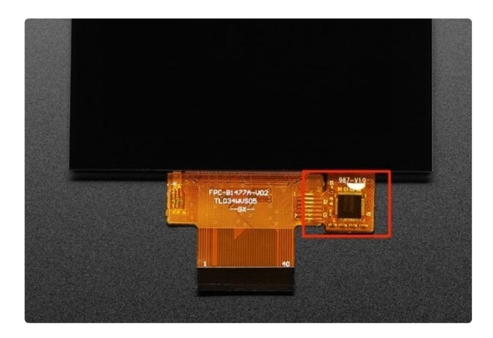

## Determining the I2C Address

You can scan for I2C devices by connecting to the REPL and typing the following:

```
import board
i2c = board.I2C()
while i2c.try_lock():
    pass
i2c.scan()
```

You should see a couple of devices listed. These will be the GPIO expander and the touch controller. The GPIO Expander is at 0x3F (or 63 in decimal) by default, though it's possible to change the address with the solderable jumpers on the reverse side. The other address should be the touch controller. On the TL040HDS20 4.0" square display, it shows up as 0x48 (or 72 in decimal), but it's possible it may be a different value on other displays.

The 2.1" Round Display has an I2C address of 0x15 .

©Adafruit Industries Page 155 of 252

## Initializing the FocalTouch Controller

In order to use the controller, it will need to first be initialized. You can use the following code to initialize it. If your I2C address differs, change it to the appropriate value.

```
import board
import busio
import adafruit_focaltouch
i2c = busio.I2C(board.SCL, board.SDA, frequency=100_000)
ctp = adafruit_focaltouch.Adafruit_FocalTouch(i2c, address=0x48)
```

Likely you will have already initialized I2C for using the GPIO expander, so you can just add the adafruit\_focaltouch import line and further down add the initialization line like this:

```
import adafruit_focaltouch
...
ctp = adafruit_focaltouch.Adafruit_FocalTouch(i2c, address=0x48)
```

## Initializing the CST826 Controller

Just like with the FocalTouch controller, the CST826 will also need to first be initialized. You can use the following code to initialize it. If your I2C address differs, change it to the appropriate value.

```
import board
import busio
import adafruit_cst8xx
i2c = busio.I2C(board.SCL, board.SDA, frequency=100_000)
ctp = adafruit_cst8xx.Adafruit_CST8XX(i2c)
```

Likely you will have already initialized I2C for using the GPIO expander, so you can just add the adafruit\_cst8xx import line and further down add the initialization line like this:

```
import adafruit_cst8xx
...
ctp = adafruit_cst8xx.Adafruit_CST8XX(i2c)
```

©Adafruit Industries Page 156 of 252

## Reading from the Touch Controller

To read from the controller, check if is has been touched in the main loop and if so, read the the touches. Although this controller can support multiple touches, it seems to sometimes have difficulty distinguishing between 2 or more touch points. For each touch point that is reported, you can then read the x and y coordinates.

```
if ctp.touched:
  for touch in ctp.touches:
    x = touch["x"]
    y = touch["y"]
```

## Example

Here is a paint demo that works on the TL040HDS20 4.0" Square display and FocalTouch library. Just click the Download Project button, unzip it, and copy it over to your CIRCUITPY drive.

```
# SPDX-FileCopyrightText: 2021 ladyada for Adafruit Industries
# SPDX-License-Identifier: MIT
"""
Simple painting demo that draws on the Adafruit Qualia ESP32-S3 RGB666
with the 4.0" square display and FT6206 captouch driver
"""
import board
import busio
import displayio
import dotclockframebuffer
from framebufferio import FramebufferDisplay
import adafruit_focaltouch
displayio.release_displays()
# Initialize the Display
tft_pins = dict(board.TFT_PINS)
tft_timings = {
    "frequency": 16000000,
    "width": 720,
    "height": 720,
    "hsync_pulse_width": 2,
    "hsync_front_porch": 46,
    "hsync_back_porch": 44,
    "vsync_pulse_width": 2,
    "vsync_front_porch": 16,
    "vsync_back_porch": 18,
    "hsync_idle_low": False,
    "vsync_idle_low": False,
    "de_idle_high": False,
    "pclk_active_high": False,
    "pclk_idle_high": False,
}
init_sequence_tl040hds20 = b""
board.I2C().deinit()
i2c = busio.I2C(board.SCL, board.SDA, frequency=100_000)
```

©Adafruit Industries Page 157 of 252

```
tft_io_expander = dict(board.TFT_IO_EXPANDER)
# tft_io_expander['i2c_address'] = 0x38 # uncomment for rev B
dotclockframebuffer.ioexpander_send_init_sequence(i2c, init_sequence_tl040hds20,
**tft_io_expander)
fb = dotclockframebuffer.DotClockFramebuffer(**tft_pins, **tft_timings)
display = FramebufferDisplay(fb, auto_refresh=False)
# Main Program
pixel_size = 6
palette_width = 160
palette_height = display.height // 8
bitmap = displayio.Bitmap(display.width, display.height, 65535)
# Create a TileGrid to hold the bitmap
tile_grid = displayio.TileGrid(
    bitmap,
pixel_shader=displayio.ColorConverter(input_colorspace=displayio.Colorspace.RGB565),
)
# Create a Group to hold the TileGrid
group = displayio.Group()
# Add the TileGrid to the Group
group.append(tile_grid)
# Add the Group to the Display
display.root_group = group
display.auto_refresh = True
ft = adafruit_focaltouch.Adafruit_FocalTouch(i2c, address=0x48)
current_color = displayio.ColorConverter().convert(0xFFFFFF)
for i in range(palette_width):
    color_index = i * 255 // palette_width
    rgb565 = displayio.ColorConverter().convert(color_index | color_index << 8 |
color_index << 16)
    r_mask = 0xF800
    g_mask = 0x07E0
    b_mask = 0x001F
    for j in range(palette_height):
        bitmap[i, j + palette_height] = rgb565 & b_mask
        bitmap[i, j + palette_height * 2] = rgb565 & (b_mask | g_mask)
        bitmap[i, j + palette_height * 3] = rgb565 & g_mask
        bitmap[i, j + palette_height * 4] = rgb565 & (r_mask | g_mask)
        bitmap[i, j + palette_height * 5] = rgb565 & r_mask
        bitmap[i, j + palette_height * 6] = rgb565 & (r_mask | b_mask)
        bitmap[i, j + palette_height * 7] = rgb565
while True:
    if ft.touched:
        try:
            for touch in ft.touches:
                x = touch["x"]
                y = touch["y"]
                if x < palette_width:
                    current_color = bitmap[x, y]
                else:
                    for i in range(pixel_size):
                        for j in range(pixel_size):
                            x_pixel = x - (pixel_size // 2) + i
                            y_pixel = y - (pixel_size // 2) + j
                            if 0 <= x_pixel < display.width and 0 <= y_pixel <
display.height:
                                bitmap[x_pixel, y_pixel] = current_color
```

©Adafruit Industries Page 158 of 252

```
except RuntimeError:
    pass
```

To use, just use your finger to paint on the canvas. You can also select a color from the left. The closer to the edge of the display, the darker, the color will be.

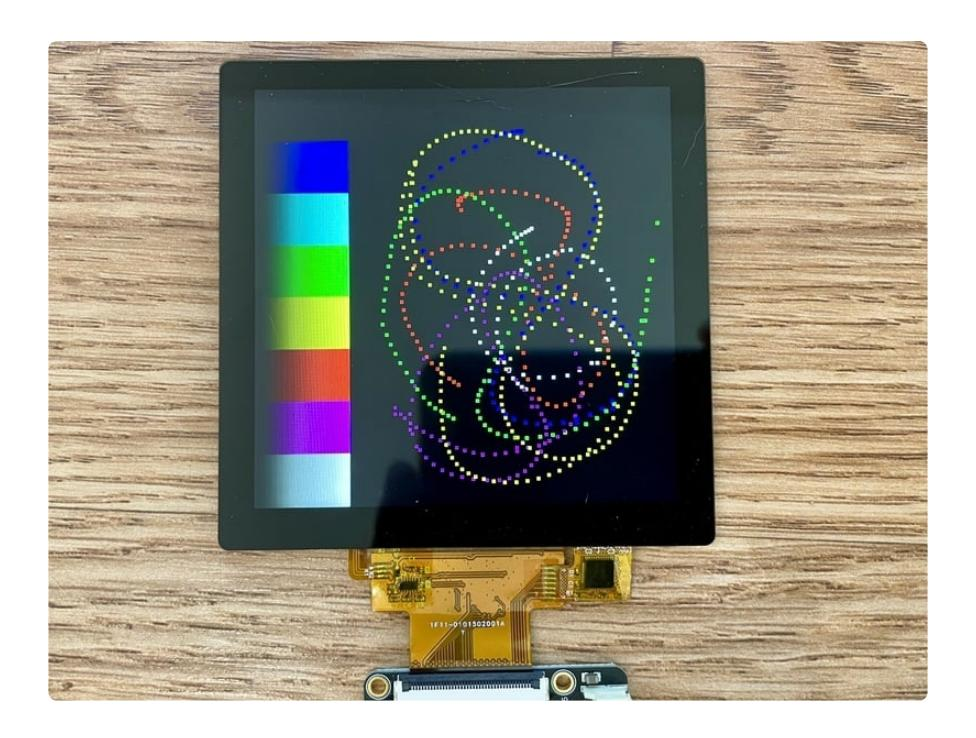

# <span id="page-158-0"></span>Qualia S3 RGB-666 with TL021WVC02 2.1" 480x480 Round Display


If you have issues running the example, you can always test your hardware by running a UF2 for your display from [https://learn.adafruit.com/adafruit-qualia](https://learn.adafruit.com/adafruit-qualia-esp32-s3-for-rgb666-displays/arduino-rainbow-demo)[esp32-s3-for-rgb666-displays/arduino-rainbow-demo](https://learn.adafruit.com/adafruit-qualia-esp32-s3-for-rgb666-displays/arduino-rainbow-demo)

## Initialization Codes

Here are the init codes for this display:

```
init_sequence_tl021wvc02 = bytes((
    0xff, 0x05, 0x77, 0x01, 0x00, 0x00, 0x10,
    0xc0, 0x02, 0x3b, 0x00,
    0xc1, 0x02, 0x0b, 0x02,
    0xc2, 0x02, 0x00, 0x02,
    0xcc, 0x01, 0x10,
```

©Adafruit Industries Page 159 of 252

```
0xcd, 0x01, 0x08,
    0xb0, 0x10, 0x02, 0x13, 0x1b, 0x0d, 0x10, 0x05, 0x08, 0x07, 0x07, 0x24, 0x04,
0x11, 0x0e, 0x2c, 0x33, 0x1d,
    0xb1, 0x10, 0x05, 0x13, 0x1b, 0x0d, 0x11, 0x05, 0x08, 0x07, 0x07, 0x24, 0x04,
0x11, 0x0e, 0x2c, 0x33, 0x1d,
    0xff, 0x05, 0x77, 0x01, 0x00, 0x00, 0x11,
    0xb0, 0x01, 0x5d,
    0xb1, 0x01, 0x43,
    0xb2, 0x01, 0x81,
    0xb3, 0x01, 0x80,
    0xb5, 0x01, 0x43,
    0xb7, 0x01, 0x85,
    0xb8, 0x01, 0x20,
    0xc1, 0x01, 0x78,
    0xc2, 0x01, 0x78,
    0xd0, 0x01, 0x88,
    0xe0, 0x03, 0x00, 0x00, 0x02,
    0xe1, 0x0b, 0x03, 0xa0, 0x00, 0x00, 0x04, 0xa0, 0x00, 0x00, 0x00, 0x20, 0x20,
    0xe2, 0x0d, 0x00, 0x00, 0x00, 0x00, 0x00, 0x00, 0x00, 0x00, 0x00, 0x00, 0x00,
0x00, 0x00,
    0xe3, 0x04, 0x00, 0x00, 0x11, 0x00,
    0xe4, 0x02, 0x22, 0x00,
    0xe5, 0x10, 0x05, 0xec, 0xa0, 0xa0, 0x07, 0xee, 0xa0, 0xa0, 0x00, 0x00, 0x00,
0x00, 0x00, 0x00, 0x00, 0x00,
    0xe6, 0x04, 0x00, 0x00, 0x11, 0x00,
    0xe7, 0x02, 0x22, 0x00,
    0xe8, 0x10, 0x06, 0xed, 0xa0, 0xa0, 0x08, 0xef, 0xa0, 0xa0, 0x00, 0x00, 0x00,
0x00, 0x00, 0x00, 0x00, 0x00,
    0xeb, 0x07, 0x00, 0x00, 0x40, 0x40, 0x00, 0x00, 0x00,
    0xed, 0x10, 0xff, 0xff, 0xff, 0xba, 0x0a, 0xbf, 0x45, 0xff, 0xff, 0x54, 0xfb,
0xa0, 0xab, 0xff, 0xff, 0xff,
    0xef, 0x06, 0x10, 0x0d, 0x04, 0x08, 0x3f, 0x1f,
    0xff, 0x05, 0x77, 0x01, 0x00, 0x00, 0x13,
    0xef, 0x01, 0x08,
    0xff, 0x05, 0x77, 0x01, 0x00, 0x00, 0x00,
    0x36, 0x01, 0x00,
    0x3a, 0x01, 0x60,
    0x11, 0x80, 0x64,
    0x29, 0x80, 0x32,
))
```

## Timings

Here are the timing settings for this display:

```
tft_timings = {
    "frequency": 16_000_000,
    "width": 480,
    "height": 480,
    "hsync_pulse_width": 20,
    "hsync_front_porch": 40,
    "hsync_back_porch": 40,
    "vsync_pulse_width": 10,
    "vsync_front_porch": 40,
    "vsync_back_porch": 40,
    "hsync_idle_low": False,
    "vsync_idle_low": False,
    "de_idle_high": False,
    "pclk_active_high": True,
    "pclk_idle_high": False,
}
```

©Adafruit Industries Page 160 of 252

## Example

Here's an example using those settings:

```
from displayio import release_displays
release_displays()
import time
import busio
import board
import dotclockframebuffer
from framebufferio import FramebufferDisplay
init_sequence_tl021wvc02 = bytes((
    0xff, 0x05, 0x77, 0x01, 0x00, 0x00, 0x10,
    0xc0, 0x02, 0x3b, 0x00,
    0xc1, 0x02, 0x0b, 0x02,
    0xc2, 0x02, 0x00, 0x02,
    0xcc, 0x01, 0x10,
    0xcd, 0x01, 0x08,
    0xb0, 0x10, 0x02, 0x13, 0x1b, 0x0d, 0x10, 0x05, 0x08, 0x07, 0x07, 0x24, 0x04,
0x11, 0x0e, 0x2c, 0x33, 0x1d,
    0xb1, 0x10, 0x05, 0x13, 0x1b, 0x0d, 0x11, 0x05, 0x08, 0x07, 0x07, 0x24, 0x04,
0x11, 0x0e, 0x2c, 0x33, 0x1d,
    0xff, 0x05, 0x77, 0x01, 0x00, 0x00, 0x11,
    0xb0, 0x01, 0x5d,
    0xb1, 0x01, 0x43,
    0xb2, 0x01, 0x81,
    0xb3, 0x01, 0x80,
    0xb5, 0x01, 0x43,
    0xb7, 0x01, 0x85,
    0xb8, 0x01, 0x20,
    0xc1, 0x01, 0x78,
    0xc2, 0x01, 0x78,
    0xd0, 0x01, 0x88,
    0xe0, 0x03, 0x00, 0x00, 0x02,
    0xe1, 0x0b, 0x03, 0xa0, 0x00, 0x00, 0x04, 0xa0, 0x00, 0x00, 0x00, 0x20, 0x20,
    0xe2, 0x0d, 0x00, 0x00, 0x00, 0x00, 0x00, 0x00, 0x00, 0x00, 0x00, 0x00, 0x00,
0x00, 0x00,
    0xe3, 0x04, 0x00, 0x00, 0x11, 0x00,
    0xe4, 0x02, 0x22, 0x00,
    0xe5, 0x10, 0x05, 0xec, 0xa0, 0xa0, 0x07, 0xee, 0xa0, 0xa0, 0x00, 0x00, 0x00,
0x00, 0x00, 0x00, 0x00, 0x00,
    0xe6, 0x04, 0x00, 0x00, 0x11, 0x00,
    0xe7, 0x02, 0x22, 0x00,
    0xe8, 0x10, 0x06, 0xed, 0xa0, 0xa0, 0x08, 0xef, 0xa0, 0xa0, 0x00, 0x00, 0x00,
0x00, 0x00, 0x00, 0x00, 0x00,
    0xeb, 0x07, 0x00, 0x00, 0x40, 0x40, 0x00, 0x00, 0x00,
    0xed, 0x10, 0xff, 0xff, 0xff, 0xba, 0x0a, 0xbf, 0x45, 0xff, 0xff, 0x54, 0xfb,
0xa0, 0xab, 0xff, 0xff, 0xff,
    0xef, 0x06, 0x10, 0x0d, 0x04, 0x08, 0x3f, 0x1f,
    0xff, 0x05, 0x77, 0x01, 0x00, 0x00, 0x13,
    0xef, 0x01, 0x08,
    0xff, 0x05, 0x77, 0x01, 0x00, 0x00, 0x00,
    0x36, 0x01, 0x00,
    0x3a, 0x01, 0x60,
    0x11, 0x80, 0x64,
    0x29, 0x80, 0x32,
))
board.I2C().deinit()
i2c = busio.I2C(board.SCL, board.SDA) #, frequency=400_000)
tft_io_expander = dict(board.TFT_IO_EXPANDER)
#tft_io_expander['i2c_address'] = 0x38 # uncomment for rev B
dotclockframebuffer.ioexpander_send_init_sequence(i2c, init_sequence_tl021wvc02,
**tft_io_expander)
```

©Adafruit Industries Page 161 of 252

```
i2c.deinit()
tft_pins = dict(board.TFT_PINS)
tft_timings = {
    "frequency": 16_000_000,
    "width": 480,
    "height": 480,
    "hsync_pulse_width": 20,
    "hsync_front_porch": 40,
    "hsync_back_porch": 40,
    "vsync_pulse_width": 10,
    "vsync_front_porch": 40,
    "vsync_back_porch": 40,
    "hsync_idle_low": False,
    "vsync_idle_low": False,
    "de_idle_high": False,
    "pclk_active_high": True,
    "pclk_idle_high": False,
}
fb = dotclockframebuffer.DotClockFramebuffer(**tft_pins, **tft_timings)
disp = FramebufferDisplay(fb, auto_refresh=False)
while True:
    for info in (tft_pins, tft_timings):
        print("\n" * 24)
        for k, v in info.items():
            print(f"{k:<20} {v}")
        disp.auto_refresh = True
        time.sleep(6)
        disp.auto_refresh = False
```

Go ahead and save the example you your CircuitPython code.py and run the code. Your display should now look like this:

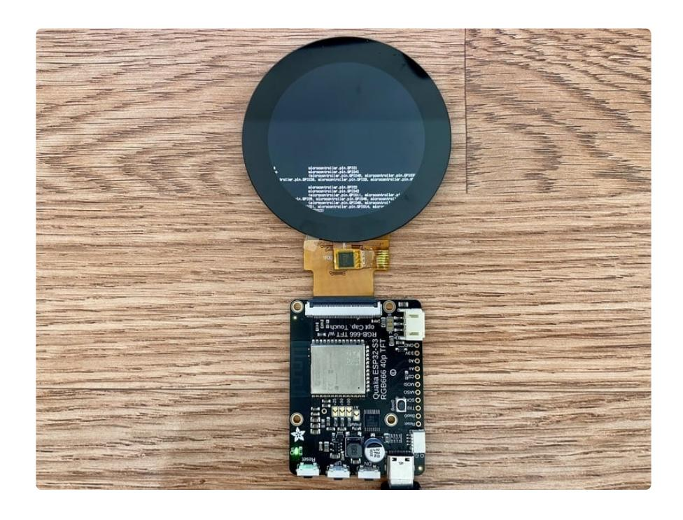

©Adafruit Industries Page 162 of 252

# <span id="page-162-0"></span>Qualia S3 RGB-666 with TL028WVC01 2.8" Round Display


If you have issues running the example, you can always test your hardware by running a UF2 for your display from [https://learn.adafruit.com/adafruit-qualia](https://learn.adafruit.com/adafruit-qualia-esp32-s3-for-rgb666-displays/arduino-rainbow-demo)[esp32-s3-for-rgb666-displays/arduino-rainbow-demo](https://learn.adafruit.com/adafruit-qualia-esp32-s3-for-rgb666-displays/arduino-rainbow-demo)

## Initialization Codes

Here are the init codes for this display:

```
init_sequence = bytes((
    b'\xff\x05w\x01\x00\x00\x13'
    b'\xef\x01\x08'
    b'\xff\x05w\x01\x00\x00\x10'
    b'\xc0\x02;\x00'
    b'\xc1\x02\x10\x0c'
    b'\xc2\x02\x07\n'
    b'\xc7\x01\x00'
    b'\xcc\x01\x10'
    b'\xcd\x01\x08'
    b'\xb0\x10\x05\x12\x98\x0e\x0f\x07\x07\t\t#\x05R\x0fg,\x11'
    b'\xb1\x10\x0b\x11\x97\x0c\x12\x06\x06\x08\x08"\x03Q\x11f+\x0f'
    b'\xff\x05w\x01\x00\x00\x11'
    b'\xb0\x01]'
    b'\xb1\x01-'
    b'\xb2\x01\x81'
    b'\xb3\x01\x80'
    b'\xb5\x01N'
    b'\xb7\x01\x85'
    b'\xb8\x01 '
    b'\xc1\x01x'
    b'\xc2\x01x'
    b'\xd0\x01\x88'
    b'\xe0\x03\x00\x00\x02'
    b'\xe1\x0b\x060\x080\x050\x070\x0033'
    b'\xe2\x0c\x11\x1133\xf4\x00\x00\x00\xf4\x00\x00\x00'
    b'\xe3\x04\x00\x00\x11\x11'
    b'\xe4\x02DD'
    b'\xe5\x10\r\xf50\xf0\x0f\xf70\xf0\t\xf10\xf0\x0b\xf30\xf0'
    b'\xe6\x04\x00\x00\x11\x11'
    b'\xe7\x02DD'
    b'\xe8\x10\x0c\xf40\xf0\x0e\xf60\xf0\x08\xf00\xf0\n\xf20\xf0'
    b'\xe9\x026\x01'
    b'\xeb\x07\x00\x01\xe4\xe4D\x88@'
    b'\xed\x10\xff\x10\xafvT+\xcf\xff\xff\xfc\xb2Eg\xfa\x01\xff'
    b'\xef\x06\x08\x08\x08E?T'
    b'\xff\x05w\x01\x00\x00\x00'
    b'\x11\x80x'
    b':\x01f'
    b'6\x01\x00'
    b'5\x01\x00'
```

©Adafruit Industries Page 163 of 252

```
b')\x802'
))
```

## Timings

Here are the timing settings for this display:

```
tft_timings = {
 "frequency": 15000000,
 "width": 480,
 "height": 480,
 "hsync_pulse_width": 2,
 "hsync_back_porch": 10,
 "hsync_front_porch": 10,
 "hsync_idle_low": False,
 "vsync_pulse_width": 6,
 "vsync_back_porch": 10,
 "vsync_front_porch": 10,
 "vsync_idle_low": False,
 "pclk_active_high": True,
 "pclk_idle_high": False,
 "de_idle_high": False,
}
```

## Example

Here's an example using those settings:

```
from displayio import release_displays
release_displays()
import displayio
import busio
import board
import dotclockframebuffer
from framebufferio import FramebufferDisplay
tft_pins = dict(board.TFT_PINS)
tft_timings = {
    "frequency": 15000000,
    "width": 480,
    "height": 480,
    "hsync_pulse_width": 2,
    "hsync_back_porch": 10,
    "hsync_front_porch": 10,
    "hsync_idle_low": False,
    "vsync_pulse_width": 6,
    "vsync_back_porch": 10,
    "vsync_front_porch": 10,
    "vsync_idle_low": False,
    "pclk_active_high": True,
    "pclk_idle_high": False,
    "de_idle_high": False,
```

©Adafruit Industries Page 164 of 252

```
}
init_sequence = bytes((
    b'\xff\x05w\x01\x00\x00\x13'
    b'\xef\x01\x08'
    b'\xff\x05w\x01\x00\x00\x10'
    b'\xc0\x02;\x00'
    b'\xc1\x02\x10\x0c'
    b'\xc2\x02\x07\n'
    b'\xc7\x01\x00'
    b'\xcc\x01\x10'
    b'\xcd\x01\x08'
    b'\xb0\x10\x05\x12\x98\x0e\x0f\x07\x07\t\t#\x05R\x0fg,\x11'
    b'\xb1\x10\x0b\x11\x97\x0c\x12\x06\x06\x08\x08"\x03Q\x11f+\x0f'
    b'\xff\x05w\x01\x00\x00\x11'
    b'\xb0\x01]'
    b'\xb1\x01-'
    b'\xb2\x01\x81'
    b'\xb3\x01\x80'
    b'\xb5\x01N'
    b'\xb7\x01\x85'
    b'\xb8\x01 '
    b'\xc1\x01x'
    b'\xc2\x01x'
    b'\xd0\x01\x88'
    b'\xe0\x03\x00\x00\x02'
    b'\xe1\x0b\x060\x080\x050\x070\x0033'
    b'\xe2\x0c\x11\x1133\xf4\x00\x00\x00\xf4\x00\x00\x00'
    b'\xe3\x04\x00\x00\x11\x11'
    b'\xe4\x02DD'
    b'\xe5\x10\r\xf50\xf0\x0f\xf70\xf0\t\xf10\xf0\x0b\xf30\xf0'
    b'\xe6\x04\x00\x00\x11\x11'
    b'\xe7\x02DD'
    b'\xe8\x10\x0c\xf40\xf0\x0e\xf60\xf0\x08\xf00\xf0\n\xf20\xf0'
    b'\xe9\x026\x01'
    b'\xeb\x07\x00\x01\xe4\xe4D\x88@'
    b'\xed\x10\xff\x10\xafvT+\xcf\xff\xff\xfc\xb2Eg\xfa\x01\xff'
    b'\xef\x06\x08\x08\x08E?T'
    b'\xff\x05w\x01\x00\x00\x00'
    b'\x11\x80x'
    b':\x01f'
    b'6\x01\x00'
    b'5\x01\x00'
    b')\x802'
))
board.I2C().deinit()
i2c = busio.I2C(board.SCL, board.SDA)
tft_io_expander = dict(board.TFT_IO_EXPANDER)
#tft_io_expander['i2c_address'] = 0x38 # uncomment for rev B
dotclockframebuffer.ioexpander_send_init_sequence(i2c, init_sequence,
**tft_io_expander)
i2c.deinit()
bitmap = displayio.OnDiskBitmap("/round-display-ruler-720p.bmp")
fb = dotclockframebuffer.DotClockFramebuffer(**tft_pins, **tft_timings)
display = FramebufferDisplay(fb, auto_refresh=False)
# Create a TileGrid to hold the bitmap
tile_grid = displayio.TileGrid(bitmap, pixel_shader=bitmap.pixel_shader)
# Center the image
tile_grid.x -= (bitmap.width - display.width) // 2
tile_grid.y -= (bitmap.height - display.height) // 2
# Create a Group to hold the TileGrid
group = displayio.Group()
```

©Adafruit Industries Page 165 of 252

```
# Add the TileGrid to the Group
group.append(tile_grid)
# Add the Group to the Display
display.root_group = group
display.auto_refresh = True
# Loop forever so you can enjoy your image
while True:
    pass
```

Download the following images into the root folder of of your CIRCUITPY drive:

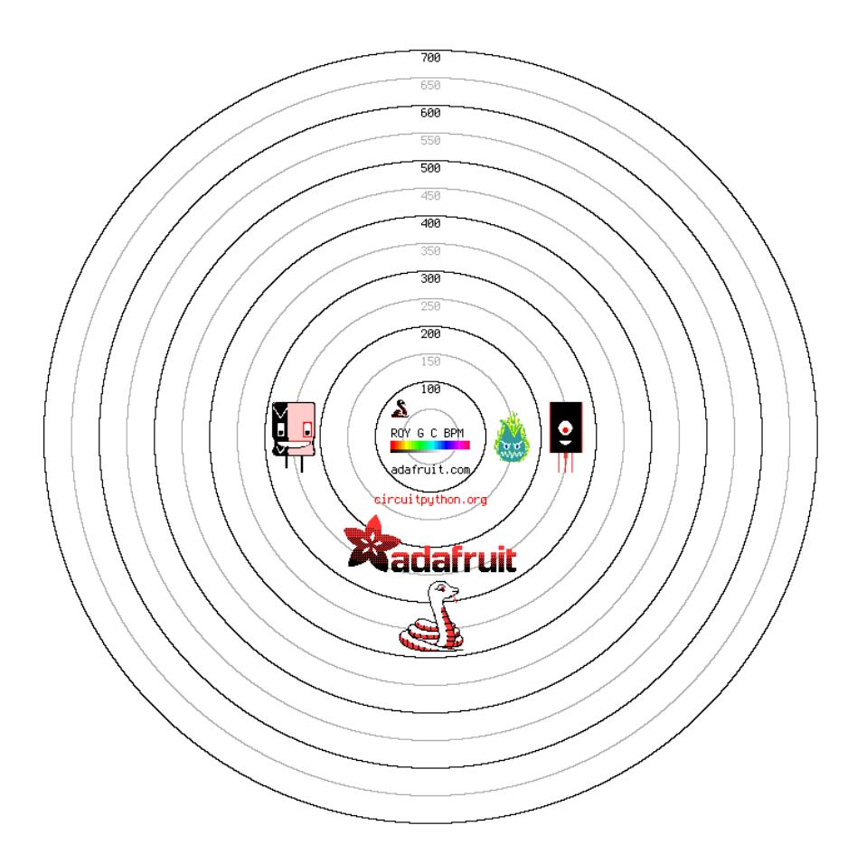

Go ahead and save the example you your CircuitPython code.py and run the code. Your display should now look like this:

©Adafruit Industries Page 166 of 252

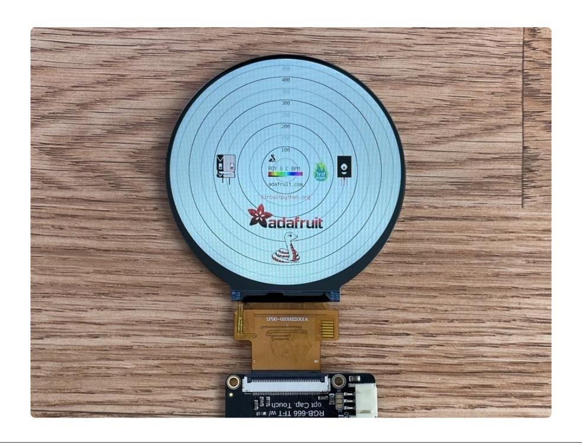

# <span id="page-166-0"></span>Qualia S3 RGB-666 with HD40015C40 4" 720x720 Round Display


If you have issues running the example, you can always test your hardware by running a UF2 for your display from [https://learn.adafruit.com/adafruit-qualia](https://learn.adafruit.com/adafruit-qualia-esp32-s3-for-rgb666-displays/arduino-rainbow-demo)[esp32-s3-for-rgb666-displays/arduino-rainbow-demo](https://learn.adafruit.com/adafruit-qualia-esp32-s3-for-rgb666-displays/arduino-rainbow-demo)

## Initialization Codes

Here are the init codes for this display:

```
init_code = bytes((
    b'\xff\x010'
    b'\xff\x01R'
    b'\xff\x01\x01'
    b'\xe3\x01\x00'
    b'\n\x01\x11'
    b'#\x01\xa0'
    b'$\x012'
    b'%\x01\x12'
    b'&\x01.'
    b"'\x01."
    b')\x01\x02'
    b'*\x01\xcf'
    b'2\x014'
    b'8\x01\x9c'
    b'9\x01\xa7'
    b":\x01'"
    b';\x01\x94'
```

©Adafruit Industries Page 167 of 252

```
b'B\x01m' b'C\x01\x83' b'\x81\x01\x00' b'\x91\x01g' b'\x92\x01g' b'\xa0\x01R' b'\xa1\x01P' b'\xa4\x01\x9c' b'\xa7\x01\x02' b'\xa8\x01\x02' b'\xa9\x01\x02' b'\xaa\x01\xa8' b'\xab\x01(' b'\xae\x01\xd2' b'\xaf\x01\x02' b'\xb0\x01\xd2' b'\xb2\x01&' b'\xb3\x01&' b'\xff\x010' b'\xff\x01R' b'\xff\x01\x02' b'\xb1\x01\n' b'\xd1\x01\x0e' b'\xb4\x01/' b'\xd4\x01-' b'\xb2\x01\x0c' b'\xd2\x01\x0c' b'\xb3\x010' b'\xd3\x01*' b'\xb6\x01\x1e' b'\xd6\x01\x16' b'\xb7\x01;' b'\xd7\x015' b'\xc1\x01\x08' b'\xe1\x01\x08' b'\xb8\x01\r' b'\xd8\x01\r' b'\xb9\x01\x05' b'\xd9\x01\x05' b'\xbd\x01\x15' b'\xdd\x01\x15' b'\xbc\x01\x13' b'\xdc\x01\x13' b'\xbb\x01\x12' b'\xdb\x01\x10' b'\xba\x01\x11' b'\xda\x01\x11' b'\xbe\x01\x17' b'\xde\x01\x17' b'\xbf\x01\x0f' b'\xdf\x01\x0f' b'\xc0\x01\x16' b'\xe0\x01\x16' b'\xb5\x01.' b'\xd5\x01?' b'\xb0\x01\x03' b'\xd0\x01\x02' b'\xff\x010' b'\xff\x01R' b'\xff\x01\x03' b'\x08\x01\t' b'\t\x01\n' b'\n\x01\x0b' b'\x0b\x01\x0c' b'(\x01"' b'*\x01\xe9' b'+\x01\xe9' b'4\x01Q' b'5\x01\x01'
```

©Adafruit Industries Page 168 of 252

```
b'6\x01&' b'7\x01\x13' b'@\x01\x07' b'A\x01\x08' b'B\x01\t' b'C\x01\n' b'D\x01"' b'E\x01\xdb' b'F\x01\xdc' b'G\x01"' b'H\x01\xdd' b'I\x01\xde' b'P\x01\x0b' b'Q\x01\x0c' b'R\x01\r' b'S\x01\x0e' b'T\x01"' b'U\x01\xdf' b'V\x01\xe0' b'W\x01"' b'X\x01\xe1' b'Y\x01\xe2' b'\x80\x01\x1e' b'\x81\x01\x1e' b'\x82\x01\x1f' b'\x83\x01\x1f' b'\x84\x01\x05' b'\x85\x01\n' b'\x86\x01\n' b'\x87\x01\x0c' b'\x88\x01\x0c' b'\x89\x01\x0e' b'\x8a\x01\x0e' b'\x8b\x01\x10' b'\x8c\x01\x10' b'\x8d\x01\x00' b'\x8e\x01\x00' b'\x8f\x01\x1f' b'\x90\x01\x1f' b'\x91\x01\x1e' b'\x92\x01\x1e' b'\x93\x01\x02' b'\x94\x01\x04' b'\x96\x01\x1e' b'\x97\x01\x1e' b'\x98\x01\x1f' b'\x99\x01\x1f' b'\x9a\x01\x05' b'\x9b\x01\t' b'\x9c\x01\t' b'\x9d\x01\x0b' b'\x9e\x01\x0b' b'\x9f\x01\r' b'\xa0\x01\r' b'\xa1\x01\x0f' b'\xa2\x01\x0f' b'\xa3\x01\x00' b'\xa4\x01\x00' b'\xa5\x01\x1f' b'\xa6\x01\x1f' b'\xa7\x01\x1e' b'\xa8\x01\x1e' b'\xa9\x01\x01' b'\xaa\x01\x03' b'\xff\x010' b'\xff\x01R' b'\xff\x01\x00' b'6\x01\n' b'\x11\x81\x00\xc8'
```

©Adafruit Industries Page 169 of 252

```
b')\x81\x00d'
))
```

## Timings

Here are the timing settings for this display:

```
tft_timings = {
    "frequency": 16000000,
    "width": 720,
    "height": 720,
    "hsync_pulse_width": 2,
    "hsync_back_porch": 44,
    "hsync_front_porch": 46,
    "hsync_idle_low": False,
    "vsync_pulse_width": 16,
    "vsync_back_porch": 16,
    "vsync_front_porch": 50,
    "vsync_idle_low": False,
    "pclk_active_high": True,
    "pclk_idle_high": False,
    "de_idle_high": False,
}
```

## Example

Here's an example using those settings:

```
from displayio import release_displays
release_displays()
import displayio
import busio
import board
import dotclockframebuffer
from framebufferio import FramebufferDisplay
init_sequence_hd40015c40 = bytes((
    b'\xff\x010'
    b'\xff\x01R'
    b'\xff\x01\x01'
    b'\xe3\x01\x00'
    b'\n\x01\x11'
    b'#\x01\xa0'
    b'$\x012'
    b'%\x01\x12'
    b'&\x01.'
    b"'\x01."
    b')\x01\x02'
    b'*\x01\xcf'
    b'2\x014'
    b'8\x01\x9c'
    b'9\x01\xa7'
    b":\x01'"
    b';\x01\x94'
    b'B\x01m'
```

©Adafruit Industries Page 170 of 252

```
b'C\x01\x83' b'\x81\x01\x00' b'\x91\x01g' b'\x92\x01g' b'\xa0\x01R' b'\xa1\x01P' b'\xa4\x01\x9c' b'\xa7\x01\x02' b'\xa8\x01\x02' b'\xa9\x01\x02' b'\xaa\x01\xa8' b'\xab\x01(' b'\xae\x01\xd2' b'\xaf\x01\x02' b'\xb0\x01\xd2' b'\xb2\x01&' b'\xb3\x01&' b'\xff\x010' b'\xff\x01R' b'\xff\x01\x02' b'\xb1\x01\n' b'\xd1\x01\x0e' b'\xb4\x01/' b'\xd4\x01-' b'\xb2\x01\x0c' b'\xd2\x01\x0c' b'\xb3\x010' b'\xd3\x01*' b'\xb6\x01\x1e' b'\xd6\x01\x16' b'\xb7\x01;' b'\xd7\x015' b'\xc1\x01\x08' b'\xe1\x01\x08' b'\xb8\x01\r' b'\xd8\x01\r' b'\xb9\x01\x05' b'\xd9\x01\x05' b'\xbd\x01\x15' b'\xdd\x01\x15' b'\xbc\x01\x13' b'\xdc\x01\x13' b'\xbb\x01\x12' b'\xdb\x01\x10' b'\xba\x01\x11' b'\xda\x01\x11' b'\xbe\x01\x17' b'\xde\x01\x17' b'\xbf\x01\x0f' b'\xdf\x01\x0f' b'\xc0\x01\x16' b'\xe0\x01\x16' b'\xb5\x01.' b'\xd5\x01?' b'\xb0\x01\x03' b'\xd0\x01\x02' b'\xff\x010' b'\xff\x01R' b'\xff\x01\x03' b'\x08\x01\t' b'\t\x01\n' b'\n\x01\x0b' b'\x0b\x01\x0c' b'(\x01"' b'*\x01\xe9' b'+\x01\xe9' b'4\x01Q' b'5\x01\x01' b'6\x01&'
```

©Adafruit Industries Page 171 of 252

```
b'7\x01\x13' b'@\x01\x07' b'A\x01\x08' b'B\x01\t' b'C\x01\n' b'D\x01"' b'E\x01\xdb' b'F\x01\xdc' b'G\x01"' b'H\x01\xdd' b'I\x01\xde' b'P\x01\x0b' b'Q\x01\x0c' b'R\x01\r' b'S\x01\x0e' b'T\x01"' b'U\x01\xdf' b'V\x01\xe0' b'W\x01"' b'X\x01\xe1' b'Y\x01\xe2' b'\x80\x01\x1e' b'\x81\x01\x1e' b'\x82\x01\x1f' b'\x83\x01\x1f' b'\x84\x01\x05' b'\x85\x01\n' b'\x86\x01\n' b'\x87\x01\x0c' b'\x88\x01\x0c' b'\x89\x01\x0e' b'\x8a\x01\x0e' b'\x8b\x01\x10' b'\x8c\x01\x10' b'\x8d\x01\x00' b'\x8e\x01\x00' b'\x8f\x01\x1f' b'\x90\x01\x1f' b'\x91\x01\x1e' b'\x92\x01\x1e' b'\x93\x01\x02' b'\x94\x01\x04' b'\x96\x01\x1e' b'\x97\x01\x1e' b'\x98\x01\x1f' b'\x99\x01\x1f' b'\x9a\x01\x05' b'\x9b\x01\t' b'\x9c\x01\t' b'\x9d\x01\x0b' b'\x9e\x01\x0b' b'\x9f\x01\r' b'\xa0\x01\r' b'\xa1\x01\x0f' b'\xa2\x01\x0f' b'\xa3\x01\x00' b'\xa4\x01\x00' b'\xa5\x01\x1f' b'\xa6\x01\x1f' b'\xa7\x01\x1e' b'\xa8\x01\x1e' b'\xa9\x01\x01' b'\xaa\x01\x03' b'\xff\x010' b'\xff\x01R' b'\xff\x01\x00' b'6\x01\n' b'\x11\x81\x00\xc8' b')\x81\x00d'
```

©Adafruit Industries Page 172 of 252

```
))
tft_pins = dict(board.TFT_PINS)
tft_timings = {
    "frequency": 16000000,
    "width": 720,
    "height": 720,
    "hsync_pulse_width": 2,
    "hsync_back_porch": 44,
    "hsync_front_porch": 46,
    "hsync_idle_low": False,
    "vsync_pulse_width": 16,
    "vsync_back_porch": 16,
    "vsync_front_porch": 50,
    "vsync_idle_low": False,
    "pclk_active_high": True,
    "pclk_idle_high": False,
    "de_idle_high": False,
}
board.I2C().deinit()
i2c = busio.I2C(board.SCL, board.SDA)
tft_io_expander = dict(board.TFT_IO_EXPANDER)
#tft_io_expander['i2c_address'] = 0x38 # uncomment for rev B
dotclockframebuffer.ioexpander_send_init_sequence(i2c, init_sequence_hd40015c40,
**tft_io_expander)
i2c.deinit()
bitmap = displayio.OnDiskBitmap("/round-display-ruler-720p.bmp")
fb = dotclockframebuffer.DotClockFramebuffer(**tft_pins, **tft_timings)
display = FramebufferDisplay(fb, auto_refresh=False)
# Create a TileGrid to hold the bitmap
tile_grid = displayio.TileGrid(bitmap, pixel_shader=bitmap.pixel_shader)
# Center the image
tile_grid.x -= (bitmap.width - display.width) // 2
tile_grid.y -= (bitmap.height - display.height) // 2
# Create a Group to hold the TileGrid
group = displayio.Group()
# Add the TileGrid to the Group
group.append(tile_grid)
# Add the Group to the Display
display.root_group = group
display.auto_refresh = True
# Loop forever so you can enjoy your image
while True:
    pass
```

Download the following image into the root folder of of your CIRCUITPY drive:

©Adafruit Industries Page 173 of 252


Go ahead and save the example you your CircuitPython code.py and run the code. Your display should now look like this:

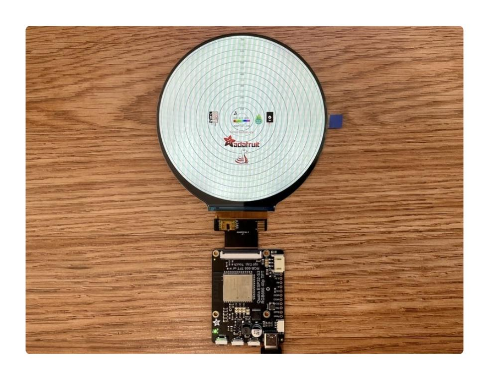

©Adafruit Industries Page 174 of 252

# <span id="page-174-0"></span>Qualia S3 RGB-666 with TL034WVS05 3.4" 480x480 Square Display


If you have issues running the example, you can always test your hardware by running a UF2 for your display from [https://learn.adafruit.com/adafruit-qualia](https://learn.adafruit.com/adafruit-qualia-esp32-s3-for-rgb666-displays/arduino-rainbow-demo)[esp32-s3-for-rgb666-displays/arduino-rainbow-demo](https://learn.adafruit.com/adafruit-qualia-esp32-s3-for-rgb666-displays/arduino-rainbow-demo)

## Initialization Codes

Here are the init codes for this display:

```
init_sequence_tl034wvs05 = bytes((
    b'\xff\x05w\x01\x00\x00\x13'
    b'\xef\x01\x08'
    b'\xff\x05w\x01\x00\x00\x10'
    b'\xc0\x02;\x00'
    b'\xc1\x02\x12\n'
    b'\xc2\x02\x07\x03'
    b'\xc3\x01\x02'
    b'\xcc\x01\x10'
    b'\xcd\x01\x08'
    b'\xb0\x10\x0f\x11\x17\x15\x15\t\x0c\x08\x08&\x04Y\x16f-\x1f'
    b'\xb1\x10\x0f\x11\x17\x15\x15\t\x0c\x08\x08&\x04Y\x16f-\x1f'
    b'\xff\x05w\x01\x00\x00\x11'
    b'\xb0\x01m'
    b'\xb1\x01:'
    b'\xb2\x01\x01'
    b'\xb3\x01\x80'
    b'\xb5\x01I'
    b'\xb7\x01\x85'
    b'\xb8\x01 '
    b'\xc1\x01x'
    b'\xc2\x01x'
    b'\xd0\x01\x88'
    b'\xe0\x03\x00\x00\x02'
    b'\xe1\x0b\x07\x00\t\x00\x06\x00\x08\x00\x0033'
    b'\xe2\r\x11\x1133\xf6\x00\xf6\x00\xf6\x00\xf6\x00\x00'
    b'\xe3\x04\x00\x00\x11\x11'
    b'\xe4\x02DD'
    b'\xe5\x10\x0f\xf3=\xff\x11\xf5=\xff\x0b\xef=\xff\r\xf1=\xff'
    b'\xe6\x04\x00\x00\x11\x11'
    b'\xe7\x02DD'
    b'\xe8\x10\x0e\xf2=\xff\x10\xf4=\xff\n\xee=\xff\x0c\xf0=\xff'
    b'\xe9\x026\x00'
    b'\xeb\x07\x00\x01\xe4\xe4D\xaa\x10'
    b'\xec\x02<\x00'
    b'\xed\x10\xffEg\xfa\x01+\xcf\xff\xff\xfc\xb2\x10\xafvT\xff'
    b'\xef\x06\x10\r\x04\x08?\x1f'
    b'\xff\x05w\x01\x00\x00\x00'
    b'5\x01\x00'
    b':\x01f'
    b'\x11\x80x'
```

©Adafruit Industries Page 175 of 252

```
b')\x802'
))
```

## Timings

Here are the timing settings for this display:

```
tft_timings = {
    "frequency": 16000000,
    "width": 480,
    "height": 480,
    "hsync_pulse_width": 20,
    "hsync_front_porch": 40,
    "hsync_back_porch": 40,
    "vsync_pulse_width": 10,
    "vsync_front_porch": 40,
    "vsync_back_porch": 40,
    "hsync_idle_low": False,
    "vsync_idle_low": False,
    "de_idle_high": False,
    "pclk_active_high": False,
    "pclk_idle_high": False,
}
```

## Example

Here's an example using those settings:

```
from displayio import release_displays
release_displays()
import displayio
import busio
import board
import dotclockframebuffer
from framebufferio import FramebufferDisplay
tft_pins = dict(board.TFT_PINS)
tft_timings = {
    "frequency": 16000000,
    "width": 480,
    "height": 480,
    "hsync_pulse_width": 20,
    "hsync_front_porch": 40,
    "hsync_back_porch": 40,
    "vsync_pulse_width": 10,
    "vsync_front_porch": 40,
    "vsync_back_porch": 40,
    "hsync_idle_low": False,
    "vsync_idle_low": False,
    "de_idle_high": False,
    "pclk_active_high": False,
    "pclk_idle_high": False,
}
init_sequence_tl034wvs05 = bytes((
    b'\xff\x05w\x01\x00\x00\x13'
    b'\xef\x01\x08'
```

©Adafruit Industries Page 176 of 252

```
b'\xff\x05w\x01\x00\x00\x10'
    b'\xc0\x02;\x00'
    b'\xc1\x02\x12\n'
    b'\xc2\x02\x07\x03'
    b'\xc3\x01\x02'
    b'\xcc\x01\x10'
    b'\xcd\x01\x08'
    b'\xb0\x10\x0f\x11\x17\x15\x15\t\x0c\x08\x08&\x04Y\x16f-\x1f'
    b'\xb1\x10\x0f\x11\x17\x15\x15\t\x0c\x08\x08&\x04Y\x16f-\x1f'
    b'\xff\x05w\x01\x00\x00\x11'
    b'\xb0\x01m'
    b'\xb1\x01:'
    b'\xb2\x01\x01'
    b'\xb3\x01\x80'
    b'\xb5\x01I'
    b'\xb7\x01\x85'
    b'\xb8\x01 '
    b'\xc1\x01x'
    b'\xc2\x01x'
    b'\xd0\x01\x88'
    b'\xe0\x03\x00\x00\x02'
    b'\xe1\x0b\x07\x00\t\x00\x06\x00\x08\x00\x0033'
    b'\xe2\r\x11\x1133\xf6\x00\xf6\x00\xf6\x00\xf6\x00\x00'
    b'\xe3\x04\x00\x00\x11\x11'
    b'\xe4\x02DD'
    b'\xe5\x10\x0f\xf3=\xff\x11\xf5=\xff\x0b\xef=\xff\r\xf1=\xff'
    b'\xe6\x04\x00\x00\x11\x11'
    b'\xe7\x02DD'
    b'\xe8\x10\x0e\xf2=\xff\x10\xf4=\xff\n\xee=\xff\x0c\xf0=\xff'
    b'\xe9\x026\x00'
    b'\xeb\x07\x00\x01\xe4\xe4D\xaa\x10'
    b'\xec\x02<\x00'
    b'\xed\x10\xffEg\xfa\x01+\xcf\xff\xff\xfc\xb2\x10\xafvT\xff'
    b'\xef\x06\x10\r\x04\x08?\x1f'
    b'\xff\x05w\x01\x00\x00\x00'
    b'5\x01\x00'
    b':\x01f'
    b'\x11\x80x'
    b')\x802'
))
board.I2C().deinit()
i2c = busio.I2C(board.SCL, board.SDA)
tft_io_expander = dict(board.TFT_IO_EXPANDER)
#tft_io_expander['i2c_address'] = 0x38 # uncomment for rev B
dotclockframebuffer.ioexpander_send_init_sequence(i2c, init_sequence_tl034wvs05,
**tft_io_expander)
i2c.deinit()
bitmap = displayio.OnDiskBitmap("/display-ruler-720p.bmp")
fb = dotclockframebuffer.DotClockFramebuffer(**tft_pins, **tft_timings)
display = FramebufferDisplay(fb, auto_refresh=False)
# Create a TileGrid to hold the bitmap
tile_grid = displayio.TileGrid(bitmap, pixel_shader=bitmap.pixel_shader)
# Create a Group to hold the TileGrid
group = displayio.Group()
# Add the TileGrid to the Group
group.append(tile_grid)
# Add the Group to the Display
display.root_group = group
display.auto_refresh = True
# Loop forever so you can enjoy your image
```

©Adafruit Industries Page 177 of 252

Download the following image into the root folder of of your CIRCUITPY drive:


Go ahead and save the example you your CircuitPython code.py and run the code. Your display should now look like this:

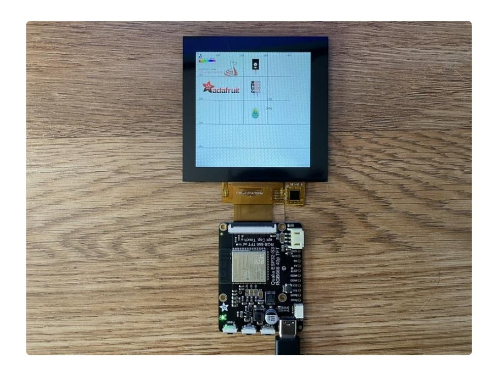

©Adafruit Industries Page 178 of 252

# <span id="page-178-0"></span>Qualia S3 RGB-666 with TL040WVS03 4" 480x480 Square Display


If you have issues running the example, you can always test your hardware by running a UF2 for your display from [https://learn.adafruit.com/adafruit-qualia](https://learn.adafruit.com/adafruit-qualia-esp32-s3-for-rgb666-displays/arduino-rainbow-demo)[esp32-s3-for-rgb666-displays/arduino-rainbow-demo](https://learn.adafruit.com/adafruit-qualia-esp32-s3-for-rgb666-displays/arduino-rainbow-demo)

## Initialization Codes

Here are the init codes for this display:

```
init_sequence_tl040wvs03 = bytes((
    b'\xff\x05w\x01\x00\x00\x10'
    b'\xc0\x02;\x00'
    b'\xc1\x02\r\x02'
    b'\xc2\x021\x05'
    b'\xcd\x01\x08'
    b'\xb0\x10\x00\x11\x18\x0e\x11\x06\x07\x08\x07"\x04\x12\x0f\xaa1\x18'
    b'\xb1\x10\x00\x11\x19\x0e\x12\x07\x08\x08\x08"\x04\x11\x11\xa92\x18'
    b'\xff\x05w\x01\x00\x00\x11'
    b'\xb0\x01`'
    b'\xb1\x012'
    b'\xb2\x01\x07'
    b'\xb3\x01\x80'
    b'\xb5\x01I'
    b'\xb7\x01\x85'
    b'\xb8\x01!'
    b'\xc1\x01x'
    b'\xc2\x01x'
    b'\xe0\x03\x00\x1b\x02'
    b'\xe1\x0b\x08\xa0\x00\x00\x07\xa0\x00\x00\x00DD'
    b'\xe2\x0c\x11\x11DD\xed\xa0\x00\x00\xec\xa0\x00\x00'
    b'\xe3\x04\x00\x00\x11\x11'
    b'\xe4\x02DD'
    b'\xe5\x10\n\xe9\xd8\xa0\x0c\xeb\xd8\xa0\x0e\xed\xd8\xa0\x10\xef\xd8\xa0'
    b'\xe6\x04\x00\x00\x11\x11'
    b'\xe7\x02DD'
    b'\xe8\x10\t\xe8\xd8\xa0\x0b\xea\xd8\xa0\r\xec\xd8\xa0\x0f\xee\xd8\xa0'
    b'\xeb\x07\x02\x00\xe4\xe4\x88\x00@'
    b'\xec\x02<\x00'
    b'\xed\x10\xab\x89vT\x02\xff\xff\xff\xff\xff\xff Eg\x98\xba'
    b'6\x01\x00'
    b'\xff\x05w\x01\x00\x00\x13'
    b'\xe5\x01\xe4'
    b'\xff\x05w\x01\x00\x00\x00'
    b':\x01f'
    b'!\x80\n'
    b'\x11\x80x'
    b')\x00'
))
```

©Adafruit Industries Page 179 of 252

## Timings

Here are the timing settings for this display:

```
tft_timings = {
    "frequency": 16000000,
    "width": 480,
    "height": 480,
    "hsync_pulse_width": 2,
    "hsync_back_porch": 44,
    "hsync_front_porch": 50,
    "hsync_idle_low": False,
    "vsync_pulse_width": 2,
    "vsync_back_porch": 18,
    "vsync_front_porch": 16,
    "vsync_idle_low": False,
    "pclk_active_high": True,
    "pclk_idle_high": False,
    "de_idle_high": False,
}
```

## Example

Here's an example using those settings:

```
from displayio import release_displays
release_displays()
import displayio
import busio
import board
import dotclockframebuffer
from framebufferio import FramebufferDisplay
tft_pins = dict(board.TFT_PINS)
tft_timings = {
    "frequency": 16000000,
    "width": 480,
    "height": 480,
    "hsync_pulse_width": 2,
    "hsync_back_porch": 44,
    "hsync_front_porch": 50,
    "hsync_idle_low": False,
    "vsync_pulse_width": 2,
    "vsync_back_porch": 18,
    "vsync_front_porch": 16,
    "vsync_idle_low": False,
    "pclk_active_high": True,
    "pclk_idle_high": False,
    "de_idle_high": False,
}
init_sequence = bytes((
    b'\xff\x05w\x01\x00\x00\x10'
    b'\xc0\x02;\x00'
    b'\xc1\x02\r\x02'
```

©Adafruit Industries Page 180 of 252

```
b'\xc2\x021\x05'
    b'\xcd\x01\x08'
    b'\xb0\x10\x00\x11\x18\x0e\x11\x06\x07\x08\x07"\x04\x12\x0f\xaa1\x18'
    b'\xb1\x10\x00\x11\x19\x0e\x12\x07\x08\x08\x08"\x04\x11\x11\xa92\x18'
    b'\xff\x05w\x01\x00\x00\x11'
    b'\xb0\x01`'
    b'\xb1\x012'
    b'\xb2\x01\x07'
    b'\xb3\x01\x80'
    b'\xb5\x01I'
    b'\xb7\x01\x85'
    b'\xb8\x01!'
    b'\xc1\x01x'
    b'\xc2\x01x'
    b'\xe0\x03\x00\x1b\x02'
    b'\xe1\x0b\x08\xa0\x00\x00\x07\xa0\x00\x00\x00DD'
    b'\xe2\x0c\x11\x11DD\xed\xa0\x00\x00\xec\xa0\x00\x00'
    b'\xe3\x04\x00\x00\x11\x11'
    b'\xe4\x02DD'
    b'\xe5\x10\n\xe9\xd8\xa0\x0c\xeb\xd8\xa0\x0e\xed\xd8\xa0\x10\xef\xd8\xa0'
    b'\xe6\x04\x00\x00\x11\x11'
    b'\xe7\x02DD'
    b'\xe8\x10\t\xe8\xd8\xa0\x0b\xea\xd8\xa0\r\xec\xd8\xa0\x0f\xee\xd8\xa0'
    b'\xeb\x07\x02\x00\xe4\xe4\x88\x00@'
    b'\xec\x02<\x00'
    b'\xed\x10\xab\x89vT\x02\xff\xff\xff\xff\xff\xff Eg\x98\xba'
    b'6\x01\x00'
    b'\xff\x05w\x01\x00\x00\x13'
    b'\xe5\x01\xe4'
    b'\xff\x05w\x01\x00\x00\x00'
    b':\x01f'
    b'!\x80\n'
    b'\x11\x80x'
    b')\x00'
))
board.I2C().deinit()
i2c = busio.I2C(board.SCL, board.SDA)
tft_io_expander = dict(board.TFT_IO_EXPANDER)
#tft_io_expander['i2c_address'] = 0x38 # uncomment for rev B
dotclockframebuffer.ioexpander_send_init_sequence(i2c, init_sequence,
**tft_io_expander)
i2c.deinit()
bitmap = displayio.OnDiskBitmap("/display-ruler-720p.bmp")
fb = dotclockframebuffer.DotClockFramebuffer(**tft_pins, **tft_timings)
display = FramebufferDisplay(fb, auto_refresh=False)
# Create a TileGrid to hold the bitmap
tile_grid = displayio.TileGrid(bitmap, pixel_shader=bitmap.pixel_shader)
# Create a Group to hold the TileGrid
group = displayio.Group()
# Add the TileGrid to the Group
group.append(tile_grid)
# Add the Group to the Display
display.root_group = group
display.auto_refresh = True
# Loop forever so you can enjoy your image
while True:
    pass
```

©Adafruit Industries Page 181 of 252

Download the following image into the root folder of of your CIRCUITPY drive:


Go ahead and save the example you your CircuitPython code.py and run the code. Your display should now look like this:

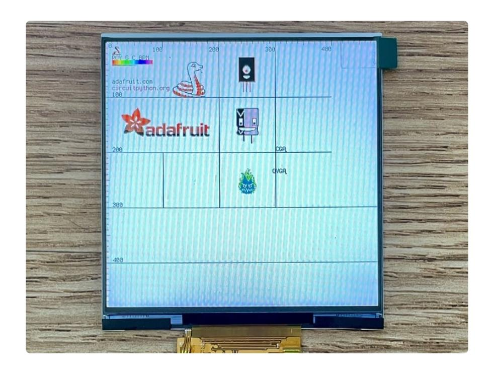

©Adafruit Industries Page 182 of 252

# <span id="page-182-0"></span>Qualia S3 RGB-666 with TL040HDS20 4.0" 720x720 Square Display


If you have issues running the example, you can always test your hardware by running a UF2 for your display from [https://learn.adafruit.com/adafruit-qualia](https://learn.adafruit.com/adafruit-qualia-esp32-s3-for-rgb666-displays/arduino-rainbow-demo)[esp32-s3-for-rgb666-displays/arduino-rainbow-demo](https://learn.adafruit.com/adafruit-qualia-esp32-s3-for-rgb666-displays/arduino-rainbow-demo)

## Initialization Codes

Here are the init codes for this display:


This display is the easiest display and needs no initialization.

```
init_sequence_tl040hds20 = bytes()
```

## Timings

Here are the timing settings for this display:

```
tft_timings = {
    "frequency": 16000000,
    "width": 720,
    "height": 720,
    "hsync_pulse_width": 2,
    "hsync_front_porch": 46,
    "hsync_back_porch": 44,
    "vsync_pulse_width": 2,
    "vsync_front_porch": 16,
    "vsync_back_porch": 18,
    "hsync_idle_low": False,
    "vsync_idle_low": False,
    "de_idle_high": False,
    "pclk_active_high": False,
    "pclk_idle_high": False,
}
```

©Adafruit Industries Page 183 of 252

## Example

Here's an example using those settings:

```
from displayio import release_displays
release_displays()
import displayio
import busio
import board
import dotclockframebuffer
from framebufferio import FramebufferDisplay
tft_pins = dict(board.TFT_PINS)
tft_timings = {
    "frequency": 16000000,
    "width": 720,
    "height": 720,
    "hsync_pulse_width": 2,
    "hsync_front_porch": 46,
    "hsync_back_porch": 44,
    "vsync_pulse_width": 2,
    "vsync_front_porch": 16,
    "vsync_back_porch": 18,
    "hsync_idle_low": False,
    "vsync_idle_low": False,
    "de_idle_high": False,
    "pclk_active_high": False,
    "pclk_idle_high": False,
}
init_sequence_tl040hds20 = bytes()
board.I2C().deinit()
i2c = busio.I2C(board.SCL, board.SDA)
tft_io_expander = dict(board.TFT_IO_EXPANDER)
#tft_io_expander['i2c_address'] = 0x38 # uncomment for rev B
dotclockframebuffer.ioexpander_send_init_sequence(i2c, init_sequence_tl040hds20,
**tft_io_expander)
i2c.deinit()
bitmap = displayio.OnDiskBitmap("/display-ruler-720p.bmp")
fb = dotclockframebuffer.DotClockFramebuffer(**tft_pins, **tft_timings)
display = FramebufferDisplay(fb, auto_refresh=False)
# Create a TileGrid to hold the bitmap
tile_grid = displayio.TileGrid(bitmap, pixel_shader=bitmap.pixel_shader)
# Create a Group to hold the TileGrid
group = displayio.Group()
# Add the TileGrid to the Group
group.append(tile_grid)
# Add the Group to the Display
display.root_group = group
display.auto_refresh = True
# Loop forever so you can enjoy your image
while True:
    pass
```

©Adafruit Industries Page 184 of 252

Download the following image into the root folder of of your CIRCUITPY drive:

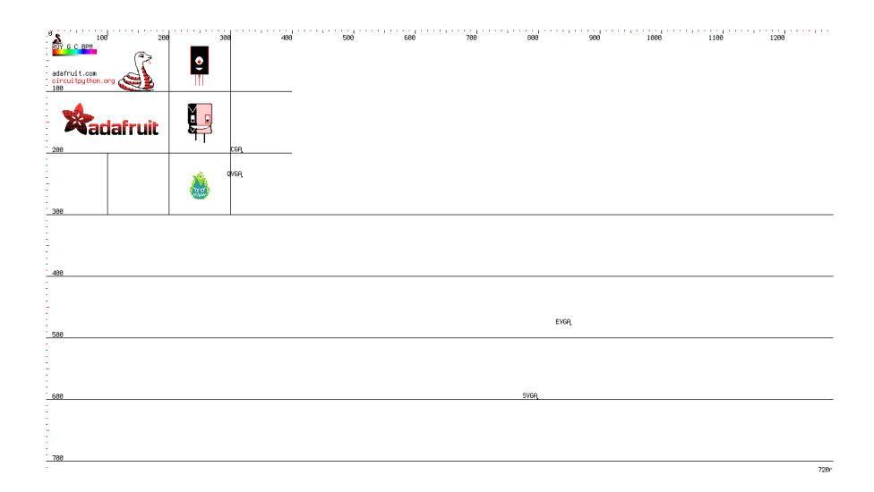

Go ahead and save the example you your CircuitPython code.py and run the code. Your display should now look like this:

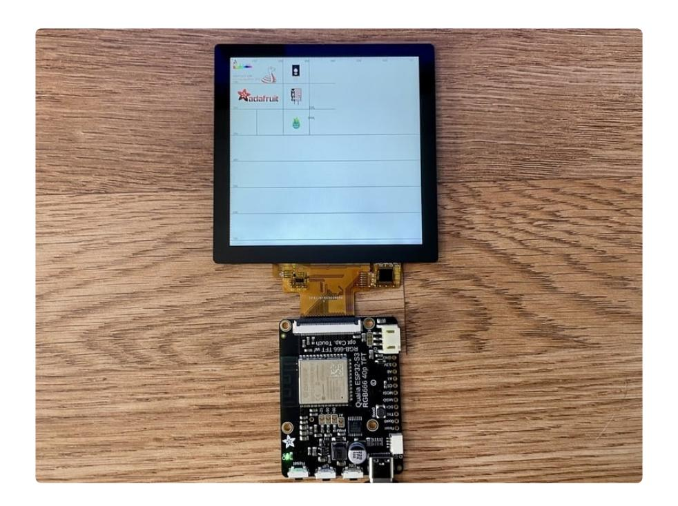

©Adafruit Industries Page 185 of 252

# <span id="page-185-0"></span>Qualia S3 RGB-666 with TL032FWV01 3.2" 320x820 Bar Display


If you have issues running the example, you can always test your hardware by running a UF2 for your display from [https://learn.adafruit.com/adafruit-qualia](https://learn.adafruit.com/adafruit-qualia-esp32-s3-for-rgb666-displays/arduino-rainbow-demo)[esp32-s3-for-rgb666-displays/arduino-rainbow-demo](https://learn.adafruit.com/adafruit-qualia-esp32-s3-for-rgb666-displays/arduino-rainbow-demo)

## Initialization Codes

Here are the init codes for this display:

```
init_sequence_tl032 = bytes((
    b'\x11\x80d'
    b'\xff\x05w\x01\x00\x00\x13'
    b'\xef\x01\x08'
    b'\xff\x05w\x01\x00\x00\x10'
    b'\xc0\x02\xe5\x02'
    b'\xc1\x02\x0c\n'
    b'\xc2\x02\x07\x0f'
    b'\xc3\x01\x02'
    b'\xcc\x01\x10'
    b'\xcd\x01\x08'
    b'\xb0\x10\x00\x08Q\r\xce\x06\x00\x08\x08\x1d\x02\xd0\x0fo6?'
    b'\xb1\x10\x00\x10O\x0c\x11\x05\x00\x07\x07\x1f\x05\xd3\x11n4?'
    b'\xff\x05w\x01\x00\x00\x11'
    b'\xb0\x01M'
    b'\xb1\x01\x1c'
    b'\xb2\x01\x87'
    b'\xb3\x01\x80'
    b'\xb5\x01G'
    b'\xb7\x01\x85'
    b'\xb8\x01!'
    b'\xb9\x01\x10'
    b'\xc1\x01x'
    b'\xc2\x01x'
    b'\xd0\x81\x88d'
    b'\xe0\x03\x80\x00\x02'
    b'\xe1\x0b\x04\xa0\x00\x00\x05\xa0\x00\x00\x00``'
    b'\xe2\r00``<\xa0\x00\x00=\xa0\x00\x00\x00'
    b'\xe3\x04\x00\x0033'
    b'\xe4\x02DD'
    b'\xe5\x10\x06>\xa0\xa0\x08@\xa0\xa0\nB\xa0\xa0\x0cD\xa0\xa0'
    b'\xe6\x04\x00\x0033'
    b'\xe7\x02DD'
    b'\xe8\x10\x07?\xa0\xa0\tA\xa0\xa0\x0bC\xa0\xa0\rE\xa0\xa0'
    b'\xeb\x07\x00\x01NN\xeeD\x00'
    b"\xed\x10\xff\xff\x04Vr\xff\xff\xff\xff\xff\xff'e@\xff\xff"
    b'\xef\x06\x10\r\x04\x08?\x1f'
    b'\xff\x05w\x01\x00\x00\x13'
    b'\xe8\x02\x00\x0e'
    b'\xff\x05w\x01\x00\x00\x00'
    b'\x11\x80x'
    b'\xff\x05w\x01\x00\x00\x13'
    b'\xe8\x82\x00\x0c\n'
```

©Adafruit Industries Page 186 of 252

```
b'\xe8\x02\x00\x00'
    b'\xff\x05w\x01\x00\x00\x00'
    b'6\x01\x00'
    b':\x01f'
    b'\x11\x80x'
    b')\x80x'
))
```

## Timings

Here are the timing settings for this display:

```
tft_timings = {
    "frequency": 16000000,
    "width": 320,
    "height": 820,
    "hsync_pulse_width": 3,
    "hsync_back_porch": 251,
    "hsync_front_porch": 150,
    "hsync_idle_low": False,
    "vsync_pulse_width": 6,
    "vsync_back_porch": 90,
    "vsync_front_porch": 100,
    "vsync_idle_low": False,
    "pclk_active_high": False,
    "pclk_idle_high": False,
    "de_idle_high": False,
}
```

## Example

Here's an example using those settings:

```
from displayio import release_displays
release_displays()
import random
import displayio
import time
import busio
import board
import dotclockframebuffer
from framebufferio import FramebufferDisplay
init_sequence_tl032 = bytes((
    b'\x11\x80d'
    b'\xff\x05w\x01\x00\x00\x13'
    b'\xef\x01\x08'
    b'\xff\x05w\x01\x00\x00\x10'
    b'\xc0\x02\xe5\x02'
    b'\xc1\x02\x0c\n'
    b'\xc2\x02\x07\x0f'
    b'\xc3\x01\x02'
    b'\xcc\x01\x10'
    b'\xcd\x01\x08'
    b'\xb0\x10\x00\x08Q\r\xce\x06\x00\x08\x08\x1d\x02\xd0\x0fo6?'
```

©Adafruit Industries Page 187 of 252

```
b'\xb1\x10\x00\x10O\x0c\x11\x05\x00\x07\x07\x1f\x05\xd3\x11n4?'
    b'\xff\x05w\x01\x00\x00\x11'
    b'\xb0\x01M'
    b'\xb1\x01\x1c'
    b'\xb2\x01\x87'
    b'\xb3\x01\x80'
    b'\xb5\x01G'
    b'\xb7\x01\x85'
    b'\xb8\x01!'
    b'\xb9\x01\x10'
    b'\xc1\x01x'
    b'\xc2\x01x'
    b'\xd0\x81\x88d'
    b'\xe0\x03\x80\x00\x02'
    b'\xe1\x0b\x04\xa0\x00\x00\x05\xa0\x00\x00\x00``'
    b'\xe2\r00``<\xa0\x00\x00=\xa0\x00\x00\x00'
    b'\xe3\x04\x00\x0033'
    b'\xe4\x02DD'
    b'\xe5\x10\x06>\xa0\xa0\x08@\xa0\xa0\nB\xa0\xa0\x0cD\xa0\xa0'
    b'\xe6\x04\x00\x0033'
    b'\xe7\x02DD'
    b'\xe8\x10\x07?\xa0\xa0\tA\xa0\xa0\x0bC\xa0\xa0\rE\xa0\xa0'
    b'\xeb\x07\x00\x01NN\xeeD\x00'
    b"\xed\x10\xff\xff\x04Vr\xff\xff\xff\xff\xff\xff'e@\xff\xff"
    b'\xef\x06\x10\r\x04\x08?\x1f'
    b'\xff\x05w\x01\x00\x00\x13'
    b'\xe8\x02\x00\x0e'
    b'\xff\x05w\x01\x00\x00\x00'
    b'\x11\x80x'
    b'\xff\x05w\x01\x00\x00\x13'
    b'\xe8\x82\x00\x0c\n'
    b'\xe8\x02\x00\x00'
    b'\xff\x05w\x01\x00\x00\x00'
    b'6\x01\x00'
    b':\x01f'
    b'\x11\x80x'
    b')\x80x'
))
board.I2C().deinit()
i2c = busio.I2C(board.SCL, board.SDA, frequency=400_000)
tft_io_expander = dict(board.TFT_IO_EXPANDER)
#tft_io_expander['i2c_address'] = 0x38 # uncomment for rev B
dotclockframebuffer.ioexpander_send_init_sequence(i2c, init_sequence_tl032,
**tft_io_expander)
i2c.deinit()
tft_pins = dict(board.TFT_PINS)
tft_timings = {
    "frequency": 16000000,
    "width": 320,
    "height": 820,
    "hsync_pulse_width": 3,
    "hsync_back_porch": 251,
    "hsync_front_porch": 150,
    "hsync_idle_low": False,
    "vsync_pulse_width": 6,
    "vsync_back_porch": 90,
    "vsync_front_porch": 100,
    "vsync_idle_low": False,
    "pclk_active_high": False,
    "pclk_idle_high": False,
    "de_idle_high": False,
}
```

©Adafruit Industries Page 188 of 252

```
#bitmap = displayio.OnDiskBitmap("/display-ruler-720p.bmp")
bitmap = displayio.Bitmap(256, 7*64, 65535)
fb = dotclockframebuffer.DotClockFramebuffer(**tft_pins, **tft_timings)
display = FramebufferDisplay(fb, auto_refresh=False)
# Create a TileGrid to hold the bitmap
tile_grid = displayio.TileGrid(bitmap,
pixel_shader=displayio.ColorConverter(input_colorspace=displayio.Colorspace.RGB565))
# Create a Group to hold the TileGrid
group = displayio.Group()
# Add the TileGrid to the Group
group.append(tile_grid)
# Add the Group to the Display
display.root_group = group
display.auto_refresh = True
for i in range(256):
    b = i >> 3
    g = (i >> 2) << 5
    r = b << 11
    for j in range(64):
        bitmap[i, j] = b
        bitmap[i, j+64] = b|g
        bitmap[i, j+128] = g
        bitmap[i, j+192] = g|r
        bitmap[i, j+256] = r
        bitmap[i, j+320] = r|b
        bitmap[i, j+384] = r|g|b
# Loop forever so you can enjoy your image
while True:
    time.sleep(1)
    display.auto_refresh = False
    group.x = random.randint(0, 32)
    group.y = random.randint(0, 32)
    display.auto_refresh = True
    pass
```

Go ahead and save the example you your CircuitPython code.py and run the code. Your display should now look like this:

©Adafruit Industries Page 189 of 252

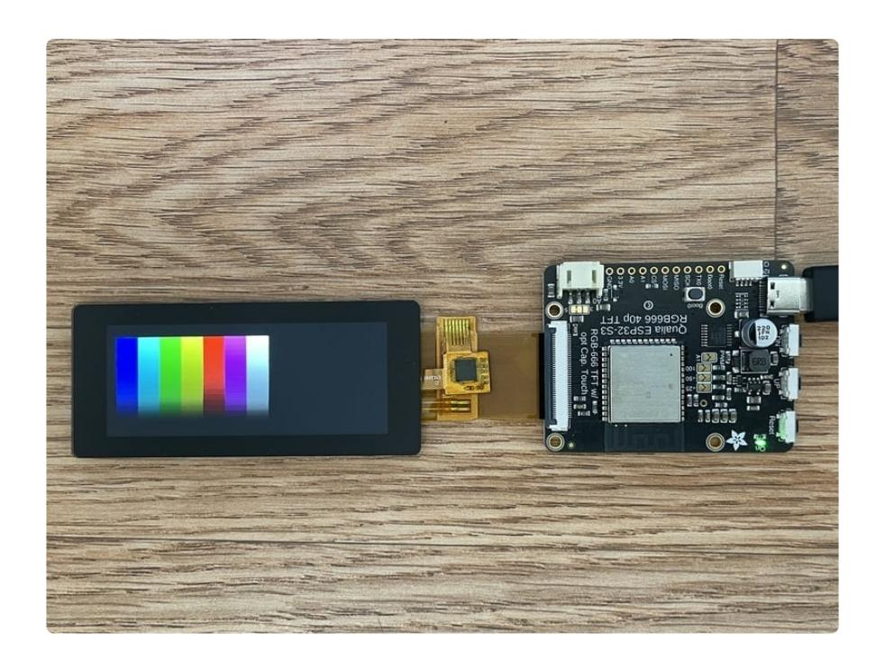

# <span id="page-189-0"></span>Qualia S3 RGB-666 with HD371001C 3.7" 240x960 Bar Display


If you have issues running the example, you can always test your hardware by running a UF2 for your display from [https://learn.adafruit.com/adafruit-qualia](https://learn.adafruit.com/adafruit-qualia-esp32-s3-for-rgb666-displays/arduino-rainbow-demo)[esp32-s3-for-rgb666-displays/arduino-rainbow-demo](https://learn.adafruit.com/adafruit-qualia-esp32-s3-for-rgb666-displays/arduino-rainbow-demo)

## Initialization Codes

Here are the init codes for this display:

```
init_code = bytes((
    b'\xff\x05w\x01\x00\x00\x13'
    b'\xef\x01\x08'
    b'\xff\x05w\x01\x00\x00\x10'
    b'\xc0\x02w\x00'
    b'\xc1\x02\x11\x0c'
    b'\xc2\x02\x07\x02'
    b'\xcc\x010'
    b'\xb0\x10\x06\xcf\x14\x0c\x0f\x03\x00\n\x07\x1b\x03\x12\x10%6\x1e'
    b'\xb1\x10\x0c\xd4\x18\x0c\x0e\x06\x03\x06\x08#\x06\x12\x100/\x1f'
    b'\xff\x05w\x01\x00\x00\x11'
    b'\xb0\x01s'
    b'\xb1\x01|'
    b'\xb2\x01\x83'
    b'\xb3\x01\x80'
    b'\xb5\x01I'
    b'\xb7\x01\x87'
    b'\xb8\x013'
```

©Adafruit Industries Page 190 of 252

```
b'\xb9\x02\x10\x1f'
    b'\xbb\x01\x03'
    b'\xc1\x01\x08'
    b'\xc2\x01\x08'
    b'\xd0\x01\x88'
    b'\xe0\x06\x00\x00\x02\x00\x00\x0c'
    b'\xe1\x0b\x05\x96\x07\x96\x06\x96\x08\x96\x00DD'
    b'\xe2\x0c\x00\x00\x03\x03\x00\x00\x02\x00\x00\x00\x02\x00'
    b'\xe3\x04\x00\x0033'
    b'\xe4\x02DD'
    b'\xe5\x10\r\xd4(\x8c\x0f\xd6(\x8c\t\xd0(\x8c\x0b\xd2(\x8c'
    b'\xe6\x04\x00\x0033'
    b'\xe7\x02DD'
    b'\xe8\x10\x0e\xd5(\x8c\x10\xd7(\x8c\n\xd1(\x8c\x0c\xd3(\x8c'
    b'\xeb\x06\x00\x01\xe4\xe4D\x00'
    b'\xed\x10\xf3\xc1\xba\x0ffwDUUDwf\xf0\xab\x1c?'
    b'\xef\x06\x10\r\x04\x08?\x1f'
    b'\xff\x05w\x01\x00\x00\x13'
    b'\xe8\x02\x00\x0e'
    b'\x11\x80x'
    b'\xe8\x82\x00\x0c\n'
    b'\xe8\x02@\x00'
    b'\xff\x05w\x01\x00\x00\x00'
    b'6\x01\x00'
    b':\x01f'
    b')\x80\x14'
    b'\xff\x05w\x01\x00\x00\x10'
    b'\xe5\x02\x00\x00'
))
```

## Timings

Here are the timing settings for this display:

```
tft_timings = {
    "frequency": 16000000,
    "width": 240,
    "height": 960,
    "overscan_left": 120,
    "hsync_pulse_width": 8,
    "hsync_back_porch": 20,
    "hsync_front_porch": 20,
    "hsync_idle_low": False,
    "vsync_pulse_width": 8,
    "vsync_back_porch": 20,
    "vsync_front_porch": 20,
    "vsync_idle_low": False,
    "pclk_active_high": True,
    "pclk_idle_high": False,
    "de_idle_high": False,
}
```

©Adafruit Industries Page 191 of 252


If you are getting espidf.IDFError: Invalid argument, make sure you are running CircuitPython 9.0.0-alpha.6 or later.

## Example

Here's an example using those settings:

```
from displayio import release_displays
release_displays()
import time
import random
import displayio
import busio
import board
import dotclockframebuffer
from framebufferio import FramebufferDisplay
tft_pins = dict(board.TFT_PINS)
tft_timings = {
    "frequency": 16000000,
    "width": 240,
    "height": 960,
    "overscan_left": 120,
    "hsync_pulse_width": 8,
    "hsync_back_porch": 20,
    "hsync_front_porch": 20,
    "hsync_idle_low": False,
    "vsync_pulse_width": 8,
    "vsync_back_porch": 20,
    "vsync_front_porch": 20,
    "vsync_idle_low": False,
    "pclk_active_high": True,
    "pclk_idle_high": False,
    "de_idle_high": False,
}
init_sequence_hd371 = bytes((
    b'\xff\x05w\x01\x00\x00\x13'
    b'\xef\x01\x08'
    b'\xff\x05w\x01\x00\x00\x10'
    b'\xc0\x02w\x00'
    b'\xc1\x02\x11\x0c'
    b'\xc2\x02\x07\x02'
    b'\xcc\x010'
    b'\xb0\x10\x06\xcf\x14\x0c\x0f\x03\x00\n\x07\x1b\x03\x12\x10%6\x1e'
    b'\xb1\x10\x0c\xd4\x18\x0c\x0e\x06\x03\x06\x08#\x06\x12\x100/\x1f'
    b'\xff\x05w\x01\x00\x00\x11'
    b'\xb0\x01s'
    b'\xb1\x01|'
    b'\xb2\x01\x83'
    b'\xb3\x01\x80'
```

©Adafruit Industries Page 192 of 252

```
b'\xb5\x01I'
    b'\xb7\x01\x87'
    b'\xb8\x013'
    b'\xb9\x02\x10\x1f'
    b'\xbb\x01\x03'
    b'\xc1\x01\x08'
    b'\xc2\x01\x08'
    b'\xd0\x01\x88'
    b'\xe0\x06\x00\x00\x02\x00\x00\x0c'
    b'\xe1\x0b\x05\x96\x07\x96\x06\x96\x08\x96\x00DD'
    b'\xe2\x0c\x00\x00\x03\x03\x00\x00\x02\x00\x00\x00\x02\x00'
    b'\xe3\x04\x00\x0033'
    b'\xe4\x02DD'
    b'\xe5\x10\r\xd4(\x8c\x0f\xd6(\x8c\t\xd0(\x8c\x0b\xd2(\x8c'
    b'\xe6\x04\x00\x0033'
    b'\xe7\x02DD'
    b'\xe8\x10\x0e\xd5(\x8c\x10\xd7(\x8c\n\xd1(\x8c\x0c\xd3(\x8c'
    b'\xeb\x06\x00\x01\xe4\xe4D\x00'
    b'\xed\x10\xf3\xc1\xba\x0ffwDUUDwf\xf0\xab\x1c?'
    b'\xef\x06\x10\r\x04\x08?\x1f'
    b'\xff\x05w\x01\x00\x00\x13'
    b'\xe8\x02\x00\x0e'
    b'\x11\x80x'
    b'\xe8\x82\x00\x0c\n'
    b'\xe8\x02@\x00'
    b'\xff\x05w\x01\x00\x00\x00'
    b'6\x01\x00'
    b':\x01f'
    b')\x80\x14'
    b'\xff\x05w\x01\x00\x00\x10'
    b'\xe5\x02\x00\x00'
))
board.I2C().deinit()
i2c = busio.I2C(board.SCL, board.SDA)
tft_io_expander = dict(board.TFT_IO_EXPANDER)
#tft_io_expander['i2c_address'] = 0x38 # uncomment for rev B
dotclockframebuffer.ioexpander_send_init_sequence(i2c, init_sequence_hd371,
**tft_io_expander)
i2c.deinit()
BAR_WIDTH = 128
BAR_HEIGHT = 64
bitmap = displayio.Bitmap(BAR_WIDTH, 7*BAR_HEIGHT, 65535)
fb = dotclockframebuffer.DotClockFramebuffer(**tft_pins, **tft_timings)
display = FramebufferDisplay(fb, auto_refresh=False)
# Create a TileGrid to hold the bitmap
tile_grid = displayio.TileGrid(bitmap,
pixel_shader=displayio.ColorConverter(input_colorspace=displayio.Colorspace.RGB565))
# Create a Group to hold the TileGrid
group = displayio.Group()
# Add the TileGrid to the Group
group.append(tile_grid)
# Add the Group to the Display
display.root_group = group
display.auto_refresh = True
for i in range(BAR_WIDTH):
    b = i >> 3
    g = (i >> 2) << 5
    r = b << 11
    for j in range(BAR_HEIGHT):
        bitmap[i, j] = b
```

©Adafruit Industries Page 193 of 252

```
bitmap[i, j+BAR_HEIGHT*1] = b|g
        bitmap[i, j+BAR_HEIGHT*2] = g
        bitmap[i, j+BAR_HEIGHT*3] = g|r
        bitmap[i, j+BAR_HEIGHT*4] = r
        bitmap[i, j+BAR_HEIGHT*5] = r|b
        bitmap[i, j+BAR_HEIGHT*6] = r|g|b
# Loop forever so you can enjoy your image
while True:
    time.sleep(1)
    display.auto_refresh = False
    group.x = random.randint(0, display.width - BAR_WIDTH)
    group.y = random.randint(0, display.height - BAR_HEIGHT*7)
    display.auto_refresh = True
```

Go ahead and save the example you your CircuitPython code.py and run the code. Your display should now look like this:

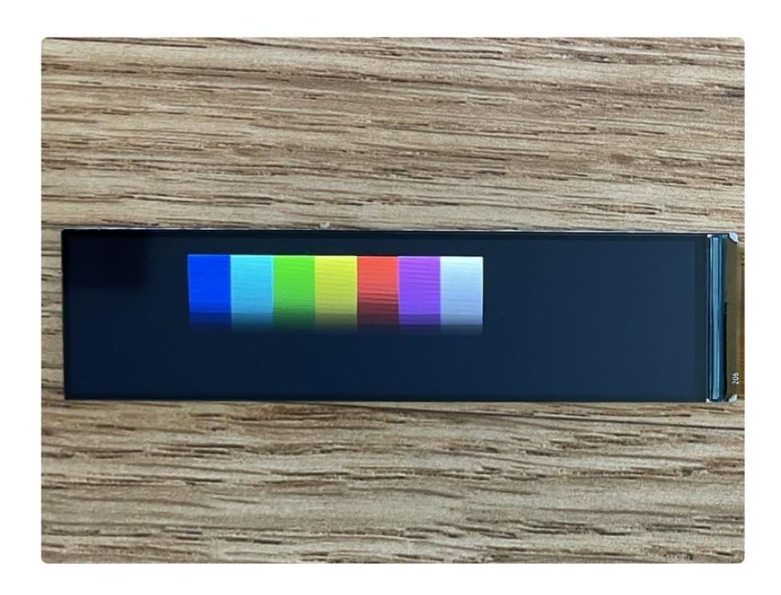

# <span id="page-193-0"></span>Qualia S3 RGB-666 with HD458002C40 4.58" 320x960 Bar Display


If you have issues running the example, you can always test your hardware by running a UF2 for your display from [https://learn.adafruit.com/adafruit-qualia](https://learn.adafruit.com/adafruit-qualia-esp32-s3-for-rgb666-displays/arduino-rainbow-demo)[esp32-s3-for-rgb666-displays/arduino-rainbow-demo](https://learn.adafruit.com/adafruit-qualia-esp32-s3-for-rgb666-displays/arduino-rainbow-demo)

©Adafruit Industries Page 194 of 252

## Initialization Codes

Here are the init codes for this display:

```
init_sequence_hd458 = bytes((
    b'\xff\x05w\x01\x00\x00\x13'
    b'\xef\x01\x08'
    b'\xff\x05w\x01\x00\x00\x10'
    b'\xc0\x02w\x00'
    b'\xc1\x02\t\x08'
    b'\xc2\x02\x01\x02'
    b'\xc3\x01\x02'
    b'\xcc\x01\x10'
    b'\xb0\x10@\x14Y\x10\x12\x08\x03\t\x05\x1e\x05\x14\x10h3\x15'
    b'\xb1\x10@\x08S\t\x11\t\x02\x07\t\x1a\x04\x12\x12d))'
    b'\xff\x05w\x01\x00\x00\x11'
    b'\xb0\x01m'
    b'\xb1\x01\x1d'
    b'\xb2\x01\x87'
    b'\xb3\x01\x80'
    b'\xb5\x01I'
    b'\xb7\x01\x85'
    b'\xb8\x01 '
    b'\xc1\x01x'
    b'\xc2\x01x'
    b'\xd0\x01\x88'
    b'\xe0\x03\x00\x00\x02'
    b'\xe1\x0b\x02\x8c\x00\x00\x03\x8c\x00\x00\x0033'
    b'\xe2\r3333\xc9<\x00\x00\xca<\x00\x00\x00'
    b'\xe3\x04\x00\x0033'
    b'\xe4\x02DD'
    b'\xe5\x10\x05\xcd\x82\x82\x01\xc9\x82\x82\x07\xcf\x82\x82\x03\xcb\x82\x82'
    b'\xe6\x04\x00\x0033'
    b'\xe7\x02DD'
    b'\xe8\x10\x06\xce\x82\x82\x02\xca\x82\x82\x08\xd0\x82\x82\x04\xcc\x82\x82'
    b'\xeb\x07\x08\x01\xe4\xe4\x88\x00@'
    b'\xec\x03\x00\x00\x00'
    b'\xed\x10\xff\xf0\x07eO\xfc\xc2/\xf2,\xcf\xf4Vp\x0f\xff'
    b'\xef\x06\x10\r\x04\x08?\x1f'
    b'\xff\x05w\x01\x00\x00\x00'
    b'\x11\x80x'
    b'5\x01\x00'
    b':\x81fd'
    b')\x00'
))
```

## Timings

Here are the timing settings for this display:

```
tft_timings = {
 "frequency": 16000000,
 "width": 320,
 "height": 960,
 "overscan_left": 80,
 "hsync_pulse_width": 10,
 "hsync_front_porch": 30,
 "hsync_back_porch": 50,
 "hsync_idle_low": False,
 "vsync_pulse_width": 2,
```

©Adafruit Industries Page 195 of 252

```
 "vsync_front_porch": 14,
 "vsync_back_porch": 17,
 "vsync_idle_low": False,
 "pclk_active_high": False,
 "pclk_idle_high": False,
 "de_idle_high": False,
}
```

## Example

Here's an example using those settings:

```
from displayio import release_displays
release_displays()
import time
import random
import displayio
import busio
import board
import dotclockframebuffer
from framebufferio import FramebufferDisplay
tft_pins = dict(board.TFT_PINS)
tft_timings = {
    "frequency": 16000000,
    "width": 320,
    "height": 960,
    "overscan_left": 80,
    "hsync_pulse_width": 10,
    "hsync_front_porch": 30,
    "hsync_back_porch": 50,
    "hsync_idle_low": False,
    "vsync_pulse_width": 2,
    "vsync_front_porch": 15,
    "vsync_back_porch": 17,
    "vsync_idle_low": False,
    "pclk_active_high": False,
    "pclk_idle_high": False,
    "de_idle_high": False,
}
init_sequence_hd458 = bytes((
    b'\xff\x05w\x01\x00\x00\x13'
    b'\xef\x01\x08'
    b'\xff\x05w\x01\x00\x00\x10'
    b'\xc0\x02w\x00'
    b'\xc1\x02\t\x08'
    b'\xc2\x02\x01\x02'
    b'\xc3\x01\x02'
    b'\xcc\x01\x10'
    b'\xb0\x10@\x14Y\x10\x12\x08\x03\t\x05\x1e\x05\x14\x10h3\x15'
    b'\xb1\x10@\x08S\t\x11\t\x02\x07\t\x1a\x04\x12\x12d))'
    b'\xff\x05w\x01\x00\x00\x11'
    b'\xb0\x01m'
    b'\xb1\x01\x1d'
    b'\xb2\x01\x87'
    b'\xb3\x01\x80'
    b'\xb5\x01I'
```

©Adafruit Industries Page 196 of 252

```
b'\xb7\x01\x85'
    b'\xb8\x01 '
    b'\xc1\x01x'
    b'\xc2\x01x'
    b'\xd0\x01\x88'
    b'\xe0\x03\x00\x00\x02'
    b'\xe1\x0b\x02\x8c\x00\x00\x03\x8c\x00\x00\x0033'
    b'\xe2\r3333\xc9<\x00\x00\xca<\x00\x00\x00'
    b'\xe3\x04\x00\x0033'
    b'\xe4\x02DD'
    b'\xe5\x10\x05\xcd\x82\x82\x01\xc9\x82\x82\x07\xcf\x82\x82\x03\xcb\x82\x82'
    b'\xe6\x04\x00\x0033'
    b'\xe7\x02DD'
    b'\xe8\x10\x06\xce\x82\x82\x02\xca\x82\x82\x08\xd0\x82\x82\x04\xcc\x82\x82'
    b'\xeb\x07\x08\x01\xe4\xe4\x88\x00@'
    b'\xec\x03\x00\x00\x00'
    b'\xed\x10\xff\xf0\x07eO\xfc\xc2/\xf2,\xcf\xf4Vp\x0f\xff'
    b'\xef\x06\x10\r\x04\x08?\x1f'
    b'\xff\x05w\x01\x00\x00\x00'
    b'\x11\x80x'
    b'5\x01\x00'
    b':\x81fd'
    b')\x00'
))
board.I2C().deinit()
i2c = busio.I2C(board.SCL, board.SDA)
tft_io_expander = dict(board.TFT_IO_EXPANDER)
#tft_io_expander['i2c_address'] = 0x38 # uncomment for rev B
dotclockframebuffer.ioexpander_send_init_sequence(i2c, init_sequence_hd458,
**tft_io_expander)
i2c.deinit()
BAR_WIDTH = 256
BAR_HEIGHT = 64
bitmap = displayio.Bitmap(BAR_WIDTH, 7*BAR_HEIGHT, 65535)
fb = dotclockframebuffer.DotClockFramebuffer(**tft_pins, **tft_timings)
display = FramebufferDisplay(fb, auto_refresh=False)
# Create a TileGrid to hold the bitmap
tile_grid = displayio.TileGrid(bitmap,
pixel_shader=displayio.ColorConverter(input_colorspace=displayio.Colorspace.RGB565))
# Create a Group to hold the TileGrid
group = displayio.Group()
# Add the TileGrid to the Group
group.append(tile_grid)
# Add the Group to the Display
display.root_group = group
display.auto_refresh = True
for i in range(BAR_WIDTH):
    b = i >> 3
    g = (i >> 2) << 5
    r = b << 11
    for j in range(BAR_HEIGHT):
        bitmap[i, j] = b
        bitmap[i, j+BAR_HEIGHT*1] = b|g
        bitmap[i, j+BAR_HEIGHT*2] = g
        bitmap[i, j+BAR_HEIGHT*3] = g|r
        bitmap[i, j+BAR_HEIGHT*4] = r
        bitmap[i, j+BAR_HEIGHT*5] = r|b
        bitmap[i, j+BAR_HEIGHT*6] = r|g|b
# Loop forever so you can enjoy your image
```

©Adafruit Industries Page 197 of 252

```
while True:
    time.sleep(1)
    display.auto_refresh = False
    group.x = random.randint(0, display.width - BAR_WIDTH)
    group.y = random.randint(0, display.height - BAR_HEIGHT*7)
    display.auto_refresh = True
```

Go ahead and save the example you your CircuitPython code.py and run the code. Your display should now look like this:

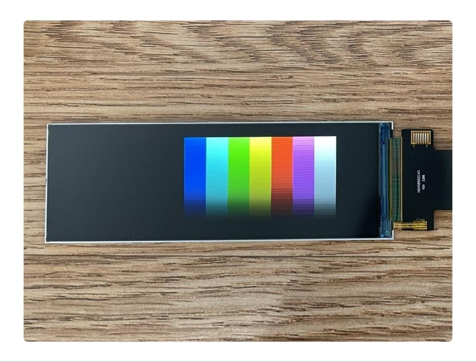

# <span id="page-197-0"></span>Arduino IDE Setup

The ESP32-S2/S3 bootloader does not have USB serial support for Windows 7 or 8. (See <https://github.com/espressif/arduino-esp32/issues/5994>) please update to version 10 which is supported by espressif! Alternatively you can try this community-crafted Windows 7 driver ([https://github.com/kutukvpavel/](https://github.com/kutukvpavel/Esp32-Win7-VCP-drivers)

[Esp32-Win7-VCP-drivers](https://github.com/kutukvpavel/Esp32-Win7-VCP-drivers))

The first thing you will need to do is to download the latest release of the Arduino IDE. You will need to be using version 1.8 or higher for this guide

https://adafru.it/f1P

©Adafruit Industries Page 198 of 252

To use the ESP32-S2/S3 with Arduino, you'll need to follow the steps below for your operating system. You can also [check out the Espressif Arduino repository for the](https://github.com/espressif/arduino-esp32#using-through-arduino-ide) [most up to date details on how to install it](https://github.com/espressif/arduino-esp32#using-through-arduino-ide) (https://adafru.it/weF).

After you have downloaded and installed the latest version of Arduino IDE, you will need to start the IDE and navigate to the Preferences menu. You can access it from the File menu in Windows or Linux, or the Arduino menu on OS X.

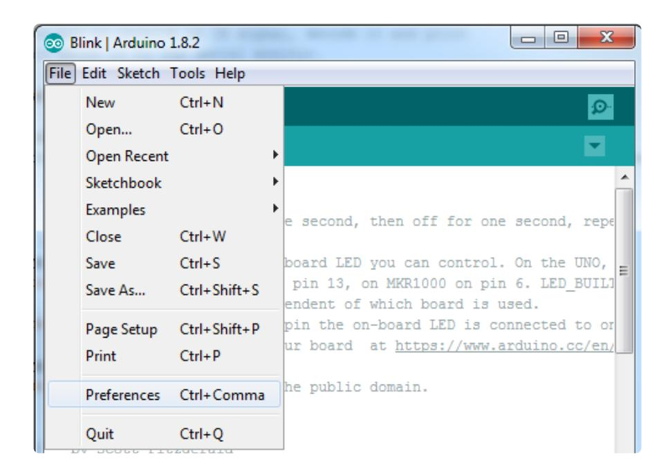

A dialog will pop up just like the one shown below.

©Adafruit Industries Page 199 of 252

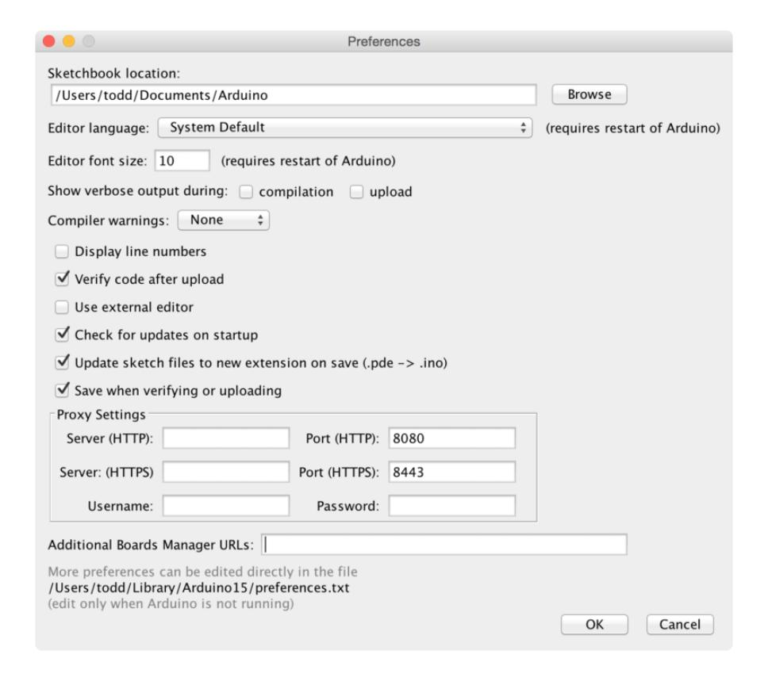

We will be adding a URL to the new Additional Boards Manager URLs option. The list of URLs is comma separated, and you will only have to add each URL once. New Adafruit boards and updates to existing boards will automatically be picked up by the Board Manager each time it is opened. The URLs point to index files that the Board Manager uses to build the list of available & installed boards.

To find the most up to date list of URLs you can add, you can visit the list of [third party](https://github.com/arduino/Arduino/wiki/Unofficial-list-of-3rd-party-boards-support-urls#list-of-3rd-party-boards-support-urls) [board URLs on the Arduino IDE wiki](https://github.com/arduino/Arduino/wiki/Unofficial-list-of-3rd-party-boards-support-urls#list-of-3rd-party-boards-support-urls) (https://adafru.it/f7U). We will only need to add one URL to the IDE in this example, but you can add multiple URLS by separating them with commas. Copy and paste the link below into the Additional Boards Manager URLs option in the Arduino IDE preferences.

https://raw.githubusercontent.com/espressif/arduino-esp32/gh-pages/ package\_esp32\_index.json

©Adafruit Industries Page 200 of 252

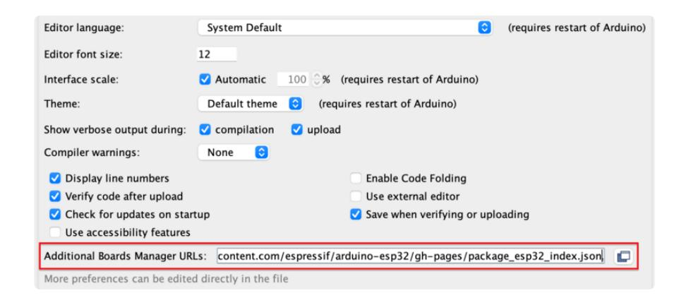

If you're an advanced hacker and want the 'bleeding edge' release that may have fixes (or bugs!) you can check out the dev url instead:

https://raw.githubusercontent.com/espressif/arduino-esp32/gh-pages/ package\_esp32\_dev\_index.json

If you have multiple boards you want to support, say ESP8266 and Adafruit, have both URLs in the text box separated by a comma (,)

Once done click OK to save the new preference settings.

The next step is to actually install the Board Support Package (BSP). Go to the Tools → Board → Board Manager submenu. A dialog should come up with various BSPs. Search for esp32. Choose the latest version, which may be later than the version shown in the screenshot below.

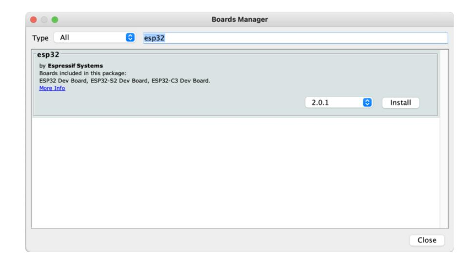

Click the Install button and wait for it to finish. Once it is finished, you can close the dialog.

©Adafruit Industries Page 201 of 252

In the Tools → Board submenu you should see ESP32 Arduino and in that dropdown it should contain the ESP32 boards along with all the latest ESP32-S2/S3 boards.

Look for the board called Adafruit Qualia ESP32-S3 RGB666.

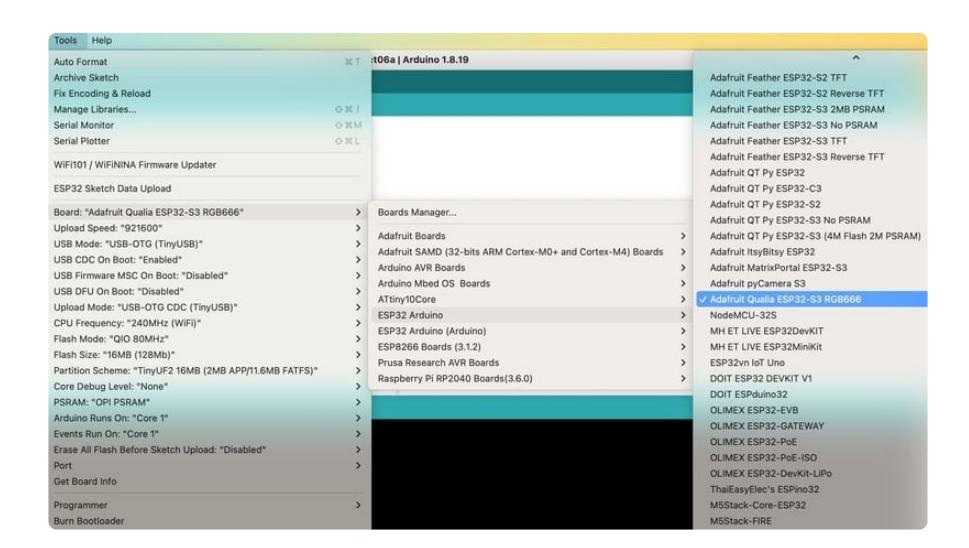

## Manually Resetting ESP32-S3 Boards

Due to an issue in the Espressif code base, boards with an ESP32-S3 need to be manually reset after uploading code from the Arduino IDE. After your code has been uploaded to the ESP32-S3, press the reset button. After pressing the reset button, your code will begin running.

For additional information, you can track [the issue](https://github.com/espressif/arduino-esp32/issues/6762) (https://adafru.it/18fr) on GitHub in the arduino-esp32 repository.


Make sure to press the reset button after uploading code from the Arduino IDE to the ESP32-S3!

# <span id="page-201-0"></span>Using with Arduino IDE

## Blink

Now you can upload your first blink sketch!

©Adafruit Industries Page 202 of 252

Plug in the ESP32-S2/S3 board and wait for it to be recognized by the OS (just takes a few seconds).

## Select ESP32-S2/S3 Board in Arduino IDE

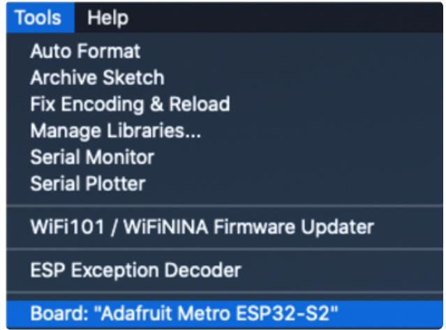

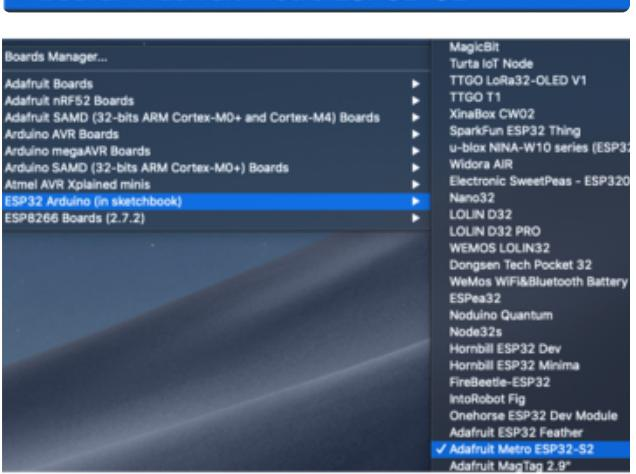

On the Arduino IDE, click:

Tools -> Board -> ESP32 Arduino -> Your Adafruit ESP32-S2/S3 board

The screenshot shows Metro S2 but you may have a different board. Make sure the name matches the exact product you purchased. If you don't see your board, make sure you have the latest version of the ESP32 board support package

## Launch ESP32-S2/S3 ROM Bootloader

ESP32-S2/S3 support in Arduino uses native USB which can crash. If you ever DON'T see a serial/COM port, you can always manually enter bootloading mode. This bootloader is in ROM, it is 'un-brickable' so you can always use this technique to get into the bootloader. However, after uploading your Arduino code you MUST press reset to start the sketch

©Adafruit Industries Page 203 of 252

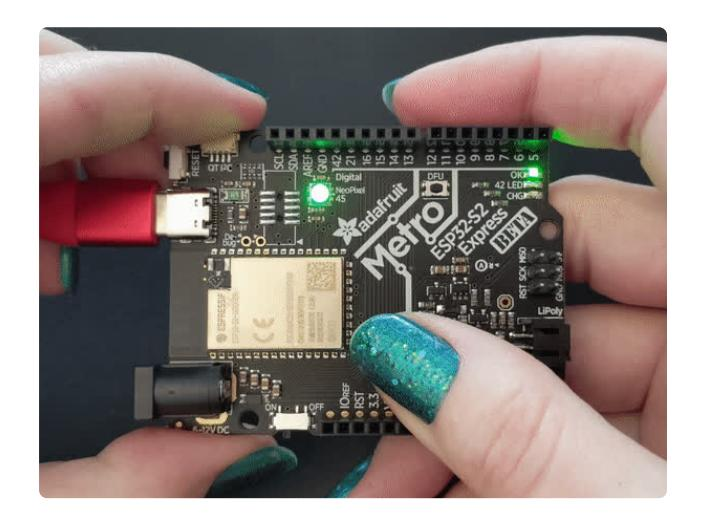

Before we upload a sketch, [place your](https://learn.adafruit.com/adafruit-metro-esp32-s2/rom-bootloader#enter-rom-bootloader-mode-3076820-1) [ESP32-S2/S3 board into ROM bootloader](https://learn.adafruit.com/adafruit-metro-esp32-s2/rom-bootloader#enter-rom-bootloader-mode-3076820-1) [mode](https://learn.adafruit.com/adafruit-metro-esp32-s2/rom-bootloader#enter-rom-bootloader-mode-3076820-1) (https://adafru.it/OsC).

Look for the Reset button and a second DFU / BOOT0 button

HOLD down the DFU/Boot0 button while you click Reset. Then release DFU/Boot0 button

The GIF shows a Metro S2 but your board may look different. It will still have BOOT and Reset buttons somewhere

It should appear under Tools -> Port as ESP32-S2/S3 Dev Module.

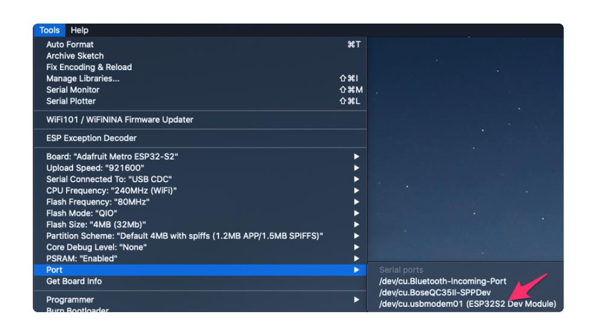

In the **Port** menu, select the serial port that is labelled "ESP32S2 Dev Module" or "ESP32S3 Dev Module".

(Note this is the **Port** menu, not the **Board** menu. In the **Board** menu choose the exact board you are using.)

## Load Blink Sketch

Now open up this Blink example in a new sketch window

©Adafruit Industries Page 204 of 252

```
// the setup function runs once when you press reset or power the board
void setup() {
 // initialize built in LED pin as an output.
 pinMode(LED_BUILTIN, OUTPUT);
 // initialize USB serial converter so we have a port created
 Serial.begin();
}
// the loop function runs over and over again forever
void loop() {
 digitalWrite(LED_BUILTIN, HIGH); // turn the LED on (HIGH is the voltage level)
 delay(1000); // wait for a second
 digitalWrite(LED_BUILTIN, LOW); // turn the LED off by making the voltage LOW
 delay(1000); // wait for a second
}
```


Note that we use LED\_BUILTIN not pin 13 for the LED pin. That's because we don't always use pin 13 for the LED on boards. For example, on the Metro ESP32-S2 the LED is on pin 42!

And click upload! After uploading, you may see something like this:

And click upload! After uploading, you may see something like this, warning you that we could not get out of reset.

This is normal! Press the RESET button on your board to launch the sketch

That's it, you will be able to see the red LED blink. You will also see a new serial port created.

You may call Serial.begin(); in your sketch to create the serial port so don't forget it, it is not required for other Arduinos or previous ESP boards!

©Adafruit Industries Page 205 of 252

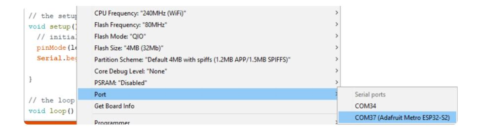

You can now select the new serial port name which will be different than the bootloader serial port. Arduino IDE will try to use auto-reset to automatically put the board into bootloader mode when you ask it to upload new code

If you ever DON'T see a serial port, or something is not working out with upload you can always manually enter bootloader mode:

- Reset board into ROM bootloader with DFU/BOOT0 + Reset buttons •
- Select the ESP32S2/S3 Dev Board ROM bootloader serial port in Tools->Port menu •
- Upload sketch •
- Click reset button to launch code •

# <span id="page-205-0"></span>Library Installation

The examples for the Qualia ESP32-S3 require the GFX Library for Arduino. You can install that library for Arduino using the Library Manager in the Arduino IDE.

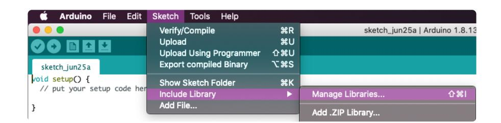

Click the Manage Libraries... menu item, search for GFX Library for Arduino, scroll down, and select the GFX Library for Arduino by user Moon On Our Nation:

©Adafruit Industries Page 206 of 252

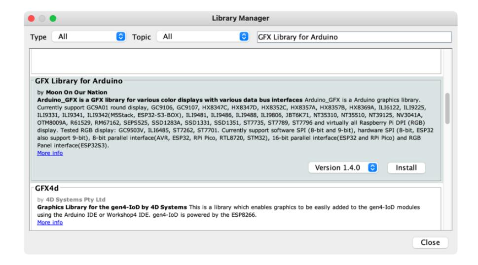

# <span id="page-206-0"></span>WiFi Test

Thanksfully if you have ESP32 sketches, they'll 'just work' with variations of ESP32. You can find a wide range of examples in the File->Examples->Examples for Adafruit Metro ESP32-S2 subheading (the name of the board may vary so it could be "Examples for Adafruit Feather ESP32 V2" etc)

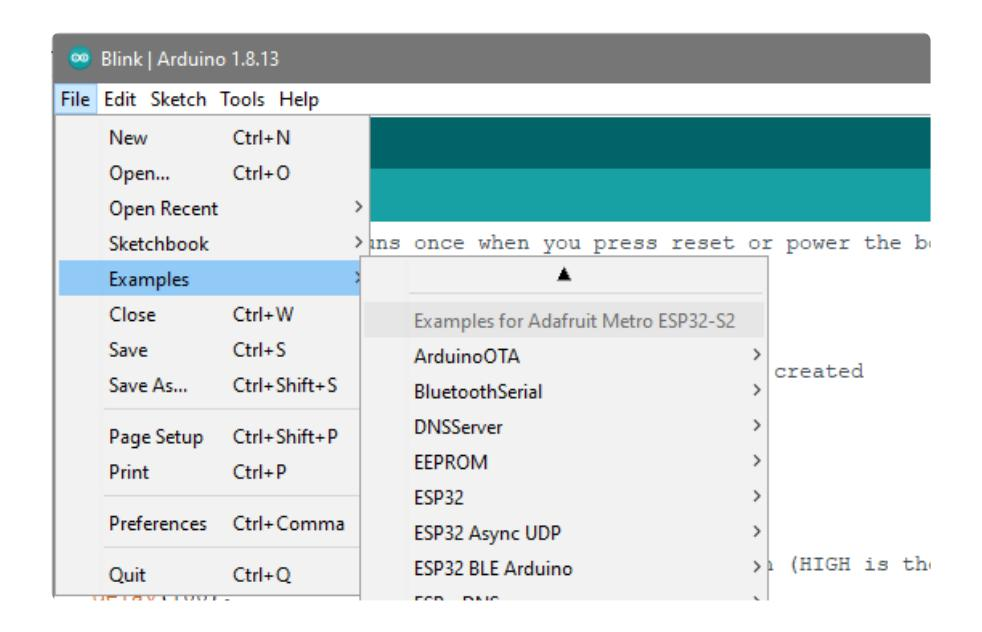

Let's start by scanning the local networks.

Load up the WiFiScan example under Examples->Examples for YOUR BOARDNAME- >WiFi->WiFiScan

©Adafruit Industries Page 207 of 252

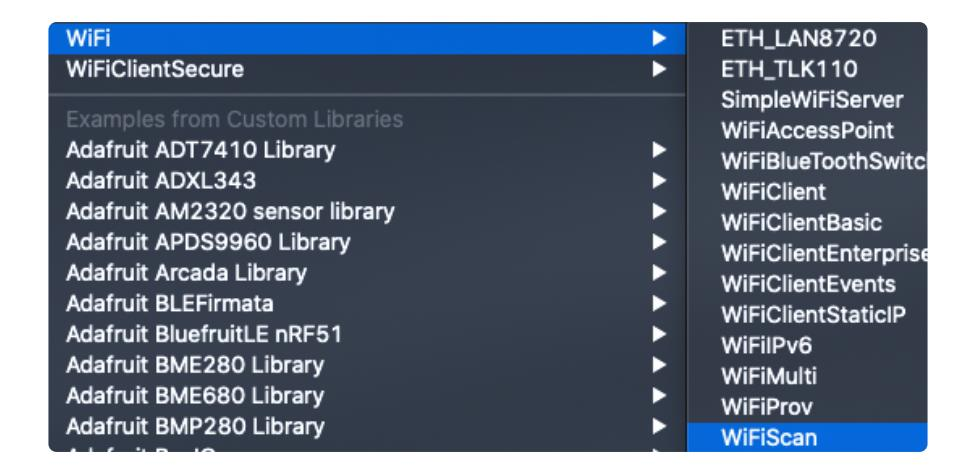

And upload this example to your board. The ESP32 should scan and find WiFi networks around you.

For ESP32, open the serial monitor, to see the scan begin.

For ESP32-S2, -S3 and -C3, don't forget you have to click Reset after uploading through the ROM bootloader. Then select the new USB Serial port created by the ESP32. It will take a few seconds for the board to complete the scan.

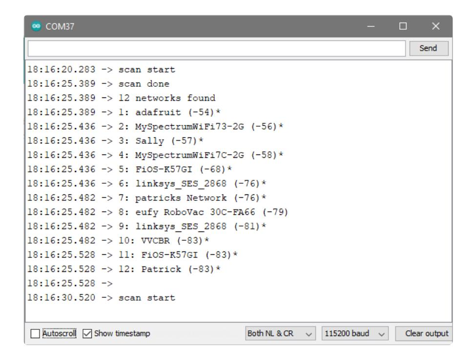

If you can not scan any networks, check your power supply. You need a solid power supply in order for the ESP32 to not brown out. A skinny USB cable or drained battery can cause issues.

©Adafruit Industries Page 208 of 252

## WiFi Connection Test

Now that you can scan networks around you, its time to connect to the Internet!

Copy the example below and paste it into the Arduino IDE:

```
// SPDX-FileCopyrightText: 2020 Brent Rubell for Adafruit Industries
//
// SPDX-License-Identifier: MIT
/*
 Web client
 This sketch connects to a website (wifitest.adafruit.com/testwifi/index.html)
 using the WiFi module.
 This example is written for a network using WPA encryption. For
 WEP or WPA, change the Wifi.begin() call accordingly.
 This example is written for a network using WPA encryption. For
 WEP or WPA, change the Wifi.begin() call accordingly.
 created 13 July 2010
 by dlf (Metodo2 srl)
 modified 31 May 2012
 by Tom Igoe
 */
#include <WiFi.h>
// Enter your WiFi SSID and password
char ssid[] = "YOUR_SSID"; // your network SSID (name)
char pass[] =
"YOUR_SSID_PASSWORD"; // your network password (use for WPA, or use as key for 
WEP)
int keyIndex =
0; // your network key Index number (needed only for WEP)
int status = WL_IDLE_STATUS;
// if you don't want to use DNS (and reduce your sketch size)
// use the numeric IP instead of the name for the server:
//IPAddress server(74,125,232,128); // numeric IP for Google (no DNS)
char server[] = "wifitest.adafruit.com"; // name address for adafruit test
char path[] = "/testwifi/index.html";
// Initialize the Ethernet client library
// with the IP address and port of the server
// that you want to connect to (port 80 is default for HTTP):
WiFiClient client;
void setup() {
 //Initialize serial and wait for port to open:
 Serial.begin(115200);
 while (!Serial) {
   ; // wait for serial port to connect. Needed for native USB port only
 }
 // attempt to connect to Wifi network:
 Serial.print("Attempting to connect to SSID: ");
 Serial.println(ssid);
 WiFi.begin(ssid, pass);
 while (WiFi.status() != WL_CONNECTED) {
     delay(500);
```

©Adafruit Industries Page 209 of 252

```
Serial.print(".");
  }
  Serial.println("");
  Serial.println("Connected to WiFi");
  printWifiStatus();
  Serial.println("\nStarting connection to server...");
  // if you get a connection, report back via serial:
  if (client.connect(server, 80)) {
    Serial.println("connected to server");
    // Make a HTTP request:
    client.print("GET "); client.print(path); client.println(" HTTP/1.1");
    client.print("Host: "); client.println(server);
    client.println("Connection: close");
    client.println();
  }
}
void loop() {
  // if there are incoming bytes available
  // from the server, read them and print them:
  while (client.available()) {
    char c = client.read();
    Serial.write(c);
  }
  // if the server's disconnected, stop the client:
  if (!client.connected()) {
    Serial.println();
    Serial.println("disconnecting from server.");
    client.stop();
    // do nothing forevermore:
    while (true) {
      delay(100);
    }
  }
}
void printWifiStatus() {
  // print the SSID of the network you're attached to:
  Serial.print("SSID: ");
  Serial.println(WiFi.SSID());
  // print your board's IP address:
  IPAddress ip = WiFi.localIP();
  Serial.print("IP Address: ");
  Serial.println(ip);
  // print the received signal strength:
  long rssi = WiFi.RSSI();
  Serial.print("signal strength (RSSI):");
  Serial.print(rssi);
  Serial.println(" dBm");
}
```

NOTE: You must change the SECRET\_SSID and SECRET\_PASS in the example code to your WiFi SSID and password before uploading this to your board.

©Adafruit Industries Page 210 of 252

After you've set it correctly, upload and check the serial monitor. You should see the following. If not, go back, check wiring, power and your SSID/password

## Secure Connection Example

Many servers today do not allow non-SSL connectivity. Lucky for you the ESP32 has a great TLS/SSL stack so you can have that all taken care of for you. Here's an example of a using a secure WiFi connection to connect to the Twitter API.

Copy and paste it into the Arduino IDE:

```
// SPDX-FileCopyrightText: 2015 Arturo Guadalupi
// SPDX-FileCopyrightText: 2020 Brent Rubell for Adafruit Industries
//
// SPDX-License-Identifier: MIT
/*
This example creates a client object that connects and transfers
```

©Adafruit Industries Page 211 of 252

```
data using always SSL.
It is compatible with the methods normally related to plain
connections, like client.connect(host, port).
Written by Arturo Guadalupi
last revision November 2015
*/
#include <WiFiClientSecure.h>
#include <WiFi.h>
// Enter your WiFi SSID and password
char ssid[] = "YOUR_SSID"; // your network SSID (name)
char pass[] =
"YOUR_SSID_PASSWORD"; // your network password (use for WPA, or use as key for 
WEP)
int keyIndex =
0; // your network key Index number (needed only for WEP)
int status = WL_IDLE_STATUS;
// if you don't want to use DNS (and reduce your sketch size)
// use the numeric IP instead of the name for the server:
//IPAddress server(74,125,232,128); // numeric IP for Google (no DNS)
#define SERVER "cdn.syndication.twimg.com"
#define PATH "/widgets/followbutton/info.json?screen_names=adafruit"
// Initialize the SSL client library
// with the IP address and port of the server
// that you want to connect to (port 443 is default for HTTPS):
WiFiClientSecure client;
void setup() {
  //Initialize serial and wait for port to open:
  Serial.begin(115200);
  while (!Serial) {
    ; // wait for serial port to connect. Needed for native USB port only
  }
  // attempt to connect to Wifi network:
  Serial.print("Attempting to connect to SSID: ");
  Serial.println(ssid);
  WiFi.begin(ssid, pass);
  while (WiFi.status() != WL_CONNECTED) {
      delay(500);
      Serial.print(".");
  }
  Serial.println("");
  Serial.println("Connected to WiFi");
  printWifiStatus();
  client.setInsecure(); // don't use a root cert
  Serial.println("\nStarting connection to server...");
  // if you get a connection, report back via serial:
  if (client.connect(SERVER, 443)) {
    Serial.println("connected to server");
    // Make a HTTP request:
    client.println("GET " PATH " HTTP/1.1");
    client.println("Host: " SERVER);
    client.println("Connection: close");
    client.println();
  }
}
```

©Adafruit Industries Page 212 of 252

```
uint32_t bytes = 0;
void loop() {
  // if there are incoming bytes available
  // from the server, read them and print them:
  while (client.available()) {
    char c = client.read();
    Serial.write(c);
    bytes++;
  }
  // if the server's disconnected, stop the client:
  if (!client.connected()) {
    Serial.println();
    Serial.println("disconnecting from server.");
    client.stop();
    Serial.print("Read "); Serial.print(bytes); Serial.println(" bytes");
    // do nothing forevermore:
    while (true);
  }
}
void printWifiStatus() {
  // print the SSID of the network you're attached to:
  Serial.print("SSID: ");
  Serial.println(WiFi.SSID());
  // print your board's IP address:
  IPAddress ip = WiFi.localIP();
  Serial.print("IP Address: ");
  Serial.println(ip);
  // print the received signal strength:
  long rssi = WiFi.RSSI();
  Serial.print("signal strength (RSSI):");
  Serial.print(rssi);
  Serial.println(" dBm");
}
```

As before, update the ssid and password first, then upload the example to your board.

Note we use WiFiClientSecure client instead of WiFiClient client; to require a SSL connection!

©Adafruit Industries Page 213 of 252

# <span id="page-213-0"></span>Usage with Adafruit IO

The ESP32-S2/S3 is an affordable, all-in-one, option for connecting your projects to the internet [using our IoT platform, Adafruit IO](https://io.adafruit.com/welcome) (https://adafru.it/Eg2).

For more information and guides about Adafruit IO, check out the [Adafruit IO](https://learn.adafruit.com/series/adafruit-io-basics) [Basics Series.](https://learn.adafruit.com/series/adafruit-io-basics) (https://adafru.it/iDX) •

## Install Libraries

In the Arduino IDE, navigate to Sketch -> Include Library->Manage Libraries...

©Adafruit Industries Page 214 of 252

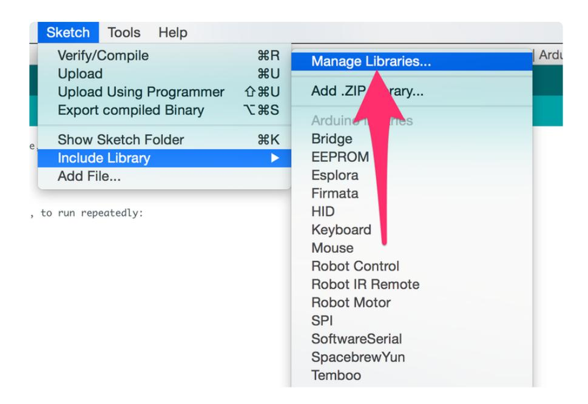

Enter Adafruit IO Arduino into the search box, and click Install on the Adafruit IO Arduino library option to install version 4.0.0 or higher.

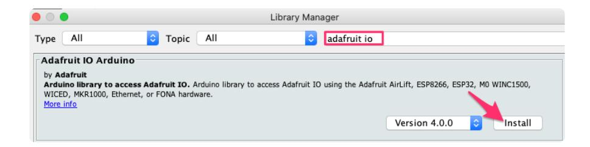

When asked to install dependencies, click Install all.

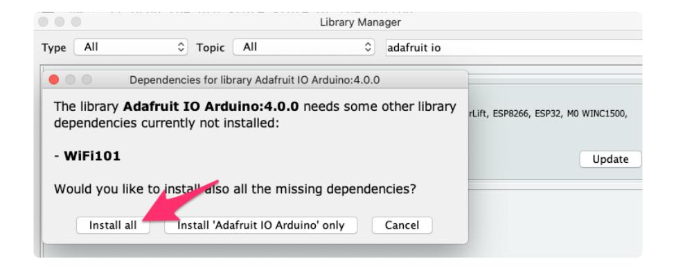

©Adafruit Industries Page 215 of 252

## Adafruit IO Setup

If you do not already have an Adafruit IO account, [create one now](http://io.adafruit.com/) (https://adafru.it/ fH9). Next, navigate to the Adafruit IO Dashboards page.

We'll create a dashboard to visualize and interact with the data being sent between your ESP32-S2/S3 board and Adafruit IO.


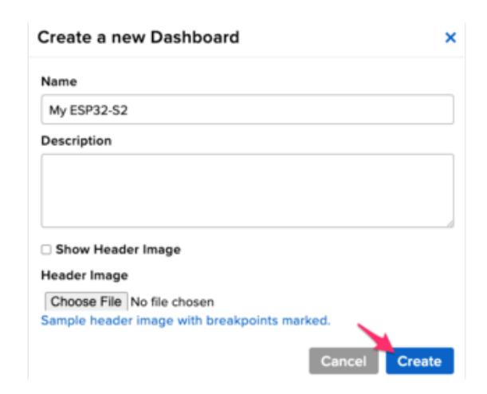

Click the New Dashboard button. Name your dashboard My ESP32-S2 or My ESP32-S3 depending on your board. Your new dashboard should appear in the list.

Click the link to be brought to your new dashboard.

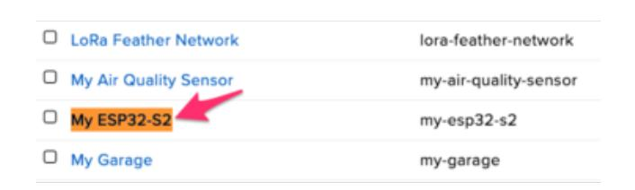

©Adafruit Industries Page 216 of 252

We'll want to turn the board's LED on or off from Adafruit IO. To do this, we'll need to add a toggle button to our dashboard.

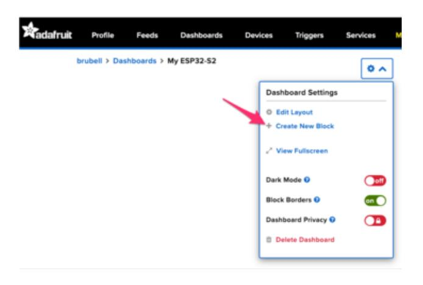

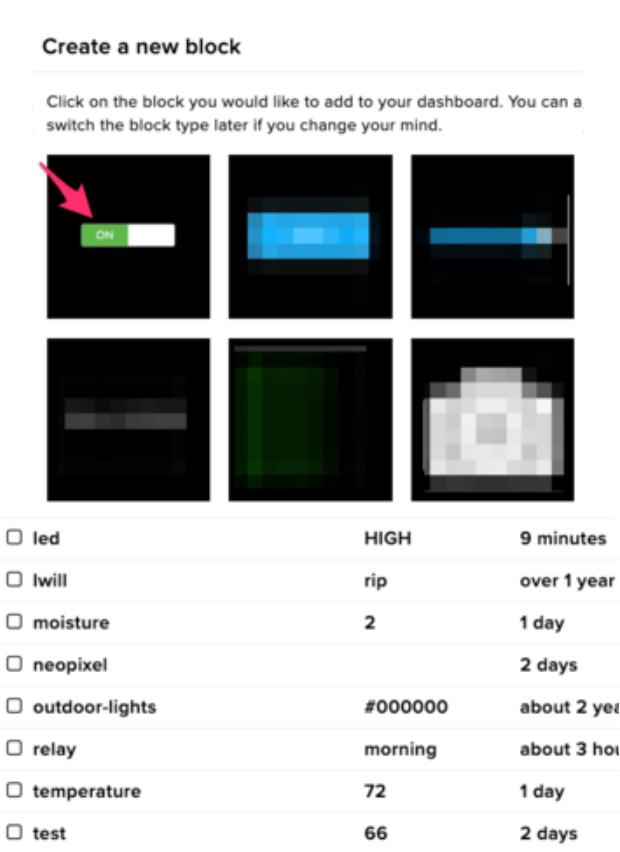

Click the cog at the top right hand corner of your dashboard.

In the dashboard settings dropdown, click Create New Block.

Select the toggle block.

Under My Feeds, enter led as a feed name. Click Create.

Choose the led feed to connect it to the toggle block. Click Next step.

©Adafruit Industries Page 217 of 252

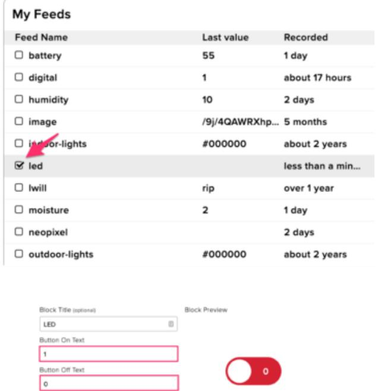

Under Block Settings,

Change Button On Text to 1 Change Button Off Text to 0 Click Create block

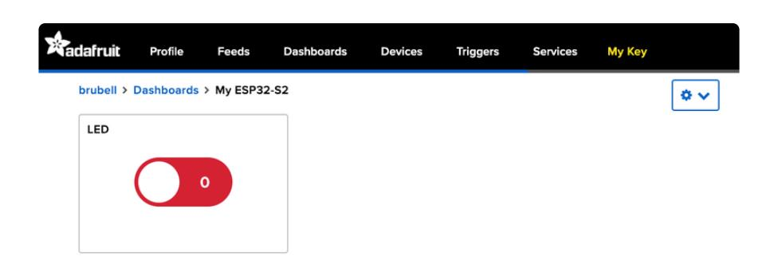

Next up, we'll want to display button press data from your board on Adafruit IO. To do this, we'll add a gauge block to the Adafruit IO dashboard. A gauge is a read only block type that shows a fixed range of values.

©Adafruit Industries Page 218 of 252

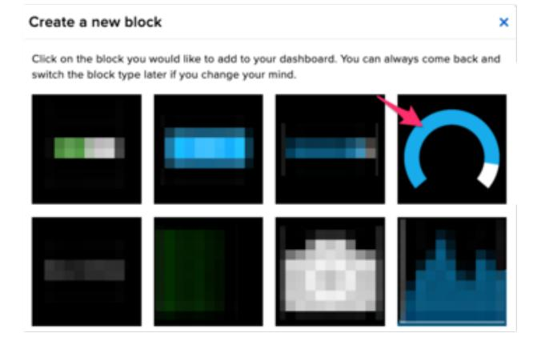

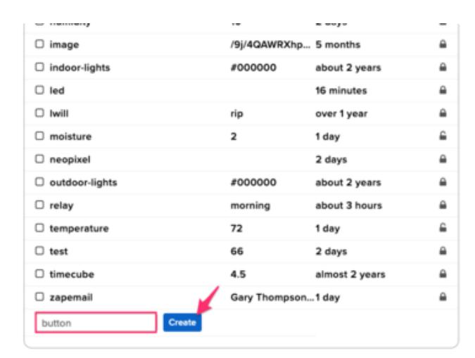

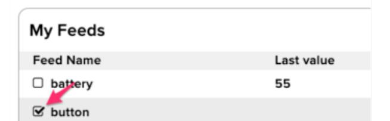

Click the cog at the top right hand corner of your dashboard.

In the dashboard settings dropdown, click Create New Block.

Select the gauge block.

Under My Feeds, enter button as a feed name.

Click Create.

Choose the button feed to connect it to the toggle block.

Click Next step.

©Adafruit Industries Page 219 of 252

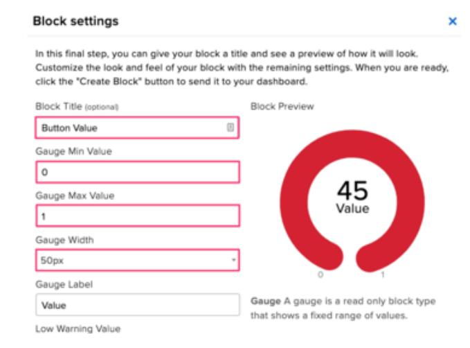

Under block settings,

Change Block Title to Button Value Change Gauge Min Value to 0, the button's state when it's off Change Gauge Max Value to 1, the button's state when it's on Click Create block

Your dashboard should look like the following:

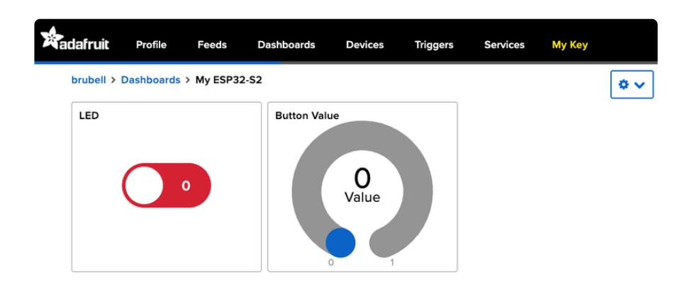

## Code Usage

For this example, you will need to open the adafruitio\_26\_led\_btn example included with the Adafruit IO Arduino library. In the Arduino IDE, navigate to File -> Examples -> Adafruit IO Arduino -> adafruitio\_26\_led\_btn.

Before uploading this code to the ESP32-S2/S3, you'll need to add your network and Adafruit IO credentials. Click on the config.h tab in the sketch.

Obtain your Adafruit IO Credentials from [navigating to io.adafruit.com and clicking My](https://io.adafruit.com/) [Key](https://io.adafruit.com/) (https://adafru.it/fsU). Copy and paste these credentials next to IO\_USERNAME and IO\_KEY .

©Adafruit Industries Page 220 of 252

Enter your network credentials next to WIFI\_SSID and WIFI\_PASS .

Click the Upload button to upload your sketch to the ESP32-S2/S3. After uploading, press the RESET button on your board to launch the sketch.

Open the Arduino Serial monitor and navigate to the Adafruit IO dashboard you created. You should see the gauge response to button press and the board's LED light up in response to the Toggle Switch block.

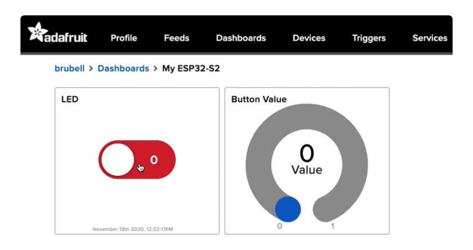

©Adafruit Industries Page 221 of 252

You should also see the ESP32-S2/S3's LED turning on and off when the LED is toggled:

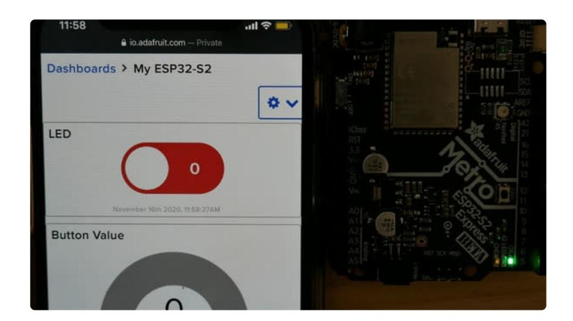

# <span id="page-221-0"></span>Arduino Rainbow Demo

We have a Circular Rainbow demo available for the Qualia ESP32-S3 that runs in Arduino. Below is the code to run it.


This currently will not compile with version 3.0.0 of the ESP32 Board Support Package. Please use version 2 of the BSP.

```
// SPDX-FileCopyrightText: 2023 Limor Fried for Adafruit Industries
//
// SPDX-License-Identifier: MIT
#include <Arduino_GFX_Library.h>
#include <Adafruit_FT6206.h>
#include <Adafruit_CST8XX.h>
Arduino_XCA9554SWSPI *expander = new Arduino_XCA9554SWSPI(
    PCA_TFT_RESET, PCA_TFT_CS, PCA_TFT_SCK, PCA_TFT_MOSI,
    &Wire, 0x3F);
Arduino_ESP32RGBPanel *rgbpanel = new Arduino_ESP32RGBPanel(
    TFT_DE, TFT_VSYNC, TFT_HSYNC, TFT_PCLK,
    TFT_R1, TFT_R2, TFT_R3, TFT_R4, TFT_R5,
    TFT_G0, TFT_G1, TFT_G2, TFT_G3, TFT_G4, TFT_G5,
    TFT_B1, TFT_B2, TFT_B3, TFT_B4, TFT_B5,
    1 /* hsync_polarity */, 50 /* hsync_front_porch */, 2 /* hsync_pulse_width */,
44 /* hsync_back_porch */,
    1 /* vsync_polarity */, 16 /* vsync_front_porch */, 2 /* vsync_pulse_width */,
18 /* vsync_back_porch */
```

©Adafruit Industries Page 222 of 252

```
// ,1, 30000000
   );
Arduino_RGB_Display *gfx = new Arduino_RGB_Display(
// 2.1" 480x480 round display
   480 /* width */, 480 /* height */, rgbpanel, 0 /* rotation */, true /* 
auto_flush */,
   expander, GFX_NOT_DEFINED /* RST */, TL021WVC02_init_operations,
sizeof(TL021WVC02_init_operations));
// 2.8" 480x480 round display
// 480 /* width */, 480 /* height */, rgbpanel, 0 /* rotation */, true /* 
auto_flush */,
// expander, GFX_NOT_DEFINED /* RST */, TL028WVC01_init_operations, 
sizeof(TL028WVC01_init_operations));
// 3.4" 480x480 square display
// 480 /* width */, 480 /* height */, rgbpanel, 0 /* rotation */, true /* 
auto_flush */,
// expander, GFX_NOT_DEFINED /* RST */, tl034wvs05_b1477a_init_operations, 
sizeof(tl034wvs05_b1477a_init_operations));
/* 4.0" 480x480 square */
// 480 /* width */, 480 /* height */, rgbpanel, 0 /* rotation */, true /* 
auto_flush */,
// expander, GFX_NOT_DEFINED /* RST */, tl040wvs03_init_operations, 
sizeof(tl040wvs03_init_operations));
// 3.2" 320x820 rectangle bar display
// 320 /* width */, 820 /* height */, rgbpanel, 0 /* rotation */, true /* 
auto_flush */,
// expander, GFX_NOT_DEFINED /* RST */, tl032fwv01_init_operations, 
sizeof(tl032fwv01_init_operations));
// 3.7" 240x960 rectangle bar display
// 240 /* width */, 960 /* height */, rgbpanel, 0 /* rotation */, true /* 
auto_flush */,
// expander, GFX_NOT_DEFINED /* RST */, HD371001C40_init_operations, 
sizeof(HD371001C40_init_operations), 120 /* col_offset1 */);
// 4.0" 720x720 square display
// 720 /* width */, 720 /* height */, rgbpanel, 0 /* rotation */, true /* 
auto_flush */,
// expander, GFX_NOT_DEFINED /* RST */, NULL, 0);
// 4.0" 720x720 round display
// 720 /* width */, 720 /* height */, rgbpanel, 0 /* rotation */, true /* 
auto_flush */,
// expander, GFX_NOT_DEFINED /* RST */, hd40015c40_init_operations, 
sizeof(hd40015c40_init_operations));
// needs also the rgbpanel to have these pulse/sync values:
// 1 /* hync_polarity */, 46 /* hsync_front_porch */, 2 /* hsync_pulse_width */, 
44 /* hsync_back_porch */,
// 1 /* vsync_polarity */, 50 /* vsync_front_porch */, 16 /* vsync_pulse_width 
*/, 16 /* vsync_back_porch */
uint16_t *colorWheel;
// The Capacitive touchscreen overlays uses hardware I2C (SCL/SDA)
// Most touchscreens use FocalTouch with I2C Address often but not always 0x48!
#define I2C_TOUCH_ADDR 0x48
// 2.1" 480x480 round display use CST826 touchscreen with I2C Address at 0x15
//#define I2C_TOUCH_ADDR 0x15 // often but not always 0x48!
Adafruit_FT6206 focal_ctp = Adafruit_FT6206(); // this library also supports 
FT5336U!
Adafruit_CST8XX cst_ctp = Adafruit_CST8XX();
```

©Adafruit Industries Page 223 of 252

```
bool touchOK = false; // we will check if the touchscreen exists
bool isFocalTouch = false;
void setup(void)
{
  Serial.begin(115200);
  //while (!Serial) delay(100);
#ifdef GFX_EXTRA_PRE_INIT
  GFX_EXTRA_PRE_INIT();
#endif
  Serial.println("Beginning");
  // Init Display
  Wire.setClock(1000000); // speed up I2C
  if (!gfx->begin()) {
    Serial.println("gfx->begin() failed!");
  }
  Serial.println("Initialized!");
  gfx->fillScreen(BLACK);
  expander->pinMode(PCA_TFT_BACKLIGHT, OUTPUT);
  expander->digitalWrite(PCA_TFT_BACKLIGHT, HIGH);
  colorWheel = (uint16_t *) ps_malloc(gfx->width() * gfx->height() *
sizeof(uint16_t));
  if (colorWheel) {
    generateColorWheel(colorWheel);
    gfx->draw16bitRGBBitmap(0, 0, colorWheel, gfx->width(), gfx->height());
  }
  if (!focal_ctp.begin(0, &Wire, I2C_TOUCH_ADDR)) {
    // Try the CST826 Touch Screen
    if (!cst_ctp.begin(&Wire, I2C_TOUCH_ADDR)) {
      Serial.print("No Touchscreen found at address 0x");
      Serial.println(I2C_TOUCH_ADDR, HEX);
      touchOK = false;
    } else {
      Serial.println("CST826 Touchscreen found");
      touchOK = true;
      isFocalTouch = false;
    }
  } else {
    Serial.println("Focal Touchscreen found");
    touchOK = true;
    isFocalTouch = true;
  }
}
void loop()
{
  if (touchOK) {
    if (isFocalTouch && focal_ctp.touched()) {
      TS_Point p = focal_ctp.getPoint(0);
      Serial.printf("(%d, %d)\n", p.x, p.y);
      gfx->fillRect(p.x, p.y, 5, 5, WHITE);
    } else if (!isFocalTouch && cst_ctp.touched()) {
      CST_TS_Point p = cst_ctp.getPoint(0);
      Serial.printf("(%d, %d)\n", p.x, p.y);
      gfx->fillRect(p.x, p.y, 5, 5, WHITE);
    }
  }
  // use the buttons to turn off
  if (! expander->digitalRead(PCA_BUTTON_DOWN)) {
    expander->digitalWrite(PCA_TFT_BACKLIGHT, LOW);
```

©Adafruit Industries Page 224 of 252

```
}
  // and on the backlight
  if (! expander->digitalRead(PCA_BUTTON_UP)) {
    expander->digitalWrite(PCA_TFT_BACKLIGHT, HIGH);
  }
}
// https://chat.openai.com/share/8edee522-7875-444f-9fea-ae93a8dfa4ec
void generateColorWheel(uint16_t *colorWheel) {
  int width = gfx->width();
  int height = gfx->height();
  int half_width = width / 2;
  int half_height = height / 2;
  float angle;
  uint8_t r, g, b;
  int index, scaled_index;
  for(int y = 0; y < half_height; y++) {
    for(int x = 0; x < half_width; x++) {
      index = y * half_width + x;
      angle = atan2(y - half_height / 2, x - half_width / 2);
      r = uint8_t(127.5 * (cos(angle) + 1));
      g = uint8_t(127.5 * (sin(angle) + 1));
      b = uint8_t(255 - (r + g) / 2);
      uint16_t color = RGB565(r, g, b);
      // Scale this pixel into 4 pixels in the full buffer
      for(int dy = 0; dy < 2; dy++) {
        for(int dx = 0; dx < 2; dx++) {
          scaled_index = (y * 2 + dy) * width + (x * 2 + dx);
          colorWheel[scaled_index] = color;
        }
      }
    }
  }
}
```

This sketch was written for either of the 2.1" Round 480x480 RGB-666 displays.

Now upload the sketch to your Qualia ESP32-S3 and make sure a round display is connected. You may need to press the Reset button to reset the microcontroller. You should now see a circular rainbow appear on the display!

©Adafruit Industries Page 225 of 252

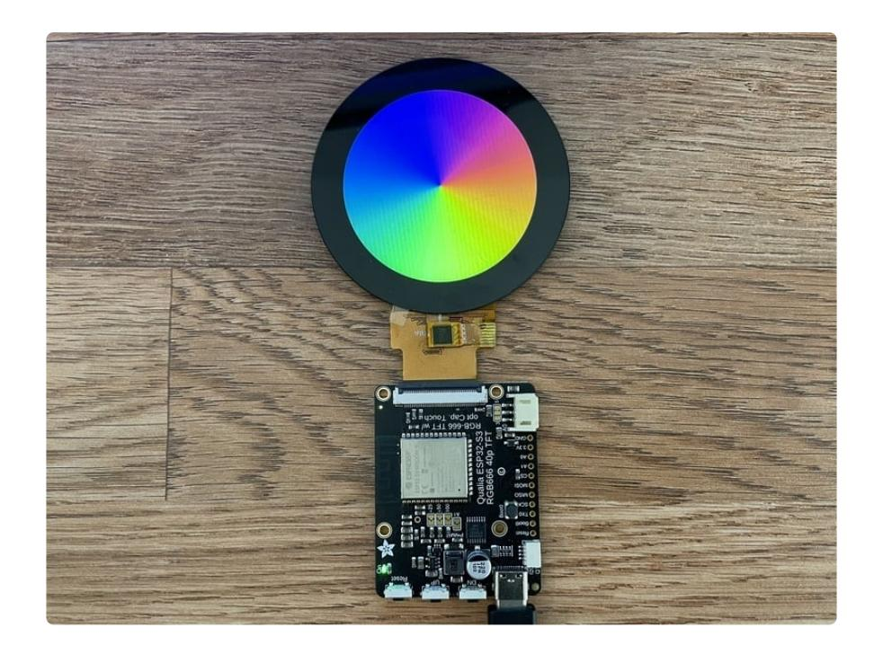

Here are some pre-compiled UF2s for various displays so you can instantly test them!

https://adafru.it/195f

https://adafru.it/195A

https://adafru.it/195E

https://adafru.it/196b

https://adafru.it/196c

©Adafruit Industries Page 226 of 252

https://adafru.it/196f

https://adafru.it/196C

720x720 test codes may be flickery as its compiled with IDF 4:

https://adafru.it/196F

https://adafru.it/197b

# <span id="page-226-0"></span>Arduino Product Demo

Here are demos from the product page available for the Qualia ESP32-S3 that run in Arduino. Below is the code.


This currently will not compile with version 3.0.0 of the ESP32 Board Support Package. Please use version 2 of the BSP.

```
// SPDX-FileCopyrightText: 2023 Limor Fried for Adafruit Industries
//
// SPDX-License-Identifier: MIT
#include <Arduino_GFX_Library.h>
#include "Adafruit_FT6206.h"
Arduino_XCA9554SWSPI *expander = new Arduino_XCA9554SWSPI(
    PCA_TFT_RESET, PCA_TFT_CS, PCA_TFT_SCK, PCA_TFT_MOSI,
    &Wire, 0x3F);
Arduino_ESP32RGBPanel *rgbpanel = new Arduino_ESP32RGBPanel(
```

©Adafruit Industries Page 227 of 252

```
TFT_DE, TFT_VSYNC, TFT_HSYNC, TFT_PCLK,
    TFT_R1, TFT_R2, TFT_R3, TFT_R4, TFT_R5,
    TFT_G0, TFT_G1, TFT_G2, TFT_G3, TFT_G4, TFT_G5,
    TFT_B1, TFT_B2, TFT_B3, TFT_B4, TFT_B5,
    1 /* hync_polarity */, 46 /* hsync_front_porch */, 2 /* hsync_pulse_width */,
44 /* hsync_back_porch */,
    1 /* vsync_polarity */, 50 /* vsync_front_porch */, 16 /* vsync_pulse_width */,
16 /* vsync_back_porch */);
Arduino_RGB_Display *gfx = new Arduino_RGB_Display(
/* 3.4" square */
// 480 /* width */, 480 /* height */, rgbpanel, 0 /* rotation */, true /* 
auto_flush */,
// expander, GFX_NOT_DEFINED /* RST */, tl034wvs05_b1477a_init_operations, 
sizeof(tl034wvs05_b1477a_init_operations));
/* 3.2" bar */
// 320 /* width */, 820 /* height */, rgbpanel, 0 /* rotation */, true /* 
auto_flush */,
// expander, GFX_NOT_DEFINED /* RST */, tl032fwv01_init_operations, 
sizeof(tl032fwv01_init_operations));
/* 4.0" 720x720 square */
// 720 /* width */, 720 /* height */, rgbpanel, 0 /* rotation */, true /* 
auto_flush */,
// expander, GFX_NOT_DEFINED /* RST */, NULL, 0);
/* 4.0" 480x480 square */
// 480 /* width */, 480 /* height */, rgbpanel, 0 /* rotation */, true /* 
auto_flush */,
// expander, GFX_NOT_DEFINED /* RST */, tl040wvs03_init_operations, 
sizeof(tl040wvs03_init_operations));
// 2.1" round
    480 /* width */, 480 /* height */, rgbpanel, 0 /* rotation */, true /* 
auto_flush */,
    expander, GFX_NOT_DEFINED /* RST */, TL021WVC02_init_operations,
sizeof(TL021WVC02_init_operations));
Adafruit_FT6206 ctp = Adafruit_FT6206(); // This library also supports FT6336U!
#define I2C_TOUCH_ADDR 0x15
bool touchOK = false;
void setup(void)
{
  //while (!Serial) delay(100);
#ifdef GFX_EXTRA_PRE_INIT
  GFX_EXTRA_PRE_INIT();
#endif
  Serial.println("Starting touch paint");
  // Init Display
  Wire.setClock(400000); // speed up I2C
  if (!gfx->begin()) {
    Serial.println("gfx->begin() failed!");
    while (1) yield();
  }
  gfx->fillScreen(BLACK);
  expander->pinMode(PCA_TFT_BACKLIGHT, OUTPUT);
  expander->digitalWrite(PCA_TFT_BACKLIGHT, HIGH);
  Serial.println("Hello!");
  gfx->fillScreen(BLACK);
  gfx->setCursor(100, gfx->height() / 2 - 75);
  gfx->setTextSize(5);
  gfx->setTextColor(WHITE);
  gfx->println("Hello World!");
```

©Adafruit Industries Page 228 of 252

```
gfx->setCursor(100, gfx->height() / 2 - 25);
  gfx->setTextColor(RED);
  gfx->println("RED");
  gfx->setCursor(100, gfx->height() / 2 + 25);
  gfx->setTextColor(GREEN);
  gfx->println("GREEN");
  gfx->setCursor(100, gfx->height() / 2 + 75);
  gfx->setTextColor(BLUE);
  gfx->println("BLUE");
  if (!ctp.begin(0, &Wire, I2C_TOUCH_ADDR)) {
    //gfx->setTextColor(RED);
    //gfx->println("\nTouch not found");
    Serial.println("No touchscreen found");
    touchOK = false;
  } else {
    gfx->setTextColor(WHITE);
    gfx->println("\nTouch found");
    Serial.println("Touchscreen found");
    touchOK = true;
  }
  expander->pinMode(PCA_BUTTON_UP, INPUT);
  expander->pinMode(PCA_BUTTON_DOWN, INPUT);
}
void loop()
{
  if (touchOK && ctp.touched()) {
    TS_Point p = ctp.getPoint(0);
    Serial.printf("(%d, %d)\n", p.x, p.y);
    gfx->fillRect(p.x, p.y, 5, 5, WHITE);
  }
  // use the buttons to turn off
  if (! expander->digitalRead(PCA_BUTTON_DOWN)) {
    expander->digitalWrite(PCA_TFT_BACKLIGHT, LOW);
  }
  // and on the backlight
  if (! expander->digitalRead(PCA_BUTTON_UP)) {
    expander->digitalWrite(PCA_TFT_BACKLIGHT, HIGH);
  }
}
```

This sketch was written for either of the 2.1" Round 480x480 RGB-666 displays.

Now upload the sketch to your Qualia ESP32-S3 and make sure a round display is connected. You may need to press the Reset button to reset the microcontroller. You should now see text appear on the display like in the image below.

©Adafruit Industries Page 229 of 252

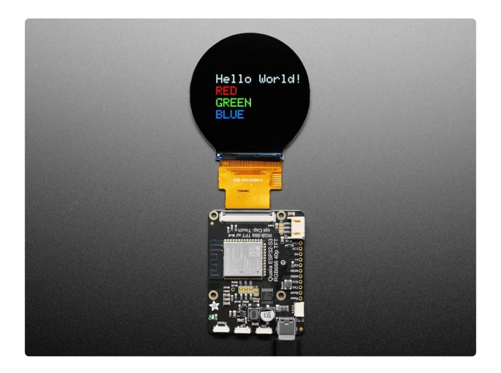

# <span id="page-229-0"></span>Arduino Touch Display Usage

If you have a display with touch, you can use the [Adafruit\\_FT6206\\_Library](https://github.com/adafruit/Adafruit_FT6206_Library) (https:// adafru.it/dGG) or [Adafruit\\_CST8XX\\_Library](https://github.com/adafruit/Adafruit_CST8XX_Library) (https://adafru.it/197e) library to read the touch data. The Capacitive Touch controller is communicated to by I2C. If you're not sure if you have a touch display, just check if your includes a square IC connected off to the side of the main ribbon cable.

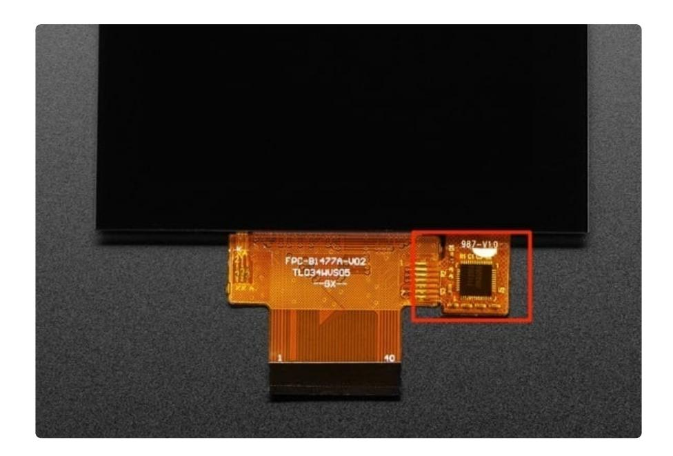

©Adafruit Industries Page 230 of 252

## Determining the I2C Address

You can scan for I2C devices by running the WireScan example. You can find it by going to File → Examples → Wire → WireScan and uploading the sketch. Once it is running, open the serial monitor to see which devices it finds.

You should see a couple of devices listed. These will be the GPIO expander and the touch controller. The GPIO Expander is at 0x3F by default, though it's possible to change the address with the solderable jumpers on the reverse side. The other address should be the touch controller. On most of the displays it should show up as 0x38 , but on other displays such as the TL040HDS20 4.0" square display, it shows up as 0x48 . On the 2.1" round display shows up as 0x15 and uses the CST826 chip instead.

## FocalTouch Controllers Initializing the Touch Controller

The FocalTouch controllers use Adafruit\_FT6206\_Library. In order to use the controller, it will need to first be initialized. You can use the following code to initialize it. If your I2C address differs, change it to the appropriate value.

```
#include <Wire.h> // this is needed for FT6206
#include <Adafruit_FT6206.h>
#define I2C_TOUCH_ADDR 0x48 // often but not always 0x48!
Adafruit_FT6206 ctp = Adafruit_FT6206(); // this library also supports FT5336U!
Serial.begin(115200); // To print the output
if (!ctp.begin(0, &Wire, I2C_TOUCH_ADDR)) {
   Serial.println("No touchscreen found");
}
```

©Adafruit Industries Page 231 of 252

## Reading from the Touch Controller

To read from the controller, check if is has been touched in the main loop and if so, read the x and y coordinates.

```
if (ctp.touched()) {
    TS_Point p = ctp.getPoint(0);
    Serial.printf("(%d, %d)\n", p.x, p.y);
}
```

## CST826 Touch Controller Initializing the Touch Controller

The CST Touch controller uses Adafruit\_CST8XX\_Library. In order to use the controller, it will need to first be initialized. You can use the following code to initialize it. If your I2C address differs, change it to the appropriate value.

```
#include <Wire.h>
#include <Adafruit_CST8XX.h>
#define I2C_TOUCH_ADDR 0x15
Adafruit_CST8XX ctp = Adafruit_CST8XX();
Serial.begin(115200); // To print the output
if (!ctp.begin(&Wire, I2C_TOUCH_ADDR)) {
   Serial.println("No touchscreen found");
}
```

## Reading from the Touch Controller

To read from the controller, check if is has been touched in the main loop and if so, read the x and y coordinates.

```
if (ctp.touched()) {
    CST_TS_Point p = ctp.getPoint(0);
    Serial.printf("(%d, %d)\n", p.x, p.y);
}
```

## Example

To see an example, check out the [Arduino Rainbow Demo Page](https://learn.adafruit.com/adafruit-qualia-esp32-s3-for-rgb666-displays/arduino-rainbow-demo) (https://adafru.it/197f).

©Adafruit Industries Page 232 of 252

# <span id="page-232-0"></span>Install UF2 Bootloader


If your board already has the UF2 bootloader, installed you do not need to follow the steps on this page. Try to enter the UF2 bootloader before continuing! Double-tap the reset button to do so.

The Qualia ESP32-S3 RGB-666 ships with a UF2 bootloader which allows the board to show up as TFT\_S3BOOT when you double-tap the reset button, and enables you to drag and drop UF2 files to update the firmware.

On ESP32-S2 and ESP32-S3, there is no bootloader protection for the UF2 bootloader. That means it is possible to erase or damage the UF2 bootloader, especially if you upload an Arduino sketch to an ESP32-S2/S3 board that doesn't "know" there's a bootloader it should not overwrite!

It turns out, however, the ESP32-S2/S3 comes with a second bootloader: the ROM bootloader. Thanks to the ROM bootloader, you don't have to worry about damaging the UF2 bootloader. The ROM bootloader can never be disabled or erased, so its always there if you need it! You can simply re-load the UF2 bootloader from the ROM bootloader.

If your UF2 bootloader ends up damaged or overwritten, you can follow the steps found in the [Factory Reset and Bootloader Repair](https://learn.adafruit.com/adafruit-qualia-esp32-s3-for-rgb666-displays/factory-reset#factory-reset-and-bootloader-repair-3107941) (https://adafru.it/197B) section of the Factory Reset page in this guide.

Once completed, you'll return to where the board was when you opened the package. Then you'll be back in business, and able to continue with your existing plans!

# <span id="page-232-1"></span>Factory Reset

The Qualia ESP32-S3 microcontroller ships running a circular rainbow gradient example for the round 480x480 display. It's lovely, but you probably had other plans for the board. As you start working with your board, you may want to return to the

©Adafruit Industries Page 233 of 252

original code to begin again, or you may find your board gets into a bad state. Either way, this page has you covered.

You're probably used to seeing the TFT\_S3BOOT drive when loading CircuitPython or Arduino. The TFT\_S3BOOT drive is part of the UF2 bootloader, and allows you to drag and drop files, such as CircuitPython. However, on the ESP32-S3 the UF2 bootloader can become damaged.

# Install the Factory Reset Firmware UF2

If you have a bootloader still installed - which means you can double-click to get the TFT\_S3BOOT drive to appear, then you can simply drag this UF2 file over to the BOOT drive.

To enter UF2 bootloader mode, plug in the board into a USB cable with data/sync capability. Press the reset button once, wait till the RGB LED turns purple, then quickly press the reset button again. (You are doing a "slow double-click"). Then drag this file over:

## https://adafru.it/1am8

Your board is now back to its factory-shipped state, running again with the original factory program. You can now begin again with your plans for your board.


Re-loading the factory reset UF2 isn't necessary to start over with the board, but it's a good way to show the board is working.

# UF2 Bootloader Installation and Repair

What if you tried double-tapping the reset button, and you still can't get into the UF2 bootloader? Whether your board shipped without the UF2 bootloader, or something damaged it, this section has you covered.

©Adafruit Industries Page 234 of 252


There is no protection for the UF2 bootloader. That means it is possible to erase or damage the UF2 bootloader, especially if you upload an Arduino sketch to an ESP32-S2/S3 board that doesn't "know" there's a bootloader it should not overwrite!

It turns out, however, the ESP32-S2/S3 comes with a second, built-in, bootloader, the ROM bootloader, which cannot be erased or damaged. You can always reload the UF2 bootloader using the ROM bootloader.

There are three ways to do a factory reset and bootloader repair. The first and easiest is to use the [OPEN INSTALLER](https://learn.adafruit.com/using-open-installer-on-circuitpython-org) button (https://adafru.it/1atf) on the page for your board on [circuitpython.org](https://circuitpython.org) (https://adafru.it/KJD). This method requires no manual downloads and guides you through the steps interactively. We highly recommend this method as your first choice.

The second method is to use the browser-based Adafruit WebSerial ESPTool, and the third is to use esptool.py via the command line.

For both OPEN INSTALLER and the Adafruit WebSerial tool, you must use a Chromium-based browser such as Chrome, Edge, Opera, or Chromium.


Installing the UF2 bootloader will erase everything on your board, including CircuitPython, any Arduino program, and any files stored in flash! Be sure to back up your data first.

©Adafruit Industries Page 235 of 252

## OPEN INSTALLER Method for UF2 Bootloader Installation

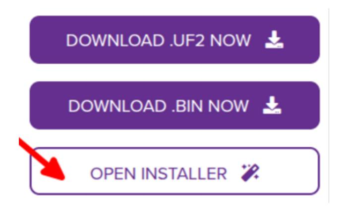

The OPEN INSTALLER button on [circuitpyt](https://circuitpython.org/) [hon.org](https://circuitpython.org/) (https://adafru.it/EFq) is the easiest way to install or update the UF2 bootloader. See the Learn Guide [Using the](https://learn.adafruit.com/using-open-installer-on-circuitpython-org) [OPEN INSTALLER Button on](https://learn.adafruit.com/using-open-installer-on-circuitpython-org) [circuitpython.org](https://learn.adafruit.com/using-open-installer-on-circuitpython-org) (https://adafru.it/1atf) for all the details.

## Adafruit WebSerial ESPTool and esptool.py Methods for UF2 Bootloader Installation

The other methods for bootloader installation require you to download the bootloader yourself. The next section walks you through the prerequisite steps needed for both of these methods.

## Step 1. Download the UF2 Bootloader .bin File for your board

Clik on the green button below to download the .bin file you need (there may be more than one listed), and save wherever is convenient for you. You will need to be able to access the file from the Adafruit WebSerial ESPTool or another upload method.


Note that this file is approximately 3MB. This is not because the bootloader is that large, but because the bootloader needs to write data at both the beginning and end of flash. Most of the file is empty.

https://adafru.it/1am9

©Adafruit Industries Page 236 of 252

## Step 2. Enter ROM bootloader mode

Entering the ROM bootloader is easy. Complete the following steps.

Before you start, make sure your ESP32-S2/S3 is plugged into USB port to your computer using a data/sync cable. Charge-only cables will not work!

To enter the bootloader:

- Press and hold the BOOT/DFU button down. Don't let go of it yet! 1.
- Press and release the Reset button. You should still have the BOOT/DFU button pressed while you do this. 2.
- Now you can release the BOOT/DFU button. 3.

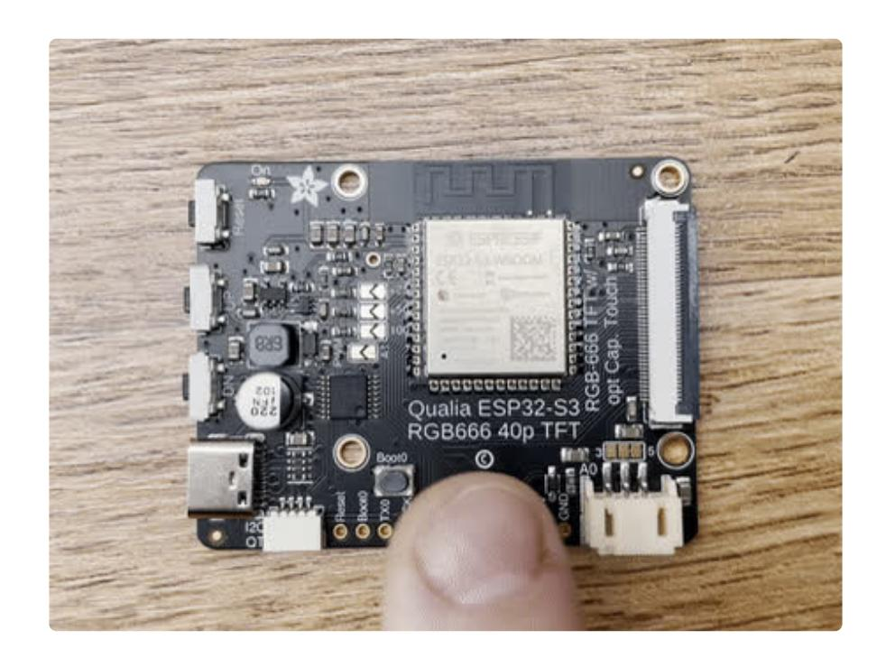

No USB drive will appear when you've entered the ROM bootloader. This is normal!

Now that you've downloaded the .bin file and entered the ROM bootloader, you're ready to continue installing the UF2 bootloader. The next two sections walk you through using the Adafruit WebSerial ESPTool (Alternative A) or esptool.py (Alternative B).

(There is also an Alternative C below, using the Arduino IDE, but it is less desirable, because it does not allow you to choose the bootloader that will be used.)

©Adafruit Industries Page 237 of 252

## Step 3: Alternative A. The Adafruit WebSerial ESPTool Method


We highly recommend using the Adafruit WebSerial ESPTool method to perform a factory reset and bootloader repair. However, if you'd rather use **esptool.py** via the command line, you can skip this section and use Alternative B instead.

This method uses the Adafruit WebSerial ESPTool through Chrome or a Chromiumbased browser (including Opera and Edge). Adafruit WebSerial ESPTool is a webbased option for programming ESP32-S2/S3 boards. It allows you to erase the the microcontroller flash and program up to four files at different offsets.

You have to use a Chromium-based browser (Chrome, Opera, Edge, etc.) for this to work. Safari and Firefox are not supported because they don't have adequate support for Web Serial functionality.

Follow the steps below to flash the UF2 bootloader.


If you're using Chrome 88 or older, see the Older Versions of Chrome section at the end of this page for instructions on enabling Web Serial.

## Connect

You should have plugged in only the ESP32-S2/S3 that you intend to flash. That way there's no confusion in picking the proper port when it's time!

©Adafruit Industries Page 238 of 252


In the Chrome browser visit [https://](https://adafruit.github.io/Adafruit_WebSerial_ESPTool/) [adafruit.github.io/](https://adafruit.github.io/Adafruit_WebSerial_ESPTool/) [Adafruit\\_WebSerial\\_ESPTool/](https://adafruit.github.io/Adafruit_WebSerial_ESPTool/) (https:// adafru.it/PMB). You should see something like the image shown.

Leave the No reset for Passthrough updates toggle off.

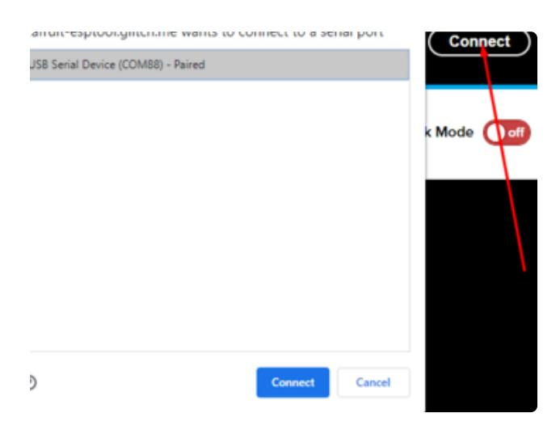

Press the Connect button in the top right of the web browser. You will get a pop up asking you to select the COM or Serial port.

Remember, you should remove all other USB devices so only the ESP32-S2/S3 board is attached, that way there's no confusion over multiple ports!

On some systems, such as MacOS, there may be additional system ports that appear in the list.

The JavaScript code will now try to connect to the ROM bootloader. It may timeout for a bit until it succeeds. On success, you will see that it is Connected and will print out a unique MAC address identifying the board along with other information that was detected.

©Adafruit Industries Page 239 of 252

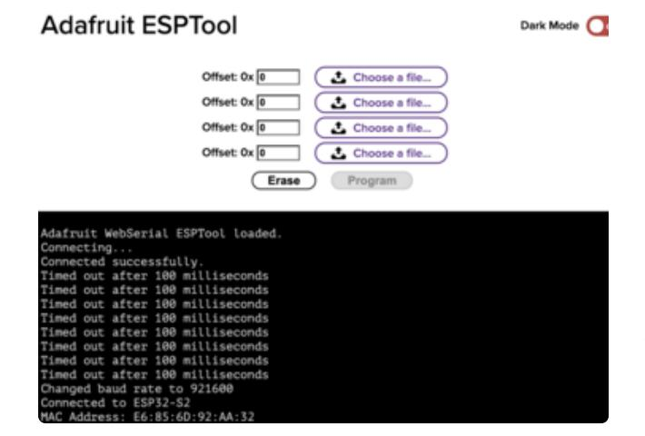

Once you have successfully connected, the command toolbar will appear.

## Erase the Contents of Flash

This will erase everything on your board! If you have access, and wish to keep any code, now is the time to ensure you've backed up everything.

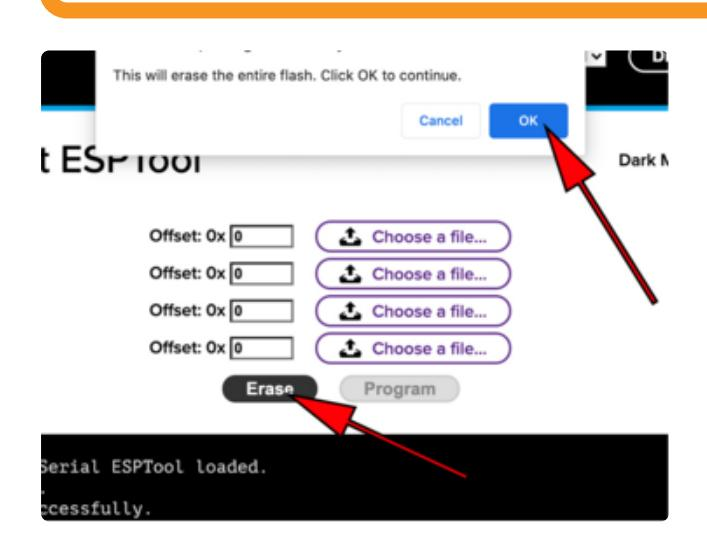

To erase the contents, click the Erase button. You will be prompted whether you want to continue. Click OK to continue or if you changed your mind, just click cancel.

©Adafruit Industries Page 240 of 252

You'll see "Erasing flash memory. Please wait..." This will eventually be followed by "Finished." and the amount of time it took to erase.

Do not disconnect! Immediately continue on to programming the ESP32-S2/S3.


Do not disconnect after erasing! Immediately continue on to the next step!

## Flash the Bootloader .bin File

Programming the ESP32-S2/S3 can be done with up to four files at different locations, but with the board-specific bootloader .bin file, which you should have downloaded under Step 1 on this page, you only need to use one file.

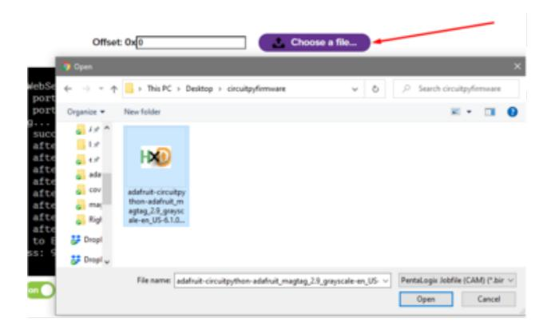

Click on the first Choose a file.... (The tool will only attempt to program buttons with a file and a unique location.) Then, select the bootloader .bin file you downloaded in Step 1 that matches your board.

Verify that the Offset box next to the file location you used is (0x) 0.

©Adafruit Industries Page 241 of 252

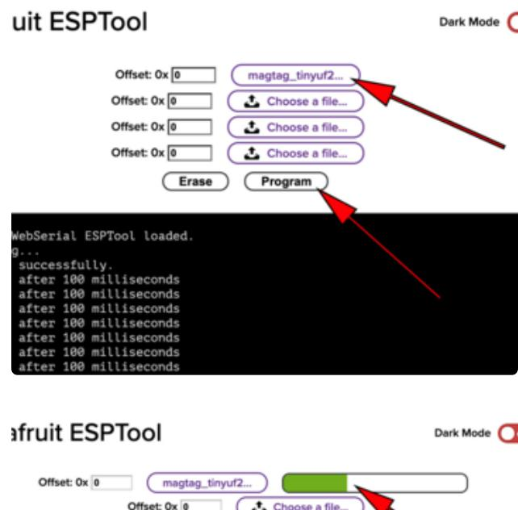

Once you choose a file, the button text will change to match your filename. You can then select the Program button to begin flashing.

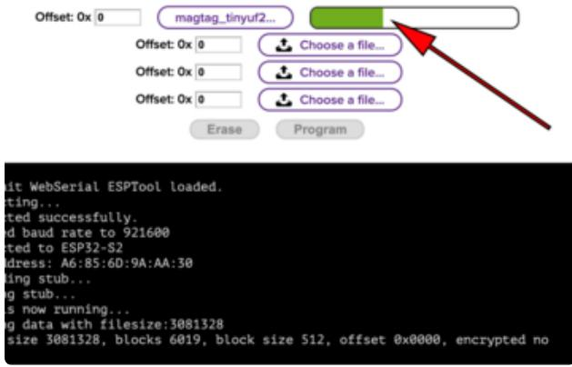

A progress bar will appear and after a minute or two, you will have written the firmware.

Once completed, you can skip down to the section titled Reset the Board.

## Step 3: Alternative B. The esptool.py Method (for advanced users)


If you used Adafruit WebSerial ESPTool, you do not need to complete the steps in this section!

Once you have entered ROM bootloader mode, you can then [use Espressif's esptool](https://github.com/espressif/esptool) [program](https://github.com/espressif/esptool) (https://adafru.it/E9p) to communicate with the chip! esptool is the 'official' programming tool and is the most common/complete way to program an ESP chip.

©Adafruit Industries Page 242 of 252

## Install esptool.py

You will need to use the command line or Terminal to install and run esptool .

You will also need to have pip and Python installed (any version!).

Install the latest version using pip (you may be able to run pip without the 3 depending on your setup):

```
pip3 install --upgrade esptool
```

Then, you can run:

esptool.py


Make sure you are running esptool v3.0 or higher, which adds ESP32-S2/S3

## Test the Installation

Run esptool.py in a new terminal/command line and verify you get something like the below:

## Find the Serial Port

First, you need to determine the name of the serial port you board has when it's plugged in and ROM bootloader mode.

- For Windows, it will be a COM port, such as COM5 . Look in Device Manager -> Ports. •
- For macOS, you can do ls /dev/tty.\* in a Terminal to find the names of the serial ports. •

©Adafruit Industries Page 243 of 252

For Linux, you can do ls /dev/tty\* in a terminal window. The name is often / dev/ttyACM0 or similar. •

If you are not sure you've found the right port, unplug the board, and see if the port disappears.

For more information on determining serial ports, follow these links for help on [Windows](https://learn.adafruit.com/welcome-to-circuitpython/advanced-serial-console-on-windows#whats-the-com-2977217) (https://adafru.it/AAH), [macOS](https://learn.adafruit.com/welcome-to-circuitpython/advanced-serial-console-on-mac-and-linux#whats-the-port-2977243) (https://adafru.it/AAI), or [Linux](https://learn.adafruit.com/welcome-to-circuitpython/advanced-serial-console-on-linux#whats-the-port-3104855) (https:// adafru.it/VAO).

## Connect

Run the following command, replacing the identifier after --port with the COMxx , / dev/cu.usbmodemxx or /dev/ttySxx you found above.

For example, if you're using Windows, and you think the board is on COM88, type this following:

```
esptool.py --port COM88 chip_id
```

You should get a notice that it connected over that port and found an ESP32-S2/S3.

## Erase the Flash

Before programming the board, it is a good idea to erase the flash. Run the following command.

```
esptool.py --port COM88 erase_flash
```

You must be connected (by running the command in the previous section) for this command to work as shown.

©Adafruit Industries Page 244 of 252

## Flash the UF2 Bootloader

Run this command and replace the serial port name with your matching port and the file you just downloaded

```
esptool.py --port COM88 write_flash 0x0 tinyuf2-some-board-0.32.0-
combined.bin
```

Don't forget to change the --port name to match.


Adjust the bootloader filename accordingly if it differs from tinyuf2-someboard-0.32.0-combined.bin .

There might be a bit of a 'wait' when programming, where it doesn't seem like it's working. Give it a minute, it has to erase the old flash code which can cause it to seem like it's not running.

You'll finally get an output like this:

©Adafruit Industries Page 245 of 252

Once completed, you can continue to the next section.

## Step 4. Reset the board

The board should restart automatically, and start up the UF2 bootloader. If not, press the reset button to start the bootloader.

If you have a 480x480 round display plugged in, you should see a circular rainbow gradient appear on the display.

You've successfully returned installed the UF2 bootloader on your board. If you now want to return the board to a factory reset state, follow the instructions at the top of the page to Install the Factory Reset Firmware UF2.

## Older Versions of Chrome


As of chrome 89, Web Serial is already enabled, so this step is only necessary on older browsers.

We suggest updating to Chrome 89 or newer, as Web Serial is enabled by default.

If you must continue using an older version of Chrome, follow these steps to enable Web Serial.

©Adafruit Industries Page 246 of 252

If you receive an error like the one shown when you visit the Adafruit WebSerial ESPTool site, you're likely running an older version of Chrome.

You must be using Chrome 78 or later to use Web Serial.

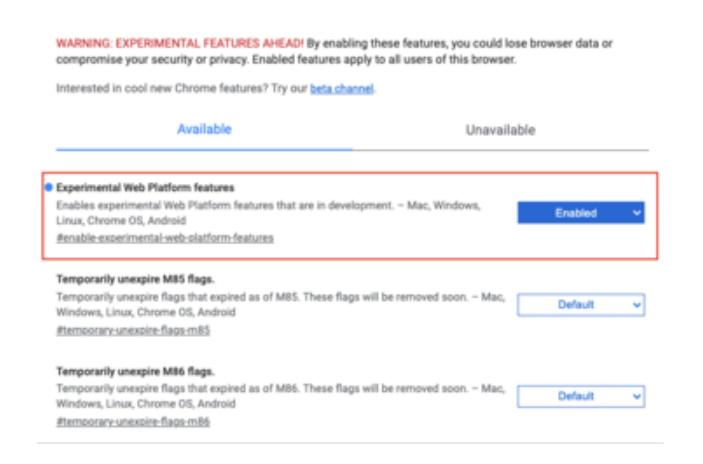

To enable Web Serial in Chrome versions 78 through 88:

Visit chrome://flags from within Chrome. Find and enable the Experimental Web Platform features Restart Chrome

# Step 3: Alternative C. The Flash an Arduino Sketch Method

This section outlines flashing an Arduino sketch onto your ESP32-S2/S3 board, which automatically installs the UF2 bootloader as well. However, it does not allow you to choose which UF2 bootloader to install, so Alternative A or B above are preferred.

## Arduino IDE Setup

If you don't already have the Arduino IDE installed, the first thing you will need to do is to download the latest release of the Arduino IDE. ESP32-S2/S3 requires version 1.8 or higher. Click the link to download the latest.

https://adafru.it/Pd5

©Adafruit Industries Page 247 of 252

After you have downloaded and installed the latest version of Arduino IDE, you will need to start the IDE and navigate to the Preferences menu. You can access it from the File > Preferences menu in Windows or Linux, or the Arduino > Preferences menu on OS X.

The Preferences window will open.

In the Additional Boards Manager URLs field, you'll want to add a new URL. The list of URLs is comma separated, and you will only have to add each URL once. The URLs point to index files that the Board Manager uses to build the list of available & installed boards.

Copy the following URL.

https://raw.githubusercontent.com/espressif/arduino-esp32/gh-pages/ package\_esp32\_dev\_index.json

Add the URL to the the Additional Boards Manager URLs field (highlighted in red below).

|                               | Preferences                                                                |
|-------------------------------|----------------------------------------------------------------------------|
|                               | Settings Network                                                           |
| ketchbook location:           |                                                                            |
| /Users/kattni/AdafruitDev/A   | Arduino Sketches Browse                                                    |
| ditor language:               | System Default (requires restart of Arduino)                               |
| ditor font size:              | 12                                                                         |
| nterface scale:               | ☑ Automatic 100 0% (requires restart of Arduino)                           |
| heme:                         | Default theme 💲 (requires restart of Arduino)                              |
| how verbose output during:    | compilation upload                                                         |
| Compiler warnings:            | None 🗘                                                                     |
| Display line numbers          | Enable Code Folding                                                        |
| Verify code after upload      | Use external editor                                                        |
| Check for updates on sta      | rtup Save when verifying or uploading                                      |
| Use accessibility features    |                                                                            |
| Additional Boards Manager UF  | RLs: ent.com/espressif/arduino-esp32/gh-pages/package_esp32_dev_index.json |
| More preferences can be edite |                                                                            |
|                               | o15/preferences.txt                                                        |
| Users/kattni/Library/Arduin   |                                                                            |

Click OK to save and close Preferences.

In the Tools > Boards menu you should see the ESP32 Arduino menu. In the expanded menu, it should contain the ESP32 boards along with all the latest ESP32- S2 boards.

Now that your IDE is setup, you can continue on to loading the sketch.

©Adafruit Industries Page 248 of 252

## Load the Blink Sketch

In the Tools > Boards menu you should see the ESP32 Arduino menu. In the expanded menu, look for the menu option for the Adafruit Qualia ESP32-S3 RGB666, and click on it to choose it.

Open the Blink sketch by clicking through File > Examples > 01.Basics > Blink.

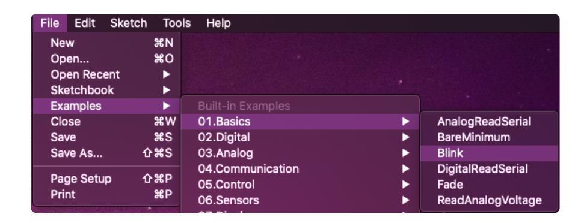

For the Arduino IDE to upload TinyUF2 you must select a TinyUF2 partition layout, under the Tools > Partition Scheme menu.

If you have a 4MB board, won't be doing Over-The-Air firmware updates (OTA), or are unsure, then choose the 'No OTA' TinyUF2 entry.

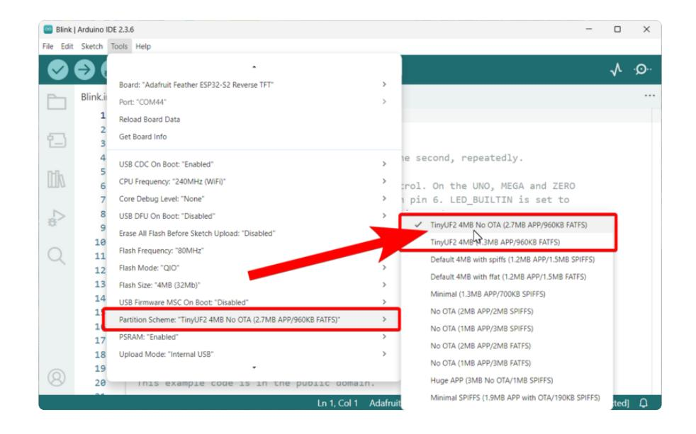

Finally, click Upload from the sketch window.

©Adafruit Industries Page 249 of 252

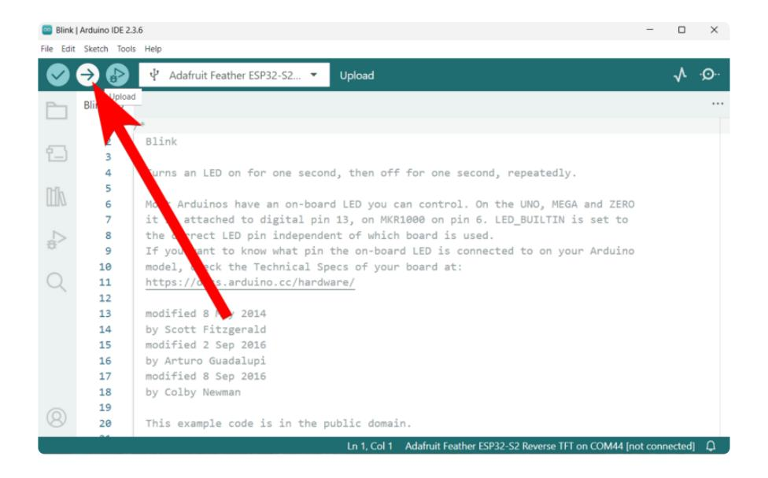

Once successfully uploaded, the little red LED will begin blinking once every second. At that point, you can now enter the bootloader.


The Qualia ESP32-S3 RGB-666 does not have a little red LED, so the default Blink sketch will fail.

If you change LED\_BUILTIN to 13 , the sketch will compile and upload. Be aware that, once the sketch is loaded, nothing will happen on the board. However, you will have a bootloader. The updated code would look like this:

```
void setup() {
 pinMode(13, OUTPUT);
}
void loop() {
 digitalWrite(13, HIGH);
 delay(1000); 
 digitalWrite(13, LOW); 
 delay(1000); 
}
```

Alternatively, you could load a different sketch. It doesn't matter which sketch you use.

©Adafruit Industries Page 250 of 252

# <span id="page-250-0"></span>Downloads

- [ESP32-S3 product page with resources](https://www.espressif.com/en/products/socs/esp32-s3) (https://adafru.it/ZAS) •
- [ESP32-S3 datasheet](https://cdn-learn.adafruit.com/assets/assets/000/110/711/original/esp32-s3_datasheet_en.pdf?1649790878) (https://adafru.it/ZAT) •
- [ESP32-S3 Technical Reference](https://cdn-learn.adafruit.com/assets/assets/000/110/710/original/esp32-s3_technical_reference_manual_en.pdf?1649790877) (https://adafru.it/ZAU) •
- [ST7701 datasheet](https://cdn-shop.adafruit.com/product-files/5795/ST7701+Datasheet.pdf) (http://adafru.it/57957701) •
- [NV3052C datasheet](https://cdn-shop.adafruit.com/product-files/5793/NV3052C-Datasheet-V0.2.pdf) (http://adafru.it/5793305202) •
- [3D models on GitHub](https://github.com/adafruit/Adafruit_CAD_Parts/tree/main/5800%20Qualia%20ESP32-S3) (https://adafru.it/198d) •
- [Qualia ESP32-S3 RGB-666 EagleCAD PCB files on GitHub](https://github.com/adafruit/Adafruit-Qualia-S3-RGB666-PCB) (https://adafru.it/198e) •
- [Qualia ESP32-S3 RGB-666 Fritzing object in the Adafruit Fritzing Library](https://github.com/adafruit/Fritzing-Library/raw/master/parts/Adafruit%20Qualia%20S3%20RGB666.fzpz) (https:// adafru.it/198A) •

## Schematic

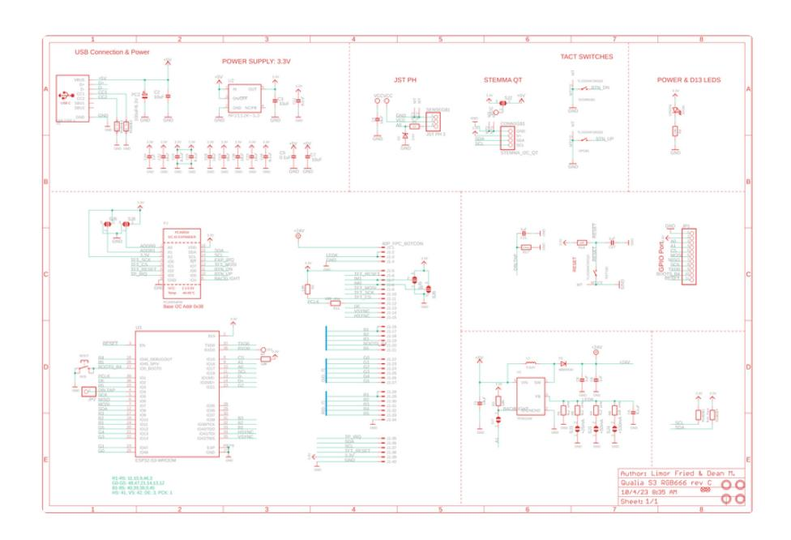

©Adafruit Industries Page 251 of 252

## Fab Print

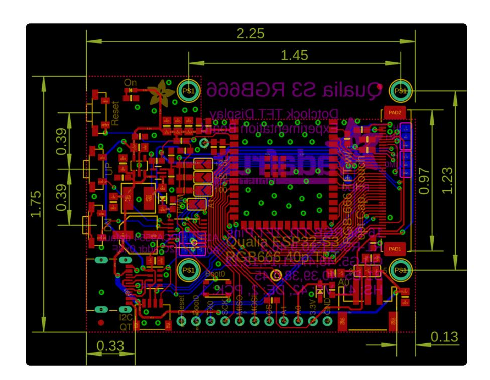

©Adafruit Industries Page 252 of 252